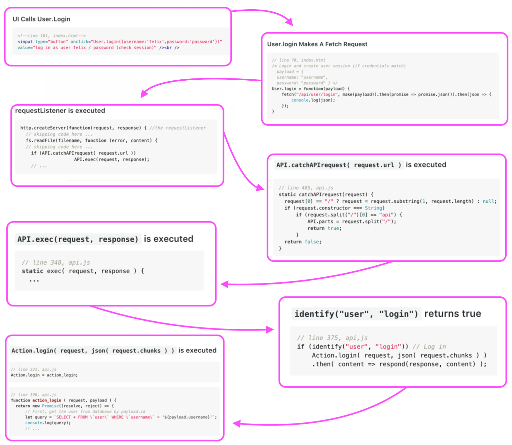
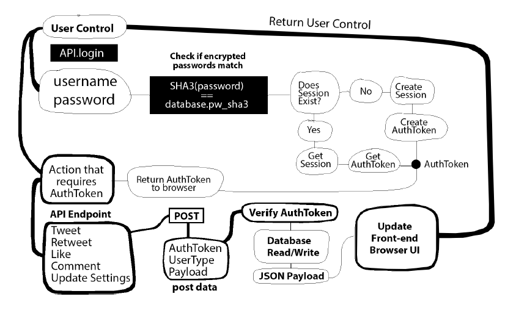

## Day 93, R2
### 7/12/19

- ## Node
  Continuing with Greg's book, [Node.js – Server Setup](https://www.patreon.com/posts/node-api-source-27588087).

  ### A reminder of what we're trying to do:

  The [Node.js – Server Setup](https://www.patreon.com/posts/node-api-source-27588087) finished files ***don't work***. They don't call the function that creates the session and token, `action_create_session`. 
  
  Instructions on how to call `action_create_session` were absent from the book. So we're trying to figure out where and when to call this function so we can get the code working.

  ## Chain Of Events
  Here's our chain of events we figured out yesterday:

  

  ## Creating A Session

  Yesterday, I thought that in order to create a session, we need to add a method on the `User` class (*line 10, index.html*) that fetches `api/create/session`. This would call the function `action_create_session`.

  ```javascript
  //  line 392, api.js
  if (identify("session", "create")) // Create session
      Action.create_session( request, json( request.chunks ) )
      .then( content => respond(response, content) );
  ```
  ```javascript
  // line 233, api.js
  function action_create_session( request, payload ) {
    // Create unique authentication token
    function create_auth_token() {
      let token = md5( timestamp( true ) + "");
        return token;
    } 
    //... more code
  ```

  However, I looked at this diagram in [Node.js – Server Setup](https://www.patreon.com/posts/node-api-source-27588087):

  

  Here, the session is created after the user logs in. So I think `action_create_session` has to be traced to the `action_login` call.

  ## Questions
  
  ### When should we call `action_create_session`?

  - Do we first call `action_get_session`? 
    ### `action_get_session` is also never called anywhere in the finished files. This looks like a mistake. When do we call it?
    - Do we call it to see if there's a session, and then if there isn't we call `action_create_session`?
      - No, I don't think so. I think the answer is in the diagram.
        
        - 1\. We figure out if the session exists
        - 2\. **If yes**: `action_get_session()`, then we somehow get the the AuthToken (what function does "Get AuthToken" refer to? `action_authenticate_user`?). 
       
              **If no**: `action_create_session()`, which calls `create_auth_token()`.
        - In the diagram this all happens after we "**Check if encrypted passwords match**", so 
          ### Do we put an if statement in the login to see if the session exists? How do we query from the javascript to mysql to figure that out?

  ## Calling `action_create_session()`
  I called `action_create_session(request, payload)` inside `action` login on line 218: 
  ```javascript
  // line 218, api.js
  action_create_session(request, payload); //add session--should be conditional but just adding for now, Dash
  ```

  But I got an error:
  ```bash
  Error: ER_TRUNCATED_WRONG_VALUE: Incorrect datetime value: '1562952357' for column 'timestamp' at row 1
  ```

  That's we're I'll leave off.
  