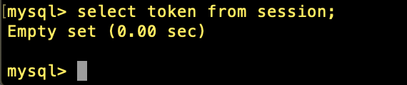
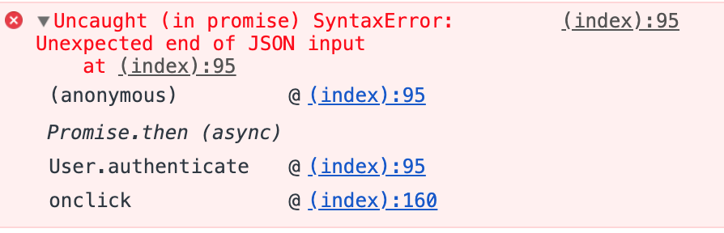
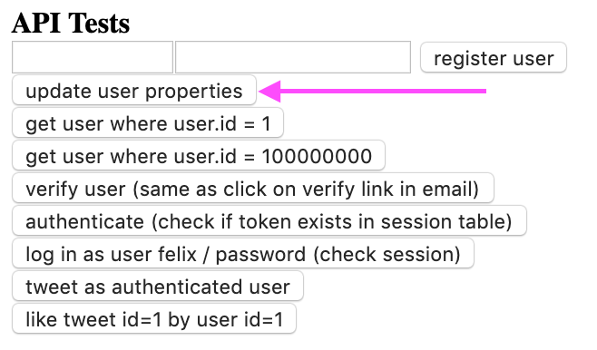

## Day 88, R2
### 7/7/19

- ## Node
  Continuing with Greg's book, [Node.js – Server Setup](https://www.patreon.com/posts/node-api-source-27588087).

  ## Token Error
  After pressing **"login as felix"** I tested the **"authenticate (check if token exists in session table)"** and I got this error:

  ```bash
  request  /api/user/authenticate
  API.exec(), parts =  [ 'api', 'user', 'authenticate' ]
  API.authenticate, results.length == 0 (session with token not found)
  {"success": false, "message": "token not found in session"}
  responding =  [ undefined ]
  ```

  In the console:

  

  Looking in the database there is no token:
  


  ## Test Token?
  I noticed that in index.html, the **"authenticate (check if token exists in session table)"** button sends an object with a test token to User.authenticate.

  ```html
  <input type="button" onclick="User.authenticate({token:'token_test_12345'})"
  value="authenticate (check if token exists in session table)" /><br />
  ```

  But how is this test token supposed to be in our session table? It was never put there.

  ## When is The Token Added?

  Reading these comments, it looks like the function `User.update()` in index.html is supposed to add the token:
  ```javascript
  /* Update user table in database
      payload = {
      id: 1,
      token: "ABC123xyz" } */
  User.update = function(payload) {
      fetch("/api/user/update", make(payload)).then(promise => promise.json()).then(json => {
          console.log(json);
      });
  }
  ```

  User update gets called in the button **"update user properties"**:

  

  But in the code the payload ***doesn**'t contain `token`*:
  ```html
  <input type="button" onclick="User.update({id: 1, password_sha3: 'newpass123A'})"
  value="update user properties" /><br />
  ```

  It just send the `id` and `password_sha3`. Where's `token`?
  ```javascript
  User.update({id: 1, password_sha3: 'newpass123A'})
  ```

  `password_sha3` isn't even a field anywhere in our database. The code used an md5 hash. So I had added `password_md5` to the table. Are we supposed to have both `password_md5` and `password_sha3`?

  Looking through the code, `password_sha3` is never used. So I think sending `password_sha3` in the payload is a mistake. The payload shouldn't have `password_sha3`. But which should it have: `password_md5` or `token`?

  ## Update User
  
  I changed `password_sha3: 'newpass123A'` to `token:'token_test_12345'`:
  ```html
  <input type="button" onclick="User.update({id: 1, token:'token_test_12345'}" value="update user properties" /><br />
  ```
  But I still get an error:
  ```
  request  /api/user/authenticate
  API.exec(), parts =  [ 'api', 'user', 'authenticate' ]
  API.authenticate, results.length == 0 (session with token not found)
  {"success": false, "message": "token not found in session"}
  responding =  [ undefined ]
  ```

  I console logged the query to see what's actually going on when we update the user:
  ```sql
  UPDATE user SET `id` = '1' WHERE `id` = '1'
  ```

  Where does it add the token? It's only updating `id` but it's just setting it to the same id?

  I changed `token:'token_test_12345'` back to `password_sha3: 'newpass123A'`.

  ## More About Update
  ```sql
  UPDATE table_name
  SET column1 = value1, column2 = value2, ...
  WHERE condition;
  ```
  -*[SQL UPDATE Statement](https://www.w3schools.com/sql/sql_update.asp)*

  ## Clarify Questions
  I'm confused, so I'm going to clarify my questions to get a better idea of where to go next.

  ### Questions:

  - ### What part of the code is supposed to be adding the token?
    - `action_update_user ( request, payload )` or `action_create_session( request, payload )`?
    - It looks like it's `action_create_session( request, payload )` but I don't see anything in the UI that calls this function. That leads me to the question:
      - ### What part of our code calls `action_create_session( request, payload )`?
  - ### Why does `User.update()` set the `id = '1'` to `id = '1'`? 
    - Possible answer: if there were more users it would change the id?

  ## Tracing Where Create Session Gets Called
  The function itself in api.js on line 233:
  ```javascript
  function action_create_session( request, payload ) {
    // Create unique authentication token
    function create_auth_token() {
        let token = md5( timestamp( true ) + "");
        return token;
    } //...
  ```
  A reference to the function in api.js on line 336:
  ```javascript
  Action.create_session = action_create_session;
  ```

  The reference getting called conditionally in api.js on line 392:
  ```javascript
  if (identify("session", "create")) // Create session
    Action.create_session( request, json( request.chunks ) )
    .then( content => respond(response, content) );
  ```
  This is where I left off.
  

- ## Thoughts And Feelings:
  I am super sleep deprived from the drive over to Chicago, but I still did ok with my studying. Now that I'm at home, I'm going to set up a second monitor. I think that will help me.

  After listing out my questions, I realized how confusions happens. It happens when I have many questions that depend on the answers of other questions. Nested questions.

  I coded in the dining room and despite constantly requesting that my family not interupt my study, they kept interrupting me. Example:
  
    >Dad: Did you hear about the dish washing machine?
    >
    >Me: Dad, I really need to concentrate. But no I didn't, you can tell me but then please let me focus.
    >
    >Dad: Oh ok. It broke and we had to get a new one.
    >
    >Me: OK, now can you let me focus. I really want to get this done.
    >
    >Dad: Ok. 
    >
    >Two seconds later(not an exaggeration)
    >
    >Dad: \*\****whispers***** *Do you need an extra phone charger? I'm not using this one.* \*\****whispers*****
    >
    >Me: Dad, please I'm trying to focus!

    And this went on and on. Basically:
    ```javascript
    while (Dashie.IsInDiningRoom){
      family.interrupt(Dashie);
    }
    ```
    So I decided to just go upstairs away from everybody. That's what I'll have to do in the future.

    I got stuck again today, but I tried to remember that getting stuck is par for the course. I shouldn't let it stress me. When I get stuck I just need pivot to a new area to look at: either closer in to the details, or further out to a broader idea. I will learn more concepts even when I'm stuck. All day I was stuck, but I still learned so much.
