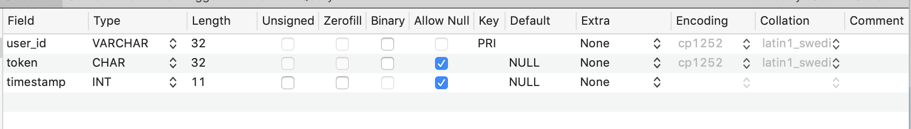
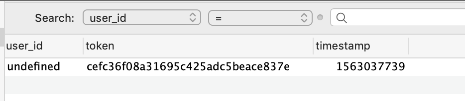
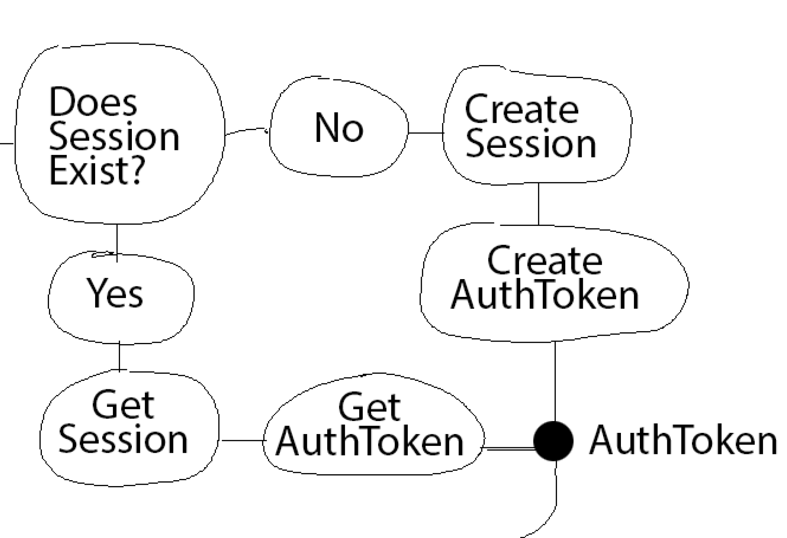

## Day 95, R2
### 7/13/19

- ## Node
  Continuing with Greg's book, [Node.js – Server Setup](https://www.patreon.com/posts/node-api-source-27588087).
  
  ### Where we left off:
  The [Node.js – Server Setup](https://www.patreon.com/posts/node-api-source-27588087) finished files ***don't work***. They don't create a session. So I've been working on that.
  
  I had an error that had to do with the format of the timestamp when the `timestamp` function was called to create a timestamp to add to the `session` table.

  I changed the parameter of the `timestamp` function from `undefined` to `true`. But I still wondered: 
  - Should I instead change the data type of `timestamp` in the `session` table to a a "linux-length timestamp"? 
  - Or should I keep my changes I made today: changing the parameter of the `timestamp` function from `underfined` to `true`?

  I also need to look at my primary key error.

  ## Linux-length Timestamp
  Data type for a unix timestamp: 

  **int(11)**
  
  [What is the data type for unix_timestamp (MySQL)?](https://stackoverflow.com/questions/4125947/what-is-the-data-type-for-unix-timestamp-mysql).

  ## New Fix For Timestamp Error
  I changed the data type of `timestamp` to `int(11)`:

  

  And I changed the `timestamp(true)` call on line 260 back to it's original call, `timestamp()`
    ```javascript
  // line 260 col 131, api.js (database.connection.query)
  timestamp() + "', '" + token + "')"
  ```

  This is another way to fix the timestamp error. This is probably the correct way because this second way changes my `session` table, which I created without the book. So my `session` table is more likely to have errors than the downloaded github files for the project.

  ## Primary Key Error
  I have this error now:
  ```bash
  ER_DUP_ENTRY: Duplicate entry 'undefined' for key 'PRIMARY'
  ```
  
  ## Records In Session
  I looked at the records in the `session` table. `user_id` is getting saved as `undefined`:

  
  The timestamp [correlates](https://www.epochconverter.com/) to yesterday: 

  - Saturday, July 13, 2019 12:08:59 PM GMT-05:00 DST

  So the first time my code worked, it saved the session `user_id` as `undefined`. Even if it saved the session `user_id` correctly as `felix`, we might still get an error. I think it would just say:
  ```bash
  ER_DUP_ENTRY: Duplicate entry 'felix' for key 'PRIMARY'
  ``` 

  So we need to do two things:
  - get the code to save the correct user id
  - add conditionals to see if the session exists.

  ## `user_id` 
  First, I'm going to see where user id is saving as `undefined`.

  The trace says that the issue happens here:
  ```bash
  at Query.<anonymous> (/Users/dashiellbark-huss/Documents/100daysofcode/node-master/module/api/api.js:260:37)
  ```

  So the issue happens at the query from yesterday's issue:
  ```javascript
  // line 260, api.js
  database.connection.query("INSERT INTO session ( `user_id`, `timestamp`, `token`) VALUES( '" + payload.id + "', '" + timestamp() + "', '" + token + "')",
    (error, results) => {
        if (error) throw(error);
        resolve(`{"found" : false,
                  "token" : token,
                  "user_id": ${payload.user_id},
                  "message": "session was created"}`);
    });
  ```

  Sure enough, logging `console.log(payload.id);` right before the query, logs `undefined`. I logged logging `console.log(payload);` and got
  ```bash
  { username: 'felix', password: 'password' }
  ``` 

  There is no `id` in this payload object. Just `username`.

  Both `payload.id` and `payload.username` are used in the code. I'm going to change  `payload.id` to `payload.username`. I'll probably have to do this multiple times because it's used in other functions too.

  ## Solved
  I changed `payload.id` to `payload.username` on lines 248, 252, and 262. Now it's sending the right username to the database. It's not giving me the duplicate error either. 
  
  I'm surprisingly not creating duplicate sessions for the same user. I thought this would be our next error. But there's a conditional in `action_create_session` that stops the code from adding duplicate entries.
  
  ## Next
  I think we might have to add `if` statements for conditionally executing the `action_create_session` or `action_get_session` because that's what the diagram from the book showed:
  
  
  
  Right now the code is working. I'm not sure the point of `action_get_session`  because there's similar code that's conditionally executed in `action_create_session`.

  So I'm going to focus on getting the **authenticate (check if token exists in session table)** button to work. Right now it's giving me an error.

  ```bash
  API.authenticate, results.length == 0 (session with token not found)
  {"success": false, "message": "token not found in session"}
  responding =  [ undefined ]
  ```

  ## Test Token
  I realized the error is happening because the UI sends a payload with a test token:

  ```javascript
  // line 156, col 56, index.html
  {token:'token_test_12345'}
  ```

  Obviously, this does not match the session token in my database, which is a long string of numbers and letters.
  
  ## Refreshing Issue
  I changed the token to the token in my session table

   ```javascript
  // line 156, col 56, index.html
  {token:'bb6cd80836ece403dd33c004f7a44271'})
  ```

  It's still not working but it looks like it's some sort of error that has to do with the code not refreshing because the payload is still logging as `{ token: 'token_test_12345' }`. I keep restarting the server, and my files are saved so I'm not sure what's going on.

  Tomorrow, I'll try to get this to refresh.