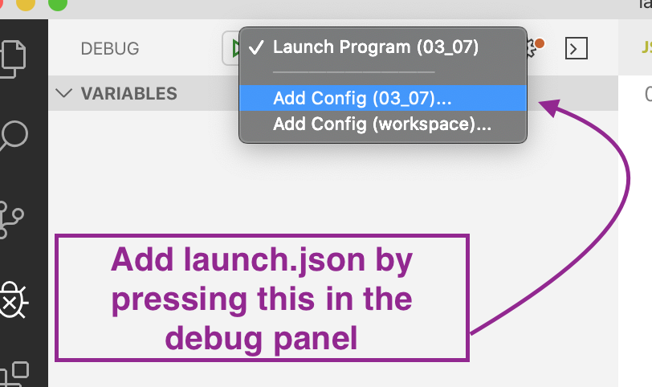
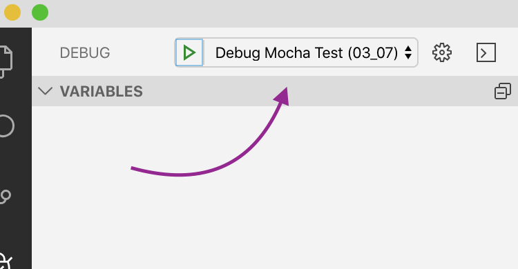

## Day 112, R3
### 11/8/19

  ## Where I left Off
  I found this tutorial: [Debugging Mocha Unit Tests In Visual Studio Code](https://scottaddie.com/2015/10/22/debugging-mocha-unit-tests-in-visual-studio-code/). This is where I left off.
  
  ## Debug Mocha Tests
  ### Edit Script
  In `package.json` change the test script in the `scripts` property to:
  
  `"test": "mocha --inspect-brk"`
  
  ### Find The Port Number
  Run `npm test` and find the line:
  ```bash
  Debugger listening on ws://127.0.0.1:9229/44f87f86-ed16-4933-a3c5-13630173b798
  ```
  Get the number in your terminal, where mine in **9229**.

  ### Add Debug Configurations
  To add debug configurations click here:

  

  You might need to be in a workspace, not just a folder for this to work. So make sure you open a folder by clicking **File**->**Add Workspace To Folder**.

  Then replace the content in launch.json with 

  ```json
  {
    "version": "0.1.0",
    "configurations": [
      {
        "name": "Debug Mocha Test",
        "request": "launch",
        "type": "node",
        "address": "localhost",
        "port": 9229,
        "sourceMaps": false
      }
    ]
  }
  ```

  ### Debug Steps
  Now you're all set up. 
  
  Every time you want to test the debugger, go through all these steps :

  1. run `npm test`
  2. Make sure you have the right **launch configuration** selected 
  
  3. Press the green play button.

  ## Where I Left Off
  I figured out how to debug mocha tests. 

