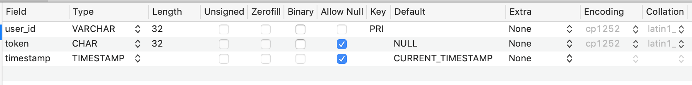
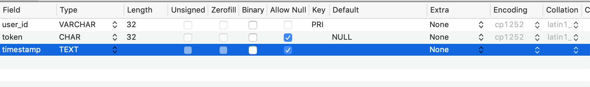

## Day 94, R2
### 7/13/19

- ## Node
  Continuing with Greg's book, [Node.js – Server Setup](https://www.patreon.com/posts/node-api-source-27588087).

  ### Where we left off:
  The [Node.js – Server Setup](https://www.patreon.com/posts/node-api-source-27588087) finished files ***don't work***. They don't call the function that creates the session and token, `action_create_session`. 
  
  Yesterday, we tried to call `action_create_session(request, payload)` inside `action` login on line 218: 
  ```javascript
  // line 218, api.js
  action_create_session(request, payload); //add session--should be conditional but just adding for now, Dash
  ```

  But got an error:
  ```bash
  Error: ER_TRUNCATED_WRONG_VALUE: Incorrect datetime value: '1562952357' for column 'timestamp' at row 1
  ```
  
  Looks like something is wrong with the timestamp.

  ## Which timestamp?
  There's a timestamp in the `session` table and in the `user` table. After some tracing, I figured out this error relates to `timestamp` in the `session` table.

  ```bash
  at Query.<anonymous> (/Users/dashiellbark-huss/Documents/100daysofcode/node-master/module/api/api.js:259:37)
  ```
  ```javascript
  // line 259, api.js
  database.connection.query("INSERT INTO session ( `user_id`, `timestamp`, `token`) VALUES( '" + payload.id + "', '" + timestamp() + "', '" + token + "')",
    (error, results) => {
        if (error) throw(error);
        resolve(`{"found" : false,
                  "token" : token,
                  "user_id": ${payload.user_id},
                  "message": "session was created"}`);
    });
  ```
  ## timestamp Fields Data Type

  I changed the data type of the timestamp in the `session` table to match the data type in the `user` table.

  Before:
  

  After:
  

  The `session`  table had no instructions in the book. But the `user` table did. So I figured, best to match `timestamp` from the table that had explicit instructions in the book. I had to come up with the `session` table myself, since it was omitted from the book. So the `session` table is more likely to be incorrect. 


  ## timestamp Called Twice

  I put console.trace() in the `timestamp` function. `timestamp` is called twice. 
  
  It works the first time. But not the second.

  ### First Call
  **The first time**, when it works, the trace comes from `create_auth_token`. `true` is the argument:
  ```javascript
  // line 241, api.js (create_auth_token)
  let token = md5( timestamp( true ) + "");
  ```

  ### Second Call
  **The second time**, when it doesn't work, the trace comes from the query on line 259.
  No argument passed to timestamp:
  ```javascript
  // line 260 col 131, api.js (database.connection.query)
  timestamp() + "', '" + token + "')"
  ```

  ## `full` Parameter And The Return Value Of Timestamp:
  Taking a closer look at `timestamp`, this is how the return value is formed:
  ```javascript
  full ? Math.floor(timestamp) : Math.floor(timestamp / 1000)
  ```

  We're getting a shorter return value for the second call because the `full` argument is undefined.

  **First call**, create_auth_token:
  ```bash
  full:true, return val: 1563035255103
  ```

  **Second call**, `database.connection.query` line 260:
  ```bash
  full:undefined, return val: 1563035255
  ```
  ## timestamp
  ```javascript
  // Generate timestamp: if full argument is false/undefined,
  // timestamp is divided by 1000 to generate linux-length timestamp
  function timestamp(full) {
      let date = new Date();
      let timestamp = date.getTime();
      return full ? Math.floor(timestamp) : Math.floor(timestamp / 1000);
  }
  ```

  Looking at the comments for the `timestamp()` function led me to change the `full` argument from `undefined` to `true` in `database.connection.query` on line 260:
  ```javascript
  database.connection.query("INSERT INTO session ( `user_id`, `timestamp`, `token`) VALUES( '" + payload.id + "', '" + timestamp(true) + "', '" + token + "')",
  ```

  Now it works, but I have a new error.

  I'm not sure why it was `undefined` before. Maybe it was correct, and I should have changed the timestamp to be a linux-length timestamp in the database instead? But I don't know what that means.

  ## New Error

  ```bash
  ER_DUP_ENTRY: Duplicate entry 'undefined' for key 'PRIMARY'
  ```

  ## See Records in Sequel Pro
  `cmd` + `2`, from *[Content View](https://sequelpro.com/docs/ref/core-features/content)*.

  My new error has to do with the primary key.

  ## Tomorrow
  Tomorrow, I want to think more about this: 
  - Should I change the data type of `timestamp` in the `session` table to a a "linux-length timestamp"? 
  - Or should I keep my changes I made today: changing the parameter of the `timestamp` function from `underfined` to `true`?

  I also need to look at my primary key error.