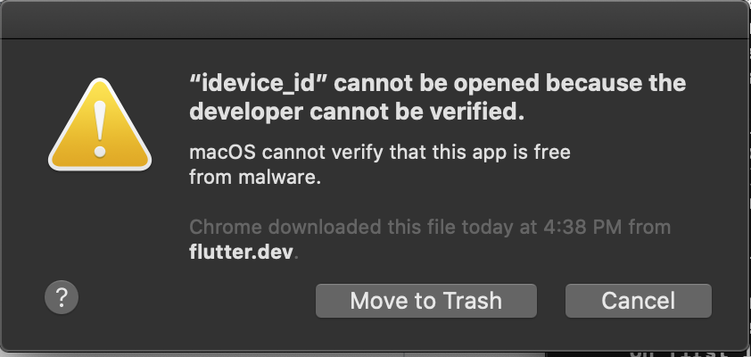

# #100DaysOfCode Log - Round 3 - Dashiell Bark-Huss

## Day 121, R3
### 11/17/19
- ## Twitter Bot
  I tested my Twitter bot because it missed one retweet last night. I thought it was because the hashtags search is case sensitive. But it's not. It also wasn't because the tweet was a reply.

  Turns out it was because even if the server is on, if my computer is closed, I guess it's not actually connected.

  Probably because when I close my computer I think the wifi disconnects. The server doesn't turn off though. My computer stays on and warm all night even when closed when I have the server running.


- ## Flutter
  Today I'm going to set up [flutter](https://flutter.dev/) following this: [macOS install](https://flutter.dev/docs/get-started/install/macos).

  ## Path Variable
  These two instructions confused me:

  >2. Extract the file in the desired location, for example:
  >
  >```bash
  >cd ~/development
  >```
  >...
  >
  >3. Add the flutter tool to your path:
  >```bash
  >export PATH="$PATH:`pwd`/flutter/bin"
  >```
  
  -*from [macOS install](https://flutter.dev/docs/get-started/install/macos)*

  I wasn't sure where to put flutter. What's the desired location? And I didn't remember what the path variable did.

  ### Path Variable
  >The PATH variable is basically a list of directories your computer looks through to find a requested executable.
  >
  >...if you have an awesome program installed in `/usr/local/bin`, you could run `$ /usr/local/bin/my-program` to access it. But do you really want to have to type out the full path to your executable each time? Would you not rather be able to run `$ ls` or `$ my-program`?

  -*from [What Exactly is Your Shell PATH?](https://medium.com/@jalendport/what-exactly-is-your-shell-path-2f076f02deb4)*

  ### Desired Location?
  To help decide where to put flutter I watched this video and did what the instructor did:
  [Flutter SDK Setup](https://www.linkedin.com/learning/learning-google-flutter-for-mobile-developers/flutter-sdk-setup?autoplay=true). He just puts it in ~ (the home directory).


  ## Catalina Issue
  Got this issue when running `flutter doctor` in the terminal after setting the path:

  

  This fixed my issue:

  >When you're developing on Catalina, you can fix it by
  >```bash
  >sudo xattr -d com.apple.quarantine /PATH_TO_YOUR_FLUTTER_HOME/bin/cache/artifacts/libimobiledevice/idevice_id
  >
  >sudo xattr -d com.apple.quarantine /PATH_TO_YOUR_FLUTTER_HOME/bin/cache/artifacts/libimobiledevice/ideviceinfo
  >
  >sudo xattr -d com.apple.quarantine /PATH_TO_YOUR_FLUTTER_HOME/bin/cache/artifacts/usbmuxd/iproxy
  >```
  -*from [idevice_id cannot run on catalina](https://github.com/flutter/flutter/issues/42302)*

  ## Where I Left Off
  I left off downloading xcode, a requirement for flutter.

  I'm on this video in the LinkedInlearning tutorial to setup flutter: [iOS setup](https://www.linkedin.com/learning/learning-google-flutter-for-mobile-developers/ios-setup?autoplay=true)

  I'm also following along with the setup guide: [macOS install](https://flutter.dev/docs/get-started/install/macos)