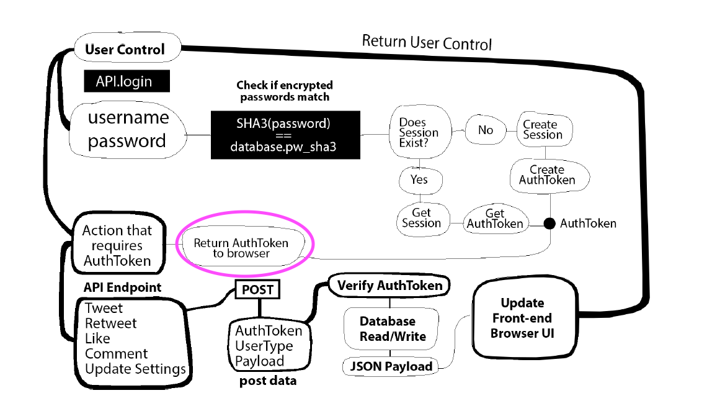
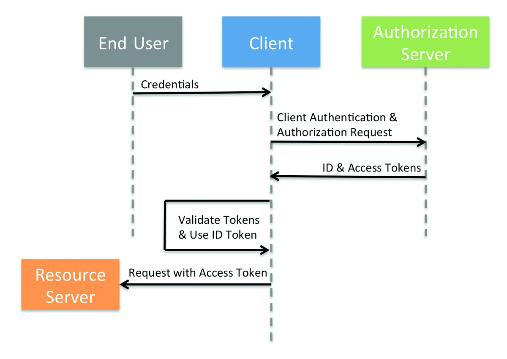
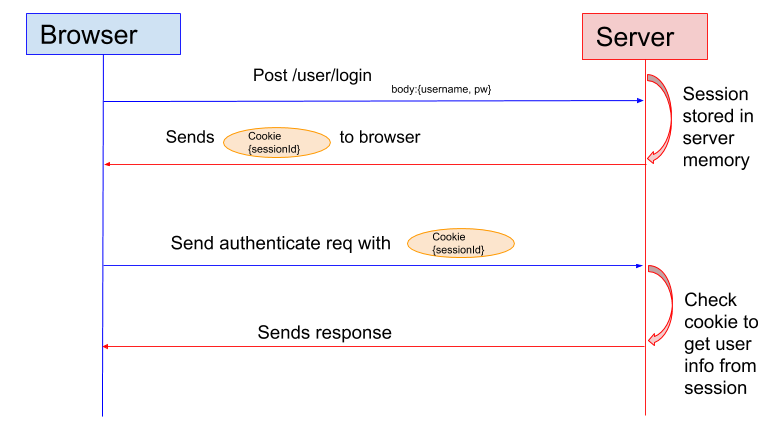

## Day 96, R2
### 7/15/19

- ## Node
  Continuing with Greg's book, [Node.js – Server Setup](https://www.patreon.com/posts/node-api-source-27588087).
  
  ### Where we left off:
  The [Node.js – Server Setup](https://www.patreon.com/posts/node-api-source-27588087) finished files ***didn't work***. They didn't create a session. Now I got the app to create a session but the **authenticate (check if token exists in session table)** button didn't work.


  So I changed the token sent through the UI: from a test token to the actual token. But it still didn't work because the files didn't refresh. The payload was still logging as {` token: 'token_test_12345' }`.

  ## Working
  I tried the **authenticate (check if token exists in session table)** button again. Now it works. So it finally refreshed.

  ## Where Should The Token Actually Be?

  Right now the token is stored statically on the front end. 

  ```html
  <!-- line 159, index.html -->
  <input type="button" onclick="User.authenticate({token:'bb6cd80736ece803dd33c004f7a94278'})"
  ```

  This is just for testing. We cannot store every user's token for every session on the front end.

  So where do we store it?

  As a cookie? 

  In local storage?

  ## Don't Store Tokens In Local Storage?
  >Don't store tokens in local storage
  Browser local storage (or session storage) is not a secure place to store sensitive information. Any data stored there:
  >
  > - Can be accessed through JavaScript.
  > - May be vulnerable to cross-site scripting.
  
  -*[Where to Store Tokens](https://auth0.com/docs/security/store-tokens#don-t-store-tokens-in-local-storage)*

  ## AuthToken In Browser
  In the diagram from the book, it shows that the authtoken is stored in the browser.
  

  But if we shouldn't use local storage, how do we store it?

  >### If a backend is present
  >
  >If your single-page app has a backend server at all, then tokens should be handled server-side using the [Authorization Code Flow](https://auth0.com/docs/flows/concepts/auth-code), [Authorization Code Flow with Proof Key for Code Exchange (PKCE)](https://auth0.com/docs/flows/concepts/auth-code-pkce), or [Hybrid Flow](https://auth0.com/docs/api-auth/grant/hybrid).

  -*[Where to Store Tokens](https://auth0.com/docs/security/store-tokens#don-t-store-tokens-in-local-storage)*

  I'm not sure which I should be using.

  ## Reviewing Sessions and Tokens
  I looked back at these diagrams that Marco([@Wridgeu](https://twitter.com/Wridgeu)) sent me to help me understand sessions and tokens.

  ## Tokens:
  

  ## Sessions:
  

  ## *Do* Store Tokens In Local Storage?
  Now I'm reading that you ***can*** store tokens in local storage:

  >There are three ways how to store a token in a browser:
  >
  >1\. **LocalStorage** - stores data with no expiration date, no access from a backend.
  >
  >2\. **SessionStorage** - stores data until browser/tab is open, no access from a backend.
  >
  >3\. **Cookie** - stores data, expiration time can be set individually, automatically sent with subsequent requests to the server.


  -*[Where to store auth token (frontend) and how to put it in http headers of multiple endpoints?](https://stackoverflow.com/questions/51332747/where-to-store-auth-token-frontend-and-how-to-put-it-in-http-headers-of-multip)*
  
  I like idea of storing the token in a cookie where you can control the expiration time.

  But then there's another idea here: [Store Auth-Token in Cookie or Header?](https://security.stackexchange.com/questions/180357/store-auth-token-in-cookie-or-header) Here, we can also store cookies in the `header`.

  ## Options For Storing The Token
  - **Cookie**
  - **Header**
  - **SessionStorage**
  - **LocalStorage**

  ## Storing The Token In `localStorage`
  > To save the token in your browser you can simply use:
  >
  >`localStorage.setItem('token', token);`
  >
  >and later access it with:
  >
  >`localStorage.getItem('token');`

  -*[Example: JSON Web Tokens with Vanilla JavaScript](https://jonathanmh.com/example-json-web-tokens-vanilla-javascript/)*

  Where would I put this? Does it go in `index.html`, `api.js`, or `index.js`?

  I think it goes in `index.html`. I don't think the other files have excess to the frontend and the WEB API.

  ## Log Token To Terminal
  I logged the token to the terminal by adding `.then` to line 218, api.js.

  ```javascript
  action_create_session(request, payload).then(x=>console.log((JSON.parse(x)).token)); 
  ```

  Tomorrow, I'll try to get the token to the frontend.