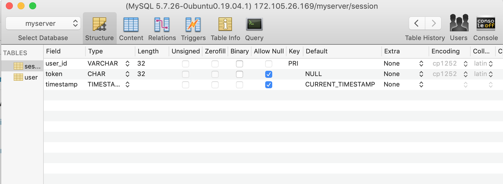
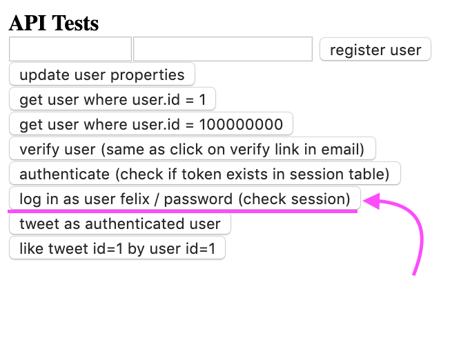
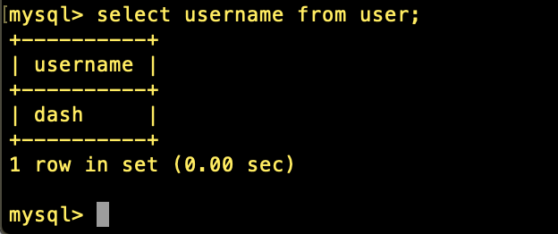
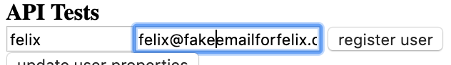
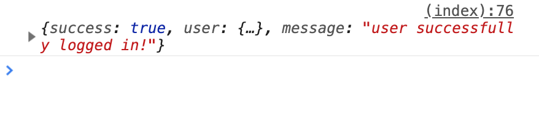

## Day 87, R2
### 7/6/19

- ## Node
  Continuing with Greg's book, [Node.js – Server Setup](https://www.patreon.com/posts/node-api-source-27588087).

  ## How Tokens & Sessions Work:
  Marco([@Wridgeu](https://twitter.com/Wridgeu)) helped me understand tokens and sessions by sending me these graphics.

  ## Tokens:
  

  ## Sessions:
  
  
  ## Delete A Table
  To delete a table:
  ```sql
  DROP TABLE tablename;
  ```
  -*[How to Manage MySQL Database, Table & User From Command Line:DELETE MYSQL TABLES AND DATABASES](https://www.a2hosting.com/kb/developer-corner/mysql/managing-mysql-databases-and-users-from-the-command-line#DeleteMySQL-Tables-and-Databases#DeleteMySQL-Tables-and-Databases#DeleteMySQL-Tables-and-Databases)*

  Remember to replace `tablename` with your table to go to the right database first, with the command: `use databasename`.

  ## Making the Session Table
  I'm going to try to make the `session` table with the little information I have. So I deleted the table using the above code.

  A few days ago, I found this in api.js.
   ```javascript
  database.connection.query("INSERT INTO session ( `user_id`, `timestamp`, `token`) VALUES( '" + payload.id + "', '" + timestamp() + "', '" + token + "')",
  ```
  From this bit of code, I gather that these are the fields that need to be in the `session` table: `user_id`, `timestamp`, and `token`.

  Copying this sql command I found in [Storing Sessions in a Database](http://shiflett.org/articles/storing-sessions-in-a-database):

  ```sql
  CREATE TABLE sessions (
  id varchar(32) NOT NULL,
  access int(10) unsigned,
  data text,
  PRIMARY KEY (id)
  );
  ```

  I came up with this command to make the session table and set the primary key to `user_id`.
  ```sql
  CREATE TABLE session (
  user_id varchar(32) NOT NULL,
  PRIMARY KEY (user_id)
  );
  ```

  And I'm going to add the other fields, `timestamp` and `token`, in Sequel Pro.

  ## Token Data Type?
  How is the token made and what is the data type?

  I found this in api.js:
  ```javascript
  function create_auth_token() {
    let token = md5( timestamp( true ) + "");
    return token;
  }
  ```
  So I think I need to look at what data type an **md5** token is.

  ## md5
  A few days ago I found that the `password_md5` should be:

  >MD5 generates a 128-bit hash value. You can use CHAR(32) or BINARY(16)

  -*[What data type to use for hashed password field and what length?](https://stackoverflow.com/questions/247304/what-data-type-to-use-for-hashed-password-field-and-what-length)*

  So I'll use CHAR and length: 32 in the table for `token`.

  ## Timestamp
  For `timestamp` I use the data type TIMESTAMP and set the default:
  >To assign the current timestamp, set the column to CURRENT_TIMESTAMP or a synonym such as NOW().

  -*[5.1.8 Server System Variables](https://dev.mysql.com/doc/refman/8.0/en/server-system-variables.html)*

  ## New Session Table
  Here's the new session table:

  

  ## Working, Sort Of!

  With the new session table, we still have an error but it's a new error and the server doesn't shut down like it did before:

  ```bash
  request  /
  API request detecting...
  request  /style/lavacode.css
  request  /favicon.ico
  request  /style/lavacode.css
  request  /api/user/authenticate
  API.exec(), parts =  [ 'api', 'user', 'authenticate' ]
  API.authenticate, results.length == 0 (session with token not found)
  {"success": false, "message": "token not found in session"}
  responding =  [ undefined ]
  ```

  This is to be expected because we haven't logged in yet, so there is no session. Let's tackle logging in.

  ## Logging In
  We need to login to create a session.

  

  In the code, I actually changed `felis` it to `felix2` because that's the login I'm using.

  Pressing **log in as user felix** gave me this in the terminal:

  ```bash
  request  /api/user/login
  API.exec(), parts =  [ 'api', 'user', 'login' ]
  SELECT * FROM `user` WHERE `username` = 'felix2'
  responding =  [
    '{"success": false, "user": null, "message": ' +
      `"user with this username(felix2) doesn't ` +
      'exist"}'
  ]
  ```
  Console:
  **"user with this username(felix2) doesn't exist"** Hmmm...

  This made me think: `felix2` is a user in `user` table in the `mysql` database not the `user` table that we made in a later chapter for the `myserver` database. I'm confused!

  ## Retrieving Information from a Table
  ```sql
  SELECT what_to_select
  FROM which_table
  WHERE conditions_to_satisfy;
  ```
  -*[3.3.4 Retrieving Information from a Table](https://dev.mysql.com/doc/refman/8.0/en/retrieving-data.html)*

  ## No Felix User
  I found out there is no user `felix` or `felix2` in the `myserver` database. 
  
  I'm not totally sure why, but I have `felix2` and the original `felix` in the `user` database on the `mysql` database, and this `felix` should be in the `user` table on `myserver`. I'm not sure if it's because something was left out in the book or if I did something wrong.
  
   Are there supposed to be two separate `felix` logins, or did I do something wrong by making two `user` tables in different databases? Not sure. I'll look back at the book tomorrow.
   
   Maybe this was why `felix@localhost` didn't work and I had to use `felix@%`. Not really sure.

  

  No `felix`.

  ## Add Felix User

  I added `felix` through the UI:

  

  I changed the code from `felix2` to `felix` pressed **log in as user felix**. Success:

  

    
    