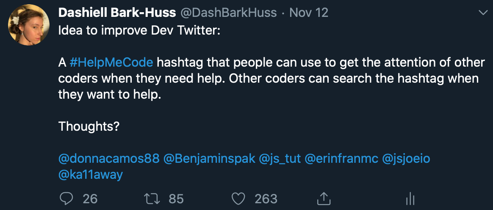

## Day 117, R3
### 11/13/19
- ## Yesterday
  Yesterday, after my regular coding, I coded more. I started to make a bot around this idea:

  

  People liked the idea so I decided to make a bot that retweets tweets with the hashtag **#helpmecode**.

  I already had a dev twitter account, so I didn't have to apply.

  I watched the first 3 videos in this series and got my bot up: [Twitter Bot Tutorial](https://t.co/pBm47t3ka4?amp=1)

  [@jackgannon](https://twitter.com/jackgannon_) has been helping.

  I'm going to continue my bot today.

  ## OAuth
  Right now my bot works. However, it can only post to my twitter handle associated with my developer account. Inorder to get it to post to a helpmecode bot account, I need to implement 3-legged authorization. 

  I went down a rabbit hole reading Twitter docs to try to understand this:

  - [3-legged authorization](https://developer.twitter.com/en/docs/basics/authentication/overview/3-legged-oauth)
  - [Log in with Twitter: Overview](https://developer.twitter.com/en/docs/twitter-for-websites/log-in-with-twitter/login-in-with-twitter)
  - [Log in with Twitter: Browser sign in flow](https://developer.twitter.com/en/docs/twitter-for-websites/log-in-with-twitter/guides/browser-sign-in-flow)
  - [Implementing Sign in with Twitter](https://developer.twitter.com/en/docs/twitter-for-websites/log-in-with-twitter/guides/implementing-sign-in-with-twitter)
  - [Authorizing a request](https://developer.twitter.com/en/docs/basics/authentication/guides/authorizing-a-request)
  - [Access Tokens](https://developer.twitter.com/en/docs/basics/authentication/guides/access-tokens)
  - [Creating A Signature](https://developer.twitter.com/en/docs/basics/authentication/guides/creating-a-signature): This page tried to link to a page explaining the hashing algorithm for the hash_hmac function. But the link doesn't work.
    - >Finally, the signature is calculated by passing the signature base string and signing key to the HMAC-SHA1 hashing algorithm

      I think I can search "HMAC-SHA1" and figure it out.
  - [Single-user OAuth with Examples](https://developer.twitter.com/en/docs/basics/authentication/guides/single-user)
  - [Oauth with the Twitter APIs](https://developer.twitter.com/en/docs/basics/authentication/overview/oauth)


  I found a video tutorial: [NodeJS and ExpressJS: Using Twitter authentication via Passport - Tutorial for beginners](https://www.youtube.com/watch?v=_6QrV5pneSY) and started watching it.

  ## express-generator
  In the tutorial the instructor used express-generator to create a new project
  
  To install:
  >```bash
  >$ npm install -g express-generator
  >```
  -*from [Express application generator](https://expressjs.com/en/starter/generator.html)*

  Then you can generate an app really fast:
  ```bash
  $ express myapp
  ```
