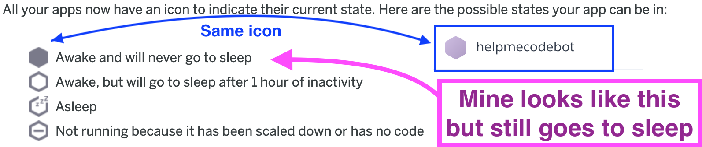

## Day 126, R3
### 11/22/19

- ## Where I Left Off
  I finished my bot and deployed it but now heroku keeps putting the bot to sleep. I don't know why.

  Is twitter ending the session?

  When does the session end?

  >When an app on Heroku has only one web dyno and that dyno doesn't receive any traffic in 1 hour, the dyno goes to sleep.

  -*from [App Sleeping on Heroku](https://blog.heroku.com/app_sleeping_on_heroku)*

  I have to test this. Will my app go to sleep in an hour?

  ## Icon Confusion
  I'm confused because heroku says that if your app has this filled in icon, it will never co to sleep. But mine has that icon and it goes to sleep.

  And it's fille in when it's asleep but with 'zzz's. So it doesn't look like the sleep icons below.

  

  ### Old Icons
  Oops those are just old icons and that page was just an old heroku blog post. Heroku has changed a bit since the post.

  ## Check Your Dyno Hours
  I checked my hours with this command
  ```bash
  heroku ps -a <app name>
  ```

  In addition to seeing the hours used it showed be how long my dyno was awake:

  ```bash
  === web (Free): npm start (1)
  web.1: up 2019/11/22 12:51:54 -0600 (~ 30m ago)
  ```

  30 minutes

  A few minutes later I checked and got:

    ```bash
  === web (Free): npm start (1)
  web.1: idle 2019/11/22 13:26:56 -0600 (~ 4m ago)
  ```

  So it went idle after 30 minutes which is what the docs says it will do:

  >### Dyno sleeping
  >If an app has a free web dyno, and that dyno receives no web traffic in a 30-minute period, it will sleep.

  -*from [Dyno sleeping](https://devcenter.heroku.com/articles/free-dyno-hours#dyno-sleeping)*

  When I went back to the heroku app page- `yourappname.herokuapp.com`- it then woke the app up. I could see it was back up when I ran `heroku ps -a <app name>` in the console.
  ```bash
  === web (Free): npm start (1)
  web.1: up 2019/11/22 13:38:25 -0600 (~ 24s ago)
  ```

  ## Heroku Logs
  See realtime heroku logs.
  ```bash
  heroku logs --tail
  ```

  ## Worker Dynos Stay Awake?
  If I switch my heroku dyno from a web dyno to a worker dyno, will it stay awake?

  >Worker dynos do not sleep, because they do not respond to web requests.

  -*from [Dyno sleeping](https://devcenter.heroku.com/articles/free-dyno-hours#dyno-sleeping)*

  However, my app responds to web requests in order for me to log in my bot account. Hmmm...

  ## Ping Awake
  I found a wonky solution. Ping your app every 5 minutes:
  [6 Easy Ways to Prevent Your Heroku Node App From Sleeping](https://quickleft.com/blog/6-easy-ways-to-prevent-your-heroku-node-app-from-sleeping/)

  ```javascript
  var http = require("http");
  setInterval(function() {
    http.get("http://<your app name>.herokuapp.com");
  }, 300000); /
  ```

  But I wonder if I could start it as a web syno, then log in, then switch to the worker dyno?

  I'm going to check in 35 minutes to see if it stays on.

  ## Future Problem: Hours
  Either why I'll eventually run into a problem because I'm going to run out of hours. Then what? Pay for it? pshh! 
