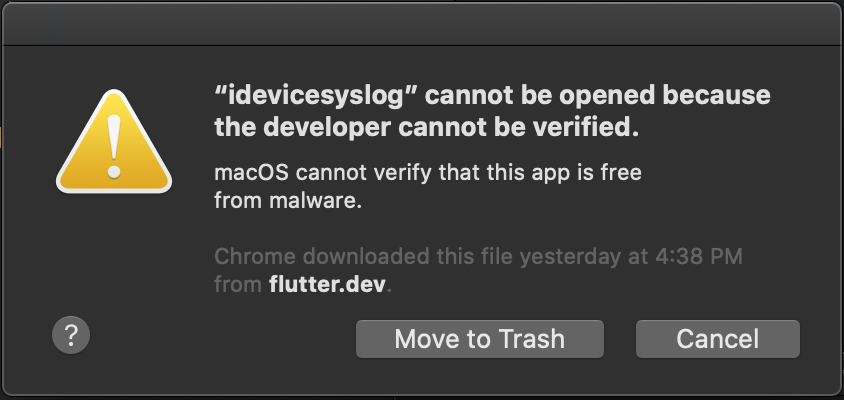
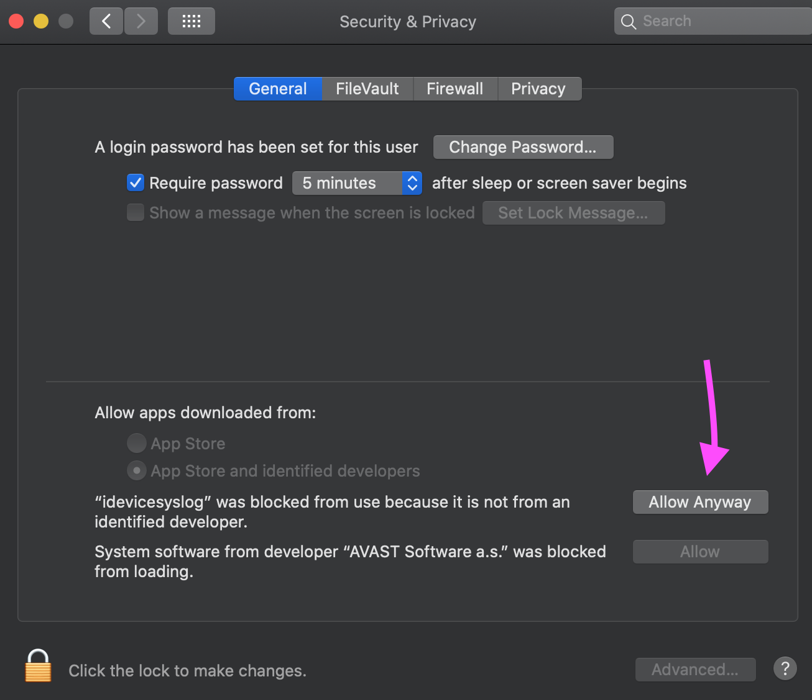
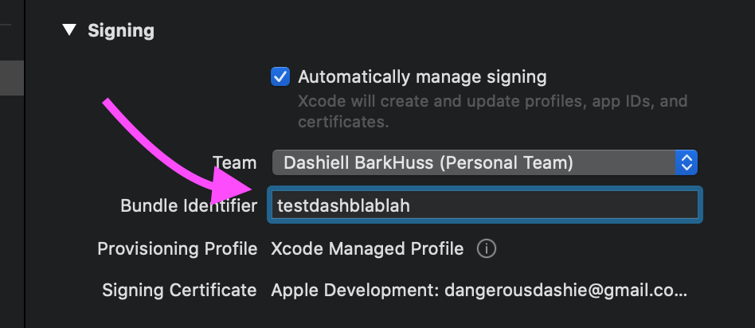
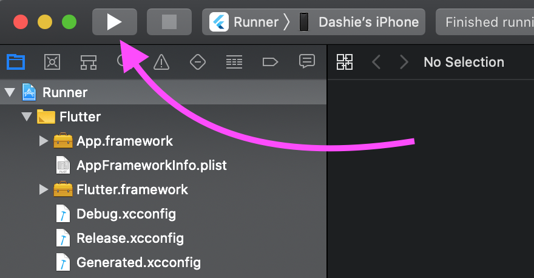

# #100DaysOfCode Log - Round 3 - Dashiell Bark-Huss

## Day 122, R3
### 11/18/19

  ## Where I Left Off
  I left off downloading Xcode, a requirement for Flutter.

  I'm on this video in the LinkedInlearning tutorial to setup flutter: [iOS setup](https://www.linkedin.com/learning/learning-google-flutter-for-mobile-developers/ios-setup?autoplay=true)

  I'm also following along with the setup guide: [macOS install](https://flutter.dev/docs/get-started/install/macos)

  ## LinkedIn Learning Video
  The linked in learning video is a little out of date, so I followed [macOS install](https://flutter.dev/docs/get-started/install/macos) for the rest of the instructions.

  ## Errors
  ## `ideviceyslog`
  I got this error again when running `flutter run`:

  

  I fixed it by clicking "Allow Anyway" in **System Preferences**>**Security and Privacy**.

  

  ### `No profiles for 'com.example.myApp'`

  But then I got a new error

  ```
  error: No profiles for 'com.example.myApp' were found: Xcode couldn't find
    any iOS App Development provisioning profiles matching 'com.example.myApp'.
    Automatic signing is disabled and unable to generate a profile. To enable
    automatic signing, pass -allowProvisioningUpdates to xcodebuild. (in target
    'Runner' from project 'Runner')

  Could not build the precompiled application for the device.

  It appears that your application still contains the default signing identifier.
  Try replacing 'com.example' with your signing id in Xcode:
    open ios/Runner.xcworkspace

  Error launching application on Dashie’s iPhone.
  ```

  I changed the **Bundle Identifier** in  Xcode, under the **Signing & Capabilities** tab from 'com.example.myApp' to some unique name.

  

  ### `unable to attach DB`
  I tried to run `flutter run` again but got this error:

  ```
  error: unable to attach DB: error: accessing build database
    "/Users/dashiellbarkhuss/Library/Developer/Xcode/DerivedData/Runner-ckhwqplx
    riokglhhavfyrekhsbye/Build/Intermediates.noindex/XCBuildData/build.db": database is locked Possibly there are two concurrent builds running in the same filesystem location.
  ```
  I ran it in XCode. 
  
  

  Xcode asked me to change some settings on my phone, which I followed the instructions for. Then it worked; the app ran on my phone.

  I think the setup instruction said to change this setting, but I couldn't find the setting so I ignored it. I found the setting this time.

  ## Android Emulator
  I skipped the section [Set up Your Android Device](https://flutter.dev/docs/get-started/install/macos#set-up-your-android-device) because I don't have an Anroid.
  
  I went to [Set up the Android emulator](https://flutter.dev/docs/get-started/install/macos#set-up-the-android-emulator)

  ## Where I Left Off
  I'm need to read how to enable [VM acceleration](https://developer.android.com/studio/run/emulator-acceleration). This is the first step in setting up the [Android emulator](https://flutter.dev/docs/get-started/install/macos#set-up-the-android-emulator)