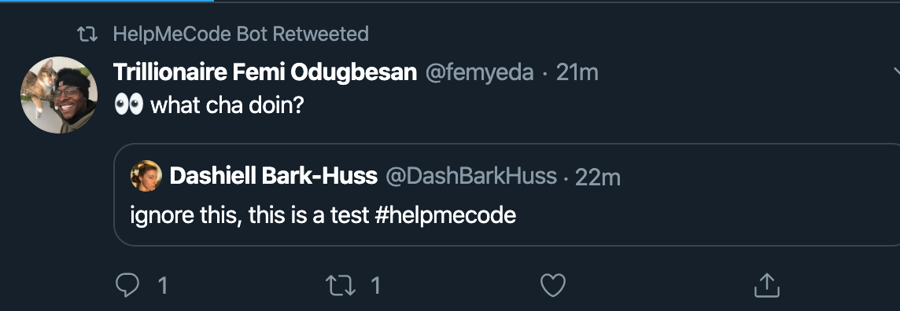

## Day 125, R3
### 11/21/19

- ## Where I Left Off
  I made the flutter app in the tutorial [Write your first Flutter app, part 1](https://flutter.dev/docs/get-started/codelab)

  But today I want to get to my twitter bot going first. I'm going to finish watching this video [15.8: Heroku Deployment - Twitter Bot Tutorial](https://www.youtube.com/watch?v=DwWPunpypNA). I need to download the heroku CLI.

  ## Bot Complete!
  I finished setting up my heroku. Now my bot retweets and I don't need to run a server from my local host.

  I made it so only my @helpmecodebot() can log in to the app. 

  ## Deploy vs Dev
  I realized you have to do a lot of things in the code differently depending on whether your deploying or in development.

  

  I have to change my callback URL host for example, from *localhost:3000* to *helpmecodebot.herokuapp.com*.

  So not my code will not work if I try to do it in development unless I manually change it. I think there's a way to make the code act conditionally, based on whether your in development or deployment.

  I also realized I can't .gitignore the same files on heroku as I can on github. So how to I make my code conditionally ignore files based on whether I'm pushing to heroku or github?

  ## Bot Retweets Quote Retweets
  Oops my my bot is retweeting quote retweets where the original tweet has the hashtag but not the "child" tweet.

  

  ## Fixed Quote Retweets
  I fixed that by adding some conditional statements:

  ```javascript
  if(tweet.quoted_status!=undefined && !tweet.text.toLowerCase().includes(hashtag)){
      console.log("will not retweet qoute tweets where the child tweet doesn't contain the hashtag.");
      return;
  }
  ```

  ## Github
  I need to figure out how to .gitignore different things depending on where I'm pushing to. But For now I might just make a new project with a different repo and push to github


