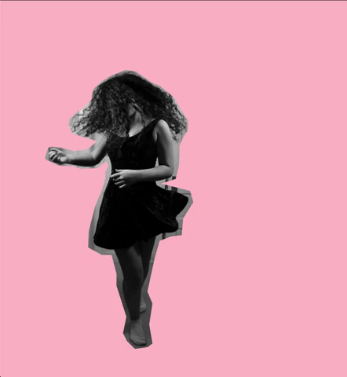

## Day 86, R2
### 7/5/19

- ## Play Around
  Driving through desolate areas. Internet sucks. Putting pause on backend to just play with frontend since I don't have the internet. I feel rusty with frontend, anyways.

  Found some pictures of my sister I took several years ago. Going to play with those.

  So hot in the van. Sweating. No internet. Could only using my Dash Docs and my log notes. Taking a break to cool off and charge computer.
  
  ## Back To Coding
  Back to coding. I got some internet. The temperature cooled a little but still hot. 32 minutes left.

  ## Passing Params To Callback
  [Javascript event handler with parameters](https://stackoverflow.com/questions/10000083/javascript-event-handler-with-parameters)

  >An arrow function expression is a syntactically compact alternative to a regular function expression, although without its own bindings to the this, arguments, super, or new.target keywords.
  >
  >```javascript
  >const event_handler = (event, arg) => console.log(event, arg);
  >el.addEventListener('click', (event) => event_handler(event, 'An argument'));
  >```

  ## Made A little Something
  Here's a little something I made with the pictures of my sister. Her name is Tallulah and she is super fun.

  

  ```html
  <!DOCTYPE html>
  <html lang="en">

  <head>
    <meta charset="UTF-8">
    <meta name="viewport">
    <meta http-equiv="X-UA-Compatible" content="ie=edge">
    <title>Document</title>
    <style>
      html,
      body {
        box-sizing: border-box;
        margin: 0;
        padding: 0;
        height: 100%;
      }

      *,
      *:before,
      *:after {
        box-sizing: inherit;
      }

      #img {
        height: 100%;
      }

      #image {
        height: 100%;
      }
    </style>
  </head>

  <body>
    <div id="img">

    </div>
    <script>
      const imageArray = ['lula1.png', 'lula2.png'];
      const colorArray = ['pink', 'lightblue', 'lightyellow'];
      const image = document.createElement("img");
      const imageWrapper = document.querySelector("#img");

      var i = 0;
      var colorI = 0;

      function putImage() {
        const img = imageArray[i];
        i === imageArray.length - 1 ? i = 0 : i++;
        image.setAttribute('src', `images/${img}`);
        image.setAttribute('id', `image`);
        imageWrapper.innerHTML = "";
        imageWrapper.appendChild(image);
        color();
      }

      function color() {
        const color = colorArray[colorI];
        colorI === colorArray.length - 1 ? colorI = 0 : colorI++;
        document.getElementsByTagName('body')[0].style.backgroundColor = color;
      }


      putImage();
      setInterval(putImage, 1600);
      document.addEventListener('click', color);
    </script>
  </body>
  </html>
  ```

- ## Thoughts And Feelings
  Still so hot and hard to concentrate. Today, we drove all day in our van. We're trying to get home to Chicago before my grandma passes. 
  
  This is probably the end of our 3 years living in the van.
  
  After today, I'm excited to code in some air conditioning!