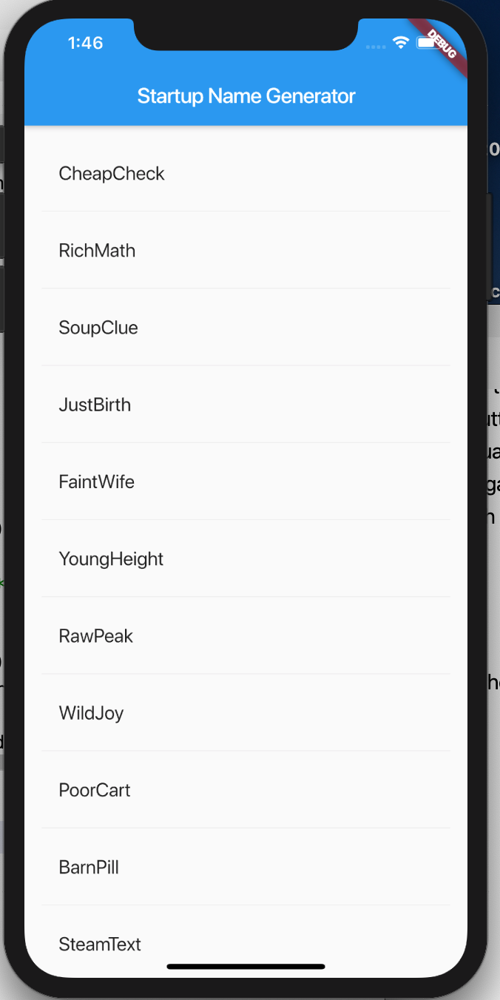

# #100DaysOfCode Log - Round 3 - Dashiell Bark-Huss

## Day 124, R3
### 11/20/19

## Where I Left Off
### Flutter
I set up my Android Studio and simulator. I let off in the codelab [Step 1: Create the starter Flutter app](https://flutter.dev/docs/get-started/codelab#step-1-create-the-starter-flutter-app)

### Twitter Bot
I started watching [15.8: Heroku Deployment - Twitter Bot Tutorial](https://www.youtube.com/watch?v=DwWPunpypNA) and following along. I need to download the heroku CLI.

## Flutter 
## What's A Widget?

>The app extends StatelessWidget which makes the app itself a widget. In Flutter, almost everything is a widget, including alignment, padding, and layout.

-*from [Step 1: Create the starter Flutter app](https://flutter.dev/docs/get-started/codelab#step-1-create-the-starter-flutter-app))*

>A widget’s main job is to provide a build() method that describes how to display the widget in terms of other, lower level widgets.

-*from [Step 1: Create the starter Flutter app](https://flutter.dev/docs/get-started/codelab#step-1-create-the-starter-flutter-app))*

## Stateless Widget

>Stateless widgets are immutable, meaning that their properties can’t change—all values are final.

-*from [Step 3: Add a Stateful widget](https://flutter.dev/docs/get-started/codelab#step-3-add-a-stateful-widget)*

## Stateful Widgets
>Stateful widgets maintain state that might change during the lifetime of the widget. 

-*from [Step 3: Add a Stateful widget](https://flutter.dev/docs/get-started/codelab#step-3-add-a-stateful-widget)*

## Flutter Isn't in Javascript
This whole time I thought flutter was Javascript and I was wondering why there was all this syntax I wasn't use to. Flutter isn't in javascript. It's in some random language called dart. That the hell. Why another langauge? There are too many langauges. And duh it's in dart. THe file nextensions are all .dart.

## Where I Left Off

I made the flutter app in the tutorial [Write your first Flutter app, part 1](https://flutter.dev/docs/get-started/codelab)

 