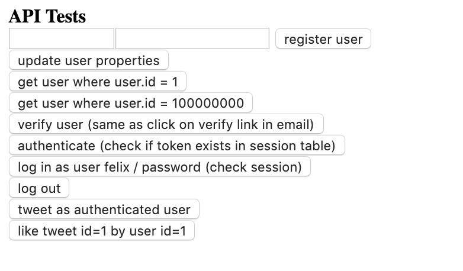
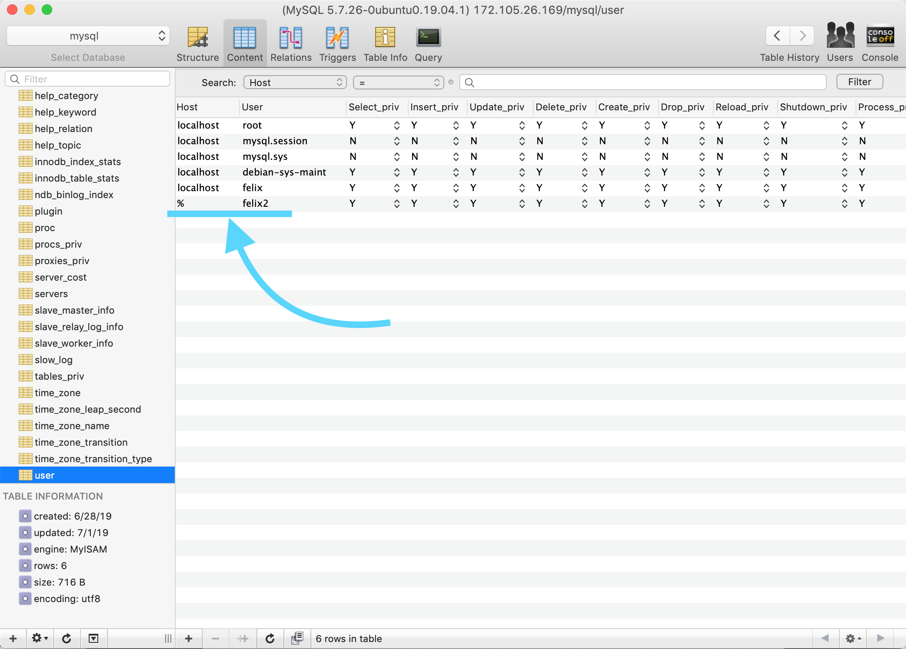
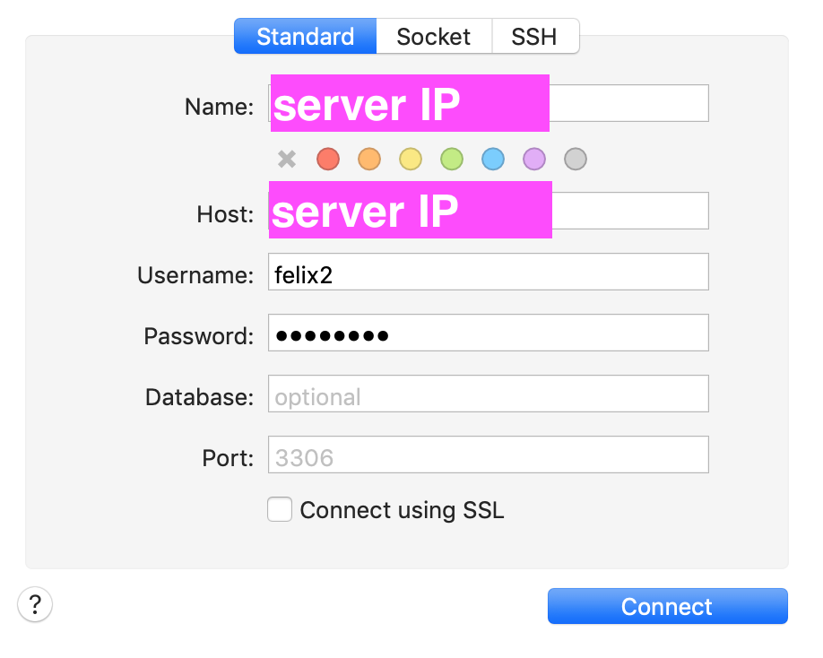
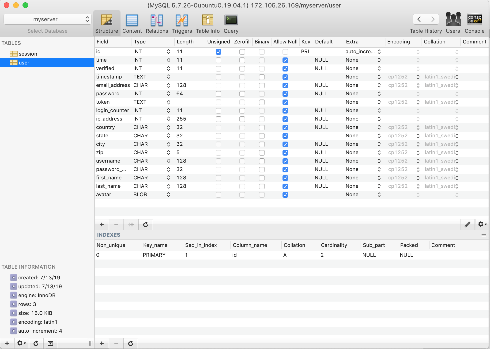
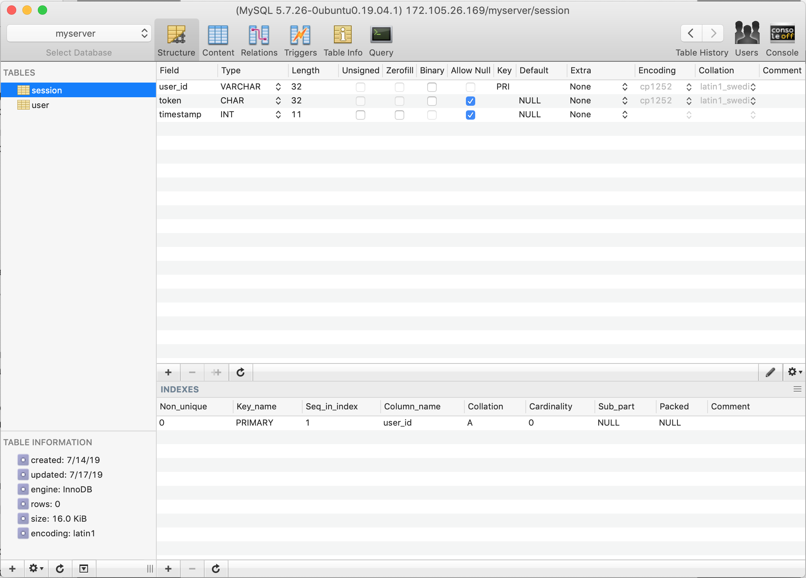

## Day 97, R2
### 7/16/19

- ## Node
  Continuing with Greg's book, [Node.js – Server Setup](https://www.patreon.com/posts/node-api-source-27588087).

  ### Where we left off:
  The latest update to [Node.js – Server Setup](https://www.patreon.com/posts/node-api-source-27588087)'s finished files ***didn't work***. Over the past few days, I got the session to save to the session table. Yesterday, I got the token to the front end, now I need to save it to localStorage.

   ## How To Store Tokens In `localStorage`
  > To save the token in your browser you can simply use:
  >
  >`localStorage.setItem('token', token);`
  >
  >and later access it with:
  >
  >`localStorage.getItem('token');`

  -*[Example: JSON Web Tokens with Vanilla JavaScript](https://jonathanmh.com/example-json-web-tokens-vanilla-javascript/)*
  
  To store the token, I added `localStorage.setItem('token', token);`
  ```javascript
  // line 74, index.html
  User.login = function(payload) {
      fetch("/api/user/login", make(payload)).then(promise => promise.json()).then(json => {
          console.log(json);
          if (json.success===true){
            return fetch("/api/session/create", make(payload))
          }
      }).then(promise => promise.json()).then(json => {
          localStorage.setItem('token', json.token); // store token
      });
  }
  ```

  Then I accessed the token with `localStorage.getItem('token');`
  ```html
  <!-- line 165, index.html -->
  <input type="button" onclick="User.authenticate({token:localStorage.getItem('token')})"
  value="authenticate (check if token exists in session table)" /><br />
  ```
  ## Logout
  There is no logout button on the UI, so that's what I want to add next. We'll also have to add the fetch call to logout to the frontend API.

  ## Finished Files Missing Logout Body
  The finished files don't have the logout body.
  ```javascript
    // line 227 api.js
  function action_logout ( request, payload ) {
      return new Promise((resolve, reject) => {
          /* implement */
      }).catch(error => console.log(error));;
  }
  ```
  I'm going to try to add it.

  ## Constructing The `action_logout` Function

  I think all we need to do is delete the session from the database. We might also have to remove the token from local storage but that might not be necessary.

  Is it better to delete the session by sending in the username in the payload? Or by sending in the the token?
  
  I'm going to delete the session by sending in the token and searching the session by token, since the token is stored in localStorage. I'm wondering if this could create issues where there are multiple sessions for one user. Multiple sessions shouldn't happen, but I wonder if it could happen somehow.
  
  ```javascript
  // line 227, api.js
  function action_logout ( request, payload ) {
      return new Promise((resolve, reject) => {
          // find the session from the database by the token and delete it
          let query = `DELETE * FROM \`session\` WHERE \`token\` = '${payload.token}'`;
          console.log(query);
      }).catch(error => console.log(error));;
  }
  ```

  Next we have to add the `database.connection.query` call.

  ```javascript
  // line 227, api.js
  function action_logout ( request, payload ) {
      return new Promise((resolve, reject) => {
          // find the session from the database by the token and delete it
          let query = `DELETE * FROM \`session\` WHERE \`token\` = '${payload.token}'`;
          console.log(query);
          database.connection.query(query, (error, results) => { // query call
            if (error)
                throw(error);
            let result = results[0];
            console.log("results[0] = ", results[0]);
            console.log("result = ", result);
            resolve(`{"success": true, "message": "user logged out!"}`);
        });    
      }).catch(error => console.log(error));;
    }
  ```

  I wonder if this is a bad idea because what if somehow the user clears their local storage? I feel like I should probably delete the session by user id. 

  I changed the query, to search the `user_id`.

  ```javascript
  // line 227, api.js
  function action_logout ( request, payload ) {
    return new Promise((resolve, reject) => {
        // find the session from the database by the user and delete it
        let query = `DELETE * FROM \`session\` WHERE \`user_id\` = '${payload.username}'`;
        // ...
  ```

  I just realized, if we access the username from localStorage, we'd have the same issue. But I'm going to leave it like this for now anyways.
  ## Logout Frontend API

  ```javascript
  // line 85, index.html
  /* Logout
    payload = {
    username: "username"} */
  User.logout = function(payload) {
      fetch("/api/user/logout", make(payload)).then(promise => promise.json()).then(json => {
          console.log(json);
      });
  }
  ```

  ## Logout UI Button
  ```html
  <!-- line 179, index.html -->
  <input type="button" onclick="User.logout({username:'felix'})" value="log out" /><br />
  ```

  For an actual app, we'll have to add the username to localStorage and call User.logout dynamically, instead if with 'felix'.

  ## Error
  I got on error related to my query
  ```bash
  Error: ER_PARSE_ERROR: You have an error in your SQL syntax; check the manual that corresponds to your MySQL server version for the right syntax to use near '* FROM `session` WHERE `user_id` = 'felix'' at line 1
  ```
  ### Query
  ```sql
  DELETE * FROM `session` WHERE `user_id` = 'felix'
  ```

  I think you can't delete all: `DELETE *`

  So I changed the query to:
   ```sql
  DELETE FROM `session` WHERE `user_id` = 'felix'
  ```
  
  Now it works!

  ## Working Files
  So far I've got everything important working. Except for the tweet and email related buttons, all of the buttons work.

  

  ### 1\.Here's the link to the finished files:
  ### [Link To Work, latest commit](https://github.com/DashBarkHuss/node_book/tree/5e8a6f8a9c93dab3264bab80b176986cdbaddba0)

  ### 2\. Here's how my **mysql user**, **felix2**, was set up:

  

  ### 3\. Here's how I logged in to **Sequel Pro**:

  

  ### 4\. Here's how my myserver user table was set up:

  

  ### 5\.Here's how my myserver session table was set up:

  


  ## What Next?
  Next I'd like to do this whole tutorial again and see If I can create api.js, index.html, and index.js (mostly) from scratch.

  Maybe I can try to make a small app?

  I started to reread the book.

- ## Thoughts and Feelings:
  I learned a lot from figuring out all the parts the Greg left out in this update. I probably learned more than if I had the complete tutorial. I had to get my hands dirty in the code and see how everything really works in order to finish where Greg left off.

  I'm very happy to have completed this. One of my goals it to be able to complete a full stack web app myself. This got me much closer.

