# Post #100DaysOfCode Log - Dashiell Bark-Huss

I completed my 365 days of code. But I'm going to continue to add to this log when I want to save notes.

### Optimizing WordPress With GoDaddy cPanel Shared Hosting 
05/10/20 - 05/20/20
<hr>

Jump to my [**Conclusion**](#wp-optimization-conclusion) to see what I did.

<hr>

#### Wordpress Optimization resources
- [GTmetrix](https://gtmetrix.com/)- Gives you speed metrics on your site
- [Speed Up WordPress in 2019: How To Optimize Your Website & Make It Load Fast](https://www.youtube.com/watch?v=ATXACFtcyKs)
- [Optimizing MP4 Video for Fast Streaming](https://rigor.com/blog/optimizing-mp4-video-for-fast-streaming)
  - [HandBrake](https://handbrake.fr/) *Free software for optimizing mp4 videos*
- [How to Read a Waterfall Chart for Beginners](https://gtmetrix.com/blog/how-to-read-a-waterfall-chart-for-beginners/)
- [How To Fix GoDaddy’s Slow WordPress Hosting Using An Array Of Tools + Plugins (And How To Check If Your GoDaddy Server Is Slow)](https://onlinemediamasters.com/slow-wordpress-hosting-godaddy/)- Text companion of below
- [How To Fix Slow WordPress Site On Godaddy](https://www.youtube.com/watch?v=vXgIVbcvGiw)- Video companion of above
  - [Steps 3-5: Configure WP Fastest Cache or W3 Total Cache Plugin](https://www.youtube.com/watch?v=vXgIVbcvGiw&t=560s)
  - [Step 6: Clean Up Database With WP-Optimize](https://www.youtube.com/watch?v=vXgIVbcvGiw&t=1099s)
  - [Step 7: Defer Parsing Of JavaScript](https://www.youtube.com/watch?v=vXgIVbcvGiw&t=1142s)
    - This step didn't change anything. I still have a .js file parsing during initial page load: *wp-content/cache/wpfc-minified/a0uy3y/47yt4.js*
- [Why is my page slow?](https://gtmetrix.com/why-is-my-page-slow.html)
  - [Page Caching](https://gtmetrix.com/why-is-my-page-slow.html#page-caching)
- [Static site generators vs. caching](https://stitcher.io/blog/static_sites_vs_caching)
- [PageSpeed and YSlow are Half the Battle](https://gtmetrix.com/blog/pagespeed-and-yslow-are-half-the-battle/)- Frontend vs. Backend
- [WordPress Speed Optimization - How I Got 100% GTmetrix Scores](https://www.youtube.com/watch?v=JZVaeJwp7Zs)
  - [Optimize External Resources](https://www.youtube.com/watch?v=JZVaeJwp7Zs&t=1687s)

<h3 id="minimize-redirects"></h3>

### Minimize Redirects

If you're using GoDaddy cPanel hosting, you may have a weird redirect- "`https://img.secureserver.net......`" This is from the monitoring script that GoDaddy puts into your webpage. It helps GoDaddy collect data on how your site is working. But that data is just for them. You don't need it. The redirect slows down your site. So this is how to delete it.
  - while logged in to GoDaddy, go to [your hosting](https://myh.godaddy.com/#/hosting/all)
  - click on your **site name**
  - At the top click **GoDaddy Analytics** *or* add `/godaddyAnalytics` to your current URL address
  - Click "`No, I don't want to participate in the program.`" and **Confirm**.
  
Keep in mind, GoDaddy is always changing their site. So you may have to navigate the site differently to find the opt-out.

<h3 id="wpfc-settings"></h3>

### Wp-Fastest Cache Settings:

>If you plan on using neither *[Cloudflare nor StackPath]*, use the settings below. The only thing you would change is in the Preload tab (pages per minute). If you’re on shared hosting use 4-6, VPS should use 10-12.

*from [Online Media Masters](https://onlinemediamasters.com/wp-fastest-cache-settings/)*


### Clear Cookies

Remember to clear your site data if you're getting a different waterfall in DevTools than GTmetrix. I was still getting an old css file on Chrome, not the cached minified version.

#### Clear Cookies in Chrome:

1. **Menu Bar** -> **Chrome** -> **Preferences**
2. scroll to **Privacy and security** -> **Site Settings** -> **View permissions and data stored across sites** 
3. In **Sort by** search your site name.
4. Click on the three **vertical dots** across from your site name
5. **Clear data**


## Stuck on Defer Parsing Javascript

[How to Defer Parsing of JavaScript Properly](https://technumero.com/defer-parsing-of-javascript/)

[My forum post about Defer Parsing Javascript](https://wordpress.org/support/topic/defer-javascript-parsing/)

I can't figure out how to defer parsing of javascript with the Primer theme. I'm able to defer parsing of javascript with other themes.

I tried several methods:
1. I’ve tried a few plugins
2. I tried adding this to header.php:

   ```php
   <?php //php tag added only for github markdown.
   if (!(is_admin() )) {
   function defer_parsing_of_js ( $url ) {
   if ( FALSE === strpos( $url, '.js' ) ) return $url;
   if ( strpos( $url, 'jquery.js' ) ) return $url;
   // return "$url' defer ";
   return "$url' defer onload='";
   }
   add_filter( 'clean_url', 'defer_parsing_of_js', 11, 1 );
   }
   ?>
   ```

3. I tried adding this to functions.php and replacing with the correct URL.
   ```html
   <script type="text/javascript">
   function parseJSAtOnload() {
   var element = document.createElement("script");
   element.src = "somejavascriptfiles.js";
   document.body.appendChild(element);
   }
   if (window.addEventListener)
   window.addEventListener("load", parseJSAtOnload, false);
   else if (window.attachEvent)
   window.attachEvent("onload", parseJSAtOnload);
   else window.onload = parseJSAtOnload;
   </script>
     ```
I’m using Stout, a Primer child theme. But even with just Primer I get this issue. Though I did not try the plugin method with just Primer. The issue goes away when I change to the Twenty Twenty theme.

**Solution:** The theme wasn't the issue. WP Fastest Cache was the issue. See my [conclusion](#wp-optimization-conclusion) for solution.

<h3 id= "wp-optimization-conclusion"></h3>

## Conclusion: Steps To Optimize My WordPress on GoDaddy

<hr>

[*GTmetrix Scores*](https://gtmetrix.com/reports/dashiellbarkhuss.com/LQNxP4WT) **Before**:

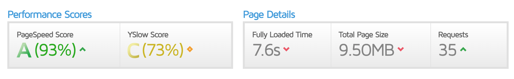


  
[*GTmetrix Scores*](https://gtmetrix.com/reports/dashiellbarkhuss.com/Cnasj9u9) **After**:
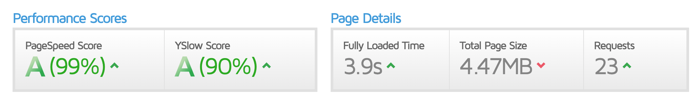

*No money spent.*

### 1. Add These Free Plugins

<hr>

1. [Self-Hosted Google Fonts](https://wordpress.org/plugins/selfhost-google-fonts/)
   - Video: [WordPress Speed Optimization: Optimize External Resources: Google Fonts section](https://youtu.be/JZVaeJwp7Zs?t=1727)
2. [WP-Optimize](https://wordpress.org/plugins/wp-optimize/)
   - Video: [Step 6: Clean Up Database With WP-Optimize](https://www.youtube.com/watch?v=vXgIVbcvGiw&t=1099s)
3. [WP Fastest Cache](https://wordpress.org/plugins/wp-fastest-cache/)
   - Article: [Online Media Masters: WP Fastest Cache Settings](https://onlinemediamasters.com/wp-fastest-cache-settings/)
   - Video: [Steps 3-5: Configure WP Fastest Cache or W3 Total Cache Plugin](https://www.youtube.com/watch?v=vXgIVbcvGiw&t=560s)-Online Media Masters
4. [Asset CleanUp](https://wordpress.org/plugins/wp-asset-clean-up/)
   - Video: [Speed Up WordPress in 2019: Asset CleanUp section](https://youtu.be/ATXACFtcyKs?t=778)

### 2. Defer Parsing of Javascript
<hr>

*Article on **why** & **how**:* [How to Defer Parsing of JavaScript Properly](https://technumero.com/defer-parsing-of-javascript/)

*Video on **how**:* [Step 7: Defer Parsing Of JavaScript](https://www.youtube.com/watch?v=vXgIVbcvGiw&t=1142s)

**How:**

Add this to the end of `functions.php`. I added it to my parent theme. But maybe it would also work if you have a child theme.
```php
<?php //php tag added only for github markdown.
function defer_parsing_of_js( $url ) {

     if ( is_user_logged_in() ) return $url; //don't break WP Admin
     if ( FALSE === strpos( $url, '.js' ) ) return $url;
     if ( strpos( $url, 'jquery.js' ) ) return $url;
     return str_replace( ' src', ' defer src', $url );
}
add_filter( 'script_loader_tag', 'defer_parsing_of_js', 10 );
?>
```

If you have users on your site outside of admins, you might want to change the `is_user_logged_in()` code to one of the wordpress functions that tells if an admin is logged in.

#### **A note on WP Fastest Cache\*\*
<h3 id= "wpfc-defer"></h3>

Using WP Fastest Cache with [these settings](#wpfc-settings), WP Fastest Cache creates a *combined js* file. To defer this file, you'll need to do ***extra coding***.

WP Fastest Cache bypasses the core WordPress hooks. So WP Fastest Cache ignores the above php code[(*source*)](https://wordpress.org/support/topic/how-to-defer-javascript-when-the-tag-of-enqueued-script-has-two-src-urls/#post-12857234).

<h3 id ="wpfc-defer-update"></h3>

***UPDATE/WARNING**: While the solution below worked to defer the file, it broke my site. After the first load, my site looked fine. But upon refreshing with browser-caching enable, my hero image and video looked strange. I deleted this tweak in my code. Still, the code might help you, so here it is.*

**Defer the WP Fastest Cache combined js script:** Add "`defer`" to the code that generates the script tag. Remember to change this whenever you upgrade the plugin.

*Line 240, wp-content/plugins/wp-fastest-cache/inc/js-ulilities.php*:
```php
<?php //php tag added only for github markdown.
$newLink = "<script defer src='".$jsLink."/".$jsFiles[0]."' type=\"text/javascript\"></script>";
?>
```
#### Premium Cache Plugin $$$
If this workaround doesn't suite you, WP Fastest Cache *Premium* can do this at the click of a button. However, [Online Media Masters recommends](https://onlinemediamasters.com/wp-fastest-cache-settings/) WP Rocket if you are going to pay for premium.
> Is WP Fastest Cache Premium worth it?
>
>If you're going to spend money on a premium cache plugin, most people use WP Rocket since it comes with more features than WP Fastest Cache Premium and will typically yield better results.

Of course, if you love quality, saving money, and have questionable morals you can try to get the torrent for the plugin. I don't judge! Especially because I tried to do that myself but had trouble getting the torrent to work.


WP Fastest Cache Premium costs a one time payment of $49.99. The pricing for WP Rocket is more confusing- it seems like it would come out more expensive.

### 3. Optimize Images & Videos
<hr>

To **optimize images**:
  - Video: [Speed Up WordPress in 2019: Optimizing & Compressing Images](https://www.youtube.com/watch?v=ATXACFtcyKs&t=1207s)

**Another resource** I haven't watched. It covers- Serve Scaled images, Specify Image Dimensions, and Lossless Compression:
  - Video: [WordPress Speed Optimization: Optimize Images](https://youtu.be/JZVaeJwp7Zs?t=1336)

I **optimized my video** by using [HandBrake](https://handbrake.fr/)- *free software for optimizing mp4 videos.* More info:

   - Article: [Optimizing MP4 Video for Fast Streaming](https://rigor.com/blog/optimizing-mp4-video-for-fast-streaming)


### 4. Remove GoDaddy Redirect
<hr>

If you're using GoDaddy cPanel hosting, you may have a weird redirect- "`https://img.secureserver.net......`" in your waterfall. 

[Here's](#minimize-redirects) how to fix it.


### 5. What's left
<hr>

#### GTmetrix Recommendations:
At the end, I had 3 recommendations on GTmetrix lower than 99%:
1. Defer parsing of JavaScript
2. Use a Content Delivery Network (CDN) **0%**
3. Make fewer HTTP requests **84%**

#### 1. Defer parsing of JavaScript
This was addressed [here](#wpfc-defer-update).

#### 2. Use a Content Delivery Network (CDN)
This costs money so I'm skipping it.

#### 3. Make fewer HTTP requests

The free WP Fastest Cache [doesn't combine footer js files.](https://wordpress.org/support/topic/wp-fastest-cache-dont-combine-javascript-after-install-clearfry-and-deleting-it#post-11295205) That's left me with 7 external Javascript scripts. 


##### Possible solutions
1. Try other plugins
2. WP Fastest Cache Premium
3. Edit WP Fastest Cache free

If I were to edit WP Fastest Cache free, I would look at the code below. This code deals with javascript scripts in the header *(head? whats the difference?)*. But it could be modified to include the scripts in the footer.

*Line 736, wp-content/plugins/wp-fastest-cache/inc/cache.php*:
```php
<?php //php tag added only for github markdown.
if(isset($this->options->wpFastestCacheCombineJs)){

$head_new = $this->get_header($content);

if($head_new){
if(isset($this->options->wpFastestCacheMinifyJs) && $this->options->wpFastestCacheMinifyJs){
$js = new JsUtilities($this, $head_new, true);
}else{
$js = new JsUtilities($this, $head_new);
}

$tmp_head = $js->combine_js();

$content = str_replace($head_new, $tmp_head, $content);

unset($r);
unset($js);
unset($tmp_head);
unset($head_new);
 }
}
?>
```
I'm no WordPress/php expert. So it doesn't seem worth my time atm. Paying for premium is starting to sound good.

#### Hosting:
I'm using GoDaddy's cPanel shared hosting. Apparently, it's not known for speed. So I might switching to a different host. I've heard SiteGround is a good option.


### More Steps For You
<hr>

There may be more steps you need to take depending on your GTmetrix recommendations that are different than mine. Here are some good resources on optimizing your WordPress.

-  **Video**: [Speed Up WordPress in 2019: How To Optimize Your Website & Make It Load Fast](https://www.youtube.com/watch?v=ATXACFtcyKs) 
- **Text**: [How To Fix GoDaddy’s Slow WordPress Hosting Using An Array Of Tools + Plugins (And How To Check If Your GoDaddy Server Is Slow)](https://onlinemediamasters.com/slow-wordpress-hosting-godaddy/)
-  **Video**: [How To Fix Slow WordPress Site On Godaddy](https://www.youtube.com/watch?v=vXgIVbcvGiw)
- **Video**: [WordPress Speed Optimization - How I Got 100% GTmetrix Scores](https://www.youtube.com/watch?v=JZVaeJwp7Zs) 
  
### 05/10/20
#### LED Resource
- [Ultimate Guide to Connecting LED Light Strips to Arduino](https://www.makeuseof.com/tag/connect-led-light-strips-arduino/)
  
### 05/04/20

## Lucid Dream Home Lab Update
I've been working on the [lab](#lab-explanation) and I have made a lot of progress. Today, I'm going to share just one part of the lab: **sending a text message with your eyes in morse code**.

## Texting With Eye Movements
  

  

### Hardware:

 * [Heart and Brain SpikerShield Bundle](https://backyardbrains.com/products/heartandbrainspikershieldbundle) 

    - *discontinued.* An alternative option might be a [Ganglion from OpenBCI](https://shop.openbci.com/collections/frontpage/products/ganglion-board?variant=13461804483) 

Since the [Heart and Brain SpikerShield Bundle](https://backyardbrains.com/products/heartandbrainspikershieldbundle) is discontinued I would like to redo this with [OpenBCI](https://www.openbci.com/) in the near future. But, if you are up for it, you can try to adapt this project using an OpenBCI product on your own.

### How It Works
1. The subject wears electrodes connected to the hardware and signals in morse code. 
   - Looking left is akin to pressing down the telegraph button. Looking right is akin to releasing the button.
   - Holding your eyes left for 4 or more seconds and then looking right, means "send the message"
   - Holding your eyes right for 4 or more seconds and then looking left, means "I f**ked up! Delete the message so far."
2. The electrodes send data to the arduino program
3. The arduino program interprets the data. 
   1. It figures out which data means the eye moved left or right. 
   2. It converts the eye movements to morse code.
   3. It converts morse code to English. 
   4. It serial prints the message with the delimiter 'SND'.
4. The node program watches the serial port for data from the arduino. Once it sees the delimeter 'SND' it recieves the message. It then executes a bash file with the message.
5. The bash file takes the message and sends it to whomever is named "Mom" in your contacts. This only works if you have Messages app and a Mac I believe. 

### EOG
The hardware uses [EOG](https://en.wikipedia.org/wiki/Electrooculography). EOG records eye movement. Electrodes are placed on the outer edges of the eyes. The back of your eye has more electrical activity than the front (Don't quote me). So when you look left, the backs of your eyes are closer to the right electrode. And further from the left electrode. So the electrodes can sense a change occurred.

You get a bunch of data from the electrodes in the form of numbers from 1-1024 when you **analogRead()** the input stream in Arduino.

This is what the data looks like when mapped out visually over time.

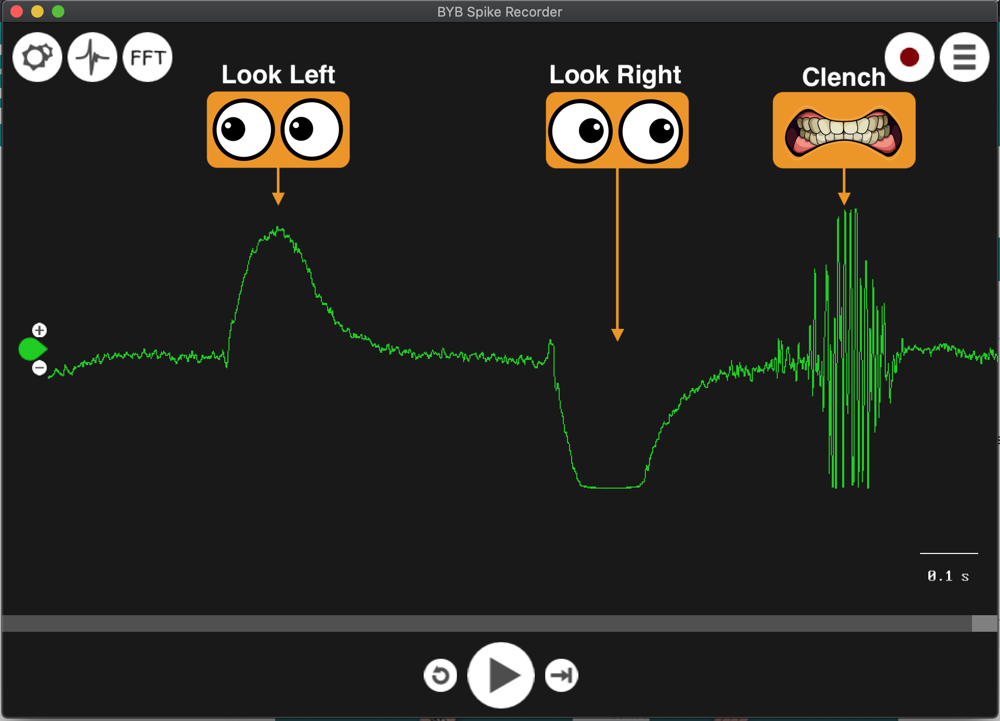

Clenching also affects the data. So in the code we detect jaw clenching but ignore it.  

*One thing isn't clear from the graph:*

You might think that if you hold your eye to the left, the peak will stay up and span a wider distance in the graph. But no. It will drop back down to the middle range immediately, regardless of how long you look left. If we want to know how long the eye stayed looking left, we look for a dip downward. That means the eye has move right, away from the left position it just occupied.

## Heart and Brain SpikerShield Setup

The alligator clip with the pink wire goes on the left side of your eyes. The red wire goes on the right side of your eyes. The black wire goes on your mastoid process. More info [here](https://backyardbrains.com/experiments/EOG)

### Arduino Code

```arduino

#define EOG A0

//Eye movement Variables

const int bufferSize = 20;
const int highThreshold = 600;
const int lowThreshold = 422;
int readingsBuffer[bufferSize]; //last readings

bool lastSignalWasLeft; //We must store that the last signal was left. 
                        //multiple "lefts" will get processed unless we tell 
                        //the sketch to ignore the signal once we know what it is
bool lastSignalWasRight; //^same for right


//Morse code Variables

unsigned long morseBitBase = 800 ; //morse bit length, you can change this to be longer or shorter depending on your morse code speed
unsigned long wiggleRoom = 0; //aka tolerance- you can add some extra milliseconds to account for accodentally going slower.

unsigned long morseBit = morseBitBase + wiggleRoom;
unsigned long morse3Bit = (morseBit *3) +wiggleRoom;


bool subjectStartedSignaling = false;

String subjectsMorseCode = "";

enum morseState {
  NEW_INTRA_CHARACTER,
  NEW_CHARACTER,
  NEW_WORD,
  NEW_MESSAGE //message variable
};

enum morseState currentMorseState = NEW_INTRA_CHARACTER;


unsigned long lastSignalChangeAt;
bool lastSignal;
unsigned long clearGapLength = morseBit*5 +wiggleRoom; //message variable 
unsigned long sendBeepLength = morseBit*5 +wiggleRoom; //message variable


//message variables
String delimeter = "SND";

String message = "";


void setup() {
  Serial.begin(115200);
}

void loop() {
   int reading = analogRead(EOG);
   unsigned long now = millis();
   updateReadingsBuffer(reading);

    //---------------determine if the last analogRead signals was an eye movement---------------------
 
   String eog = determineEOGSignal(); //returns string "Left", "Right", "Jaw", "Normal"
   bool eyeMovementDetected = eog == "Right" || eog == "Left";

  //------------------------------Morse Code------------------------------
    if (eyeMovementDetected){ 

                if (!subjectStartedSignaling) {
 
                    subjectStartedSignaling = true; 

                } else {

                  unsigned long signalLength = now-lastSignalChangeAt;
                  char morseIntraChar = signalToMorse(signalLength, lastSignal);
           
/////////////////////////////////////////////////////////////
//         All of the Serial.print's need to be commented out 
//         when you are actually sending this to node 
//         except for 'Serial.println(message +"SND");'
//         However, they can be helpful for depugging.
//         So I am leaving them in, commented out.
//////////////////////////////////////////////////////////////

//                Serial.print("subjectsMorseCode: '");Serial.print(subjectsMorseCode);Serial.println("'");
            
                  if (morseIntraChar != 'g' && morseIntraChar != '*' && morseIntraChar != 'S'){
                    subjectsMorseCode.concat(morseIntraChar);
                  } else if (morseIntraChar == 'S'){
                    Serial.println(message +"SND");
                    message = "";
                    subjectsMorseCode ="";
                  } else if (morseIntraChar != '*' && morseIntraChar != 'S'){
                      if (currentMorseState == NEW_CHARACTER || currentMorseState == NEW_WORD){
  
                          char engChar = morseToEnglishChar(subjectsMorseCode);
//                          if (engChar=='*')Serial.print("error, wrong input: "+subjectsMorseCode);
//                          Serial.print(" char: ");
//                          Serial.println(engChar);
                          
                          if (engChar!='*'){
                            if(currentMorseState == NEW_WORD) message.concat(" ");
                            message.concat(engChar); 
//  
//                            Serial.print("message pending: ");
//                            Serial.println(message);
                          }
                          subjectsMorseCode ="";
                      } else if (currentMorseState == NEW_MESSAGE){
                        message = "";
                        subjectsMorseCode ="";
//                         Serial.print("cleared message pending: ");
//                          Serial.println(message);
                      }
                  }
                }
                          
          lastSignalChangeAt = now;
          lastSignal = eog == "Right" ? 0 : 1;
        }


} //==========end void loop========

//===============================Eye Movement Interpretation functions=========================
void updateReadingsBuffer(int reading){    
  for(int i = 0; i < bufferSize-1; i++)
    {
      readingsBuffer[i] = readingsBuffer[i+1];
    }
  readingsBuffer[bufferSize-1] = reading;

}

String determineEOGSignal(){
    int reading = readingsBuffer[bufferSize-1];

    String determinedSignal;

        if(!isNormal(reading)){

        // what is the signal?
           if(signalIsJawClench(readingsBuffer)){
              determinedSignal = "Jaw"; //your jaw clenched

            } else if(signalIsEyeLeft(readingsBuffer) && !lastSignalWasLeft){
              lastSignalWasLeft = true;
              lastSignalWasRight = false;
              determinedSignal = "Left";

            } else if(signalIsEyeRight(readingsBuffer) && !lastSignalWasRight){
              lastSignalWasRight = true;
              lastSignalWasLeft = false;
              determinedSignal = "Right";
              
            } else {
              determinedSignal = "Normal";
            }

        } else {
              determinedSignal = "Normal";
        }
    return determinedSignal;
}

bool isNormal(int reading){ if (reading > lowThreshold && reading < highThreshold) {return true;}else{return false;}; }; 

bool isHigh(int reading){ if (reading > highThreshold) {return true;}else{return false;}; };
bool isLow(int reading){ if (reading < lowThreshold) {return true;}else{return false;}; };

bool signalIsJawClench(int readings[bufferSize]){
    for(int i = 0; i < bufferSize; i++)
    {
      if(isHigh(readings[i])){ //if any reading is high
          for(int i2 = i; i2 < bufferSize-i; i2++){
            if(isLow(readings[i2])){ // and any proceeding reading is low
                return true;
              }
          }
        }
      if(isLow(readings[i])){ //if any reading is Low
        for(int i2 = i; i2 < bufferSize-i; i2++){
          if(isHigh(readings[i2])){ // and any proceeding reading is HIgh
              return true;
            }
        }
      }
    }
      return false; 
}

bool signalIsEyeRight(int readings[bufferSize]){
    for(int i = 0; i < bufferSize; i++){
        if(!isHigh(readings[i])){
          return false;
        }
    }
    return true;
}

bool signalIsEyeLeft(int readings[bufferSize]){
    for(int i = 0; i < bufferSize; i++){
        if(!isLow(readings[i])){
          return false;
        }
    }
    return true;
      
}

//=============================Morse Code Interpretation functions===================================

char signalToMorse(unsigned long signalLength, bool signalType ){
  char morse;
    if(signalType){
      morse = interpretBeep(signalLength);
    } else {
      manageMorseState (signalLength);
      morse = 'g'; //gap
    }

    return morse;
}

char interpretBeep (unsigned long millisBeep){
  char meaningOfBeep;
  if ( millisBeep >= 100 && millisBeep <= morseBit){ 
    meaningOfBeep = '.';
  }  else if ( millisBeep > morseBit && millisBeep < sendBeepLength){  
    meaningOfBeep = '-';
  }else if ( millisBeep >= sendBeepLength){  
    meaningOfBeep = 'S'; //means "SEND"
  } else {
    meaningOfBeep = '*'; //means noise- ignore
  }

  return meaningOfBeep;
}

void manageMorseState (unsigned long millisGap){  
  if ( millisGap < 100 ){
      return; //noise
  } else if ( millisGap >= 100 && millisGap <= morseBit){ 
    currentMorseState = NEW_INTRA_CHARACTER;
  }  else if ( millisGap >= morseBit && millisGap < morse3Bit){ 
    currentMorseState = NEW_CHARACTER;
  } else if ( millisGap > morse3Bit && millisGap < clearGapLength ){ 
      currentMorseState = NEW_WORD;
  }  else if ( millisGap > clearGapLength ){ 
      currentMorseState = NEW_MESSAGE; //aka clear last message
  }
}

char morseToEnglishChar(String morse)
{
//Serial.print("morse code: ");
//Serial.println(morse);

  static String letters[] = {".-", "-...", "-.-.", "-..", ".", "..-.", "--.", "....", "..", ".---", "-.-", ".-..", "--", "-.", "---", ".--.", "--.-",
                             ".-.", "...", "-", "..-", "...-", ".--", "-..-", "-.--", "--..", "E"
                            };
  int i = 0;
  char englishChar;

    if (morse == ".-.-.-")
    {
      englishChar = '.';        //for break
    }
    else if (morse == ".-.-.--")
    {
      englishChar = '!';        //for !
    } else if (morse == "..--..")
    {
      englishChar = '?';        //for ?
    }
    else
    {
      while (letters[i] != "E")  //loop for comparing input code with letters array
      {
        if (letters[i] == morse)
        {
          englishChar = (char('A' + i));
          break;
        }
        i++;
      }
      if (letters[i] == "E")
      {
        englishChar = '*';  //if input code doesn't match any letter, error
      }
    }

  return englishChar;                            
}
```

### Node.js Code

More info [here](https://medium.com/@machadogj/arduino-and-node-js-via-serial-port-bcf9691fab6a)

```node
const SerialPort = require('serialport');
const Readline = require('@serialport/parser-readline');
const shell = require('shelljs');

const port = new SerialPort('/dev/cu.usbmodem14101', { baudRate: 115200 });
const parser = port.pipe(new Readline({ delimiter: 'SND' }));
// Read the port data
port.on("open", () => {
  console.log('serial port open');
});
parser.on('data', data =>{
  console.log('got word from arduino:', data);

  shell.exec('./message "'+data+'-this message was sent to you by eye movements" "Mom"');
});
```
You need to `npm install shelljs` and `npm install serialport`.

## Bash File 

```bash
!#/bin/bash

MSG=${1?Error:no message}
CONTACT=${2?Error:no contact provided}

osascript -e 'tell application "Messages" to send "'"${MSG/\"/\\\"}"'" to buddy "'"${CONTACT//\"/\\\"}"'"'
```

You need change the permissions to allow the script to be executable for the user with `chmod +x filename` and you need use the correct bash interpreter location after the shebang (`!#`). More info [here](https://www.taniarascia.com/how-to-create-and-use-bash-scripts/).

## Wrap Up

So that's a quick overview. I hope to do a more thorough tutorial in the future. But I wanted to push this out soon for those who are curious.
### 04/05/20
I haven't been logging much. I'm trying to take a different approach. That being- *Don't talk about a project until it's complete.* It helps motivate me to finish the project. Also, logging slows me down. 

But I wanted to post some updates here.

<h3 id="lab-explanation"></h3>

## Lucid Dream Home Lab 
I'm currently building a lucid dream lab the will induce lucid dreams and enable a user to communicate from a lucid dream to the outside world. I started this project in 2012. But it's been an on and off adventure.

After participating in a lucid dream study at Northwestern, I was inspired to revisit the project and add some features that Northwestern had.

## Alpha Detection
Yesterday, I finished creating an alpha brain wave detector. This will be involved in detecting when a person is in REM from EEG data.

  

I did a lot of research on brain waves and signal filtering. I won't post all of that here. The info I got was mostly on Youtube. But here is the paramount video that helped me signal process the alpha waves:

[My Weekend Project: Audio Frequency Detector Using An Arduino](https://www.youtube.com/watch?v=wbeV0J30LGQ)

The only relevant part is the section on the code. For hardware, I'm going a different route- using the [Backyard Brains Heart and Brain SpikerShield](https://backyardbrains.com/products/heartandbrainspikershieldbundle). I followed their tutorial [Experiment: EEG-Record from the Human Brain](https://backyardbrains.com/experiments/EEG). I combined this Backyard Brains tutorial with the Youtube [Audio Frequency Detector](https://www.youtube.com/watch?v=wbeV0J30LGQ) tutorial in order to programmatically detect alpha waves.

## The Code

Though the project in the Youtube video detects audio frequency, it's pretty much the same for brain waves but the sampling frequency is different. 

```arduino
#include "arduinoFFT.h"
#define SAMPLES 128
#define SAMPLING_FREQUENCY 300

arduinoFFT FFT = arduinoFFT();
unsigned int samplingPeriod;
unsigned long microSeconds;

double vReal[SAMPLES];
double vImag[SAMPLES];


void setup() {
  // put your setup code here, to run once:
  Serial.begin(115200);
  samplingPeriod = round(1000000*(1.0/SAMPLING_FREQUENCY)); //PERIOD in microseconds


}

void loop() {
  for(int i=0; i<SAMPLES; i++){
    microSeconds= micros();
    
    vReal[i] = analogRead(0);
    vImag[i] = 0;

    while(micros()< (microSeconds + samplingPeriod)){
      
    }
  }

  FFT.Windowing(vReal, SAMPLES, FFT_WIN_TYP_HAMMING, FFT_FORWARD);
  FFT.Compute(vReal, vImag, SAMPLES, FFT_FORWARD);
  FFT.ComplexToMagnitude(vReal, vImag, SAMPLES);

  double peak = FFT.MajorPeak(vReal, SAMPLES, SAMPLING_FREQUENCY);
  
  if(peak<12 && peak >8){
    Serial.println("You have alpha waves of "+String(peak)+"hz. Your eyes must be closed."); 
  } else {
    Serial.println(String(peak)+"hz");
  }
}
```
Watch the tutorial to get an explanation of the code.

This project uses the library ardiunoFFT, which is a ***fast fourier transform*** library. Fourier transform is an algorithm that identifies frequencies from raw data. [Here's a great video explaining fourier transorm](https://www.youtube.com/watch?v=spUNpyF58BY).

Raw data will look like a bunch of numbers that, when mapped over time, will represent the waves. 

In my case, the electrodes glued to my head will *detect voltages from my brain*(don't quote me on this). Those numbers will look like this: 

**Example data:**
535
549
555
563
565
568
576
583
572
569
575
569
554
546
548
552
551
551
553
542 etc....

Each of these points of data occurred every 1 milliseconds. So you can map these numbers over time to get a visual idea of the waves:


  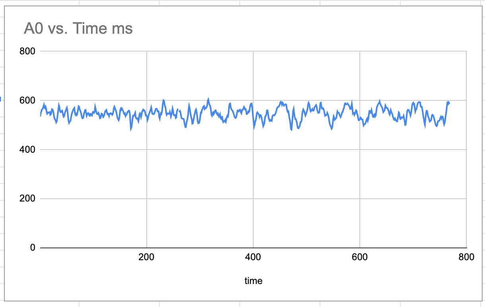

**Fourier transform** takes these numbers, and figures out the frequencies.

Let me know if you have any questions on Twitter [@DashBarkHuss](https://twitter.com/DashBarkHuss).

### 01/24/20
- ## Nutrition Project
  Yesterday we looked at daily values. Today I want to go through [my RDA's](https://health.gov/dietaryguidelines/2015/guidelines/appendix-7/) for my gender and age.

  Female 19-30 RDA's:

  **General:**
  - Energy: 1800 kcal
  - Water: 1500 g ---no RDA information

  **Vitamins**
  - B1 (Thiamine): 1.1 mg
  - B12 (Cobalamin): 2.4 μg
  - B2 (Riboflavin): 1.1 mg
  - B3 (Niacin): 14 mg
  - B5 (Pantothenic Acid): 10 mg ---no RDA information, cronometer put 5mg
  - B6 (Pyridoxine): 1.3 mg
  - Biotin: 300 μg ---no RDA information
  - Choline: 425 mg
  - Folate: 400 μg
  - Vitamin A: 700 mcg RAE ---cronometer put 2333 IU
  - Vitamin C: 75 mg
  - Vitamin D: 600 UI
  - Vitamin E: 15 mg
  - Vitamin K: 90 μg
  
  **Minerals**
  - Calcium: 1000 mg
  - Chromium: 120 μg ---no RDA information
  - Copper: 900 mcg
  - Iodine: 150 μg ---no RDA information
  - Iron: 18 mg
  - Magnesium: 310 mg
  - Manganese: 1.8 mg
  - Molybdenum: 75 μg ---no RDA information, cronometer put 45
  - Phosphorus: 700 mg 
  - Potassium: 4700 mg --cronometer put 2600
  - Selenium: 55 μg
  - Sodium: 2300 mg cronometer put 1500
  - Zinc: 8 mg

  **Carbohydrates**
  - Carbs: 130 g
  - Added Sugars: 10% of kcal
  - Fiber: 25.2 g

  **Lipids**
  - Fat: 20-35
  - Saturated Fat: 10% of kcal
  - Cholesterol: 300 mg  ---no RDA information

  **Protein**
  - Protein: 46 g

  ---no RDA information = number listed is cronometers DV's from yesterdays screenshots

  The macronutrients are of no importance to me. So let's disregard those.

  For my app, I'll just use what cronometer gave me for my micros.
  
  
### 01/23/20
- ## Nutrition Project
  I want to make something that has to do with nutrition density optimization. Nutrition density refers to the amount of micro nutrients per calorie.

  **Micronutrients**/**Calories**

  It's a not a specific measure, but it's used to describe foods. Organ meats are nutrient dense. Vegetables are generally more nutrient dense than fruits. Coconut oil is very low in nutrient density.

  Nutrient density isn't the "end all be all" to determining the best foods to eat, but it's a factor often over looked.

  **Macronutrients** include nutrients that provide calories: *fats*, *carbs*, and *protein*. **Micronutrients** are the vitamins and minerals.

  ## Daily Values
  I'll want to take note of the Daily Values for the USDA.

  Here are the **Daily Values** for a 2000 calorie diet according to the USDA, taken from Cronometer:

  **General:**
  - Energy: 2000 kcal
  - Water: 1500 g

  **Vitamins**
  - B1 (Thiamine): 1.5 mg
  - B12 (Cobalamin): 6 μg* 
  - B2 (Riboflavin): 1.7 mg
  - B3 (Niacin): 20 mg
  - B5 (Pantothenic Acid): 10 mg
  - B6 (Pyridoxine): 2 mg
  - Biotin: 300 μg
  - Choline: 550 mg
  - Folate: 400 μg
  - Vitamin A: 5000 IU*
  - Vitamin C: 60 mg
  - Vitamin D: 400 UI
  - Vitamin E: 20.13 mg
  - Vitamin K: 80 μg
  
  **Minerals**
  - Calcium: 1000 mg
  - Chromium: 120 μg
  - Copper: 2 mg
  - Iodine: 150 μg
  - Iron: 18 mg
  - Magnesium: 400 mg
  - Manganese: 2 mg
  - Molybdenum: 75 μg
  - Phosphorus: 1000 mg
  - Potassium: 3500 mg
  - Selenium: 70 μg
  - Sodium: 2400 mg
  - Zinc: 15 mg

  **Carbohydrates**
  - Carbs: 300 g
  - Added Sugars: 50 g
  - Fiber: 25 g

  **Lipids**
  - Fat: 65
  - Saturated Fat: 20 g
  - Cholesterol: 300 mg

  **Protein**
  - Protein: 50 g


  \* μ means micro, μg = micrograms

  \* IU means [International Unit](https://en.wikipedia.org/wiki/International_unit)

  To cross reference for accuracy, here's screenshots of Cronometer

  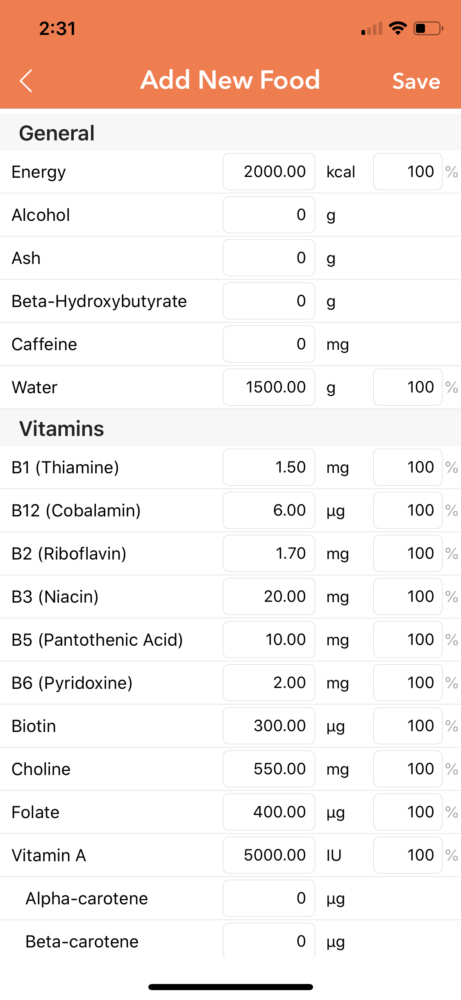
  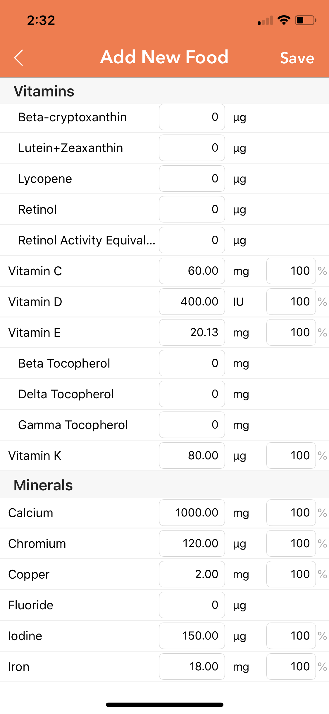
  
  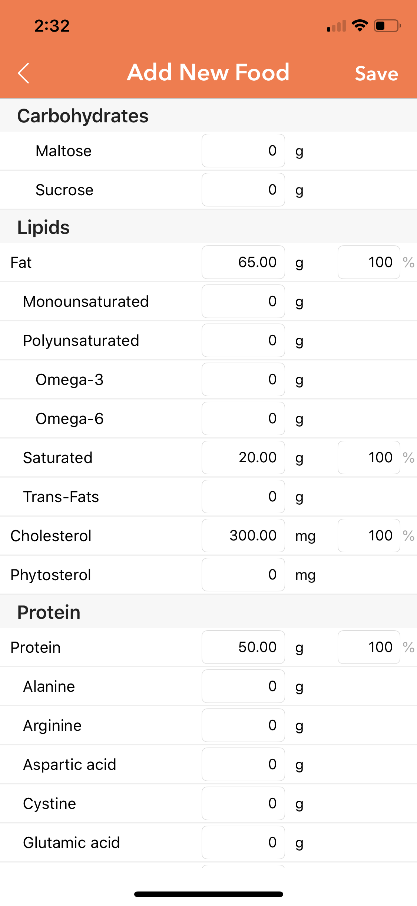

  ## Daily Values vs Recommended Dietary Allotment

  **Daily Values** are on USDA labels. For example, we see above that the DV for **Vitamin C is 60 mg**. So if a food has 30 mg of vitamin C, you'll see *"Vitamin C 50%"* on the label.

  But Daily Values on labels are not the recommendations for everyone. The USDA has different Recommended Dietary Allowances (RDA) *"for your age, gender and life stage. These recommendations don't change based on your size."*[-Cronometer forum](https://forums.cronometer.com/discussion/1829/what-are-chronometers-daily-mirco-nutrient-targets-based-on)
  
  [More info on RDA's](https://www.ncbi.nlm.nih.gov/books/NBK114332/)

  

### 01/22/20
- ## React Native
  Two days ago I got my app onto a phone. But I noticed that it wasn't user friendly.

  The key pad that popped up was for letters. Mine should be for numbers. Adding `keyboardType="numeric"` or `keyboardType="phone-pad"` to the input tag fixed this.

  But then there was no return button. The return button is nice because it moved the cursor to the next input.

  
  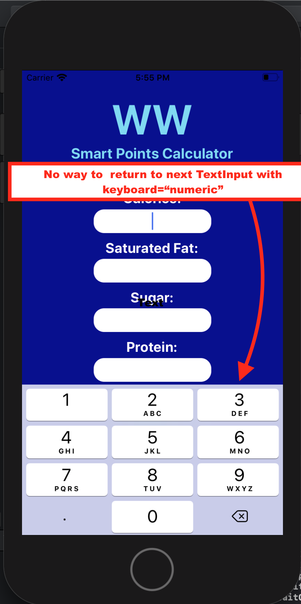

  Another issue was that on some phones, the keyboard cuts the bottom buttons off.

### 01/13/20
- ## React Native
  My mom and sister went on weight watchers. I made a weight watchers calculator so they can figure out the points without paying for the app.
  
  I still need to style it nicely, and learn how to um *deploy*? *compile*? I don't know the correct term. But I need to put the app on their phones.

  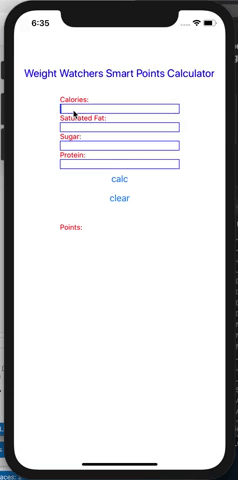

  Here's the app.js code:
  ```javascript
  /**
   * Sample React Native App
   * https://github.com/facebook/react-native
   *
   * @format
   * @flow
   */

  import React, { Component } from 'react';

  import {
    SafeAreaView,
    StyleSheet,
    TextInput,
    ScrollView,
    View,
    Text,
    StatusBar,
    Button,
  } from 'react-native';

  class App extends Component {

    constructor(){
      super()
      this.state = {
        cal: '',
        satFat:'',
        sugar:'',
        protein:'',
        points:''
      }
    }

    save(text, stateKey){
      this.state[stateKey] = text;
    }

    calculate(){
      let error=false;

      Object.keys(this.state).forEach(key=>{
          if (this.state[key]=='' && key!='points') error=true;
          console.log(error, this.state[key]);
      })
        
      if(error) return;
        const points = (this.state.cal * .0305) 
        + (this.state.satFat * .275) 
        + (this.state.sugar * .12) 
        - (this.state.protein * .098);
        
      this.setState({
            points
      })
    }
    clear(){
      this.setState({
        cal: '',
        satFat:'',
        sugar:'',
        protein:'',
        points:''
      })
    }
        
        render(){
          console.log('render', this)
          return (
            <View>
          <Text style={[styles.title]}>Weight Watchers Smart Points Calculator</Text>
          <Text style={[styles.label, styles.push]}>Calories:</Text>
          <TextInput style = {styles.input} onChangeText={(text)=>this.save(text, 'cal')}>{this.state.cal}</TextInput>
          <Text style={styles.label}>Saturated Fat:</Text>
          <TextInput style = {styles.input} onChangeText={(text)=>this.save(text, 'satFat')}>{this.state.satFat}</TextInput>
          <Text style={styles.label}>Sugar:</Text>
          <TextInput style = {styles.input} onChangeText={(text)=>this.save(text, 'sugar')}>{this.state.sugar}</TextInput>
          <Text style={styles.label}>Protein:</Text>
          <TextInput style = {styles.input} onChangeText={(text)=>this.save(text, 'protein')}>{this.state.protein}</TextInput>
          <Button style = {styles.button} onPress= {this.calculate.bind(this)} title="calc"></Button>
          <Button style = {styles.button} onPress= {this.clear.bind(this)} title="clear"></Button>
          <Text style={[styles.label, styles.push]}>Points:</Text>
          <Text style = {styles.points}>{this.state.points}</Text>
        </View>
    );
      }
  };

  const styles = StyleSheet.create({
    title:{
      marginTop:110,
      marginHorizontal: 20,
      fontSize:21,
      color: 'blue'
    },
    push:{
      marginTop:30
    },
    label:{
      color: 'red',
      borderColor: 'blue',
      marginHorizontal: 90,

    },
    input:{
      color: 'red',
      borderColor: 'blue',
      borderWidth:1,
      marginHorizontal: 90,
    },
    points:{
      color: 'red',

      marginHorizontal: 90
    },
    button:{
      marginTop:90,
      color: 'red',
      borderColor: 'blue',
      borderWidth:1
    }
  });

  export default App;
  ```
### 01/12/20
- ## Bot
  My bots been up and it's used no dyno hours. I'm not sure how this is possible. It might be becaus eI have it up as a worker now. But I thought I had it up that way before and the hours were still going down.
  
### 01/11/20
- ## Shell Scripting
  Yesterday, I wanted to get a boolean.

  I tried 
  ```bash
  echo [ u == u ]
  >> [ u == u ]
  ```

  It just returned the statement back to me. What's going on?

### 01/09/20
- ## Shell Scripting

  To set an env variable in the terminal:
  ```bash
  export var=value
  echo $var 
  >> value
  ```
  -*from [UNIX: Set Environment Variable](https://www.cyberciti.biz/faq/set-environment-variable-unix/)*

  Get A Substring:
  ```bash
  STRING="this is a string"
  POS=1
  LEN=3
  echo ${STRING:$POS:$LEN}   # his
  ```
  -*from [Basic String Operations](https://www.learnshell.org/en/Basic_String_Operations)*

  
### 01/08/20
I'm on Siesta Key on Vacation, so I've been taking a break from my regular coding, and learning some shell scripting! Let's learn some more!

- ## Shell Scripting
  
  [Heroku CLI Commands](https://devcenter.heroku.com/articles/heroku-cli-commands)

  I'm got these commands from [CLI commands for dyno management](https://devcenter.heroku.com/articles/dynos#cli-commands-for-dyno-management):

  ```bash
  //turn on a dyno
  heroku ps:scale worker=1 -a helpmecodebot

  //stop a dyno
  heroku ps:stop worker.1 -a helpmecodebot

  //see if your dyno is on
  heroku ps -a helpmecodebot
  ```

  I want to make a script that turns the dyno on and off depending on if computer is on or not.

### 01/07/20

- ## Shell Scripting
  ## 1st Tutorial
  I wanted to write a bash script in unix so I followed this tutorial: [How to make a simple bash script (Mac)](https://www.hastac.org/blogs/joe-cutajar/2015/04/21/how-make-simple-bash-script-mac)

  ## Terms
  I googled the difference between the terms: *terminal*, *bash*, *command line*, *console*, and *shell*. I use these terms interchangeably, which is probably incorrect.
  ## 2nd Tutorial
  Next, I looked at this   tutorial: [Quick guide to writing a bash script on the Mac/Linux command-line](http://omgenomics.com/writing-bash-script/). This one showed how to add variables to your script. The shebang line didn't work for me. I changed it to the shebang in the other tutorial above. 
  
  This second tutorial left out steps.  Like that you have to exit out of nano or add the variable in to the script. So, if you're new to command line, this second tutorial might be confusing.

  ## Open A File in VSC From Terminal

  First, make sure you set up VSC to work with the coomand line:
  >Correct way is to open Visual Studio Code and press `Ctrl+Shift+P` then type `install shell command`. At some point you should see an option come up that lets you install shell command, click it. Then open a new terminal window and type `code`.

  -*From [How To Open Visual Studio Code Using Terminal](https://askubuntu.com/questions/852076/how-to-open-visual-studio-code-using-terminal)*

  Then type in Terminal: 
  ```bash
  code myscript
  ```

  ## You Are Dreaming Script
  In my [lucid dream club meetups](https://www.meetup.com/Active-Dreaming-Group/), I like to make my computer tallk to people after I leave the room and make it tell them they are dreaming. I was doing this manually in the command line. Now, I wrote a script that I can use.

  ```bash
  #!/bin/bash

  FIRSTNAME=${1?Error:no first name given}
  LASTNAME=${2?Error:no last name given}

  sleep 17; say "Hello?"; 
  sleep 6; say "Hello"; 
  sleep 2; say "Hello, $FIRSTNAME."; 
  sleep 2; say "I have a message for you."; 
  sleep 1; say "Yes, You. $FIRSTNAME $LASTNAME"; 
  sleep 1; say "The message is this: You are dreaming, $FIRSTNAME. WAKE UP!"
  ```
  
  To call the function, you run this is the command line from the directory the script is in:

  ```bash
  code Shlomo Karbal
  ```


### 01/04/20

- ## React Native
  I'm trying to figure out how to change the black underlay to another color. 

  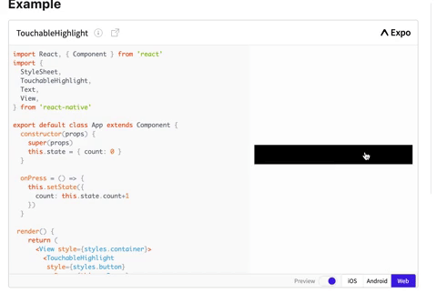

  Link to sample code: [Link](https://facebook.github.io/react-native/docs/touchablehighlight#onhideunderlay)

  [@adescode](https://twitter.com/adescode) on twitter helped me. Together we found this to be the answer:

  ```html
  <TouchableHighlight
          underlayColor='blue'>
  ```
  Add `underlayColor='<somecolor>'` to the `TouchableHighlight` tag.


### 01/03/20

- ## React Native
  I followed the instructions under the "***React Native CLI Quickstart***" tab on the page [Getting Started](https://facebook.github.io/react-native/docs/getting-started). This way, I can use modules that have native code. You can't with Expo.

  ## Linear Gradient
  Now I followed the instructions from the docs for [react-native-linear-gradient](https://www.npmjs.com/package/react-native-linear-gradient):

  >Add it to your project
  >
  >First, install it with `npm install react-native-linear-gradient --save`
  >
  >Then you can try to link the project automatically:
  >
  >`$ react-native link react-native-linear-gradient`

  I had to add `npx` to the second command: `npx react-native link react-native-linear-gradient` 

  This still gave me an error: something about `BVLinearGradient`. So I had to cd into `ios` and run `pod install`. That got rid of the error.

  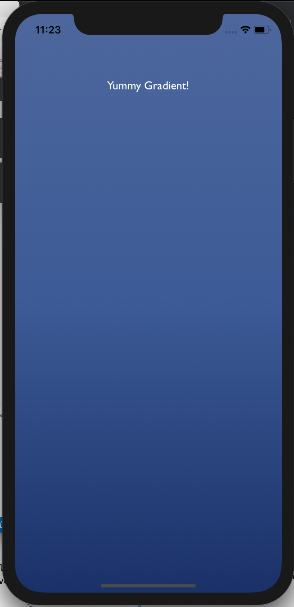

  Added to my project:

  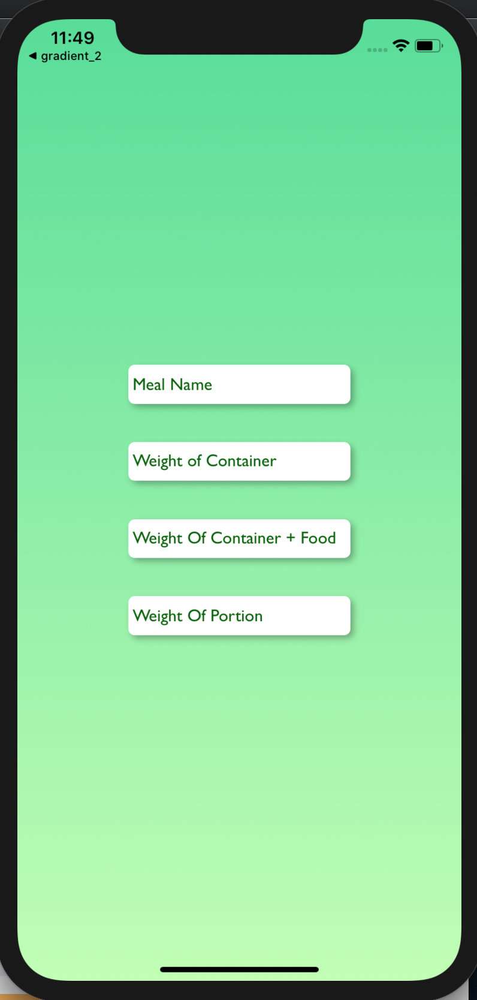


### 1/2/20

- ## React Native
  I'm having trouble. When I run `npm run ios` I got this:

  ```
  Invariant Violation: `<appName>` has not been registered. This can happen if: * Metro (the local dev server) is run from the wrong folder. Check if Metro is running, strop and restart it in the current project. A module failed to load due to an error and 'AppRegistry.registerComponent' wasn't called.
  ```

  I found that I had a terminal running so I closed it and tried again.

  But then I go this:

  ```
  No bundle URL present.
  
  Make sure you're running a packager server or have included a .jsbundle file in your application bundle.
  ```
  From [No Bundle URL Present](https://forums.raywenderlich.com/t/no-bundle-url-present/63018/9):

  >Before the step you’re asking about, you should have this code in the file:
  >
  >export default class App extends >`Component<{}> { 
     // A bunch of stuff
  }`
  >
  >Change the first line, so essentially you have:
  >
  >`class SearchPage extends Component<{}> {
  >  // A bunch of stuff
  >}`

  So I changed 
  ```javascript
  export default class App extends Component 
  ```
  To
  ```javascript
  class SearchPage extends Component
  ```
  Which gave me another error but then when I changed it back it somehow worked now. I don't know how that happened.

  ## Linking
  From the docs for [react-native-linear-gradient](https://www.npmjs.com/package/react-native-linear-gradient):

  >Add it to your project
  >
  >First, install it with `npm install react-native-linear-gradient --save`
  >
  >Then you can try to link the project automatically:
  >
  >`$ react-native link react-native-linear-gradient`

  This doesn't work for me. I get:
  ```bash
  bash: react-native: command not found
  ```

  Is this because I'm using Expo and I never installed the React Native CLI?

  How can you link with Expo?

  >You can't. It states this very clearly in [the docs](https://docs.expo.io/versions/latest/introduction/faq#what-is-the-difference-between-expo-and):
  >
  >>But no native modules…
  >>
  >>The most limiting thing about Expo is that you can’t add in your own native modules without detaching and using ExpoKit. Continue reading the next question for a full explanation.
  >
  >If you want to use anything that requires `react-native link`, then you need to [detach](https://docs.expo.io/versions/latest/expokit/detach) your project and then develop it [with or without ExpoKit](https://docs.expo.io/versions/latest/guides/expokit.html). You will lose certain features and integrations (off the top of my head, I think Push Notifications via Expo is one of them) when doing so, but that is the trade-off Expo provides as an all-in-one package. When detaching, you lose those features.
  
  *-from [react native link using expo?](https://stackoverflow.com/questions/44977693/react-native-link-using-expo)*

  So I guess I have to look into that!