# #100DaysOfCode Log - Round 1 - Dashiell Bark-Huss

## Day 94
### 4/4/19

- ## USDA Food Composition Database App
  
  ## CSS Issue
  I had this CSS issue. The Submit Button didn't align with the input.
  
  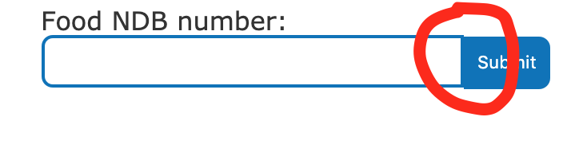
  
  ### Solution:
  
  I this was just the browsers style sheet adding padding to the top.
  
  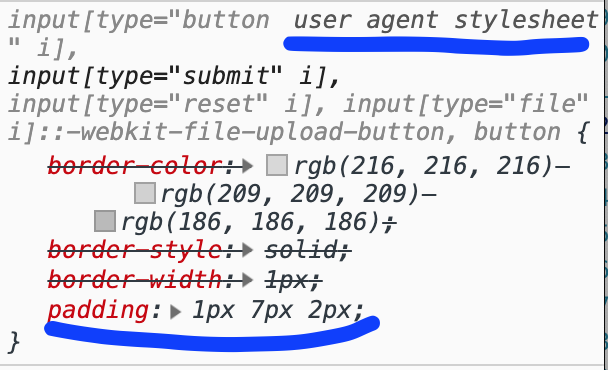
  
  ### Solution:
  
  So I added `padding:0;` to my style sheet to override the user agent stylesheet.
  
  ## Hiding The API Key
  
  Fellow #100DaysOfCoder [Evan Burnell](https://twitter.com/ev_burrell) suggested using [dotenv](https://t.co/DOuoLuePMZ).
  
  I found [this tutorial by Dev Coffee](https://www.youtube.com/watch?v=zDup0I2VGmk). It looked simple enough. I was intimidated at first by the backend/npm stuff. But It doesn't look too hard. I already have npm set up from when I took a tutorial on it on lynda.com.
  
  I didn't follow the tutorial yet. 
  
  ## Switching Gears
  
  So I know I keep starting apps and not finishing them. But, I feel like instead of setting up dotenv, I really should stick to what I need to learn: async/await, promises. 
  
  I also am super curious about playing with this other app idea I've had for awhile that also has to do with the USDA NDB API. It would take a recipe and users daily macros, and fit the recipe to their macros. It seems hard to me. So I just want to play around with the NDB API in the console and see if I can get a clearer idea of what I need.
  
  ## Playing More with NDB API
  
  ## Lists
  
  I wanted to play around with getting foods by the highest value for a nutrient. We have to get the list of nutrient codes first, because we'll need the code for the nutrient we want to pass into the params. 
  
  Here's the [NDB API Lists documentation](https://ndb.nal.usda.gov/ndb/doc/apilist/API-LIST.md)
  
  We need the param `lt=n` which means list type = nutrients. You can also get lists of other things like food groups. We'll also need to raise the max results, which defaults to 50. There are 196 nutrients in this list which you can see in the return response: `"total": 196`. But the max results defaults to 50. So we add the param `max=196'
  
  https://api.nal.usda.gov/ndb/list?format=json&max=196&lt=n&api_key=DEMO_KEY
  
  Now I can `cmd + f` to find the listing for the nutrients I want to play with. For example, protein is 203.
  
  ## Nutrient Reports

  Let's say I want to retrieve a bunch of foods with the highest iron. I need a nutrient report.
  
  Here's the [Nutrient Report documentation](https://ndb.nal.usda.gov/ndb/doc/apilist/API-NUTRIENT-REPORT.md).
  
  Iron's nutrient id is 205. If you do a nutrient search for any nutrient and the argument `sort=c`, to sort by nutrient content, you get two problems:
  
  - bunch of results, too many. 
  - No standard weight: The results aren't organized by value per 100g. Instead it sorts it by value for other weights. Which makes comparisons hard.
   
  To reduce the number of results I added food groups to the parameters. You can use lists to get a list of food groups:
  
  
  **Food Groups List:** https://api.nal.usda.gov/ndb/list?format=json&lt=g&api_key=DEMO_KEY
  
  You can only use 10 groups in your search so I went with the one most relavant to keto paleo, since that's what my app with deal with:
  
  ### Relevant Food Groups
  - Beef Products: 1300
  - Dairy and Egg Products: 0100
  - Fats and Oils: 0400
  - Finfish and Shellfish Products: 1500
  - Fruits and Fruit Juices: 0900
  - Lamb, Veal, and Game Products: 1700
  - Nut and Seed Products: 1200
  - Pork Products: 1000
  - Poultry Products: 0500
  - Vegetables and Vegetable Products: 1100
  
  
  #### These also seemed MAYBE relevant but I didn't have enough room:
  - Sausages and Luncheon Meats: 0700
  - Spices and Herbs: 0200
  - American Indian/Alaska Native Foods: 3500
  - Legumes and Legume Products: 1600
  
  #### Here's the search for all these food groups for iron:
  
  https://api.nal.usda.gov/ndb/nutrients/?format=json&api_key=DEMO_KEY&nutrients=205&sort=c&fg=1300&fg=0100&fg=0400&fg=1500&fg=0900&fg=1700&fg=1200&fg=1000&fg=0500&fg=1100measureby=g

  ### No Standard Weight Problem
  
   If you use USDA Food Composition Databases's [nutrient search](https://ndb.nal.usda.gov/ndb/nutrients/), you can specify to *measure by 100g*. I wondered if there's an equivilet param for the api. The param in the search is `measureby=g`. But when I add that to my api url:

  https://api.nal.usda.gov/ndb/nutrients/?format=json&api_key=DEMO_KEY&nutrients=205&sort=c&fg=1300&measureby=g

  vs. 

  https://api.nal.usda.gov/ndb/nutrients/?format=json&api_key=DEMO_KEY&nutrients=205&sort=c&fg=1300

  **It makes no difference.**
  
  What we can do is sort the objects after we retrieve them by **gm** instead of **value**. `sort=c` sorts the list by value. From the [documenntation for the NDB API Nutrient Reports](https://ndb.nal.usda.gov/ndb/doc/apilist/API-NUTRIENT-REPORT.md). 
  
  **value:** Value of the nutrient for this food
  
  **gm:**	The 100 gram equivalent value for the nutrient 
  

  ## Playing With a Sample Recipe
  I realized I might not really need the nutrient reports for what I want to do. I decided to start playing around with a sample recipe.
  
  I got the NDB numbers for some ingredients for a basic salad.
  
  ### Ingredients and NDBno
  
  - Beef, ground, 95% lean meat / 5% fat, raw: **23557**
  - Lettuce, cos or romaine, raw: **11251**
  - Oil, olive, salad or cooking: **04053**
  - Cauliflower, raw:  **11135**
  
  Tomorrow, I'll play with these. 
  
- ## Thoughts and Feelings:

  I'm kind of excited to play with this tomorrow! I think since I'll be grabbing more than one food, this might require multiple asynchronous functions. This would help me understand promises, async, await, etc. But I'm excited because it's part of an app idea I really want to make.
  
  Today I co-worked at Emerald Tavern Games and Cafe in Austin.
  
  
  
  

### 4/3/19

- ## USDA Food Composition Database App
  ## Using Regex When You Don't Know Regex
  
  I use regex a lot but I don't actually know regex very well.
  
  ## This is my process for using regex:
  
  1. **Google** the regex I want or something similar. 
     - Ex: "***regex zeros after decimal***"
  2. **Find some regex pattern to try out**, usually on stackoverflow. 
     - Ex: [Using RegEx how do I remove the trailing zeros from a decimal number](https://stackoverflow.com/questions/26299160/using-regex-how-do-i-remove-the-trailing-zeros-from-a-decimal-number)
     
  3. **Go to [regexr.com](https://regexr.com/)** to test your regex and play around with it. 
  4. Put the suggested Rexeg in the **Expression** field, replacing \[A-Z]\w+.
  
     - 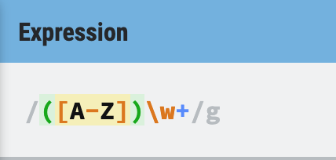
  
  5. Put the text you want to test in the **Text** area.
  
     - 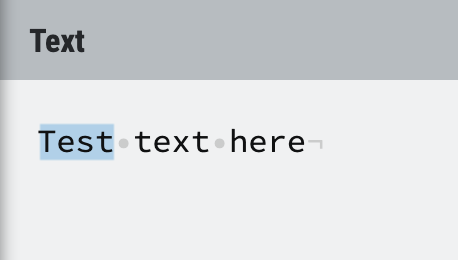
     
  6. Keep playing with the regex, googling additional help, etc until it highlights what you want.
  
  #### Warning: 
  
  There was one time when regexr.com didn't recognize some pattern that worked on another site. Check multiple regex tester sites if you get stuck.

  ## Remove Trailing Zeros
  
  I thought I should remove trailing zeros (***ex:*** 0.**000** to 0) with a regex and `.replace()`. But I couldn't find any regex that worked and I don't know regex well enough to figure it out. So I google "javascript remove trailing 0" and found [this](https://stackoverflow.com/questions/3612744/remove-insignificant-trailing-zeros-from-a-number) stackoverflow thread. 
  
  ### Remove trainig zeros
  
  ```javascript
  var n = 1.245000
  var noZeroes = n.toString() // "1.245"
  ```
  It works the other way too.
  ```javascript
  var n = "1.245000"
  var noZeroes = parseFloat(n) // "1.245"
  ```
  
  ## CSS Funk
  
  I'm not sure why the submit button isn't aligning with the input:
  
  
  
  ## To Do
  
  I did a lot of css today, and some code to format the labelVal to be rounded and without trailing zeros.
  
  ### Still Left
  
  - How to hide API key? can I do it without a backend?
  - Css fixes
  - PWA
  - word food search
  - try with promises, async/await
  
  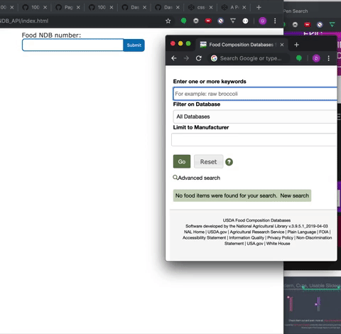
  
- ## Thoughts and Feelings:

  I didn't respect my stretch breaks. I need to do that! I'm feeling the effects.
  
  I went to a coworking meetup at Orange Co-Working in Austin.
  
  

## Day 92
### 4/2/19

  I accidently deleted a bunch of entries on my log some how. So I went back to an old commit and copied them back in.
  
- ## USDA Food Composition Database App
  ## DevTools Color Picker
  
  To use the color picker in dev tools, find a color square in the styles panel and click it.
  

  
  The color picker window should pop up. If the dropper is blue it means the color picker is activated. Hover over different colors in your browser window and click on the color you want to get the hex number. This also changes the color value for the property you originally clicked on when you clicked the color square.
  
  
  
  ## Design
  
  I want to model my design after the MyFitnessPal design so it's easy to look back and forth between my app and MyFitnessPal.
  
  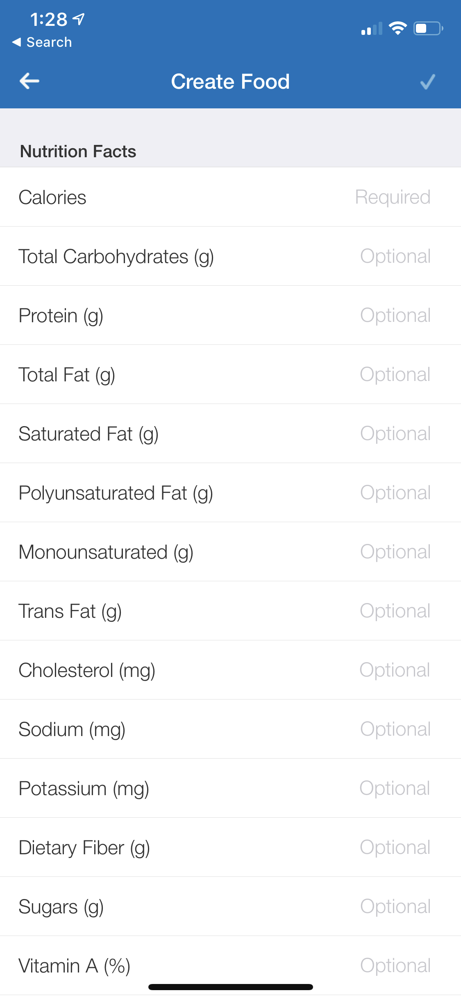 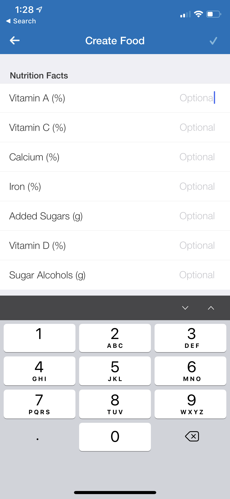 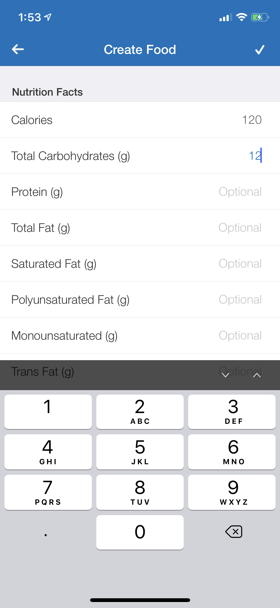
  
  ### MyFitnessPal Colors
  
  I used the color picker to find these colors with dev tools. I used these image files that are hosted here on githib.
  
  - Blue bar: #0071bb
  - Gray bar: #efeff4
  - Thin gray border: #d1d5da
  - "Create Food": #ffffff
  - Check: #7eb8de
  - "Nutrtion Facts": #333333
  - Nutrient Text: #343434
  - "Optional": #c7c7cc
  - Background: #ffffff
  - Typing text: ##0071bb
  - Previously entered text: #6a6a6a
  
  ## Layout
  
  I used this codepen to get ideas for how to position the label.
  
  https://codepen.io/scissorsneedfoodtoo/pen/MxVpLK
  
  ## CSS So Far
  
  This is what I have so far
  
  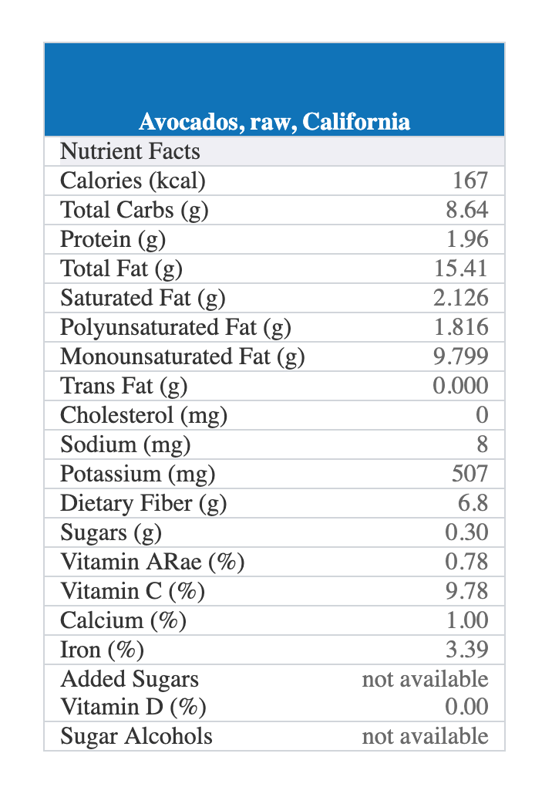
  
  ## Bye Bye
  
  I need to sign off, sorry about any mispellings- computer running out of power.

## Day 91
### 4/1/19

- ## Why I'm Quiting Coding Forever

  I'm not! April Fools.
  
  OK back to work

- ## Github Name

  I finally changed my github screenname from my old first grade AOL instant messenger account name to a more professional screenname. I didn't mind the cute screenname it's just that I've been using that screenname since I was 7 and I don't know what sort of crazy comments I've contributed to the internet since that time, let alone since last week. I'd rather not associate my professional identity with the crazy things I've posted on the internet in the last 21 years. And if you haven't posted crazy things on the internet in 21 years, then live a little and take some risks for your own sake! Just kidding.
  
- ## USDA Food Composition Database App
  ## Calculations

  Below I gathered together the information we need to figure out the calculations for the nutrient label. The values for USDA DV's are from [here on nih.gov](https://www.dsld.nlm.nih.gov/dsld/dailyvalue.jsp).
    
  | Nutrient            | MyFitnessPal Unit | USDA DV for % | DV unit | NDB unit |   |
  |---------------------|-------------------|---------------|---------|----------|---|
  | Calories            | kcal              |               |         | kcal     |   |
  | Total Carbs         | g                 |               |         | g        |   |
  | Protein             | g                 |               |         | g        |   |
  | Total Fat           | g                 |               |         | g        |   |
  | Saturated Fat       | g                 |               |         | g        |   |
  | Polyunsaturated Fat | g                 |               |         | g        |   |
  | Monounsaturated Fat | g                 |               |         | g        |   |
  | Trans Fat           | g                 |               |         | g        |   |
  | Cholesterol         | mg                |               |         | mg       |   |
  | Sodium              | mg                |               |         | mg       |   |
  | Potassium           | mg                |               |         | mg       |   |
  | Dietary Fiber       | g                 |               |         | g        |   |
  | Sugars              | g                 |               |         | g        |   |
  | Vitamin A           | %                 | 900           | RAE mcg | RAE mcg  |   |
  | Vitamin C           | %                 | 90            | mg      | mg       |   |
  | Calcium             | %                 | 1300          | mg      | mg       |   |
  | Iron                | %                 | 18            | mg      | mg       |   |
  | Added Sugars        | g                 |               |         | N/A      |   |
  | Vitamin D           | %                 | 20            | mcg     | IU       |   |
  | Sugar Alcohols      | g                 |               |         | N/A      |   |
  
  We'll need to do calculations for the nutrients that require percentages: 
  - Vitamin A
  - Vitamin C
  - Calcium
  - Iron
  - Vitamin D
  
  We'll also need to do calculations for any nutrient that's NDB value unit is different from MyFitnessPal's units or the DV units. The only one that applies to is **Vitamin D** which we'll need to convert from UI to mcg.
  
  - Vitamin D
    - The conversion for Vitamin D is [1 IU = 0.025 mcg.](https://dietarysupplementdatabase.usda.nih.gov/Conversions.php)
  
  ### Calculate the Percentages
  
  | Nutrient    | Calculation             |
  |-------------|-------------------------|
  | Vitamin A % | NDB value / 900         |
  | Vitamin C % | NDB value / 90          |
  | Calcium %   | NBD value / 1300        |
  | Iron %      | NBD value / 18          |
  | Vitamin D % | (NDB value * .025) / 20 |
  
  ## Regex: camelCase to Label
  
  I want to take the property of a value, which is written in camelCase, and use the property to create a displayable version for the user. 
  
  - ex. sugarAlcohols --> Sugar Alcohols
  
  I found this [stackoverflow thread](https://stackoverflow.com/questions/15369566/putting-space-in-camel-case-string-using-regular-expression) on how to add the space.
  
  ```javascript
  var rex = /([A-Z])([A-Z])([a-z])|([a-z])([A-Z])/g;

  "CSVFilesAreCoolButTXT".replace( rex, '$1$4 $2$3$5' );
  ```
  
  Then I found this [stackoverflow thread](https://stackoverflow.com/questions/1026069/how-do-i-make-the-first-letter-of-a-string-uppercase-in-javascript) on how to capitalize the first letter.
  
  ```javascript
  function capitalizeFirstLetter(string) {
    return string.charAt(0).toUpperCase() + string.slice(1);
  }
  ```  
  ## Working
  
  I got my app working!
  
  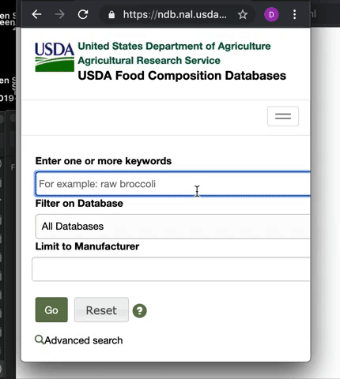
  
  I still need to: 
  - add css
  - double check this is all accurate, unit tests?
  - make into pwa
  
- ## Thoughts and Feelings:

  Spent extra time on this today, so I'm not going to post the work to save time. Plus I need to hide the key and I don't feel like figuring that right out.
  
## Day 90
### 3/31/19

- ## 100Daysofcode Tweet Search Project
  I'm taking a break from my twitter app project to play with the USDA NDB API to get better at working with api's and asynchronicity.

- ## USDA Food Composition Database App

  I spent a lot of time researching how US nutrition labels work. So a lot of this info may be boring to you if you read my log to see my *coding* journey. However, I really wanted to get this information down because it's surprisingly difficult to find and it may help others who are interested in nutrition and/or coding.

  ## Manually Search For a Food Item
  
  This is where you search food items on the USDA database website.
  
  - https://ndb.nal.usda.gov/ndb/search/list
  
  This page will help us for this project to find the corresponding NBD number for each food item, although, you *can* do this with the api. I will learn how to do it with the API later.

  ## Serving Size
  
  The user needs to know the serving size when they enter a new food on MyFitnessPal.
  
  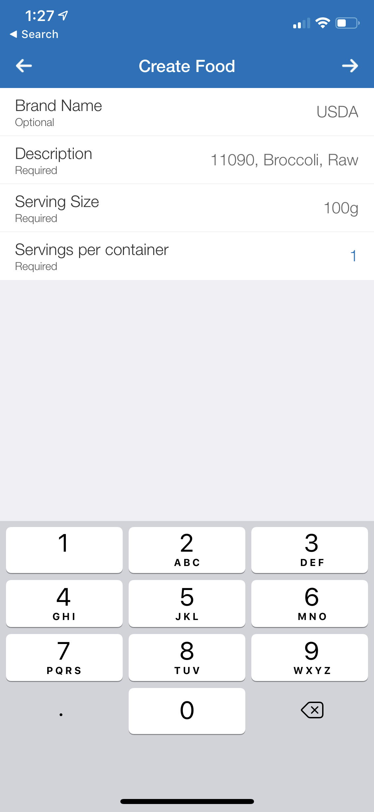
  
  ### 100 gram serving
  I found out on the [documentation for the NBD food reports](https://ndb.nal.usda.gov/ndb/doc/apilist/API-FOOD-REPORTV2.md) that the nutrients listed are for an **100 gram serving** of each food item. I'll also need this info later if I'm going to give the user the option to get different serving sizes.
  
  ## Nutrition Label Daily Values
  
  ### Daily Values:
  
  > Recommended intakes of nutrients vary by age and gender and are known as Recommended Dietary Allowances (RDAs) and Adequate Intakes (AIs). However, one value for each nutrient, known as the Daily Value (DV), is selected for the labels of dietary supplements and foods. 
  
  *[Daily Values, nih.gov](https://ods.od.nih.gov/HealthInformation/dailyvalues.aspx)*
  
  To calculate the percentages for the labels, I need to know the total **daily values** for each nutrient on US nutrition labels.
  
  - For example, there's 0.73mg of iron in broccoli. *We need to know how many mg of iron make 100% of the daily value on food labels.* The answer is *18mg* of iron is *100%*. 0.73mg is ***4%*** of 18mg. So 4% iron would be the percent value for the USDA label.
  
  ### Where Can We Find The Label DV's?
  
  There are old label daily values, and new ones which will be enforced [by January 1st, 2020 for large companies](https://en.wikipedia.org/wiki/Reference_Daily_Intake#Food_labeling_reference_tables). I'm going to go with the **new values.**
  
  I'm a little confused, but I believe the correct values for the new labels are in the "Adults and Children >=4 years" column [on this table](https://www.dsld.nlm.nih.gov/dsld/dailyvalue.jsp). There's also a table [here on wikipedia](https://en.wikipedia.org/wiki/Reference_Daily_Intake#Food_labeling_reference_tables) but it has separate values for men and women, and I'm not sure which side to go with to match US food labels. There's yet another table [here on wikipedia](https://en.wikipedia.org/wiki/Nutrition_facts_label#United_States) which has different units and I can't tell if the right-hand column is meant to be the new label values or not. So I'm going to go with the [NIH page](https://www.dsld.nlm.nih.gov/dsld/dailyvalue.jsp) since it's on a goverment website and that seems more legit. I don't know why this was so hard to figure out.

  #### I'm Using These Values:
 
  - **Adults and Children >=4 Years Column** [NIH page](https://www.dsld.nlm.nih.gov/dsld/dailyvalue.jsp)


  ## What Info Does MyFitnessPal Request?
  
  Here you can see what info MyFitnessPal asks for, which pretty much corresponds to what you'd see on a **USDA food label**.
  
   
  
  ### Nutrients
  - Calories
  - Total Carbs (g)
  - Protein (g)
  - Total Fat (g)
  - Sat Fat (g)
  - Polyunsat Fat (g)
  - Monounsat Fat (g)
  - Trans Fat (g)
  - Cholesterol (mg)
  - Sodium (mg)
  - Potassium (mg)
  - Fiber (g)
  - Sugars (g)
  - Vitamin A (%)
  - Vitamin C (%)
  - Calcium (%)
  - Iron (%)
  - Added Sugar (g)
  - Vitamin D (%)
  - Sugar Alcohols (g)
  
  ## Vitamin D Confusion
  
  In the API for each food item, there are *two* objects containg the vitamin d information. One has the property value **"name":"Vitamin D"**. The other is **"name":"Vitamin D (D2 + D3)"**. I'm not sure which goes in food labels.
  
  ### Use "name":"Vitamin D"
  
  I think we use the **"name":"Vitamin D"** object instead of **"name":"Vitamin D (D2 + D3)"**. 
  
  But the only reason I think this is because on [this government page about vitamin d](https://ods.od.nih.gov/factsheets/VitaminD-HealthProfessional/), in the table **"Table 3: Selected Food Sources of Vitamin D"**, you can see it shows that a large egg has 41 UI of Vitamin D which is 10% of the DV. When we go to the [NBD for eggs](https://ndb.nal.usda.gov/ndb/foods/show/01123?fgcd=&manu=&format=&count=&max=25&offset=&sort=default&order=asc&qlookup=Egg%2C+1+large&ds=SR&qt=&qp=&qa=&qn=&q=&ing=) we see that a large egg has 41 UI of ***Vitamin D*** and 1.0 µg of ***Vitamin D (D2 + D3)*** . So it looks like the 41 UI of ***Vitamin D*** is the value being referenced ***not*** the 1.0 µg of ***Vitamin D (D2 + D3)*** value.
  
  ### UI vs mcg
  
  To complicate things futher, the new labeling will require vitamin D to be labeled in mcg, not UI. Because of this, our [reference table for DV's](https://www.dsld.nlm.nih.gov/dsld/dailyvalue.jsp) listes 20mcg for vitamin D. But in the database, the values for Vitamin D are in UI. But the conversion is straight forward. 
  
  The conversion for Vitamin D IU is	1 IU = 0.025 mcg. This is not the same for all vitamins apparently. [See here.](https://dietarysupplementdatabase.usda.nih.gov/Conversions.php)
  
  ## Vitamin A Confusion
  
  There are also two listings for vitamin A, the object with **"name":"Vitamin A, RAE"** and **"name":"Vitamin A, IU"** .
  
  I believe we go with the **"name":"Vitamin A, RAE"** object, because on our [reference table](https://www.dsld.nlm.nih.gov/dsld/dailyvalue.jsp) the unit listing for vitamin A is **"Micrograms RAE (mcg)"** . Additionally, in [this conversion guide for the nutrient units](https://dietarysupplementdatabase.usda.nih.gov/Conversions.php) the new unit requirement for vitamin A is **"mcg RAE"**.  
  
  ### Vitamin A Unit Conversion
  
  **µg**: This funky symbol means microgram (mcg). That's the unit listing for **"name":"Vitamin A, RAE"**.
  
  The [conversion guide for the nutrient units](https://dietarysupplementdatabase.usda.nih.gov/Conversions.php) for the new label requirements show these conversions for vitamin A:
  
  - 1 mcg RAE = 1 mcg retinol
  - 1 mcg RAE = 2 mcg supplemental beta-carotene
  - 1 mcg RAE = 12 mcg beta-carotene
  - 1 mcg RAE = 24 mcg alpha-carotene
  - 1 mcg RAE = 24 mcg beta-cryptoxanthin
  
  So I'm not totally sure what's going on here. I think it's ***1:1*** for the **"name":"Vitamin A, RAE"** listing because it's already giving us micrograms of RAE. I think these conversions are not necessary for us.
  
  ## JSON Object Style Guide
  
  I'm making a JSON object that contains all the nutrients for a given food item. I always forget whether JSON properties should be snake_case or camelCase. [This stackoverflow thread](https://stackoverflow.com/questions/5543490/json-naming-convention) answered my question:
  
  >In this document Google JSON Style Guide (recommendations for building JSON APIs at Google),
  >
  >It recommends that:
  > 1. Property names must be camelCased, ASCII strings.
  > 2.  The first character must be a letter, an underscore (_) or a dollar sign ($).

  Here's the [guide they're referencing](https://google.github.io/styleguide/jsoncstyleguide.xml?showone=Property_Name_Format#Property_Name_Format).
  
  ## App So Far
  
  So far I'm able to grab all the values I need for a given NDB number:
  
  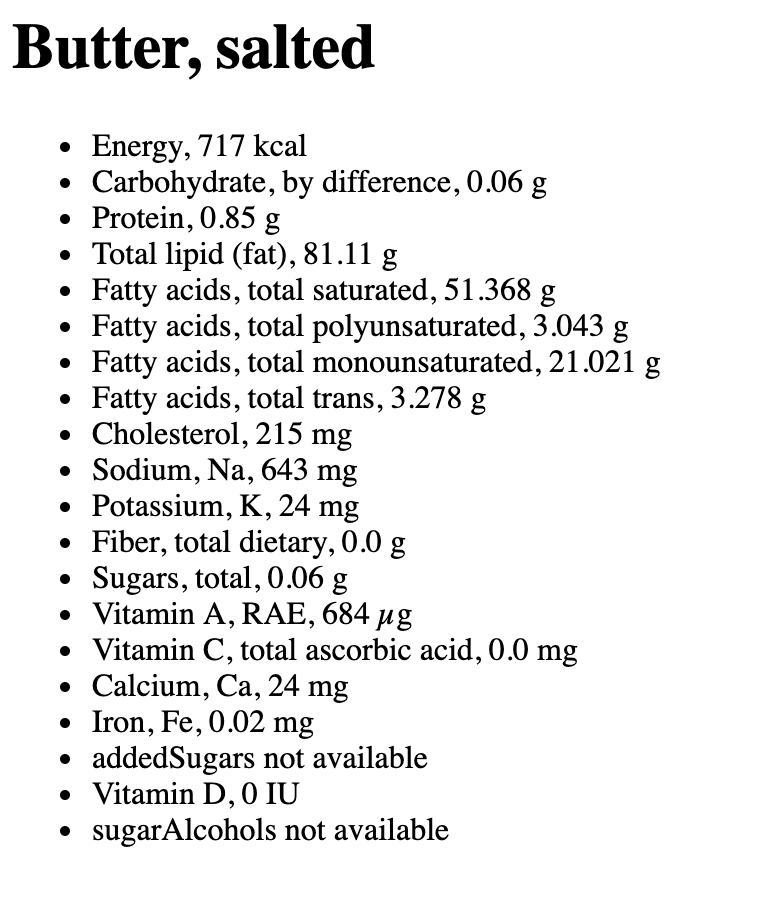
  
- ## Thoughts and Feelings:

  I spent so long just figuring out all this nutrition label info. So I'm not going to post my work for today, just to save time. It's already almost time for dinner and I should probably still do a little more actually coding if I have time. I'm so glad I got all this info down because it's been really annoying to find in the past year of my food logging.


## Day 89
### 3/30/19
- ## **Promises**
  
  I continued watching the videos recommended to me by [Khawar Jatoi](https://twitter.com/khawar_jatoi) to learn more about promises. Today, I watched the second video, [Promises - Part 8 of Functional Programming in JavaScript](https://www.youtube.com/watch?v=2d7s3spWAzo&vl=en). This is the list of videos Khawar sent me to watch ***in order***:

  
  1. [What the heck is the event loop anyway? | Philip Roberts | JSConf EU](https://www.youtube.com/watch?v=8aGhZQkoFbQ)
  2. [Promises - Part 8 of Functional Programming in JavaScript](https://www.youtube.com/watch?v=2d7s3spWAzo&vl=en)
  3. [async / await in JavaScript - What, Why and How - Fun Fun Function
](https://www.youtube.com/watch?v=568g8hxJJp4)

  Below are my notes on the *second video* and definitions I had to look up. I recommend watching the video and not relying on my notes, as these notes do not explain everything about promises. The notes are complementary definitions as well as concepts I felt like I needed to write down for my own understanding.

  ## Promises Video Notes
  
  **Composable:** "A composable function should have 1 input argument and 1 output value." *[hackernoon](https://hackernoon.com/javascript-functional-composition-for-every-day-use-22421ef65a10)*
  
  >*Function composition is a mathematical concept that allows you to combine two or more functions into a new function.*
  
  *[hackernoon](https://hackernoon.com/javascript-functional-composition-for-every-day-use-22421ef65a10)*
  
  >Promises serve that same purpose as callbacks do but promises are a bit more powerful because they are, unlike callbacks, composable.
  
  *[Promises - Part 8 of Functional Programming in JavaScript](https://www.youtube.com/watch?v=2d7s3spWAzo&vl=en)*
  
  ## Callback Hell, Why Have Nested Callbacks?
  
  In the tutorial, the instructor uses [this example to illustrate callback hell](https://youtu.be/2d7s3spWAzo?t=240), which happens when you want more than one image in this example:
  
  ```javascript
  import loadImageCallbacked
  from '.load-image-callbacked'

  let addImg = (src) => {
    let imgElement = 
      document.createElement('img')
    imgElement.src = src
    document.body.appendChild(imgElement)
  }

  loadImageCallbacked('images/cat1.jpg', (error,img1) => {     //------callback helll
    addImg(img1.src)
    loadImageCallbacked('images/cat2.jpg', (error,img2) => {
      addImg(img2.src)
      loadImageCallbacked('images/cat3.jpg', (error,img2) => {
        addImg(img3.src) 
      })
    })
  })
  ```
  
  I don't understand why you would do the above code to get multiple images instead of doing separate asynchronous functions that aren't nested like this:
  
  ```javascript
  loadImageCallbacked('images/cat1.jpg', (error,img1) => {
    addImg(img1.src)
  })

  loadImageCallbacked('images/cat2.jpg', (error,img2) => {
    addImg(img2.src)
  })

  loadImageCallbacked('images/cat3.jpg', (error,img2) => {
    addImg(img3.src)
  })
  ```
  
  I think it might have something to do with the event loop and what order these are called in, but I haven't wrapped my head around it yet.
  
  ### So what's the answer?
  
  I asked Khawar for help. He explained that in the nested version, it's guaranteed that the images load in order. But in my non-nested version you can't gaurentee the images will load in order.
  
  ## Moving On For Now
  
  I still have a bit to understand about promises, but I wanted to take a break from watching videos and do some coding. 
  
  I decided to start a food app I'd been meaning to work on for while. It will compile the **nutritional label values** for different foods by grabbing the **nutrient values from the USDA database** using their API. 
  
- ## USDA Food Composition Database App
  
  For those who aren't familiar with food tracking, the nutrient values on the **USDA database** *are not the same* as what you would see on the **nutritional labels** since the labels use a lot of percentages and the database uses value like 2mg, 300UI, etc. 
  
  I track my food intake on myfitnesspal.com. I often use the USDA database to get my nutrient values, but I have to do a lot of annoying math to convert the database values to percentages to enter into myfitnesspal. This app will take care of that math and do it for you.

  ## Nutrient Database API
  
  I'll be using the Nutrient Database API so this project will familiarize me with asynchronous functions and promises.
  
  I got my [NBD API key here](https://data.nal.usda.gov/dataset/composition-foods-raw-processed-prepared-usda-national-nutrient-database-standard-referen-15). Go down to the section called "Gaining Access".
    
  The documentation for the NBD can be found [here](https://ndb.nal.usda.gov/ndb/doc).
  
  ## Food Reports
  There are different types of reports you can get, but I will mostly need the food reports for my project.
  
  > A Food Report is a list of nutrients and their values in various portions for a specific food.
  
  *[What is a Food Report Version 2?](https://ndb.nal.usda.gov/ndb/doc/apilist/API-FOOD-REPORTV2.md)*
  
  The documentation for food reports is [here](https://ndb.nal.usda.gov/ndb/doc/apilist/API-FOOD-REPORTV2.md).
  
  With a food report I can look up a food by it's NBD number, let's say chinese cabbage which has a NBD number of 11119 which I happen to remember off the top of my head. Then you can grab the information for each nutrient: calories, iron, vitamin c, etc...
  
  I played around with traversing the JSON that was returned from this XMLHttpRequest:
  
  ```javascript
  
  let test = document.querySelector("#test");
  var url = "https://api.nal.usda.gov/ndb/V2/reports?ndbno=01009&ndbno=01009&ndbno=45202763&ndbno=35193&type=b&format=json&api_key=<your_API_Key_goes_here>";
  
  var xmlhttp = new XMLHttpRequest();

  xmlhttp.onreadystatechange = function() {
  if (this.readyState == 4 && this.status == 200) {
      var resp = JSON.parse(this.responseText);
      console.log(resp)
      myFunction(resp);
   }
  };
  xmlhttp.open("GET", url, true);
  xmlhttp.send();

  function myFunction(data) {

  document.getElementById("test").innerHTML = data;
  }
  ```
  
  I still have a bunch to do.
  
- ## Thoughts and Feelings:

  I liked this quote I came across:
  
  >A teacher’s failure to properly provide good real world examples will result in a student’s failure to understand why. 
  
  *[hackernoon](https://hackernoon.com/javascript-functional-composition-for-every-day-use-22421ef65a10)*
  
  It made me realize that I need to make sure I go out and find examples or ask questions that can illustrate why we do certain things in our code.

## Day 88
### 3/29/19
- ## **100Daysofcode Tweet Search Project**

  My peer on twitter, [Khawar Jatoi](https://twitter.com/khawar_jatoi), sent me some great links to learn more about promises. He sent me these three videos to watch ***in order***:
  
  1. [What the heck is the event loop anyway? | Philip Roberts | JSConf EU](https://www.youtube.com/watch?v=8aGhZQkoFbQ)
  2. [Promises - Part 8 of Functional Programming in JavaScript](https://www.youtube.com/watch?v=2d7s3spWAzo&vl=en)
  3. [async / await in JavaScript - What, Why and How - Fun Fun Function
](https://www.youtube.com/watch?v=568g8hxJJp4)

  Today, I watched the first video. It's only 27 minutes but it took me 1 hour and 45 minutes to go through it while taking notes and looking up words I didn't know. But wow! I understand how javascript works soo much better. 
  
  Below are my notes on the video and definitions I had to look up. I recommend watching the video and not relying on my notes, as these notes do not explain everything about event loops. The notes are complementary definitions as well as concepts I felt like I needed to write down for my own understanding.
  
  ## Event Loops Video Notes
  
  ## Definitions
  
  **JavaScript runtimes:** "JavaScript runtimes (like V8) have a heap (memory allocation) and stack (execution contexts). But they don’t have setTimeout, the DOM, etc. Those are web APIs in the browser." 
  
  *-from [JavaScript's Call Stack, Callback Queue, and Event Loop](http://cek.io/blog/2015/12/03/event-loop/)*
  
  

  *-image from [JavaScript's Call Stack, Callback Queue, and Event Loop](http://cek.io/blog/2015/12/03/event-loop/)*
  
  **Runtime System:** "...also called run-time system, runtime environment or run-time environment, primarily implements portions of an execution model." *-[Runtime system - Wikipedia](https://en.wikipedia.org/wiki/Runtime_system)*
  
  **Stack:** "The JavaScript interpreter in a browser is implemented as a single thread... only 1 thing can ever happen at one time in the browser, with other actions or events being queued in what is called the Execution Stack. *[What is the Execution Context & Stack in JavaScript?](http://davidshariff.com/blog/what-is-the-execution-context-in-javascript/)*
  
  "A data structure which records...where in the program we are." *[-Philip Roberts, youtube](https://www.youtube.com/watch?v=8aGhZQkoFbQ)*
  
  **Stack Trace:** State of the stack at a certain point in time during the execution of the program.
  
  **Heap:** Basically where memory allocation happens.
  
  **V8 Runtime:** "...an open-source JavaScript engine developed by The Chromium Project for Google Chrome and Chromium web browsers." *-[Chrome V8 - Wikipedia](https://en.wikipedia.org/wiki/Chrome_V8)*
    
  **Blocking:** What happens when things are slow.  *[-Philip Roberts, youtube](https://www.youtube.com/watch?v=8aGhZQkoFbQ)*
  
  >There's almost no blocking functions in the browser... they're all make asynchronous.
    
   *[-Philip Roberts, youtube](https://www.youtube.com/watch?v=8aGhZQkoFbQ)*
    
  **Shim:**
  >A shim is a piece of code used to correct the behavior of code that already exists, usually by adding new API that works around the problem.
  
  *[Shim, MDN web docs](https://developer.mozilla.org/en-US/docs/Glossary/Shim)*
    
  ## One Thing At A Time, Not Really?
  
  The Javascipt runtime can only do one thing at a time. **But we *can* do things concurrently** because the browser is *more* than just the runtime. The event loop, callback queue, and WebAPI's act like threads.

  ## Event Loop
  
  If an asynchronous function is pushed on to the stack, the browser starts the async function. Once it's passed to the browser, javascript is done dealing with the async function so it's popped off the stack. Javascript continues dealing with the other code while the browser deals with the asynchronous function. Once the browser is done with the WebAPI it pushes the callback onto the task/callback queue. The event loop sees if the stack is empty. If yes, then the event loop takes the first callback in the callback que and passes it on to the stack.
  
  Because of this, `setTimeout()` is not a *guaranteed* time of executions, it's *minimum* time of execution.
  
  
  ## Callbacks Definition Confusion
  
  I'd been confused about callbacks because poeple use the term differently.
  
  The two ways to use the term ***callback***:
  
   - Any function that another function calls
   
   - More explicitely, an asynchronous callback, as in one that's going to be pushed into the callback queue in the future
  
  ## Render Queue
  
  The browser wants to repaint the view 60 frames a second. If there's nothing in the stack, it can. But, just like the callback queue, the render queue has to wait until the stack is clear. The render queue takes precedence over the callback queue. This is one reason it's good to use asynchronous code when possible. This way the render queue has more chances to update the view. 
  
  
- ## Thoughts and Feelings:

   I learned really slowly today. A 27 minute video over 1 hour and 45 minutes. I made sure to soak it all up! Sometimes learning slow is helpful to me. Sometimes I like just a fast review. 
   
   This video clarified up so much for me. I understand a lot mor about the under workings of javascript now.
   
   Even though I started my code organized, it got a little crazy again. It's hard to manage when it's not organized. I wonder how I can learn to organize it better? What can I search? what resources can I find?
   
   Studied while on the road from NOLA to Lafayette.
   
   


## Day 87
### 3/28/19
- ## **100Daysofcode Tweet Search Project**

  ## Fixed Repeated Screen Names
  
  I forgot to apply my `uniqueInArray()` function to the `peopleLeft` array. That's why my generated tweet from yesterday was returning repeated screen names. So I added that in: 
  ```javascript
  peopleLeft = uniqueInArray(peopleLeft);
  ```
  
  ## Prototype
  
  I wanted to use prototypes so I thought I'd review them. I checked out a page on [w3schools](https://www.w3schools.com/jsref/jsref_prototype_string.asp) which defined prototypes:
  
  >The prototype property allows you to add new properties and methods to existing object types.
   
   from [*Javascript String Prototypes, w3schools*](https://www.w3schools.com/jsref/jsref_prototype_string.asp)
   
   W3schools has another page about [object prototypes](https://www.w3schools.com/js/js_object_prototypes.asp) but I think it's basically the same thing.
   
   It helps me to understand prototypes when I realize that:
   
   >All JavaScript objects inherit properties and methods from a prototype.
   
   from [*Javascript Object Prototypes, w3schools*](https://www.w3schools.com/js/js_object_prototypes.asp)
   
   I thought the page [*Javascript Object Prototypes, w3schools*](https://www.w3schools.com/js/js_object_prototypes.asp) did a good job of explaining protoypes.
   
   ## Prototypes on Native Objects- NO!
   
   I wanted to add a prototype to the String constructor, however I read: 
   
   >Only modify your own prototypes. Never modify the prototypes of standard JavaScript objects.
   
   from [*Javascript String Prototypes, w3schools*](https://www.w3schools.com/jsref/jsref_prototype_string.asp)
   
   More on why in [this stackoverflow thread](https://stackoverflow.com/questions/6223449/why-is-it-frowned-upon-to-modify-javascript-objects-prototypes). It has to do with namespaces.

   I wanted to add a prototype to string, because sometimes I like the look of dot notation better than passing in a string to a function ex: `myString.changeString()` vs `changeString(mystring)`. But maybe if I make more classes in my code I can add a prototype to what I want.
   
   I'm wondering **why you would ever want to add a prototype to your own objects?** Since you can create those objects from the start and just add the method there, why not just do that? 
   
   ## Promises
   
   I really need to undrestand promises because I'm using them in my app.
   
   I watched this [freecodecamp video on promises](https://www.youtube.com/watch?v=IGYxfTTpoFg). I really liked how the second part of that video shows the order that the different parts of the function are reached. This helps me see which part is asynchronous and which part goes in order.
   
   The instructor uses `setTimeout()` as the async function. But how would you get data from a json file using `new Promise()`? What does the async function look like for that? I used fetch before, but fetch is a totally different way of making a promise than the syntax for `new Promise()`. **How would you translate fetch into `new Promise()`?**
   
   I didn't finish reading this yet, but this article about [promises on hackernoon](https://hackernoon.com/understanding-promises-in-javascript-13d99df067c1) looks good and I think I'll check it out later.
   
   ## Async Functions
   
   This made me wonder what exactly is an async function? I know`setTimeout()` and `setInterval()` are async functions. Note: Today, I learned that:
   
   >These methods are not a part of JavaScript specification. But most environments have the internal scheduler and provide these methods. In particular, they are supported in all browsers and Node.JS.
   
   from [*Scheduling: setTimeout and setInterval, javascript.info*](https://javascript.info/settimeout-setinterval)
   
   I looked at the Mozilla Documentation on the [AsyncFunction object](https://developer.mozilla.org/en-US/docs/Web/JavaScript/Reference/Global_Objects/AsyncFunction) and [async function declarations](https://developer.mozilla.org/en-US/docs/Web/JavaScript/Reference/Statements/async_function)
  
   >An asynchronous function is a function which operates asynchronously via the event loop, using an implicit Promise to return its result.
   
   from [*Async Function Declaration*](https://developer.mozilla.org/en-US/docs/Web/JavaScript/Reference/Statements/async_function)
   
   >The AsyncFunction constructor creates a new async function object. In JavaScript every asynchronous function is actually an AsyncFunction object.
   
   from [*AsyncFunction Object*](https://developer.mozilla.org/en-US/docs/Web/JavaScript/Reference/Global_Objects/AsyncFunction)
   
   I don't think I know what the event loop is. So I need to look into that if I want to understand asynchronous functions.
   
   ## JavaScript is Single Threaded
   
   *JavaScript is Single Threaded*: I've heard this before, but [this page](https://medium.com/codebuddies/getting-to-know-asynchronous-javascript-callbacks-promises-and-async-await-17e0673281ee) finally explained this idea well by comparing javascript to other langauges that are multi threaded: 
   
   >In programming languages like e.g Java or C# the “main program flow” happens on the main thread or process and “the occurrence of events independently of the main program flow” is the spawning of new threads or processes that runs code in parallel to the “main program flow”.
   
   >This is not the case with JavaScript. That is because a JavaScript program is single threaded and all code is executed in a sequence, not in parallel. In JavaScript this is handled by using what is called an “asynchronous non-blocking I/O model”. ***What that means is that while the execution of JavaScript is blocking, I/O operations are not.*** 
   
   [*more here*](https://medium.com/codebuddies/getting-to-know-asynchronous-javascript-callbacks-promises-and-async-await-17e0673281ee#b97e)
   
   ## I/O Operations
   
   **What is an I/O operation?**:
   
   >I/O operations can be fetching data over the internet with Ajax or over WebSocket connections, querying data from a database such as MongoDB or accessing the filesystem with the NodeJs “fs” module. All these kind of operations are done in parallel to the execution of your code and it is not JavaScript that does these operations; to put it simply, the underlying engine does it.
   
   [Getting to know asynchronous JavaScript: Callbacks, Promises and Async/Await](https://medium.com/codebuddies/getting-to-know-asynchronous-javascript-callbacks-promises-and-async-await-17e0673281ee#b97e)
   
   **So if I/O operations are separate from javascript where do they come from?**:
   
   >All these kind of operations are done in parallel to the execution of your code and it is not JavaScript that does these operations; to put it simply, the underlying engine does it.
   
   [Getting to know asynchronous JavaScript: Callbacks, Promises and Async/Await](https://medium.com/codebuddies/getting-to-know-asynchronous-javascript-callbacks-promises-and-async-await-17e0673281ee#b97e)
   
   
  ## To do
  
  I spent a lot of time learning instead of coding. I'm really glad I got to learn a bit more. I've been trying to figure out promises and prototypes for a while, but kept putting it off. I'm glad I started, I still have more to review.
  
  Because I spent a lot of time learning, I really didn't code much so I still have a lot to do on my app.
   
   - design
   - understand promises more
   - test going back and forth
     - back doesn't work correctly
   - tweet length validation
   - save user startDate and starting participants to local storage, skip some views if those are saved
   
- ## Thoughts and Feelings:

   I liked focusing on learning today, and taking a break from coding. I've *really* wanted to learn more about async and promises. So I was excited to look into it. I still have a lot to learn, I'll probably revisiti it tomorrow. I might read more in my free time.

  My hands on coding fuels my desire to learn. The more I code the more I feel I need to understand a new concept. 

## Day 86
### 3/27/19
- ## **100Daysofcode Tweet Search Project**

   My app now works! It still needs to be designed better, and it needs some tweeks here and there but it works for the most part.
   
   
   
   ## Form Validation
   
   The **next** button is not actually part of the form. I wonder if it should be so it could be more like submit and work with enter?
   
   I'm trying to think of the best way to validate the form.
  
   [Here on w3schools](https://www.w3schools.com/js/js_validation.asp) they make a function called `validateForm()` using the `onsubmit` event handle attribute.
   
   ```html
   <form name="myForm" action="/action_page.php" onsubmit="return validateForm()" method="post">
   ```
   
   I could create a `validateForm()` function for each view, or it could be one function that has a switch statement to deal with validations for each view. We only have to validate for 3 views: view1, view3, view5- all the views that have **input layouts**. My input layouts are created by calling `inputLayout()` so maybe we can somehow add the validation to this? I'm just brain storming here.
   
   ### Solution
   I decided to use a switch statement in a `validateForm()` function that is called in the `nextHandler()`.
   
   ```javascript
      const nextHandler=()=>{
         //check if 
         if (!validateForm()) return;
         nextView();
      }

      const validateForm = ()=>{
         let input = document.querySelector("input");
         if (input==null) return true;
         input = input.value;
         let valid=true;
         
         switch (currentView) {
           case 1:
               if(input.match(/[12]\d{3}-(0[1-9]|1[0-2])-(0[1-9]|[12]\d|3[01])/) == null){
               alert("The date you entered does not match the format YYYY-MM-DD.");
               valid = false;
               }
               break;
           case (3 || 5):
               if(input==""){
                   alert("Please plaste in the array that was auto-copied to your clipboard.");
                   valid = false;
               }
               break;
           default:
           valid = "true";
               break;
         }    
         return valid;
   }
   ```
   
   ### Date Validation Regex
   
   I found a regex pattern for the date format yyyy-mm-dd [here](https://www.regextester.com/96683 ):
   
   `([12]\d{3}-(0[1-9]|1[0-2])-(0[1-9]|[12]\d|3[01]))`
   
   I used `.match`, [more info here](https://www.w3schools.com/jsref/jsref_match.asp), to see if the user's input matches the regular expression.
   
   ## 280 Tweet Limit
   
   I need to make sure the generated tweet is within the 280 character limit required by twitter.
   
   Since the amount of mentions will differ, sometimes the tweet may be too long. So I need to edit my `tweetURL()` to dynamically create a tweet where the tweet text will be shorter if the mentions are too long when combined with the tweet text. 
     
     I also have to consider the possibility that the mentions themselves will be over 280 characters. In that case I might make several tweet links to congratulate users in groups.
     
     This all complicates my code. I need to go to the drawing board tomorrow and figure out how to handle this. `tweetURL()` is going to become big and clunky if I don't organize this.
     
   ## Renaming My Repository
   
   I had a typo in my repository so I renamed it following [this tutorial](https://help.github.com/en/articles/renaming-a-repository).
     
     
   ## To do
   
   - design
   - understand promises
   - test going back and forth
     - back doesn't work correctly
   - tweet length validation
   - save user startDate and starting participants to local storage, skip some views if those are saved
   
- ## Thoughts and Feelings:

   Back hurts a bit. There's so many little things I need to work on.
 
   
**Link to Work:** [MVC twitter participant project](https://github.com/dangerousdashie/100daysofcode_post_search/tree/fb451f6c0daacd1e0280ac526300ec40a730cf23/MVC%20app)

## Day 85
### 3/26/19
- ## **100Daysofcode Tweet Search Project**

   I followed up with someone who wanted help from yesterday. I didn't get enough of my own coding done because of this. I should keep my volunteer hours within certain times and 
