# #100DaysOfCode Log - Round 1 - Dashiell Bark-Huss
## Day 59
### 2/28/19

- **Pomodoro:**
   
   I finished the function that converts the time from seconds to m:ss. I merged my branch into to master and deleted the branch. 
   
   I worked on the layout of the timer. I reviewed some of [flexboxfroggy](https://flexboxfroggy.com/) but I decided to change the flexbox I was working with to grid. I'm still trying to get the hang of each. 
   
   I added some styles. I used [this dribbble page for inspo.](https://dribbble.com/shots/2750480-Daily-UI-014-Countdown-Timer)
   
   _dribbble inspo_
   
   
    _Work by [Serj Krush](https://dribbble.com/SerjKrush)._
    
    I left off with a bug where the gradient background color has a white line on the right side of the timer div. I don't know why. It looks light pink in the gif, but it's white.
   
   


**Link to Work:** [Pomodoro, working](https://github.com/dangerousdashie/pomodoro/tree/449255677c3e5a1985007de89383c4aeb3621312) (aka **not finished**, I just realized calling it **'working'** might be confusing)

## Day 58
### 2/27/19

- **Pomodoro:**
   
   I spent some time reading about asynchronous functions and promises after coding yesterday because of the error I had yesterday. But, thanks to a fellow participant of #100daysofcode, I figured out my `Uncaught (in promise) DOMException.` [@montyDev_](https://twitter.com/montyDev_) replied to my tweet:
   
   >Maybe it has to do with the new chrome policy about autoplay, i had the same error when i was building the simon game. Try testing it in other browsers as well
   
   So I tested in Firefox and I didn't get an error. In Safari I got a similar error but it had more information. So I searched it and @montyDev_ was right. I found out that both Chrome and Safari have restrictions on autoplaying audio elements. 
   
   From [bitmovin.com](https://bitmovin.com/play-not-play-new-autoplay-policies-safari-11-chrome-64/) on Chrome's autoplay policy, bold added for emphasis:
   > ...unmuted **autoplay requires any of the following conditions** to be fulfilled:

   > - **A user interaction with the website is required**
   >   - clicking anywhere on the document, navigation, …
   >   - scrolling is excluded as a valid user interaction in this context
   > - MEI (Media Engagement Index) threshold has to be crossed (Desktop only)
   > - User has added a PWA (Progressive Web App) to their homescreen (Mobile only)
   
   Safari has similar requirements, more info can be found [here on bitmovin.com](https://bitmovin.com/play-not-play-new-autoplay-policies-safari-11-chrome-64/)
   
   I realized I don't have to change anything since my single page app requires the user to interact before the audio plays. It was only happening in this instance because I had a test running so I didn't have to interact with the browser.
   
   I refactored my code in a new branch so that the input for displays are created in a function `inputForm()` so that I can reuse this code when the user presses edit. I have a working edit button now. 
   
   I started to make a function that makes the minutes into a more readable format. Instead of 2 minutes being 120 seconds, I want it to display 2:00. I still have to finish this and merge my new branch.
   
**Link to Work:** [Pomodoro, working]( https://github.com/dangerousdashie/pomodoro/tree/f91b48856bfa120f3ffb53effe87c1fc5037e375])

## Day 57
### 2/26/19

- **Pomodoro:**
   I dabbled in some flex box stuff for the pomodoro, changes the cursor in the css, and got the mute/unmute button working. But I ran into an error: `Uncaught (in promise) DOMException.` It looks like this error happened sometimes it got to line 190, `pomo.isWork()? document.querySelector(".tom").play() : document.querySelector(".tink").play();`. It didn't always happen, but when it did happen it looked like the error would then continue to happen every time it got to that line from there on unless I paused the pomodoro and started again. It seems like pausing and playing can change whether the error occurs but pausing and playing doesn't always make/stop the error.
   
   
   
   I didn't understand much of what this means: `Uncaught (in promise) DOMException.`. So I thought I should review. I looked into errors in javascript, DOMException, promises. I still am confused and need to understand more. Here are somethings I came across:
   
   DOMException- "The DOMException interface represents an abnormal event (called an exception) which occurs as a result of calling a method or accessing a property of a web API. This is basically how error conditions are described in web APIs." -from [*DOMException, developer.mozilla.org*](https://developer.mozilla.org/en-US/docs/Web/API/DOMException)

    Read about the throw, try, and catch statements, but it never mentions what an uncaught error is. [JavaScript Errors - Throw and Try to Catch](https://www.w3schools.com/js/js_errors.asp)

    "When a JavaScript statement generates an error, it is said to throw an exception.  Instead of proceeding to the next statement, the JavaScript interpreter checks for exception handling code. If there is no exception handler, then the program returns from whatever function threw the exception.  This is repeated for each function on the call stack until an exception handler is found or until the top level function is reached, causing the program to terminate." [Exceptional Exception Handling in JavaScript
](https://www.sitepoint.com/exceptional-exception-handling-in-javascript/)

   "Uncaught means the error was not caught in a catch statement..." [Fix JavaScript Errors](https://davidwalsh.name/fix-javascript-errors) Now I'm starting to wonder if all non-user defined errors are uncaught and I never noticed it before. Are there ever built-in catch statements that the user doesn't define? Maybe in some Web API's?

   [This stackoverflow thread about uncaught in promise errors](https://stackoverflow.com/questions/50474287/uncaught-in-promise-error) looks like it might be helpful. It looks like it gives a way to handle these cases, so maybe I can log more info when the error occurs: "You can also handle these cases in your application with the unhandledrejection event."

   I tried to read this article on [error handling in javascript](https://www.sitepoint.com/proper-error-handling-javascript/) but there were a lot of references to unit testing in order to explain error handling. Since I'm not very familiar with unit tests, this wasn't very helpful. However, it's always good to take a look at other technologies I will eventually need to understand, so in that way it was helpful as it got my eyes and brain used to seeing unit tests. 
   
   [This page covers unhandled rejected promises](http://2ality.com/2016/04/unhandled-rejections.html) so I may get more info here. 
   
   I think tomorrow I will review promises. Asynchronous functions are still confusing to me. I will go on lynda for some videos about promises and maybe read [this article](https://hackernoon.com/javascript-promises-and-why-async-await-wins-the-battle-4fc9d15d509f) which I started reading today.

**Thoughts and Feelings:** I'm tired today so I'm taking more breaks. In addition, running into an error that I didn't understand was much more tasking than the coding I'd done in the previous days. I had to read a lot to understand the error. It was much more learning and studying, which are sometimes more draining than hands-on coding. When I code, the time flies, but when I read about coding I keep checking the timer wondering when my next break is. I want to improve my ability to learn, expecially my curiousity, so that I won't feel so drained when learning a new concept. Sometimes going very slow is helpful.

**Link to Work:** [Pomodoro, working](https://github.com/dangerousdashie/pomodoro/tree/a2d833bc6bfa4d4d6f42fd57bb8d57e41c2c6d8b)

## Day 56
### 2/25/19

- **Pomodoro:**
   
   I added sound to the timer. I finshed all my the controls (play, back, next) except mute/unmute. I still have to add an edit button to edit the pomodoro intervals. I also need to add nice design.
   
   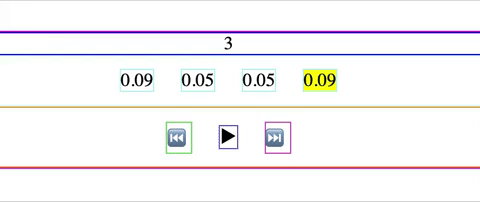
   
**Link to Work:** [Pomodoro, working](https://github.com/dangerousdashie/pomodoro/tree/2b278b504f8074004bdc53cc1641705c71ae7310)

## Day 55
### 2/24/19

- **Pomodoro:**
   
   I merged my branch into master following [this video](https://www.youtube.com/watch?v=lsLjxSkGSDE). Don't forget to push to the remote! I deleted the old branch following [this](https://koukia.ca/delete-a-local-and-a-remote-git-branch-61df0b10d323).
   
   The pomodoro is pretty far along. I have the timer working. I still need pause/play/skip/back controls, an edit button, and to edit the css and design. I need to convert the numbers that represent seconds and minutes into a more readable format. 

   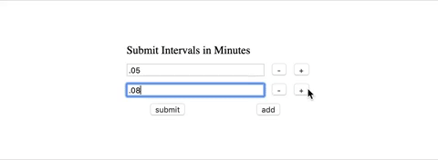

**Link to Work:** [Pomodoro, working](https://github.com/dangerousdashie/pomodoro/tree/6c2a35569b8f611649a9e77c9d0523976e03d6ad)
## Day 54
### 2/23/19

- **Pomodoro:**
   
   I tried adding an `.invisible` css class with `display:none` to some divs using `classList.add()`. It didn't work for one div that had an ID assigned to it that had `display:grid`. ID overides class. I finally realized the way to override it was to put `#<idname>.<classname>` (ex, `#inputs.invisible`) in the css. I found this out by playing around in Devtools in elements tab > styles tab. `#<idname>.<classname>` works because you're adding specificity. With this you can use `classList.add()` to add a class to a div that overides properties of the div's ID.
   
   I realized I didn't like the UX I came up with. I wanted to get rid of my `displayIntervals()` function. I created a new branch so I could experiment with getting rid of `displayIntervals()`. To do this I had to review git. This [page](https://github.com/Kunena/Kunena-Forum/wiki/Create-a-new-branch-with-git-and-manage-branches) suggested doing a git pull before making a new branch. So I reviewed what git pull does [here](https://www.git-tower.com/learn/git/faq/difference-between-git-fetch-git-pull), and continued with the rest of the [steps](https://github.com/Kunena/Kunena-Forum/wiki/Create-a-new-branch-with-git-and-manage-branches) until it said to create a new remote. On freecodecamp a slightly different approach was suggested. [Here on freecodecamp](https://www.freecodecamp.org/forum/t/push-a-new-local-branch-to-a-remote-git-repository-and-track-it-too/13222) the poster didn't include instructions on making a new remote for the new branch. I believe you can skip that step when you include the option `-u`; according to a poster on stackoverflow, when using `-u` ["tracking information has been set up so that git pull works as expected without specifying the remote or branch."](https://stackoverflow.com/questions/5697750/what-exactly-does-the-u-do-git-push-u-origin-master-vs-git-push-origin-ma) 
   
   I left off on my new branch, having created some display divs for the pomodoro timer. I will probably merge this branch tomorrow but I need to review merging.
   
**Thoughts and Feelings:** Working on a project from scratch is helping me learn about periferal technologies- git, github, css. Even though it's taking me a long time to finish this pomodoro project, I'm not phased. That's because I know I'm getting used to all the daily technologies I will use as a developer, not just the technology I set out to study, in this case javascript. It can seem disappointing when your first few projects take a while, but you are integrating all sorts of technologies into your brain. Therefore, all these "distractions" - having to figure out git, having to figure out a css issue, having to figure out the nuances of browsers, understanding your debugger, understanding your editor- these are all amazing learning opportunities. These are more important than the project itself. When your project is done you will have these technologies living in your brain to take with you to the next project. Be grateful for every bug, error, distraction. These are the challenges that make a difference. They build your skills.
   
   **Link to Work:** [Pomodoro no_display_intervals branch working](https://github.com/dangerousdashie/pomodoro/tree/76e000f75aca092c60b3a5d85975d1eb2aee4d12)

## Day 53
### R1D53 2/22/19
- **Pomodoro:**
   I worked on the css grid layout and the submit function. 
   
   I tried using `grid-gap:10px` with `grid-template-columns: repeat(8, 12.5%)`, but this adds 10px for each gap onto the 100% (8x12.5%) of the parent width. This ends up making the grid larger that the parent div. I switched to fr instead of percent `grid-template-columns: repeat(8, 1fr)` and this worked. 
   > Because grid-gap abstracts away the calculations it takes to add up to 100% of the size of the grid parent, it doesn’t play nicely if you take up that space with % units...It’s best not to use percentages in grid layouts. Instead, Grid introduces a new length unit, fr: a fractional unit. 1fr will occupy any available space in the row or column—it operates like % but in a way compatible with grid-gap without requiring any calc() fussiness. 
   
   [Rawk Blog, CSS Grid: Understanding grid-gap and fr vs. auto units](https://www.rawkblog.com/2018/03/css-grid-understanding-grid-gap-and-fr-vs-auto-units/)
   
   I left off on a function that displays the selected intervals. I'm having trouble overiding the display property for the `#inputs` div. The css for the `#inputs` id has `display:grid;`. I'm trying to temporarily set the display to `display:none;`. I have to review the order that the css is overwritten.
   
   **Thoughts and Feelings:** Today I took a stretch break every 15 minutes, a somewhat longer stand up and stretch break every 3 breaks, and made myself switch sitting positions every break. My back feels pretty good.
   
   **Link to Work:** [Pomodoro, working](https://github.com/dangerousdashie/pomodoro/tree/4c44dc156e325f57415c28f48460f45413fec796)
## Day 52
### R1D52 2/21/19
- **Pomodoro:**
   I refactored some code so that my function `createInput()` can be reused more often. I worked on the add button functions. I created the remove button function. I started the submit function. I left off trying to figure out how to ignore empty input fields when saving the input values.

   I spent a while trying to figure out scope and the debugger. Declaring block scope in console acts unexpectedly. If not paused in debugger, you can declare let and const variables and access them in the console.   


   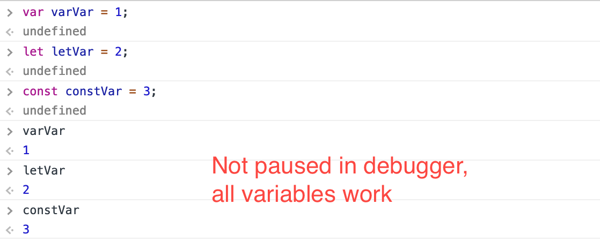
   
   But when paused in the debugger inside a script or in script tags you get an Uncaught Reference Error, the debugger thinks the variable is undefined. 
     
     
  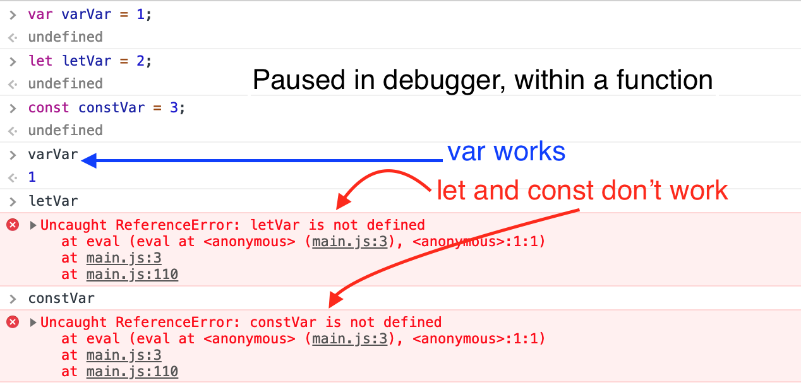
   
  In my example I'm within a function, but to be clear, I got the same results when I pause outside of a function. Is this because the debugger creates its own block scopes at each line in the console? But if that's the case why would it work if not paused?
  
**Thoughts and Feelings:** Moving around every fifteen minutes is helping my back. I coded inside the rv for the full 2 hours to avoid eye strain.

**Link to Work:** [Pomodoro, working](https://github.com/dangerousdashie/pomodoro/tree/24069bad270b202418a47f77e97c026fdf154f56)

## Day 51
### R1D51 2/20/19
- **Pomodoro:**
   I worked on the buttons that add and remove input fields, so the user can customize their pomodoro intervals. I used bind() to bind this and now understand bind() better. But I ended up not needing it and removed it.
   
   I found out that even though functions should have access to sibling functions, you can't access a sibling function in the debugger unless it's somewhere in the inner function. The sibling function doesn't have to be called inside the function, you can just write the identifier of the function:
   ```javascript
   function brother(){
      console.log("I'm a sibling to sister()");
      debugger; //you CANNOT call sister() in the debugger, it will be undefined
   }
   function sister(){
      brother; //brother is referenced
      console.log("I can see my sibling, brother()");
      debugger; //you CAN call brother() in the debugger
   }
   ```
   I refactored some of my code. I made a makeElem() function that takes an element type (div, button, input, etc...), a class name, and optional inner html text and creates that element. In this project, most of my elements are dynamic, meaning they're created by the JavaScript code, so makeElem() will be useful. I added more elements like "add" and "remove" buttons, worked on the css and grid layout, and worked on event listeners for the 'add' and 'remove' buttons.
   
   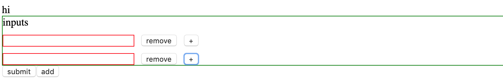
   
   I ended today trying to add a document fragment but I didn't know the right syntax, so that's where I will start tomorrow.
   
**Thoughts and Feelings:** I took mandatory stretch breaks every 15 minutes which was really helpful. If I was sitting in a way that could cause kinks in my body, I had to change positions after each break. My screen strains my eyes outside even in the shade when the sun gets bright enough, so I have to move inside at around 10am. It would be great to get glasses that can fix this problem. 

I like working on a project from scratch. I'm implementing a lot of the concepts I learned in my tutorials. Putting these concepts to use helps me grasp them better.

**Link to Work:** [Pomodoro working](https://github.com/dangerousdashie/pomodoro/tree/24069bad270b202418a47f77e97c026fdf154f56)


## Day 50
### R1D50 2/19/20
I decided code for 2 hours, today, and forgo my code study hour. I took a break from [JavaScript30](https://javascript30.com) and decided to make a pomodoro timer app. 


- **Pomodoro:**
   I started by writing down on paper what I would need for my pomodoro timer app. I thought about the UI and I listed out different things I'd need.
   
   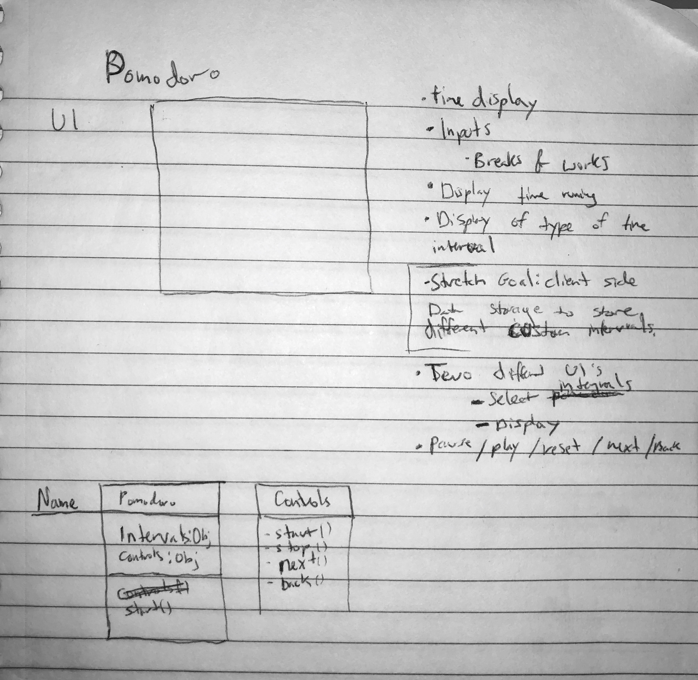
   
   Then I transfered my sketch to psuedo code.
   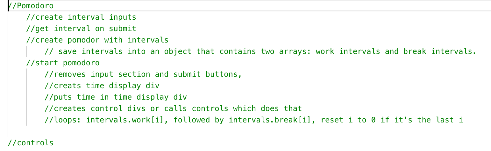
  
   Then I started **coding**.
   
   I learned that you cannot use arrow functions as constructors:
   
   **Works** as a Constructor, *regular function*:
    ```javascript
    var Pomodoro = function(el){
        this.el = document.getElementById(el);
    };
    ```
    
   **Doesn't Work** as a Constructor, *arrow function*:

     ```javascript
    var Pomodoro = (el)=>{
        this.el = document.getElementById(el);
    };
    ```
    
   I still have a lot to do.
   
**Thoughts and Feelings:** I got up at 6:55am today so I could get everything done before it got too hot. Yesterday, I was coding and sweating and I couldn't concentrate. Now, it's 11:47am and I've already finished exercising, two hours of coding, and I'm almost done with this log. I could have finished earlier if I had enough battery power, but I had to charge my battery a few times. By getting up early, I avoided coding during the hottest hours of the day.

I enjoyed working on my own app in place of my hour of studying and my hour of hands-on coding with [JavaScript30](https://javascript30.com). I think it was helpful to do a project from scratch again. I'll continue this project for a few days, and maybe throw in some studying and Javascript30.

**Link to Work:** [Pomodoro working file](https://github.com/dangerousdashie/pomodoro/tree/d4b732e462cc6429ce2f52295ee3a67c44fa5f5f)

## Day 49
### R1D49 2/18/19
- **Study:**
  
   Finished Vanilla JavaScript Propagation and Binding tutorial. 

- **Coding:**
 
   Finished Key Sequence etection and Slide in on Scroll from [JavaScript30](https://javascript30.com).
 
 **Thoughts and Feelings:** Today was difficult. It's so hot. I am sweating. I was coding outside but realized the lighting outside is too bright for my screen which caused eye strain. So I did the rest of my coding inside. But it's even hotter inside the RV. It's 89 outside, so probably 95 inside. Idk. Be grateful for AC when you have it. We can run AC if we run the generator. Maybe next time it's this hot we'll just do that. 
 
 I didn't drink my decaf coffee today. I decided to quit. Even decaf could have enough caffeine to raise corticol levels. I feel like it was increasing my muscle tension. I was getting tension in my back, neck, and face muscles while coding. If I want to be a successful coder, my body needs to work well. 
 
The Vanilla JavaScript Propagation and Binding tutorial wasn't taught very well. It was confusing becuase the instructor didn't really show us was we were going to make. She just did a lot of coding without compartmentalizing or demonstrating what sections of the code were for. So I decided to speed through it and then go back and try to make what the instructor made. I havn't gone back to make it yet. I think that will really help me with code organization becasue the instructor was very organized with her code.
   
**Link to Work:** [Key Sequence Detection](https://github.com/dangerousdashie/JavaScript30/blob/ae9bff27afcf15004dc76de554a49dc0cff7b933/12%20-%20Key%20Sequence%20Detection/index-START.html), [Slide in on Scroll](https://github.com/dangerousdashie/JavaScript30/blob/ae9bff27afcf15004dc76de554a49dc0cff7b933/13%20-%20Slide%20in%20on%20Scroll/index-dashie.html)

## Day 48
### R1D48 2/17/19

 - **Study:**
  
   Continued Vanilla JavaScript Propagation and Binding tutorial.

   
 - **Coding:**
    
    Finished the extra challenge in 'Custom HTML5 Video Player' from [JavaScript30](https://javascript30.com).
    
    Started 'Key Sequence Detection' from [JavaScript30](https://javascript30.com). I got stuck on using the splice array. I'm trying to understand it better.
    
    **Thoughts and Feelings:** I think I need to give up coffee. I only drink decaf but I think it's still too much caffiene. I think it's raising my cortisol levels and causing my back and headaches while coding.

**Link to Work:** [Custom HTML5 Video Player](https://github.com/dangerousdashie/JavaScript30/blob/c117c40e22789e047edc605b5dea6543e02c1ce9/11%20-%20Custom%20Video%20Player/script-dashie.js), [Key Sequence Detection unfinished](https://github.com/dangerousdashie/JavaScript30/blob/c117c40e22789e047edc605b5dea6543e02c1ce9/12%20-%20Key%20Sequence%20Detection/index-START.html)
## Day 47
### R1D47 2/16/19

 - **Study:**
  
   Finished JavaScript Classes tutorial. Started Vanilla JavaScript Propagation and Binding tutorial.
   
 - **Coding:**
    
    I started the 'Custom HTML5 Video Player' challenge from [JavaScript30](https://javascript30.com). I left off where Wes said to try to add a full screen button on your own. I did pretty well on this project.
    
**Thoughts and Feelings:** I started implementing mandatory 20:20:20 breaks. That means every 20 minutes I look at something 20 feet away for 20 seconds. It's supposed to prevent eye strain. I also do somme stretching to help with my back. I think it's helping.

**Link to Work:** [Custom HTML5 Video Player, nearly finished](https://github.com/dangerousdashie/JavaScript30/tree/1c6d42912a99418d24c9f3c17b573f49b7c9b746/11%20-%20Custom%20Video%20Player)

## Day 46
### R1D46 2/15/19
 - **Study:**
  
   Finished JavaScript Events tutorial! I really enjoyed this tutorial. I want to recreate the last project, which was a drag and drop game for a building a snowman. I want to make the same game but for dressing up someone I know. 
   
   Started JavaScript classes tutorial.
   
 - **Coding:**
 
    Went over Wes's solution for the 'Hold Shift' project. I did it wrong because I thought you were supposed to make it work when you press and hold shift while pressing BOTH checkboxes, but you were supposed to make it work only when pressing shift while holding the last button. I redid it while watching the video.
    
    I started the 'Custom HTML5 Video Player' challenge. I still need to finish it.

**Link to Work:** [Hold Shift Follow Along](https://github.com/dangerousdashie/JavaScript30/blob/064d917d79b0af7455a48cf066584fc11f7e0326/10%20-%20Hold%20Shift%20and%20Check%20Checkboxes/index-follow-along.html), [Custom HTML5 Video Player Unfinished](https://github.com/dangerousdashie/JavaScript30/blob/064d917d79b0af7455a48cf066584fc11f7e0326/10%20-%20Hold%20Shift%20and%20Check%20Checkboxes/index-follow-along.html)

## Day 45
### R1D45 2/14/19

 - **Study:** Continued Javascript Events tutorial. Almost done! I got to the last video and was trying to finish but I realized my back was sore and I had to take a break. So I decided to be done with my tutorial for the day. This tutorial has been really fun because events are so action-based and interactive. 

   I spent a while trying to figure out how to traverse through the highlighted words when I generate a snippet in emmet. But I couldn't find out anything.  
   
   For example, if I start typing here, it will automatically start writing over the first selection, `device width`. But what if I want to skip over to the last highlighted word, `Document` so I can add a title? Is there a way to skip to here on the keyboard?  
 
   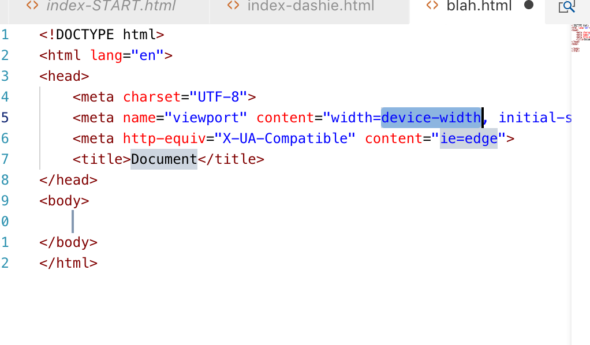
 
 
 
 - **Coding:** I started and completed the [JavaScript30](https://javascript30.com) 'Hold Shift' challenge. I still have to watch how Wes solved it. 

**Link to Work:** [Hold Shift](https://github.com/dangerousdashie/JavaScript30/blob/725e933614749eecc91a062a1a98bdfa1dff8659/10%20-%20Hold%20Shift%20and%20Check%20Checkboxes/index-dashie.html)
## Day 44
### R1D44 2/13/19
1. Continued Javascript Events tutorial on lynda.

2. The [JavaScript30](https://javascript30.com) video today was short and it wasn't a challenge so much as a tutorial. So I had time to do some of the [CSS Grid](https://cssgrid.io/) tutorials. But those also weren't challenges. So I started the [100dayscss](https://100dayscss.com/) challenge for today. It was so interactive, I couldn't figure out how to do it purely in css. So I looked at how some others solved it. Most people used javascript. Not cool guys! But I found someone who did it with just css, I only looked at it a little bit but it looked like they styled an input checkbox that changed when you toggle it. It was really hacky. Of course, I could have misunderstood what they did. I'm not sure what the answer is. 


**Thoughts and Feelings:** Today I offered to help anyone on twitter with coding. No one took me up on it but it felt good to offer. I'm trying to implement more 'giving' behaviors because I'm reading the book *Give or Take*. It says that when we try to help the community's progress as a whole, we all thrive.

## Day 43
### R1D43 2/12/19
1. Continued the JavaScript Events tutorial on Lynda.com. I'm finding all the things you can do with events interesting and fun. I found this [cheat sheet](https://code.visualstudio.com/shortcuts/keyboard-shortcuts-macos.pdf) for awesome Visual Studio Code short cuts for mac. 

2. Completed the **HTML5 Canvas API** challenge from [JavaScript30](https://javascript30.com). This project was cool. It makes me want to play with the Canvas API more.


3. Started Wes Bos's [CSS Grid](https://cssgrid.io/) tutorials.

**Thoughts and Feelings:** Great day. I'm excited to get more practice with grid.

**Link to Work:** [HTML5 Canvas API](https://github.com/dangerousdashie/JavaScript30/blob/5bb2ce7583922cca91e9d949f1fc2577f3f473e6/08%20-%20Fun%20with%20HTML5%20Canvas/index-START.html)

## Day 42
### R1D42 2/11/19
1. I continued the JavaScript Events tutorial on Lynda.com.

2. I started and completed the **Array Cardio Day 2** challenge from [JavaScript30](https://javascript30.com). 

3. I started a project that tracks my exercise and coding streaks called **Dashie Tracker**. 


**Thoughts and Feelings:** I really felt like I could have coded for longer. I have a few projects I want to try. But it's cloudy so our power is limited today, since we run on solar.

**Link to Work:** [Array Cardio Day 2](https://github.com/dangerousdashie/JavaScript30/blob/d715047a0af3774b87090a1d3fbbb1fce307ef4b/07%20-%20Array%20Cardio%20Day%202/index-dashie.html), [Dashie Tracker](https://github.com/dangerousdashie/dashie-tracker/tree/06d956b98ab870d6f536900a482fc438d19e2ff0)
## Day 41
### R1D41 2/10/19
Continued the JavaScript Events tutorial on Lynda. I learned some tricks for selecting in Visual Studio Code:

- **Cursor on Multiple Lines:** Put the cursor somewhere, then `opt`+`cmd`+`down or up arrow` 

- **Once Your Cursor is on Multiple Lines, Select to the End:** `shift`+`right arrow` 

- **Move a Line of Code up/down:** `opt`+`down or up arrow`

- **Copy a Line of Code up/down:** `opt`+`shift`+`down or up arrow`

- **Start an Anchor Tag:** `a` then `tab`

You can even use these short cuts to copy from multiply lines and then paste into multiple lines.


Watched Wes's solution and redid [JavaScript30](https://javascript30.com) Type Ahead challenge. I was struggling for a while because I had written a return statement like this:
        
        return 
        `<li>
        <span class="name">${cityName}, ${stateName}</span>
        <span class="population">${numberWithCommas(place.population)}</span>
        </li>`;
        
But since javascript sometimes puts in semicolons by itself, that actually works like this: 
        
        return; 
        `<li>
        <span class="name">${cityName}, ${stateName}</span>
        <span class="population">${numberWithCommas(place.population)}</span>
        </li>`;
        
So you need to start the string literal on the return line:

        return ` 
        <li>
        <span class="name">${cityName}, ${stateName}</span>
        <span class="population">${numberWithCommas(place.population)}</span>
        </li>`;
        
I also played around with my formatting on this log on this entry. I really like how [James Priest](https://github.com/james-priest/100-days-of-code-log-r4) does his. He also has it on [his own website](https://james-priest.github.io/100-days-of-code-log-r4/), with some styles applied. I'm not sure how he has his log connected to this site. I just looked and he talks about how he did it on [day 11 and 10](https://james-priest.github.io/100-days-of-code-log/#11-windows-10-ubuntu-1604-jekyll--github-pages) of his first round.

**Thoughts and Feelings:** I felt like coding for longer, but I ran out of power. I could charge up but I think I will save power. Maybe I will do more later.

**Link to Work:** [Followed Wes, Type Ahead](https://github.com/dangerousdashie/JavaScript30/blob/3075334ff435ed9de90e5947e6e59205bfe37e8d/06%20-%20Type%20Ahead/index-follow-along.html)
### R1D40 2/9/18
Finished JavaScript Patterns tutorial on lynda. Started JavaScript Events tutorial on Lynda.

Finished [JavaScript30](https://javascript30.com) Type Ahead challenge. I still have to finish watching how Wes did it.

**Thoughts and Feelings:** Took a lot of breaks and felt pretty good today.

**Link to Work:** [Type Ahead](https://github.com/dangerousdashie/JavaScript30/blob/ef173ff62cd4fb1ad8f3ec86dd2c97f318e5a5c2/06%20-%20Type%20Ahead/index-dashie.html)
### R1D39 2/8/19
Continued lynda.com javascript patterns tutorial. 

Finished [JavaScript30](https://javascript30.com) Flex Panel Gallery. I got stuck because I forgot you can use `this` and was only using the the `event.target` in the event handler. Which wasn't good because that sometimes gave me an element nested in `this`.


**Link to Work:** [Flex Panel Gallery](https://github.com/dangerousdashie/JavaScript30/blob/d556e026cf3349baf171323da85f5a7ad8aa5e51/05%20-%20Flex%20Panel%20Gallery/index-dashie.html)
### R1D38 2/7/19
Continued lynda.com javascript patterns tutorial.
Finished [JavaScript30](https://javascript30.com) array cardio day 1.

**Thoughts and Feelings:** I want to practice array methods more. I think reduce() is interesting. I'm kind of tired today. I didn't go on social media all day which is nice but I still ended the day late probably because I spoke to other campers, woke up and read for an hour, and did laundry. Tomorrow I need to finish early so I have time to work on the RV heat sink before our friend's yoga photoshoot at 4 that we volunteered to help with.

**Link to Work:** [Array Cardio Day 1](https://github.com/dangerousdashie/JavaScript30/blob/fcebbdf8cf2244a8de0bba72dfc404f19bfd11c8/04%20-%20Array%20Cardio%20Day%201/index-dashie.html)
### R1D37 2/6/19
Continued lynda.com javascript patterns tutorial. 

Started [JavaScript30](https://javascript30.com) array cardio day.

**Thoughts and Feelings:** Shlomo was talking on speaker phone and I was paying attention to that while coding. So I was probably distracted. But it was an easier assignment today. I probably could have finished it if I wasn't listening to Shlo. But it's ok, I wanted to take it easier today because I have a tense forhead muscle and back muscles. It might be from dehydration. So today I drank a lot. After my tutorial I did Muse meditdation before coding.

**Link to Work:** [Array Cardio Day 1, unfinished](https://github.com/dangerousdashie/JavaScript30/blob/2def97f1c845944c08e9705839bbf35c24639df4/03%20-%20CSS%20Variables/index-dashie.html)

### R1D36 2/5/19
I finished the lynda tutorial for JavaScript Functions. I started JavaScript Patterns.

I started and finished the [JavaScript30](https://javascript30.com) CSS Variables project. I got stuck for a while because I was using the addEventListener() function but I was passing in console.log("test") where the callback function should be. I thought it would work the same but it doesn't. Probably because console.log() is being invoked where as the callback function in the addEventListener() function shouldn't be written as invoked: callback() *(invoked)* vs callback *(not invoked)*. Tomorrow I'll watch the rest of the tutorial to see how Wes did it. I saw some of how he did it as I was figuring it out.

**Thoughts and Feelings:** I'm excited to learn about JavaScript patterns. I feel good that I started and finished a [JavaScript30](https://javascript30.com) challenge.

**Link to Work:** [CSS Variables](https://github.com/dangerousdashie/JavaScript30/blob/2f487aab001be65d34a2197f5542541dce448796/03%20-%20CSS%20Variables/index-dashie.html)
### R1D35 - 2/4/19
Started watching UC Berkeley's lectures for [CS 61A](https://www.youtube.com/watch?v=Tkciq5IQVp0). I continued Javascript Functions on lynda but I'm noticing how out of date some concepts are because it's from 2013 before ES6.

I finished the clock from [JavaScript30](https://javascript30.com). It took a while because I was having trouble removing the hand transition for the point where the hand goes backwards. Eventually, I got it to work but I'm not really sure why it was working before.

**Thoughts and Feelins:** I can't believe there are so many video lectures of college courses. Why are so many people paying for these classes when they're free? I started reading this text book last night called [Computer Organization and Design](https://github.com/hamadkh/MIPS-iVerilog/blob/master/Morgan.Kaufmann.Computer.Organization.And.Design.5th.Edition.Oct.2013.ISBN.0124077269.pdf). It started off ok, sort of easy to understand. But then I was doing the exercises for each section and they were so bad. The questions talked about things that the corresponding section didn't talk about. It used really specific terms that the book didn't cover yet. As I write this I'm wondering if you had to read the rest of the chapter to understand the questions and not just the section that the exercises referenced. Afterall, the questions were at the end of the chapter. I was reading them before I finished the chapter. maybe I should give it a second try? Otherwise, these text books are just so dry and poorly written I don't know if it's worth my time. Especially when there are so many quality videos, lectures, and blogs to explain these concepts. 

**Link To Work:**[Finished Clock](https://github.com/dangerousdashie/JavaScript30/blob/fd0ea5b4279f7c207ed50aa0bbcb5bff98b17ed6/02%20-%20JS%20and%20CSS%20Clock/index-dashie.html)

### R1D34 - 2/3/19
I continued the Javascript Functions tutorial on lynda.com.

I posted my issue from yesterday on stackoverflow [here](https://stackoverflow.com/questions/54506846/chrome-devtools-htmldivelement-style-property-set-before-function-called?noredirect=1#comment95817550_54506846).

Apperently this is happening because 
>"Devtools console contains a **pointer** to the actual element in all three messages which is why it displays identically."

Now, what this means exactly? I'm not sure. I can guess roughly what that means. The same person suggested,

>"You might want to log out just the property itself." 

Logging `div.style.border` worked as expected. I'd like to understand what a **pointer** is.

**Thoughts and Feelings:** I meditated for 15 minutes inbetween my tutorial and my coding. I used my Muse headband. I think that was really helpful. I was able to code for a while *(though I spent my coding time mostly posting on stackoverflow, debbuggin, and trying to understand what was going on with my issue.)* I reorganized this github log so that the last day is at the top. Much better!

Whenever I get answers on stackoverflow I feel like the answers were written in a snarky tone. Maybe it's all in my head. But if they really are being snarky, then I should recognize this: ***the newbies who push through the snark and ask questions anyways are the ones who succeed*** So that's what I'm going to do. *Be grateful for every answer even if the person is being snarky.* Ignore the snark. Take the answer.

---

### R1D33 - 2/2/19
It took me a while to figure out the bug in my lynda tutorial challenge for Javascript functions. The reason it said innerHTML is not a function is because it isn't. It's a property! Duh! I was trying to use it like a function. 

  What I was doing:

  `elems[0].innerHTML("hello world");`

  But it should have been:

  `elems[0].innerHTML = "hello world";`

I have gotten so used to jQuery which has an `html()` function. So I was trying to use the `.innerHTML` property like a function.

I also learned that if you declare a variable and then use += on it before intializing the variable, "undefined" is included in the beginning. You have to set the variable to an emtpy string first. More on that [here](https://stackoverflow.com/questions/29198651/first-element-in-object-is-undefined-using-operator).

---

I worked on the clock project from [JavaScript30](https://javascript30.com) and ran into some weird behavior. I isolated what's confusing me into a separate file [here](https://github.com/dangerousdashie/JavaScript30/blob/21c938820efa70c13773f0b2676a61e93d971a19/02%20-%20JS%20and%20CSS%20Clock/test_node_behavior.html). 

It's a script that, when `addBorder()` is called, adds a border to the div. But when I `console.log()` the div *before* `addBorder()` is called, you can see that for some reason, the style that is added in `addBorder()` is already applied.

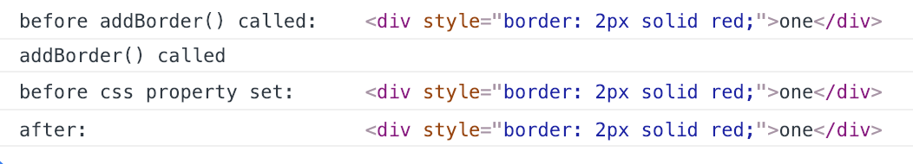

All three times that I `console.log()` the div, it has the border applied. Whether the log was called before `addBorder()`, after `addBorder()` was called but before the border property is set, or after the property is set. This is not what I expect. I would it expect it to look like [this](https://github.com/dangerousdashie/JavaScript30/blob/21c938820efa70c13773f0b2676a61e93d971a19/02%20-%20JS%20and%20CSS%20Clock/test_num_behavior.html) script runs, which is pretty much the same script except the element in question is no longer a div, but a number and the number is being multiplied by 10. In the log you can see the number remains 3 until after it is multiplied by 10 inside the `multiplyBy10()` function.

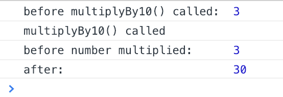

And oddly enough, the script with the div will log a different result if I keep everything the same but I step through the whole script in the debugger slowly. In that case it still doesn't give the expected result, because it shows no border property in the last log.

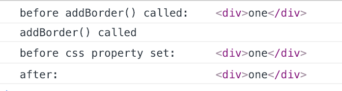

What is going on? Is this a scope issue that only effects certain data types?

**Thoughts and Feelings:** Since I spent so much time confusing a property with a function, it's probably really ingrained in my brain now to check that mistake in the future. This is a pattern I noticed. I'm able to pick up on bugs so much quicker than I used to. Every bug that tooks me 45 minutes to find trains my brain to look for that bug quickly later on. So then next time I spend an hour on a tiny bug, I'll be grateful. My mind will have **"downloaded"** the ability to quickly scan for that bug in the future. An hour one day saves me many hours in the future. It's truly a gift you can't buy. Treasure those bugs!

This is what Shawn Achor means in *The Happiness Advantage* when he talks about *"falling up."* Adversity isn't just something you overcome, it's something that measurably makes you better than before. Feed your brain with challlenges, adversity, & failure! You need these to succeed.

### R1D32 - 2/1/19
I did more of the functions tutorial on lynda. I started the challenge for the 2nd chapter but got stuck because it's saying innerHTML is not a function for the element I'm targeting. 

I continued the clock project from [JavaScript30](https://javascript30.com). It's almost done but the second hand goes backwards when it jumps from 59 to 0. 

I plan to read more of [*Structure and Interpretation of Computer Programs*](https://github.com/sarabander/sicp) later today.

**Thoughts and Feelings:** Took a break for a snack after 1hr and 20 ish minutes or my tutorial and coding and I felt good. I also took a pee break 34 minutes into my tutorial. But I really have to pee now and I'm holding it so I can finished posting before my computer dies.

**Link To Work:** [Continued Clock](https://github.com/dangerousdashie/JavaScript30/blob/c192da7e4ca4874b7ee226c453d34bef11828e25/02%20-%20JS%20and%20CSS%20Clock/index-dashie.html)

### R1D31 - 1/31/19
I watched Wes Bos's solution to the Drum Kit challenge. It was really different than mine. Things I learned:
1. There is a `keycode` associated with every key event. ex. the event `.keycode` property for **a** is **65**.
2. There is an event listener called transitionend that runs when a css transition has ended.
3. Calling `.play()` on an audio element that is currently playing won't do anything. To override this, you can set the audio element's `currentTime` property to 0 and then call `.play()` to play it from the beginning.

I started the clock project from [JavaScript30](https://javascript30.com). It's getting easier to see how to organize my code. It's becoming more natural to me to see where my code is headed and how I'll need to organize it. I think all these JavaScript lynda courses might be helping with that.

I studied JavaScript functions on Lynda.com. I also started reading a textbook called [*Structure and Interpretation of Computer Programs*](https://web.mit.edu/alexmv/6.037/sicp.pdf). The book was on [this list](https://teachyourselfcs.com/) on [teachyourselfcs.com](https://teachyourselfcs.com/) of concepts to master to understand computer science. Every book on that list is available for free. I got them all on pdf now. I want to try to find an e-book version of them all because that will make note taking easier. 

**Update:** I found *Structure and Interpretation of Computer Programs* in an ebook format [here](https://github.com/sarabander/sicp). To find it, scroll down to the README.md section and click the link where it says
**"In EPUB3 format."**

**Thoughts and Feelings:** I took a break after 1 hour and 45 minutes of tutorial (1h) and coding (45m). I sat in the sun and then came inside and had a cucumber with almond butter and peach seltzer. When I came back to coding I felt so much more refreshed and worked even longer. My mind was so clear. I think I should implement more breaks and snacks. I don't know if it was the snack itself that boosted my energy or just the fact that snacks make me happy. Maybe anything that makes me relaxed and happy would be good during a break. 

**Link To Work:** [Started Clock](https://github.com/dangerousdashie/JavaScript30/blob/48f36c908811f361201f9aa36d16d84360357914/02%20-%20JS%20and%20CSS%20Clock/index-dashie.html)

### R1D30 - 1/30/19
I finished my closures tutorial. At the end it said "if you want to learn more about vanilla javascript" and I was like "what are they talking about? I didn't learn anything about vanilla javascript, how could I learn MORE? And I have no clue what it is." I had seen Vanilla JS mentioned and figured it was just another framework. I finally looked into it. It just means coding javascript without any libraries. Great to know, because that is exactly what I want to learn so I really understand the basics of javascript. Now I can stop ignoring all the Vanilla JS tutorials on lynda.com. I organized my notes and reviewed git.

I found a set of [tutorials/projects](https://javascript30.com/) in vanilla javascript by Wes Bos. I worked on the first project today and finished it. I didn't yet look at Wes's solution, but mine works.

**Thoughts and Feelings:** I feel so much more optimistic today. I'm reading The Happiness Advantage and it shows how important it is to be happy and optimistic. It's essential to reducing burnout and improving productivity. The last few days I felt a burnt out. I was met with challenges that I didn't solve and felt bad about my skill set. But I feel optimistic again that I'm on the right path and will keep learning and growing. Partly because I took on a challenge today that I succeeded in, but also because I worked on my mindset a bit. Next time I feel overwhelmed in my studies I can take a step back and try to work on a challenge that is closer to my skillset or study the basics. I will eventually get back to the harder stuff. A challenge that I can't solve is just an indication that I need to learn more. It's a gift.

**Link To Work:** [Drum kit](https://github.com/dangerousdashie/JavaScript30/blob/master/01%20-%20JavaScript%20Drum%20Kit/index-dashie.html)

### R1D29 - 1/29/19
I worked more on trying to figure out the API ordeal for meetup. I posted on stackoverflow and got some answers that I don't understand but will look into it late. I think I might take a break from this project. My friend Benjy said you can't use the meetup API without the OAuth and to do that you need a website with an SSL so I can't really use it. But the other answers suggested I might be able to use the API with just the key, so I'll see. I feel like I havn't dont a lot of coding, just investigating this issue. So maybe I'll try to do something easier for now so I can actually code.

For my tutorial I did closures on lynda.com. I find this concept a little confusing still.

**Thoughts and Feelings:** I coded in the public bathroom today to fill up on battery power so my legs are soo numb right now.

### R1D28 - 1/28/19
I did more of my closures tutorial. 

I worked more on my meetup API project. Apparently 3rd party apps can't use API keys. They have to use OAuth. I've never done this and I'm not even sure what it means or whether I'm a 3rd party app but I must be because CORS is not allowing me to use my API key with my app. This is the info for [meetup OAuth registration.](https://secure.meetup.com/meetup_api/oauth_consumers/create/) I'll have to look more into this tomorrow. Right now, I must pee!

**Thoughts and Feelings:** Yesterday, I was feeling like I hit a wall, a bit frustrated. I didn't know how to search for an exact phrase using meetups API. I felt really lost because I didn't know if it was possible and if it was possible I didn't know whether it was a meetup specific thing or if the answer was applicable to all api's. I didn't know where to turn. I havn't had much luck on stackoverflow. But then I realized I didn't need to do an exact search. Of course, I can just extract out the data I need in my code! Duh! I think there is no way to do it through meetups api. I need to not feel so frustrated. I need to remember that hitting a wall is just making a discovery. Sometimes you discover that things can't be done as you expected. Or you discover you don't know how to do something. This is the wall. But the answer is just around the corner on the other side of the wall.

### R1D27 - 1/27/19
I continued my tutorial on closures. I started working with meetups API but I'm kind of lost. I want to search for groups or events that mention "lucid dream"- exactly, but I can't figure out how to do that. When I add the text parameter, text=lucid+dream, it shows me results that use the word lucid by itself or dream by itself.

**Thoughts and Feelings:** It's raining and gross and I'm feeling weird. How can I find out how to use this API?

### R1D26 - 1/26/19
I finished the javavascript scope tutorial and started a javascript closures tutorial on lynda.com.

In my clock project, I have a working clock, though it's not designed cute and the code should be cleaned up. I used [this](https://www.w3schools.com/graphics/canvas_clock.asp) tutorial as reference when I ran into trouble. 

Now I'm trying to make the clock face change colors depending on the UV levels outside using the [open weather API](https://openweathermap.org/appid). I'm stopping for right now because I need to charge my laptop. I might come back to it later today. I think I might also try doing the clock in svg instead of canvas. Canvas uses bitmap so the lines aren't as smooth as the vector would be with svg. Here's the [clock](https://github.com/dangerousdashie/javascript-clock/tree/5ab15956c847289712477081e51489dd8390b669) so far.

I worked more on the clock and now it sets the background of the clock to a color value on a blue to grey scale depending on the UV value grabbed from the open weather API for Punta Gorda, Florida. That's where I am at the moment. Next I will try to get it to work for any location. 

**Link To Work:**[clock latest commit, UV API](https://github.com/dangerousdashie/javascript-clock/tree/de5c6c32ce617f927b90a83d61054fc670e221a0)

### R1D25 - 1/25/19
I started a tutorial on javascript scope. I think I know most of it so far. I don't know what block scope is and that's next. 

I got further along in my javascript clock project. Right now it displays the right time on a canvas circle with two lines for the minute and hour hands. However it doesn't update with the time, you have to refresh it. So next I need to figure our how to update it. I should also add a second hand. My code is probably too redundant. 

**Link To Work:** [clock](https://github.com/dangerousdashie/javascript-clock/tree/135fa05ff5aa68a306bc7baa0b92d1acd4dfb688)

### R1D24 - 1/24/19
I fixed my git issue that I had on day 22. I organized my Readme file for my quiz project. I explored github. I want to beable to use it better and understand it more. I'd like to be more connected with the online programming community. I finished my JavaScript prototypes tutorial on lynda and practiced using the class keywork on [code pen](https://codepen.io/Dashiee/pen/KJdZGa?editors=0011). 

I started working on a JavaScript clock.

**Link To Work:** [Quiz Template latest commit](https://github.com/dangerousdashie/jQuery-quiz-template/tree/7f974bf75d16f92de02048bad89e25e57f89a604)

### R1D23 - 1/23/18, completed 1/23/18
I worked mostly on debugging. I'm having an issue with debugging that I documented [here](https://stackoverflow.com/questions/54333252/pause-on-execution-pausing-on-vm-file). No one has helped me on stack overflow with my issue so I'm wondering where to look next. I also spent a little bit of time on CSS. I studied Javascript prototypes yesterday.

I know that I am going to run into a lot of frustrating problems that seem like dead ends; no one answering me on stackoverflow, trying to get approved for API's and being ignored. These moments are gifts because I know that finding unique solutions to these setbacks will set me apart from others. This is where most people give up but I will keep going. Failure comes right before success.

### R1D22 - 1/22/18
I finished my quiz but I didn't finish the read me file. It's a quiz template others can use to make a quiz. You just need to change the JSON data file to contain your quiz info. I want to clean it up a bit and add a nice readme. Maybe I can turn the project into a tutorial. 

I have an issue with git with this project. I added a readme file and changed the local files before merging them. So now I can't push to github. I don't remember what to do to merge them properly. I need to look it up. 

**Thoughts and Feelings:** It's my birthday and I'm 28.

**Link To Work:** [Quiz Template, read me not finished](https://github.com/dangerousdashie/jQuery-quiz-template);

### R1D21 - 1/21/18
I completed day 21 yesterday but I am logging it today. I worked on the quiz. I had trouble getting the function that displays the results to work. 

**Thoughts and Feelings:** I probably could have figured out the results function. But my MIL kept distracting me. She kept trying to talk to me. Specifically, she was trying to find out what jewelry I wanted to inheret from her. If I have to be distracted, that's not a bad way. But before that, I felt really confident in what I was doing. 

I need to make sure to reduce distractions. But I was afraid of being rude. But I just have to ask to not be disturbed nicely. Maybe, "Can you bring this back up to me in like 30 minutes. I'm trying to give my full attention to both you and my coding and I'm doing a bad job at both."

Besides that, I felt really confident in what I was doing. I didn't have to reference much code. I could do it mostly from memory. Having the logic organized in sections with comments helped me understand what I needed to do next. 

**Link To Work:** [Second Commit (unfinished) for Quiz](https://github.com/dangerousdashie/first-quiz-project/commit/f2110b94c3e6ae1065bed2b8c89ee047595090ec)

### R1D20 - 1/20/19
Coding: I started to make a quiz with JavaScript, JSON, CSS, HTML, and jQuery. I organized my code by commented sections like `//-----click event for answer` to be more organized with my code. I used what I learned about the DevTools Debugger to solve issues.

Tutorial: I continued my tutorial on JavaScript prototypes on lynda.com. I used the dubugger to figure out problems in my code when I was following along. I had a problem with the debugger that I posted about [here](https://stackoverflow.com/questions/54279206/pause-script-execution-in-chrome-devtools-not-working-as-expected?noredirect=1#comment95380257_54279206).

**Link To Work:** [First Commit (unfinished) for Quiz](https://github.com/dangerousdashie/first-quiz-project/commit/59c60f4d67f991118d99184796ee9b005b458196)

### R1D19 - 1/19/19
I drew out a few layouts I wanted to make and then used css grid to make them. I was having trouble because my footer would align to the top of the grid row. This [tutorial](https://dev.to/niorad/keeping-the-footer-at-the-bottom-with-css-grid-15mf) solved my problem. I wanted to try to see if I could create a dynamic grid-template-row value so that the recommendation in the tutorial (grid-template-row: auto 1fr auto;) works for more than 3 rows. I can manually do this with media queries, but I thought what if I don't know how many rows there will be? It would be great if I can have the grid fit to the header and footer by always having the first and last rows set to auto. But always have every row inbetween be 1fr no matter how many rows. I don't think there's a way to do this without some plugins. I couldn't find a property in jQuery or the DOM that could do this. I think you can maybe do it with CSS variables but I don't know how. I just realized I can maybe do what I want with grid-auto-rows. No nevermind, I can't. 

I realized using margin on my grid throws things off because the box sizing is by the border and margin is outside of the border. So You have to do padding instead. 

My twitter app still wasn't approved. For my tutorial I did debugging javascript and started javascript prototypes on lynda. I also reaplied for a My Fitness Pal API key.

**Thoughts and Feelings:** I'm feeling a lot more comfortable with grid. I'd like to start focusing on getting my javascript experience again and move away from just css layouts since I'm more comfortaable with those. I need to think about some project ideas that will apply to what I'm learning while I'm waiting to get my twitter app approved. 

**Link To Work:** [Grid Layout Example](https://github.com/dangerousdashie/grid-layout-header-footer-example)

### R1D18 - 1/18/19
I am following this [tutorial](https://hackernoon.com/create-a-simple-twitter-bot-with-node-js-5b14eb006c08) to create a twitter bot but I have to wait to get my projecf approved. They don't talk about that in the tutorial because I think it's a new twitter policy. I also worked on recreating layout9 on gridbyexample.com. For my tutorial I did javascript debugging on lynda.

### R1D17 - 1/17/19
I worked on css grid and responsive layout today. I found a great site that has a bunch of sample layouts. I tried to copy one of them and made a repo documenting my process. For my hour of tutorial I did lynda's javascript debugging tutorial.

**Thoughts/Feelings:** I had a lot of energy today during my coding and my tutorial. I was very motivated. Where as, the past few days, I'd just been going through the motions and not enjoying myself, today I was focused, attentive, and energized. I think these things helped: Getting pumped before my coding and tutorial by reading about coding and learning. I also read through some tutorials that sounded interesting to me which got me excited about coding them in the future. Instead of setting a timer to 60 minutes, I set a stopwatch and just let it run. So I wasn't thinking about the time as much. I normally wonder, when is the timer going to go off? I was instead focused on the task. I took some breaks to re-energize. For my coding, I gave myself an actual goal: finish a layout. Sometimes I make my goal too broad ex. practice layouts. A specific goal keeps me interested because I have something to attain. For my tutorial, I connected my overall goals with learning debugging. I thought about how learing to debug right now is going to make all my coding easier. This motivated me.

**Link To Work:** [Layout Copycat project](https://github.com/dangerousdashie/grid_by_example_layout8_copycat)

### R1D16 - 1/16/19
I went through grid garden. Then I tried making a responsive 12 column grid with media queries. I realized I understand less than I thought.

**Thoughts/Feelings:** I need to work on getting more pumped while coding like I do with exercise. I need to implement "goal setting to the now" breaks to reinvigorate my brain. I think I may need more of a concrete goal with coding. Today, I was just like, "let's practice responsive design." But maybe I need to plan more what I'm going to try to make to have a goal I can accomplish.

**Link To Work:** [Responsive Grid Practice](https://github.com/dangerousdashie/responsive_design_practice/tree/072164083ab3b3ffcd29b06cbe434aac512edc3f)

### R1D15 - 1/16/19
I completed day 15 yesterday but didn't update my log.  I finished the responsive layout challenge from the responsive layout tutorial on lynda. i had to look at what the teacher did. I had way over complicated what I was supposed to do. I finished the Responsive Layout tutorial and the jQuery tutorial.

**Link To Work:** [Lynda Flexbox Challenge](https://github.com/dangerousdashie/lynda_flexbox_challenge/tree/894e4398aaea4168ebbfe295b73028ea4d69e2bd)

### R1D14 - 1/14/19
I worked on flexbox. The tutorial on lynda I'm doing gave me a challnge so that's what I worked on. I am having an issue with the header in the media query. It's doing somethings I don't expect it to do. It must have something to do with the css that it's inheriting, from before the media query. I wonder the best way to debug it. Maybe there's a course on debugging css. I use the debugger but maybe I can do a better job.

**Link To Work:** [Lynda Flexbox Challenge](https://github.com/dangerousdashie/lynda_flexbox_challenge/tree/f65a6daea1e88da7f5a38d86a1ec48ae98e33850)

### R1D13 - 1/13/19
I figured out my bug from yesterday. I was trying to decide a uri but i had never encoded it. I  dont totally ubderstand  why you have to do it that way. 

### R1D12 - 1/12/19
I am trying to grab the parameter value from the uri so I can append the poduct name from the uri to the page. It's not working and I'm not sure why but I think it may be a mistake it how I formed the uri to begin width. I'm going to compare what I did to what the teacher did. 

**Thoughts/Feelings:** Annoyed that I spent a whole hour hardly accomplishing anything. But I think every experience I have is good in some way.

### R1D11 - 1/11/19
I'm reading this book called The One Thing. The book talked about "Goal Setting to the Now" which helps you take a long-term view of your goals and narrow it down to what you need to do right now to move towards that goal. So I used the technique to figure out how I need to spend my coding time. I decided that I need to really practice my javascript. So today I looked at some of the other solutions on the katas I've done. I looked at the methods that people used and read the documentation on them. I tried them out myself. Even just reading the documentation is helpful because I'm getting exposed to terminalogy. The more I read the documentation the more I'm able to understand new information I read in the documentation. I want to do some more coding later, I feel inspired to learn more.

### R1D10 - 1/10/19
I looked at some of the other katas. Then I practiced jQuery. I made a project that involved my friends faces. I want to make it more fun. I did more jquery tutorial outside of coding.

**Link To Work:** [Friends Faces](https://github.com/dangerousdashie/friends_faces/tree/dc5ba4b7514dac337f300cb71ebcca6f05f93eda)

### R1D9 - 1/9/19
  I finished the [Number of trailing zeros of N!](https://www.codewars.com/kata/52f787eb172a8b4ae1000a34/train/javascript) kata. I used the debugger and jasmine unit tests. My solution was so unnecessarily verbose. It had an entire step that was unnecessary but that was more due to the fact that I misunderstood the equation to finding the trailing 0's for factorials than my ability to write clean code. Which is why I'm not a fan of these kata's that make you learn non-programing ideas. Uchhh! Maybe it will come in handy in trivia one day? But even still my code was verbose because I refactored it after realizing I didn't need that step and it is still long. I'll look at the other solutions later. It was a 5 kyu kata so it was hard. 
  I ran into an infinite loop today and debugged it. I'd like to learn more about debbugging. I think it's the one thing that by learning it everything else will be easier. That's the focusing question from The One Thing. 
  Outside of coding, I did more of the jQuery tutorial on lynda. It helped to take a break between my tutorial and coding. I think I might do more coding later because it's only 12:33 and I finished my tutroial, my coding, and my workout so I'm done really early.

### R1D8 - 1/8/19
I worked on a jQuery challenge from my lynda tutorial. I solved half of it. I didn't solve the other half because we hadn't actually learned the solution. So I was thrown off. I could have figured it out with some googling but I assumed I just missed the answer from the tutorial. But it wasn't actually in the tutorial. But the answer was similar to what I thought I just didn't know the properties/function I needed to know. Then I set up jasmine again, this time on a single html page. Then I set it up with my solution for the codewars kata, [Number of trailing zeros of N!](https://www.codewars.com/kata/52f787eb172a8b4ae1000a34/train/javascript). 

**Thoughts/Feelings:** I didn't take a break between my tutorials this morning and my coding hour. I think I work better when I take a break. It's nice to be done early now, but my break makes my actual work better and makes me more present. I was also distracted listening to shlomo talk to his friends on the phone. So I either have to ask Shlomo to be quiet or put clasical music or something on my head phones. Lesson: it's more important to be focused than to try to check off that I did something.

**Link To Work:** [Jasmine Single Page Addition](https://github.com/dangerousdashie/single_page_jasmine_simple)

### R1D7 - 1/7/19
I tried using Jasmine.js to run a simple unit test. [This](https://evanhahn.com/how-do-i-jasmine/) tutorial was helpful in getting started. Outside of my hour of coding I did an hour of a jQuery tutorial on lynda.com.

**Thoughts/Feelings:** Felt like I did more reading than coding but I'm glad I got one unit test written.

**Link To Work:** [Trying Out Jasmine](https://github.com/dangerousdashie/unit_testing/tree/master/jasmine-standalone-3.3.0)

### R1D6 - 1/6/19
Learned how to use Chrome DevTools to debug my javascript code. It seems more efficient than doing console.log() for everything. I tried to debug my code for the [Number of trailing zeros of N!](https://www.codewars.com/kata/52f787eb172a8b4ae1000a34/train/javascript) codewars kata. I'm having trouble because for some reason one variable is giving me a weird result when I += a number to it. It becomes undefined. 

I've also been doing lynda tutorials and other tutorials but I havn't been talking about them on here because we're not supposed to count tutorials for this challenge. But maybe I will start talking about what I'm learning on the tutorials just to track what I'm learning.

**Thoughts/Feelings:** Glad I finally started debugging in DevTools. I knew console.log() could not be the best way to debug. I would like to learn more about debugging.

### R1D5 - 1/5/19
Worked on the [Number of trailing zeros of N!](https://www.codewars.com/kata/52f787eb172a8b4ae1000a34/train/javascript) kata on code wars. I didn't finish it. I spent most of the time trying to understand factorials. Kind of annoying. I don't like when these katas make you learn something unrelated to programming. But I also couldn't stop once I started.

**Thoughts/Feelings:** Annoyed about having to learn about factorials. But I think I will finish it tomorrow.

### R1D4 - 1/4/19
Played with CSS grid. Wondering how to keep the grid items proportional even if the grid cells' proportions change. Is this possible? So in my example below; even though the grid cells can change to rectangular or square depending on the viewport, could I make the width and height for the grid item stay proporional. So in this case the grit items would always be cirlces and never become ovals even when the grid cell is a rectangle.

**Thoughts/Feelings:** Confused.

**Link To Work:** [grid_layout_practice](https://github.com/dangerousdashie/grid_layout_practice/tree/3dfe4f76488bf7f9eb0b7ea6bed602a9440e517b)

### R1D3 - 1/3/19
I made a program that uses the canvas api. When the user clicks a button it adds a random gradient to the canvas. I didn't like the blacks and grays. I realized I can use hsl color instead of rgb color to generate random colors with high saturation and medium to high lightness to avoid grays. I would love to try to make this so that the colors change depending on where the sun is in the sky. For example, bright colors in mid day, blues at twighlight, etc. Maybe there is an API for sun position?

**Link To Work:** [Random Color Generator](https://github.com/dangerousdashie/RandomColorGradient/tree/d450bcc4c9288c7fbf85a5c067178a3fb04a4b04)

### R1D2 - 1/2/19
Today I reviewed the other answered to the [Count the Digits](https://www.codewars.com/kata/566fc12495810954b1000030) kata. I tried it the way the top answer did it. Then I worked with the canvas API. Gonna try to make a Javascript program that draws using the canvas API.

### R1D1 - 1/1/19
I did some coding from scratch and memory; taking html input values as javascript function parameters. Then I finished the [Count the Digits](https://www.codewars.com/kata/566fc12495810954b1000030) kata I looked at yesterday. I started working on a different solution to the same kata before I submitted but I couldn't figure it out. It looks like some of the top answers are what I was trying to do. 

**Thoughts/Feelings:** Good day. Got some skeeter bites from coding outside. I feel a little overwhelmed when I see how good these other kata answers are. I'm going to review some of the top ones.

**Link To Work:** [Dashie's Solution to Count the Digits](https://www.codewars.com/kata/566fc12495810954b1000030/solutions/javascript/me/best_practice)

## Pre-Round-Log
### PR1D6 - 12/31/18
I coded in the passengers seat while driving to Fort Myers today. I re-coded [Random Bonus Points](https://github.com/dangerousdashie/Random_Bonus_Points/tree/eb7ebbbc6ace242072246ad62c8464a886ef47a3) from scratch and memory all over again. Then I added some responsive CSS. Then I went on code wars and started the [Count the Digits](https://www.codewars.com/kata/566fc12495810954b1000030) kata. I didn't get to coding the challenge but I made an HTML interface for the challenge. So really I worked on how to pass HTML input values as Javascript function parameters. I haven't put it on github yet. I might try to do some tutorials today too, but it's NYE so we'll see if I have time.

**Thoughts/Feelings:** Feeling good. Getting more comfortable with the stuff I'd been using but didn't really understand.

### PR1D5 - 12/30/18
I coded for around 1:40 hr. I spent today trying to rewrite [Random Bonus Points](https://github.com/dangerousdashie/Random_Bonus_Points) from scratch & memory to review what I learned. I ran into a bug  that only happened when my code was in a certain order. I spent so long trying to figure out why. I totally overcomplicated it. The solution was that the code was missing a semicolon!! I thought it had to do with something complex, something with how self executing functions work. OMG I spent so long on this stupid issue! I only figured it out because I posted it on stackoverflow and someone showed me. But I learned my lesson. I always thought semicolons were optional in javascript. Sometimes my code works without them. I guess they aren't! I might continue my jQuery tutorial or responsive design tutorial later today if I have time.

**Thoughts/Feelings:** Feels like I wasted so much time, but I know it's all part of the process. My back and eyes feel stressed. Need to take a break.

### PR1D4 - 12/29/18
I found out why the variable only works from inside the function. Since the script is run in the head of the HTML doc, the variable is created before the DOM. The DOM element doesn't exist yet, so it saves as null. I'm trying to figure out how to save it globally. I tried window.onload but it's not working. I also reviewed how to push to github from the command line and find files in unix. I pushed this project to github from the command line. 

**Update:** I did some more coding and I figured out the issue. I was calling the function that I set equal to onload, instead of just setting it equal to onload. Now my little program is working.  

**Link to work:** [Random Bonus Points](https://github.com/dangerousdashie/Random_Bonus_Points)

### PR1D3 - 12/28/18
I continued the project from yesterday. I was able to get a function called at random intervals. Now I'm dealing with an issue trying to reference a variable that stores a dom element. It only works from inside the function. But I thought outside the function, the variable is still in scope. What's going on? I coded for 65 minutes.


### PR1D2 - 12/27/18

I coded for an 1:19hr but not all at once. I practiced coding from scratch and from memory an html document with externally linked css and javascript. Then I tried to make a program that gave you points everytime you clicked a button. If it was during a randomized special bonus time you'd get extra points. This is a miniversion of a feature I want in a brain training app I'm making. I was having trouble getting the program to toggle the bonus time on and off at random times. Still working on this. It's too much of a mess to post on github. Should I post things that are a huge mess?

### PR1D1 - 12/26/18
I decided to do some preliminary days before the New Year starts. This way I can test power supply issues and other issues that come about from van lifing. Today, I coded for 63 minutes and 35 seconds. At the hour mark I was down to 68% power from 95%. I am looking into web dev environments I can use on my iPhone to save power.

Today I coded a very simple program. I used HTML, CSS, and Javascript. I wanted to stay away from jQuery, which I'm learning, because I want to make sure I have some experience with just Javascript so I'll be able to tell the two apart better in the future.

My program counts the number of times you click a button. My goal was to code this from scratch- no copy and pasting snipets of code. I started with a blank page and did the whole HTML/code by hand. I deleted it and started from a blank page a few times in a row until I could do it without any typos and errors.

Ok now I need to figure out how to push it to github and link it here. Power currently at 63%.

OK here it is! Not sure If I should have done it as a gist or repository. I still don't know how this all works.

**Link to work:** [Simple Button Click Counter](https://github.com/dangerousdashie/Simple-Button-Click-Counter)

Computer power now at 59%.

## Starting #100DaysOfCode
Dashie here, looking to start this challenge with the new year, **Jan 1, Tuesday, 2019.** Today is December 25th. I'm at a Starbucks in Tequesta, FL. I'm originally from Chicago, but I'm a nomad living in a Rialta, a van sized RV, with my spouse Shlomo. I decided to learn to code when our van broke down at a Barnes and Nobles in early 2017 and I bought a programming book. Now I'm looking to get more serious with my time so I'm commiting to this challenge. I already aim to spend 100 minutes a day doing coding tutorials, but I've decided to commit to an hour a day of hands on coding with this challenge. I'm not sure if my van's solar power set up will be able to handle the power required for these commitments, but I'm going to attempt the challenge anyways. I may still aim to just do 100 minutes a day, but use 60 minutes of that just for hands on coding and 40 minutes for tutorials. Ok, be back on Jan 1st!

