# #100DaysOfCode Log - Round 1 - Dashiell Bark-Huss

## Day 87
### 3/28/19
- ## **100Daysofcode Tweet Search Project**

  ## Fixed Repeated Screen Names
  
  I forgot to apply my `uniqueInArray()` function to the `peopleLeft` array. That's why my generated tweet from yesterday was returning repeated screen names. So I added that in: 
  ```javascript
  peopleLeft = uniqueInArray(peopleLeft);
  ```
  
  ## Prototype
  
  I wanted to use prototypes so I thought I'd review them. I checked out a page on [w3schools](https://www.w3schools.com/jsref/jsref_prototype_string.asp) which defined prototypes:
  
  >The prototype property allows you to add new properties and methods to existing object types.
   
   from [*Javascript String Prototypes, w3schools*](https://www.w3schools.com/jsref/jsref_prototype_string.asp)
   
   W3schools has another page about [object protoypes](https://www.w3schools.com/js/js_object_prototypes.asp) but I think it's basically the same thing.
   
   It helps me to understand prototypes when I realize that:
   
   >All JavaScript objects inherit properties and methods from a prototype.
   
   from [*Javascript Object Prototypes, w3schools*](https://www.w3schools.com/js/js_object_prototypes.asp)
   
   I thought the page [*Javascript Object Prototypes, w3schools*](https://www.w3schools.com/js/js_object_prototypes.asp) did a good job of explaining protoypes.
   
   ## Prototypes on Native Objects- NO!
   
   I wanted to add a prototype to the String constructor, however I read: 
   
   >Only modify your own prototypes. Never modify the prototypes of standard JavaScript objects.
   
   from [*Javascript String Prototypes, w3schools*](https://www.w3schools.com/jsref/jsref_prototype_string.asp)
   
   More on why in [this stackoverflow thread](https://stackoverflow.com/questions/6223449/why-is-it-frowned-upon-to-modify-javascript-objects-prototypes). It has to do with namespaces.

   I wanted to add a prototype to string, because I like the look of dot notation better than passing in string to a function ex: `myString.changeString()` vs `changeString(mystring)`. But maybe if I make more classes in my code I can add a prototype to what I want.
   
   I'm wondering **why you would ever want to add a prototype to your own objects?** Since you can create those objects from the start and just add the method there, why not just do that? 
   
   ## Promises
   
   I really need to undrestand promises because I'm using them in my app.
   
   I watched this [freecodecamp video on promises](https://www.youtube.com/watch?v=IGYxfTTpoFg). I really liked how the second part of that video shows the order that the different parts of the function are reached. This helps me see which part is asynchronous and which part goes in order.
   
   The instructor uses `setTimeout()` as the async function. But how would you get data from a json file using `new Promise()`? What does the async function look like for that? I used fetch before, but fetch is a totally different way of making a promise than the syntax for `new Promise()`. **How would you translate fetch into `new Promise()`?**
   
   I didn't finish reading this yet, but this article about [promises on hackernoon](https://hackernoon.com/understanding-promises-in-javascript-13d99df067c1) looks good and I think I'll check it out later.
   
   ## Async Functions
   
   This made me wonder what exactly is an async function? I know`setTimeout()` and `setInterval()` are async functions. Note: Today, I learned that:
   
   >These methods are not a part of JavaScript specification. But most environments have the internal scheduler and provide these methods. In particular, they are supported in all browsers and Node.JS.
   
   from [*Scheduling: setTimeout and setInterval, javascript.info*](https://javascript.info/settimeout-setinterval)
   
   I looked at the Mozilla Documentation on the [AsyncFunction object](https://developer.mozilla.org/en-US/docs/Web/JavaScript/Reference/Global_Objects/AsyncFunction) and [async function declarations](https://developer.mozilla.org/en-US/docs/Web/JavaScript/Reference/Statements/async_function)
  
   >An asynchronous function is a function which operates asynchronously via the event loop, using an implicit Promise to return its result.
   
   from [*Async Function Declaration*](https://developer.mozilla.org/en-US/docs/Web/JavaScript/Reference/Statements/async_function)
   
   >The AsyncFunction constructor creates a new async function object. In JavaScript every asynchronous function is actually an AsyncFunction object.
   
   from [*AsyncFunction Object*](https://developer.mozilla.org/en-US/docs/Web/JavaScript/Reference/Global_Objects/AsyncFunction)
   
   I don't think I know what the event loop is. So I need to look into that if I want to understand asynchronous functions.
   
   ## JavaScript is Single Threaded
   
   *JavaScript is Single Threaded*: I've heard this before, but [this page](https://medium.com/codebuddies/getting-to-know-asynchronous-javascript-callbacks-promises-and-async-await-17e0673281ee) finally explained this idea well by comparing javascript to other langauges that are multi threaded: 
   
   >In programming languages like e.g Java or C# the “main program flow” happens on the main thread or process and “the occurrence of events independently of the main program flow” is the spawning of new threads or processes that runs code in parallel to the “main program flow”.
   
   >This is not the case with JavaScript. That is because a JavaScript program is single threaded and all code is executed in a sequence, not in parallel. In JavaScript this is handled by using what is called an “asynchronous non-blocking I/O model”. ***What that means is that while the execution of JavaScript is blocking, I/O operations are not.*** 
   
   [*more here*](https://medium.com/codebuddies/getting-to-know-asynchronous-javascript-callbacks-promises-and-async-await-17e0673281ee#b97e)
   
   ## I/O Operations
   
   **What is an I/O operation?**:
   
   >I/O operations can be fetching data over the internet with Ajax or over WebSocket connections, querying data from a database such as MongoDB or accessing the filesystem with the NodeJs “fs” module. All these kind of operations are done in parallel to the execution of your code and it is not JavaScript that does these operations; to put it simply, the underlying engine does it.
   
   [Getting to know asynchronous JavaScript: Callbacks, Promises and Async/Await](https://medium.com/codebuddies/getting-to-know-asynchronous-javascript-callbacks-promises-and-async-await-17e0673281ee#b97e)
   
   **So if I/O operations are separate from javascript where do they come from?**:
   
   >All these kind of operations are done in parallel to the execution of your code and it is not JavaScript that does these operations; to put it simply, the underlying engine does it.
   
   [Getting to know asynchronous JavaScript: Callbacks, Promises and Async/Await](https://medium.com/codebuddies/getting-to-know-asynchronous-javascript-callbacks-promises-and-async-await-17e0673281ee#b97e)
   
   
  ## To do
  
  I spent a lot of time learning instead of coding. I'm really glad I got to learn a bit more. I've been trying to figure out promises and prototypes for a while, but kept putting it off. I'm glad I started, I still have more to review.
  
  Because I spent a lot of time learning, I really didn't code much so I still have a lot to do on my app.
   
   - design
   - understand promises more
   - test going back and forth
     - back doesn't work correctly
   - tweet length validation
   - save user startDate and starting participants to local storage, skip some views if those are saved
   
- ## Thoughts and Feelings:

   I liked focusing on learning today, and taking a break from coding. I've *really* wanted to learn more about async and promises. So I was excited to look into it. I still have a lot to learn, I'll probably revisiti it tomorrow. I might read more in my free time.

  My hands on coding fuels my desire to learn. The more I code the more I feel I need to understand a new concept. 

## Day 86
### 3/27/19
- ## **100Daysofcode Tweet Search Project**

   My app now works! It still needs to be designed better, and it needs some tweeks here and there but it works for the most part.
   
   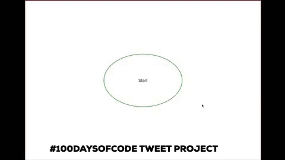
   
   ## Form Validation
   
   The **next** button is not actually part of the form. I wonder if it should be so it could be more like submit and work with enter?
   
   I'm trying to think of the best way to validate the form.
  
   [Here on w3schools](https://www.w3schools.com/js/js_validation.asp) they make a function called `validateForm()` using the `onsubmit` event handle attribute.
   
   ```html
   <form name="myForm" action="/action_page.php" onsubmit="return validateForm()" method="post">
   ```
   
   I could create a `validateForm()` function for each view, or it could be one function that has a switch statement to deal with validations for each view. We only have to validate for 3 views: view1, view3, view5- all the views that have **input layouts**. My input layouts are created by calling `inputLayout()` so maybe we can somehow add the validation to this? I'm just brain storming here.
   
   ### Solution
   I decided to use a switch statement in a `validateForm()` function that is called in the `nextHandler()`.
   
   ```javascript
      const nextHandler=()=>{
         //check if 
         if (!validateForm()) return;
         nextView();
      }

      const validateForm = ()=>{
         let input = document.querySelector("input");
         if (input==null) return true;
         input = input.value;
         let valid=true;
         
         switch (currentView) {
           case 1:
               if(input.match(/[12]\d{3}-(0[1-9]|1[0-2])-(0[1-9]|[12]\d|3[01])/) == null){
               alert("The date you entered does not match the format YYYY-MM-DD.");
               valid = false;
               }
               break;
           case (3 || 5):
               if(input==""){
                   alert("Please plaste in the array that was auto-copied to your clipboard.");
                   valid = false;
               }
               break;
           default:
           valid = "true";
               break;
         }    
         return valid;
   }
   ```
   
   ### Date Validation Regex
   
   I found a regex pattern for the date format yyyy-mm-dd [here](https://www.regextester.com/96683 ):
   
   `([12]\d{3}-(0[1-9]|1[0-2])-(0[1-9]|[12]\d|3[01]))`
   
   I used `.match`, [more info here](https://www.w3schools.com/jsref/jsref_match.asp), to see if the user's input matches the regular expression.
   
   ## 280 Tweet Limit
   
   I need to make sure the generated tweet is within the 280 character limit required by twitter.
   
   Since the amount of mentions will differ, sometimes the tweet may be too long. So I need to edit my `tweetURL()` to dynamically create a tweet where the tweet text will be shorter if the mentions are too long when combined with the tweet text. 
     
     I also have to consider the possibility that the mentions themselves will be over 280 characters. In that case I might make several tweet links to congratulate users in groups.
     
     This all complicates my code. I need to go to the drawing board tomorrow and figure out how to handle this. `tweetURL()` is going to become big and clunky if I don't organize this.
     
   ## Renaming My Repository
   
   I had a typo in my repository so I renamed it following [this tutorial](https://help.github.com/en/articles/renaming-a-repository).
     
     
   ## To do
   
   - design
   - understand promises
   - test going back and forth
     - back doesn't work correctly
   - tweet length validation
   - save user startDate and starting participants to local storage, skip some views if those are saved
   
- ## Thoughts and Feelings:

   Back hurts a bit. There's so many little things I need to work on.
 
   
**Link to Work:** [MVC twitter participant project](https://github.com/dangerousdashie/100daysofcode_post_search/tree/fb451f6c0daacd1e0280ac526300ec40a730cf23/MVC%20app)

## Day 85
### 3/26/19
- ## **100Daysofcode Tweet Search Project**

   I followed up with someone who wanted help from yesterday. I didn't get enough of my own coding done because of this. I should keep my volunteer hours within certain times and not agree to more later. 
   

   ## Twitter share link
   
   I found that this prefix: ***`http://twitter.com/share?text=`*** did not work well. I believe it's because you need to include a url or it acts up. It generated a tweet that inserted the url for the tweet back into the tweet. I guess share expects to share a link and without one it just uses itself as the link.
   
   The bolded section of the link was put there automatically some how.
   
   `https://twitter.com/intent/tweet?text=test%20test%20%3A%20%40test&`**url=https%3A%2F%2Ftwitter.com%2Fshare%3Ftext%3Dtest%2520test%2520%3A%2520%40test&original_referer=https%3A%2F%2Ftwitter.com%2Fshare%3Ftext%3Dtest%2520test%2520%3A%2520%40test`***
   
   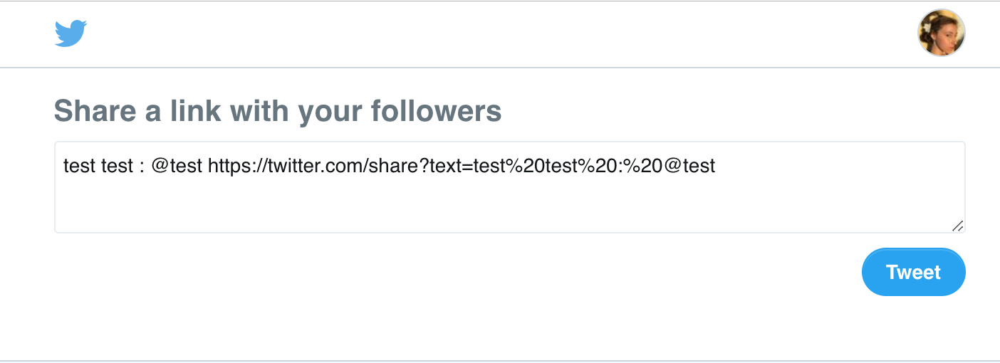
   
   However, ***this prefix worked*** without a link: `https://twitter.com/home?status=`
   
- ## Thoughts and Feelings:
   
   I feel a little burnt from extending my volunteer hours.
   
   The reason I agreed to follow up was because it seemed like this coder was the only person that was asking me for help yesterday. But then a bunch of people asked me for help after them. I didn't expect that many people.
   
   Some days no one asks for help, other days too many people do. I think it has to do with who retweets my Open DM tweets.
   
   I need to respect my time so I don't burn out. Back to coding for myself tomorrow.

## Day 84
### 3/25/19
- ## **100Daysofcode Tweet Search Project**

   Today I spent a lot of the day helping others on twitter DM, so my coding time was limited.

   ## Preview Github HTML Files
   
   This has been a helpful tool for me. You can go to [htmlpreview.github.io](http://htmlpreview.github.io/) and paste any github html link there inorder to actually see how the html renders. I find that for some files it doesn't work and I'm not sure why.
   
   You can also prepend to the URL **http://htmlpreview.github.io/?**
   
   *Example:*
   
   [`http://htmlpreview.github.io?`https://github.com/dangerousdashie/Simple-Button-Click-Counter/blob/master/index.html](http://htmlpreview.github.io?https://github.com/dangerousdashie/Simple-Button-Click-Counter/blob/master/index.html)
   
   ## Twitter Tweet Link
   
   I worked on creating a link that auto tweets for the user to congratulate their fellow participants for continuing with the challenge. 
   
   **This [stackoverflow thread](https://stackoverflow.com/questions/6208363/sharing-a-url-with-a-query-string-on-twitter) gives two ways to create an auto-tweet link:**
   
   - `http://twitter.com/share?text=`**text goes here**`&url=`**http://url goes here**`&hashtags=`**hashtag1,hashtag2,hashtag3**
   
     - Example: [`http://twitter.com/share?text=Im Sharing on Twitter&url=https://stackoverflow.com/users/2943186/youssef-subehi&hashtags=stackoverflow,example,youssefusf`](https://twitter.com/intent/tweet?url=https%3A%2F%2Fstackoverflow.com%2Fusers%2F2943186%2Fyoussef-subehi&hashtags=stackoverflow%2Cexample%2Cyoussefusf&text=Im%20Sharing%20on%20Twitter&original_referer=https%3A%2F%2Ftwitter.com%2Fshare%3Ftext%3DIm%2520Sharing%2520on%2520Twitter%26url%3Dhttps%3A%2F%2Fstackoverflow.com%2Fusers%2F2943186%2Fyoussef-subehi%26hashtags%3Dstackoverflow%2Cexample%2Cyoussefusf)
   
   - Intents
   
     - Intent [Web Intents](https://developer.twitter.com/en/docs/twitter-for-websites/tweet-button/overview)
   
     - Tweet Button: [Tweet Button](https://developer.twitter.com/en/docs/twitter-for-websites/tweet-button/overview)
     
- ## Thoughts and Feelings:
   
   Karma is abound.

   I was distracted today because our tire on our RV (where we live full time) blew out. My sweet beautiful amazing spouse took care of calling AAA it so I could continue to code. Thanks to him not only did I get to code, but I also was able to help others. Because of him so many coders benefited.
   
   I opened my DM up to help people, today. I was able to help a lot and for those that I couldn't help I referred them to other places for help. Someone even offered to help me, I couldn't take them up on it because it was towards the end of my coding time. But I might send them my code tomorrow.
    
   We were very lucky because the AAA guy said the tire could have exploded while driving. He was very generous and patient. He could not jack up our RV high enough but a stranger who lived nearby brought him a bunch of wood to help jack the tire up. The AAA guy said most AAA peolpe would just say fuck it and tow us to a tire shop. This guy went above and beyond.
   
   What an amazing day!
   
   
     
   

## Day 83
### 3/24/19
- ## **100Daysofcode Tweet Search Project**

   ## Daylight Savings
   
   I haven't look at these yet, but in response to my trouble with daylight savings yesterday [Brandon Kirkland on twitter](https://twitter.com/BrandoKirkland) suggested these resources:
   
   - [Youtube: The Problem with Time & Timezones - Computerphile ](https://www.youtube.com/watch?v=-5wpm-gesOY&feature=youtu.be)
   - [Stackoverflow: Daylight saving time and time zone best practices ](https://t.co/7hXTOHlDkn)
   
   ## AJAX
   
   I'm going to spend a lot of time today on AJAX. 
   
   I found this page, [Beginners Guide To Fetching Data With (AJAX, Fetch API & Async/Await)](https://dev.to/bjhaid_93/beginners-guide-to-fetching-data-with-ajax-fetch-api--asyncawait-3m1l), which shows addtional ways to get data.
   
   The author lists three ways:
   - AJAX
   - Fetch API
   - Async/Await
   
   I believe the author's terminology is  a little confusing here, because I think all of these are considered Ajax. But I think AJAX refers to the original Ajax. AJAX vs. Ajax. 
   
   > We now use “Ajax” as a generic term for any client-side process which fetches data from a server and updates the DOM dynamically without a full-page refresh. Ajax is a core technique for most web applications and Single-Page Apps (SPAs).
   
   from [*sitepoint.com*](https://www.sitepoint.com/xmlhttprequest-vs-the-fetch-api-whats-best-for-ajax-in-2019/)
   
   The author means making `XMLHttpRequest` object when he says's AJAX. Making an `XMLHttpRequest` object was the original way to use Ajax.
   
   ## Fetch VS XMLHttpRequest
   
   For some reason I'm able to get the response text in another part of my code if I use fetch, but not if I make an XHR object.
   
   ### XHR Object
   
   #### Undefined `instructionsText`
   
   ```javascript
   
   //-------------------------------data is NOT DEFINED in this function
   const view1 = ()=>{
      inputLayout("small");
      const instrEl = document.querySelector(".instructions");
      instrEl.innerHTML = instructionsText.view1[0]; //instructionsText is undefined 
   }
   
   //-----------------------AJAX with XHR object
   
   let instructionsText  = null;
   
   let xhr = new XMLHttpRequest;
   //Call the open function, GET-type of request, url, true-asynchronous
   xhr.open('GET', 'https://api.github.com/users', true)
   //call the onload 
   xhr.onload = function(){
      //check if the status is 200(means everything is okay)
      if (this.status === 200){
         //return server response as an object with JSON.parse
         console.log(JSON.parse(this.responseText));
      }
   }
   //call send
   xhr.send();
   ```
   
   ### Fetch
   #### Defined `instructionsText`

   ```javascript
   //-------------------------------data IS DEFINED in this function 
   const view1 = ()=>{
      inputLayout("small");
      const instrEl = document.querySelector(".instructions");
      instrEl.innerHTML = instructionsText.view1[0]; //instructionsText is defined 
   }
   
   //------------------------AJAX with Fetch
   
   let instructionsText  = null;
   
   fetch('instructions.json')
      .then(resp => resp.json())
      .then(obj => instructionsText = obj)
   ```
   
   ### Why is this happening?
   
   I'm wondering if the reason we get different results is because `fetch` and `new XMLHttpRequest` return different objects. `fetch` returns a Promise. `new XMLHttpRequest` ofcourse gives us an `XMLHttpRequest`. I don't understand the difference yet.
   
   This page looks like it might be helpful in understanding what's going on: [Getting to know asynchronous JavaScript: Callbacks, Promises and Async/Await](https://medium.com/codebuddies/getting-to-know-asynchronous-javascript-callbacks-promises-and-async-await-17e0673281ee). I didn't read the whole thing yet.
   
   I'm still not sure why `fetch` works the way I want it to but `new XMLHttpRequest` doesn't. I'm going to move on. Maybe when I start playing around with Ajax more I'll understand more.
   
   ### Update
   
   Fetch also doesn't work if I load `view1` right away by manually calling the `startHandler()` that brings up the view. Normally, the `startHandler` is triggered by a click event when the user clicks "next". Perhaps that gives the code enough time to get the data. 
   
  ## To Do
  
  - change next click event to a submit button and a submit event so pressing enter works
  - finish view 6
  - layout

- ## Thoughts and Feelings:

   Today I used a computer burqa/chuppah/sukkah to protect my eyes from eye strain. This helped a lot. But I need a better solution because the fabric falls into view. Perhaps if I can get something to tent it up.
   
   
   
**Link to Work:** [MVC twitter participant project](https://github.com/dangerousdashie/100daysodcode_post_search/tree/3dbaaec3ddd25639b86d6561c9335507d2f87fdd/MVC%20app)
   

## Day 82
### 3/23/19
- ## **100Daysofcode Tweet Search Project**

   ## Daylight Savings Problems
   
   The `OneHundredCodeDays` class method, `.numberOf(date)`, is giving me the wrong day. It's giving me a day less than what it should be.
   
   ```javascript
    numberOf(date){ 
       return Math.floor((date-this.startDate)/86400000) + 1;
    }
    ```
   
   I tried settings the time of the date passed into the function to the same time as the `.startDate` so that the days would subtract to whole days. I added this before the `return` statement.
   
   ```javascript
       date.setHours(oneHundred.startDate.getHours(), oneHundred.startDate.getMinutes(), oneHundred.startDate.getSeconds(), oneHundred.startDate.getMilliseconds());
   ```
   
   But it still wasn't working. 
   
   I noticed that some dates worked correctly with the `.numberOf()` method but some didn't. I manually tested `.numberOf()` with a bunch of dates. I found that `.numberOf()` gives the correct day, until daylight savings happens on March 10th.
   
   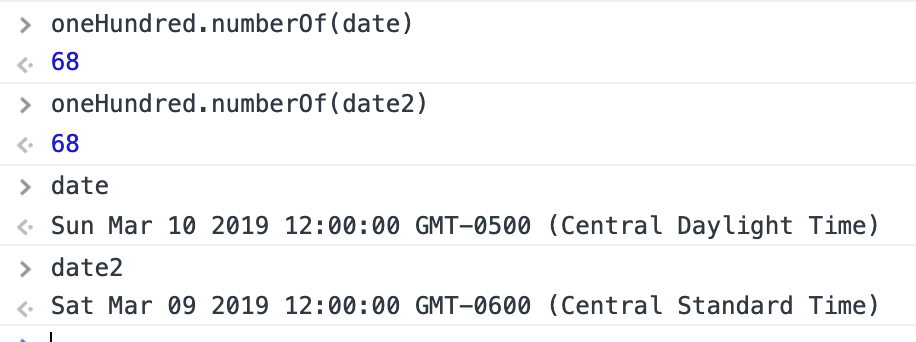
   
   So the problem has to do with daylight savings. 
   
   Daylight savings day is an hour less. The 23 hour day throws our entire calculation off by one hour. When we floor down this calculation, we floor down **23 full hours**, when we should round up **one hour**.
   
   So I changed `.floor()` to `.round()`. Depending on whether we're going in or out of daylight savings, the code `(date-this.startDate)/86400000` will only leave us a remainder of time that is an *hour more* or an *hour less*. No more, no less. So rounding will work to get us to the correct date, instead of flooring.
   
   
   ## AJAX
   
   I forgot that I'm already running a live server through the live server extension for Visual Studio Code. So I didn't need to to anything extra to set one up.
   
   Using AJAX was more confusing than I thought it would be. I used it before with jQuery. Now I'm doing it with vanilla JavaScript and I'm using the data during different points of the code.
   
   ### Getting the JSON file
   
   I used this tutorial from [gomakethings.com](https://gomakethings.com/ajax-and-apis-with-vanilla-javascript/) to get my data.
   
   ```javascript
   let xhr = new XMLHttpRequest();

   xhr.onload = function(){
      if(xhr.status >= 200 && xhr.status < 300){
           console.log("success", xhr);
      }else{
           console.log('The request failed!');
      }
      console.log('this always runs');
   }
   xhr.open('GET', 'instructions.json');
   xhr.send();
   ```
   
   Then I tried to get the data by adding the code below on the next line after `xhr.send()`. You have to use JSON.parse(), because the response is just going to return a string. We want it to be a JSON object so we can use dot notation and bracket notation to easilty traverse throught the data:
   
   ```javascript
   const instructionText = JSON.parse(xhr.response);//doesn't work!
   ```
   
   This doesn't work because, even though it's after `xhr.send()`, `xhr.send()` is asynchronous. So `.send()` doesn't actually finish running before the next line. So we havent actually gotten back our XHR response yet.
   
   In order to get the data, we have to innitialize `instructionText` within the success clause body. I'm not sure if 'success clause body' is the correct way to say it, but this is what I mean:
   
   ```javascript
   let instructionText; //declaration
   
   let xhr = new XMLHttpRequest();

   xhr.onload = function(){
    if(xhr.status >= 200 && xhr.status < 300){
        console.log("success", xhr);
        instructionText = JSON.parse(xhr.response); //-----------initialization----------
   }else{
        console.log('The request failed!');
   }
    console.log('this always runs');
   }
   xhr.open('GET', 'instructions.json');
   xhr.send();
   ```
   
   ### Using The Data From The AJAX Request
   
   Now if we use `instructionText` within our app, we'll still have a problem.
   
   ```javascript
   const view1 = ()=>{
      inputLayout(instructionsText.view1[0], "small"); //won't work, instructionsText is undefined
   }
   ```
   
   Trying to retrieve the `instructionText` in our `view1()` function doesn't work, again because we're accessing `instructionsTest` in a function that can be reached before the XHR request returned a response.
   
   So what should I do to get the response text where it needs to be?
   
   In this tutorial on [code-maven.com](https://code-maven.com/ajax-request-for-json-data), they create a function that takes a url for the JSON and callback function. The callback function they pass into their ajax_get() function, takes the data and puts it where it needs to be. 
   
   I'm wondering how I could implement this for my app. The problem is, since my app is a single page application, I can't place the data all at once. The code on [code-maven.com](https://code-maven.com/ajax-request-for-json-data) places all the data on the page as soon at the XHR request succeeds. But I need to place different data within the response at different times depending on what view the user is on.
   
   This is where I left off today.
   
   
- ## Thoughts and Feelings:

   I coded while in the passengers seat and the sun caused eye strain. Next time I can code under a towel or in the back.
   
**Link to Work:** [MVC twitter participant project](https://github.com/dangerousdashie/100daysodcode_post_search/tree/3b8ef1e61eba8b49d32c508c665fe1434cc29f48/MVC%20app)

   

## Day 81
### 3/22/19
- ## **100Daysofcode Tweet Search Project**
   
   ## Updating `Search` Class
   
   I updated `Search` so that it can create a string for multiple day numbers. This way I can see who posted for *both* **Day 1** and **Day 2** in the same query, for example, instead of only searching for **Day 1** or any other day by itself.
   
   This is useful because some people haven't done **#100DaysOfCode** consecutively. Participants can skip 1 day every 2 weeks according to **#100DaysOfCode**. So participants who started when I did, might not be up to day 81 today.
   
   That works out perfectly because that means you can be up to **7 days behind** on **#100DaysOfCode**. Twitter limits my string search after I add an **8th day string query**. So 7 works out.
   

   ## Range Helper Function
   
   There isn't a range function in javascript. Maybe there is or will be in a new syntax. 
   
   I made a range helper function.
 
   
    ```javascript
   const range = (start, end)=>[...Array(end-start+1).keys()].map(x=>x+start);
   ```
   
   If we call `range(3,6)` we would get `[3,4,5,6]`.
   
   This function uses the `Object.keys()` method.
   
   >The Object.keys() method returns an array of a given object's own property names, in the same order as we get with a normal loop.
   
   from [*Mozilla Documentation*](https://developer.mozilla.org/en-US/docs/Web/JavaScript/Reference/Global_Objects/Object/keys)
   
     I needed to create a range helper function so I could pass an array with a range of numbers to the updated `Search` class. With my range helper function I can pass this code into the `Search` method:
   
   ```javascript
   num: range(oneHundred.numberOf(weekAgo), oneHundred.numberOf(yesterday)
   ```
   
   ## Other Things Done and To Do
   
   - Done
     - Added JSON.parse and .stringify when copying the array of screennames to the clipboard. I thought this was cleaner than what I had before.
    
   - To Do
     - AJAX to get JSON
     - design
    
- ## Thoughts and Feelings:

   I got to cut this short because I'm running low on power. Hope there's not a lot of typos. Coded in the driving rialta today. I think I'm liking meditating.
   
**Link to Work:** [MVC twitter participant project](https://github.com/dangerousdashie/100daysodcode_post_search/tree/6a6709cadc3f9c09001aef718281a37422ef850c/MVC%20app)
   

## Day 80
### 3/21/19
- ## **100Daysofcode Tweet Search Project**

   ## JSON

   I made a JSON file that holds all the text for the instructions. This is more organized that keeping the text in the controller. 

   I thought if a JSON file is local, you could get it without setting up a server, but I think you still have to. Unless the file is formatted as a javascript file. But that's not the right way to do it. It should be a JSON file and it should be through a server.
   
   More info in this [stackoverflow thread](https://stackoverflow.com/questions/19706046/how-to-read-an-external-local-json-file-in-javascript).
   
   I didn't get the data yet. I need to review how to do that with AJAX. I've done it before and it shouldn't be hard.
   
   ## `:not()`
   
   I used `:not()` to filter out the promoted tweets when getting a list of screennames that tweeted about #100daysofcode. You'll get random promoted tweets like from Ritz Crackers or whatever. So you can filter them because they have a class called .promoted-tweet:
   
   ```javascript
   document.querySelectorAll(".tweet.js-stream-tweet:not(.promoted-tweet)")
   ```
   
   >The :not() CSS pseudo-class represents elements that do not match a list of selectors. Since it prevents specific items from being selected, it is known as the negation pseudo-class.
   
   from [*Mozilla Documentation*](https://developer.mozilla.org/en-US/docs/Web/CSS/:not)
   
   ## Removing Duplicates in an Array with filter()
   
   Just incase someone posted twice on the same day, I have to remove the duplicate screennames. I made a helper function to do this.   
   
   ```javascript
   const uniqueInArray = (arr)=>(arr.filter((x,i)=> arr.indexOf(x)>=i));
   ```
   
   At first I couldn't figure out the best way write this function. I knew I could use `.filter()`. I got the idea to use `indexOf` from [gomakethings.com](https://gomakethings.com/removing-duplicates-from-an-array-with-vanilla-javascript/#using-the-array-filter-method). 
   
   ## Organizing Views
   
   I created an array that holds the function names that control each view:
   
   ```javascript
   let view = [view0, view1, view2, view3, view4];
   ```
   
   Now, I can just go back and forth through the array to call the next and last view. What I had before was messier. It involved changing which function was next at every view. This is easier to change and read. 
   
   ## DevTools Step Over Vs. Step Into
   
   I finally understand the difference between *step over function* and *step into function* in the debugger. Sometimes they do the same thing which is why it confused me at first.
   
   I learned that if a line has a function call in it:
   
   - *Step over* will skip to the next line in the *current function*. 
   
   - *Step into* will take you to the function that was *just called*.
   
   ## Do To
   
   - Add the day number string to the first url
   - last views
   - design
   
   
- ## Thoughts and Feelings:

   Organizing my code paid off. Since I had so many reasable and well organized functions and classes, I was able to code the next views so fast. 
   
   Instead of creating all sorts of components and layouts for the new views, I just called the layout functions that I made. I passed the relavent arguments. It was so fast and easy.
   
**Link to Work:** [MVC twitter participant project](https://github.com/dangerousdashie/100daysodcode_post_search/tree/28c82f643acff0f79b55ef377c5029e07e0c082e/MVC%20app)

## Day 79
### 3/20/19
- ## **100Daysofcode Tweet Search Project**
   
   ## Rest Parameters
   If you use rest parameters, is it *optional* to pass any arguments into the function? It seems like it from my code. 
   
   Now I'm wondering if regular parameters are sometimes optional too. Like is it optional to pass them if they're not actually 100% necessary in the function? I'll have to play around with this.
   
   ## Syntax Requirements for Statements in Arrow Functions
   
   I tried to use a statement in an arrow function using parenthesis:
   
   ```javascript
   mainEl.childNodes.forEach((x)=>(if (!except.includes(x)) mainEl.removeChild(x)); //syntax error
   ```
   
   This gave me a syntax error because an if statement is a **statement** not an **expression**. 
   
   ***Statements must be put in braces {} in arrow functions.***
   
   >If an expression is the body of an arrow function, you don’t need braces:

   ```javascript
   asyncFunc.then(x => console.log(x));
   ```
   >However, statements have to be put in braces:
   
    ```javascript
   asyncFunc.catch(x => { throw x });
   ```
   from [exploringjs.com](http://exploringjs.com/es6/ch_arrow-functions.html)
   
   ### What's the difference between statements and expressions?
   
   >Expressions produce (are evaluated to) values. Examples:
     ```javascript
   3 + 4
   foo(7)
   'abc'.length
   ```
   >Statements do things. Examples:
   
    ```javascript
   while (true) { ··· }
   return 123;
   ```
   >Most expressions can be used as statements, simply by mentioning them in statement positions:
   
   ```javascript
   function bar() {
    3 + 4;
    foo(7);
    'abc'.length;
   }
   ```
   from [exploringjs.com](http://exploringjs.com/es6/ch_arrow-functions.html)
   
   ## Removing Elements With `forEach()` Doesn't Work Well
   
   ```javascript
   mainEl.childNodes.forEach((x)=>{
       mainEl.removeChild(x);
   });
   ```
   The above **leaves** child nodes. I expected all child nodes to be cleared, but they aren't.
   
   I think it's because inorder to find element x, `forEach()` is simply iterating through the indices of `mainEl.childNodes`. So first it takes `mainEl.childNodes[0]`, then `mainEl.childNodes[1]`, then index 2, etc:
   
   Value of x:
   
   `mainEl.childNodes[0]`
      
   `mainEl.childNodes[1]`
   
   `mainEl.childNodes[2]`
   
   `mainEl.childNodes[3]`
   
   `mainEl.childNodes[4]` ... etc....
   
   But since we are *removing nodes*, we are *messing with the indices.*
   
   
   At first these indices map to these elements:
   
   ```html
   <div id="main">
      <div id="one"></div> 
      <div id="two"></div> 
      <div id="three"></div> 
      <div id="four"></div> 
   <div>
   ```
   ```javascript
   mainEl.childNodes[0]  <div id="one"></div>
      
   mainEl.childNodes[1]  <div id="two"></div>   
   
   mainEl.childNodes[2]  <div id="three"></div> 
   
   mainEl.childNodes[3]  <div id="four"></div> 
   ```
   
   But once we remove the first child node, `mainEl.childNodes[0] //<div id="one"></div>`, we are left with a new NodeList.
   
   Now the element with id `#two` is in index 0.
   
   ```javascript
   mainEl.childNodes[0]  <div id="two"></div>   //[0] used to be #one
   
   mainEl.childNodes[1]  <div id="three"></div> 
   
   mainEl.childNodes[2]  <div id="four"></div> 
   ```
   
   But `forEach()` already dealt with index 0, so it moves on to *index 1* which has now changed from the element with id `#two` to `#three`. `forEach()` skips element `#two`. 
   
   This pattern continues and we end up skipping a lot of elements.
  
   ### This way works:
   
   ```javascript
   while (mainEl.hasChildNodes()){
       mainEl.childNodes[0].remove();
   }
   ```
   ## While Loop, Infinite Loop
   
   I ran into an infinite loop while working with a while loop. I always do this! A nice way to stop an infinite loop when you're developing and debugging is like this:
   
   ```javascript
   let loop = 0;
   
   while(somethingIsTrue){
      loop++
      //...some code here...
      if(loop>100){ 
         console.log("Over 100 loops, exiting function");
         return;
      }
   }
   ```
   
   ## `Document.execCommand('copy')` Not working in My Test
   
   I have this `copyToClipboard()` snippet which I got from [hackernoon.com](https://hackernoon.com/copying-text-to-clipboard-with-javascript-df4d4988697f). This snippet is originally from [30 Seconds of Code](https://github.com/30-seconds/30-seconds-of-code).
   
   The `copyToClipboard()` function wouldn't work while I was testing. That's because when I do unit tests, I am probably doing them wrong. I just call all the functions:
   
   ```javascript
   //------------------ test
   startHandler();
   document.querySelector(".input").value = "2019-01-01";
   nextHandler();
   ```
   
   Normally, `nextHandler()` is triggered by an event- a click on the next button. But here in my test we just call it. 
   
   `copyToClipboard()` is inside of `nextHandler()`.  `Document.execCommand('copy')`, which is  called inside `copyToClipboard()`, can only be executed as the result of a user action.
   
   Since my test calls `nextHandler()` without replicating a user click on the next button, this function doesn't work when testing. There was no user action.
   
   I wonder if it's possible to write a test that mimics a user action? I know that my tests are not really legit unit test. But it seems unsafe for any unit test to replicate a user action. Because then you could use unit tests in your actual code to do all sorts of unsafe things that browsers normally don't allow.
   
   ## Done & To Do
   ### Done
   My code now auto-copies the returned array of participants to the clipboard. So the user never has to select and copy.
   
   I cleaned up my code to make it more dry. I have a function, `clearLayout(...except)` that clears all children of the main div, except for nodes specified in the parameters.
   
   I created a new layout function, `linkLayout(url)`, which creates a layout with a link made from any url passed in to the function. We'll use this everytime we create a new twitter search link.
   
   ### To Do
   - View for inputing array of screennames
     - make sure screennames are not repeated
     - copy new code for comparing the screen names
   -design

- ## Thoughts and Feelings:
   
   Much more focused today! No podcasts distracting me.
   
**Link to Work:** [MVC twitter participant project](https://github.com/dangerousdashie/100daysodcode_post_search/tree/1a1a7fe65b645ab88a5a83f818438f49ce815f6a/MVC%20app)
   
 
## Day 78
### 3/19/19
- ## **100Daysofcode Tweet Search Project**
   
   Today I added functionality to the elements for the first and some of the second view. 
   
   My log won't be the best today, see **thoughts and feelings**.
   
   ## `replaceChild()
   
   I used `replaceChild()` to change some of the elements from one view to another. I don't know if this is the best way. But I got some practice with this function I never used before.
   
   ## Search Class Needs to be Revisted
   
   Now that I'm using the `Search` class, I see that the constructor should be set up differently. Because we might only want to set one day to search. And then later add an until date. So we'd want to set the until date later. I'm not totally sure. I need to think this through.
   
   ## Things To Do;
   
    - Make the code that gets autocopied to the clip board include `copyToClipBoard()` and copy the returned array so the user can easily paste it back into the program.
   
- ## **Thoughts and Feelings:**
   
   I'm a bit frazzeled because it's a travel day and I was distracted by the podcast playing in the background even over my white noise generator. To be honest it sounded so interesting that at points I tried to listen and code at the same time. 
     
   I turned my white noise off so I could listen. Not a great idea!
     
   I'm able to code if I leave my white noise on and focus. I've done it many times before. But I didn't turn my white noise up high enough so I coudl still make out some words and it sounded so interesting.
     
   So obviously I wan't super focused.
     
   I should note, compared to how much I used to struggle with coding while driving, I'm a million times better even on days I'm distracted. #100daysofcode helped me build a habit code no matter what. I've gotten much better at coding and blocking out distractions no matter where I am. 
      
  
   
**Link to Work:** [MVC twitter participant project](https://github.com/dangerousdashie/100daysodcode_post_search/tree/5b3076ce1dfb55505c90be752e7fedc7d0bc00c7/MVC%20app)

## Day 77
### 3/18/19
- ## **100Daysofcode Tweet Search Project**

   I was so organized today. My code is so easy to see and understand and it's very dry and I think it performs well too. Here are the things I learned and did:
   
   ## CSS Responsive square
   I found a way to make a responsive square in css that keeps its perspective. I didn't use this today but I had been wondering about it. The trick is to use padding because:

   >...padding is calculated as a percentage of its parent element’s width, not height. This rule applies, even for 'padding-top' and 'padding-bottom', despite being vertical measurements.

   from [*spin.atomicobject.com*](https://spin.atomicobject.com/2015/07/14/css-responsive-square/)
   
   ## Responsive Pages required CSS
   
   I wanted to put this here, I always lose it. This code helps your page better work with responsive design. It changes the box-sizing on all elements. I forget what the max width for img does but it's explained somewhere in the Responsive Layout tutorial on lynda.
   ```css
   html {
        box-sizing: border-box;
    }
    img {
        max-width: 100%;
    }
    *,*:before,*:after {
        box-sizing: inherit;
    }
   ```
   ## Confused about: CSS inheritance & Document Fragments
   
   I'm confused about which things are automatically inherited in css. I guess you can find it out by seeing what the default value for each property is. I thought that `font-size` would be inherited but it didn't inherit when I tried to inherit it from `html, body` where I set it.

   I'm confused when exactly you'd use a document fragment. Is it when you need to add a bunch of elements? I think so because otherwise if you're looping through adding a bunch of elements I think it slows down performance.
   
   [Mozilla Docs for documents fragments.](https://developer.mozilla.org/en-US/docs/Web/API/Document/createDocumentFragment)
   
   ## App Progress
   
   I continued my app's MVC structure. I drew out what my views would be like and made notes for my model, controller, and views javascript files.
   
   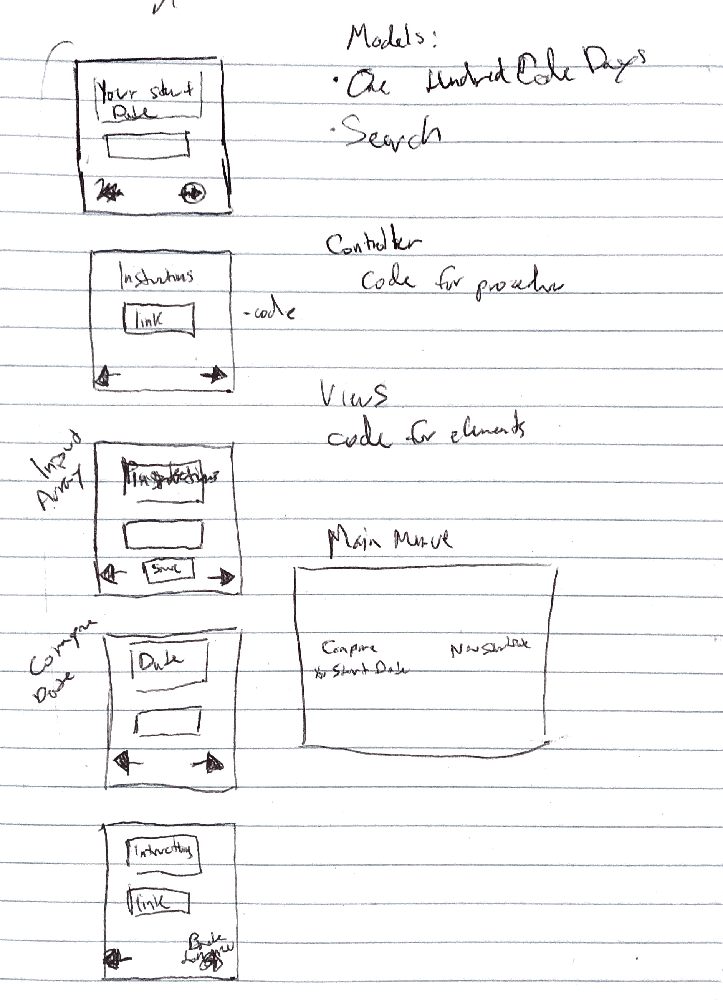
   
   This really helped me think through what was going to happen.
   
   ## MVC
   
   In my views file I have a function that makes elements, `elWithClass(el, ...className)`. You pass the class names and element types. I successfully used rest parameters for this function. Learning about rest parameter the other day turned out very helpful:
   
   ```javascript
   const elWithClass = (el, ...className)=>{
       const elem = document.createElement(el);
       elem.classList.add(...className);
       return elem;
   }
   ```
   
   Then there are other function in views for each element we need like a `start()` function that makes a start button. These functions call `elWithClass()`. The `input()` function bellow calls `elWithClass()`. It passes `input` as the element type, `input` as the class name, and then takes any other classes passed into it.
   
   ```javascript
   const input = (...classNames)=>(elWithClass("input", "input", ...classNames));
   ```
   
   My controller.js file controls which views get pulled up and when.
   
   I'm wondering if this is similar to how react.js works. I'm making all these reusable components. I think that's what react.js does.
   
   Of course, in models we have the classes we made before: OneHundredCodeDays, and Search. I don't know why I said we, I guess if you're reading this, you're a part of my journey.
   
   I ended with successfully getting a template up for the first view. Look how simple and beautiful!
   
   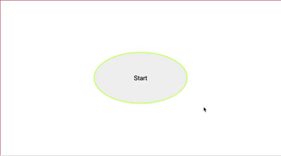
   
   **Thoughts and Feelings:**
   
   Today was great. My mind was clear. My code was clean. Glorious. Maybe because I started meditating? Or maybe just because I'm thinking more about how to have clean, readable code.
   
**Link to Work:** [MVC twitter participant project](https://github.com/dangerousdashie/100daysodcode_post_search/tree/ce713d795e02452b152076581dca86bad0e609be/MVC%20app)
   
## Day 76
### 3/17/19

- ## **100Daysofcode Tweet Search Project**

   ## Do I know how to use a favicon?
   
   I thought I did but it's not loading. I need to revisit this.
   
   ## When do you use a class and when do you use a function?
   
   I'm trying to understand when to use a function and when a class. I think if I'm returning an object with a bunch of methods and properties, that should be a class. I read a little bit of [this thread on the subject](   https://www.codecademy.com/en/forum_questions/5149f1c5b216ffa8f200019e), but I should read more later.
   
   ## Classes: Getters and Setters
   
   I learned about getters and setters today.
   
   ### Getters
   
   >The get syntax binds an object property to a function that will be called when that property is looked up.
   
   ```javascript
   var obj = {
      log: ['a', 'b', 'c'],
      get latest() {
          if (this.log.length == 0) {
            return undefined;
          }
       return this.log[this.log.length - 1];
      }
   }
   console.log(obj.latest);
   ```
   from [Mozilla Documentation](https://developer.mozilla.org/en-US/docs/Web/JavaScript/Reference/Functions/get)
   
   So even though you can get the property like a property- `obj.latest`- it's really going to call the function `.latest()` and get what the function returns as the property.
   
   ### Setters
   > The set syntax binds an object property to a function to be called when there is an attempt to set that property.
   
   ```javascript
   var language = {
      set current(name) {
          this.log.push(name);
      },
      log: []
   }

   language.current = 'EN';
   language.current = 'FA';

   console.log(language.log);
   // expected output: Array ["EN", "FA"]
   ```
   from [Mozilla Documentation](https://developer.mozilla.org/en-US/docs/Web/JavaScript/Reference/Functions/set)
   
   ## Error handling in classes?
   
   I'm wondering if there's a proper way to I throw an error if the wrong parameters are passed to the constructor. I havn't done a lot with error handling. In my class I just do simple if statements (*see below*) but I don't think this is the proper way.
   
   ## Is my Search class constructor too busy?
   
   I changed my `searchString()` function to a class called `Search`.
   
   I spent a lot of time thinking about this class and classes in general.
   
   It doesn't look clean and neat like all the other classes I've seen. 
   
   Usually class constructors just set `this.someproperty = property;`. But since I need to do a lot to the inputs, my constructor has all these functions and conditional statements that make it hard to read. 
   
   Should some of these actually be in a getter? Is that all that getters are for, to clean the code up?
   
   
   ```javascript
     class Search {

      constructor (obj){
          //temporarily save the passed properties into these variables for easier read and make empty if no params
          let since = obj.since || "";
          let until = obj.until || "";
          let range = obj.range || "";
          let num = obj.num || "";
          let participants = obj.participants || "";

          //errors, how do we do this?
          if (range!="" && until != ""){ return console.error("error, you can't have a 'range' and an 'until' value. You must have one or the other")};
          if (since==""){ return console.error("error, you must have a since value")};


          //should this function be in the search class constructor or on it's own?
          const formatDate = (date)=>{ 
              const year = date.getFullYear();
              const month = date.getMonth() + 1;
              const day = date.getDay();
              return `${year}-${month}-${day}`;
          };

          //this gets the until date
          const untilDate = ()=>{
          //until using until or range value
              if(until != ""){
                  return until;

              } else if (range == "" && until == ""){
                  let day = new Date();
                  day.setDate(since.getDate()+1)
                  return day;

              } else if (range != ""){
                  let day = new Date();
                  day.setDate(since.getDate()+range);
                  return day;
              } 
          };

          //since
          this.since = `since:${formatDate(since)}`;
          //sets the until property
          this.until = `until: ${formatDate(untilDate())}`;

          //participants
          if (participants !== ""){
              this.participants = participants.reduce(((a,c,i)=>{
                  let x; 
                  i==1? x =`from:${a}, OR from:${c}` : x = `${a}, OR from:${c}`;
                  return x;
              }))
          };

          //query with day number
          if (num!=""){
              this.number = `(Day${num} OR “day ${num}” OR r1d${num} OR “r1 d${num}”)`;
          }
      }            

      //could we do the below with dot chaining:
      url(...args){
          const string = args.join(' ') + ` #100DaysOfCode`;
          const urlStart = "https://twitter.com/search?f=tweets&vertical=default&q="
          const url = encodeURI(string).replace(/[(]/g, '%28').replace(/[)]/g, '%29').replace(/[#]/g, '%23').replace(/[:]/g, '%3A')
          return urlStart + url;
      }
   ```
   ## Model View Controller
   
   I started to set up this project with a **model view controller** design pattern.
   
   ## To Do
   
   - I think I need to go back to the drawing board, aka my note pad and think through the MVC pattern and how it will apply to my app. 
   
   - I might want to reach out for help and advice on the organization of my `Search` class.
   
   **Thoughts and Feelings:** There were two flies annoying the bejezus out of me. They need to leave or die!
   
**Link to Work**: [100Daysofcode Tweet search](https://github.com/dangerousdashie/100daysodcode_post_search/tree/e2af718471d2e3f3de160ecc1bfb55eed74d0b41/MVC%20app)

## Day 75
### 3/16/19

- ## **100Daysofcode Tweet Search Project**

   ## `reduce()`
   
   I got reduce to work!
     
   ```javascript
   participants.reduce(((a,c,i)=>{
        let x; 
        i==1? x =`from:${a} OR from:${c}` : x = `${a} OR from:${c}`;
        return x;
   }))
   ```
   
   If participants here is **["DashBarkHuss","Dominus_Kelvin","mahakothuri"]**, then the output is: **"from: DashBarkHuss OR from:Dominus_Kelvin OR from: mahakothuri"**.
   
   ## ES6 Destructuring, doesn't work with functions?
      
   I tried to use ES6 destructuring on a Date object but **this doesn't work:**
   
   ```javascript
   //regular way
   const year = date.getFullYear();
   const month = date.getMonth();
   const day = date.getDay();
   
   //ES6 destructuring
   const {getFullYear(): year, getMonth(): month, getDay(): day} = date; //doesn't work
   ```
   I guess you can't use it this way because these are functions- `getDate()`, `getMonth()`, `getFullYear()`. Maybe you can only use properties. I'm not sure yet. I didn't look furthur into it.
   
   ## Finished `tweetSearch()`
   
   I finished `tweetSearch()` but I changed the name to `searchString()`. 
   
   `searchString()` takes an object and outputs an object. Since it outputs an object I think I might want to change it to a class since it's sort of it's own type of data. 
   
   `searchString()` takes an object with properties for `since`, `until`, `range`, `participants`, and `num`. Some of these properties are optional. You can't do `range` and `until` in the same call because range and until are both used to calculate the the last day to search but in different ways, so they conflict.
   
   I thought I could search tweets from fellow participants but it seems like there's a limit on how many accounts you can search from. Since the number of people who joined #100daysofcode when I did was 120, that's too much for twitter to search. It looks like it has to be 24 or less. Something like that. But it looks like it also depends on what else you're searching.
   
   >Twitter handles fairly simple queries really well, but tends to break with longer and more complex queries.
   
   from [*unionmetrics.com*](https://unionmetrics.com/resources/how-to-use-advanced-twitter-search-queries/)
   
  ***The way you use `searchString()` would be like this:***
  
  ```javascript
  let search = searchString({since : mySetOf100.startDate, until: mySetOf100.dateOf(10), participants: mySetOf100.participants, num: 3}) //creates an object
  ```
  That create search object. It contains different strings, that are formatted to search twitter.
  
  To create a url you call the method `.url` and pass the properies, which contain different search strings, and organizes and encodes them into a uri.
  ```javascript
  search.url({search.since, search,until, search.num})
  ```
   Now that I'm talking through this I'm not sure if this is the best way to organize `searchString()` because what if, for example, I want to change the day number? I could just update `search.num` I guess. But I'm wondering if it would be better for the number string to be a function. Oh man, I'm not sure. I think this is fine for now. When I start using it maybe I'll get a clearer picture.
   
  ## Applying for a twitter API key
  
  I got some advice on applying for an API key from two people who got it. 
  
  [Vipul Bhardwaj](https://twitter.com/vipulbhj) said:
  
   >I mean I told them,
   >what I am gone use this for (Personal Project)
   >How will I use the data( In detail) 
   >
   >and other answered questions. In a few days got my API key
   ...
   >Be as detailed as you can be. And you are good to go
   
   [Anders Magnus Andersen](https://twitter.com/izznogooood) said:
   
   >I did it a month ago and remember this, it's the link they ask for which they say can be empty. But it can't, use https://twitter.com 
   
   So I'm going to try and reapply. I want an api for this project and for a lucid dream twitter bot.
   
  ## Do to:
  
  Now I have to get the date from the user. I could use some drop down calender. Not sure. Maybe I should start simple with a string and a function that turns the string into a date and sends the date to make a OnHundredDaysCode set. 
  
  I also want to change `searchString()` to a class.
  
  **Thoughts and Feelings:** Good day, can't complain. Coding is fun when I'm working on my own projects. The time flies so quickly. Can't wait untill I'm able to work more than 2 hours a day on coding. I'm limited by my power supply right now. But I also limit myself to two hours because this is a method for building a solid habit. If you limit yourself, you'll want to do more. You'll think about the habit because you're not allowed to do it which makes you want to do it more. Then when I'm finally allowed to work more than two hours, I'll be so happy. I think about code alot now. I code in my head outside the two hours, no rules against that! I code in my dreams too.
  
**Link to Work**: [100Daysofcode Tweet search](https://github.com/dangerousdashie/100daysodcode_post_search/blob/1701c23a151cb22e1fc6883a51ec4daa08ccca55/class_test.html)
   
## Day 74
### 3/15/19

- ## **100Daysofcode Tweet Search Project**

  I had an issue with my `numberOf(Date)` function. The days were calculating wrong so I fixed that.
  
  ## Arrow functions and the `arguments` object
  
  I found out arrow functions don't have the `arguments` built in parameter:
  
  >Arrow functions don't have this since the arguments array-like object was a workaround to begin with, which ES6 has solved with a rest parameter:
  >
  >`var bar = (...arguments) => console.log(arguments);`
  
  from [*stackoverflow*](https://stackoverflow.com/questions/41731854/why-do-arrow-functions-not-have-the-arguments-array)
  
  What is a rest parameter?
  
  >The rest parameter syntax allows us to represent an indefinite number of arguments as an array.
  
  from [*the Mozilla Documentation*](https://developer.mozilla.org/en-US/docs/Web/JavaScript/Reference/Functions/rest_parameters)
  
  ## Organizing my `tweetSearch()` function
  
  I spent a lot of time thinking through the `tweetSearch()` function. 
  
   - How should it be organized?
   
   - Should it use dot notation?
   
   - Should it be a method in the OneHundredDaysCode class?
   
      - I thought probably not, since we might want to use it without a set of OneHundredDaysCode
      
   - At one point I even wondered if it should be a class
   
  For now, I settled on it being a function that takes an object, this way not all the parameters need to be passed. I can create a string with different parameters, sometimes date, sometime particpants, etc.
  
  I'm ***thinking through the structure very slowly*** because the structure of the code is what I'm focusing on right now. ***How exactly should code be organized so it is reusable and clean?***
  
  It helped to jot down what my inputs might be and what the output would be for `tweetSearch()`. This helped me think about the calculations that would have to go between the inputs and outputs. It also helped me understand how to take the inputs.
  
  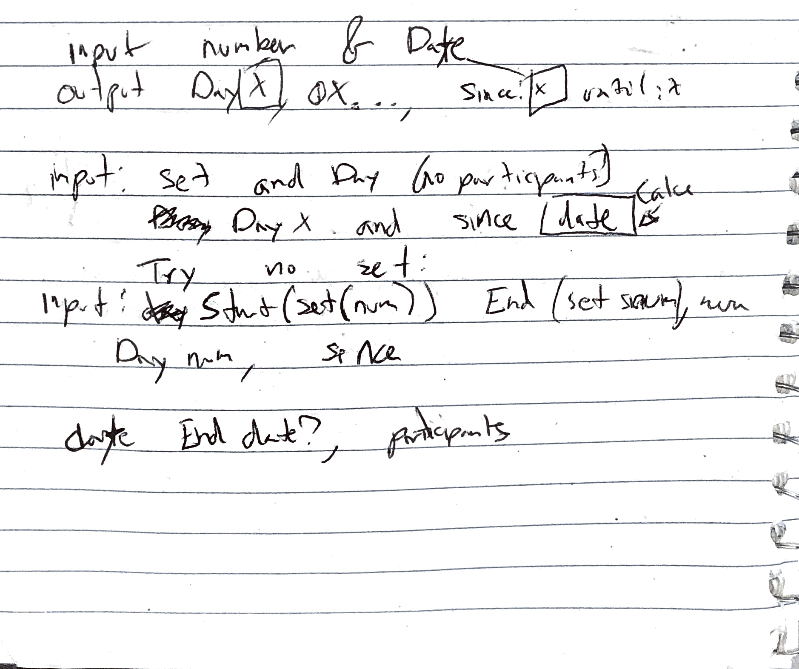
  
  For example, I realized it didn't make sense to pass an instance of OneHundredDaysCode to `tweetSearch()`. I should instead just except a few simple parameters - date, number of day, etc..- and I can use the instance of OneHundredDaysCode in question to get those parameters by accessing the properties such as `.startDay` or the functions like `.dateOf(number)`.
  
## Revisiting `.reduce()`

   I ended with trying turn an array of participants into the search string that can be used on twitter:
   
  -  **Inputs --> Outputs**
  
     **input:** ["DashBarkHuss","Dominus_Kelvin","mahakothuri"]
     
     **output:** "from: DashBarkHuss OR from: Dominus_Kelvin OR from: mahakothuri"
     
   I was going to use `forEach()` but then I thought reduce might be good. But  was having trouble figuring it out with `reduce()`. I'm not sure if `reduce()` isn't the best for this, if if it's just that I can't figure it out.
   
   I accidently lost my work for this anyways.
  
  ## Need to do: 
  
   I need to remember get rid of promoted tweets that come up in searches. And of course do everything else. 
   
## Thoughts and Feelings:
  
  I think thinking very slowly and delibertly through the planning process will prove fruitful. I hope that I will develop a natural sense of what classes, functions, modules etc..., I will need when I start projects.
    
**Link to Work:** [100Daysofcode Tweet search](https://github.com/dangerousdashie/100daysodcode_post_search/blob/27362d861530653b2c67c2063a084b681393e50b/class_test.html)
   
   

## Day 73
### 3/14/19

- **100Daysofcode Tweet Search Project**

  I finally took a minute to find the answer to the question:
  
  ### How do you delete the current line you're editing in DevTools or the command line?:
  - `cmd` +`U` 
  - `ctrl` +`U`
    
  ## Redoing my code
  
     I realized my code for this project was a mess. I didn't start with a good plan. Yesterday, I started to make a new version of the app that is more simplified. I continued with that today. 
     
     First I drew out flow of what the UX might look like. Obviously, these sketches are messy and I don't expect anyone be able to read these, but maybe it can give an idea of what I'm doing.
     
     
    
    
    Writing this out helped me see where I might reuse the same functions. It helped me get an idea of how to organize my code into classes or modules or functions.
    
    Next I started to sketch out my classes and functions in tables like this:
    
    
    
    I don't know what you call this kind of sketching. I got the above image from this [stackoverflow thread](https://stackoverflow.com/questions/3085285/difference-between-cohesion-and-coupling) about coupling and cohesion. The thread is useful in explaining how to best organize your code: basically ***avoid* coupling**, and ***use* cohesion**.
    
    Here, I started to sketch out my objects. I referred back to my UX sketch to get an idea of how to organize my code. Again, I don't expect anyone will be able to decipher my messy handwriting. 
    
    
    
    I didn't finish the planning yet.
     
    ## Revisiting Classes
    
    I wanted to use classes in this rewrite of my app. I used classes before in tutorial projects, but not on my own much. I decided to review classes and make sure I could write one. 
    
    Here's the [Mozilla documentation on javascript classes](https://developer.mozilla.org/en-US/docs/Web/JavaScript/Reference/Classes)
    
    I wrote out a class and tested it out in the console and edited it until it worked.
    
    ```javascript
    class OneHundredCodeDays {
        constructor(date, num = 1){
            this.startDate = new Date(date); //what type is date? it's a Date so you have to get the date first
            this.endDate  = new Date(date);

            this.startDate.setDate(date.getDate()-(parseInt(num)-1)); //parse int just incase we got it from a string
            this.endDate.setDate(date.getDate()+(100-parseInt(num))); 
        }

        dateOf(num){
            let date = new Date(this.startDate); 
            date.setDate(this.startDate.getDate()+parseInt(num)-1)
            return date;
        }

        numberOf(date){
        return Math.ceil((date-this.startDate)/86400000);;
        }
    }
    ```
    I can construct an instance of this class for example that creates a set of 100 days starting on my start day:
    
    ```javascript
    const myStart = new Date(2019,00,01); //jan 1, 2019
    const mySetOf100 = new OneHundredCodeDays(myStart);
    ```
    
    Then, for example, I can get what day out of 100 it is for me today:
    
    ```javascript
    const today = new Date();
    mySetOf100.numberOf(today); //returns 73
    ```
    
## Thoughts and Feelings:
  
  I've had ***8 dreams this year about coding.*** That's 8 dreams in only 3.5 months. Last year, I had **one** dream about coding the entire year! This increase is great because you consolidate memories when you dream. That means you solidify the thoughts or ideas that you dream about, moving them from short term memory to long term memory. 
  
  These dreams weren't lucid but they were still useful. They make my brain better at coding. I hope to have more. I can also think about coding in my lucid dreams.
  
  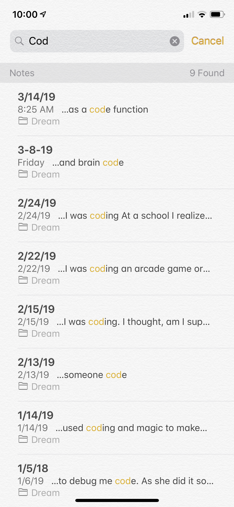
    
**Link to Work:** [100Daysofcode Tweet search](https://github.com/dangerousdashie/100daysodcode_post_search/blob/ba6cb3ee290c368c1c38806a35b4bf2d2712379d/class_test.html)

## Day 72
### 3/13/19

- **100Daysofcode Tweet Search**
    ## Function Declarations vs Expressions
   I started by changing my function declarations to function expressions so all of my functions would be the same format. But this lead to some errors. This is because [function declarations are hoisted](https://javascriptweblog.wordpress.com/2010/07/06/function-declarations-vs-function-expressions/) but function expressions aren't always hoisted.
   
  >**Do Function Expressions get Hoisted too?**
  
  >That depends on the expression. Let’s look at the first expression in Question 2:
   
  > var bar = function() {
  >  return 3;
  >};
   
  >The left hand side (var bar) is a Variable Declaration. Variable Declarations get hoisted but their Assignment      Expressions don’t. So when bar is hoisted the interpreter initially sets var bar = undefined. The function definition itself is not hoisted. 
  
   *from [javascriptwebblog, Function Declarations vs. Function Expressions](https://javascriptweblog.wordpress.com/2010/07/06/function-declarations-vs-function-expressions/)
   
   ## Git: revert
   So I had to revert to undo what I commited so I followed [this page about `git revert`](https://code.likeagirl.io/how-to-undo-the-last-commit-393e7db2840b). First it told me to `git stash` but I didn't know what that was so I [read about it here](https://www.git-tower.com/learn/git/faq/save-changes-with-git-stash). Then, [following this page again](https://code.likeagirl.io/how-to-undo-the-last-commit-393e7db2840b) I did `git revert`.  I ended up stuck in this thing on the terminal:
 
  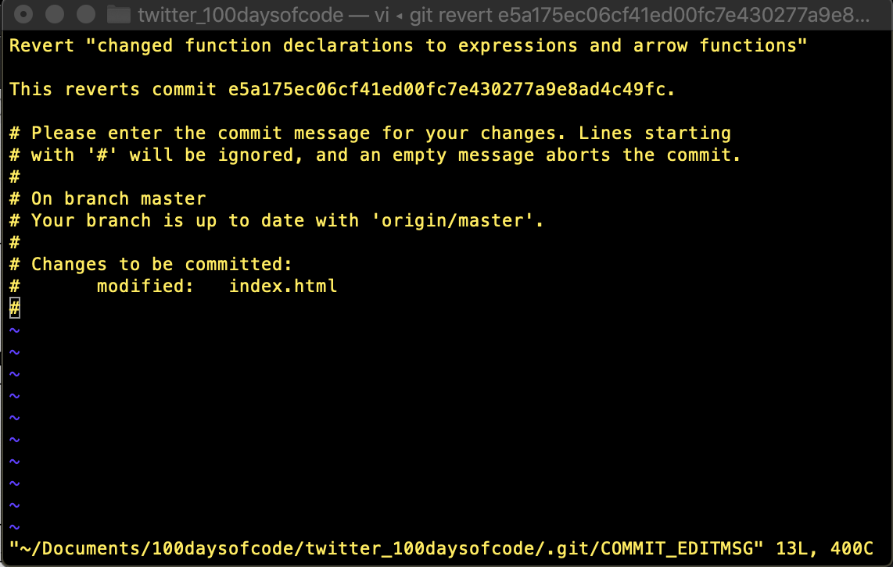
 
  I got out of it by following [these instructions from githowto.com](https://githowto.com/commiting_changes):
 
  >On the first line, enter the comment: “Added h1 tag”. Save the file and exit the editor (to do it in default editor, press ESC and then type :wq and hit Enter).
  
  Obviously, put your own comment in, not “Added h1 tag”. I still found it kind of wonky to enter the commit comment.
  
  [](https://stackoverflow.com/questions/17665489/using-this-inside-an-event-handler)
  
  ## Event Handlers and `this`
  I was inside an event handler and `this` was returning as the global object. I knew that `this` is supposed to the same as the current target of the event object, which can be found in the `currentTarget` property of the event object. `currentTarget` is the element that the event listener is set on.
  
  ```javascript
  document.querySelector("#myDiv").addEventListener('click', handler);
  ```
      
  For example, in the above, the element with id `#myDiv` will be the current target. `this` will also be `#myDiv.`
  
  ```javascript
  function handler(e){
  e.currentTarget //returns #myDiv
  this            //returns #myDiv
  }
  ```
  ***So why was `this` the global object, aka the browser window, in my handler instead of the current target?***
  
  To figure out the problem, I isolated the issue into a seperate file. 
  
  This file had a div with id `#testDiv` to set the event listener on. The event listener called the handler on `click`. I copied my function but replaced the body with `console.log(this)`. I still got the global object.
  
  ```javascript
  const this = (e)=>{
  console.log(this); //logs the global object
  }
      
  document.querySelector("#testDiv").addEventListener('click', handlerFunctionExpressionArrow);
  ```
  
  Because I isolated my issue, I could see the issue a little more clearly. I remembered that arrow functions handle `this` differently than regular functions. So I changed my test code:
  
  ```javascript
  const arrowFunction = (e)=>{
      console.log(this);        //global object
  }
  const regularFunction = function(e){
      console.log(this);        //current target, aka #testDiv
  }

  document.querySelector("#testDiv").addEventListener('click', arrowFunction);
  document.querySelector("#testDiv").addEventListener('click', regularFunction);
  ```
 
  So the issues was, I needed to use regular function if I want `this` to be the current target.
  
  More info on `this` and arrow functions:
  
  > Value of this inside an arrow function is determined by where the arrow function is defined, not where it is used.
  [from StackoverFlow](https://stackoverflow.com/questions/36915875/javascript-arrow-functions-this-in-event-handler)
 
  ## What Next:
  
  The program now takes the array of #100daysofcode particpants from the first seach, and if you press submit you can then press a search button and it will automatically copy the code you need to compare the two sets of participants. I don't have the instructions up for this second part so it looks kind of confusing but it works.
  
  My code needs to be more reusable. I'm wondering ***how to better plan code when I start*** so I don't have to do a crazy amount of refactoring in the middle of my projects. I need to think ahead. I think the more experience I get the better I will be able to figure out how to plan my code. But maybe I can research how others approach this.
  
  I started to make a new version of this twitter search app that is more simplified. It will just give the user a list of people that started 100daysofcode on the same day as them and are still doing 100daysofcode. I started writing out the psuedo code. I want to do this simpler app because I think it will help me really plan what's going to happen at every step of the UX.

- ## **Thoughts and Feelings:** 
    Good day. I did a lot of note taking and documenting on my log because I ran into a bunch of little issues and I wanted to remember what I learned.
    
**Link to Work:** [100Daysofcode Tweet search](https://github.com/dangerousdashie/100daysodcode_post_search/tree/c3cfdf95ba95a76bdcf2c1b4307f7c6e777e654d)

## Day 71
### 3/12/19

- **100Daysofcode Tweet Search**

    I made it so when you click the search buttons, the program automatically copies the code you need to the clipboard. I used [this code snippet on hackernoon](https://hackernoon.com/copying-text-to-clipboard-with-javascript-df4d4988697f).
    
    I changed a lot of little things:
    
    - I removed the div that held the code that you need to copy and paste, since now it is automatically copied.
    
    - I added a list of instructions. 
    
    - I refactored some of the code.
    
    - I made specific dynamic strings for each search button.
    
    - I changed the HTML syntax so I could use the `'submit'` event lister instead of `'click'`.
    
    - I started to make a form that returns what to paste so that you can find the common posters between two searches. This way you can find all the people that started on one day and are still posting today for example.
    
    I'm forgetting some of the things I did. Next time I'll make a list of everything I do or I'll commit to git more to track my changes.
    
   ## Before:
   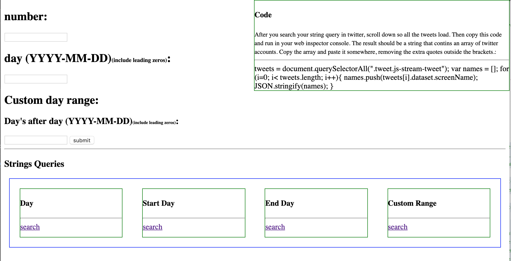 
   
   ## After:
   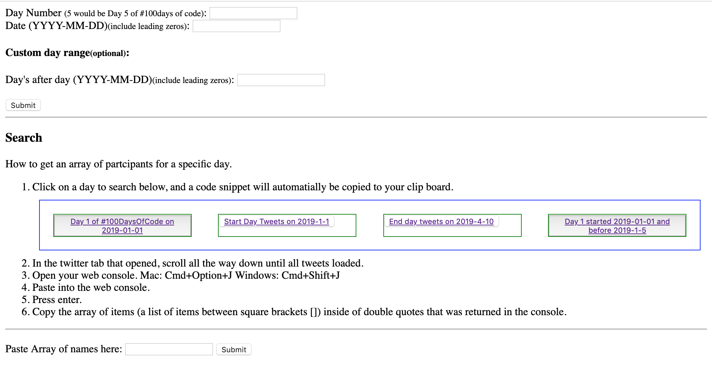
    
    **Things to do:** design, localStorage, finish the form to find common particpants between two searches. 
    
- ## **Thoughts and Feelings:** 
    I decided to let myself sleep in to see if I needed any sleep. ***I was able to sleep 10hrs and 45min.*** So I must have been in a bit of sleep debt. I felt so much **better, happier, and motivated today.**
    
    Catching up on my sleep *gave me back my power.* 
    
    The past few days I felt **depressed and hopeless**. Just a few days before I was **so incredibly happy for months.** My sleep deprivation zapped my energy that I normally have to deal with difficult situations. It took away my motivation to do the happiness practices I normally do to maintain my emotional health. Instead my brain took the path of least resistance, defaulting to ruminations on the negative. I felt hopeless even though intellectually I knew on some level my situation couldn't be hopeless. Thankfully, some part of me knew this feeling would pass.
    
    Today, after 10h:45m of sleep, the sleep itself instantly changed my outlook upon waking. But it also gave me the energy to do my happiness practices again, which further helped my emotional state. 
    
    ***This was the practice I did:*** Everytime I thought something negative, I had to subtract a point on a notepad and write next to it the subject I was thinking about. Then, I had to think of three nice things about that subject. I got to negative 5 which also meant I had to think 15 nice things about those negative subjects. 
    
    After the first hour or so of the day, the negative thoughts were exterminated. I'm excited to code and I'm incredibly happy again and my ruminations are gone.
    
    ***What I learned or relearned:*** 
    - Sleep is incredibly important for me. I think I need to figure out how to avoid sleep debt, especially for more than a day. I thought it would be nice for my family if I stayed up late to hang out with them. But the compounding sleep debt made me depressed and probably not my best self for them. So it really wasn't worth it.
    
    - I may enter into a funk, but it's just temporary. 
    
    - My happiness practices are so important.

**Link to Work:** [100Daysofcode Tweet search](https://github.com/dangerousdashie/100daysodcode_post_search/blob/846110c162ed5b3ac83134df45ca50292630911d/index.html)

## Day 70
### 3/11/19

- **100Daysofcode Tweet Search**

  Before, I had this project output strings like: ***"(Day1 OR “day 1” OR r1d1 OR “r1 d1”) (#100daysofcode) since:2019-01-01 until:2019-1-8"*** and you were supposed to copy and paste them into the twitter search bar:
  
  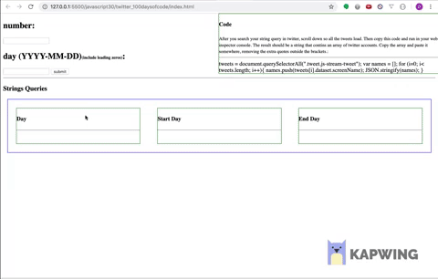
  
  I replaced those output strings with links so now there's no copying required for the searching. 
  
  I added a custom day range option. This way I can seach everyone who posted "day 1" starting January 1st and ending January 10th for example, if I put 9 in for the custom day range.
  
  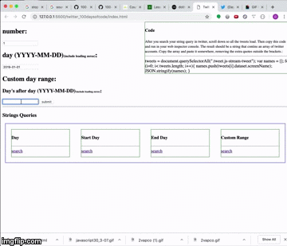
  
 - **Thoughts and Feelings:** I coded while in the passengers seat of the Rialta today. It was hot. I learned a lot today, but I'm so hot I'm just trying to finish this post so I can get outside the Rialta and cool off. So, not doing an indepth post today.
  
   
  

**Link To Work:** [100Daysofcode Tweet search](https://github.com/dangerousdashie/100daysodcode_post_search/blob/5c72bb19324ecb0d5ca42ba2efefdade244ac5a5/index.html)

## Day 69
### 3/10/19

- **JavaScript30: *Tally String Times with Reduce***

   For this project, no offense Wes, but I liked my solution better than Wes's! But here are somethings I liked from his solution that were either new techniques or refreshers:
   
   ### Making an Array from a NodeList
   
   We can't use array functions on NodeLists, except for `forEach()`. Wes said using `forEach()` to turn a nodelist into an array is messy so these two ways are better:
   
   - #### Spread Operator:
   
         const timeNodes = [...document.querySelectorAll('[data-time]')];
      
   - #### `Array.from()`:
      
         const timeNodes = Array.from(document.querySelectorAll('[data-time]'));

   ### Another Example of ES6 destructuring:
      let time = "3:45";
      const [mins, secs] = time.split(':');

      >mins //input
      <"3"  //ouput
      >secs
      <"45"  
   
   
   ### Passing a function into `map()`:
      let stringNums = ["60", "23", "90"]
      stringNums.map(parsefloat)
      <[60, 23, 90]
      
   ### `reduce()`:
   
   Ofcourse, we learned more about the array function `reduce()` in this video. Here's the [documentation for reduce.](https://developer.mozilla.org/en-US/docs/Web/JavaScript/Reference/Global_Objects/Array/Reduce)
  
- **#100daysofCode Twitter Participants:**

  I started to change the string to search that the program outputs into a link that you can just click and it will search the string for you.

 - **Thoughts and Feelings:** 
 
   I need to find a way to get spell check on this markdown editor on github. I keep spelling words wrong. 
   
   I accidently coded on less sleep. I was trying to wake up early to get coding done so I could hangout with my sister. So I set my alarm to sleep 7 hours which I thought would be the minimum I could have without feeling tired. But I forgot it was daylight savings. I was so tired when I woke up. I actually only set my alarm to sleep 6 hours. I didn't realized it until later. I had real coffee today and it's giving me a tiny bit of acid reflux. 
  
   
## Day 68
### 3/9/19

- **JavaScript30: *Sort Without Articles***
   
   This took me a while because I'm still getting used to the array functions like `map()`, `sort()`, and `filter()`. 
   
   I also got stuck for a while because I meant to use `indexOf()`, but because I was thinking of indexes I did `indexOf[]` instead of `()`. I'm surprised I got no syntax errors from this. 
   
   I learned a little bit about [in place](https://en.wikipedia.org/wiki/In-place_algorithm) algorithms when I was reading about [`sort()`](https://developer.mozilla.org/en-US/docs/Web/JavaScript/Reference/Global_Objects/Array/sort). I was wondering where the sort function keeps the order of the array at every step? I guess it stores it **in place** which I'm trying to understand. Is it accessible in the debugger? If I want to see mid-sort-function what's been sorted and in what order so far, can I? 
   
   I'm trying to figure out what order the compare function in `sort()` takes each item. I console logged an example to see but I'm still not sure.
   
   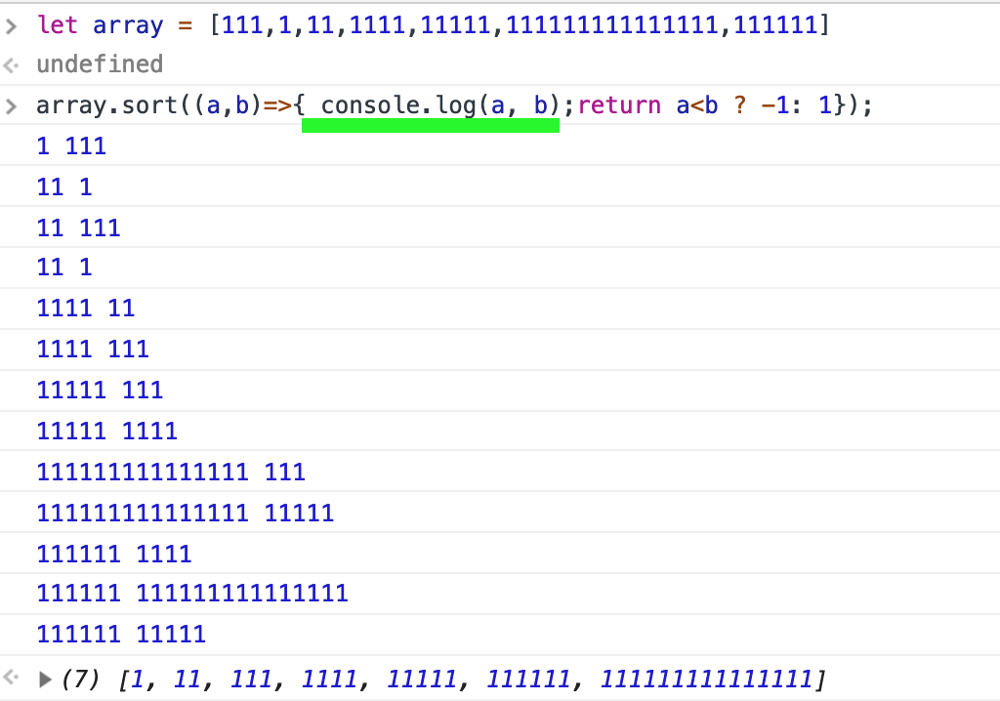
   
   
   When I watched Wes's solution, it was much better. He used regular expressions with `replace()` which made the program much more concise. I ended with trying the challenge over again, doing what Wes did. 
   
   Learned about `trim()` which removes white space from the outer edges of a string.
   
 - **Thoughts and Feelings:** 
    
    I journaled last night to help me figure out how I could have better handled the situation that happened yesterday. I feel much better and figured out what I can do in the future. 
    
    This morning I meditated and that helped too. I didn't do mindfulness which I normally do. Instead, I tried a meditation from the book I'm reading, which claims mindfulness isn't the same as meditation. In my case, meditation was a better choice because it helps rejuvinate you and get rid of passed stress. It prepares you to handle stress in the future. Mindfulness is mostly just for the present moment.
    
    Coding was much easier today. My extended family wasn't around. I coworked with my cousin by the pool under a "computer burqa" to help reduce my eye strain.
    
    
    
Grateful to be feeling good. I had a great coding session. Yesterday night, I had so much fun playing pictionary with my family. My sister is flying in today! As long as I can respect my coding time and my family time, I know I'll have a good time.
   
## Day 67
### 3/8/19

- **Helping People**

   Today I spent the day opening my inbox up to help people. My tweet was retweeted by @js_tut and so I got a lot of messages. I thought I would get more questions related to fixing bugs so I thought I would do more coding but people asked more for general advice. I got a surprising amount of questions from people overseas which can be hard because there was sometimes a language barrier. Very few women asked me questions, 2 out of 13. Ladies, come on! I don't know if it's because there's just less female coders (it doesn't seem like it online though) or if women ask for help less. I think Americans in general are afraid to ask for help which is why I got more questions from foreingers. I'd like to come up with a better way to help people.
   
- **JavaScript30: *Sort Without Articles***
  
  I decided to do a bit more coding since I didn't really code when I was helping people. I started the *Sort Without Articles* challenge from JavaScript30. I got stuck on using the array sort() function for a really long time. I was coding around family on vacation so I was pretty distracted. At first I thought it had to return true or false, but the sort function has to take a function that returns 0, a positive value, or negative value. Once I figured that out I thought that you could have a return statement in a ternery statement. But a ternery statement requires expressions, **not statements**. Then I thought arrow function had implied returns but apparently I needed the return statement because I had the expression in a block: 
  
  >Arrow functions can have either a "concise body" or the usual "block body".
  >
  >In a concise body, only an expression is specified, which becomes the implicit return value. In a block body, you must use an explicit return statement.
  
  -- from [*Arrow functions*](https://developer.mozilla.org/en-US/docs/Web/JavaScript/Reference/Functions/Arrow_functions)

  
  Oh the little things! I finally got the syntax down:
  
      const bands = ['The Plot in You', 'The Devil Wears Prada', 'Pierce the Veil', 'Norma Jean', 'The Bled', 'Say Anything', 'The Midway State', 'We Came as Romans', 'Counterparts', 'Oh, Sleeper', 'A Skylit Drive', 'Anywhere But Here', 'An Old Dog'];

      var bands2 = bands.sort((a,b)=>{
           return a.charAt(a.length-1) < b.charAt(b.length-1) ? -1: 1;
      });
     
   This sorts the array in alphabetical order by the last letter in the band name.
   
 - **Thoughts and Feelings:** Having a hard time on family vacation. My family's getting mad at me for coding at times. I'm distracted. I need to relax, it was upsetting me that they got mad at me for coding instead of setting the table. I said I would do it in a few minutes after I finished coding and they got mad. It hurt my feelings a lot. I don't know! 
   
      

## Day 66
### 3/7/19

- **JavaScript30: *LocalStorage And Event Delegation***

   - I reviewed what I learned in this video, practicing the concepts again in a simple HTML document. 
   
   - I finished the additional challenges for this project to create buttons that clear, uncheck, and check all the options.

- **JavaScript30: *CSS Text Shadow Mouse Move Effect***
   
    I learned about the `offsetX` and `offsetY` property on mousemove events, which shows where the mouse was when the event was triggered. I learned about ES6 destructuring:
 
    
    ### ES6 Destructuring
    What is ES6 Destructuring?
    
    >It allows us to extract properties from an object or items from an array, multiple at a time.
    
     -- from Wes Bos's [*A Dead Simple intro to Destructuring JavaScript Objects*](https://wesbos.com/destructuring-objects/)
     
     Old way
      
      const width = hero.offsetWidth;
      const height = hero.offsetHeight;

     New way

      const { offsetWidth: width, offsetHeight: height } = hero;
       
     Fun project.
     
     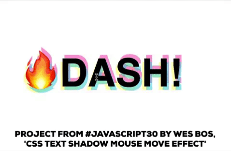
     
 - **Thoughs and Feelings:** 
   
  I was pretty distracted today. I slept late on purpose to make up for my sleep deprivation. I feel great. But that pushed my coding back. So I had to code around my family since I'm currently on a family vacation. I'd prefer to get my coding done early before I see them while I'm on this vacation.
  
  I was also distracted by the boom of followers I got today. @js_tut tweeted this:
       
   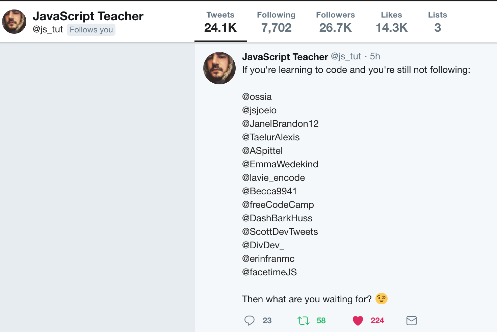
   
  So a bunch of people followed me and it was exciting and distracting! 
  
  I think I need to go relax and clear my mind!
  
**Link to Work:** [Review of localStorage concepts](https://github.com/dangerousdashie/JavaScript30/blob/c9123dfc403e26f9e443e9675bd0778d6bb39465/15%20-%20LocalStorage/index-review.html), [LocalStorage additional challenges](https://github.com/dangerousdashie/JavaScript30/blob/c0540917c095f4a5f676dd18ad1de7dd375ad7ec/15%20-%20LocalStorage/index-dashie.html), [Mouse Move Effect](https://github.com/dangerousdashie/JavaScript30/blob/6897ca4557c38bc9397d10ba2d2672056082f362/16%20-%20Mouse%20Move%20Shadow/index-dashie.html)

## Day 65
### 3/6/19

 - **JavaScript30: *LocalStorage And Event Delegation***
   
   This video had so much going on. I enjoyed it and went slowly. It was a 30 minute video but I took 2 hours to go through it. I learned a lot. This was the first time I used localStorage. I can't wait to use it in my own projects. Here were some other interesting things I learned:
 
   ### Event Listeners: Submit Vs. Click
    - Use *submit* on a **form**. If you just add a click event to the form button it won't work when someone presses enter.
    - With submit the default is for the page to refresh, so you may want to use `preventDefault()` in your event listener callback function.
    
    ### ES6 Property Value Shorthand
    
    Let's say we have a variable we want to use in making an object:
    
       const text = "some text here";        
        
    **Initializing the variable:**
    
    Old way
            
        const item = {
            text: text,
            someOtherProperty: "someValue"
        }
    New Way
       
       const item = {
            text,
            someOtherProperty: "someValue"
        } 

   You can leave out the property value if the key matches the variable name.
   
 - **Thoughs and Feelings:** 
   
   I am slightly sleep deprived. I had one night of 5 hours of sleep and a few of 6-7. I really like to get 7.5-9. For some reason I've been waking up really early. Then I'm too excited for the day and can't go back to sleep. I'm hoping that when I start #100DaysOfMeditation I can fix this.
   
   I could feel the toll the deprivation is taking on me. I was a little anxious to finish my coding. Sleep deprivation decreases my motivation. But I still did a pretty good job of staying focused and excited about coding, inspite of the lowered motivation. I'm also on family vacation so that might have played a roll in my motivation. I know my family wants to see me and yet I'm in my hotel room coding.
   

**Link to Work:** [LocalStorage And Event Delegation](https://github.com/dangerousdashie/JavaScript30/blob/33d51f5b67e4e77dac5b622c2c61d347e4acea5f/15%20-%20LocalStorage/index-dashie.html)

## Day 64
### 3/5/19

 - **JavaScript30: *Object and Arrays - References VS Copy***
 
    I learned that when you **assign a variable** to an **object** identifier or an **array** identifier, the new variable is a *reference* to that object or array. So they are two different identifiers for the *same exact thing*. If you change an array item using one of the identifiers you are really changing the array that the other identifier referenced too.
    
    On the otherhand, when you **assign a variable** to a **boolean, number, or string** identifier, the new variable is a *copy* of the other one. If you change the new variable it won't affect the other variable.
    
    How can you create a copy of an array? These ways:
    
       const players = ['Wes', 'Sarah', 'Ryan', 'Poppy'];
       
       const team2 = players.slice();
       const team3 = [].concat(players);
       const team4 = [...players];
       const team5 = Array.from(players);
   
   How can you create a copy of an object?
   
       const person = {
          name: 'Wes Bos',
          age: 80
       };
 
       const cap2 = Object.assign({}, person, { number: 99, age: 12 });
       
   The copy is only one level deep. An object nested inside an object *will be referenced* when you use object assign, even though the main object is *copied*. ex:
   
       const wes = {
          name: 'Wes',
          age: 100,
          social: {
            twitter: '@wesbos',
            facebook: 'wesbos.developer'
          }
        };
        
       const dev = Object.assign({}, wes)
       
   `dev` is a copy of `wes`, but within this copy we made a *reference* to the nested `social` object.
  
   How can you copy more than one level? Find a clone deep function online. Some libraries have them. Wes said you should be cautious about using it because there's often a better way to deal with the situaion that cloning deep but I'm not sure why. He also gave this poor mans version of close deep but said he's not sure of it's affect on performance:
  
    const dev2 = JSON.parse(JSON.stringify(wes));
    
  - **CSS3 in 30 Days: *Style Fancy Buttons***

    I started CSS3 in 30 Days which was recommended to me on twitter. I didn't finish it but the first video was styling buttons. I don't know if I like this tutorial. 
    
    


## Day 63
### 3/4/19

 - **JavaScript30: *Slide In On Scroll***
   
   I forgot I finished this challenge so I did it all over again. I spent a way longer time on it, trying to make sure I understood how all the heights of everything work together. It helped to step away from the monitor and sketch out how it all worked.
   
   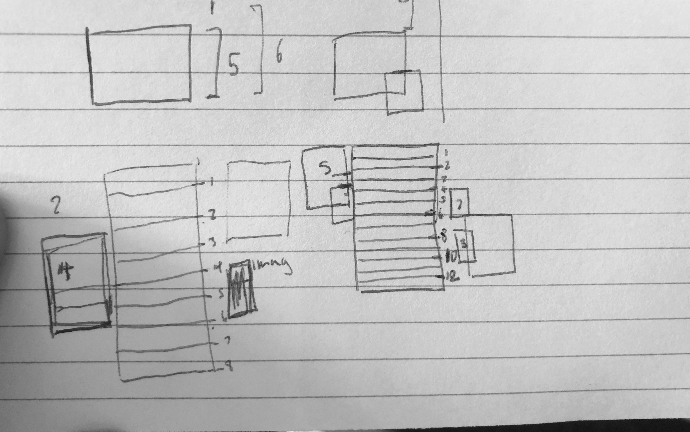
   
   I learned a short cut for changing a value quickly in DevTools. Click into a numerical css property value (ex: `transform: translateX(`**26.4%**`) scale(0.95);`) in the DevTools style tab. Then use the up and down arrow buttons or the mouse wheel to increase or decrease by 1. For other increments hold down the following keys:
    
   - `cmd` +/- 100
   - `shift` +/- 10
   - `alt` +/- .1
   
   I finished the challenge. Then I watched Wes do it and copied him. I ran into a bug; for some reason when I get the heigh of the image it says it's 0. but When I'm not in the forEach loop the image is the right height. More investigating tommorrow.
   
 - **Thoughs and Feelings:** 

   I am at my cousin's house. I felt self-concious working here. The other day my cousin asked my spouse "Aren't you in tech?" and what he was doing to make money. When he said "no" and "nothing", she was surprised and wondered how we would make a living. But she didn't ask *me*. *I'm the one who's in tech* and I'm going to be making the money. I felt self-concious, like why didn't she ask me? Do I give off a vibe that I'm lazy and good for nothing? I got in my head. When I was working today I really wanted her to notice I was working on coding but she never asked me. I felt lame for caring about this. I know it's not important so this is something I need to work on. I really wanted my hard work to be recognized and not to be seen as lacking ambition. But I shouldn't care what others think. My focus should be on my own goals.

   I have to remember that this is a universal feeling. Probably all the people I look up to feel like this sometimes. I have to remember that these feelings are just in my mind. To help, I can consider alternative interpretations of what happend: My cousin doesn't know anything about my ambitions and doesn't want to offend me by asking me what I plan to do. A lot of times men are the bread winners and women aren't so maybe she didn't want to insult me and imply that I had to work like she does. Maybe she knows I study code and so she didn't ask. Worse case scenario, if she does think I'm lazy, she still thinks I'm a great person and she will find out soon enough that I'm a hard worker when it's obvious. And then it will be a fun surprise. it's kind of fun to surprise people about who you really are.
   
   These thoughts and feelings distracted me. When I work in an office I might encounter similar feelings so this is something I really want to work on so I can stay focused.

## Day 62
### 3/3/19

- **Pomodoro:**
   
   I continued to work on my Pomodoro app. I worked on the design, layout, css, etc. Again, I used [this dribbble page for inspo.](https://dribbble.com/shots/2750480-Daily-UI-014-Countdown-Timer) 
   
   I refactored some code for the `makeSecondsReadable()` function so it was more reusable. I reused it for the interval displays.
   
   I added specific css for when the timer is on a break interval. The timer turns to a green/blue gradient.
   
   I still need to add more form validation, get the code to work with minutes submited in m:ss (1:30) format instead of just decimals (1.5), and pick better alarm sounds.
   
   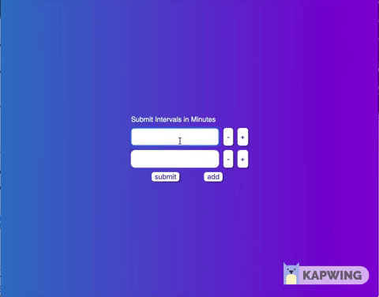
   
**Link to Work:** [Pomodoro, last commit](https://github.com/dangerousdashie/pomodoro/tree/169083e0c7bb825091ea66811ba2af49770053d8)
   

## Day 61
### 3/2/19

   Yesterday I coded more after I posted to my log. I did more with my **#100daysofCode Twitter Participants** project. Today I continued with that and took a break from my **Pomodoro** App. I did get an answer to my Pomodoro questions on [stackover flow](https://stackoverflow.com/questions/54949659/white-line-appears-at-end-of-gradient-filled-div-at-specific-browser-widths). The line was due to a rounding issue. basically it's calculating a percentage of a width that has a decimal. Since it's not a whole number, it's sometimes rounding it up, sometimes down, not sure exactly. The trick to fixing it is to set the background size slightly bigger than the div, `background-size: 100% 101%;`
   
- **#100daysofCode Twitter Participants:**
   
   I got this project pretty far. It's usuable but the design isn't great. I need to redo the layout so I have more space for instructions. I haven't put it on git hub yet, but I will after the instrucitons are done. 
   
   You can see how someone might use it in the video below. In this example, I used it to find out how many people started #100daysofcode the same day as me: I enter a date (march 1st) and the day of #100DaysOfCode (60th) because I was on my 60th day yesterday. The program outputs 3 string queries to search on twitter: one for the day entered, one for the supposed start day for these people, and the end day for them. 
   
   I copied the _'start day'_ string query to see how many people started the same day as me. I searched the string query on twitter. It shows me all **day 1 #100DaysOfCode** tweets of the people who started on January 1st, when I started. I selected the 'latest' tab. Scrolled all the way down so all the tweets loaded. Then I used the console to find the number of people who started with me, using code I saved on the project UI for easy copying.
   
   
   


## Day 60
### 3/1/19

- **Pomodoro:**
   
   I posted my white line problem [here on stackover flow](https://stackoverflow.com/questions/54949659/white-line-appears-at-end-of-gradient-filled-div-at-specific-browser-widths).
   
   
   
- **Helping out:**   
   
   I helped another #100daysofcode participant on her [coding homework.](https://twitter.com/ItsladyKadie/status/1101475054460854272) I've been wanting to help someone and I finally did!
   
- **#100daysofCode Twitter Participants:**
   
   I started playing around with a script that finds how many #100daysofcode participants for a certain day (day 1/100. 2/100 etc) on a certain date there are.
   

## Day 59
### 2/28/19

- **Pomodoro:**
   
   I finished the function that converts the time from seconds to m:ss. I merged my branch into to master and deleted the branch. 
   
   I worked on the layout of the timer. I reviewed some of [flexboxfroggy](https://flexboxfroggy.com/) but I decided to change the flexbox I was working with to grid. I'm still trying to get the hang of each. 
   
   I added some styles. I used [this dribbble page for inspo.](https://dribbble.com/shots/2750480-Daily-UI-014-Countdown-Timer)
   
   _dribbble inspo_
   
   
    _Work by [Serj Krush](https://dribbble.com/SerjKrush)._
    
    I left off with a bug where the gradient background color has a white line on the right side of the timer div. I don't know why. It looks light pink in the gif, but it's white.
   
   


**Link to Work:** [Pomodoro, working](https://github.com/dangerousdashie/pomodoro/tree/449255677c3e5a1985007de89383c4aeb3621312) (aka **not finished**, I just realized calling it **'working'** might be confusing)

## Day 58
### 2/27/19

- **Pomodoro:**
   
   I spent some time reading about asynchronous functions and promises after coding yesterday because of the error I had yesterday. But, thanks to a fellow participant of #100daysofcode, I figured out my `Uncaught (in promise) DOMException.` [@montyDev_](https://twitter.com/montyDev_) replied to my tweet:
   
   >Maybe it has to do with the new chrome policy about autoplay, i had the same error when i was building the simon game. Try testing it in other browsers as well
   
   So I tested in Firefox and I didn't get an error. In Safari I got a similar error but it had more information. So I searched it and @montyDev_ was right. I found out that both Chrome and Safari have restrictions on autoplaying audio elements. 
   
   From [bitmovin.com](https://bitmovin.com/play-not-play-new-autoplay-policies-safari-11-chrome-64/) on Chrome's autoplay policy, bold added for emphasis:
   > ...unmuted **autoplay requires any of the following conditions** to be fulfilled:

   > - **A user interaction with the website is required**
   >   - clicking anywhere on the document, navigation, …
   >   - scrolling is excluded as a valid user interaction in this context
   > - MEI (Media Engagement Index) threshold has to be crossed (Desktop only)
   > - User has added a PWA (Progressive Web App) to their homescreen (Mobile only)
   
   Safari has similar requirements, more info can be found [here on bitmovin.com](https://bitmovin.com/play-not-play-new-autoplay-policies-safari-11-chrome-64/)
   
   I realized I don't have to change anything since my single page app requires the user to interact before the audio plays. It was only happening in this instance because I had a test running so I didn't have to interact with the browser.
   
   I refactored my code in a new branch so that the input for displays are created in a function `inputForm()` so that I can reuse this code when the user presses edit. I have a working edit button now. 
   
   I started to make a function that makes the minutes into a more readable format. Instead of 2 minutes being 120 seconds, I want it to display 2:00. I still have to finish this and merge my new branch.
   
**Link to Work:** [Pomodoro, working]( https://github.com/dangerousdashie/pomodoro/tree/f91b48856bfa120f3ffb53effe87c1fc5037e375])

## Day 57
### 2/26/19

- **Pomodoro:**
   I dabbled in some flex box stuff for the pomodoro, changes the cursor in the css, and got the mute/unmute button working. But I ran into an error: `Uncaught (in promise) DOMException.` It looks like this error happened sometimes it got to line 190, `pomo.isWork()? document.querySelector(".tom").play() : document.querySelector(".tink").play();`. It didn't always happen, but when it did happen it looked like the error would then continue to happen every time it got to that line from there on unless I paused the pomodoro and started again. It seems like pausing and playing can change whether the error occurs but pausing and playing doesn't always make/stop the error.
   
   
   
   I didn't understand much of what this means: `Uncaught (in promise) DOMException.`. So I thought I should review. I looked into errors in javascript, DOMException, promises. I still am confused and need to understand more. Here are somethings I came across:
   
   DOMException- "The DOMException interface represents an abnormal event (called an exception) which occurs as a result of calling a method or accessing a property of a web API. This is basically how error conditions are described in web APIs." -from [*DOMException, developer.mozilla.org*](https://developer.mozilla.org/en-US/docs/Web/API/DOMException)

    Read about the throw, try, and catch statements, but it never mentions what an uncaught error is. [JavaScript Errors - Throw and Try to Catch](https://www.w3schools.com/js/js_errors.asp)

    "When a JavaScript statement generates an error, it is said to throw an exception.  Instead of proceeding to the next statement, the JavaScript interpreter checks for exception handling code. If there is no exception handler, then the program returns from whatever function threw the exception.  This is repeated for each function on the call stack until an exception handler is found or until the top level function is reached, causing the program to terminate." [Exceptional Exception Handling in JavaScript
](https://www.sitepoint.com/exceptional-exception-handling-in-javascript/)

   "Uncaught means the error was not caught in a catch statement..." [Fix JavaScript Errors](https://davidwalsh.name/fix-javascript-errors) Now I'm starting to wonder if all non-user defined errors are uncaught and I never noticed it before. Are there ever built-in catch statements that the user doesn't define? Maybe in some Web API's?

   [This stackoverflow thread about uncaught in promise errors](https://stackoverflow.com/questions/50474287/uncaught-in-promise-error) looks like it might be helpful. It looks like it gives a way to handle these cases, so maybe I can log more info when the error occurs: "You can also handle these cases in your application with the unhandledrejection event."

   I tried to read this article on [error handling in javascript](https://www.sitepoint.com/proper-error-handling-javascript/) but there were a lot of references to unit testing in order to explain error handling. Since I'm not very familiar with unit tests, this wasn't very helpful. However, it's always good to take a look at other technologies I will eventually need to understand, so in that way it was helpful as it got my eyes and brain used to seeing unit tests. 
   
   [This page covers unhandled rejected promises](http://2ality.com/2016/04/unhandled-rejections.html) so I may get more info here. 
   
   I think tomorrow I will review promises. Asynchronous functions are still confusing to me. I will go on lynda for some videos about promises and maybe read [this article](https://hackernoon.com/javascript-promises-and-why-async-await-wins-the-battle-4fc9d15d509f) which I started reading today.

**Thoughts and Feelings:** I'm tired today so I'm taking more breaks. In addition, running into an error that I didn't understand was much more tasking than the coding I'd done in the previous days. I had to read a lot to understand the error. It was much more learning and studying, which are sometimes more draining than hands-on coding. When I code, the time flies, but when I read about coding I keep checking the timer wondering when my next break is. I want to improve my ability to learn, expecially my curiousity, so that I won't feel so drained when learning a new concept. Sometimes going very slow is helpful.

**Link to Work:** [Pomodoro, working](https://github.com/dangerousdashie/pomodoro/tree/a2d833bc6bfa4d4d6f42fd57bb8d57e41c2c6d8b)

## Day 56
### 2/25/19

- **Pomodoro:**
   
   I added sound to the timer. I finshed all my the controls (play, back, next) except mute/unmute. I still have to add an edit button to edit the pomodoro intervals. I also need to add nice design.
   
   
   
**Link to Work:** [Pomodoro, working](https://github.com/dangerousdashie/pomodoro/tree/2b278b504f8074004bdc53cc1641705c71ae7310)

## Day 55
### 2/24/19

- **Pomodoro:**
   
   I merged my branch into master following [this video](https://www.youtube.com/watch?v=lsLjxSkGSDE). Don't forget to push to the remote! I deleted the old branch following [this](https://koukia.ca/delete-a-local-and-a-remote-git-branch-61df0b10d323).
   
   The pomodoro is pretty far along. I have the timer working. I still need pause/play/skip/back controls, an edit button, and to edit the css and design. I need to convert the numbers that represent seconds and minutes into a more readable format. 

   

**Link to Work:** [Pomodoro, working](https://github.com/dangerousdashie/pomodoro/tree/6c2a35569b8f611649a9e77c9d0523976e03d6ad)
## Day 54
### 2/23/19

- **Pomodoro:**
   
   I tried adding an `.invisible` css class with `display:none` to some divs using `classList.add()`. It didn't work for one div that had an ID assigned to it that had `display:grid`. ID overides class. I finally realized the way to override it was to put `#<idname>.<classname>` (ex, `#inputs.invisible`) in the css. I found this out by playing around in Devtools in elements tab > styles tab. `#<idname>.<classname>` works because you're adding specificity. With this you can use `classList.add()` to add a class to a div that overides properties of the div's ID.
   
   I realized I didn't like the UX I came up with. I wanted to get rid of my `displayIntervals()` function. I created a new branch so I could experiment with getting rid of `displayIntervals()`. To do this I had to review git. This [page](https://github.com/Kunena/Kunena-Forum/wiki/Create-a-new-branch-with-git-and-manage-branches) suggested doing a git pull before making a new branch. So I reviewed what git pull does [here](https://www.git-tower.com/learn/git/faq/difference-between-git-fetch-git-pull), and continued with the rest of the [steps](https://github.com/Kunena/Kunena-Forum/wiki/Create-a-new-branch-with-git-and-manage-branches) until it said to create a new remote. On freecodecamp a slightly different approach was suggested. [Here on freecodecamp](https://www.freecodecamp.org/forum/t/push-a-new-local-branch-to-a-remote-git-repository-and-track-it-too/13222) the poster didn't include instructions on making a new remote for the new branch. I believe you can skip that step when you include the option `-u`; according to a poster on stackoverflow, when using `-u` ["tracking information has been set up so that git pull works as expected without specifying the remote or branch."](https://stackoverflow.com/questions/5697750/what-exactly-does-the-u-do-git-push-u-origin-master-vs-git-push-origin-ma) 
   
   I left off on my new branch, having created some display divs for the pomodoro timer. I will probably merge this branch tomorrow but I need to review merging.
   
**Thoughts and Feelings:** Working on a project from scratch is helping me learn about periferal technologies- git, github, css. Even though it's taking me a long time to finish this pomodoro project, I'm not phased. That's because I know I'm getting used to all the daily technologies I will use as a developer, not just the technology I set out to study, in this case javascript. It can seem disappointing when your first few projects take a while, but you are integrating all sorts of technologies into your brain. Therefore, all these "distractions" - having to figure out git, having to figure out a css issue, having to figure out the nuances of browsers, understanding your debugger, understanding your editor- these are all amazing learning opportunities. These are more important than the project itself. When your project is done you will have these technologies living in your brain to take with you to the next project. Be grateful for every bug, error, distraction. These are the challenges that make a difference. They build your skills.
   
   **Link to Work:** [Pomodoro no_display_intervals branch working](https://github.com/dangerousdashie/pomodoro/tree/76e000f75aca092c60b3a5d85975d1eb2aee4d12)

## Day 53
### R1D53 2/22/19
- **Pomodoro:**
   I worked on the css grid layout and the submit function. 
   
   I tried using `grid-gap:10px` with `grid-template-columns: repeat(8, 12.5%)`, but this adds 10px for each gap onto the 100% (8x12.5%) of the parent width. This ends up making the grid larger that the parent div. I switched to fr instead of percent `grid-template-columns: repeat(8, 1fr)` and this worked. 
   > Because grid-gap abstracts away the calculations it takes to add up to 100% of the size of the grid parent, it doesn’t play nicely if you take up that space with % units...It’s best not to use percentages in grid layouts. Instead, Grid introduces a new length unit, fr: a fractional unit. 1fr will occupy any available space in the row or column—it operates like % but in a way compatible with grid-gap without requiring any calc() fussiness. 
   
   [Rawk Blog, CSS Grid: Understanding grid-gap and fr vs. auto units](https://www.rawkblog.com/2018/03/css-grid-understanding-grid-gap-and-fr-vs-auto-units/)
   
   I left off on a function that displays the selected intervals. I'm having trouble overiding the display property for the `#inputs` div. The css for the `#inputs` id has `display:grid;`. I'm trying to temporarily set the display to `display:none;`. I have to review the order that the css is overwritten.
   
   **Thoughts and Feelings:** Today I took a stretch break every 15 minutes, a somewhat longer stand up and stretch break every 3 breaks, and made myself switch sitting positions every break. My back feels pretty good.
   
   **Link to Work:** [Pomodoro, working](https://github.com/dangerousdashie/pomodoro/tree/4c44dc156e325f57415c28f48460f45413fec796)
## Day 52
### R1D52 2/21/19
- **Pomodoro:**
   I refactored some code so that my function `createInput()` can be reused more often. I worked on the add button functions. I created the remove button function. I started the submit function. I left off trying to figure out how to ignore empty input fields when saving the input values.

   I spent a while trying to figure out scope and the debugger. Declaring block scope in console acts unexpectedly. If not paused in debugger, you can declare let and const variables and access them in the console.   


   
   
   But when paused in the debugger inside a script or in script tags you get an Uncaught Reference Error, the debugger thinks the variable is undefined. 
     
     
  
   
  In my example I'm within a function, but to be clear, I got the same results when I pause outside of a function. Is this because the debugger creates its own block scopes at each line in the console? But if that's the case why would it work if not paused?
  
**Thoughts and Feelings:** Moving around every fifteen minutes is helping my back. I coded inside the rv for the full 2 hours to avoid eye strain.

**Link to Work:** [Pomodoro, working](https://github.com/dangerousdashie/pomodoro/tree/24069bad270b202418a47f77e97c026fdf154f56)

## Day 51
### R1D51 2/20/19
- **Pomodoro:**
   I worked on the buttons that add and remove input fields, so the user can customize their pomodoro intervals. I used bind() to bind this and now understand bind() better. But I ended up not needing it and removed it.
   
   I found out that even though functions should have access to sibling functions, you can't access a sibling function in the debugger unless it's somewhere in the inner function. The sibling function doesn't have to be called inside the function, you can just write the identifier of the function:
   ```javascript
   function brother(){
      console.log("I'm a sibling to sister()");
      debugger; //you CANNOT call sister() in the debugger, it will be undefined
   }
   function sister(){
      brother; //brother is referenced
      console.log("I can see my sibling, brother()");
      debugger; //you CAN call brother() in the debugger
   }
   ```
   I refactored some of my code. I made a makeElem() function that takes an element type (div, button, input, etc...), a class name, and optional inner html text and creates that element. In this project, most of my elements are dynamic, meaning they're created by the JavaScript code, so makeElem() will be useful. I added more elements like "add" and "remove" buttons, worked on the css and grid layout, and worked on event listeners for the 'add' and 'remove' buttons.
   
   
   
   I ended today trying to add a document fragment but I didn't know the right syntax, so that's where I will start tomorrow.
   
**Thoughts and Feelings:** I took mandatory stretch breaks every 15 minutes which was really helpful. If I was sitting in a way that could cause kinks in my body, I had to change positions after each break. My screen strains my eyes outside even in the shade when the sun gets bright enough, so I have to move inside at around 10am. It would be great to get glasses that can fix this problem. 

I like working on a project from scratch. I'm implementing a lot of the concepts I learned in my tutorials. Putting these concepts to use helps me grasp them better.

**Link to Work:** [Pomodoro working](https://github.com/dangerousdashie/pomodoro/tree/24069bad270b202418a47f77e97c026fdf154f56)


## Day 50
### R1D50 2/19/20
I decided code for 2 hours, today, and forgo my code study hour. I took a break from [JavaScript30](https://javascript30.com) and decided to make a pomodoro timer app. 


- **Pomodoro:**
   I started by writing down on paper what I would need for my pomodoro timer app. I thought about the UI and I listed out different things I'd need.
   
   
   
   Then I transfered my sketch to psuedo code.
   
  
   Then I started **coding**.
   
   I learned that you cannot use arrow functions as constructors:
   
   **Works** as a Constructor, *regular function*:
    ```javascript
    var Pomodoro = function(el){
        this.el = document.getElementById(el);
    };
    ```
    
   **Doesn't Work** as a Constructor, *arrow function*:

     ```javascript
    var Pomodoro = (el)=>{
        this.el = document.getElementById(el);
    };
    ```
    
   I still have a lot to do.
   
**Thoughts and Feelings:** I got up at 6:55am today so I could get everything done before it got too hot. Yesterday, I was coding and sweating and I couldn't concentrate. Now, it's 11:47am and I've already finished exercising, two hours of coding, and I'm almost done with this log. I could have finished earlier if I had enough battery power, but I had to charge my battery a few times. By getting up early, I avoided coding during the hottest hours of the day.

I enjoyed working on my own app in place of my hour of studying and my hour of hands-on coding with [JavaScript30](https://javascript30.com). I think it was helpful to do a project from scratch again. I'll continue this project for a few days, and maybe throw in some studying and Javascript30.

**Link to Work:** [Pomodoro working file](https://github.com/dangerousdashie/pomodoro/tree/d4b732e462cc6429ce2f52295ee3a67c44fa5f5f)

## Day 49
### R1D49 2/18/19
- **Study:**
  
   Finished Vanilla JavaScript Propagation and Binding tutorial. 

- **Coding:**
 
   Finished Key Sequence detection and Slide in on Scroll from [JavaScript30](https://javascript30.com).
 
 **Thoughts and Feelings:** Today was difficult. It's so hot. I am sweating. I was coding outside but realized the lighting outside is too bright for my screen which caused eye strain. So I did the rest of my coding inside. But it's even hotter inside the RV. It's 89 outside, so probably 95 inside. Idk. Be grateful for AC when you have it. We can run AC if we run the generator. Maybe next time it's this hot we'll just do that. 
 
 I didn't drink my decaf coffee today. I decided to quit. Even decaf could have enough caffeine to raise corticol levels. I feel like it was increasing my muscle tension. I was getting tension in my back, neck, and face muscles while coding. If I want to be a successful coder, my body needs to work well. 
 
The Vanilla JavaScript Propagation and Binding tutorial wasn't taught very well. It was confusing becuase the instructor didn't really show us was we were going to make. She just did a lot of coding without compartmentalizing or demonstrating what sections of the code were for. So I decided to speed through it and then go back and try to make what the instructor made. I havn't gone back to make it yet. I think that will really help me with code organization becasue the instructor was very organized with her code.
   
**Link to Work:** [Key Sequence Detection](https://github.com/dangerousdashie/JavaScript30/blob/ae9bff27afcf15004dc76de554a49dc0cff7b933/12%20-%20Key%20Sequence%20Detection/index-START.html), [Slide in on Scroll](https://github.com/dangerousdashie/JavaScript30/blob/ae9bff27afcf15004dc76de554a49dc0cff7b933/13%20-%20Slide%20in%20on%20Scroll/index-dashie.html)

## Day 48
### R1D48 2/17/19

 - **Study:**
  
   Continued Vanilla JavaScript Propagation and Binding tutorial.

   
 - **Coding:**
    
    Finished the extra challenge in 'Custom HTML5 Video Player' from [JavaScript30](https://javascript30.com).
    
    Started 'Key Sequence Detection' from [JavaScript30](https://javascript30.com). I got stuck on using the splice array. I'm trying to understand it better.
    
    **Thoughts and Feelings:** I think I need to give up coffee. I only drink decaf but I think it's still too much caffiene. I think it's raising my cortisol levels and causing my back and headaches while coding.

**Link to Work:** [Custom HTML5 Video Player](https://github.com/dangerousdashie/JavaScript30/blob/c117c40e22789e047edc605b5dea6543e02c1ce9/11%20-%20Custom%20Video%20Player/script-dashie.js), [Key Sequence Detection unfinished](https://github.com/dangerousdashie/JavaScript30/blob/c117c40e22789e047edc605b5dea6543e02c1ce9/12%20-%20Key%20Sequence%20Detection/index-START.html)
## Day 47
### R1D47 2/16/19

 - **Study:**
  
   Finished JavaScript Classes tutorial. Started Vanilla JavaScript Propagation and Binding tutorial.
   
 - **Coding:**
    
    I started the 'Custom HTML5 Video Player' challenge from [JavaScript30](https://javascript30.com). I left off where Wes said to try to add a full screen button on your own. I did pretty well on this project.
    
**Thoughts and Feelings:** I started implementing mandatory 20:20:20 breaks. That means every 20 minutes I look at something 20 feet away for 20 seconds. It's supposed to prevent eye strain. I also do somme stretching to help with my back. I think it's helping.

**Link to Work:** [Custom HTML5 Video Player, nearly finished](https://github.com/dangerousdashie/JavaScript30/tree/1c6d42912a99418d24c9f3c17b573f49b7c9b746/11%20-%20Custom%20Video%20Player)

## Day 46
### R1D46 2/15/19
 - **Study:**
  
   Finished JavaScript Events tutorial! I really enjoyed this tutorial. I want to recreate the last project, which was a drag and drop game for a building a snowman. I want to make the same game but for dressing up someone I know. 
   
   Started JavaScript classes tutorial.
   
 - **Coding:**
 
    Went over Wes's solution for the 'Hold Shift' project. I did it wrong because I thought you were supposed to make it work when you press and hold shift while pressing BOTH checkboxes, but you were supposed to make it work only when pressing shift while holding the last button. I redid it while watching the video.
    
    I started the 'Custom HTML5 Video Player' challenge. I still need to finish it.

**Link to Work:** [Hold Shift Follow Along](https://github.com/dangerousdashie/JavaScript30/blob/064d917d79b0af7455a48cf066584fc11f7e0326/10%20-%20Hold%20Shift%20and%20Check%20Checkboxes/index-follow-along.html), [Custom HTML5 Video Player Unfinished](https://github.com/dangerousdashie/JavaScript30/blob/064d917d79b0af7455a48cf066584fc11f7e0326/10%20-%20Hold%20Shift%20and%20Check%20Checkboxes/index-follow-along.html)

## Day 45
### R1D45 2/14/19

 - **Study:** Continued Javascript Events tutorial. Almost done! I got to the last video and was trying to finish but I realized my back was sore and I had to take a break. So I decided to be done with my tutorial for the day. This tutorial has been really fun because events are so action-based and interactive. 

   I spent a while trying to figure out how to traverse through the highlighted words when I generate a snippet in emmet. But I couldn't find out anything.  
   
   For example, if I start typing here, it will automatically start writing over the first selection, `device width`. But what if I want to skip over to the last highlighted word, `Document` so I can add a title? Is there a way to skip to here on the keyboard?  
 
   
 
 
 
 - **Coding:** I started and completed the [JavaScript30](https://javascript30.com) 'Hold Shift' challenge. I still have to watch how Wes solved it. 

**Link to Work:** [Hold Shift](https://github.com/dangerousdashie/JavaScript30/blob/725e933614749eecc91a062a1a98bdfa1dff8659/10%20-%20Hold%20Shift%20and%20Check%20Checkboxes/index-dashie.html)
## Day 44
### R1D44 2/13/19
1. Continued Javascript Events tutorial on lynda.

2. The [JavaScript30](https://javascript30.com) video today was short and it wasn't a challenge so much as a tutorial. So I had time to do some of the [CSS Grid](https://cssgrid.io/) tutorials. But those also weren't challenges. So I started the [100dayscss](https://100dayscss.com/) challenge for today. It was so interactive, I couldn't figure out how to do it purely in css. So I looked at how some others solved it. Most people used javascript. Not cool guys! But I found someone who did it with just css, I only looked at it a little bit but it looked like they styled an input checkbox that changed when you toggle it. It was really hacky. Of course, I could have misunderstood what they did. I'm not sure what the answer is. 


**Thoughts and Feelings:** Today I offered to help anyone on twitter with coding. No one took me up on it but it felt good to offer. I'm trying to implement more 'giving' behaviors because I'm reading the book *Give or Take*. It says that when we try to help the community's progress as a whole, we all thrive.

## Day 43
### R1D43 2/12/19
1. Continued the JavaScript Events tutorial on Lynda.com. I'm finding all the things you can do with events interesting and fun. I found this [cheat sheet](https://code.visualstudio.com/shortcuts/keyboard-shortcuts-macos.pdf) for awesome Visual Studio Code short cuts for mac. 

2. Completed the **HTML5 Canvas API** challenge from [JavaScript30](https://javascript30.com). This project was cool. It makes me want to play with the Canvas API more.


3. Started Wes Bos's [CSS Grid](https://cssgrid.io/) tutorials.

**Thoughts and Feelings:** Great day. I'm excited to get more practice with grid.

**Link to Work:** [HTML5 Canvas API](https://github.com/dangerousdashie/JavaScript30/blob/5bb2ce7583922cca91e9d949f1fc2577f3f473e6/08%20-%20Fun%20with%20HTML5%20Canvas/index-START.html)

## Day 42
### R1D42 2/11/19
1. I continued the JavaScript Events tutorial on Lynda.com.

2. I started and completed the **Array Cardio Day 2** challenge from [JavaScript30](https://javascript30.com). 

3. I started a project that tracks my exercise and coding streaks called **Dashie Tracker**. 


**Thoughts and Feelings:** I really felt like I could have coded for longer. I have a few projects I want to try. But it's cloudy so our power is limited today, since we run on solar.

**Link to Work:** [Array Cardio Day 2](https://github.com/dangerousdashie/JavaScript30/blob/d715047a0af3774b87090a1d3fbbb1fce307ef4b/07%20-%20Array%20Cardio%20Day%202/index-dashie.html), [Dashie Tracker](https://github.com/dangerousdashie/dashie-tracker/tree/06d956b98ab870d6f536900a482fc438d19e2ff0)
## Day 41
### R1D41 2/10/19
Continued the JavaScript Events tutorial on Lynda. I learned some tricks for selecting in Visual Studio Code:

- **Cursor on Multiple Lines:** Put the cursor somewhere, then `opt`+`cmd`+`down or up arrow` 

- **Once Your Cursor is on Multiple Lines, Select to the End:** `shift`+`right arrow` 

- **Move a Line of Code up/down:** `opt`+`down or up arrow`

- **Copy a Line of Code up/down:** `opt`+`shift`+`down or up arrow`

- **Start an Anchor Tag:** `a` then `tab`

You can even use these short cuts to copy from multiply lines and then paste into multiple lines.


Watched Wes's solution and redid [JavaScript30](https://javascript30.com) Type Ahead challenge. I was struggling for a while because I had written a return statement like this:
        
        return 
        `<li>
        <span class="name">${cityName}, ${stateName}</span>
        <span class="population">${numberWithCommas(place.population)}</span>
        </li>`;
        
But since javascript sometimes puts in semicolons by itself, that actually works like this: 
        
        return; 
        `<li>
        <span class="name">${cityName}, ${stateName}</span>
        <span class="population">${numberWithCommas(place.population)}</span>
        </li>`;
        
So you need to start the string literal on the return line:

        return ` 
        <li>
        <span class="name">${cityName}, ${stateName}</span>
        <span class="population">${numberWithCommas(place.population)}</span>
        </li>`;
        
I also played around with my formatting on this log on this entry. I really like how [James Priest](https://github.com/james-priest/100-days-of-code-log-r4) does his. He also has it on [his own website](https://james-priest.github.io/100-days-of-code-log-r4/), with some styles applied. I'm not sure how he has his log connected to this site. I just looked and he talks about how he did it on [day 11 and 10](https://james-priest.github.io/100-days-of-code-log/#11-windows-10-ubuntu-1604-jekyll--github-pages) of his first round.

**Thoughts and Feelings:** I felt like coding for longer, but I ran out of power. I could charge up but I think I will save power. Maybe I will do more later.

**Link to Work:** [Followed Wes, Type Ahead](https://github.com/dangerousdashie/JavaScript30/blob/3075334ff435ed9de90e5947e6e59205bfe37e8d/06%20-%20Type%20Ahead/index-follow-along.html)
### R1D40 2/9/18
Finished JavaScript Patterns tutorial on lynda. Started JavaScript Events tutorial on Lynda.

Finished [JavaScript30](https://javascript30.com) Type Ahead challenge. I still have to finish watching how Wes did it.

**Thoughts and Feelings:** Took a lot of breaks and felt pretty good today.

**Link to Work:** [Type Ahead](https://github.com/dangerousdashie/JavaScript30/blob/ef173ff62cd4fb1ad8f3ec86dd2c97f318e5a5c2/06%20-%20Type%20Ahead/index-dashie.html)
### R1D39 2/8/19
Continued lynda.com javascript patterns tutorial. 

Finished [JavaScript30](https://javascript30.com) Flex Panel Gallery. I got stuck because I forgot you can use `this` and was only using the the `event.target` in the event handler. Which wasn't good because that sometimes gave me an element nested in `this`.


**Link to Work:** [Flex Panel Gallery](https://github.com/dangerousdashie/JavaScript30/blob/d556e026cf3349baf171323da85f5a7ad8aa5e51/05%20-%20Flex%20Panel%20Gallery/index-dashie.html)
### R1D38 2/7/19
Continued lynda.com javascript patterns tutorial.
Finished [JavaScript30](https://javascript30.com) array cardio day 1.

**Thoughts and Feelings:** I want to practice array methods more. I think reduce() is interesting. I'm kind of tired today. I didn't go on social media all day which is nice but I still ended the day late probably because I spoke to other campers, woke up and read for an hour, and did laundry. Tomorrow I need to finish early so I have time to work on the RV heat sink before our friend's yoga photoshoot at 4 that we volunteered to help with.

**Link to Work:** [Array Cardio Day 1](https://github.com/dangerousdashie/JavaScript30/blob/fcebbdf8cf2244a8de0bba72dfc404f19bfd11c8/04%20-%20Array%20Cardio%20Day%201/index-dashie.html)
### R1D37 2/6/19
Continued lynda.com javascript patterns tutorial. 

Started [JavaScript30](https://javascript30.com) array cardio day.

**Thoughts and Feelings:** Shlomo was talking on speaker phone and I was paying attention to that while coding. So I was probably distracted. But it was an easier assignment today. I probably could have finished it if I wasn't listening to Shlo. But it's ok, I wanted to take it easier today because I have a tense forhead muscle and back muscles. It might be from dehydration. So today I drank a lot. After my tutorial I did Muse meditdation before coding.

**Link to Work:** [Array Cardio Day 1, unfinished](https://github.com/dangerousdashie/JavaScript30/blob/2def97f1c845944c08e9705839bbf35c24639df4/03%20-%20CSS%20Variables/index-dashie.html)

### R1D36 2/5/19
I finished the lynda tutorial for JavaScript Functions. I started JavaScript Patterns.

I started and finished the [JavaScript30](https://javascript30.com) CSS Variables project. I got stuck for a while because I was using the addEventListener() function but I was passing in console.log("test") where the callback function should be. I thought it would work the same but it doesn't. Probably because console.log() is being invoked where as the callback function in the addEventListener() function shouldn't be written as invoked: callback() *(invoked)* vs callback *(not invoked)*. Tomorrow I'll watch the rest of the tutorial to see how Wes did it. I saw some of how he did it as I was figuring it out.

**Thoughts and Feelings:** I'm excited to learn about JavaScript patterns. I feel good that I started and finished a [JavaScript30](https://javascript30.com) challenge.

**Link to Work:** [CSS Variables](https://github.com/dangerousdashie/JavaScript30/blob/2f487aab001be65d34a2197f5542541dce448796/03%20-%20CSS%20Variables/index-dashie.html)
### R1D35 - 2/4/19
Started watching UC Berkeley's lectures for [CS 61A](https://www.youtube.com/watch?v=Tkciq5IQVp0). I continued Javascript Functions on lynda but I'm noticing how out of date some concepts are because it's from 2013 before ES6.

I finished the clock from [JavaScript30](https://javascript30.com). It took a while because I was having trouble removing the hand transition for the point where the hand goes backwards. Eventually, I got it to work but I'm not really sure why it was working before.

**Thoughts and Feelins:** I can't believe there are so many video lectures of college courses. Why are so many people paying for these classes when they're free? I started reading this text book last night called [Computer Organization and Design](https://github.com/hamadkh/MIPS-iVerilog/blob/master/Morgan.Kaufmann.Computer.Organization.And.Design.5th.Edition.Oct.2013.ISBN.0124077269.pdf). It started off ok, sort of easy to understand. But then I was doing the exercises for each section and they were so bad. The questions talked about things that the corresponding section didn't talk about. It used really specific terms that the book didn't cover yet. As I write this I'm wondering if you had to read the rest of the chapter to understand the questions and not just the section that the exercises referenced. Afterall, the questions were at the end of the chapter. I was reading them before I finished the chapter. maybe I should give it a second try? Otherwise, these text books are just so dry and poorly written I don't know if it's worth my time. Especially when there are so many quality videos, lectures, and blogs to explain these concepts. 

**Link To Work:**[Finished Clock](https://github.com/dangerousdashie/JavaScript30/blob/fd0ea5b4279f7c207ed50aa0bbcb5bff98b17ed6/02%20-%20JS%20and%20CSS%20Clock/index-dashie.html)

### R1D34 - 2/3/19
I continued the Javascript Functions tutorial on lynda.com.

I posted my issue from yesterday on stackoverflow [here](https://stackoverflow.com/questions/54506846/chrome-devtools-htmldivelement-style-property-set-before-function-called?noredirect=1#comment95817550_54506846).

Apperently this is 
