# #100DaysOfCode Log - Round 2 - Dashiell Bark-Huss

## Day 67, R2
### 6/16/19

- ## Server
  ## Can't Login Without Sudo
  I can't login to mysql without sudo now. 

  ```bash
  mysql -u root -p
  Enter password:
  ERROR 1698 (280000): Access denied for user 'root'@'localhost'
  ```

  However `sudo mysql -u root -p' works.

  I'm trying to figure out why, and if that's bad.

  ### Questions
  What's the difference between logging in with sudo and without? I also found I can login without a password if I use sudo. How does that work? Why have a password then? Is it that only I can login without a password when I'm on my machine, but you can't login without a password with other machines?

  ## Sudo Issue Solved
  I asked Greg([@js_tut](https://twitter.com/js_tut)) and he said it's normal to have to login with sudo. 
  
  The only reason he is able to login without sudo in the tutorial, is because he granted all privileges to users. That makes your server vulnerable but it's ok for development.

  Greg also said:

  >...sudo is your root user. Many commands wont work w/o it
  >
  >because mysql was installed using root user it normally has admin access to all mysql activity (deleting database etc)
  >
  >only root can give privileges to other users so they can become root-like

  ### I'm confused about this:

  Sudo is your root user, but that's your systems root user. But you also have a root user in mysql. So is he saying the systems root user has access to delete databases? Or mysql's root user? Which root user are we talking about here?

  I realized too, that I'm logged in as dash on my ubuntu_server, not the root user. I checked to see all the users with `less /etc/passwd` and I saw root and dash. So they're not the same. Maybe if I was already logged in to root I wouldn't have to run sudo?

  I also realized, I never set a root password. So how do I login to root?

  I think I might have ssh'd into the root of ubuntu_server and added mysql on root. And now I have to sudo in because dash@localhost doesn't have permission. I don't know how that works because I can't even login to root on the ubuntu_server itself.
  
  ## Root User

  I read more about root user in [Edward Falk's answer here](https://unix.stackexchange.com/questions/291454/difference-between-sudo-user-and-root-user).

  ## Table Content
  I tried to view the table content for th e users table.
  ```mysql
  SELECT * FROM users;
  ```
  But this command showed the table data all mish-moshed.

  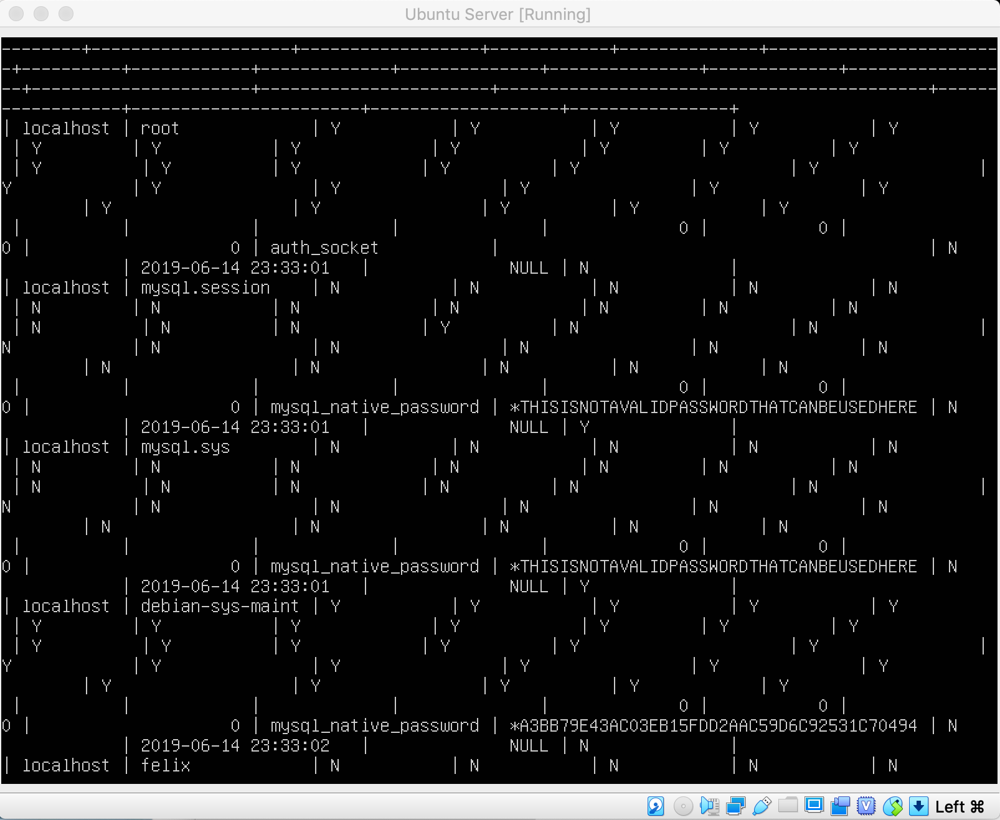

  But I was able to see the individual columns:

   ```mysql
  SELECT users FROM users;
  ```
  
  ## How do you scroll up/down on the Linux console?
  **VM Ubuntu on a Mac:** fn + shift + up/down arrows


- ## Thoughts and Feelings
  Warning, I am sleep deprived which affects my mindset, so the following may be more negative than usually.

  I still wasn't able to get a lot of sleep last night. I'm having a difficult time putting my foot down about my sleep schedule and my priorities.

  I always assume most people want to support your goals but I'm finding that a lot of people don't care. There are a few people who are really supportive of my goal to code everyday, but in practice most people, even if they think they support you, try to derail you by encouraging you to take day off. Usually for their benefit.
  
  On the flip side, I have never been encouraged to try harder or NOT skip a day of coding(or my diet, sleep schedule, or workouts). 

  If I am doing something on my own accord, that is usually not enough for people. So I have two options. I either have to be more forceful about my priorities. Or I can hack the situation. I can put *something else* on the line. 
  
  I can **"have to"** get up at 6am to code because I am meeting with someone. Or I can **"have to"** code two hours a day, because if I don't I will have to pay $100 to my minder. If someone else is involved, then other people may respect my routine more. People have a hard time respecting pure discipline driven by goals and no outside forces.
  
  

## Day 66, R2
### 6/15/19

  I am really not feeling so hot. I'm so tired. I don't think I'm sleep deprived, it's just that my sleep schedule shifted. And I've had too much coffee these past few days. So excuse the quality of my last two posts. I'm in LA, where I have lots of friends and family. I'm having trouble keeping a good schedule with the influx of hanging out time. Pray for me.

  Being in LA is a unique situation. I'm going to have to be more disciplined when I get home and have rules about how often I can go out for my own health and sanity. For some people it's fine to go out a lot and stay up late. But either I'm sensitive, or maybe other people just don't want to put in the effort to function at 100%. Maybe most people are ok functioning at 75% or with the aid of coffee, alcohol, meds, etc. I need to put some rules in place to prevent this.

- ## Server
  Yesterday, I was wondering if the root login was different than "dash" but I think "dash" IS my root login.

   ## MySQL User
   Yesterday, when I installed mysql, it didn't ask me to add a root user.

  In the video, [Installing and Configuring MySQL](https://www.lynda.com/Linux-tutorials/Installing-configuring-MySQL/718668/779185-4.html?autoplay=true), after installing mysql_server, the instructor runs:
  ```bash
  sudo mysql_secure_installation
  ```
   to set  root user password. The instructor disallows root login remotely, but does that apply to using ssh? 

   I wonder if I can run `sudo mysql_secure_installation` again to change the settings later?

   ## More On Uncomplicated Firewall

  >Right now we can access this database server locally. So a web application or something like that running on this machine would be able to use the database. But we can access it remotely. If we did need to access it remotely we'd need to add a rule to the firewall to allow access through tcp port 3309.
  
  -*[Installing and Configuring MySQL](https://www.lynda.com/Linux-tutorials/Installing-configuring-MySQL/718668/779185-4.html?autoplay=true)*

  ```bash
  sudo ufw allow 3309/tcp
  ```

  This further explains what ufw is doing. So does ufw override "Disallow root login remotely"? 

  Even though I selected "Disallow root login remotely" I was still able to get into mysql from test_machine with an ssh connection to ubuntu_server.
  
   

   Maybe this is because I already ran that ufw command yesterday. I also didn't have to run `systemctl mysql start` to login to mysql. I exited and ran `systemctl mysql start` again anyways just to make sure I don't run into any bumps down the road. I'm not totally sure what this command does. Does it start mysql? Can I stop mysql? Is there a way to see what state (start or stopped) mysql is in?

   ## Grep
   I played around with `grep` to try to find the mysql configuration file but it wasn't working how I expected. I was able to use `find` but in a limited way.

- ## Thoughts and Feelings
    Sleep deprived right now. I'm in LA and we know so many people here so we've been hanging out late. I don't have enough sleep. Maybe I do but my sleep schedule is messed up and I've been drinking coffee which makes you feel more tired. So I am feeling messed up. Angry. Irritable. Pissed. Hard time focusing. I really don't like this.
   

## Day 65, R2
### 6/14/19

- ## Server
  When I tried to connect to my ubuntu server from the host, it didn't do anything. I think it's because the Ubuntu server is on a NATnetwork. Which means I can't connect to it from the host. But I can connect to it from another vm: [Unable to ssh into Ubuntu VM running w/ a NAT ip address even w/ openssh-server installed](https://askubuntu.com/questions/224391/unable-to-ssh-into-ubuntu-vm-running-w-a-nat-ip-address-even-w-openssh-server)

  I could just change the network to bridged, but then I'd have to find more tutorials on that. And I might run into more problems with the tutorial down the road. I just want to get through this tutorial so I can get to the Node book. 

  ## Matching Environments
  
  There's a lot I'm doing that's unnecessary. I'm doing it for the sake of following the tutorials. It's easier to get through the tutorial when my environment matches the instructors.
  
  I don't even need this Ubuntu Server to set up a node server. But the Node book only shows how to do it through an ubuntu server. So, in order to get through the tutorial I'm setting everything up so I can follow the steps exactly. Once I do that, I'll have more experience and understanding. Then I can try it on localhost or whatever I want. 
  
  When my environment didn't match the instructor's, I ran into all these side issues: Does this step apply to me? This step doesn't work in my environment. etc. Which is doubly difficult when the subject is new and you don't understand what you're doing yet.

  So I just need to match the environment so I can get through the tutorial and learn.

  ## Installing Second VM
  I created another virtual machine, called **"test_machine"** to ssh into the first vm, **"ubuntu_server"**, like the instructor does. But I didn't know exactly what to do for the network configurations. 

  This is what the instructor did for **his ubuntu server.**

  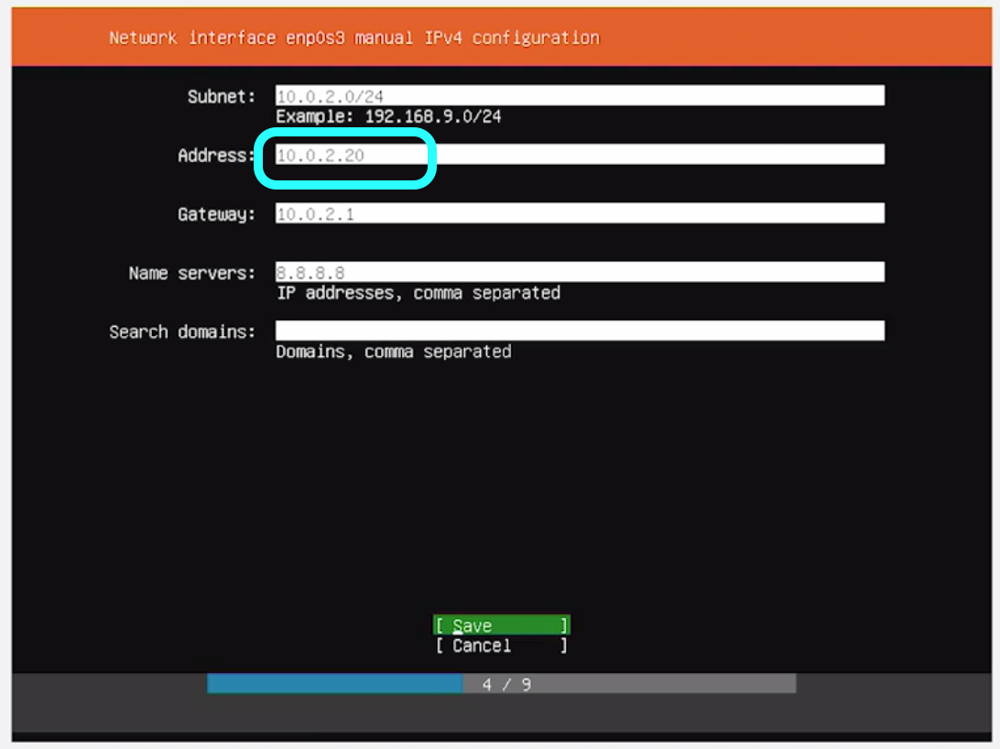

  I did the same thing, but what do I do for **my second ubuntu** server? I guessed that only the address had to be different. I'm not sure if I did it right.

  

  I was able to ssh into the **"ubuntu server"**, but the server 

  ## Uncomplicated Firewall
  What is uncomplicated firewall?
  > Assuming mysql installation was successful, you can now use the ufw utility program (Which stands for Uncomplicated Firewall.)

  -*from [Node Server Setup](https://www.patreon.com/posts/node-api-source-27588087)*

  >You can use ufw allow and ufw disallow commands to allow incoming and outgoing trac from a program.

  -*from [Node Server Setup](https://www.patreon.com/posts/node-api-source-27588087)*


  ## No Root User, No Mysql Password
  When I set up the ubuntu server, I set up a login with my name, "dash". But in the Node book, Greg uses the root login. I'm wondering if that's fundamentally different.

  When I installed mysql server on ubuntu_server it didn't ask to set a up a username and password, so `mysql -u root -p` doesn't work. Setting up user on the ubuntu server was not in the Node tutorial. So I'm confused. 

  I guess I need to add it?

  Do I want mysql on the server(ubuntu_server) or on the computer ssh'ing into the server(test_machine)?

## Day 64, R2
### 6/13/19

- ## Spark AR
  I started looking at Spark AR, which is the tool you use to make instagram filters. Coding is involved somewhere, but not in the begginer tutorials, so I'm going to go back to this for outside of my coding time.

  [Tutorial: Quick Start Guide to Spark AR Studio](https://sparkar.facebook.com/ar-studio/learn/documentation/tutorials/quick-start-guide)

- ## Backend
  Back to backend. Last time I left off watching a tutorial on VirtualBox so I can run a virtual server. Greg([@js_tut](https://twitter.com/js_tut)) updated his Node Book yesterday, so I'm going to check out the changes to it today. [Here](https://www.patreon.com/posts/node-api-source-27588087) is the updated version.

  ## Ubuntu Server

  Ubuntu server is a Linux distribution that's intended to be run **headless**. Headless means without a display attached.

  I was watching [Learning Ubuntu Server](https://www.lynda.com/Linux-tutorials/Learning-Ubuntu-Server/718668-2.html). I really want to just get this server up! But it suggested watching all these other prerequisites without suggesting any specific course. I'm having trouble figuring out where to learn all this stuff about networks, ports, blah blah blah. 

  I started to watch this but it was hard to understand:[Network Address Translation(Nat)](https://www.lynda.com/Cisco-Switches-tutorials/Network-Address-Translation-NAT/445426/475831-4.html)

  This video really helped me understand the different networks: NAT, NATNetwork, Bridged, Host-only, and internal: [Networking with VitrualBox](https://www.lynda.com/Linux-tutorials/Networking-VirtualBox/597026/678866-4.html?srchtrk=index%3a1%0alinktypeid%3a2%0aq%3alearning+virtual+box%0apage%3a1%0as%3arelevance%0asa%3atrue%0aproducttypeid%3a2)

  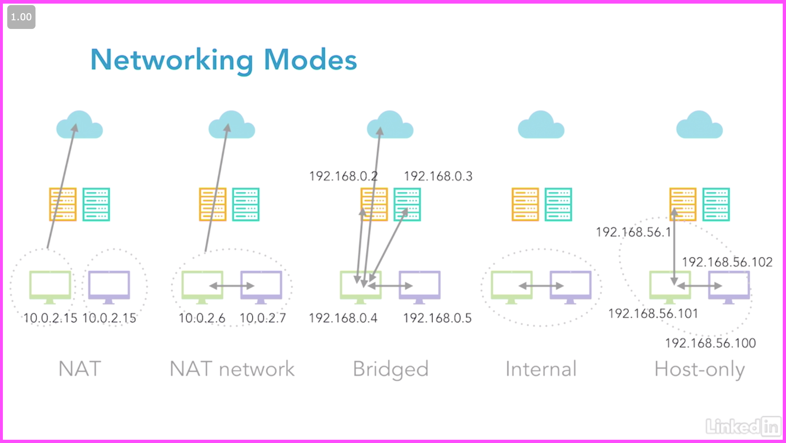

  I set up my ubuntu server on virtual box following [this video](https://www.lynda.com/Linux-tutorials/Installing-Ubuntu-Server/718668/779168-4.html). I powered off my machine for the day. I'm not sure what that does, but I hope I can get back to it tomorrow without issue.

## Day 63, R2
### 6/12/19

- ## Backend
  Continuing my journey into understanding backend.
  
  ## IP Addresses

  Brian Morrison II
[@bmorrisondev](https://twitter.com/bmorrisondev) answered my questions about IP addresses.

  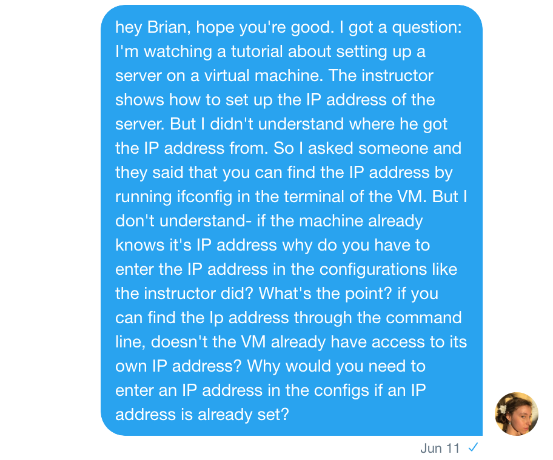
  <br>
  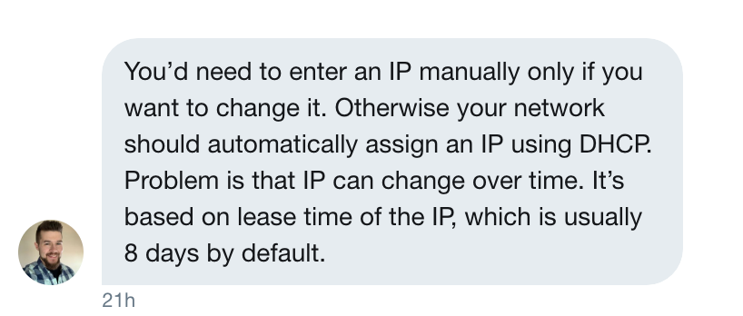

  ## Continued [The World Wide Web: Crash Course Computer Science #29](https://www.youtube.com/watch?v=AEaKrq3SpW8):
  Some Terms: 
  - URL (uniform resource locator)
  - DNS Server (Domain name search)
  - Web Server

  ### Paraphrased from [The World Wide Web: Crash Course Computer Science #29](https://www.youtube.com/watch?v=AEaKrq3SpW8):

  When you request a site, the first thing your computer does is a DNS lookup. The DNS server takes the domain name and returns the IP address of the respective computer(the web server). Then your computer opens a TCP connection to a computer that's running a special piece of software called a web server. The standard port number for web servers is port 80. The computer is now connected to the web server at the correct address, but the next step is to ask that web server for a hypertext page. To do this it uses Hypertext Transfer Protocol (HTTP).

  The first browser was released to the public in 1991. So the World Wide Web is as old as me!

  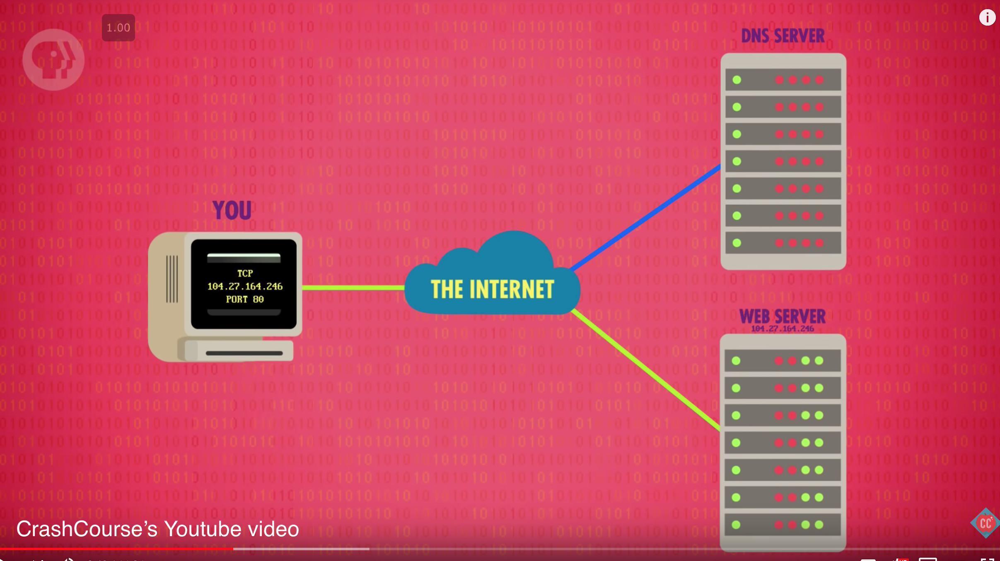

  
  ## CrashCourse Computer Science Playlist
  I didn't watch all of these but here is the whole [CrashCourse computer science playlist](https://www.youtube.com/playlist?list=PL8dPuuaLjXtNlUrzyH5r6jN9ulIgZBpdo).

  ## Network Adapter
  I'm trying to understand more about network configurations and I came accross this term.

  >A network adapter is the component of a computer’s internal hardware that is used for communicating over a network with another computer. It enable a computer to connect with another computer, server or any networking device over an LAN connection. A network adapter can be used over a wired or wireless network.
  
  -*from [What is a Network Adapter](https://www.techopedia.com/definition/8546/network-adapter)*

  ## Networking For Web Developers
  I found this udacity course I might want to go back to so I'm saving it here:
  [Networking For Web Developers](https://classroom.udacity.com/courses/ud256/0)

  ## [Learning VirtualBox](https://www.lynda.com/Linux-tutorials/Learning-VirtualBox/597026-2.html)
  I've been surfing the web trying to find more information about host-only networks, NATs, bridged networks, and other networking concepts.
  
  I decided it's enough theory for now, and I need to just start doing. So I'm going to set up virtual box with the course, [Learning VirtualBox](https://www.lynda.com/Linux-tutorials/Learning-VirtualBox/597026-2.html). Then I can set up a server and continue the Node Server Setup book.

  ## Virtualization
  A hypervisor provides a protected space for a guest OS. Hypervisor provides some of the host's resources to the guests: cpu resources, memory, storage, and communications.

  ## CPU
  The tutorial said I should understand what CPU is. I started watching [The Central Processing Unit (CPU): Crash Course Computer Science #7](https://www.youtube.com/watch?v=FZGugFqdr60) but it seemed like to needed to have watched the pervious videos in the CrashCourse playlist to understand it. So I read [Explain CPU Threads Like I'm Five](https://dev.to/venkateshbella7/explain-x-like-im-five-2d20). So it seems like CPU directs processes? I read [What Is A CPU](https://www.digitaltrends.com/computing/what-is-a-cpu/).

## Day 62, R2
### 6/11/19

- ## Server Etc.
  Continuing my journey into understanding backend.

  ## IP Address
  Yesterday I was confused how the instructor got the IP address that he used for his server. I asked a peer on twitter, Jacob M-G Evans([@JacobMGEvans](https://twitter.com/JacobMGEvans)),  for help. Jacob said you can get the IP address by running `ifconfig` in the terminal if  you're on a mac.

  > If the virtual machine is local, then yes. But if your trying to get the IP of the VM it would be the same, might even be able to configure the VMs IP yourself
  >
  > No matter what the ifconfig command will give the IP, depending on what IP you need and what it is for.
  
  -*Jacob M-G Evans [@JacobMGEvans](https://twitter.com/JacobMGEvans)*
  
  But if the server already knows the IP address in the terminal, why do you have to put it in the configurations? What's the point? Doesn't the virtual machine have access to this, if you can access this through the command line? Why did the instructor put it in his configurations?

  > Whether you are using host-only, network address translation (NAT), or bridged networking, each virtual machine must be assigned an IP address. For host-only networking, the host must also be assigned an IP address.

  -*from [Assigning an IP Address to a Virtual Machine](https://stuff.mit.edu/afs/sipb/project/vmdialup/archive/i386_linux24.old/lib/vmware-console/help/gsx/networking_assignip.htm)*

  ## Networking

  I decided I need to understand networks and IP addresses more, so I started watching [Networking Foundations: Networking Basics](https://www.lynda.com/Windows-Server-tutorials/Foundations-Networking-Networking-Basics/408231-2.html)

  **Notes:**

  ## Logical and Physical Topologies

  **Physical topology:** Referes to the physical layout of the wires in a network.

  **Logical topology:** Refers to how the data moves through the networks

  Networks can have a different physical topology than logical topology.

  **This tutorial isn't so good, so I'm going to move on.**

  ## IP Addresses
  > An IP address is split up into a network code and a host id.
  
  -*from [IP Addressing and How it Works](https://www.youtube.com/watch?v=KFooN7Mu0IM)*

  
  
  ## Computer Networks
  Watched this youtube video: [Computer Networks: Crash Course Computer Science #28](https://www.youtube.com/watch?v=3QhU9jd03a0)
  
  Clarified that networks are actually connected by ethernet cables or wifi. Not all networks are internet. A computer connected to a printer can be a network.
  
  ### Local Area Networks 
  Relatively small networks of close by computers. LANs can be as small as two machines or as big as a university campus with thousands of computers.

  ### The Internet
  The internet is the biggest computer network. It interconnects a bunch of smaller networks allowing communication.

  ## The Internet
  Watched the next youtube video: [The Internet: Crash Course Computer Science #29](https://www.youtube.com/watch?v=AEaKrq3SpW8))
  
  Clarified that you LAN is the first part your computer goes through to get to the internet. It's every device in your house connected to your wifi router.

  The router connects to a Wide Area Network (WAN), which is a router run by your ISP.

  There will be a regional router like one for your neighborhood. That one connects to an even bigger WAN, like one for your whole city.

  You can see the route that data takes to different places on the internet by running `traceroute somesite.com` in the command line.

  ### Internet Protocal
  Internet packets have to conform to a protocol called the Internet Protocol.

  ### UDP
  IP gets the packet to the right computer but UDP gets the packet to the right program running on that computer.

  ## TCP
  Like UDP, but for when you need all the information,for example in an email instead of streaming video. In TCP packets are given sequential numbers. The receiver has to send back an acknowledgement(ack) to the sending computer, and then the sender can send the next packet. It can send many packets at once and have many outstanding acks.

  ## The World Wide Web
  Watched the next youtube video: [The World Wide Web: Crash Course Computer Science #29](https://www.youtube.com/watch?v=AEaKrq3SpW8)

  The World Wide Web is not the same as the internet. It runs on top of the internet. The www is a huge distributed application running on millions of servers world wide. You access it using a web browser. Pages are the fundamental building blocks of the www . Hyperlinks connect different pages.


## Day 61, R2
### 6/10/19


- ## Notes On "Networking Foundations: Servers" Course
  Continuing my notes on: [Networking Foundations: Servers](https://www.lynda.com/Windows-Server-tutorials/Foundations-Servers/503999-2.html)
  


  ## Virtualization
  Before virtualization, you could only use a server for one thing. This would waste a lot of the servers capabilities.

  A virtual machine is a set of files on a hard drive that emulate an actual computer.

  The actually machine that the virtual machine is on is known as the host.

  A host must have certain specifications and the hardware to support virtualization.
  
  A virtual machine can be set up to network with the internet or just with the other virtual machines. Can it have even more network setups?

  ## Storage Devices and Technologies

  - Disk Specifications
    - RPM (faster it spins the faster you can access data)
    - Dimensions
    - Capacity
    - IOPS (input/output per second)
    - Seek time and latency (speed of actuator arm)
    - Hot Swappable
  
  - Disk Interfaces
    
    How you connect the harddrives to the server

    - Serial Attached SCSI (SAS)
    - Serial ATA (SATA)
    - SCSI
    - USB
    - Fibre Channel (common for shared storage)

  - Other Storage Technologies
    - Direct-attached Storage (DAS)
    - Network-attacked storage (NAS, storage device accessable of TCP/IP network)
    - Stoarage area network (SAN, like NAS but outside of LAN, connected by highspeed private network)
    - Just a bunch of disks (JBOD, not organized & no fault tolerance)

  - Other things not so popular
    - Tape
    - Optical
    - CompactFlash

  ## Fault Tolerance and Capacity Planning

  Things to consider when planning a storage solution:

  - Space
  - Performance
  - Fault tolerance

  Fault Tolerance: A way to ensure that in the event of a hardware failure with one of your hard drives, you not only don't lose the data, but you, in some cases, may not even lose access to the data while the failure's taking place.

  ## RAID
  RAID: redundant array of independent disks.

  - RAID 0
    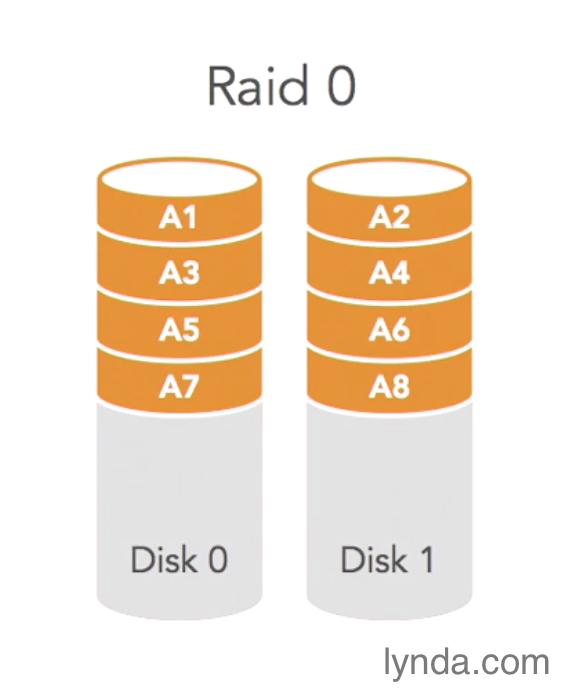
    - Disk striping
    - No fault tolerance
    - Min 2 disks
    - Increased read performance because no fault tolerance
    - 100% drive space utilization

  - RAID 1
    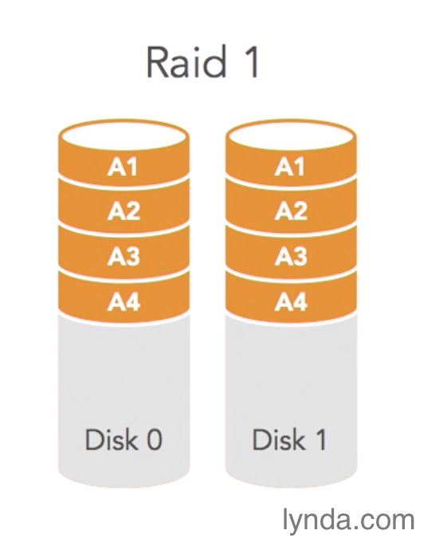
    - Disk Mirroring
    - Exactly 2 disks
    - Increased space utilization
    - 50% drive space utilization
    - Provides fault tolerance

  - RAID 5
    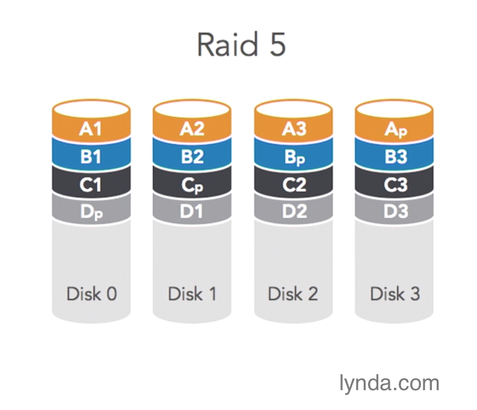
    - Disk striping with parity
    - Min 3 disks
    - Increased read performance but decreased write performance by a little
    - Efficient disk space utilization
    - Provides fault tolerance

  There are also hybrids of these.

  ## Capacity Planning Considerations

  - OS Growth
    - Patches
    - Service packs
    - Log files
    - Temp files
  - Data Growth
    - Customer Data
    - Archived Data 
    - Recovery growth
  
  - Mitigation Strategies
    - Disk quotas (limiting how much space a user is allowed)
    - Compression (take data and compress it, but performance decreases so should be with older not regularly accessed data)
    - Regular cleanup 
    - Routine archival (when you can't delete but you can move it and store it somewhere else)
  
  ## Physical Security

  **Multifactor Authentication:** When you have to use more than of the following
    - What you know (password)
    - What you have (smartcard)
    - Who you are (finger print)

  **Mantrap:**

  

  ## Server Hardening

  - OS Hardening
    - Stop and/or uninstall unneeded services
    - Close unneeded ports
    - Minimize software installations
    - Keep security patches up to date
  - Application Hardening
    - Disable/uninstall unneeded...
      - services
      - roles
      - features
    - Install latest version, updates, and patches

  - Hardware Hardening
    - Disable unneeded hardware and physical ports/devices
    - BIOS password
    - Disable Wake-on-LAN if it's not a feature you're using
    - Set appropriate boot order
    - Chassis locks

  - Endpoint Security
    - Intrusion detection system (IDS)
      - Host-based
      - Network based
    - Anti-malware software
    - Vulnerability scans


  If it's not needed get it out. You want the fewest number of vulnerability points possible.

  ## Access Control

  You can set what permissions different users are allowed.

  ## Environment Control & Storage Disposal.

  - UPS (uninterrupted power supply)
    - Automated graceful shutdown
  - Power Distribution Unit

  - Safety Issues
    - Electrostatic Discharge procedures
    - Fire Suppression
    - Rack Stability
    - Floor load limitations
    - Sharp edges and pinch points
  - HVAC Issues
    - Temperature
    - Humidity
    - Air flow
    - Hot aisle/cold aisle
  - Secure Disposal
    - Soft wipe
    - Hard wipe
    - Remote wipe
    - Physical destruction (dispose pieces in different places)

  ## Basic IP Configuration
  The instructor showed where he configured the IP address on his server but he didn't explain how he got that IP address. I did a bit of googling but the results were not so great. My question is probably so off base that my results aren't going to help. So I messaged my question to someone on twitter instead.
  


## Day 60, R2
### 6/9/19

- ## Servers
  I continued learning about servers.

  ## Notes On "Networking Foundations: Servers" Course
  Continuing my notes on: [Networking Foundations: Servers](https://www.lynda.com/Windows-Server-tutorials/Foundations-Servers/503999-2.html)

  ## Installation
  The instructor installed a **server operating system** on a virtual machine. So this shows us another example that, whether a computer is a server or a pc depends on the software.

  ## Basic Configuration

  After you install a server operating system, you then have to do some basic configurations. [Video Here](https://www.lynda.com/Windows-Server-tutorials/Basic-configuration/503999/539126-4.html?autoplay=true)

  The instructor set the IP address of the VM but I didn't understand where he got the number from. But he said it was important to set this IP address up correctly to connect to the domain.

  You need to do these configurations before you give a specific "role" to your server. I don't know what "role" means yet.

  ## Server Roles
  There are different services a server can provide.

  There are a bunch of different roles:
  
  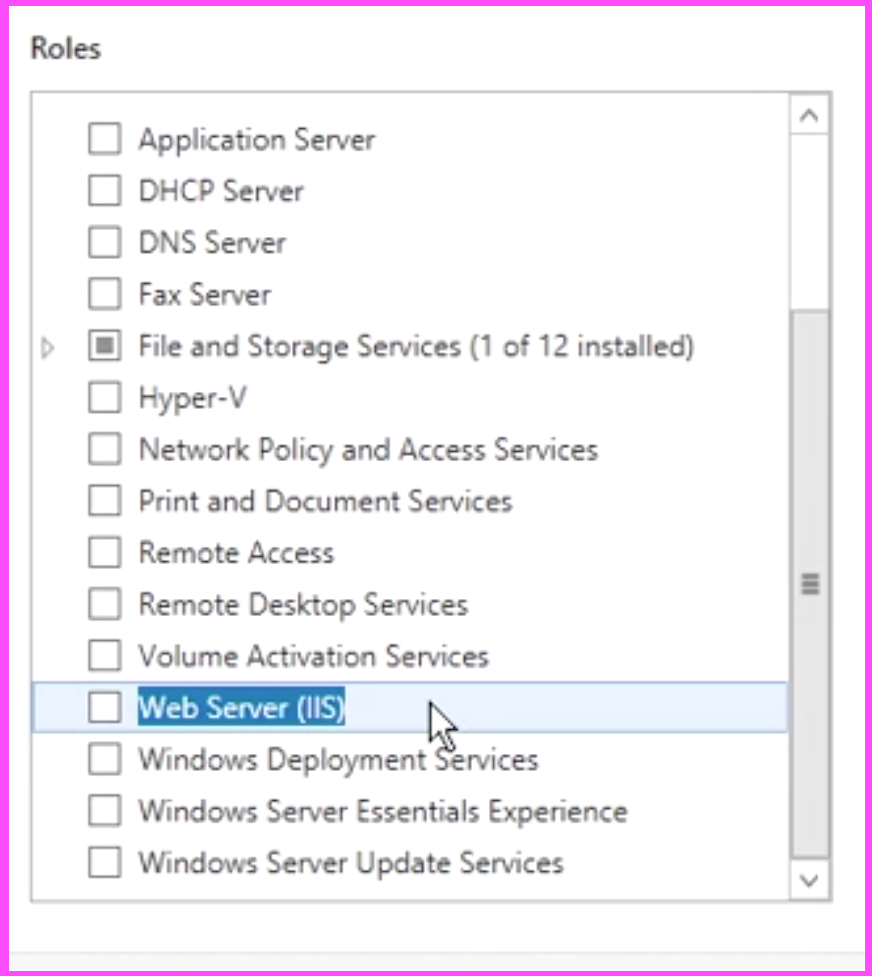

  I didn't realize that a server can do so many different things. Am I trying to make a web server?

  After the instructor sets up his server as a DNS, he says "it will go ahead and install the role and pretty much make me become a DNS name server in my environment." What exactly does "in my environment" mean? How is that set up? How far does the environment reach? Is it just his computer? A network of computers? All the computers connected to the web?

  Your server can have more than one role.
  
  "And so that's something that you need to evaluate in your environment, and understand what servers are providing what roles out on your network." Two words that I don't fully grasp: **environment** and **network**.

  Clarification: 
  > Numerous applications run in a client/server environment, this means that client computers (computers forming part of the network) contact a server, generally a very powerful computer in terms of input/output

  -*from [Client/Server Environment](https://ccm.net/contents/152-client-server-environment)*

  ## Access Methods For Server Administration

  To save space, most servers don't have the peripherals we have on personal computers. So we need to know how to access the servers. 

  - Local Hardware Administration
    - KVM switch box (key board, video, mouse)
    - Serial cable (old method)
    - Virtual administration console (if you're trying to manage virtual servers)

  What exactly is a "virtual server"? Is that a server on a virtual machine?

  >On the Internet, a virtual server is a server (computer and various server programs) at someone else's location that is shared by multiple Web site owners so that each owner can use and administer it as though they had complete control of the server.

  -*from [DEFINITION
virtual server](https://searchnetworking.techtarget.com/definition/virtual-server)*

  So a virtual server is what GoDaddy said I could upgrade to a [few days ago](https://github.com/DashBarkHuss/100-days-of-code/blob/master/r2-log.md#vps-vs-dedicated-vs-shared-hosting).

  - Network-Based Hardware Administration
    - KVM over IP (via TCP/IP, connect to a KVM switch box)
    - iLO
    - iDRAC


  I don't know why the instructor called this last section "inventory." It's just ways to access servers remotely:
  - Inventory
    - Remote Desktop Protocol(RCP)
    - Secure Shell (SSH), doesn't show you actual desktop
    - Virtual Network Computing(VNC)
    - Command Line

   

   ## Maintenance

   You can see if your server is running properly in a few ways.

   Within the operating system, you can use certain tools to help see if the system is running properly.

   In a Windows Server 2012 R2 OS, you have the Server Manager, which opens by default when you log in. On the button of the screen,you can see different server roles. If everything is green it's all good.

   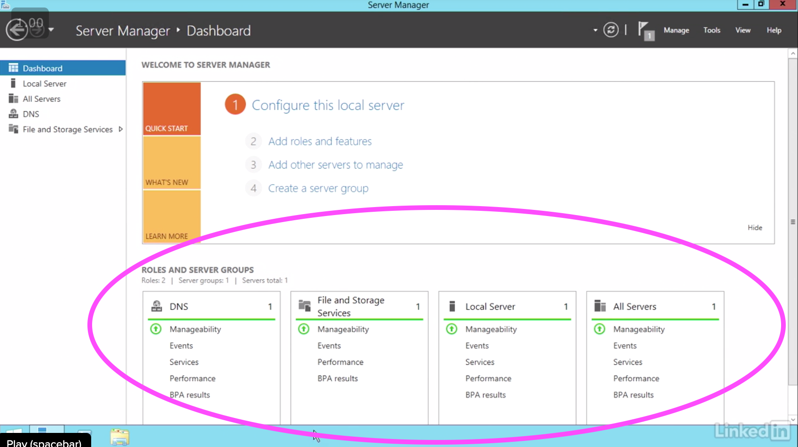

   Another tool that Microsoft gives you is the Task Manager. It shows the different application that are running. (like activity monitor?) You can end processes. You can look at memory, CPU, and network.
  
  You also have the Event Viewer on Microsoft. Here you can see logs of activity. You can filter the logs to see warnings and errors. It's good to check this regularly to catch problems before they affect users. What is the Event Log on Mac? 
  
  You can also find logs in another place. Logs associated with just specific server roles can be found in the managers for those servers.

  Other tools on Microsoft:
  - Resource Monitor
    - processor performance
    - disk performance
    - network performance
    - memory performance
  - Performance Monitor
    
    Can show us if we have a performance issure, then we need to determine if it's the  sorftware or hardware

  There are also third party tools.
 
  ## Asset Management And Documentation
  - Licensing
    
    When you purchase software, you purchase the right to use it. A vendor can audit you and make you show them the license.
  - Labeling
    
    Label your servers and workstations, I'm not totally sure what this means. Physically labeling them with a labeler? What?
  - Warranty
    
    Keep track of warranties on hardware, and where to claim warranties.

  - Lifecycle Management
    
    Aquiring hardware, using it, and getting rid of it.

    - Procurement

      What are the procedures we go through when we procure hardware?

    - Usage

      How will that asset be used and by who? If it's software, what kind of licenses are needed?

    - End Of Life

      When are we done with this asset?
    
    - Disposal
  
      How will we dispose the hardware? Security issues.
    
  - Inventory 
    - Make
    - Model
    - Serial number
    - Asset tag
  
  - Documentation
    - Maintain service manuals
    - Diagrams of network, architecture, data flow
    - Recovery Processes
    - Change management plans
    - Service level agreements

  What are change management plans and service level agreements?
     

## Day 59, R2
### 6/8/19


- ## Servers
  Today, I looked more into servers.

  ## Server Is Software?
  Yesterday, I found conflicting information about whether a server is the software or the hardware. In response, Marco ([@Wridgeu](https://twitter.com/Wridgeu)) said that it's software:

  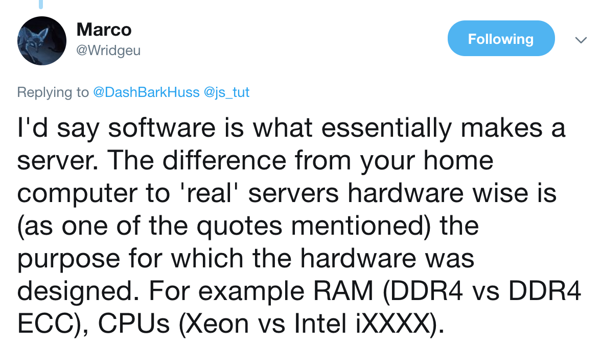
  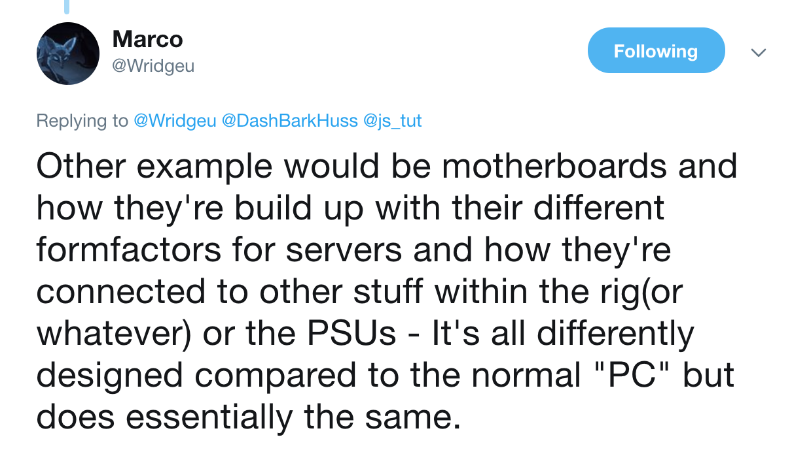

  ## Ubuntu Server or Regular?
  Yesterday, I wasn't sure if I should use the **server version** of Ubuntu, or the **regular version** of Ubuntu.

  I talked to Greg. He said it's all set up for you by your hosting service, so he wasn't sure. But probably the server version. So that's what I'll put on my virtual machine. 


  ## SSH Into A Virtual Machine?
  I was wondering if it's possible to SSH into a virtual machine and found this:
  [Trying to SSH to local VM Ubuntu with Putty](https://unix.stackexchange.com/questions/145997/trying-to-ssh-to-local-vm-ubuntu-with-putty)

  There were a lot of terms that I was not familiar with:
  - private network
  - host network
  - NAT(Natural Address Translation)
  - port forwarding
  - network preferences
  - port
  - daemon

  But when I look for pages about how to learn backend development, none of them mention learning this stuff. So I'm not sure what all this stuff is considered. 

  So I searched all these terms at once in google and lynda. It looks like this all has to do with "networking" which I know very little about.

  I found this tutorial on some exam called [CompTIA Server +](https://www.lynda.com/IT-Infrastructure-tutorials/Cert-Prep-CompTIA-Server-Exam-SK0-004-Basics/772338-2.html).

  I watched it a little, which clued me that I might be trying to understand [server administration](https://www.lynda.com/IT-Infrastructure-tutorials/Cert-Prep-CompTIA-Server-Exam-SK0-004-Basics/772338-2.html).

  I'm not trying to understand these in detail, I just want to understand the basics.

  ## Notes On "Networking Foundations: Servers" Course
  I found a course on lynda that covers the above concepts: [Networking Foundations: Servers](https://www.lynda.com/Windows-Server-tutorials/Foundations-Servers/503999-2.html)
  
  The rest of my log is notes on what I learned.


  ## Form factor 
  
  "In computing, the form factor is the specification of a motherboard – the dimensions, power supply type, location of mounting holes, number of ports on the back panel, etc" -[Computer Form Factor, wikipedia](https://en.wikipedia.org/wiki/Computer_form_factor).

  Basically the hardware. Towers are form factors that can be used as servers or client side computer. We've probably all seen them with desktop computer setups. So this shows, that the hardware doesn't necessarily make something a server, since towers can be used as PC's or servers.
  
  Other form factors: server blades, rack mount server.

  ## Server Components

  Aka computer components, since a server is just a computer. However, computer components in a server are made to be more robust than a PC.

  - Motherboard
    - Main circuit board
    - Provides communication for all the components
  - CPU (Processor)
    - Located on the motherboard
    - Have different socket types, needs to match motherboard
    - Have different speeds
    - Cache (high speed memory)
    - Architecture: x86, x64, ARM(not in servers)
  - RAM(random access memory)
    - temporary memory
    - ECC vs non-ECC
    - DDR2 & DDR3
    - Different pin configs, needs to match mother board
  - Expansion Slot
    - Gives ability to add components to the system (expansion cards)
  - Interface Ports
    - ports built into the motherboard or expansion cards
    - Where you connect your network, monitor, usb
    - input/output communication
  - Hard Drives
    - Magnetic drives vs Solid state drives

  Many components can be changed without having to shut down the server (hot swappable)

  ## Power & Cooling

  Power Factors:
  - Voltage: Measurement of force of electricity
  - Amperage: Amount of movement of electricity (current)
  - Wattage: Actual measurement of electrical usage (volts x amps)

  #### Factors For Determining How Much Power We Need
  - Consumption: How much power the servers are going to consume.
  - Redundancy: More power than what's needed so our servers can be dependable.
  
  Cooling Factors:
  - Airflow: In the server room & inside the server itself.
  - Thermal dissipation: ex: sucking heat away from a component
  - Baffles and shrouds: deflectors to help with air flow
  - Fans: exhaust fans- blow the hot air away from components
  - Liquid Cooling

- ## Thoughts & Feelings
  I think it will be helpful to dive deeper into servers. But I also wonder if I'm getting distracted by stuff that doesn't matter. If you have any thoughts, I'm always open to critique on my learning path(on my respective twitter posts or linkedin posts for each log.)

## Day 58, R2
### 6/7/19


- ## Node
  Continuing with Greg's book, [Node.js – Server Setup](https://www.patreon.com/posts/node-js-book-26866624) and setting up my remote server.

  ## Vanilla Stack
  Yesterday, I ended the day wondering what stack we're using in the Node server book. I asked Greg([@js_tut](https://twitter.com/js_tut)):

  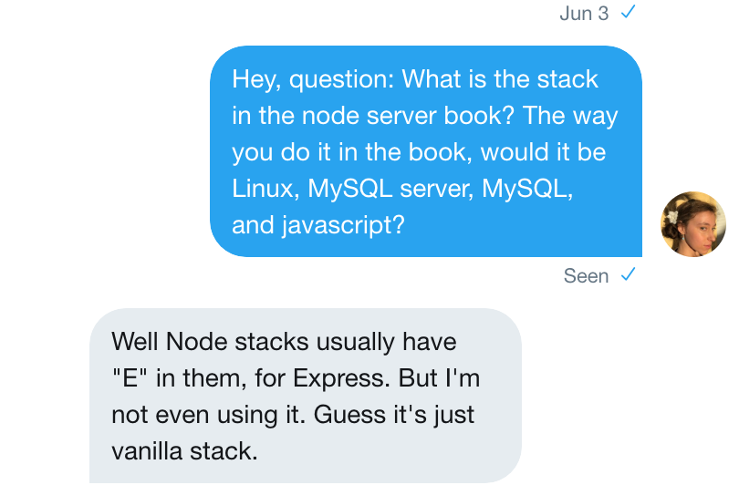
  
  ## Vanilla FTW
  I thought this was really cool. It's a *vanilla* server! I really dislike working with a billion unnecessary frameworks. Frameworks/modules/libraries have a place in coding, but when you are learning they can be a huge mess.

  Let's say you run into a problem and you're using a bunch of modules. It's going to be really hard to find problem. *Is the bug related to one of the modules? Is it your code? Is it some other technology you're using?* The more minimal your code, the easier it will be to pin point the issue.

  But so many tutorials teach tutti frutti programming (a term I made up, opposite of vanilla). This makes it so much harder to learn. It's rare to find vanilla tutorials, especially the more advanced the subject. I gravitate towards the vanilla tutorials, especially when learning a new subject.

  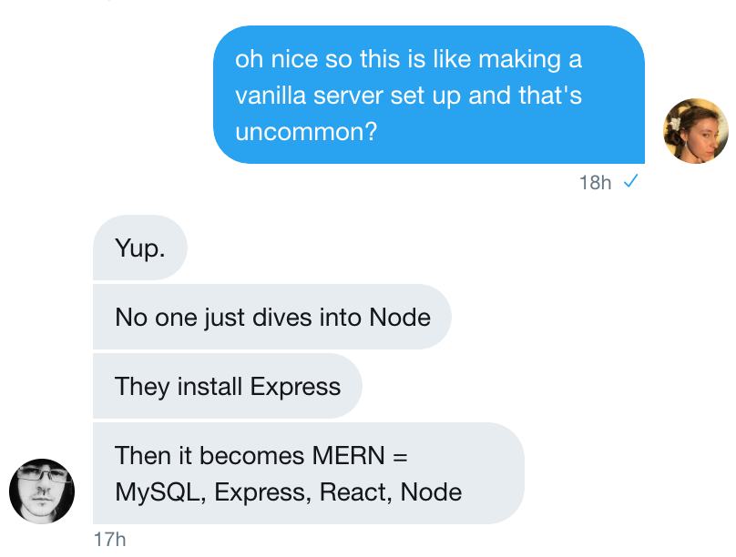

  ## Our Stack:

  Greg didn't directly answer what our stack was, but I think it's:

  - MySQL
  - MySQL Server
  - Node
  - Linux/Ubuntu

  ## Getting A Remote Ubuntu Server

  I still want to get an Ubuntu server, so I can follow the tutorial exactly. But my GoDaddy account is Cent OS unless I upgrade it. I probably eventually will upgrade it, but is there a way to get a free Ubuntu server?

  ## Virtual Machine

  I watched this video on virtual machines:
  [What is a Virtual Machine (VM)? In 3 minutes](https://www.youtube.com/watch?v=yIVXjl4SwVo)

  **Virtual Machine:** Virtual machines allow one or more 'guest' operating systems to run inside another

  So can I make an Ubuntu virtual machine that is just a server?

  ## Servers
  I watched this video on servers: [What Is A Computer Server?](https://www.youtube.com/watch?v=TQQA8RpKxqg)

  The tutorial pointed out:
  >You can *turn your computer into a server* by installing software on it that allows it to  be a server.

  So are we setting up a server on an Ubuntu OS? Or is Ubunto an OS just for servers? So it is a server itself?

  >Ubuntu is an open source software operating system that runs from the desktop, to the cloud, to all your internet connected things

  -*from [ubuntu.com](https://www.ubuntu.com/)*

  I read this 3-page tutorial on the difference between Linux and Ubunto. It helped me understand operating systems in general: [What's Ubuntu, and how is it different from Linux?](https://computer.howstuffworks.com/ubuntu.htm)

  ### What is Ubuntu?:
  >Ubuntu isn't just for personal computers. There's also a version of Ubuntu you can use if you want to turn a computer into a network server.

  -*from [What's Ubuntu, and how is it different from Linux?](https://computer.howstuffworks.com/ubuntu1.htm)*

  So are we using the *server version* of Ubuntu? Or the regular Ubuntu? Is this *a regular Ubunto OS* that we are *putting a server on*? Or are we directly ssh-ing into the server OS version of Ubuntu?

  > This section will walk you through the standard MySQL server configuration on a Ubuntu server, for no particular reason.
  
  -*from [Node.js – Server Setup](https://www.patreon.com/posts/node-js-book-26866624)*

  So we're putting MySQL server configuration on an Ubuntu server. I think this means we're using the server version of the Ubuntu OS. But maybe you can have the regular version of Ubuntu on a server. So maybe I'm wrong. 

  ## Server Hardware vs. Software

  I'm confused what makes something a server... is it the hardware? The software? Or both?

  If I can turn my computer into a server, as the youtube video said, then it can't be the hardware that makes a server a server. 

  But if you look at pictures of servers, they have different hardware than computers, most notable no screen or keyboard.

  

  I found this thread on Quora: [Does server mean hardware or software or both?](https://www.quora.com/Does-server-mean-hardware-or-software-or-both)

  It looks like it can mean both but usually means software.
  > While "server" can, in some circles as many have pointed out here, refer to a high-powered computer hardware system, I would venture to guess that most of the time when the term "server" is used by an IT or software engineering professional, it is usually referring to software.
  >
  >A "server" is merely a piece of software, usually with little or no user interface, that "serves" some kind of data or functionality up to "clients".

  -*from [Does server mean hardware or software or both?](https://www.quora.com/Does-server-mean-hardware-or-software-or-both)*
  

  But then I found this conflicting information on another site:
  >While almost any computer that meets the minimum hardware requirements can run a server operating system that alone does not make a desktop computer a true server. Even if the desktop computer had similar processor speeds, memory and storage capacity compared to a server, it still isn't a replacement for a real server. The technologies behind them are engineered for different purposes.

  -*from [Is Server different from a Desktop PC?](https://www.webopedia.com/DidYouKnow/Hardware_Software/difference_between_server_and_desktop.html)*
  
  It also mentioned:
  >a server manages all network resources

  ## What Are Network Resources?

  >Shared resources, also known as network resources, refer to computer data, information, or hardware devices that can be easily accessed from a remote computer through a local area network (LAN) or enterprise intranet. 

  -*from [Shared Resources](https://www.techopedia.com/definition/24796/shared-resources)*

  ## Summary
  So I'm finishing today with a bit of confusion that I slightly clarified:

  - In the node book, does Greg use:
    -  the ***server version of Ubuntu*** 
   
       or 
       
    -  the ***regular version of Ubuntu*** on a server, and then setup up the MySQL Server as the server inside of the Ubuntu OS (like a strange server sandwich)
  - Seems like nobody truly knows when something is a server and when it isn't.
  

## Day 57, R2
### 6/6/19

- ## Coding Coach Mentor
  I reached out to a guy on coding coach but he didn't have enough time to commit to what I wanted. But he agreed to answer questions I send him at his leisure. 

   Many mentors probably sign up looking for a low commitment mentorship, like the person I reached out to. **I think there is room to create an application, or a section of Coding Coach, that is more conducive to a low commitment mentorship.**
   
   When you are trying to choose a mentor it feels like dating. You are trying to pick “the one.” That’s time consuming and higher stakes for both the mentor and mentee. But if I had multiple mentors, I could be more casual about who I pick. Likewise, a mentor may be more open to who they are available to if they had many low commitment mentees. 
   
   ### So here’s my idea for a low-commitment mentor app:

    - Instead of scheduling meetings, the mentors turn on when they are available and on what mediums (phone, DM). These settings can be different for each of their mentees. 
      - **Example:** I’m a mentor and I’m going to work on my own project for 2 hours at my computer, but I’m ok with being interrupted. 
     
        So turn on my “Available” indicator. I set that I’m available by video chat & text. Only my approved 20 mentees can see this. 
        
        However, 3 of my mentees are really annoying! I have mentee “groupings”, so I set my *video availability* to just the 17 mentees. I set only *text availability* for the annoying group, today. Or I could only be available for 5 or my favorite mentees. 
        
        If I was a mentor I’d like this set up! It’s sort of like virtual co-working, but better because you can more easily control who has access to you.
   
    ## How To Build This?
    I wonder if I can contribute to coding coach and see if I can build this? Or should I just try to make it on my own? I still need to learn backend to do this. And I probably need a mentor!

- ## Node
  Continuing with Greg's book, [Node.js – Server Setup](https://www.patreon.com/posts/node-js-book-26866624) and setting up my remote server.

  ## Forcing Myself To Ask Questions

  I'm usually reticent about asking questions. I don't want to bother people. I try to figure out the answer before I ask, which is often the right choice. But I take this mentality to an extreme. 
  
  I'm going to push myself to ask more than I'm comfortable with. So as soon as I had a question, I forced myself to DM that question to not just one person but two people. Which feels like overkill, and even rude to me. But it is an experiment with getting comfortable with asking.

  ## Getting Help

  I reached out to Brian Morrison II ([@bmorrisondev](https://twitter.com/bmorrisondev)), who had said I could ask him some questions. 
  ### Question:
  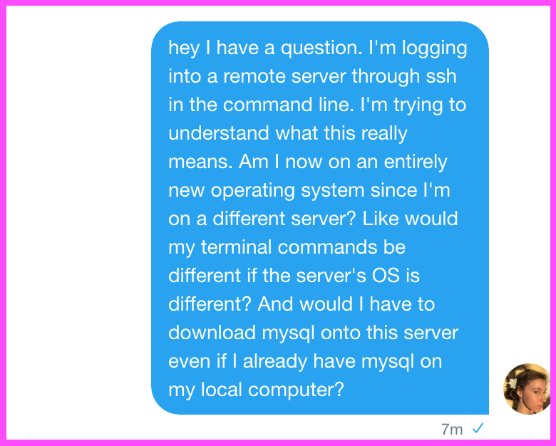

  ### Answer:
  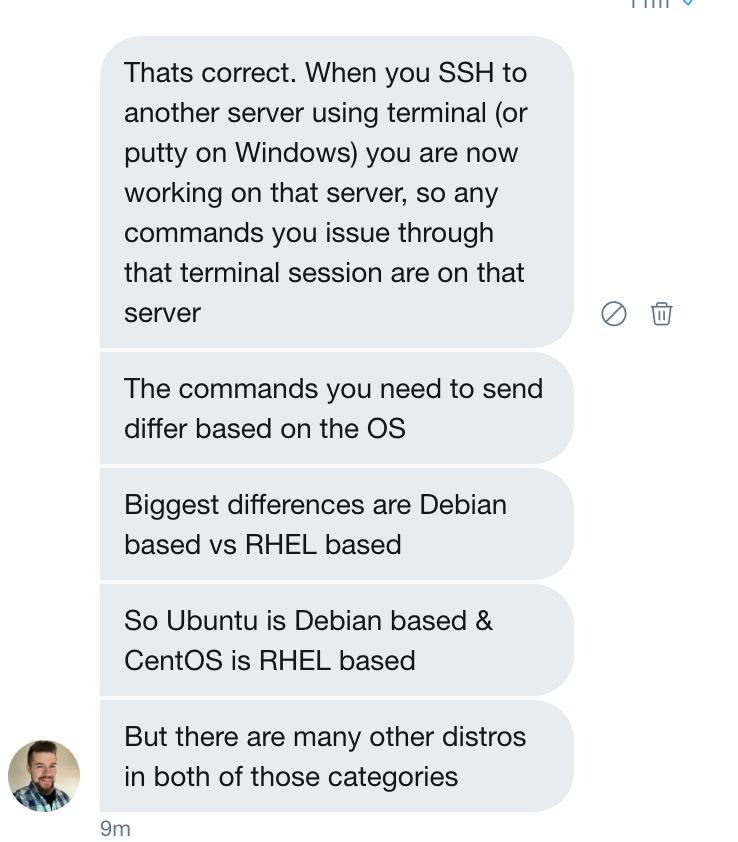

  ## What Distro Does My Go Daddy Account Use?

  I tried to find out what my distro was through the command line but none of these worked except the first one which only gives the OS, but not the distro: [How to check OS and version using a Linux command [duplicate]](https://unix.stackexchange.com/questions/88644/how-to-check-os-and-version-using-a-linux-command)

  ## Apache, Ubuntu, What???

  I contacted GoDaddy on chat and asked what distro of Linux my server uses. The agent on chat said "Apache." I figured out that they were wrong: Apache is not a distro, it's something for servers, I'm not quite sure.

  ## VPS vs Dedicated vs Shared Hosting
  I called GoDaddy later and got an agent who was more knowledgeable. He told me that the distro was Cent 0S. Since I have a shared hosting plan I can't changed that. But If I got a Virtual Private Server or a Dedicated Server I could change the OS. 

  He explained that a Dedicated Server is expensive, it's literally an entire server, sort of like owning your own computer. A Virtual Private Server is in between. I didn't ask more about it, but I imagine it's something like owning a partition of a server.

  Here's a post on the differences between [Shared vs VPS vs Dedicated vs Cloud Hosting](https://wp-rocket.me/blog/shared-vs-vps-vs-dedicated-vs-cloud-hosting/).

  ## What Exactly Is Apache?

  After the agent brought up Apache, I found out "The Apache HTTP Server Project is an effort to develop and maintain an **open-source HTTP server** for modern operating systems including UNIX and Windows," [-apache.org](https://httpd.apache.org). So it's a server.
  
  ## Apache vs. MySQL
  So Apache is a server, but then what is mysql? *"MySQL is an open-source relational database management system,"* [-Wikipedia](https://en.wikipedia.org/wiki/MySQL). Oh right, those are very different. But, in the tutorial we're using MySQL server. So is that in place of an Apache server? I think these things are all part of the "stack."

  >Many people are still working with PHP servers. I love Apache and PHP but hate to say that this setup is becoming obsolete. There are good reasons for this. Node servers are used by companies to run libraries like React, which speeds development of the UI components by a large %, but Node is better even for solo developers.

  -*from [Node.js – Server Setup](https://www.patreon.com/posts/node-js-book-26866624)*

  So, it looks like Apache uses PHP. And we're not using PHP, we're using Node.js. So we aren't using Apache.

  ## Stack

  "A **server stack** is the collection of software that forms the operational infrastructure on a given machine," 
  -*from [server stack](https://whatis.techtarget.com/definition/server-stack)*

  ### For example, the LAMP stack consists of:
  >- **Linux:** The operating system (OS) makes up our first layer. Linux sets the foundation for the stack model. All other layers run on top of this layer.
  >- **Apache:** The second layer consists of web server software, typically Apache Web Server. This layer resides on top of the Linux layer. Web servers are responsible for translating from web browsers to their correct website.
  >- **MySQL:** Our third layer is where databases live. MySQL stores details that can be queried by scripting to construct a website. MySQL usually sits on top of the Linux layer alongside Apache/layer 2. In high end configurations, MySQL can be off loaded to a separate host server.
  >- **PHP:** Sitting on top of them all is our fourth and final layer. The scripting layer consists of PHP and/or other similar web programming languages. Websites and Web Applications run within this layer.
  
  -*from [What is a LAMP stack?](https://www.liquidweb.com/kb/what-is-a-lamp-stack/)*

  I'm wondering what our stack in the Node Server Setup book is. I messaged Greg to ask him.

## Day 56, R2
### 6/5/19

- ## Node
  Continuing with Greg's book, [Node.js – Server Setup](https://www.patreon.com/posts/node-js-book-26866624) and setting up my remote server.

  ## Set Up SHH GoDaddy

  I followed how to [set up SHH here](https://www.godaddy.com/help/enable-ssh-16102).

  I got it to work, but instead of root I had to use my cpanel login:

  ```bash
  ssh cpanelUsername@xxx.xxx.xx.xx //replace with your cpanel username and ip address
  ```
  ## Remote Server Questions
  Now that I'm on my remove server, am I on an entirely different OS? What is it? Do I have to install MySQL-server all over again?
- ## Coding Coach
  Since backend is really new to me, I decided to get a mentor on [Coding Coach](https://codingcoach.io/). 

  I'm reading through the [Coding Coach Mentorship Guidelines](https://docs.google.com/document/d/1zKCxmIh0Sd4aWLiQncICOGm6uf38S0kJ0xb0qErNFVA/edit). It says to ***set mentorship expectations*** from the start:

  - What do you hope to achieve from the mentorship? 
  - How much time are you willing and able to commit?
  - Should the mentorship meetings be once a week, twice a week, once a month, or ad-hoc?
  - Is this mentorship open-ended or do you need just a few sessions?
  - What will your primary method of communication be?
  - How do you want to track your progress?

  It also talks about ***re-evaluating the mentorship***. I want to make it easy for mentor to end the mentorship if they no longer have time or for whatever reason. I imagine it would be hard for a mentor to confront a mentee about ending a mentorship, so I want to make it as easy as possible for them. We can make it easier on mentors by having scheduled low pressure re-evalutation sessions where they can end the the mentorship.
  

  ## Assessing Mentorship Goals

  The [Coding Coach Mentorship Guidelines](https://docs.google.com/document/d/1zKCxmIh0Sd4aWLiQncICOGm6uf38S0kJ0xb0qErNFVA/edit) suggests that you have goals for what you want from the mentorship.

  >Goals shouldn’t be too big or too small. They should be achievable within one or two sessions.

  ## Types Of Mentorship
  You can have a *technical* or *career mentorship*. I'd like both in the future, but now I'm focusing on technical. I like the idea of asking my mentor questions. Right now I have so many questions about backend.

  >You may also choose a technical mentorship structured more as a question and answer. It’s important to come to the meeting with questions already written out so you can maximize your mentorship meetings.

  ## Be A Good Mentee

  There's a whole section on being a good mentee. I live this advice:

  >Give them specific feedback about how they’ve helped you; it not only encourages them, but it also helps them become better mentors. 

  I like this because I think feedback is precious, and I read about how showing appreciation for someone can help them avoid burnout. I don't want a burnt out mentor!
  
  >...if in doubt, you can be direct about the best times/days to communicate.

  I think this applies to anything: if in doubt ask and make it easy for the mentor to be honest.

  ## What Do I Want From My Mentor?

  - Help directing me where to go with learning backend
  - Answer my questions related to backend

  Not necessary, but beneficial:
  - Someone who can work with me at times that I code (mid day-afternoon Pacific Time). I have limited access to electricity so this would be helpful, however I can probably figure it out.

  ## How would I want meetings to go?
  Ideally:
  - Occasional planned 15-30 minute phone/video conversations 
    - Estimated time: **1 per week - 1 per month**
  - Regular **"virtual co-working"**: meaning they keep themselves open to questions (text chat/voice/or video depending on the complexity of the question) during certain agreed upon times. This would virtually replicate being in same room, working by ourselves, but I could turn to them and ask them a question when I come across something. 
    - Estimated Time: **1-3 virtual co-working sessions per week, 2 hours at a time** (but the actual questions/answers for each session would probably take up **no more than 15 minutes during that time**)

  I haven't done anything like this, so I don't know how it would go. I'd be open to change this setup, of course.

  ## "Dating Period"

  I'm wondering if we should have a period where we see if we are a good fit?

  ## Find A Mentor
  Now that I know what I want from my mentor, it's time to [find a mentor](https://mentors.codingcoach.io/) and contact them.

  This was really hard! There were so many good options. I didn't know if I should contact everyone or just one person. I decided to start with one.
  
  I decided to first contact this guy who posted videos of himself teaching on twitch. Weird criteria, but I really like when people are comfortable on camera. I think those people are genuine and trustworthy. He had a really nice website. He's from near my hometown. He's self-taught, knows javascript and node.js. I think he will be able to help with backend if he knows node.js. I also like that he posts videos of himself coding, so you know he likes helping others.

- ## Thoughts and Feelings:

  I spent a lot of time looking into coding coach instead of coding today, but I think it was an important investment in my time that will highly contribute to my future coding. It was hard to pick who to contact. What if I pick the wrong person? Did I spend too much time thinking about this or not enough?

## Day 55, R2
### 6/4/19

- ## Markdown Editor
  
  I write in the Github markdown editor every day, but it's not so great. Switching between the *Preview Changes* tab and the *Edit File* tab is a time waster. I also can't spellcheck directly on Github. I want to try a different way to write markdown.
  
  ## VSC Markdown
  I found this extension for VSC: [Markdown All in One](https://marketplace.visualstudio.com/items?itemName=yzhang.markdown-all-in-one).
  
  I got that extension but I'm not sure how necessary it is because it looks like [visual studios supports markdown out of the box](https://code.visualstudio.com/docs/languages/markdown). To see a side by side, plain text vs rendered pane, hit `cmd + K` and then `k`.

  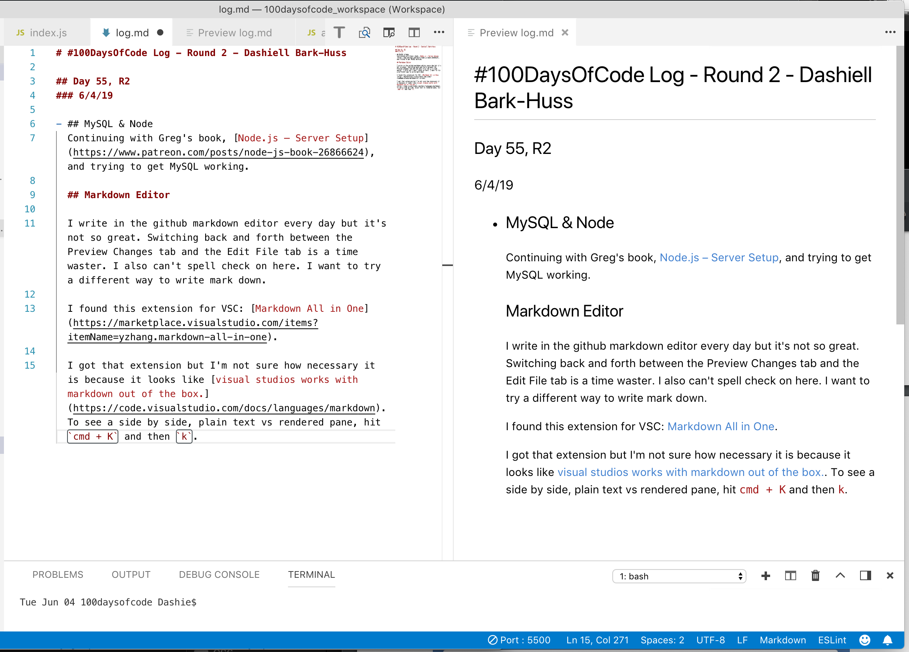

  ## Markdown Preview Github Style: Fail
  I wanted the vsc markdown preview to render like Github. so I installed this [Markdown Preview Github Styling](https://marketplace.visualstudio.com/items?itemName=bierner.markdown-preview-github-styles0) extension but it didn't do anything and there was very little documentation.


  ## Markdown Spellcheck
  I added a spellcheck extension called [Code Spell Checker](https://marketplace.visualstudio.com/items?itemName=streetsidesoftware.code-spell-checker). It's ok, but it doesn't show suggested spellings.

- ## Node
  Continuing with Greg's book, [Node.js – Server Setup](https://www.patreon.com/posts/node-js-book-26866624).

  ## Questions From Yesterday

  Yesterday, I was [confused by a few things.](https://github.com/DashBarkHuss/100-days-of-code/blob/master/r2-log.md#confused-6319)

  I'm going to go through what confused me and try to understand better.

  ## **Question:** Why would you need to make a new password/username? Why not just use root? What's the difference?
    
    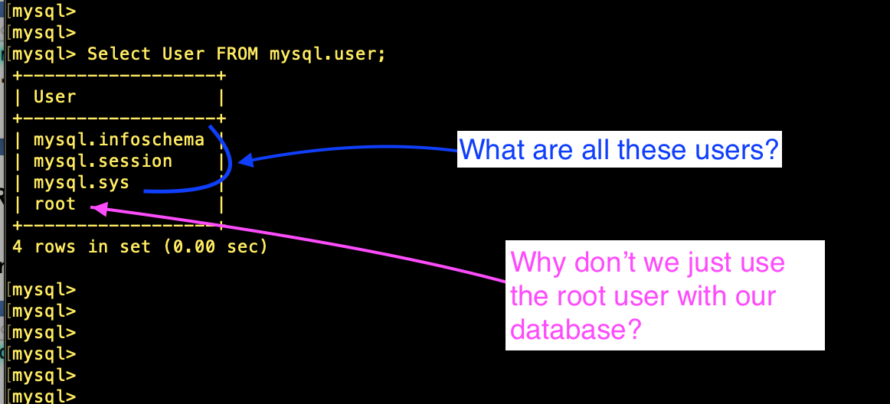

    Greg ([@js_tut](https://twitter.com/js_tut)) reached out to me and answered this one.

    >the other users are just users with system privileges
    >
    >root is the main user added during installation
    >
    >others can be added, but with reduced access (cant delete database for example, only access it)
    >
    >whenever there are multiple users, it usually means difference in privileges: admin vs normal users for example
    
    I thought it was something like this, but now I understand that these users can be regular app users. I didn't understand that before. I thought adding *any* user would just add an *admin*. **I hadn't really thought through what it meant to add a user.**

  ## **Questions:*** Localhost vs Remote Server
    I had questions about localhost and the remote server:

    - **Question:** If I wanted to use a remote server, how do I find my *remote server address?* 
  
    - **Question:** What is a remote server? Is that like when I pay for Go Daddy hosting? Do I get a remote server address?

    Greg ([@js_tut](https://twitter.com/js_tut)) DM'd me:

    >on localhost, you can use "localhost" or "127.0.0.1" where you would use a remote address otherwise (yes its basically a hosted address, like godaddy etc)
    >
    >bind is usually set to 127.0.0.1 on localhost, if its skipped i think it will assume localhost
    >
    >because its like connecting to the mysql server from the program thats running on the same computer......

  ## Localhost:
  I read more about what [localhost actually is here](https://whatismyipaddress.com/localhost), but I didn't finish reading.
  ## **Question:** Do I skip this step if I'm just putting MySQL server on localhost?:
  
  >To log in to your web host open Terminal on your Mac and execute the command ssh root@XXX.XX.XX.XX and replace the X’es with your actual remote server address. Enter password, and you’re in!

  What is this command?: `ssh root@XXX.XX.XX.XX`

  ## SSH Command
  What is SSH?
  >SSH or secure shell, is a very widely used protocol for connecting to systems remotely to manage or use them.

  -*from [Learning SSH, lynda.com](https://www.lynda.com/Developer-Network-Administration-tutorials/Welcome/189066/365610-4.html?srchtrk=index%3a1%0alinktypeid%3a2%0aq%3assh%0apage%3a1%0as%3arelevance%0asa%3atrue%0aproducttypeid%3a2)*

  >SSH will get you to the command prompt of a remote system.

  -*from [Learning SSH, lynda.com](https://www.lynda.com/Developer-Network-Administration-tutorials/What-you-should-know-before-starting-course/189066/365611-4.html?srchtrk=index%3a1%0alinktypeid%3a2%0aq%3assh%0apage%3a1%0as%3arelevance%0asa%3atrue%0aproducttypeid%3a2)*


  So since I'm not trying to login to a remote server, I think I don't need this step. But it would be cool to try this tutorial with a remote server. I'm wondering how to do that.

  ## GoDaddy Remote Server

  I have some websites on GoDaady so I want to try use it as my remote server. I contacted GoDaddy in their chat box:

  >**Me:** I'm following a tutorial on setting up a server with Node. It says to log in to my remote server on the command line: ssh root@XXX.XX.XX.XX- and replace the X'es with your actual remote server

  The agent was really helpful. They showed me where I could find the IP address.

  I still can't login because the agent told me I have to [set up SHH here](https://www.godaddy.com/help/enable-ssh-16102). So I will do that tomorrow.

  
  ## **Question:** Why didn't I have a configuration file? How can MySQL server work without a configuration file? If mine worked without it, why would MySQL sometimes need one and sometimes not?
  This was my last question from yesterday, but I didn't get to look into it today.


## Day 54, R2
### 6/3/19
- ## MySQL & Node
  Continuing with Greg's book, [Node.js – Server Setup](https://www.patreon.com/posts/node-js-book-26866624), and trying to get MySQL working.
  
  ## Uninstall MySQL: Success
  I was finally able to remove MySQL. I followed these instructions Greg ([@js_tut](https://twitter.com/js_tut)) suggested: [Uninstall MySql on a Mac OS X](https://community.jaspersoft.com/wiki/uninstall-mysql-mac-os-x)

  Now `which mysql` returns nothing! Yay!

  ## apt-get?
  I thought it would be best to get apt-get and download MySQL and MySQL server that way so I could follow Greg's tutorial but in [this thread](https://unix.stackexchange.com/questions/80711/how-to-install-apt-get-or-yum-on-mac-os-x) the answers say not to use apt-get on the Mac OS.
  
  ## MySQL Server UI Installer
  I decided to skip downloading MySQL and just download the MySQL server. I think the server *also* downloads MySQL. I think that's what caused my problems with the password yesterday. I think I accidently reset the MySQL password when I downloaded MySQL server. I followed this video tutorial: [How to Install and Configure MySQL Server on macOS Mac OS X](https://www.youtube.com/watch?v=Bgzf0AH1x-Y)
  
  I used vim instead of nano because the tutorial used vim and it was confusing to use. So I had to follow this page: [Vi / Vim: Save And Quit The Editor Command](https://www.cyberciti.biz/faq/linux-unix-vim-save-and-quit-command/)
  
  ## Back To Node.JS - Server Setup Book
  On page 36 of the Node book, section ***5.0.6 Make MySQL Open For Remote Access***, we edit the config file. But I had no config file.  I had to add the configuration file myself. Used the 2nd to last step in this tutorial for adding the [config file](https://blog.joefallon.net/2013/10/install-mysql-on-mac-osx-using-homebrew/).
  
  On page 38 of the book, it says to press `control` + `O` and then enter to save the file. This didn't work for me. I have to do `control` + `X`.
  
  ## Confused 6/3/19:
  ***Chapter 5: Setting Up MySQL Server*** is confusing me so much. 
  
  I got early access to the book so it's still a work in progress, so there will probably more clarifications in the next updates.
  
  ### My questions 6/3/19:
  
  - Do I skip this step if I'm just putting MySQL server on localhost?:
    - >To log in to your web host open Terminal on your Mac and execute the command
ssh root@XXX.XX.XX.XX and replace the X’es with your actual remote server
address. Enter password, and you’re in!

  - If I wanted to use a remote server, how do I find my *remote server address?* 
  
  - What is a remote server? Is that like when I pay for Go Daddy hosting? Do I get a remote server address?

  - Why didn't I have a configuration file? How can MySQL server work without a configuration file? If mine worked without it, why would MySQL sometimes need one and sometimes not?
  
  - Why would you need to make a new password/username? Why not just use root? What's the difference?
    - >Now we have user felix ready to log in to the database via localhost address with
provided password. This is the account you can use in your JavaScript code when
we get to the Chapter 6: Adding MySQL to api.js
      >
      >...now you can log into your MySQL server using a MySQL client
such as Sequel Pro on Mac or MySQL Workbench on Windows, using the login
token pair felix/PassWord557123! we created earlier.

      
  
  - Do I skip this step if I'm using localhost for my server?:
    - >Comment the line bind-address = 127.0.0.1 by adding # to the front:
  
  
  

## Day 53, R2
### 6/2/19

- ## MySQL & Node
  I'm continuing Greg Sildenikov's [Node.js – Server Setup](https://www.patreon.com/posts/node-js-book-26866624), trying to get mysql-server to work. It was really hard to figure out since there aren't instructions for doing it on a mac yet in his book. I didn't get it to work.
  
  ## MySQL Server
  I followed this tutorial for getting mysql server, the section called [3. Using Homebrew service to download](https://tableplus.io/blog/2018/11/how-to-download-mysql-mac.html#3-using-homebrew-service-to-download).
  
  Then I went back to  Greg Sildenikov's [Node.js – Server Setup](https://www.patreon.com/posts/node-js-book-26866624) on page 32 and ran `mysql -u root -p`. It worked but `mysql -u root -p` worked before following the instructions for mysql-server. So I'm not sure if that was necessary to get mysql-server: did I already have it? Is it doing something different that I don't understand/can't see? I'm not sure what it did.
  
  ## 5.0.6 Make MySQL Open For Remote Access
  In this section in the book Greg says:
  
  >...you need to find the actual mysql configuration file which should reside in one of the folders specified with !includedir.
   
  What does **specified with !includedir** mean?
  
  I'm not seeing any configuration file or related folder in etc. So maybe I still don't have mysql-server? When I run `which mysql-server` it shows nothing.
  
  ## UI Download
  I tried installing mysql server another way, using the [ui installer](https://dev.mysql.com/downloads/file/?id=486026). But when I run `which mysql-server` I'm still getting nothing. And I still don't see any configuration file or mysql folder in the ect directory.
  
  ## Another Download Method
  Here the author uses homebrew to install mysql-server but it's a different way than what I've already done: https://blog.joefallon.net/2013/10/install-mysql-on-mac-osx-using-homebrew/
  
  I tried to follow this tutorial but I ran into this error.
  
  ```bash
  Sun Jun 02 ~ Dashie$ mysql_secure_installation

  Securing the MySQL server deployment.

  Enter password for user root: 
  Error: Access denied for user 'root'@'localhost' (using password: YES)
  ```
  
  And now I can't log in with `mysql -u root -p` even with the password I wrote down. I'm sooo confused.
  
  ```bash
  Sun Jun 02 ~ Dashie$ mysql -uroot -p
  Enter password: 
  ERROR 1045 (28000): Access denied for user 'root'@'localhost' (using password: YES)
  ```
  
  ## Uninstall MySQL
  So now in addition to not being able to use mysql-server, I can't get into mysql itself. I wonder if it's because I downloaded mysql-server a bunch of times and in a bunch of different ways. Maybe I accidently changed the password for mysql. I figure, I should uninstall and reinstall mysql to change the password back.
  
  I uninstalled mysql the way I did yesterday, but instead of installing it the way the post I linked to yesterday said, I followed this: https://blog.joefallon.net/2013/10/install-mysql-on-mac-osx-using-homebrew/.
  
  But then I got this error:
  ```bash
  Sun Jun 02 ~ Dashie$ mysql.server restart
  ERROR! MySQL server PID file could not be found!
  Starting MySQL
  ... ERROR! The server quit without updating PID file (/usr/local/var/mysql/dashielusssMBP2.jetpack.pid).
  ```
  
  So I uninstalled mysql with brew again. But it doesn't seem to be working because `which mysql` still shows that I have mysql:
  
  ```bash
  Sun Jun 02 ~ Dashie$ brew remove mysql
  Error: No such keg: /usr/local/Cellar/mysql
  Sun Jun 02 ~ Dashie$ which mysql
  /usr/local/mysql/bin/mysql
  ```
  
  I can't remove mysql.
  
  I am so confused and lost and frustrated today.
  
  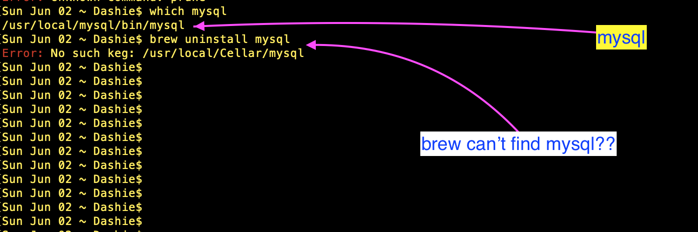

## Day 52, R2
### 6/1/19

- ## MySQL
  Yesterday, I ended with an error when I tried to log into MySQL.
 
  ```bash
  mysql -u root -p 
  >ERROR 2002 (HY000): Can't connect to local MySQL server through socket '/tmp/mysql.sock' (2)
  ```
  I think it's because I don't remember my password. 
  
  ## MySQL Password
  I could try to guess my password, but I'm really wondering how I can find out what my password is? Shouldn't I be able to access my own password? Who am I trying to keep out? This is only on my computer?
  
  I wanted to see when I installed MySQL incase I need to delete it and reinstall it. I wanted to make sure I added it recently and I hadn't used it a while ago for something important taht I don't remember. But:
  
  >UNIX doesn't support creation date, windows does.
  
  -from *"[what's the command to find the creation date of a certain dirctory?](https://www.unix.com/shell-programming-and-scripting/157874-creation-date-directory.html)"*
  
  If Unix doesn't support creation date, then how does finder have a creation date?
  
  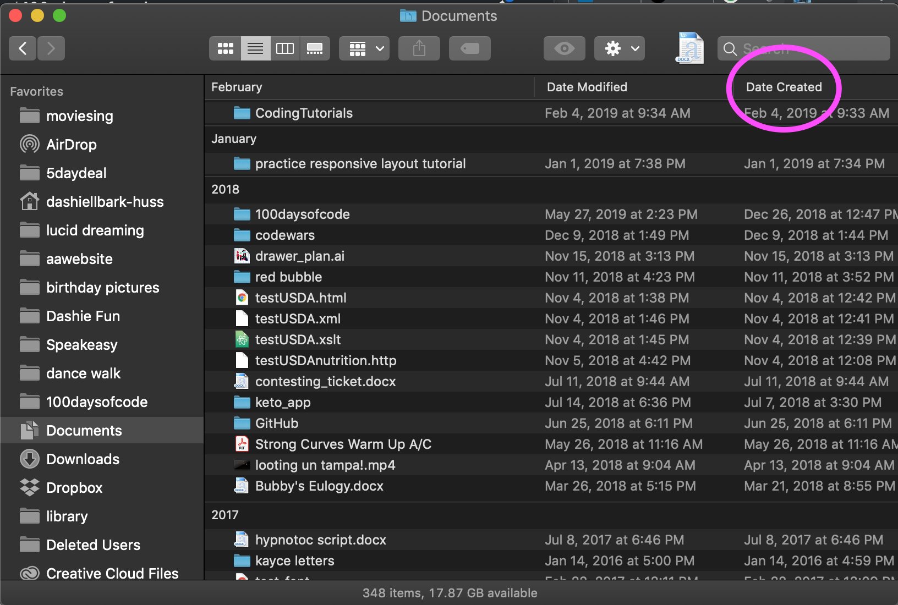
  
  I ended up finding MySQL in my Finder by getting the path for MySQL using `which mysql` in the command line, then going to "Go" in finder and finding where mysql was. 
  
  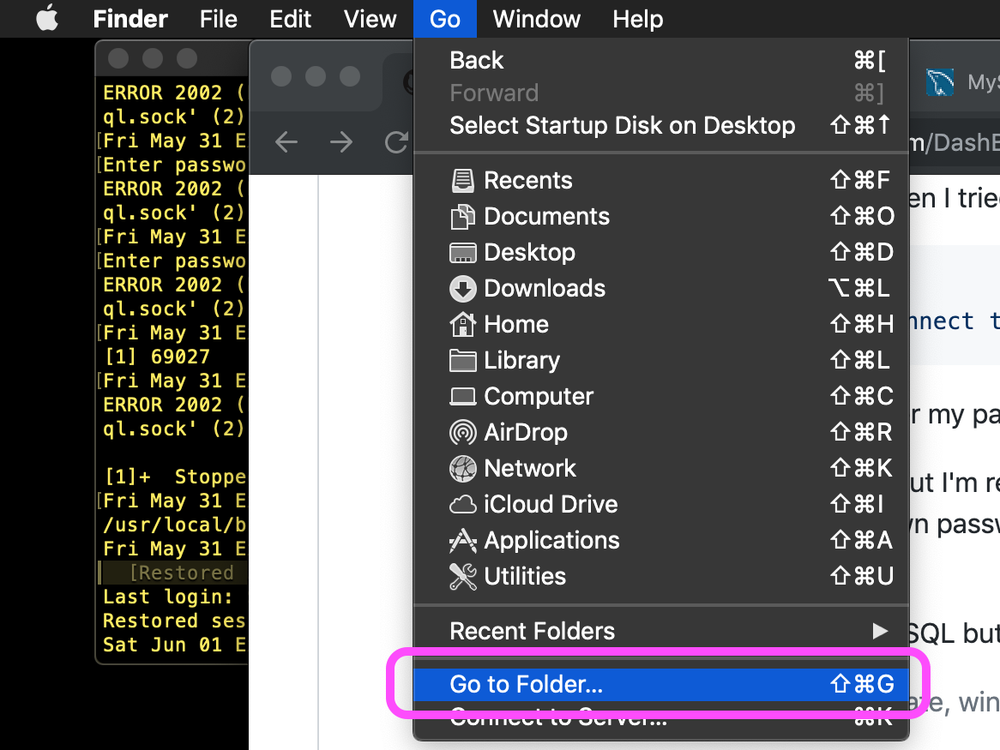
  
  It showed that I installed MySQL on August 1, 2018, this past summer. So I don't think I have anything important that I could lose since then. I probably was just following a tutorial at the time or something. I don't know, had I had any databases, if uninstalling MySQL would cause any databases to be lost, but either way it won't matter: I probably don't have anything important. So I could uninstall it and reinstall it to reset the password if I have to. 
  
  ## Where Is The Password Stored?
  
  > MySQL passwords are stored in the user table of the mysql database and are encrypted using it's own algorithm.
  
  -from *[Security: Where are MySQL passwords stored?](https://serverfault.com/questions/326649/security-where-are-mysql-passwords-stored)*
 
  Since it's encrypted, I guess you can't go trying to get in there somehow and get the password.
  
  More info on password here: [MySQL Documentation: 6.2.1 Account User Names and Passwords](https://dev.mysql.com/doc/refman/8.0/en/user-names.html)
 
  ## Uninstalling and Reinstalling MySQL
  I followed [this tutorial](https://medium.com/@devontem/solved-cant-connect-to-local-mysql-server-through-socket-tmp-mysql-sock-2-f52c9c546f7) on uninstalling and reinstalling MySQL. This fixed the poster's error. But Not mine.
   
  After uninstalling and reinstalling MySQL, I suddely remembered where I saved my password, my Keychain Access! duh. Uninstalling and Reinstalling didn't give me an option to input a new password, so my old password should probably still work. But I still got the same error.
    
  ## Solution
  
  Someone posted the [same error on stackoverflow](https://stackoverflow.com/questions/15016376/cant-connect-to-local-mysql-server-through-socket-homebrew/15016441) and linked to this [other post about a different error](https://stackoverflow.com/questions/4359131/brew-install-mysql-on-macos/6378429#6378429). The solution to this other error worked for me. It's in this stackoverflow thread, the [instructions that Lorin Rivers gave.](https://stackoverflow.com/questions/4359131/brew-install-mysql-on-macos/6378429#6378429)
  
  ### Notes:
  - ### Step 2: I skipped step 2.
  - ### Step 4:
  In Step 4, change the file to the MySQL version you just downloaded.
  
  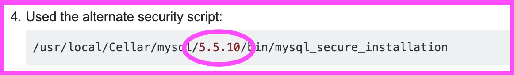
  
  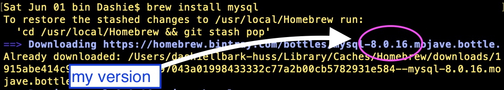
  
  - ### Prompts:
  
  This is what I did for the prompts, though I didn't understand all of these fully:
  
  ```bash
  By default, a MySQL installation has an anonymous user,
  allowing anyone to log into MySQL without having to have
  a user account created for them. This is intended only for
  testing, and to make the installation go a bit smoother.
  You should remove them before moving into a production
  environment.
  Remove anonymous users? (Press y|Y for Yes, any other key for No) :
  ```
  I said yes
  
  ```bash
  Normally, root should only be allowed to connect from 'localhost'. This ensures that someone cannot guess at the root password from the network.

  Disallow root login remotely? (Press y|Y for Yes, any other key for No) : 
  ```
  I said yes
  
  ```bash
  By default, MySQL comes with a database named 'test' that anyone can access. This is also intended only for testing, and should be removed before moving into a production environment.

  Remove test database and access to it? (Press y|Y for Yes, any other key for No) :
  ```
  I said no, because I thought it might be good to see an example of a database.
  
  ```bash
  Reloading the privilege tables will ensure that all changes made so far will take effect immediately.

  Reload privilege tables now? (Press y|Y for Yes, any other key for No) : 
  ```
  I said yes, because why wouldn't I want it to take effect immedietly? What's the alternative?
  
  - ### Step 5:
  I didn't understand Step 5 from the stackoverflow post. But MySQL started working again, so I am good! I guess I didn't need anything after step 4. 
  
  And a tip from lil Dashie: go to your Keychain Access (or whatever it is on Windows) and manually add your mysql password. Although, that was wasn't my problem here. It's just a good tip.
  
  ## Where Does MySQL Start And SQL End?
  Whenever I learn something new this is always a confusion point. Where do things start and end? Where does Javascript end and the Web API start? What part of this project is Node and what part is javascript? What's the difference between the MySQL program and the MySQL server? Github vs Git? Technologies blend together and I usually can only separate them after some time with using them.
  
  I went back to the tutorial: [Learning MySQL Development](https://www.lynda.com/MySQL-tutorials/Up-Running-MySQL-Development/158373-2.html) on lynda. We're learning commands to show tables/databases/columns etc. But I don't know if they are MySQL commands or SQL commands.
  
  This page compares the two: [SQL vs MySQL: What's the Difference?](https://www.guru99.com/sql-vs-mysql.html):
  
  >SQL is a language which is used to operate your database. SQL is the basic language used for all the databases. There are minor syntax changes amongst different databases, but the basic SQL syntax remains largely the same.
  
  So my immediate thought is that it's SQL. However, looking into it [furthur online](https://www.quora.com/How-do-you-view-all-the-tables-in-SQL), it looks like some of these commands are specific to MySQL.
  
  ## Documentation
  You can find the documentation for MySQL here: [MySQL Online Manual](https://dev.mysql.com/doc/refman/8.0/en/)
  
  

## Day 51, R2
### 5/31/19

- ## MySQL
  I decided to look more into MySQL today. I followed [Learning MySQL Development](https://www.lynda.com/MySQL-tutorials/Up-Running-MySQL-Development/158373-2.html) on lynda.
  
  The internet is not great today, so we'll see how much I can do.
  
  ## SQLFiddle
  You can use SQL Fiddle to play with SQL:
  http://sqlfiddle.com/
  
  ## myPHPadmin Demo
  You can use myPHPadmin Demo to play with SQL:
  https://demo.phpmyadmin.net/master-config/server_sql.php?lang=en
  
  ## Database Normalization
  A way to organize your fields and your tables. The accepted standard of database normalization is Third Normal Form (3NF). It includes First and Second Normal Form.
  
  ### First Normal Form:
  Each record has a single value.
  
  ***Isn't a record an entire row? That is not what the instructor means...***
  
  ### Second Normal Form
  - Must be in 1NF
  - Fields not defining a row depend on fields that do. All the information in the table is dependant on what defines the row.
  
  ### Third Normal Form
  - Must be in 1NF
  - Must be in 2NF
  - All the non-defining fields are directly dependent on the defining fields.
  
  I'm confused how 3NF is different from 2NF. ***"All the non-defining fields are directly dependent on the defining fields."*** sounds exactly like, ***"Fields not defining a row depend on fields that do. All the information in the table is dependant on what defines the row."***
  
  ## 3NF vs 2NF
  I watched videos from another lynda tutorial to understand the differences.
  
  ### 2NF: 
  All fields in the primary key are required to determine the other non-key fields.
  
  -***Paraphrased** from [Learning Relational Databases](https://www.lynda.com/Access-tutorials/Second-normal-form/604214/648094-4.html)*
  
  ### 3NF:
  Follows a similar pattern to 2NF but instead of checking against the individual components of a composite primary key, we'll check each *non-key column* against every other *non-key column*. Here, we're looking for columns that are functionally dependent on another piece of information that isn't the promary key. For instance you might try storing the state, and the state abbreviation in an address table. Since state abbreviation is entirely dependent on the state or vice versa, one of those two fields should be removed from the table.
  
  -***Paraphrased** from [Learning Relational Databases](https://www.lynda.com/Access-tutorials/Third-normal-form/604214/648095-4.html)*
  
  ### Denormalization
  When you intentionally ignore some of the normalization rules. This is done usually to increase performance, but it's only used when absolutely necessary.
  
  ## DDL
  Data definition langauge: a set of SQL commands you can use to define tables and databases. It usually involves changing how the data is stored.
  
  ## DML
  Data manipulation langauge: how you manipulate data or change it.
  
  ## OLAP
  Online Analytical Processing: An application that does a lot of reports
  
  ## OLTP
  Online Transactional Processing: An application that does a lot of transactions 
  
  ## Some Terms
  **Column:** Field
  
  **Row:** Record (entire entry)
  
  **Queries:** Commands used to send statements to a table. DDL, DML, or reading and searching information from a table is  how we query tables.
  
  **Table:** a collection of records. A table stores the records that are described by the fields in their row.
  
  **Database:** a container that holds tables
  
  **Schema:** database
  
  **Changing a schema/creating a schema:** changing the definition of what is in the database.
  
  ## Can't Run MySQL
  
  When I run: 
  
  `mysql -u root -p`
  
  I get this error: `ERROR 2002 (HY000): Can't connect to local MySQL server through socket '/tmp/mysql.sock' (2)`
  
  I get it no matter what password I put in, so maybe it's just because I don't remember my password. I don't know what password this is refering too.
  
  ## MySQL Password
  I'm not sure if I just forgot my password. I was thinking, maybe if I just uninstall and reinstall mysql I can make a new password. But what if this messes up some databases I have on here? I didn't put any mysql data bases on here, but what if some other program did? Is it possible? 
  
  I want to see the date that I installed MySQL. I couldn't find a way in bash to list the date created. But I couldn't find the MySQL folder in the GUI, even after pressing `cmd` + `shift` + `.`. So I couldn't see the date created by looking in the GUI either.
  
  I'll have to investigate more tomorrow.

## Day 50, R2
### 5/30/19

- ## Node
  Continuing Greg Sildenikov's [Node.js – Server Setup](https://www.patreon.com/posts/node-js-book-26866624).
  
  ## Setting Up MySQL Server
  This next section confuses me. It talks about installing mysql on Windows and Ubuntu, but not Mac. Luckily Greg is pretty responsive on twitter so I wrote to him to tell him what confused me.
  
  ## Correspondence With Greg
  Greg got back to me and clarified a few things. He said he will include more clarification based on my feedback and questions.
  
  ## MySQL vs MySQL Server
  I was confused about the difference between mysql and mysql server.
  
  Greg said:
  >Well, mysql is a program just like any other. It runs on your computer.
  >
  >But when you write code, you have to install mysql modules to add to the node server with require keyword... that's  separate from the actual mysql program
 
  -*Greg Sidelnikov aka [JavaScript Teacher @js_tut](https://twitter.com/js_tut), Twitter DM*
 
  I'm not sure, but I think he is referring to the difference between MySQL and the mysql node module. I don't think mysql-server is a node module, but I'm not sure.
  
  ## What is MySQL
  
  >MySQL is an Oracle-backed open source relational database management system (RDBMS) based on Structured Query Language (SQL).
  
  -*[MySQL DEFINITION ](https://searchoracle.techtarget.com/definition/MySQL)*
  
  ## What is MySQL Server
  
  >MySQL server is the MySQL database software acting as a server/service towards clients. It is a concrete installation of MySQL.
  
  -*[Olaf Doschke, Quora: What is the difference between a MySQL server and a MySQL client?](https://www.quora.com/What-is-the-difference-between-a-MySQL-server-and-a-MySQL-client)*
  
  >Mysql is a SQL implementation.
  >
  >Mysql server is the application that runs mysql database system, where all the data is stored and processed.
  
  -*[Nicolas Martin Gonzalez, Quora: What is the difference between MySql & MySql Server?](https://www.quora.com/What-is-the-difference-between-MySql-MySql-Server)*
  
  ### Download MySQL:
  Greg said there was a UI to download the MySQL Server.
  
  I found this: [Download MySQL Community Server](https://dev.mysql.com/downloads/mysql/)
  
  Also when I go to the [MySQL github](https://github.com/mysql) there's a repo for MySQL server.
  
  I'm confused: It seems like MySQL server is required if you want to use mysql. So why have them separate? When would you ever need one without the other? Why download one and not the other? Why aren't they just part of the same package?
  
  ## More On MySQL
  I decided to do some more exploring of MySQL.
  
  >MySQL Community Server. When People talk about using MySQL, this us usually what they mean.
  
  -*[MySQL: Installing and Running Ruby on Rails on Mac](https://www.lynda.com/Ruby-Rails-tutorials/MySQL/500549/533096-4.html)*
  
  So maybe MySQL and mysql server do usually go together.
  
  
  
- ## Thoughts and Feelings:
  I spent a bit of my coding time talking to Greg. Part of the time we were talking about the book and he was helping me. For some of the time we were talking about ideas tangentially related to coding. So I dont know if that's cheating! But I'll count it for today.
  
  We talked about feedback. It's important to both give and recieve honest criticism. We shouldn't think of these things negatively. They are useful. It's a mitzvah to give constructive criticism and it's a blessing to recieve it. It's the only way to get better.
  
  Don't be afraid that you'll hurt someone's feelings by giving feedback. People don't just want your flattery. People who are passionate about their work love constructive criticism. The more specific and detailed the better. Likewise, if you want to excell you need to crave feedback too. And you need to let go of your bruised ego and grow a pair of tits, bro! Or should I say, bra? In my case, I have tits, so I needed to grow balls. Now I am complete.
  
  We also talked about embracing stupidity. You should never be afraid to look stupid. Stupidity is a blessing. It's a compass that shows us where we need to go next. When you feel confused, you know that you need to clarify that confusion. If we never felt stupid we wouldn't know what we need to learn next. Understanding your stupidity is it's own kind of wisdom. And, here too, we need to get over our egos. We are all stupid. Only those who ask the stupid questions will get past their stupidity.

## Day 49, R2
### 5/29/19

- ## Node 
  Continuing Greg Sildenikov's [Node.js – Server Setup](https://www.patreon.com/posts/node-js-book-26866624).
  
  It's cool to see how things work behind the scenes. I can see how the server loads  the favicon for example:
  
  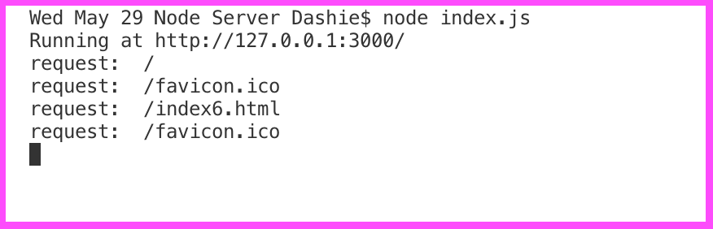
  
  ## Debugging In Node, Server
  
  The last time I looked into debugging in node I found that you can [debug in VSC](https://github.com/DashBarkHuss/100-days-of-code/blob/master/r2-log.md#debbuging-node-in-vsc). 
  
  However, I'm still having trouble. It seems ***VSC doesn't like to keep the debugger on when I'm also running the file.*** 
  
  ### So how can I debug my server?
  
  For example, on line 14 we have the variable `extension`. 
  
  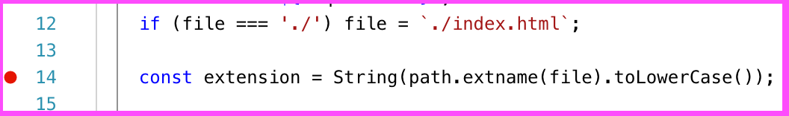
  
  It's made up of other expressions and variables which make it long and confusing.
  
  Sometimes I like to get a clearer picture of a confusing variable by using the DevTools debugger to pause the script and select and hover over all the expressions to see the value of each expression, like this:
  
  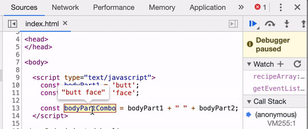
  
  I don't see a way of doing that with node and the VSC debugger. 
  
  I cannot run the server ***and*** the debugger at the same time. So I can't pause the script after a request is made to the server and then see the values of the expression `extension`. I wonder what the solution to this is?
  
  ### Possible Solutions:
  - Maybe there's a way of debugging that I don't know about
  - Could unit testing have something to do with this?
  - console log everything
  
  For now, I will console log everything, but there's got to be a better way.
  
  ## Building An API
  >So far we learned how to serve requested files. But if you want to build real web
applications, you might want to integrate support for API endpoints.
  >
  >An endpoint is a URL that follows a special pattern. We can intercept this pattern
and upon its presence we will execute an API command, instead of serving a file
  
  -*Greg Sildenikov, [Node.js – Server Setup](https://www.patreon.com/posts/node-js-book-26866624).*
  
  When an API end point is requested, we cancel serving the file, and instead run some server-side commands and return a result.
  
  ## Static Keyword
  In our API class from page 26 of [Node.js – Server Setup](https://www.patreon.com/posts/node-js-book-26866624), we use the keyword, `static`:
  
  ```javascript
  static catchAPIrequest(v) {
    // function body etc...
  ```
  
  ### What is the static keyword?:
  >The static keyword defines a static method for a class. Static methods aren't called on instances of the class. Instead, they're called on the class itself.
  
  -*from [static, Mozilla Docs](https://developer.mozilla.org/en-US/docs/Web/JavaScript/Reference/Classes/static)*
  
  ## Branching Out
  Greg uses the term *"branching out"*:
  
  >We used boolean result of API.catchAPIrequest to branch out.
   
  -*Greg Sildenikov, [Node.js – Server Setup](https://www.patreon.com/posts/node-js-book-26866624).*
  
  ### What is branching out?:
  >branching is a way to make a program behave differently based on Boolean expressions (e.g., involving user input)
  
  -*from [Chapter 4: Boolean expressions and Branching](https://hank.feild.org/feild-guide-cpp/conditionals.html)*
  
  ## Confused About Mac:
  In next chapter, Chapter 5: Setting Up MySQL Server, the first two sections are:
  - 5.0.1 Install MySQL Server Locally on Windows
  - 5.0.2 Install MySQL Server on Ubuntu
  
  But nothing on installing it on a Mac.
  
  A few days ago, when I was confused about installing node on mac, Greg said:
  
  >(Ps: windows global installation is unique to the OS, on Linux you can call mysql from anywhere by default)
  
  Is this what he was talking about?
  
  It doesn't say anything about skipping these sections if you're on a Mac.
  
  Times up for today. I will figure it out tomorrow.
  
## Day 48, R2
### 5/28/19

- ## Node 
  Continuing Greg Sildenikov's [Node.js – Server Setup](https://www.patreon.com/posts/node-js-book-26866624).
  
  ## Serving Files
  
  I'm now able to serve up files after following the code on page 23 of [Node.js – Server Setup](https://www.patreon.com/posts/node-js-book-26866624).
  
  ## Review: Adding ESlint & prettier Locally
  Taking a break from the Node tutorial inorder to set up Eslint and Prettier in this project.
  
  Since this is local, all commands should be run in your project directory.
  ### ESLint
  1. added .eslintrc.json
  2. `npm init`
  2. `eslint --init` (make sure you get to the point where it asks if you'd like to install airbnb style dependancies)
  ### Prettier
  1. add `"prettier"` to `"extends"` and `"plugins"` in .eslintrc.json
  2. Configure prettier in .eslintrc.json in `"rules"`
  - ```javascript
    "rules": {
      "no-console": "off",
      "prettier/prettier": [
        "error",
        {
          "singleQuote": true
        }
      ]
    }
    ```
  3. `npm install --save-dev eslint-plugin-prettier`
  4. `npm install --save-dev eslint-config-prettier`
  5. This is already set up for my workspace but incase I change work spaces or for anybody else's benefit:
  - in User settings:
    ```javascript
    "editor.formatOnSave": true,
    "[javascript]": {
      "editor.formatOnSave": false
    },
    "eslint.autoFixOnSave": true,
    ```
  ## JSON Formatting
  I saw a cool way of formatting JSON in [Node.js – Server Setup](https://www.patreon.com/posts/node-js-book-26866624):
  
  ### Colons/Values Aligned:
  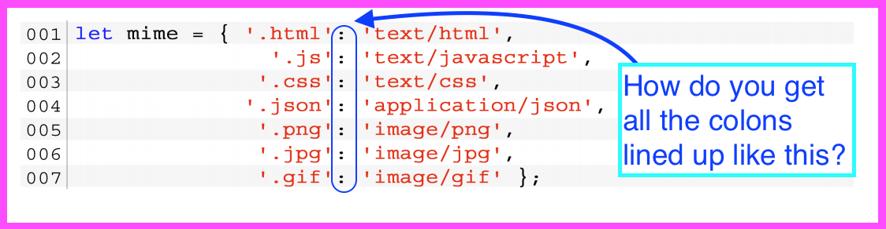
  
  ### Instead of Properties Aligned:
  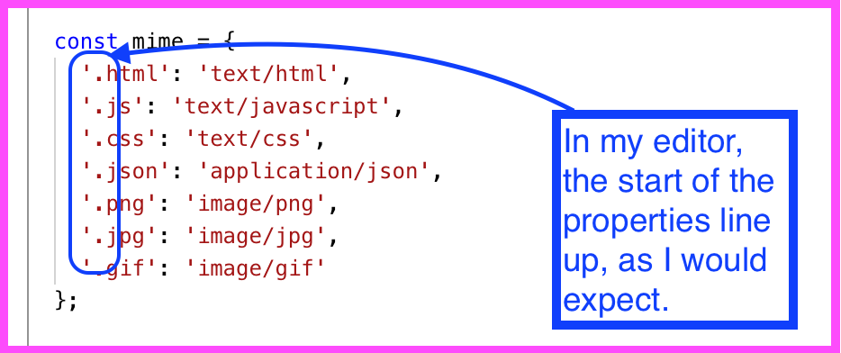
  
  I wonder how this is done. I like how it looks.
  
  Couldn't find much online, I asked on twitter.
  
  ## ESLint: No Shadowing
  > Shadowing is the process by which a local variable shares the same name as a variable in its containing scope. For example:
  >```javascript
  >var a = 3;
  >function b() {
  >  var a = 10;
  >}
  >```
  
  
  ## Spellcheck When Writing In Markdown?
  Is there any way to enable spellcheck while I'm writing in my github markdown log? I have so many typos.
  
- ## Thoughts and Feelings:
  I got good news today related to the bad news that I got a few days ago. I'm so relieved. My focus is so much better. I'm so grateful. The issue is still going on, but the severity is not as extreme as previously thought. 
  


## Day 47, R2
### 5/27/19

- ## Node / Unix
  Today, I'm going to focus on Node and Unix again which I was last learning about on [May 23rd](https://github.com/DashBarkHuss/100-days-of-code/blob/master/r2-log.md#day-43-r2). 
  
  ## Windows Vs. Linux
  
  Last time I ran node from the terminal it worked without having to set up the  environment variables. I was surprised by this. But Greg Sidelnikov reached out to me and explained:
  
  >(Ps: windows global installation is unique to the OS, on Linux you can call mysql from anywhere by default)
  
  -*Greg Sidelnikov aka [JavaScript Teacher @js_tut](https://twitter.com/js_tut)*
  
  I don't know what mysql has to do with it, but I guess you can run node anywhere on a mac.
  
  
  
  ## C:
  I know `C:` has something to do with paths and directories but what exactly does it mean?
  
  It's difficult to google questions that involve special symbols so I used [SymbolHound.com](http://symbolhound.com/) to search `C:`. Otherwise, google usually ignores punctuation and special symbols.
  
  >"Windows displays partition labels as uppercase letters (C:)." 
  
  -*[Stackoverflow](https://stackoverflow.com/questions/93228/is-a-hard-drive-partitions-label-upper-or-lowercase-c-or-c)*
  
  It looks like `C:\` is a way that windows represents a harddrive partition. I think you can have other letters for other partictions. Then a path would look like this: `C:\somefolder/somefile`. Since I don't use windows this was new to me. Atleast, I think it's just a windows things.
  
  ## Where Are Core Node Modules Stored?
  
  >Modules are stored in your node installation folder (C:\Program Files\nodejs
in our case) under node modules.
  >You might also find them in nodejs\npm folder:
C:\Program Files\nodejs\node modules\npm\node modules\
 
  -*Node.js – Server Setup, Greg Sidelnikov*

  ## `import`
  
  In the react tutorial from yesterday I saw the `import` keyword and was wondering what it was:
  
  > In browser-side JavaScript code, you can use import / export keywords. But in
addition to that, in node you can use require keyword to add useful modules to
your app from the main NPM repository.

  -*Node.js – Server Setup, Greg Sidelnikov*
  
  So it looks like it's basically the same as require but it's browser-side JavaScript code. So does that mean it's part of javascript or part of the Web API?
  
  It's also nice to know that ***`require()` is just pulling from the NPM repository***. I think that means the folders where the core modules are stored (as mensioned above). So, this clarifies how `require()` works and why you don't need to include the path for the core modules.
  
  ## Importance of a Node Server Continuously
  
  Here Greg is comparing the process of running a simple javscript file in node with running a node server continuously:
  
  >After executing index.js the node process quits, and
control is given back to cmd. This won’t help us run our application server. We
need to build something that runs continuously so we can serve a file every time
someone will access our server from their browser.

  -*Node.js – Server Setup, Greg Sidelnikov*
  
  So, this makes me question what we are actually about to do?:
  
  ***Can we actually deploy a site to the web if we make our own server? Or do we still need heroku and netify etc to do that? What actually is the server?*** I thought when we make a server it still only runs on our own computer and other people cannot access it. That's what I thought I had done in the past when running live servers on my computer to test certain code that couldn't be tested without a server. But here Greg Says, "every time someone will access our server." 
  
  So there's definetly a lot I'm realizing I don't understand. Let's see if I can figure it out in the upcoming sections.
  
  ## Node Server!
  So cool I got a simple node server running!
  
  ```javascript
  let http = require('http');

  const ip = `127.0.0.1`;
  const port = 3000;

  http.createServer(function(request, response){
    console.log('request: ', request.url);
  }).listen(port, ip);

  console.log(`Running at http://` + ip + `:` + port + `/`);
  ```
  
  ## Serving Requested Files
  So far we only are able to send requests. You can see the requests coming in to the terminal 
  
  
  
  But the code doesn't serve up any files.
  
  I followed the code for serving up files which can be found on page 23 of the May 14th update to Greg Sildenikov's [Node.js – Server Setup](https://www.patreon.com/posts/node-js-book-26866624). It's not free but it's only a dollar a month to support his patreon and you get all his books. If you don't have an extra dollar, you probably should read a book on getting your finances in order (I'm currently reading I Will Teach You To Be Rich). But besides that if you ask 5 strangers for 25 cents they will probably oblidge and you can then support the patreon and buy yourself a candy.
  
  ## MIME?
  What is MIME? In our code we set up a mime variable:
  
  ```javascript
  // Define acceptable file extensions
  let mime = {".html":"text/html"};
  ````
  
  >A multipurpose internet mail extension, or MIME type, is an internet standard that describes the contents of internet files based on their natures and formats.
  
  -*[What Is a File Extension and MIME Type?](https://www.lifewire.com/file-extensions-and-mime-types-3469109)*
  
  

## Day 46, R2
### 5/26/19

- ## React
  Continuing [React tutorial on lynda.com](https://www.lynda.com/React-js-tutorials/Learning-React-js/800214-2.html) with Eve Porcello [@eveporcello](https://twitter.com/eveporcello).
  
  ### Question:
  Where does `props` go when we make a class? I'm guessing in the argument to `render()`?

  ## Conditionally Render Components     
  
  ```jsx
  const Dashboard = ({name})=>(<h1>Welcome {name}!</h1>);

  const App = ({loggedIn}) => (
    loggedIn 
    ? <Dashboard name = "Dash" /> 
    : <h1>You are not logged in</h1>
  );

  ReactDOM.render(
    <App  loggedIn = {false}/>, 
    document.getElementById("root")
  );
  ```
  
  
  ## Render Components From A List
  
    > ...each child in an array or iterator should have a unique key property. So whenever we're rendering some sort of a list, with dynamic values,  we're going to need to give each a key, so that React can re-render things appropriately according to the rendering rules.  
    
  -[Eve Porcello](https://www.lynda.com/React-js-tutorials/Render-components-from-list/800214/2202388-4.html?autoplay=true)

  
  ```jsx
  const shoppingList = [
    "Avocado", "Tahini", "Organic Grass Fed Beef", "Spinach"
  ];

  const App = ({list}) => {
    return (
    <ul>
      {list.map((item, i)=><li key={i}>{item}</li>)}
    </ul>
    )
  };

  ReactDOM.render(
    <App  list = {shoppingList}/>, 
    document.getElementById("root")
  );
  ```
  
  
  
  ## Render Object List
  
  ```jsx
  const ingredients = [
    {id: 1, name: "Avocado", grams: 60},
    {id: 2, name: "Tahini", grams: 20},
    {id: 3, name: "Certified USDA Organic Grass Fed Beef", grams: 130},
    {id: 4, name: "Spinach", grams: 120},      
  ];

  const App = ({list}) => {
    return (<ul>
      {list.map((item)=><li key={item.id}>{item.grams}g {item.name}</li>)}
    </ul>
    )
  };

  ReactDOM.render(
    <App  list = {ingredients}/>, 
    document.getElementById("root")
  );
  ```
  
  
  
  ## Create React App
  I already had create-react-app installed. I used it to make a new project.
  
  In the directory that you want to make your project in, run the command:
  
  `create reacte app <projectname>`
  
  ## Run A create-react-app Project In The Browser
  
  First make sure you are in your new project directory. Then run `npm i` to install dependencies. 
  
  Then run `npm start` to start up the project in the browser. This will run your project on local host 3000.
  
  ### Question:
  I see all these import statements at the top again. I'm not sure what they are and the instructor didn't talk about them.
  
  ```javascript
  import React from 'react';
  import ReactDOM from 'react-dom';
  import './index.css';
  import App from './App';
  import * as serviceWorker from './serviceWorker';
  ```
  
  It looks like `require()`.
  
  ## Build For Production
  
  To put your create-react-app project on the web, you'll want to optimize it for production. You can do that really simply by running:
  
  `npm run <nameforbuild>`
  
  To run the build in the browser:
  
  `serve -s <nameforbuild>` 
  
  But this actually didn't work for me, it ran a different folder with the same name. So I have to include the entire path not just the name for build. Then I also ran `sudo npm install serve` (by accident) and `sudo npm install serve -g` and now I can just put the probect name without the path but I'm not sure why. I'm not sure where I have serve installed before. But now I have it installed in too many places.
  
  
  
## Day 45, R2
### 5/25/19

- ## React
  Continuing [React tutorial on lynda.com](https://www.lynda.com/React-js-tutorials/Learning-React-js/800214-2.html) with Eve Porcello [@eveporcello](https://twitter.com/eveporcello).
  
  ## Composing Components
  
  Composing components means putting components together to make a larger interface.
  
  ```javascript
  const Person = ({name, age})=>{
    return (
      <h1> {name}, you are {age}</h1>
    );
  };

  const Friends = () => {
    return (
      <div>
      <Person name = "Shlomo" age = "33"/>
      <Person name = "Mom" age = "old"/>
      </div>
    );
  };

  ReactDOM.render(
    <Friends />, 
    document.getElementById("root")
  );
  ```
  
  
  
  ## Class Components
  
  You can also create a component using a class. Here's the Friends component from above as a class.
  
  ```javascript
  class Friends extends React.Component  {
    render () {
      return (
        <div>
        <Person name = "Shlomo" age = "33"/>
        <Person name = "Mom" age = "old"/>
        </div>
      );
    }
  };
  ```
  
  You always need the `render()` method inside the component class.
  
  ## State
  When a component's state changes the render function will be called again to rerender the state change.
  
  ```javascript
  class App extends React.Component  {
    state = {loggedIn: true}
    render () {
      return (
        <div>
        <div>The User Is {
        this.state.loggedIn 
        ? "logged in"
        : "not logged in"}.
        </div>
        </div>
      );
    }
  };

  ReactDOM.render(
    <App />, 
    document.getElementById("root")
  );
  ```
  
  
  There is more to this that we will find out later.
  
  > So this is a simple reflection of the state value as UI but we're going to use the state with events in order to change the state of our entire application.
  
  -[Eve Porcello](https://www.lynda.com/React-js-tutorials/Understanding-React-state/800214/2201438-4.html)
  
  ## Binding Event Functions to UI Elements
  Here we have our class from above with the state value defined, but we also add functions, `logIn` and `logOut`. Theses functions change the state. We attach them to "Log in" and "Log Out" UI buttons.
  
  ```javascript
  class App extends React.Component  {
    state = {
      loggedIn: false
    };
    logIn = () => this.setState({loggedIn: true});
    logOut = () => this.setState({loggedIn: false});
    render () {
      return (
        <div>
          <button onClick = {this.logIn}>Log In</button>
          <button onClick = {this.logOut}>Log Out</button>
          <div>The User Is {
            this.state.loggedIn 
            ? "logged in"
            : "not logged in"}.
          </div>
        </div>
      );
    }
  };
  ```
  This is called binding an event function to a UI element.
  
  
  
## Day 44, R2
### 5/24/19

- ## React
  I didn't have interenet on this day so I watched a tutorial that I previously downlo.aded on React. You can find it [here on lynda.com](https://www.lynda.com/React-js-tutorials/Learning-React-js/800214-2.html)
  
  A lot of the text here in this log is straight from the tutorial so, I credit a lot of the difinitions here to Eve Porcello [@eveporcello](https://twitter.com/eveporcello)
  
  ## What is react?
  React is a javascript library that’s used for building user interfaces. React aims to make developing large scale single page applications easier.

  ## Functional Javascript:
  A paradigm that emphasizes function, composition, over object orientation.

  ## Install React Developer Tools
  I  already have these installed but this will help you.

  ## Using React Offline
  Since I don’t have internet right now, I can’t link to the react library like the instructor does. How can I use react without the internet: is it a js library file: react.js? is it a node module: require(react)? I skipped to the last project file to see if the instructor uses react without the internet. There I found this: 

  ```javasript
  import React from 'react'
  import ReactDOM from 'react-dom'
  ```

  What is `import`? Is it like `require`? Is it part of javascript or node? Or maybe it’s part of the Web Api?
  
  ## Using A Relative Path Offline
  I found a `react.development.js` file on my computer that was downloaded with the exercise files for this tutorial. Great! 
  
  ## Node Module?
  This file is in a node_modules folder so I’m inferring that react is a module you can require. However, I tried requiring ’react’ and ‘reactjs’ and neither worked: `The module could not be found.`

  Maybe react is not a core module, and I was requiring it without a path which you can only do with core modules.
  
  ## Using the Files
 
  I found the two files that correspond to the links the teacher used, added them to my directory, and added links for them:
  
  ```html
  <script src="react.development.js"></script>
  <script src="react-dom.development.js"></script>
  ```

  I don’t know the difference between the two files.

  I got an error in the `react.development.js` and `react-do.development.js` files:
  `process is not defined`

  I got internet for a bit and got ***more recently versions of the react files. It works now!***

  ## JSX
  JSX, Javascript as XML, is a language extension that allows you to write tags directly in the javascript. For JSX to work you need to link to the babel library in the head and change the script `type` attribute value:

  ```javascript
  <script type="text/babel">
    ReactDOM.render(
      React.createElement("div", {
        "style": {
          "color": "hotpink"
        }
      }, <h1>hoo</h1>), //jsx
      document.getElementById("root")

    );
  </script>
  ```
  
  

  
  ## You can use variables in JSX:
  ```javascript
  const name = "Dash";

  ReactDOM.render(
    <h1 className="greet"> Hi {name} </h1>, //class is a reserved word, use className
    document.getElementById("root")
  );
  ```
  


  ## Components
  The way that a react application represents a UI element is with a component. A component let’s you put together a user interface with independent reusable pieces. 

  Here we create and add a `Dash` component:
  ```javascript
  const Dash = () => { // create a function component
    return(
    <div>
    <h2>Dash</h2>
    <ul>
      <li>28</li>
      <li>Smart</li>
      <li>Pretty</li>
    </ul>
    </div>
  )
  };

  ReactDOM.render(
    <Dash />, // use the component
    document.getElementById("root")
  );
  ```
  


  ## Props
  Props is an object in react that contains properties about the component. With props we can display dynamic data within a component.

  ```javascript
  const Dash = (props) => {
    console.log(props)
    return(
    <div>
    <h2>Dash</h2>
    <ul>
      <li>28</li>
      <li>Cute</li>
      <li>My {props.relation}</li>
    </ul>
    </div>
  )
  };

  ReactDOM.render(
    <Dash relation = "favorite newbie developer"/>,
    document.getElementById("root")
  );
  ```
  
  


## Day 43, R2
### 5/23/19

- ## Node
  I finished the tutorial I was learning on node. Today, I'd like to set up a server on node. I was following ***Node.js Server Set Up*** by Greg Sidelnikov aka [JavaScript Teacher @js_tut](https://twitter.com/js_tut) but the latest update doesn't have all the mac instructions. So I'm going to look at other resources too.
  
  ## Unix
  There's a lot of unix commands involved in node. It's been a while since I looked at unix in depth so I may have to refresh my memory.
  
  ## `chown` 
  In [this tutorial on setting up a node server for mac](https://rickchristianson.wordpress.com/2013/11/15/how-to-setup-a-node-js-server-on-mac-os-x-in-less-than-10-minutes/) it uses the `chown` command:
  
  >The chown command is most commonly used by Unix/Linux system administrators who need to fix a permissions problem with a file or directory, or many files and many directories.
  
  *-from [The Linux `chown` command](https://alvinalexander.com/linux-unix/linux-chown-command-chgrp-files-directories)*
  
  ### Stupid Questions:
  Why would I need to change permissions on my computer for any file? Why don't I just have permission to do everything? Why would I disallow myself to ever have permission? What is my username and how do I see who owns what? Is it possible for a file to not be owned by any username?
  
  ## Environment Variables
  
  Skimmed this: [An Introduction to Environment Variables and How to Use Them](https://medium.com/chingu/an-introduction-to-environment-variables-and-how-to-use-them-f602f66d15fa)
  
  In Greg's tutorial for setting up a node server, it says that after we install node, we won't be able to run node from anywhere because we still need to add the path to our environment variables. However, mine is working from anywhere and I don't see the environment variables for the node path when I run `env` in the command line. What's happening?
  
  ## Path Variable
  In [this tutorial on setting up a node server for mac](https://rickchristianson.wordpress.com/2013/11/15/how-to-setup-a-node-js-server-on-mac-os-x-in-less-than-10-minutes/) it says to add these two variables through the command line:
  
  ```bash
  $ export NODE_PATH="/usr/local/lib/node"
  $ export PATH="/usr/local/share/npm/bin:$PATH"
  ```
  
  However, I already have a `PATH` variable that's different: 
  ```bash
  PATH=/Users/dashiellbark-huss/.rbenv/shims:/usr/local/bin:/usr/local/sbin/:/usr/local/mysql/bin:/usr/local/bin:/usr/bin:/bin:/usr/sbin:/sbin
  ```
  
  `PATH` seems like such a broad variable name. Why would we use it for something specific like just for npm? Why not name it `NPM_PATH`? 
  
  Am I supposed to write over my last `PATH` variable? What will that affect? The next time I follow a tutorial, will they tell me to write over `PATH` again for some other `PATH`? Won't that screw things up?
  
  ## PATH Is A List Of Paths
  
  >The $PATH variable is specified as a list of directory names separated by colon (:) characters. 
  
  *-from [Mac OS X: Set / Change $PATH Variable](https://www.cyberciti.biz/faq/appleosx-bash-unix-change-set-path-environment-variable/)*
  
  ## Current Session?
  
  I this stackoverflow thread, it mentions adding `PATH` to the *current session* vs *permanently*:
  
  >"...that would be for the current session, if you want to change permanently add it to any .bashrc, bash.bashrc, /etc/profile - whatever fits your system and user needs." 
  *-from [Removing a directory from PATH](https://unix.stackexchange.com/questions/108873/removing-a-directory-from-path)*
  
  I found out this means the current shell session. That clarfies things.
  
  ## Understanding PATH
  This article, [How to add directory to system path in Linux](https://www.computerhope.com/issues/ch001647.htm), answered a lot of my questions:
  
  ### Appending to PATH
  In the tutorial where it said to set the `PATH`, we're not overwriting `PATH`
  
   ```bash
  $ export PATH="/usr/local/share/npm/bin:$PATH"
  ```
  
  At the end of the variable value, we add the `$PATH` variable itself. So we're **appending** the npm path ***to our $PATH***.
  
  ### Current Session
  
  >The methods we've used so far only sets the environment variable for your current shell session; when you logout or close the terminal window, your changes will be forgotten.
  
  *-from [How to add directory to system path in Linux](https://www.computerhope.com/issues/ch001647.htm)*
  
  ## Unix: A Multiuser Environment
  
  Earlier I wondered why I would need to give permissions for files on my own computer:
  
  > Unix is fundamentally a multi-user environment.
  
  -[Kevin Skogland](https://www.lynda.com/Mac-OS-tutorials/Logging-using-command-prompt/78546/83613-4.html?srchtrk=index%3a1%0alinktypeid%3a2%0aq%3abash+profile+unix%0apage%3a1%0as%3arelevance%0asa%3atrue%0aproducttypeid%3a2)
  
  >Other Unix systems don't automatically log you in. You'd put in your username and your password for it to know who you are. But your Mac already knows who you are. Now if you are using your Mac as a single-user environment, that may come as a bit of surprise to you because you may not even think about the fact that you are logged in as you. But if you go to Apple menu and down to System Preferences and into Accounts, you can see that we can manage different user accounts...OS 9 which was a single-user system. But once we moved OS X with this Unix underneath, Unix is fundamentally a multi-user environment.
  
  -[Kevin Skogland](https://www.lynda.com/Mac-OS-tutorials/Logging-using-command-prompt/78546/83613-4.html?srchtrk=index%3a1%0alinktypeid%3a2%0aq%3abash+profile+unix%0apage%3a1%0as%3arelevance%0asa%3atrue%0aproducttypeid%3a2)
  
  ## Summary
  Today I had a lot of questions about Unix. Some I found answers to, but some I still need to understand:
  
  - What is the bash profile, the place where variables are stored for all sessions? What else is it used for? How can I see it?
  - Why didn't I have to add the path environment variables for my node to work?
  
  I think I'll focus on unix tomorrow too. Since this is a core part of using node, I think it will really help me. It's been a while since I've really looked into Unix. 
  
  I'm familiar with a lot of the commands but not so familiar with the structure: Like what does unix do with `$PATH`, the bash profile, and where are usernames and passowrds stored?
  
- ## Thoughts and Feelings:
  I'm going to embrace my **"stupid questions"**. Some questions feel stupid because they can clue others to the fact that you really don't understand a subject. That's good. 
  
  Most times people don't know what **you** don't understand. Asking stupid questions helps them understand what information you're missing and explain it to you better. 
  
  ### *Be **specific** and **abundant** in your stupid questions.* Really get down to what is confusing you.
  
  Ask others, ask yourself, and ask the internet/google.
  
  It's good to ask questions when you think you might even know the answer are unsure. ***With your questions, always act stupider than you are.**
  
  Another benefit to **writing out and defining your confusion** is that once you understand something, when you go back and read what you were confused by, you feel like you learned a lot. You feel like, *"Who is this confused dumbo from the past?"* Not me! Not anymore!

## Day 42, R2
### 5/22/19

- ## Node
  Continuing my practice and notes for [Node.js Essential Training 2019 Lynda Tutorial](https://www.lynda.com/Node-js-tutorials/Node-js-Essential-Training-Part-I-2019-REVISION/5016729-2.html). I finished this tutorial yesterday but I still have to practice some of the concepts.
  
  ## Child Processes
  >Node.js comes with a child process module, which allows you to execute external processes in your environment. In other words, your Node.js app can run and communicate with other applications in your environment.
  [Child processes Node.js Documentation](https://nodejs.org/api/child_process.html)
  
  *-[Alex Banks](https://www.lynda.com/Node-js-tutorials/Readable-file-streams/5016729/2811746-4.html?autoplay=true)*

  
  ## `child_process.exec()`
  
  With the `exec()` function you can run terminal commands in node.js. `exec.()` handles ***synchronous*** processes.
  
  Here, we open Facebook:
  
  ```javascript
  const cp = require("child_process");

  cp.exec("open http://facebook.com");
  ```
  
  
  ## Handle Data
  You can handle the data that a terminal command returns:
  
  ```javascript
  const cp = require("child_process");

  cp.exec("ls", (err, data, stderr) => {
    if(err){ 
      console.log(stderr);
      throw err;
    }
    console.log(data);
  });
  ```
  
  
  Here we console log the list command's results to the console. The third argument `stderr` is the error that the child process gives, aka the terminal in this program\*, while `err` is the error that Node.js gives.
  
  \*I'm not sure if it can be other processes or just the terminal.
  
  ## `child_process.spawn()`
  You can also run commands in the terminal using spawn. `.spawn()` handles ***asyncronous*** processes.
  
  `.spawn()` returns a ChildProcess Object, as does `.exec()`.
  
  ```javascript
  const cp = require('child_process');

  const questionApp = cp.spawn('node', ['questions.js']);

  questionApp.stdin.write("dash \n");
  questionApp.stdin.write("a van \n");
  questionApp.stdin.write("eating \n");

  questionApp.stdout.on('data', data => {
    console.log(`from the question app: ${data}`);
  });

  questionApp.on('close', () => {
    console.log('questionApp process exited');
  });


  ```
  
  
  
  ## Answers In The Terminal?
  
  With the last program, if I take out:
  
  ```javascript
  questionApp.stdin.write("dash \n");
  questionApp.stdin.write("a van \n");
  questionApp.stdin.write("eating \n");
  ```
  It doesn't let me input answers through the terminal. I'm not sure why. I guess it's only putting output from the questions app to the terminal and not listening for input.
  
- ## Node.js Server Set Up
  
  I started reading ***Node.js Server Set Up*** by Greg Sidelnikov aka [JavaScript Teacher @js_tut](https://twitter.com/js_tut).
  
  ## Notes:
  ## 3 Thinks to Understand About Node Server:
  - The difference between Global and Local installations
  - Configuring `package.json`manifest file
  - Understanding the `node_modules` directory
  
  ## Mac?
  It was interesting to read through so far but, it looks like a lot of the instructions are only for Windows. So I'm not sure if this will be helpful to me. Maybe in the next update the Mac instructions will be added.

## Day 41, R2
### 5/21/19

- ## Github
  I forgot to `git add .` which is why I was having trouble yesterday. I havn't used git in a while so I guess I was a bit rusty. I also needed to enter my username and password which I dudn't used to have to do. Maybe it's because I'm using a different terminal application or because I changed my username.

- ## Node
  Continuing my practice and notes for [Node.js Essential Training 2019 Lynda Tutorial](https://www.lynda.com/Node-js-tutorials/Node-js-Essential-Training-Part-I-2019-REVISION/5016729-2.html)
  
  I finished practicing the functions I learned in the last chapter concerning file system functions.
  
  You can see those practoce files here: [File system Node.js Practice](https://github.com/DashBarkHuss/node_fs_practice/commit/63f16ad919bfe81e09291c5dfb02af8c57cbd477)
  
  ## Stream Interface
  >The stream interface provides us with the technique to read and write data. We can use it to read and write to data files, to communicate with the internet, to communicate with other processed.
  
  -[Alex Banks](https://www.lynda.com/Node-js-tutorials/Readable-file-streams/5016729/2811746-4.html?autoplay=true)
  
  >A stream is an abstract interface for working with streaming data in Node.js. The stream module provides a base API that makes it easy to build objects that implement the stream interface.
  >
  >There are many stream objects provided by Node.js. For instance, a request to an HTTP server and process.stdout are both stream instances.
  >
  >Streams can be readable, writable, or both. All streams are instances of EventEmitter.
  >
  >The stream module can be accessed using:
  >
  >`const stream = require('stream');`
  >
  >While it is important to understand how streams work, the stream module itself is most useful for developers that are creating new types of stream instances. Developers who are primarily consuming stream objects will rarely need to use the stream module directly.
  
  -from [Stream Node.js Documentation](https://nodejs.org/api/stream.html#stream_types_of_streams)
  
  This idea is new to me. I think I'll understand it more when I play with it
  
  Here's some stream functions from the tutorial:
  - `fs.createReadStream()`
  - `fs.createWriteStream()`
  - `fs.createWriteStream().write()`
  - `fs.createReadStream().pipe()`
  - `fs.createReadStream().on()`
  - `fs.createReadStream().once()`
  
  
  
  ## Appending To a File With fs.createWriteStream()
  
  If you use `fs.createWriteStream()` it writes over the file you write to everytime you run it. I wanted to append to the file. On this stackoverflow page it showed how to append: [How to create appending writeStream in Node.js](https://stackoverflow.com/questions/3928926/how-to-create-appending-writestream-in-node-js)
  
  You just add the options parameter, which is the second parameter and is an object, and put in `'flags':'a'`.
  
  ```javascript
  const fs = require('fs');

  const writeStream = fs.createWriteStream(`./assets/words.txt`, {'flags':'a'} , `UTF-8`);
  const readStream = fs.createReadStream(`./assets/words.txt`, `UTF-8`);

  readStream.on("data", data => {
    writeStream.write(data);
  });
  ```

  This program reads whatever is in the file `words.text` and then write that text *back* into the file. 
  
  So if `"hi"` is in the file, after running this program, `"hihihihihi"` is the new text in the file. I'm not sure why it writes `"hi"` 4 more times instead of once.
  
- ## Thoughts & Feelings:
  I coded through driving into Utah. We saw some really red mountainss.
  
  They were ***more red*** in real life:
  
  
  
## Day 40, R2
### 5/20/19

- ## Node
  Continuing my practice and notes for [Node.js Essential Training 2019 Lynda Tutorial](https://www.lynda.com/Node-js-tutorials/Node-js-Essential-Training-Part-I-2019-REVISION/5016729-2.html)
  
  ## File System Functions We Learned:
  - fs.readdir
  - fs.readfile
  - fs.writefile
  - fs.mkdir
  - fs.appendfile
  - fs.rename
  - fs.unlink
  - fs.rmdir
  
  I want to make a small project using these functions.
  
  I used this page for help with Node.js fs(file system) functions:
  [Node.js Documentation fs](https://nodejs.org/api/fs.html)
  
  ## Project
  
  I made a file that creates letters to all my friends based on a `friends.json` file. Here's the function that creates the letter:
  
  ```javascript
  const makeNoteFile= (friend) => {
    const noteTo = (friend) => {
      return ( 
      `Dear ${friend.name},
        I hope this finds you well. I was thinking about how special you are. 
      You are my one and only true ${friend.relation}. A gem at a young ${friend.age}.

      I am thinking of you,
      Dashie`
      )
    }

    fs.writeFile(`${friend.name}.txt`, noteTo(friend),  err => {
      if (err) throw err;
      console.log('file created');
    });
  };
  ```
  
  I also made a bunch of little files that deal with the other functions. I'm having trouble pushing the project to github. My internet is slow today as I travel. So I'm going to leave this log short today.

## Day 39, R2
### 5/19/19

- ## Helping
  Last time I was helping someone on twitter with [this problem](https://github.com/DashBarkHuss/100-days-of-code/blob/master/r2-log.md#day-38-r2). We ended with this:
 
  
 
  The divs look like they have uniform gradient but if you scroll the gradient stays fixed to the viewport.
 
  [JavaScript Teacher @js_tut](https://twitter.com/js_tut) recommended this:
 
  >Make one parent. Create an SVG with a hole and just the white corners. Apply it to 3 gradientless children ;)
 
  This could work however it becomes more difficult when the page is responsive or if there are other elements on the page that might interfere. If the divs are changing perspectives, then we have to change the SVG too. I'm not sure how to do that without warping the perspective of the smooth corner radius of the SVG. You could probably do it with javascript. 
 
  I'm pretty sure there's other ways to do this in javascript too. Like maybe you can change where the background starts with a specific pixel measurement and use javascript to start all the backgrounds in the appropriate spot so that they all line up.
 
  Since I haven't heard back from the OP, I'm gonna leave this problem and go back to node.
 
- ## Node
  Continuing my practice and notes for [Node.js Essential Training 2019 Lynda Tutorial](https://www.lynda.com/Node-js-tutorials/Node-js-Essential-Training-Part-I-2019-REVISION/5016729-2.html)
  
  ## Debbuging Node in VSC
  Yesterday [Philippe Vaillancourt @snowfrogdev](https://twitter.com/snowfrogdev) told me that there's a way to debug built into VSC. Press `fn` + `F5`. Then just debug directly in VSC. 

  
  
  You can do what I did in the video or:
  1. `fn` + `F5`
  2. Select Environment: **"Node.js"**
  3. Click the debugging view or `shift` + `cmd` + `D`
  4. Click the Debug Console Button
   - 
  
  [Here's a video](https://www.youtube.com/watch?v=2oFKNL7vYV8) tutorial of someone using the debugger.
  
  ## Ideas From Today's Lynda Videos
  
  This stuff is starting to feel very backendy to me which is fun and exciting!
  
  ### We learned about the Node module `fs` and these functions:
  - fs.readdir
  - fs.readfile
  - fs.writefile
  - fs.mkdir
  - fs.appendfile
  - fs.rename
  - fs.unlink
  - fs.rmdir
  
  These functions all deal with deleting, creating, or changing files and directories.
  
  I zoomed through this section of the tutorial, simply watching without coding along. Tomorrow, I'll take what I learned from these concepts and make a small project, reviewing any video I need to review. I think this might be a more effective way of learning for me.
  
- ## Thoughts and Feelings:
  I have been learning a lot about how I learn. That's a great side effect of 100DaysOfCode. I like to learn slowly. I feel if I learn a new concept slowly in the beginning, I'm able to learn faster later when I get to the more difficult parts of the subject. Actually, you could say I like to change up the pace depending on my goal.
  
  I'm learning Node.js pretty slowly and deliberately. It's more enjoyable this way and will stick better. I even went off my tutorial to learn how to set up debugging in node. I think debugging is so important. It makes understanding the code a billion times easier. So I took the time to learn how to set debugging up, which slows down my progress in my tutorial but speeds up my progress in the long run.

  I'm going to start posting my log on linked in. I want to start building up my linked in. I don't really know how to use linked in well. Maybe I can take a tutorial.

## Day 38, R2
### 5/18/19

- ## Helping
  Someone asked:
  >I have some children divs (`position: absolute`) nested inside a parent div. The parent div has a gradient background.
  >Question: is it possible to make the children divs inherit the same gradient background from the parent?
  
  I found that this worked:
  ```css
  #parent>* {
    background-image: inherit;
  }
  ```
  
  I thought maybe the OP left out some information because this was simple, and I was right. They also want the gradient to be uniform between the parent and the child.
  
  
  
  I looked around for some ideas but nothing I came up with panned out so I posted it on twitter.
  
  ### But then I did figure it out! Sort Of
  
  If you add a `background-size` to the parent you can then have the children inherit that size along with `background-attachment: fixed;` which the OP showed me.
  
  ```css
  #parent {
    background-image: linear-gradient(blue, yellow);
    height: 400px;
    width: 200px;
    background-size: 600px 600px; //size
  }

  #parent>* {
    background-attachment: fixed;
    background-image: inherit;
    background-size: inherit;
  }
  ```
  
  
  
  But the OP got back to me and apparently this solution is limited:
  
  >Very clever! But because `background-attachment: fixed` is relative to the viewport and not to the parent, children will only align with the gradient at the top position. Scroll down and the colour starts changing.
But I think we're getting somewhere with your trick! Thank you!
  
- ## Node
  Continuing my practice and notes for [Node.js Essential Training 2019 Lynda Tutorial](https://www.lynda.com/Node-js-tutorials/Node-js-Essential-Training-Part-I-2019-REVISION/5016729-2.html)
  
  ## Debugging Node
  I love using DevTools for debugging. But since node runs on the server and not on the browser, what do people do to debug it? How to I get that same functionality I get from DevTools for node?
  
  I found this article: [Debug Node.js in browser with real Chrome Developer Tools](https://hackernoon.com/debug-node-js-with-chrome-devtools-aca7cf83af6b). But it didn't work. I ran the command:
  
  >Sat May 18 start Dashie$ node --inspect --debug-brk ask.js
  
  The terminal responded:
  >Debugger listening on ws://127.0.0.1:9229/4046c63c-1c1c-4580-9e23-1506a47c8feb
  >For help, see: https://nodejs.org/en/docs/inspector
  
  But when I put the link in the browser, it didn't work: 
  >The webpage at ws://127.0.0.1:9229/4046c63c-1c1c-4580-9e23-1506a47c8feb might be temporarily down or it may have moved permanently to a new web address
  
  I went to the link that the terminal provided https://nodejs.org/en/docs/inspector. It said to go here chrome://inspect. When I went there, I saw my `ask.js` app. So it worked! 
  
  I got a warning:
  
  > DeprecationWarning: `node --inspect --debug-brk` is deprecated. Please use `node --inspect-brk` instead.
  
  ## How to Debug Node, Sort Of
  ### Steps:
  1. run `node --inspect-brk <yourfile>.js`
  2. Go to chrome://inspect
  3. Click 'inspect' by your app
  
  
  ## Using DevTools on Node
  
  When it came to actualy using the DevTools it was really confusing. As soon as I got a bug my sources disappeared. So this is still confusing me.
  
  ## Practicing EventEmitter
  
  I used EventEmitter successfully on my node module after a while of running into an error. The reason? I forgot to return the emitter instance in my function! 
  
  Using the EventEmmiter helped me understand what might be going on in the background when you use regular events.

## Day 37, R2
### 5/17/19

- ## Node JS Notes / Practice
  I'm reviewing what I learned so far in the lynda.com tutorial:
  [Node.js Essential Training 2019 Lynda Tutorial](https://www.lynda.com/Node-js-tutorials/Node-js-Essential-Training-Part-I-2019-REVISION/5016729-2.html)
  
  I'm going to redo some of the projects he does in the tutorial.
  
  ## Alex Bank's Process Tips
  
  I liked how Alex walked through his process:
  
  >...we want to have a variable that can hold our questions:
  
  ```javascript
  const questions = [
  
  ] 
  ```
  >..within this array we want to beable to add any number of questions, and have those questions asked to the user through the terminal.
  
  ### Example questions:
   ```javascript
  const questions = [
    "What is your name?",
    "What is your favorite snack?",
    "Do you like cilantro?"
  ] 
  ```
  
  >**So sometimes when I have a coding challenge, I try to think about what I do and represent it as a function call.** So, for instance I know that we need to collect the answers from the user in the terminal. I'm not necessarily sure how to do that, but I can imagine that there would be a function called `collectAnswers`. 
  
  ```javascript
  collectAnswers()
  ```
  >And, without knowing how the `collectAnswers` function will work, what I do know is I want to send it an array of questions,
  
  ```javascript
  collectAnswers(questions)
  ```
  
  >...and I want the `collectAnswers` function to ask every question in the array, in the order that they're presented, of the user. And, when I get a list of answers back, I can handle that with a callback function. So I know that the second argument of my collectAnswers function should probably be a callback function,
  
    ```javascript
  collectAnswers(questions, callback)
  ```
  
  >...and that callback function should pass a list of answers back. So, I send a list of questions in as an array, and I expect a list of answers back. 
  
  ```javascript
  collectAnswers(questions, answers => {
  
    //do something with the answers, exit the process
  
  })
  ```
  
  >**So this is what I want to do, and at this point I might not necessarily be sure how to do it, but I know that I need a function called `collectAnswers`, so I'm going ot go ahead and create that function.** And the first argument that the `collectAnswers` function is going to take, is an array of questions, so I'll go ahead and call them questions. And, the second argument is a callback function, to be invoked when we're finished, so I'm going to call this done, meaning I want to invoke this function, once the user has answered all of the questions.
  
    ```javascript
  const collectAnswers = (questions, done) = {
  
  }
  ```
  
  ## Making An Ask Questions Module
  
  ### Module:
  
  ```javascript
  const readline= require("readline");

  const rl = readline.createInterface({
    input: process.stdin,
    output: process.stdout
  });

  const collectAnswers = (questions, done = f=>f) => {
    let answers=[];

    const questionAnswered = (answer)=>{
      answers.push(answer);
      if (answers.length == questions.length){
        done(answers);
      } else if (answers.length < questions.length){
        rl.question(questions[answers.length], questionAnswered);
      }

    }

    rl.question(questions[0], questionAnswered);

  };

  module.exports = {
    collectAnswers
  }
  ```
  
  ## Requiring The Module
  
  ```javascript
  const ask = require("./askQuestions");

  const questions = [
    "How are you?",
    "Do you like mac or pc?",
    "Do you like organic bacon?"
  ]

  ask.collectAnswers(questions, answers=>{
    console.log("thank you! Answers:", ...answers);
    process.exit()
  });

  ```
  


## Day 36, R2
### 5/16/19

- ## Node JS Notes
  Continued notes on node.js lynda.com tutorial:
  [Node.js Essential Training 2019 Lynda Tutorial](https://www.lynda.com/Node-js-tutorials/Node-js-Essential-Training-Part-I-2019-REVISION/5016729-2.html)
  
  ## Core Modules
  
  Core modules are modules that come with node.js so you don't need to install them. But you do need to import them to use them. To do this you use `require()`
  
  ## Destructure Module Functions
  If you only want one function from a module you can use destructuring:
  
  ### Regular:
  ```javascript
  const path = require("path");
  const util = require("util");

  util.log(path.basename(__filename));
  ```
  
  ### Destructured:
  ```javascript
  const path = require("path");
  const { log } = require("util"); //destructured

  log(path.basename(__filename));
  ```
  
  ## Dot Slash Folder (./folder)
  `./` means:
  > ./ is the the folder that the working file is in
  
  -*from [What does “./” (dot slash) refer to in terms of an HTML file path location?](https://stackoverflow.com/questions/7591240/what-does-dot-slash-refer-to-in-terms-of-an-html-file-path-location)*
  
  So it's no different from `../`
  
  ## Custom Modules
  
  When you make your own module, you must include the path in order to require it:
  ```javascript
  const name = require("./myModule");
  ```
  You don't need the path if the module ships with node or is installed via npm.
  
  In the module file, you need to `export` a value:
  ```javascript
  module.exports = "alex";
  ```
  
  ## More Complex Custom Module Example:
  
  ### Count Module
  ```javascript
  let count = 0;
  const inc = () => ++count;
  const dec = () => --count;

  const getCount = () => count;

  module.exports = {
    inc,
    dec, 
    getCount
  }
  ```
  
  ## Importing the Count Module
  
  ```javascript
  const { inc, dec, getCount } = require("./myModule");
  inc();
  inc();
  inc();
  dec()

  console.log(getCount()); //2
  ```
  
  
  ## Property Value Shorthand
  
  I've seen this before but it confused me today:
  
  
  
  An object with properties that aren't in the `key: value` format. This is called the [property value shorthand]( https://javascript.info/object#property-value-shorthand).
  
  ## Method Shorthand
  There's also a [method shorthand](https://developer.mozilla.org/en-US/docs/Web/JavaScript/Reference/Operators/Object_initializer#Method_definitions):
  
  >In ECMAScript 2015, a shorthand notation is available, so that the keyword "function" is no longer necessary.
  >
  >```javascript
  >// Shorthand method names (ES2015)
  >var o = {
  >  property(parameters) {},
  >  *generator() {}
  >};
  >```
  
  ## Event Emitter
  A node.js module that gives us a mechanism for emitting custom events and wiring up listeners and handlers for those events:
  
  ### Construct a new instance of the event emitter that that we can use to raise custom events:
  ```javascript
  const events = require("events");

  const emitter = new events.EventEmitter();
  ```
  
  Use the `emit()` function to raise custom events:
  ```javascript
  process.stdin.on("data", data => {
    const input = data.toString().trim();
    if (input === "exit") {
      emitter.emit("customEvent", "Goodbye!", "process"); //customEvent raised when we hit this point
      process.exit();
    }
    emitter.emit("customEvent", input, "terminal"); //customEvent raised when we hit this point
  });
  ```
  Wiring up listeners and handlers with the Events Emitter's `.on()` function:
  ```javascript
  emitter.on("customEvent", (message, user) => { //handle custom event
    console.log(`${user}: ${message}`);
  });
  ```
  This says, when a custom event occurs handle it with this callback function.
  
  Event Emitter is asyncronous. The events are raised when they happen.
  
- ## Thoughts and Feelings:
  Learning these new concepts is more draining than building something. I needed to take more breaks. Tomorrow, I'm going to do some more hands on coding with what I learned from today.
  

## Day 35, R2
### 5/15/19

- ## Node JS Notes
  Continued notes on node.js lynda.com tutorial:
  [Node.js Essential Training 2019 Lynda Tutorial](https://www.lynda.com/Node-js-tutorials/Node-js-Essential-Training-Part-I-2019-REVISION/5016729-2.html)
  
  ## Debugging?
  So far we have only run these node files in the terminal. But how do I debug them?
  
  I guess I don't know yet because I don't know how to put our files into the browser. I think you have to set up a node server or something so node an compile the code.
  
  ## `setTimeout` and `setInterval`
  
  I started to recreate the instructer's project but I wanted to make it more interesting. This led to my playing with `setTimeout` and `setInterval`. 
  
  I'm having trouble getting a loop to delay using `setTimeout` or `setInterval`.
  
  I redid my code so I can do it in the browser and use the debugger.
  
  The answer on the thread [How do I add a delay in a JavaScript loop?](https://stackoverflow.com/questions/3583724/how-do-i-add-a-delay-in-a-javascript-loop) looks like it uses recursion:
  
  ```javascript
  
  var i = 1;                     //  set your counter to 1

  function myLoop () {           //  create a loop function
     setTimeout(function () {    //  call a 3s setTimeout when the loop is called
        alert('hello');          //  your code here
        i++;                     //  increment the counter
        if (i < 10) {            //  if the counter < 10, call the loop function
           myLoop();             //  ..  again which will trigger another 
        }                        //  ..  setTimeout()
     }, 3000)
  }

  myLoop();                      //  start the loop
  
  ```
  
  There was debate about whether the recursion was a problem in the comments.
  
  ## Practice: Node.js New Years
  
  I remade what the the time that the teacher made, with my own pizazz: I made a NYE countdown timer.
  
  
  
  ### Code:
  
  ```javascript
  const waitTime = 6000;
  const intervalTime = 1000;
  let seconds = waitTime /1000;

  function countDown(){
    process.stdout.clearLine();
    process.stdout.cursorTo(0);
    process.stdout.write(`${seconds -1}!!!!`);
    seconds -= 1;

  }

  function sing() {
    clearInterval(interval);
    process.stdout.clearLine();

    var i = 0;                     
    let numOfWords;
    const song = 
    `Happy New Year!!!!!!
    Should old acquaintance be forgot, 
    and never brought to mind?
    Should old acquaintance be forgot,
    and old lang syne?`;

    const lines = song.split("\n");

    function myLoop () {  

      const callback = function () {    
        console.log(`${lines[i]}
      `);          
        i++;                     
        if (i < lines.length) {            
           myLoop();             
        }                        
     };
        const numOfWords = (lines[i].match(/ /g) || []).length + 1;
        setTimeout(callback, 170 * numOfWords) 
     }

    myLoop(); 
  }

  const interval = setInterval(countDown, intervalTime);

  setTimeout(sing, waitTime)

  ```


## Day 34, R2
### 5/14/19


- ## Helping
  I looked at [Swishyfishie's @Swishyfishie2](https://twitter.com/Swishyfishie2) code. He has a counter here. You can add 1 or 2 and then submit to save to `sessionStorage`. 
  
  
  
  It was adding more numbers than expected after you press submit. 
  
  I made a `log(func)` function to call from each function that Swishy made to see where the problem was. The `log(func)` function console logs the function name and the `count` variable's value:

  ```javascript
  function log(func) {
    console.log(`func:${func}, count:${count}`);
  };
  ```
  You call `log(func)` from each function, passing in a name for your function such as "+1" or "save".

  What I saw was that when the submit button was pressed, `count` increased by one. Sure enough Swishy was adding 1 to `count`, probably left over from copy and pasting from his first function.
 
  ```javascript
  btnSave.onclick = function () {
      saved.innerHTML = localStorage.getItem('county', count += 1); //oops adding 1 here
      log("save");
  }
  ```
  
  Seems to work after deleting `count += 1` from that line. 
 
- ## Node JS Notes
  Continued notes on node.js lynda.com tutorial:
  [Node.js Essential Training 2019 Lynda Tutorial](https://www.lynda.com/Node-js-tutorials/Node-js-Essential-Training-Part-I-2019-REVISION/5016729-2.html)
  
  [How, in general, does Node.js handle 10,000 concurrent requests?](https://stackoverflow.com/questions/34855352/how-in-general-does-node-js-handle-10-000-concurrent-requests)
  
  ## Global Object
  
  [Mozilla Docs: Global Object](https://developer.mozilla.org/en-US/docs/Glossary/Global_object)
  
  >The global object's interface depends on the execution context in which the script is running. For example:
  >
  >- In a web browser, any code which the script doesn't specifically start up as a background task has a Window as its global object. This is the vast majority of JavaScript code on the Web.
  >
  >- Code running in a Worker has a WorkerGlobalScope object as its global object.
  >
  >- Scripts running under Node.js have an object called global as their global object.

  [Node.js v12.2.0 Documentation: Global Objects](https://nodejs.org/api/globals.html)
  
  ## Modules
  
  Every node.js file we create is refered to as a module.
  
  ## `require()`
  
  `require()` is used to load external modules. Modules are other javascript files containing code. We can either load modules that have shipped with our installation of Node.js, modules we install with npm, or other modules that we create. `require()` is available to us on the global object.
  
  # `process` object
  The `process` object contains information about the current process as well as tools to allow us to interact with the process.
  
  
  
  ## Practice What I Learned
  
  I made my own version of a little questions program that the instructor made. I did different questions.
  
  ```javascript
  const questions = [
    "Who do you love?",
    "Who are you?",
    "Are you horny? Answer y or n"
  ];

  const ask = (i = 0 ) => {
    process.stdout.write(`\n${questions[i]} \n\n`);
  }

  ask()

  const answers = [];

  process.stdin.on("data", (data)=>{
    answers.push(data.toString().trim());

    if (answers.length < questions.length) {
      ask(answers.length);
    } else {
      process.exit();
    }
  });

  process.on("exit", ()=>{
    const [lover, name, horny] = answers;

    const doThisTo = horny === "y" ? "make love to": "kiss";
    console.log(`
    ${name.charAt(0).toUpperCase() + name.slice(1)}, you should ${doThisTo} ${lover.charAt(0).toUpperCase() + lover.slice(1)}!
    `);
  });
  ```
  
  
  
- ## Thoughts and Feelings:
  If I don't do some sort of hands on coding (not just coding along with the tutorial), I get super bored by tutorials. So I need to always try to do something at least slightly creative along with the tutorial. Today, that meant recreating the questions program with my own questions.

 
## Day 33, R2
### 5/13/19

- ## NPM Notes
  I continued this npm tutorial:
  [Learning npm the Node Package Manager Tutorial](https://www.lynda.com/Node-js-tutorials/Learning-npm-Node-Package-Manager-2018/761956-2.html)
  
  ## Notes:
  
  `npm outdated`: To see if any packages are outdated locally, `-g` to get global
  
  `npm update <package>` or `npm install <package>` to update package.
  
  `npm uninstall <package>`: uninstall a dependency
  
  ## "devDependencies" vs "dependencies"
  >The difference between these two, is that devDependencies are modules which are only required during development, while dependencies are modules which are also required at runtime.
  
  -*from [NPMmmm #1: Dev Dependencies, Dependencies](https://medium.com/@dylanavery720/npmmmm-1-dev-dependencies-dependencies-8931c2583b0c)*

  
  ## Semantic Versioning
  
  
  ### Controlling Version:
  
  ### ^1.x.x
  
  The ^ caret symbol means:
  
  Update all releases that have a major release of 1.
  
  ```javascript
   "devDependencies": {
    "babel-preset-env": "^1.7.0",
  }
  ````
  
  ### ~1.7.x
  
  The ~ tilde symbol means:
  
  Update all releases that have a major release of 1 and a minor release of 7.
  
  ```javascript
   "devDependencies": {
    "babel-preset-env": "~1.7.0",
  }
  ````
  
  ## `package-lock.json` vs `package.json`
  Confused about the difference between these two.
  
  It seems like `package-lock.json` controls things more, specifies things more. But then what's the point of having both?
  
  [Everything You Wanted To Know About package-lock.json But Were Too Afraid To Ask](https://medium.com/coinmonks/everything-you-wanted-to-know-about-package-lock-json-b81911aa8ab8)
  
  >package-lock.json: records the exact version of each installed package which allows you to re-install them. Future installs will be able to build an identical dependency tree.
  >
  >package.json: records the minimum version you app needs. If you update the versions of a particular package, the change is not going to be reflected here.
  
  -*from [What is the difference between package.json and package-lock.json](https://delegatecall.com/questions/what-is-the-difference-between-packagejson-and-packagelockjson-2bd0e4e1-a65f-4d78-b8d8-b51905a37adb)*
  
  ## npm Cache
  
  npm keeps a cache of your install modules so that it doesn't have to get them everytime. Clearing your cache should always be a step in your troubleshooting when working with modules and not understanding what's happening.
  
  `npm-cache-verify`: Verifies you cache. (What does that mean?)
  `npm-cache-clean --force`: clean the cache
  
  ## npm audit
  
  Hard to understand this video without having context for it.
  
  `npm audit` is a command that will check the dependencies of your project and make sure they are safe to use.
  
  [Run an npm audit Lynda Video](https://www.lynda.com/Node-js-tutorials/Run-npm-audit/761956/800277-4.html?autoplay=true)
  
  ## Scripting in package.json
  Scripting in a package.json file gives us a way to do a simple command, to repeat, or execute complex commands.
  
  [npm-scripts docs](https://docs.npmjs.com/misc/scripts)
  
  
  
  **Run:**`npm <preset script name>` or `npm run <your own script name>`
  
  ## npm npx
  
  npx lets you temporarily install a package just to run one of the commands from that package. This way you avoid package pulution.
  
  [npm npx docs](https://www.npmjs.com/package/npx)
  
- ## Node JS Notes
  Notes on node.js lynda.com tutorial:
  [Node.js Essential Training 2019 Lynda Tutorial](https://www.lynda.com/Node-js-tutorials/Node-js-Essential-Training-Part-I-2019-REVISION/5016729-2.html)
  
  ## Single Threaded non-blocking event driven IO
  ### Single threaded
  Node is single threaded. This confuses me because what if an application has millions of users? How can they all be on the same thread without slowing things down?
  
  ### I/O
  I don't know what I/O means for and I had trouble finding out. 
  
  >Node.js is an open source project designed to let you write JavaScript programs that talk to networks, file systems or other I/O (Input/Output) sources
  >...
  >What is an "I/O based program"? Here are some common I/O sources:
  >
  >Databases (e.g. MySQL, PostgreSQL, MongoDB, Redis, CouchDB)
  >APIs (e.g. Twitter, Facebook, Apple Push Notifications)
  >HTTP/WebSocket connections (from users of a web app)
  >Files (image resizer, video editor, internet radio)
  
  -*from [introduction to node: Understanding node](https://gist.github.com/maxogden/4011336#understanding-node)*
  
- ## Helping
  
  I started to look at some code that [Swishyfishie @Swishyfishie2](https://twitter.com/Swishyfishie2) was stuck on but I didn't get enough time to really check it out. Will look at it tomorrow!
  
## Day 32, R2
### 5/12/19

- ## Testing eslint-plugin-html
  I got the plugin to work again a different way. I just copied and pasted the `node_modules` folder from the other projects into a new project and copied the `.eslintrc.json` file.
  
  ## User Settings vs `.eslintr.json`
  But if I remove this from the user settings:
  
  ```javascript
    "eslint.options": {
    "plugins": [
      "html"
    ]
  },
  ```
  
  Eslint stops linting HTML on the last two project folders: `testing_eslint_project` and `playing with javascript`. But it still works on `perfect_fit_meal`.
  
  Now I see why. The `.eslintrc.json` in `perfect_fit_meal` had: 
  
  ```javascript
  "plugins": [
    "html"
  ]
  ```
  
  But the other two didn't have those settings in their `.eslintrc.json` file.
  
  ## Global Vs Local `eslint_plugin_html`
  
  I can also see that `perfect_fit_meal` has `eslint-plugin-html` in the `node_modules` folder. The other two projects don't. They must be getting the plugin globally. 
  
  The other two also don't have `eslint-plugin-html` listed in the `"dependenies"` property 
