# #100DaysOfCode Log - Round 2 - Dashiell Bark-Huss

## Day 29, R2
### 5/9/19

- ## Recipe Calculator
  ## To Do
  - Set Up dotenv
  - lint my code
  - Look into Prettier vsc extension because [Jacob M-G Evans  ⚛ @JacobMGEvans](https://twitter.com/JacobMGEvans) said it goes well with ESLint (but what about Beautify?)
  
  ## Prettier
  I started to set up Prettier as a ESLint plugin following Wes Bos's tutorial.
  
  [How to Setup VS Code + Prettier + ESLint](https://www.youtube.com/watch?v=YIvjKId9m2c)
  
  ## Errors!
  Now my ESlint is underlining the wrong things. For example, it underlines `this.readyState` but when I hover over `this.readyState`, ESLint tells me what's wrong with a *different* part of my code.  I deleted everything I added to my settings and configurations and it works again. 
  
  It's probably not working because *Prettier* failed to load:
  
  Terminal:
  
  ```
  Failed to load plugin prettier: Cannot find module 'eslint-plugin-prettier'
  Happened while validating /Users/dashiellbark-huss/Documents/100daysofcode/perfect_fit_meal/index.html
  This can happen for a couple of reasons:
  1. The plugin name is spelled incorrectly in an ESLint configuration file (e.g. .eslintrc).
  2. If ESLint is installed globally, then make sure 'eslint-plugin-prettier' is installed globally as well.
  3. If ESLint is installed locally, then 'eslint-plugin-prettier' isn't installed correctly
  ```
  
  So these extra *Prettier* configurations are maybe throwing off my ESlint configs since Prettier isn't actually installing. I don't know but I want to get *Prettier* to work.
  
  ## Is My ESLint Installed Globally?
  
  Since these errors had to do with whether ESLint was installed locally or global, I had to figure that out.
  
  [How to tell if npm package was installed globally or locally](https://stackoverflow.com/questions/26104276/how-to-tell-if-npm-package-was-installed-globally-or-locally):  
  - `npm list -g`
  - `npm list -g --depth=0`
  
  ### My Global Packages:
  
  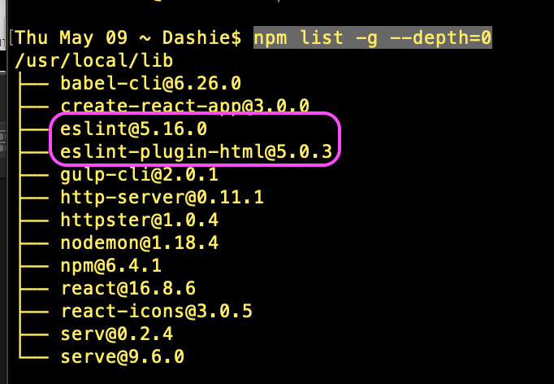
  
  Looks like **it's installed globally.** 
  
  But, it's **also installed locally** since I can see the *ESlint* files in my project directory. That's probably causing issues.
  
  ## ESLint Button
  
  I figured out how to get that little "ESLint" button to show up in the corner:
  
  Put `"eslint.alwaysShowStatus": true` in your user settings in vsc.
  
  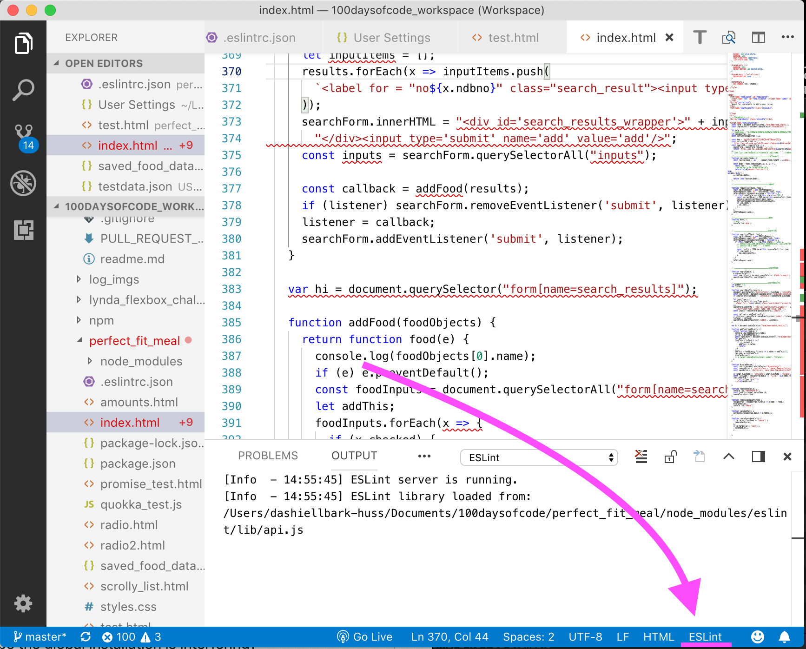
  
  When I click on the ESLint status button button, a tab pops up that shows where my project is getting *ESLint* from:
  
  >[Info  - 14:55:45] ESLint server is running.
  >[Info  - 14:55:45] ESLint library loaded from:
  >/Users/dashiellbark-huss/Documents/100daysofcode/perfect_fit_meal/node_modules/eslint/lib/api.js
  
  So it looks like it's getting it locally. But I'm not sure. Maybe the global installation is interfering?
  
  Also I'm curious where it's getting the ESLint html plugin from, because I saw it both locally and globally. 
  
  I think there's problems with ESLint being local and global. 
  
  ## What To Do?
  
  ### Do I need to install the ESLint prettier plugin both locally *and* globally?
  
  or
  
  ### Do I need to uninstall either my global or local ESLint package so that I only have one package? And then get prettier to work for that?
  
  I'm nervous that if I delete either package, I'll break my `eslint_html_plugin` which took me a while to get to work.

  ## `.eslintrc.json`
  
  I wanted to see if I could find a `.eslintrc.json` file in the global installation of EsLint. To find the global directory:
  
  [Where does npm install packages](https://stackoverflow.com/questions/5926672/where-does-npm-install-packages):
  
  - `npm list -g`
  
  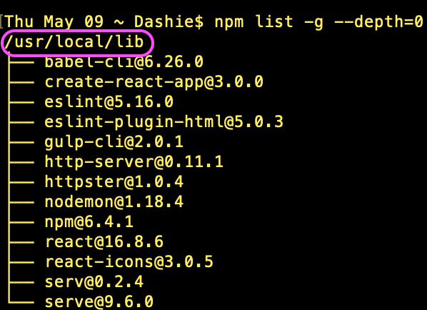
  
  To see this file from the GUI (Finder) I followed this: [how to browse /usr/local directory in finder?](https://discussions.apple.com/thread/5418731)
  
  I didn't see `.eslintrc.json` file in the global eslint directory. So I'm not sure how to add Prettier globally and then how do you configure it? Or do you install it throught he command line globally and then configure it locally? Do you just manually add the `.eslintrc.json` file?
  
  ## Should ESLint be Global or Local?
  
  > We generally recommend installing ESLint and dependencies locally. It makes for a more reliable experience and it's better for collaboration as well.

  *[Kevin Partington platinumazure](https://github.com/eslint/eslint/issues/10533)*

  >If you want to include ESLint as part of your project’s build system, we recommend installing it locally. 
  >...
  >If you want to make ESLint available to tools that run across all of your projects, we recommend installing ESLint globally.
  
  [Getting Started with ESLint](https://eslint.org/docs/user-guide/getting-started)
  
  ## Uninstalling NPM Packages:
  
  I wanted to see how to uninstall ESlint. I found this:
  
  [Uninstalling packages and dependencies](https://docs.npmjs.com/uninstalling-packages-and-dependencies):
  
  - Unscoped packages: `npm uninstall <package_name>`
  - Scoped packages: `npm uninstall <@scope/package_name>`
  
  What does "scoped" mean? Here's the documentation for [npm-scope Scoped packages](https://docs.npmjs.com/misc/scope), but this is over my head. Is my ESLint scoped? I think not:
  
  > The scope folder (@myorg) is simply the name of the scope preceded by an @ symbol, and can contain any number of scoped packages.
  *[npm-scope Scoped packages](https://docs.npmjs.com/misc/scope)*
  
  ESlint isn't preceded by an **@** symbol *so I think it's **not** a scoped package.*
  
- ## Thoughts & Feelings:
  These packages keep running me into trouble. I don't really understand how they work. I'm not sure how to get more practice with them or what resources to use to understand them. I was watching an npm tutorial but I feel like it skipped a lot of information. Maybe I need to finish that tutorial. But then how to I get hands on practice/experience with these packages?

## Day 28, R2
### 5/8/19

- ## Recipe Calculator
  ## Custom Type Ahead
  
  I got the custom type-ahead to select the suggestion when it is either clicked or `enter` is pressed. 
  
  I changed around the event listeners:
  
  ```javascript
  foodInput.addEventListener('keyup', displaySavedFoods);
  form.addEventListener('keydown', formHandler);
  suggestions.addEventListener('mouseover', changeFocus);
  suggestions.addEventListener('click', searchSuggestedFood);
  ```
  Now, `changeFocus` is called on the `suggestions` list element, before it was called on `form`, which `suggestions` is a child of. I think it reads better.

  I also had to change the callback for `form.addEventListener('keydown',...` from `traverseFocus` to `formHandler`. This is because `form.addEventListener('keydown',...` now has two possible callbacks: `traverseFocus` or `searchSuggestedFood` depending on what key the user pressed.
  
  I also cleaned up irrelevent css and but my css in a separate file. 
  
  Thanks to [Philippe Vaillancourt
@snowfrogdev](https://twitter.com/snowfrogdev) and [Giuseppe 🇮🇹
@montyDev_](https://twitter.com/montyDev_) for the ideas to clean up the CSS and move the event listener to a different element.
  
  ## Added Documentation for Type-ahead Search
 
  I'm calling this a finished project! 
  
  It's just one part of my larger project, but I the search feature it might help others with their projects so I put it out with documentation.
  
  You can go to [Type-ahead Search](https://github.com/DashBarkHuss/type_ahead_search) to see the complete project, along with the documentation.
  
  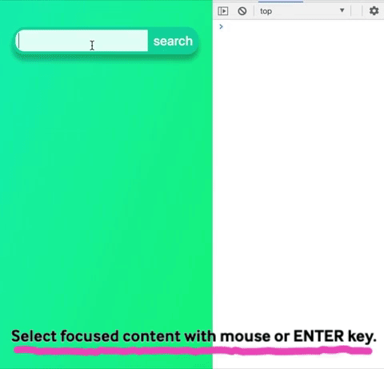

**Link To Work:** [Type-ahead Search](https://github.com/DashBarkHuss/type_ahead_search)

- ## Thoughts & Feelings:
  Lately I haven't had to take much breaks. For the most part, I've sped through my two hours of coding with no breaks. Maybe coding is getting more habitual, and my brain needs less breaks because coding is less effortful for me now. Maybe it's because I raised my calories and my brain has excess fuel? I hope it's not that, because that means when I do a cut, my brain will need more breaks.

## Day 27, R2
### 5/7/19

- ## Recipe Calculator
  ## Custom Type Ahead
  
  Today I created two event listeners that change the focus to different suggestions in the type-ahead feature.
  
  ```javascript
  form.addEventListener('keydown', traverseFocus);
  ```
  `traverseFocus()` traverses through the suggestions when you press the up or down arrow.
  
  ```javascript
  form.addEventListener('mouseover', changeFocus);
  ```
  
  `changeFocus()` changes the focus to whatever suggestion you mouseover.
  
  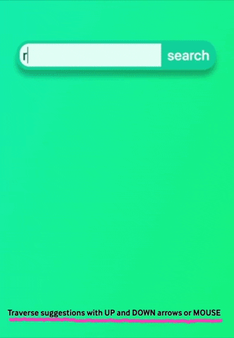
  
  ## Focus
  
  I used the [`focus()` method](https://developer.mozilla.org/en-US/docs/Web/API/HTMLElement/focus) to set the focus.
  
  I used the [.activeElement property](https://developer.mozilla.org/en-US/docs/Web/API/DocumentOrShadowRoot/activeElement) to find the last element that had focus in order to traverse the suggestions.
  
  ## To Do
  
  I still have to add functionality for when you select a suggestion.
  

**Link To Work:** [Type Ahead Search, not finished](https://github.com/DashBarkHuss/type_ahead_search/tree/5699e5a8a6580426cea92c5d07808d8bdd87a5b5)
  

## Day 26, R2
### 5/6/19

  
- ## Recipe Calculator
  ## Custom Type Ahead Conditionals
  I got my conditionals working. In "link to work."
  
  ## Functionality
  I started working on the functionality of the 'type ahead' feature. The up and down arrows should traverse the options and enter should select it. Mouse should work too. I'm not posting it cause it's a mess still. 
  
  This is going to be a short post today because I'm in a hurry to get to my host's house.
  
**Link To Work:** [Type Ahead Search, not finished](https://github.com/DashBarkHuss/type_ahead_search/tree/a74f0cfdf79e954a85ba00ee050fe57f4606ffd4)


## Day 25, R2
### 5/5/19

- ## Recipe Calculator
  Today we're moving the type ahead output from the console to the UI. This type ahead feature suggests foods to search form a list of saved foods in a json file.
  
  ## Custom Type Ahead UX
  
  I wasn't sure about the UX for the type ahead feature. Should choosing a suggested entry *search* that entry? Or should it *select* that entry and add it to the recipe? I decided to copy what the [USDA database](https://ndb.nal.usda.gov/ndb/search/list) does.
  
  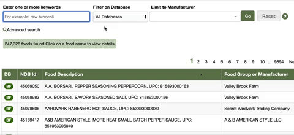
  
  If you select the suggestion it searches the suggestion. It doesn't choose that entry, which on the USDA database would mean taking you directly to that entries nutrient page.
  
  
  ## Conditionals Not Right
  
  I need to redo my conditional statements so that the `#suggestions` div doesn't display anything when there's no input in the search field. This doesn't work quite right:
  
  ```javascript
  async function displaySavedFoods(){
  const foods = await fetch("saved_food_data.json").then(x=>x.json()).then(x=>x.foods);
  const searchTerm = foodInput.value;

  const filtered = filter(foods, searchTerm);
  const filteredChanged = filtered.length != lastFiltered.length;
  if (filteredChanged){
       const div = document.querySelector("#suggestions");
       div.innerHTML="";
       div.style.width = `${foodInput.offsetWidth}px`;
       if(searchTerm==""){
         lastFiltered="";
         return;
       } else {
         filtered.forEach(x=>div.innerHTML+=`<li>${x.name}</li>`);
         lastFiltered = filtered;
       }
     }
  }
  ```
  
  
  As you can see, even though I have no input in the text field at the end of this gif, the `#suggestions` div still displays.

**Link To Work:** [Type Ahead Search, not finished](https://github.com/DashBarkHuss/type_ahead_search/tree/644753d33806dd4994883e68d4177c2182a9be67)


## Day 24, R2
### 5/4/19

- ## Recipe Calculator
   May the 4th and day 24th be with you!
   
  ## Devtools Console + Sources
  
  To open the **console** and **sources** at the same time:
  
  Press `esc` while on the **Sources Panel**
  
  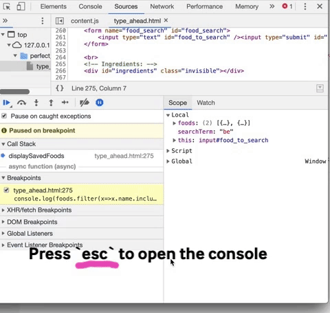
  
  ## Custom Type Ahead
  
  I got my custom type-ahead to pick the correct saved foods. But right now it just logs the results to the console. 
 
  ```javascript
  const form = document.querySelector("form[name=food_search]");
  foodInput = form.querySelector("#food_to_search"); //food search input
  let lastFiltered=[];
  
  async function displaySavedFoods(){
  const foods = await fetch("saved_food_data.json").then(x=>x.json()).then(x=>x.foods);
  const searchTerm = foodInput.value;
  const filtered = filter(foods, searchTerm);
  const filteredChanged = filtered.length != lastFiltered.length;
  if (filteredChanged){
    console.log("%cFiltered:", "color:red;font-size:20px;");
    filtered.forEach(x=>console.log(x.name));
    lastFiltered = filtered;
  }
  }

  function filter(foods, searchTerm){
    let filtered = foods;
    const terms = searchTerm.split(" ").map(x=>x.toLowerCase());
    for(i=0; i<terms.length; i++){
      filtered = filtered.filter(food=>food.name.toLowerCase().includes(terms[i]));
    }
    return filtered;
  }
  
  foodInput.addEventListener('keyup', displaySavedFoods);
  ```
  
  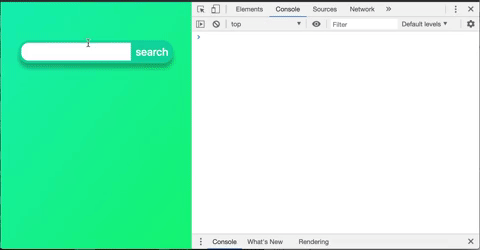
  
  I tried to use regex for this but had trouble. I think regex would improve the performance of the algorithm.

## Day 23, R2
### 5/3/19

- ## Async, Ajax, Promises
   Was confused why `getData()` was returning a promise when 'name' is not a promise. I did the same lines of code that are in my `getData()` function, in the console to compare what `name` returns in the console with what `getData()` returns.

  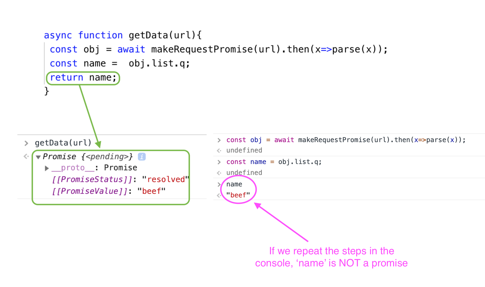
  
  Oddly, you can only use `await` inside a function with the `async` keyword. So, I'm not sure how it's working in my console, but it is.
  
  ## Async Always Returns a Promise
  
  This is why `getData()` returns a promise:

  >The word “async” before a function means one simple thing: a function always returns a promise. Even If a function actually returns a non-promise value, prepending the function definition with the “async” keyword directs JavaScript to automatically wrap that value in a resolved promise.
  
  *[Async/await](https://javascript.info/async-await)*
  
  ## Loading in Parallel vs in Sequence
  
  In the [Fun Fun Function Async/Await video](https://youtu.be/568g8hxJJp4?t=991) the instructor says that in his async/await example the images are being loaded in *sequence* and in the promise example they are being loaded in *parallel*.
  
  I read a little more about that here: [JavaScript Async/Await: Serial, Parallel and Complex Flow](https://techbrij.com/javascript-async-await-parallel-sequence)
  
  Still not quite sure what that means, but I have more of a broad idea now.
  
- ## Recipe Calculator
  ## Custom Type Ahead
  
  I went back to my type-ahead problem for my recipe calculator. This is the one chrome does automatically. But I want my custom type-ahead to pull from a list of saved ingredients.
  
  ### Chrome's Type-Ahead
  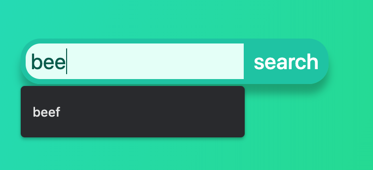
  
  I ended up using async/await for this. 
  
  I also realized that async/await can help with debugging because it's easier to debug with sequencial code. But I'm not sure if that really makes sense. 
  
  I didn't finish. I should start commiting my work again, but not today.  

## Day 22, R2
### 5/2/19

- ## Async, Ajax, Promises
  I read this article that I started yesterday:
  
  [Async, Callback & Promise](https://medium.com/front-end-weekly/ajax-async-callback-promise-e98f8074ebd7)
  
  It also talked about CORS and JSONP which I'm still new to.
  
  ## Async Call Values
  
  Yesterday I learned:
  
  > you cannot return from an asynchronous call inside a synchronous method.
  
  *[How To Return Value from an Asyncronous Callback Function](https://stackoverflow.com/questions/6847697/how-to-return-value-from-an-asynchronous-callback-function)*
  
  So today I redid my AJAX call. It pushes the data to an array instead of tryin to return the data.
  
  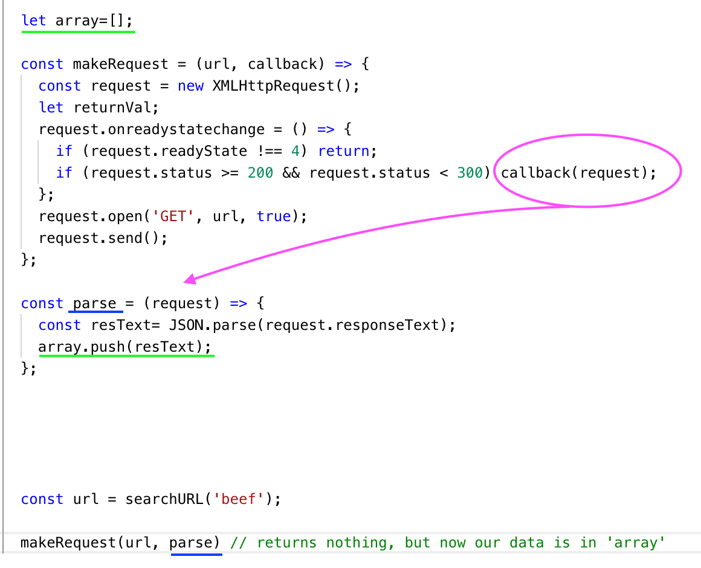
  
  ## Redo Above With Promise:
  
  I redid the above with a promise.
  
  
  
  ## Async Await
  I went back to [this video by Fun Fun Function about async/await](https://www.youtube.com/watch?v=568g8hxJJp4) to learn about async/await now that I've played with promises more.
  
  I like this definition the instructor gives about async/await:
  
  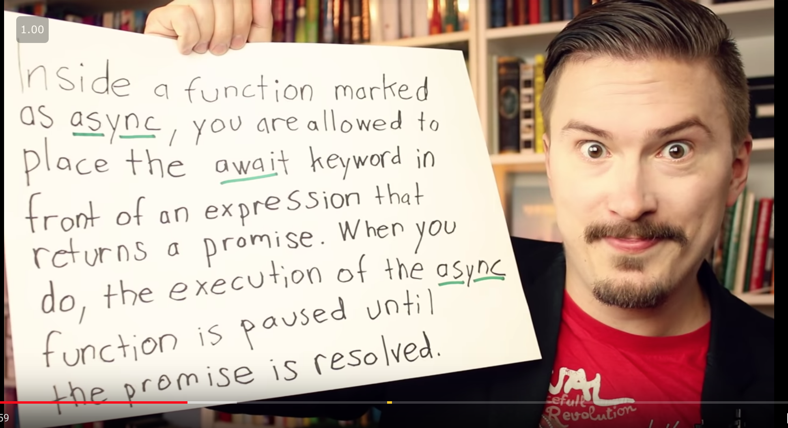
  
  I played with async/await a bit.

## Day 21, R2
### 5/1/19

- ## Promises
  
  I played with this function that returns a promise of an XMLHttpRequest.
  
  ```javasript
  const makeRequestPromise = (url) => {
    const request = new XMLHttpRequest();

    return new Promise((resolve, reject) => {
      request.onreadystatechange = () => {
        if (request.readyState !== 4) return;
        if (request.status >= 200 && request.status < 300) {
          resolve(request);
        } else {
          reject(new Error({
            status: request.status,
            statusText: request.statusText,
          }));
        }
      };
      request.open('GET', url, true);

      request.send();
    });
  };
  ```
  
  It helped me see how promises work and `.then()`
  
  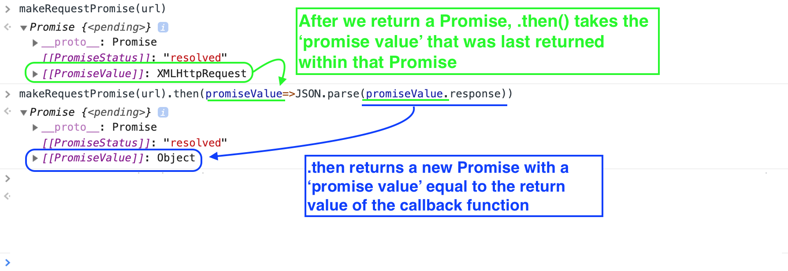
  
  ## Return Value Asyncronous Callback
  
  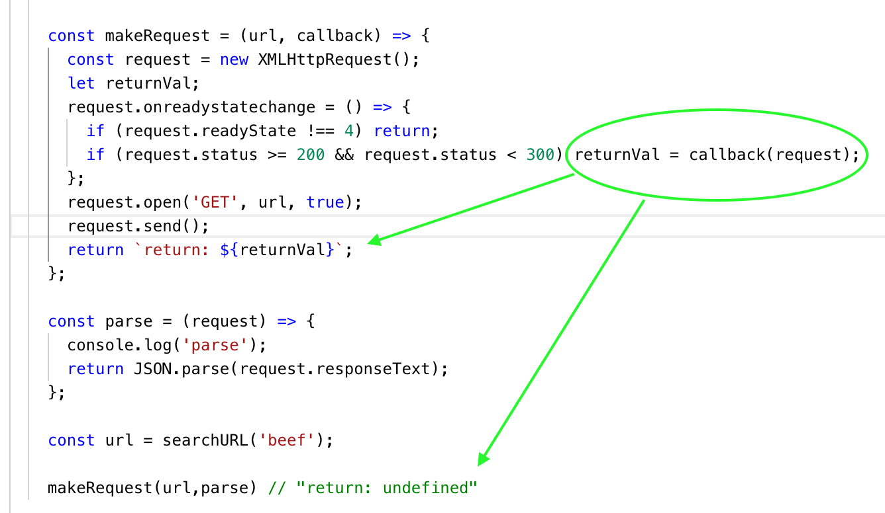
  
  > you cannot return from an asynchronous call inside a synchronous method.
  
  *[How To Return Value from an Asyncronous Callback Function](https://stackoverflow.com/questions/6847697/how-to-return-value-from-an-asynchronous-callback-function)*
  
  ## Promises vs AJAX & Callbacks
  
  Still trying to sort these out. Here's some resources I'm looking at.
  
  >You are confused about promises and Ajax calls. They are kind of like apples and knives. You can cut an apple with knife and the knife is a tool that can be applied to an apple, but the two are very different things.
  >
  >Promises are a tool for managing asynchronous operations. They keep track of when asynchronous operations complete and what their results are and let you coordinate that completion and those results (including error conditions) with other code or other asynchronous operations. They aren't actually asynchronous operations in themselves. An Ajax call is a specific asynchronous operation that can be used with with a traditional callback interface or wrapped in a promise interface.

  *[What's the Difference Between Promise and Ajax](https://stackoverflow.com/questions/39751395/whats-the-difference-between-promise-and-ajax)*
  
  [Async, Callback & Promise](https://medium.com/front-end-weekly/ajax-async-callback-promise-e98f8074ebd7)
  
  

## Day 20, R2
### 4/30/19

- ## Fetch API

  ### Warning, I was confused during this word vomit:

  I was examing the the Fetch API and I wanted to know what `.json()` does. I couldn't find it in the Promise directory (`console.dir(Promise)`). I found out [.json()](https://developer.mozilla.org/en-US/docs/Web/API/Body/json) is a [method on the Body mixin](https://developer.mozilla.org/en-US/docs/Web/API/Body) of the Fetch API.

  ## Mixins
  >As defined in Wikipedia, a mixin is a class that contains methods for use by other classes without having to be the parent class of those other classes.
  
  *[Mixins](https://javascript.info/mixins)*
    
  ```javascript
  // mixin
  let sayHiMixin = {
    sayHi() {
      alert(`Hello ${this.name}`);
    },
    sayBye() {
      alert(`Bye ${this.name}`);
    }
  };

  // usage:
  class User {
    constructor(name) {
      this.name = name;
    }
  }

  // copy the methods
  Object.assign(User.prototype, sayHiMixin);

  // now User can say hi
  new User("Dude").sayHi(); // Hello Dude!
  ```
  
  In the example above, we see the mixin methods in the `Users` prototype.
  
  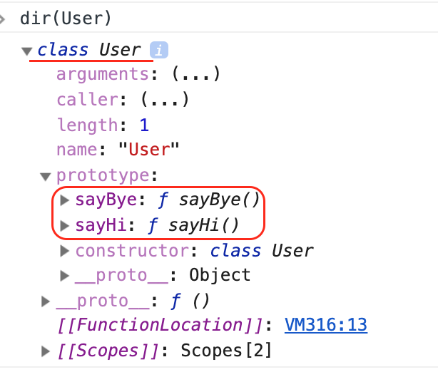
  
  But I don't see that in the Promise directory.
  
  >The Body mixin of the Fetch API represents the body of the response/request...
  >
  >Body is implemented by both Request and Response
  
  *[Body, Mozilla Docs](https://developer.mozilla.org/en-US/docs/Web/API/Body)*
  
  ### Unconfused:
  
  **Oh duh**, it's on the ***Fetch API**, not a method on **Promise!*** I was confusing Promise with the Fetch API.
  
  [Fetch API](https://developer.mozilla.org/en-US/docs/Web/API/Fetch_API):
  
  > Fetch provides a generic definition of Request and Response objects (and other things involved with network requests).
  
  [Request](https://developer.mozilla.org/en-US/docs/Web/API/Request)
  
  [Response](https://developer.mozilla.org/en-US/docs/Web/API/Response)
  
  The [Body methods](https://developer.mozilla.org/en-US/docs/Web/API/Body#Methods) **are** in the Response directory for example. Same with Request.
  
  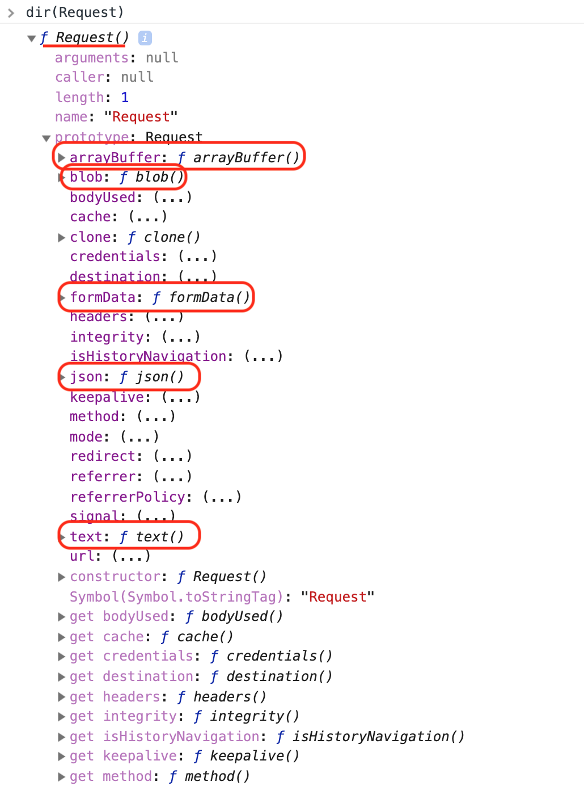
  
  
  I'm less confused but still kind of confused with how all of these relate.
  
  >The fetch() method takes one mandatory argument, the path to the resource you want to fetch. It returns a Promise that resolves to the Response to that request, whether it is successful or not...
  > 
  >Once a Response is retrieved, there are a number of methods available to define what the body content is and how it should be handled (see Body).
  
  A little more clear.
  
  ## Promises
  
  >Essentially, a promise is a returned object to which you attach callbacks, instead of passing callbacks into a function.
  
  *[Using Promises](https://developer.mozilla.org/en-US/docs/Web/JavaScript/Guide/Using_promises)*
  
  Theres an example on that page of a Promise with attached callbacks vs passing callbacks into a function.
  
  To understand the difference between Promises and regular XHR I looked at this [page on how to combine XHR and promises](https://gomakethings.com/promise-based-xhr/). I followed along and made this Promise based XHR. Then I made a regular XHR. Tomorrow, I'll play around with them.
  
- ## Thoughts and Feelings:
  Sometimes writing my thoughts out in my log can help me understand what I'm thinking and why I'm confused. 
  
  I need to remember that when I feel like I don't want to code because something is hard, that feeling will soon pass. And come again. And pass again.
  
## Day 19, R2
### 4/29/19

- ## Helping
  I helped someone today on twitter. They sent their code and I showed them what each line was doing and where they had a typo:
  
  **Typo:**
  <hr>
  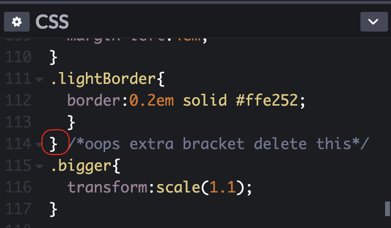
  
  **Step Through:**
  <hr>
  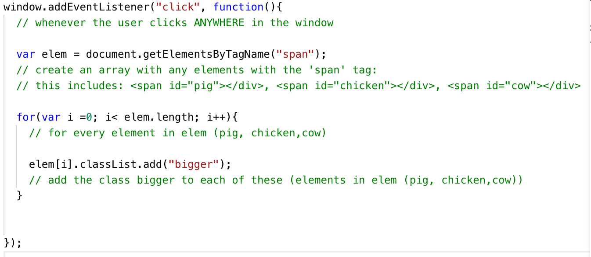
  

- ## Toggle Eslint
  I couldn't find a built-in way to do this but I found this [Setting Toggle extension by Ho-Wan](https://marketplace.visualstudio.com/items?itemName=Ho-Wan.setting-toggle).
  
  I set my user settings to toggle the `eslint.enable` setting.
  
  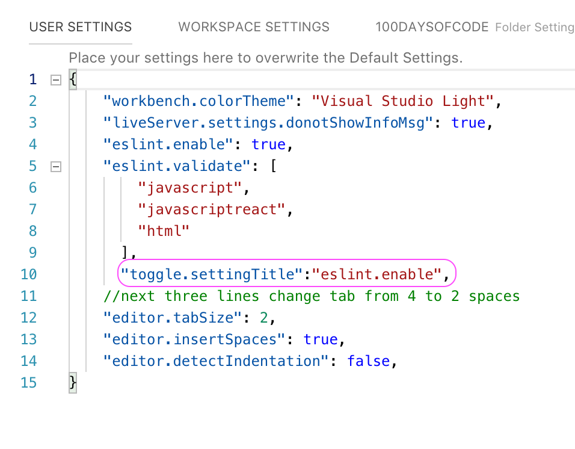
  
  Then I can press this button to turn Eslint on and off.
  
  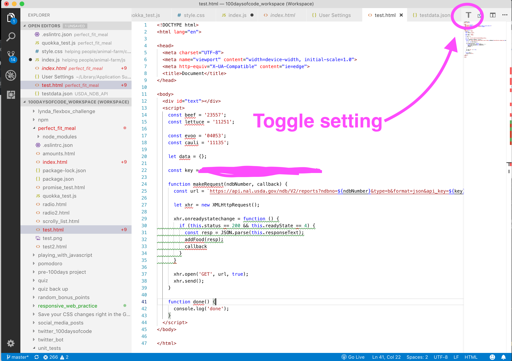
  
- ## What Happen To My Log
  
  I looked at my old log and the markdown is not rendering:
  
  https://github.com/DashBarkHuss/100-days-of-code/blob/master/r1-log.md
  
  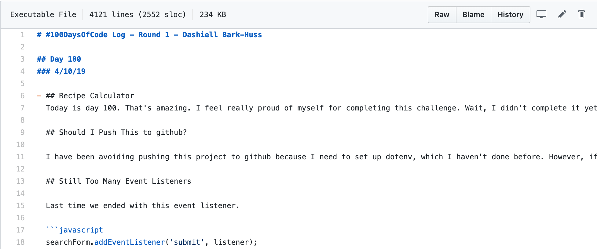
  
  It looks like I'm in edit mode but I'm not. What's up?
  
  Ok I don't know what happened, it's working again.
  
- ## Async/Await & Promises

  I ran into this [exact problem on stackoverflow](https://stackoverflow.com/questions/54082327/why-does-logging-the-result-of-fetch-break-it-body-stream-is-locked) with `fetch()`. I get this error when I try to `console.log` the promise: `Uncaught (in promise) TypeError: Failed to execute 'json' on 'Response': body stream is locked`
  
  The reason is because:
  
  >.json() (and .body(), .text()) may only be called once.
  >
  >The HTTP request is modeled as a stream, and you can't really read from a stream twice.

- ## Thoughts and Feelings:
  Coding was hard today because I was hungry and freezing in the super cold cafe.

## Day 18, R2
### 4/28/19

- ## NPM
  ## Lynda: Learning npm the Node Package Manager
  ### Notes:
  **--save-dev** is used to save the package for development purpose. 
  
  **Where global packages are stored on Mac** /user/local/lin/node_modules or /user/local/lin/node
  
  **-g or -glabal**: add to `npm install` command to install globally
  
  **How to resolve permissions errors**: [Resolving EACCES permissions errors when installing packages globally](https://docs.npmjs.com/resolving-eacces-permissions-errors-when-installing-packages-globally)

- ## ESLint
  ## ESLint on HTML!
  I decided to go back and try to get ESLint to work on HTML files. 
  
  I found this [stackoverflow thread](https://stackoverflow.com/questions/54138689/how-can-i-get-eslint-to-lint-html-files-in-vscode) on ESlint and HTML files.
  
  One of the answers says:
  >I have this in <projectfolder>/.vscode/settings.json
  >
  >{
  >  "eslint.validate": [ "javascript", "html" ]
  >}
  
  `.vscode` is in the directory for the workspace folder, *not* the project folder. That confused me! I found these settings in that file:
  
  ```javascript
  "eslint.validate": [
    "javascript",
    "javascriptreact"
  ]
  ```
  That file is **read-only** so I added this to the **user settings** panel.
  ```javascript
   "eslint.validate": [
        "javascript",
        "javascriptreact",
        "html"
      ]
  ```
  
  
  ### Success! 
  
  
  
  Glorious red lines!
  
  ## Format in VSC
  
  
  
  ## AirBnb Style Guide
  
  I setup my EsLint to use the [AirBnb style guide](https://github.com/airbnb/javascript).
  
  ### Format Tabs
  AirBnb format uses 2 spaces for tabs so I changed my user settings so that tab is 2 spaces not 4. 
  
  [How to customize the tab-to-space conversion factor when using Visual Studio Code?](https://stackoverflow.com/questions/29972396/how-to-customize-the-tab-to-space-conversion-factor-when-using-visual-studio-cod)
  
  ### Functions
  
  I'm noticing that the airbnb style guide has some rules about naming functions. The style guide explains why [here](https://github.com/airbnb/javascript#functions) and [here it talks about arrow functions](https://github.com/airbnb/javascript#arrow-functions).
  
  ## Linting Is FUN!
  Maybe not fun, but this is really helpful! I'm always wondering "How should I best organize my code?" and "How can I make my code more readable?" Linting is like having a teacher over your shoulder telling you what to do and not to do. And then I can look up why in the [AirBnb style guide](https://github.com/airbnb/javascript). This is great! I need to thank that guy from the meetup in Austin!

  ## ESLint Toggle?
  If I want to temporarily toggle off the markings from ESlint; is there a way to do this **quickly**?
  
  I've seen a little ESLint button on the status bar of VSC in other people's setups. But it's not showing up on mine. I wonder if you can toggle ESLint on and off with this.
  
  ### My Status Bar
  <hr>
  
  
  ### Others' Status Bars
  <hr>
  
  
  Couldn't find anything about this in all my searches.
  
## Day 17, R2
### 4/27/19

I decided to look into npm today because I didn't know what I was doing yesterday trying to get ESLint to work. I'll probably be using npm a lot more. Getting more comfortable with npm will help prepare me for learning node.

- ## NPM
  Looked through some of this: [A Beginner’s Guide to npm — the Node Package Manager](https://www.sitepoint.com/beginners-guide-node-package-manager/)

  Watched some of this short a lynda video on package management: [Package Management Basics](https://www.lynda.com/Linux-tutorials/Package-management-Basics/618702/772939-4.html)
  
  Started watching the [Learning npm the Node Package Manager](https://www.lynda.com/Node-js-tutorials/Learning-npm-Node-Package-Manager-2018/761956-2.html) course on lynda.
   
  ## Lynda: Learning npm the Node Package Manager
  ### Notes:

  **package.json:** map for building your project and setting your dependencies.

  **npm init:** base command to initialize a new package.json file.

  **`Cmd` + `Shift` + `.` (dot):** toggle hide/show hidden files

  **locally installed:** When a package is installed locally it's installed on your projects directory.
  
  **globally installed:** When a package is installed globally it will be installed in your system available to all projects.
  
  ## Command Prompt Undo?
  
  I came accross this dilemma and posted it on [stackoverflow](https://stackoverflow.com/questions/55883264/is-it-possible-to-go-back-and-change-the-last-input-you-entered-into-a-command-p)
  
  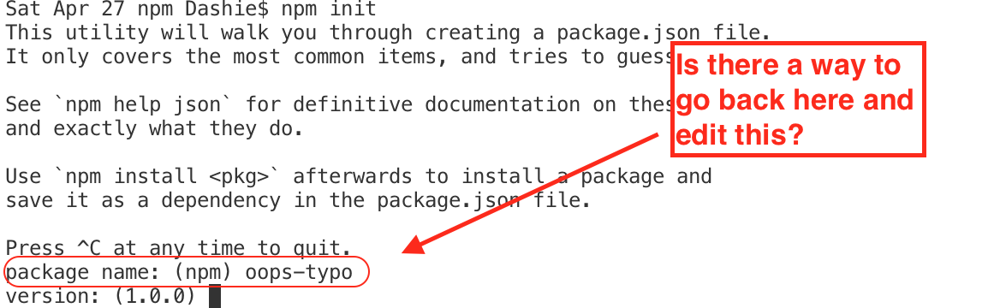

  ## JavaScript Modules: ES6 Import and Export
  The instructor in the lynda tutorial used `import`. I've seen this before but I've never used it.
  
  Here's the [`import` docs page](https://developer.mozilla.org/en-US/docs/Web/JavaScript/Reference/Statements/import).
  
  Here's a video on `import` and `export` that I didn't yet finish: [JavaScript Modules: ES6 Import and Export](https://www.youtube.com/watch?v=_3oSWwapPKQ).


## Day 16, R2
### 4/26/19
- ## Recipe Calculator
  ## Async/Await & Promises
  
  I played around with fetch and promises.
  
  I reviewed this video on promises: [Promises - Part 8 of Functional Programming in JavaScript](https://www.youtube.com/watch?v=2d7s3spWAzo)
  
  Then I started to watch this video on async/await: [async / await in JavaScript - What, Why and How - Fun Fun Function](https://www.youtube.com/watch?v=568g8hxJJp4)
  
  ## VSC Extensions
  In the async await video the instructor uses a cool inline evaluation tool called [Quokka](https://quokkajs.com/). I wanted to use it too but after downloading it following the [Quokka documentation](https://quokkajs.com/docs/) and the [Manage Extensions in Visual Studio Code](https://code.visualstudio.com/docs/editor/extension-gallery) page, I realized that to do what the teacher is doing I need the pro version. So forget quokka.
  
  ## ESLint
  
  I also added the ESLint extension and the Beautify extension.
  
  To set up ESLint I followed this: [Eslint setup in Visual Studio Code](https://www.youtube.com/watch?v=o2H8kvuwMKE). The process was a little different for me, so the video might be a little out of date. 
  
  ## ESLint on HTML Files
  I realized ESLint doesn't work on javascript sections on HTML files. It only works on .js files. However, you can add the [eslint-plugin-html](https://github.com/BenoitZugmeyer/eslint-plugin-html) to get ESLint to work on html files.
  
  ## Not Working on HTML Files
  I'm having trouble getting this to work. I'm not sure what this means, in the [docs](https://github.com/BenoitZugmeyer/eslint-plugin-html)
  
  > Note: by default, when executing the eslint command on a directory, only .js files will be linted. You will have to specify extra extensions with the --ext option. Example: eslint --ext .html,.js src will lint both .html and .js files in the src directory.
  
  I'm not sure what the `src` file should be in `eslint --ext .html,.js src`. I tried a path that goes out of my currect directory and back in like this:
  
  `perfect_fit_meal Dashie$ eslint --ext .html,.js ../perfect_fit_meal`
  
  But that didn't work. Now sure what to put there.
  
  I tried going out of the directory and then using the full path:
  
  `Fri Apr 26 ~ Dashie$ eslint --ext .html,.js /Users/dashiellbark-huss/Documents/100daysofcode/perfect_fit_meal`
  
  That didn't work. I tried it again after installing the extension glolablly and that still didn't work.
  
## Cows Showed Up While I Was Coding
  


## Day 15, R2
### 4/25/19
- ## Recipe Calculator
  
  ## #100DaysOfMath
  In addition to the coding, I added 30 minutes of math study to complement #100daysofcode. I need some math skills for this app. I need to understand a math subject called *optimization*. 
  
  I talked to a twitter peer, Ross Mason, who said he under estimated the amount of math he needs for AI. Since I want to learn AI, I figured I'd start now brushing up on my math.
  
  So I'm doing a mini, not-so-serious, #100DaysOfMath. By not-so-serious I mean I probably won't post about it and I might skip days. It depends on what seems to be a priority on that day. I don't want to take on too much extra study, and then fall behind on what's really important.
  
  ## Scrollbar Size
  
  I figured out how to change the scroll bar size, add bottom `margin` to the `-webkit-scrollbar-track`. I added a top margin too because I thought it looked better. 
  
  ```css
  #search_results_wrapper::-webkit-scrollbar-track {
      margin: 4% 0 var(--add-button-height);
  }
  ```
  
  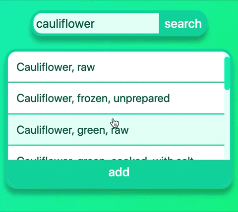
  
  ## Promises & Fetch
  
  I worked on changing my `XMLHttpRequest`s to `fetch()` calls so I can work with promises. I also want to have a pedictive type ahead feature in my search bar like Wes Bos does in [Javascript30](https://courses.wesbos.com/account/access/5c51dab432bb6d664e015352/view/194130156). The problem is I don't think I can do one request for all food names and then just filter throught them, like Wes does. The NDB limits the number of items in a single request. Maybe there is a work around.

## Day 14, R2
### 4/24/19

- ## Recipe Calculator
  ## Overriding User Agent Stylesheet Issue

  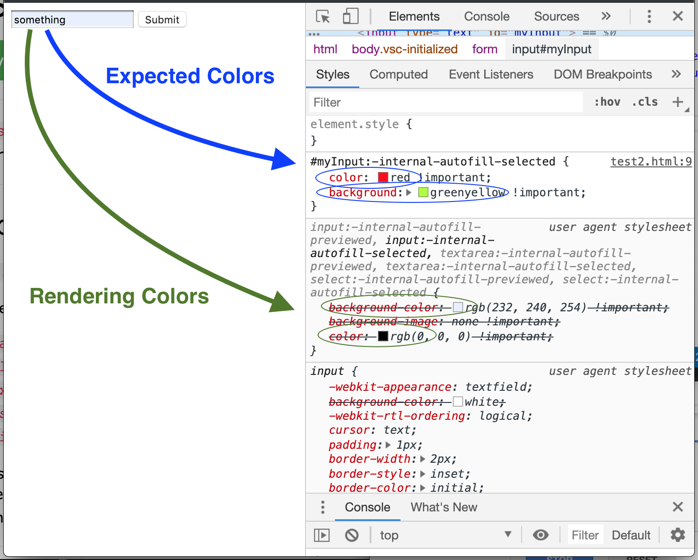
  
  Both of these pages show a workaround, but I didn't find an explanation for why this happens:
  - https://css-tricks.com/snippets/css/change-autocomplete-styles-webkit-browsers/
  - https://mariusschulz.com/blog/how-to-remove-webkits-banana-yellow-autofill-background
  
  ### Workaround:
  
  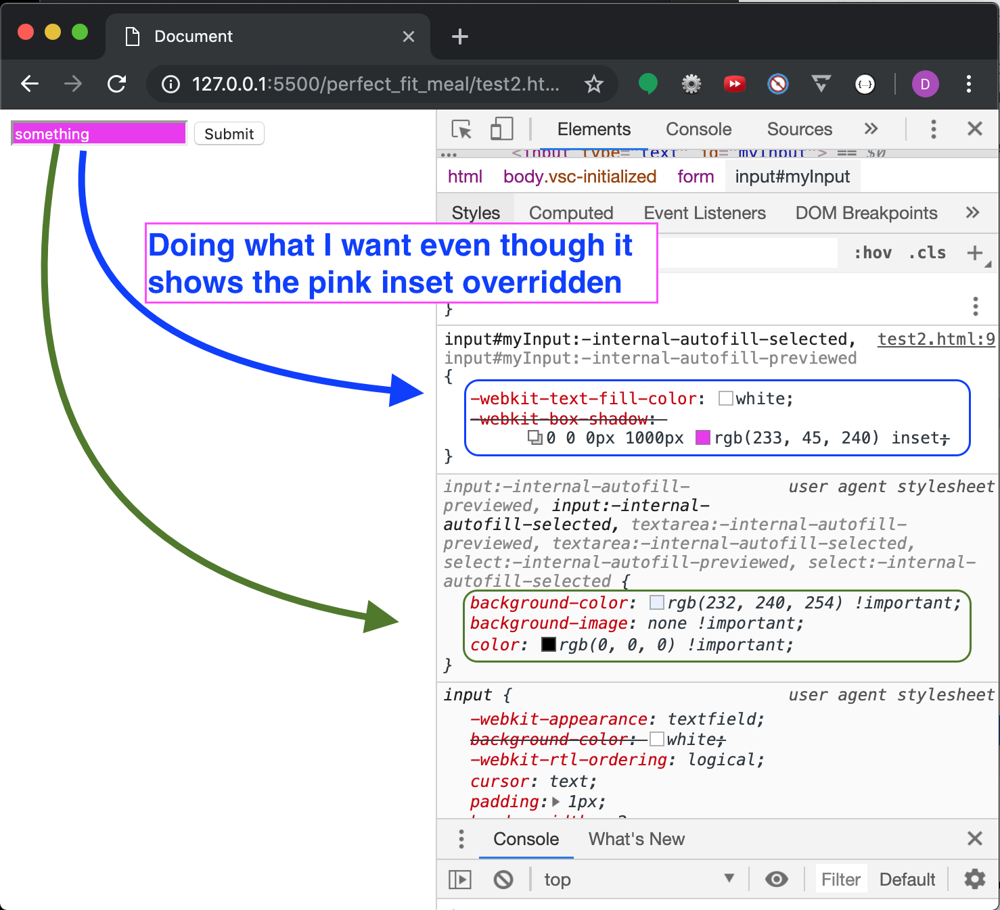
  
  Now it's working in my app!
  
  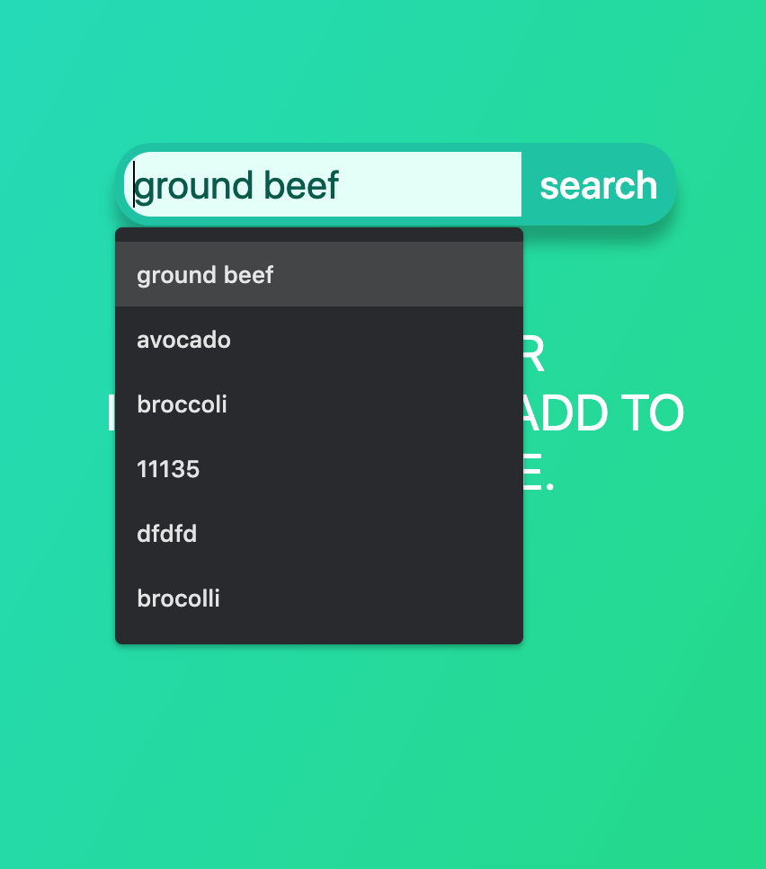
  
  ## Scroll Bar
  
  I ended trying to add a scrollbar to the box that contains food search results. This way the user knows they can scroll.
  
  Depending on the browser window size, the user may not realize they can scroll:
  - Obvious Scroll:
     - 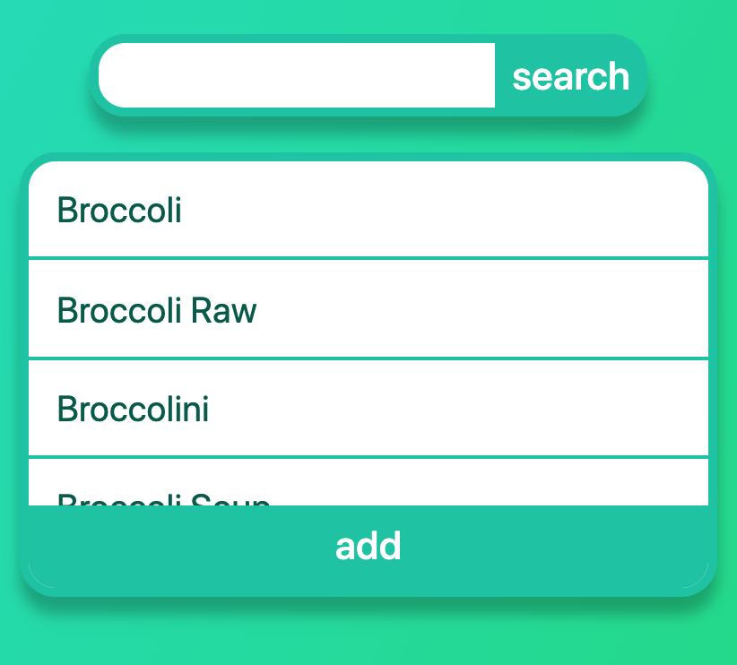
  
  - Unclear Scroll:
    - 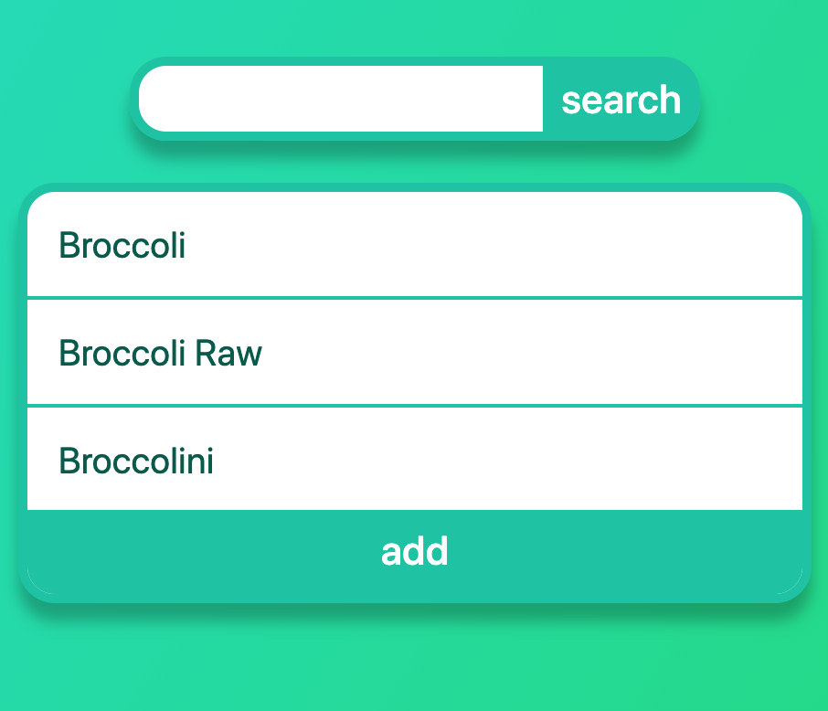
  
  I found [this tutorial](https://scotch.io/tutorials/customize-the-browsers-scrollbar-with-css) which helped me add a scroll bar. 
  
  ### Scrollbar Size
  Now I want to change the size of the scrollbar and scrollbar thumb. I think it might have something to do with `webkit-scrollbar-thumb`.
  
  This might help: https://stackoverflow.com/questions/26493446/change-size-of-scrollbar-thumb-with-css.
  
## Day 13, R2
### 4/23/19

- ## Recipe Calculator
  ## Wrapper Vs Container:
  
  
  >In programming languages the word container is generally used for structures that can contain more than one element.
  >
  >A wrapper instead is something that wraps around a single object to provide more functionalities and interfaces to it.
  
  *[CSS Language Speak: Container vs Wrapper?](https://stackoverflow.com/questions/4059163/css-language-speak-container-vs-wrapper)*
  
  ## Overriding User Agent Stylesheet Issue
  
  I ended with this issue. I'm having trouble over riding the `user agent stylesheet`.
  
  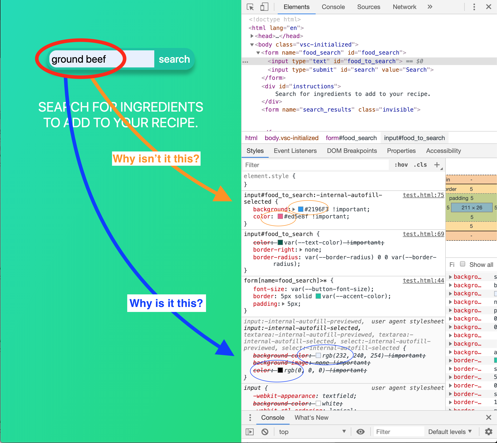
  
  ## Today's End Result
  
  

## Day 12, R2
### 4/22/19

- ## Recipe Calculator
  ## Relative Position & Border Radius
  
  If you have a relative div inside an unpositioned div with rounded corners, you have to add positioning to the container div and z-index.
  
  ### Bad
  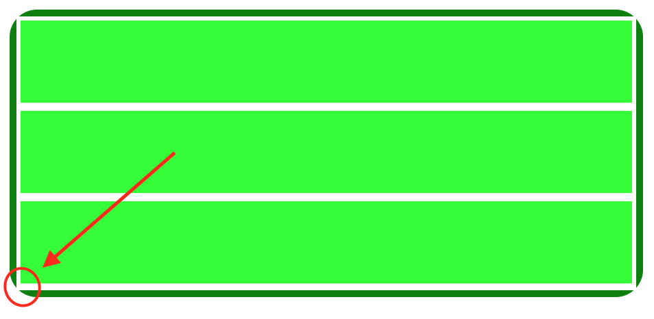
  
  ```css
  #container{
      border: 5px solid green;
      border-radius: 20px;
      height: 200px;
      overflow: scroll;
  }

  .rectangle{
      height: 60px;;
      background: rgb(31, 255, 31);
      border: 3px solid rgb(255, 255, 255);
      position: relative;
  }
  ```
  
  ### Good
  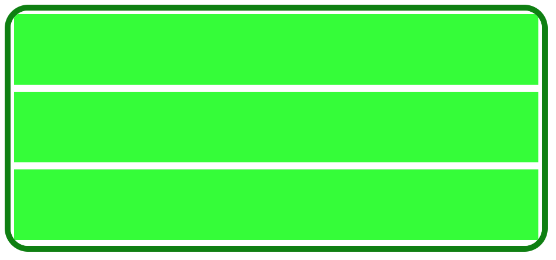
  
  ```css
  #container{
      border: 5px solid green;
      border-radius: 20px;
      height: 200px;
      overflow: scroll;
      position: relative; //________________added
      z-index: 0; //________________________added
  }

  .rectangle{
      height: 60px;;
      background: rgb(31, 255, 31);
      border: 3px solid rgb(255, 255, 255);
      position: relative;
  }
  ```
  ## Absolute Positioned Element in Front of Scroll
  
  This was hard to figure out. Finally got it.
  
  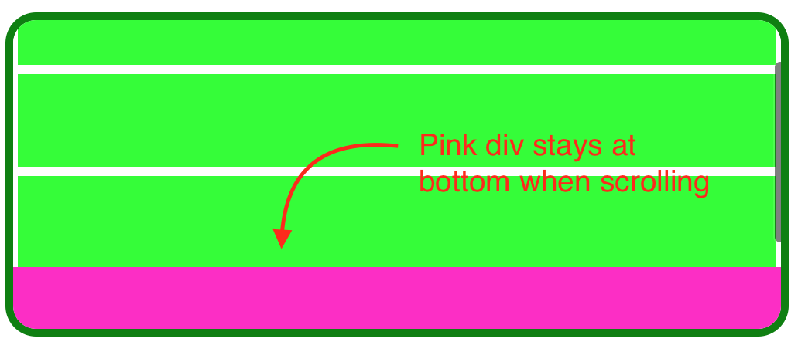
  
  ```css
    #big_container{
      border: 5px solid green;
      border-radius: 20px;
      height: 200px;
      overflow: hidden;
      position: relative;
      z-index: 0;

  }
  #container{
      overflow: scroll;
      position: relative;
      height: 100%;
  }

  .rectangle{
      height: 60px;;
      background: rgb(31, 255, 31);
      border: 3px solid rgb(255, 255, 255);
      position: relative;
  }
  .red{
      background: rgb(255, 31, 199);
      border: none;
      height: 40px;
      position: absolute;
      width: 100%;
      bottom: 0;
  }
  ```
  
  ```html
  <div id="big_container">
      <div id="container">
          <div class="rectangle"></div>
          <div class="rectangle"></div>
          <div class="rectangle"></div>
          <div class="rectangle"></div>
          <div class="rectangle"></div>
      </div>
      <div class="rectangle red"></div>
  </div>
  ```
  ### Push The Last Item Up
  I realized that when you scroll to the bottom the pink element is still covering part of the last item, so I added this css to push the last item up:
  
  ```css
  #container>.rectangle:last-child{
      margin-bottom: 40px;
  }
  ```
  
  ## Form Attribute
  In HTML5, you can use the form attribute to have a form submit button element outside of the respective form element:
  https://stackoverflow.com/questions/6644128/html-input-field-outside-of-form
  
  ## Coded While Driving Through a Dust Storm! 
  

## Day 11, R2
### 4/21/19

- ## Recipe Calculator
  ## Shadow Color
  
  Originally I had a dark green color that matched the hue of the main background color but was a darker green.
  
  ```css
  --shadow: 0px 010px 8px rgb(7, 161, 136);
  --main-hue: rgb(5, 219, 184);
  ```
  
  This colored shadow caused issues. I couldn't use this shadow on other background colors. You don't naturally see dark green shadows on a white background, for example. Thar color of a shadow should change if the background is a gradient of two different colors.
  
  Colored shadows are limited. This green shadow works well on the green side of the gradient, but not the blue.
  
  
  
  Black shadows with low opacity work on all colors.
  
    
  
  So I changed the shadow to black with a very low opacity.
  
  ```css
  --shadow: 0px 010px 8px rgba(0, 0, 0, 0.26);
  ```
  
  Now this shadow will work on any color.
  
  ## White Gap
  
  If you zoom in very close, you can see a white gap between a container that has a border, and the content inside that has a background color.
  
  ```html
  <style>
      #container{
          border: 5px solid green;
          border-radius: 
      }
      #content{
          background: green;
      }
  </style>
  <div id="container">
    <div id="content">
        some content
    </div>
  </div>
  ```
  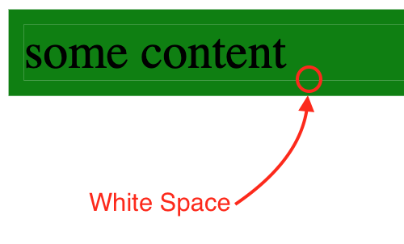
  
  You can't see it when zoomed out.
  
  
  
  However you can see it in the corners when the corners of the divs are rounded.
  
  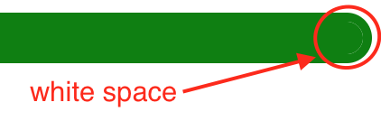
  
  ```html
  <style>
        #container{
            border: 5px solid green;
            border-radius: 20px;
        }
        #content{
            background: green;
            border-radius: 15px; //takes into account 5px border
        }
  </style>
  </head>
  <body>
  <div id="container">
    <div id="content">
        some content
    </div>
  </div>
  ```
  
  ### My solution: 
  Instead of giving the content div a border radius, give the container div an `overflow` of `hidden` or `scroll`. 
  
  ## To Do
  I left off with an issue where the content div is not contained in the container div even with the container is set to `overflow: scroll`. This only happens when the user hovers over the content div which changes the background color.
  
- ## Thoughts and Feelings:
  My log is taking up a lot of my time. I'm not sure if anyone reads it, and I'm not sure how much of it is for me. I think I will cut down on logging. I need to only post the things that will help me, like links that will be helpful later or explanations of concepts I have trouble with and need to remember. 
  
  It might be hard to see when a concept should be logged or not. I probably need a lot less words and explanation than I post now, if I'm going to just log to help myself.
  
  I think it's especially important that I cut down on logging while traveling. My internet & power is limited. I want to learn as much as I can without worrying as much about my log. My log should be a tool to help me, not something that holds me back and takes up my time. Right now it can take longer than an hour just for my log.
  
  I took a break from logging while at Big Bend because there wasn't enough reception out there. I found I got a lot done.


## Day 10, R2
### 4/20/19

  I didn't have internet on this day until the end of the day so my log is sparse.
  
- ## Recipe Calculator
  I worked on css. 
  
  Weird space only appears at difference levels of zoomed in.
  
  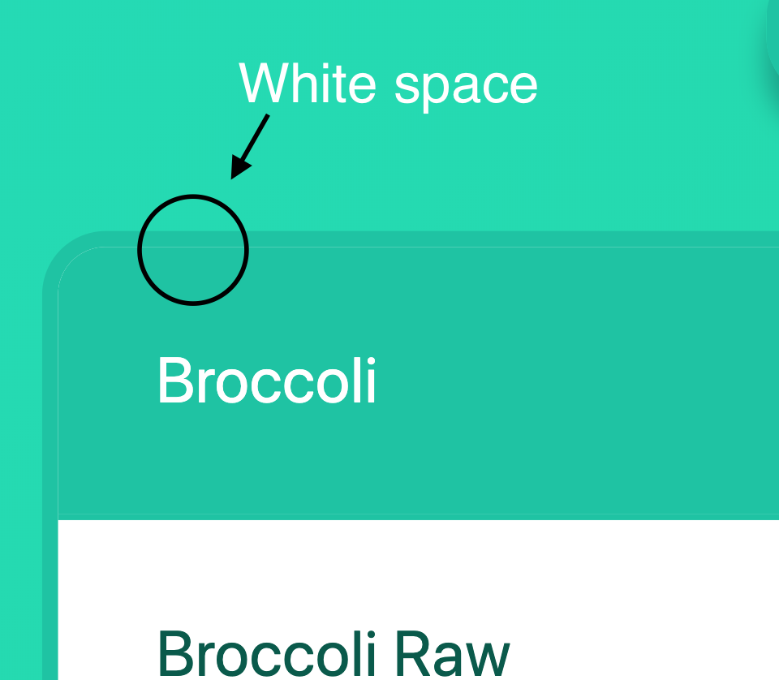
  
  Video of my custom radio inputs:
  
  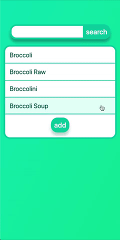


## Day 9, R2
### 4/19/19

  I didn't have internet on this day. I'm writing this on 4/20/19.
  
- ## Recipe Calculator
  I worked on css. 
  
  I learned that the `body` in HTML doesn't start until the first element starts. So if the first element is pushed down it will push the body down from the top of the window too. 
  
  Used `::before` and `:last-of-type`.
  
  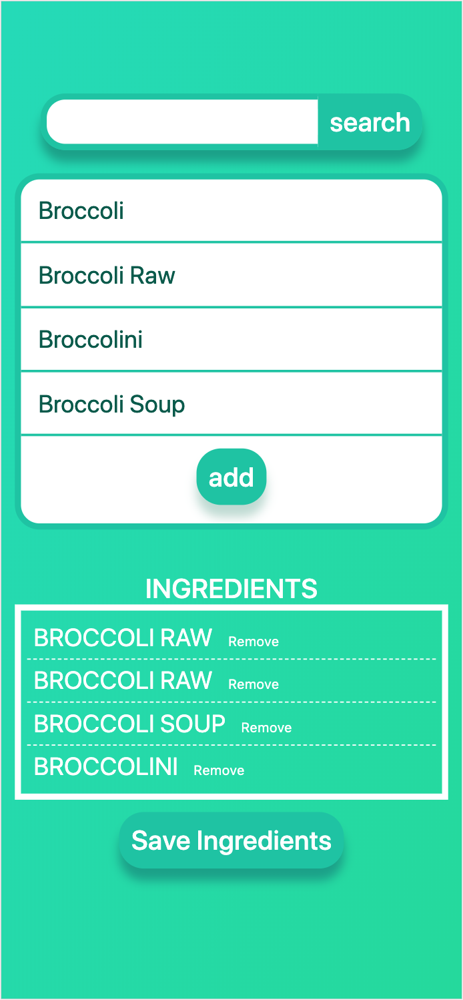

## Day 8, R2
### 4/18/19

  I didn't have internet on this day. I'm writing this on 4/20/19.
  
- ## Recipe Calculator
  I worked on css. 
  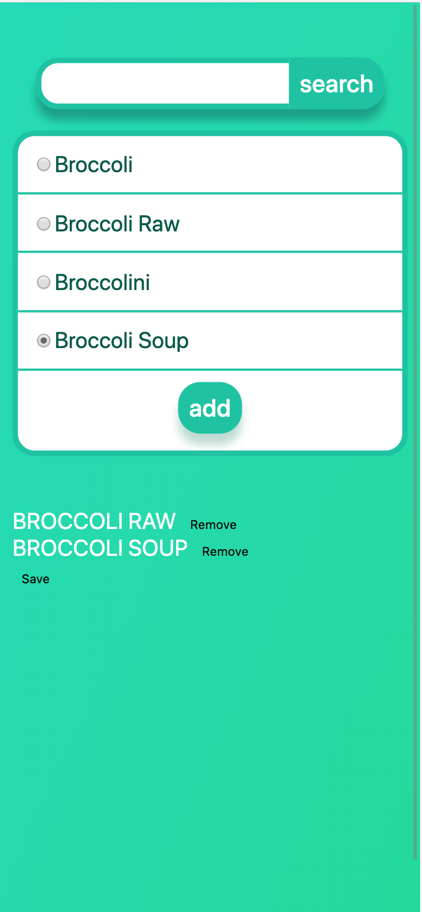

## Day 7, R2
### 4/17/19
  
  I didn't have internet on this day. I'm writing this on 4/20/19.
  
 - ## Recipe Calculator
   I worked on css. 
   
   I worked with css variables.
   
  ```javascript
  :root { //declare variables
    --accent-color: rgb(0, 196, 163);
    --text-color:rgb(2, 90, 75);
    --text-highlight: rgb(227, 255, 247);
    --border-radius: 20px;
    --shadow: 0px 010px 8px rgb(7, 161, 136);
    --white-shadow: 0px 010px 8px rgba(115, 177, 161, 0.473);
    --main-hue: rgb(5, 219, 184);
    --second-hue: rgb(5, 219, 155);
    --button-font-size: 1.1rem;
  }
  
  form[name=search_results] input:hover{  //use variables
      background: var(--text-highlight);
  }

  ```
  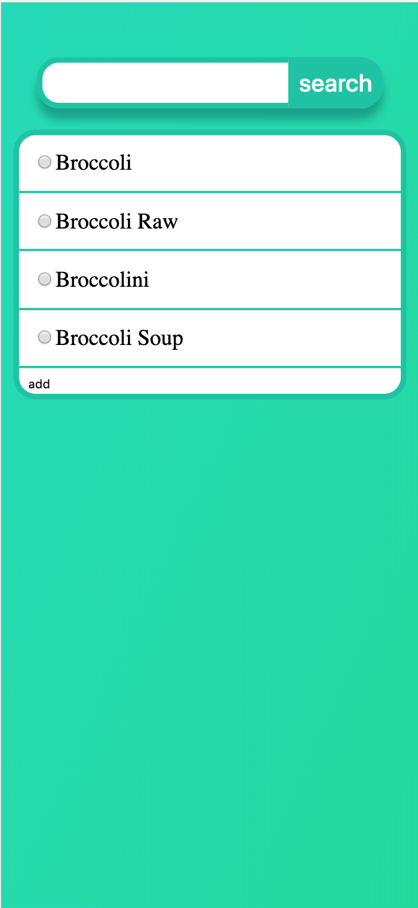

## Day 6, R2
### 4/16/19

  ## Coding With No Internet
  I'm going to Big Bend National Park for a few days. There's a big chance we won't get service out there. So I won't be logging or posting starting in two days or tomorrow. Not sure when our service will cut out. 
  
  To prepare for offline coding I'm downloading the documentation I normally use and w3schools.
  
  ## Offline Documentation
  
  ### JS, CSS, HTML, SVG
  I'm downloading documentation for Javascript, HTML, CSS, and SVG through [Dash](https://kapeli.com/dash). You can download the documentation directly [here](https://kapeli.com/mdn_offline]) but Dash helps with searching through the documentation.
  
  ### W3Schools
  I'm also [downloading W3Schools](http://www.mediafire.com/file/wyhv2wik6ttwfz8/www.w3schools.com.rar). This w3schools is from 2016, so there's a probably a good amount out of date. This one [on micrsoft](https://www.microsoft.com/en-us/p/w3schools-offline-version/9nblggh5792k?activetab=pivot%3Aoverviewtab) might be more recent, but I can't access it because of a login issue but you might be able to. I tried a bunch of other links and they were all a bust.
  
  If you need to search W3schools while offline, search while in the *www.w3schools.com* folder on your computer while "search www.w3schools.com" is selected and only search for html documents.
  
  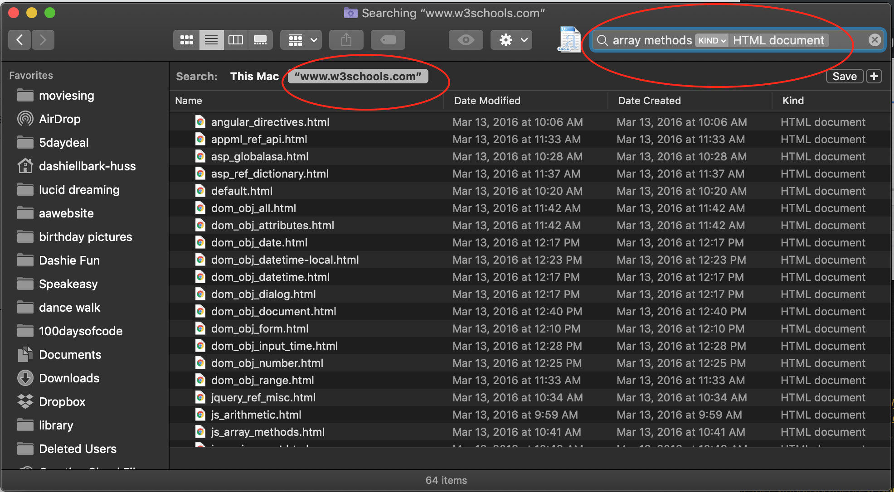
  
  
- ## Recipe Calculator
 
  Our internet is already going in and out as we're drving through Texas. I've already used my offline resources successfully. 
   
  I'm working on the design for the recipe calculator.
  
  I ended with this design in the browser using DevTools. I wonder if there's a way to easily see all the changes I made to the css in DevTools that I added to "element.style" for a bunch of different elemets. I wasn't able to find them and save these changes. But it will be easy to recreate.
   
  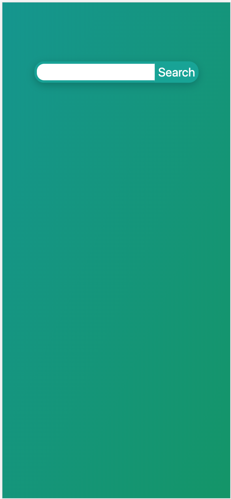
  
  ## Saving CSS From DevTools
  
  I didn't yet try this but this looks helpful:
  
  - [Save your CSS changes right in the Google Chrome inspector](https://rafaltomal.com/tips/save-css-chrome-inspector/)

## Day 5, R2
### 4/15/19

- ## Recipe Calculator
  
  ## EMathHelp Might Not Help
  
  I thought [eMathHelp](eMathHelp](https://www.emathhelp.net/calculators/algebra-2/system-of-linear-equations-calculator/)) was gonna help me figure this out, but it only works when the number of variables is the same as the number of equations. 
  
  The number of equations corresponds to the number of nutrients I'm tracking(fat, carbs, protein, etc) and the number of variables corresponds to the number of ingredients(brocolli, beef, whatever you like). Obviously, we're not going to limit the number of ingredients just because we only want to track 3 nutrients.
  
  The fact that the site can't calculate this makes me wonder if it's really complicated to solve what I'm trying to solve. Otherwise, they'd probably program it to work. I'm guessing we can't follow the steps thay take.
  
  ## Back To Asking For Help
  
  Well, I hit a wall but I've learned a bit more. Time to update my posts and get some help.
  
  ### Updated Simbi & Quora Post
  
  I rewrote my question on [simbi](https://simbi.com/dashiell-bark-huss/math-help).
   
  I also posted it on [quora](https://www.quora.com/unanswered/How-can-I-find-the-closest-possible-positive-values-to-solve-a-system-of-equations-for-many-variables-and-equations). Details in comments.
  
 
  ### Email
  I also emailed my mother in law's friend who is a math professor who I already was in contact with:
  
  >Hey Joanne,
  >
  >Here's my updated question on Simbi with the new knowledge I've acquired: https://simbi.com/dashiell-bark-huss/math-help.
  >
  >To summarize: How can I find the closest possible positive values to solve a system of equations for many variables and equations?
  >
  >Context, I've had very little math experience in the last 10 years. I'm trying to write a program that uses this math. 
  >
  >Any thoughts are appreciated.
  >
  >-Dash 
  
  I was trying to be succinct but polite. Hopefully these emails and questions will help you by giving you an example of how you might ask a question which is why I'm including them in my coding blog.
  
  ## Where Now?
  
  I'm already getting some answers back and this looks majorly complicated. Maybe I should have clarified that I haven't done any math in ten years. I'm considering partnering with a math person for this project. What do you do when you need help? 
  
  - When should you outsource?
    - pay someone? 
    - get free help?
    - partner with someone?
    
  - When should you learn the subject? 
  
  If it's hard, it's worth doing, right? Whatever means it takes.
  
  I'm gonna take a break and work on css or something fun and cute. 
  
  ## CSS
  I played around with css for the last half hour of my two hour session. I looked at code pen for ideas.
  
  ## Search Bar
  I changed my search and input so it's cuter.
  
  ### Before:
  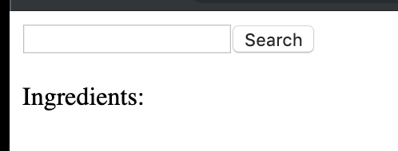
  
  ### After:
  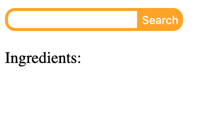
  
  ## Get Rid Of The Space Between Text Input and Submit
  
  Here's some [tricks for getting rid of the space](https://css-tricks.com/fighting-the-space-between-inline-block-elements/) between inline block elements. I guess inputs have an inline-block display by default, but I'm not sure how to check what they default to. For mine, I just got rid of the space in my html even though I don't like the look in the html.
  
  ## Dev Tools CSS Tricks
  
  Sometimes I forget how to write css selectors. If you inspect an element you can see that selector here:
  
  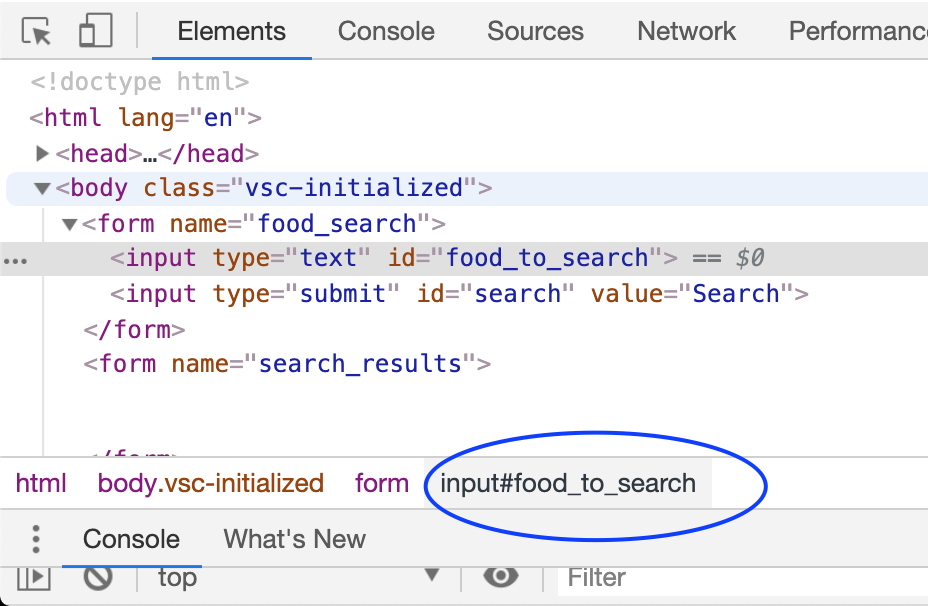
  
  And you can add css in the browser on that selector if you add the selector on devtools here on the styles panel:
  
  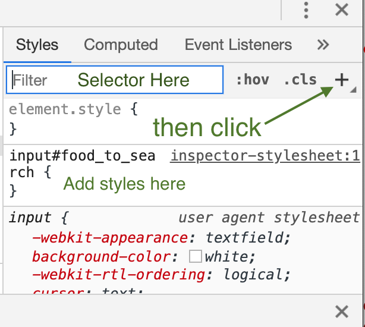
  
  You can also add a class if you click the .cls button.
 
  

## Day 4, R2
### 4/14/19

- ## Recipe Calculator

  I have been thinking about this math problem nonstop. I seriously dreamt about it all night!
  
  ### Here's the progress I made yesterday:
  
  Yesterday I called my friend [Shaily Hakimian](https://twitter.com/hakimian45) who is a math tutor. Shaily said we should brainstorm on bitpaper.io a whiteboard site. [Jerami](https://twitter.com/CodeAndLonely) has been helping too and joined the whiteboard.
  
  
  
  Talking it out and trying to explain the problem to Shaily and Jerami helped me ***abstract my problem into an equation.***

  I then posted the problem on [Simbi](https://simbi.com/dashiell-bark-huss/math-help)
  
  > Hey I’m looking for help with a math problem. I have no clue what kind of math this problem uses. I don’t want the answer alone, I want to know how it’s solved or any information on how it might be solved. Ultimately I’m trying to figure out the general algorithm to solve issues like these.
  >
  >Problem:
  >
  >10≈1x+7y 
  >
  >6 ≈ 2x+1y 
  >
  >15≈5x+2y
  >
  >How can we solve for x and y so that the values on the right equal as close as possible to the values on the left. These equations all live in the same world, x is the same in all of them and so is y.
  >
  >Ex: 
  >If X=3 and y =1 the difference between our left side and and right side is an absolute value of 3.
  >
  >10≈10_________+0 
  >
  >6 ≈ 7 __________+1 
  >
  >15≈17 _________+2 
  >
  >—————————— 
  >
  >Total difference: 3
  >
  >But are there values for x and y that would give a smaller total difference? How can we solve this algorithmically?
  >
  >I’d also like to be able to extend this problem to more variables. ex:
  >
  >10≈1x+7y +6z 
  >
  >6 ≈ 2x+1y +12z 
  >
  >15≈5x+2y +3z
  >
  >A concrete example:
  >
  >If I have apples, chicken, and butter and I want to eat 20g of fat, 22g of protein, and 10g of carbs, how much of each food should I eat to get as close as possible to my desired macronutrients?
  >
  >Per 100g 
  >
  >Apple: fat: 0g protein: 1g carbs: 16g 
  >
  >Chicken: fat: 4g protein: 20g carbs: 0g 
  >
  >Butter: fat: 100g protein: 0 carbs: 0g
  >
  >Fat 20 ≈ 0a + 4c + 100b 
  >
  >Protein 22 ≈ 1a + 20c + 0b 
  >
  >Carbs 10 ≈ 16a + 0c + 0b
  >
  >a= Amount of apple (1=100grams of apple) 
  >
  >c= Amount of chicken 
  >
  >b= Amount of butter
    
  ## System of Equations
  
  I sent my simbi post to my friend Sean. **That's when I got a break through!**

  Sean said he knew what this problem was: *a system of equations*.
  
  I finally had *something* to google. This helped me tremendously. 
  
  ## Solving System of Equations With Matrices
  
  Sean said watch this video to learn how to solve the problem: [Matrices to solve a system of equations](https://www.youtube.com/watch?v=AUqeb9Z3y3k&fbclid=IwAR2SaAZPtdZZmbSFi8QWkIne989Z_-kPWa8H4tG0un9tDDkoG9Z18Wdb5NI)
  
  So I solved it on paper and it worked. 
  
  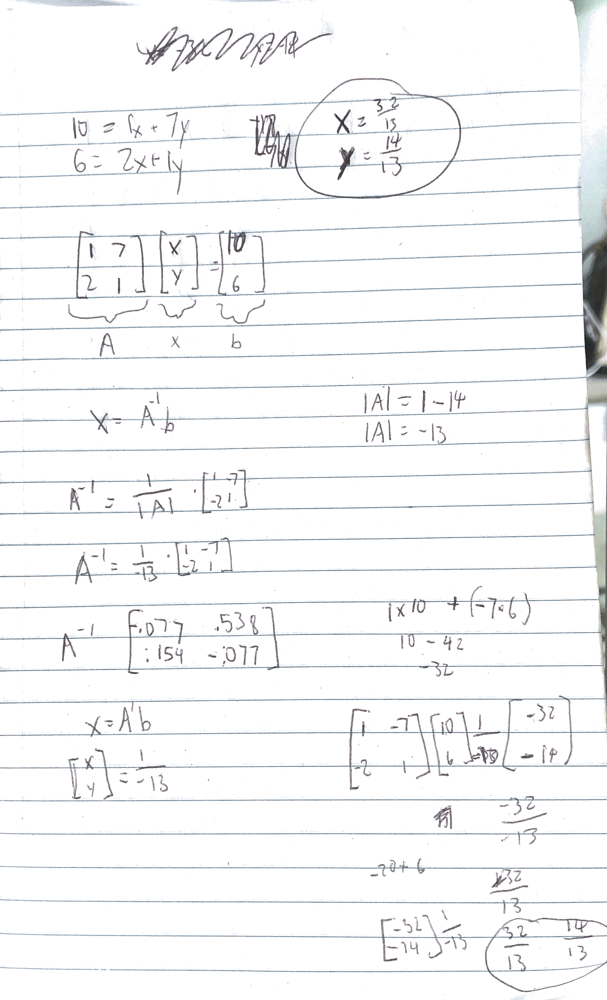

  Getting closer!
  
  ## What About For More Variables(Ingredients) and More Equations(Nutrients)?
  
  It took me a while, but I finally found a calculator that can solve systems of equations with more than 2 variables and 2 equations. [eMathHelp](https://www.emathhelp.net/calculators/algebra-2/system-of-linear-equations-calculator/)! 
  
  EMathHelp also shows the ***steps you need to take.*** Knowing the steps will be important because we'll need to **translate those steps to code.**
  
  I tested a bunch of sites with these 3 equations since I know the answer here should be **1** for every variable. **b=1, a=1, g=1**
 
  - 25b+3a+0g=28 
  - 0b+10a+0g=10 
  - 15b+1a+100g=116 
  
  All amounts should equal 1. A lot of sites couldn't figure it out. I don't know why. But [eMathHelp](https://www.emathhelp.net/calculators/algebra-2/system-of-linear-equations-calculator/) worked.

  ## Testing With EMathHelp
  
  Let's say we want these foods:
  
  *Grams per 100 gram measurements:*
  - Apple : { protein: 3, carbs: 10, fat: 1 }
  - Beef: { protein: 25, carbs: 0, fat: 15 } 
  - Ghee: { protein: 1, carbs: 2g, fat: 100 }
  
  *(nutrient measurements fudged)*
  
  And we want these total nutrients:
  
  Protein: 20, Carbs: 7, Fat: 20
  
  ### That gives us these eqautions:
  
  - 3a+25b+1g=20 *(total protein)*

  - 10a+b+2g=7 *(total carbs)*

  - 1a+15b+100g=20 *(total Fat)

  We need to solve for ***a, b, g***

  [Here's the solution using emathhelp with steps](https://www.emathhelp.net/calculators/algebra-2/system-of-linear-equations-calculator/?s=3a%2B25b%2B1g%3D20%2C++10a%2Bb%2B2g%3D7%2C++1a%2B15b%2B100g%3D20&v=&method=j&steps=on)
  
  Answer: a=7151171≈**0.610589239965841**, b=8471171≈**0.72331340734415**,  g=1001171≈**0.085397096498719**
  - 61g of apple
  - 72g of beef 
  - 8.5 grams of ghee
  

  ## What Could Go Wrong?
  
  Next I need to do this all in code. But I wonder:
  
  - What if there are no exact answers? 
    - How can we find the closest answer?
  - What if the answers are negative? 
    - How can we find the POSITIVE closest answer? You can't have a negative food, unless maybe you vomit it up, but that's a different app.
  - What if the answer is too small? Probably round??
  
- ## Thoughts and Feelings:

  I spent so much time on the math of this problem and hardly any coding. I guess that's part of coding when you get into making useful stuff, you'll need to learn other things. This would be a good time to have a math consultant. Is that a thing? I must be because what else do math people do?
 
  I went to a crowded coffee shop today. It forced me to sit with strangers. The strangers happened to be developers! What a cool coincidence! They were fun to talk to. Their names are Michael and Dan. 
 
  Here's a cool [project Dan made](https://helveticascenario.dev/mandlebrot). Click-drag to zoom in, right click to zoom out.
 
  They're working on a productivity app together. They talked to me about the pros and con of living in Austin vs. the bay area. Basically, you can get ahead in the bay area, but it's a bit a soul sucking and people are unaware of how the world works because they're stuck in tech world where smart-toilets are a good idea. Like L.A. but for tech.


## Day 3, R2
### 4/13/19

I went to a meetup today that had a lot of coders. This guy Joe was talking me up the wazoo so I didn't get a lot done. His favorite saying was "Too make a short story long". But he was cool and gave me some good advice. 
  
Joe told me to reexamine how deeply I want to go into a subject as opposed to using a framework. I have been doing a lot of vanilla JavaScript. Maybe it's time to try react soon?
  
For more on this conundrum Joe recommended listening to this podcast:
 - [Episode #205: Beginners and Experts Panel](https://talkpython.fm/episodes/show/205/beginners-and-experts-panel)
 
His general advice for picking a tech podcast to listen too was to find some old dude who's been around the block but isn't yet bitter. I think that's good advice.

He also said to start working with a linter because it makes it easy for others to read your code. Uniformity.
  
  
- ## Recipe Calculator

  I basically am thinking through the problem from yesterday both on code and on paper. I think I'm closer. But I am so far from an answer. I'm gonna leave my log short today because I've just done a ton of brain storming and working through this problem. So not much concrete to post about. And because I was delayed from all the meetup shmoozing. See you tomorrow.
  

## Day 2, R2
### 4/12/19

- ## Recipe Calculator

  ## How To Find The Right Combination of Ingredients?
  
  I'm trying to figure out how to find how much of each ingredient I need given a certain amount of nutrient-totals the user wants to reach. 
  
  I thought the answer would be complicated and I would need to find some complex algorithm. But my very helpful twitter peer [Khawar Jatoi](https://twitter.com/khawar_jatoi) said that an algorithm isn't necesary. He said, think about iterations and things you already know. I decided to give it a shot. Heads up, I didn't get the answer yet and I'm probably doing a bunch of things worng but this is my exploration into the problem. 
  
  ## Experimenting On Paper
  I started by trying to figure out the answer on paper using my brain. This way I would get an idea of what the code needs to do.
  
  Using my example from yesterday: 
  
  ```javascript
   {
      object1: { blue: 3, red: 20, yellow: 0 }
      object2: { blue: 0, red: 2,  yellow: 12 }
      object3: { blue: 20 red: 4,  yellow: 6 }

   }

   // How much of each object to total as close as possible to: blue: 70 red: 40, yellow: 15?
   ```
 
  I went through each object: How much of object1 would I need to total to blue:70? Blue for object 1 is 3 so 70/3 is 23.33. What would that do to the rest of our numbers: Multiply them by 23.33. Well, red would be too high, yellow would sill be zero.
 
  I thought through this for a while. It started to clarify some things to me. I decided to make a program to help me play around with this idea. 
 
    
  ## Experiementing In Code
 
  I took this problem to code, inorder to play around with it faster.
 
  ```javascript
   var array=[

      {fat:1, protein:2, carbs:4},
      {fat:4, protein:2, carbs:1},
      {fat:1, protein:4, carbs:2}

    ]
    
    const a = array[0];
    const b = array[1];
    const c = array[2];
    
    //__________________some made up desied totals the user might want
    var tFat = 15;
    var tProtein = 10;
    var tCarbs = 7;

  ```
  I made this array with objects representing foods with different amounts of nutrients. Then I made functions to help figure out what I was doing on paper, but faster in code. I'm not going to post the entire code because I left off with a bug and and some messiness. I will post it tomorrow. 
  
  You can see here how I could use my functions to tell me what all of our total nutrients would be if we used only one ingredient to reach an exact amount of our desired fat, or carbs, or protein:
  
   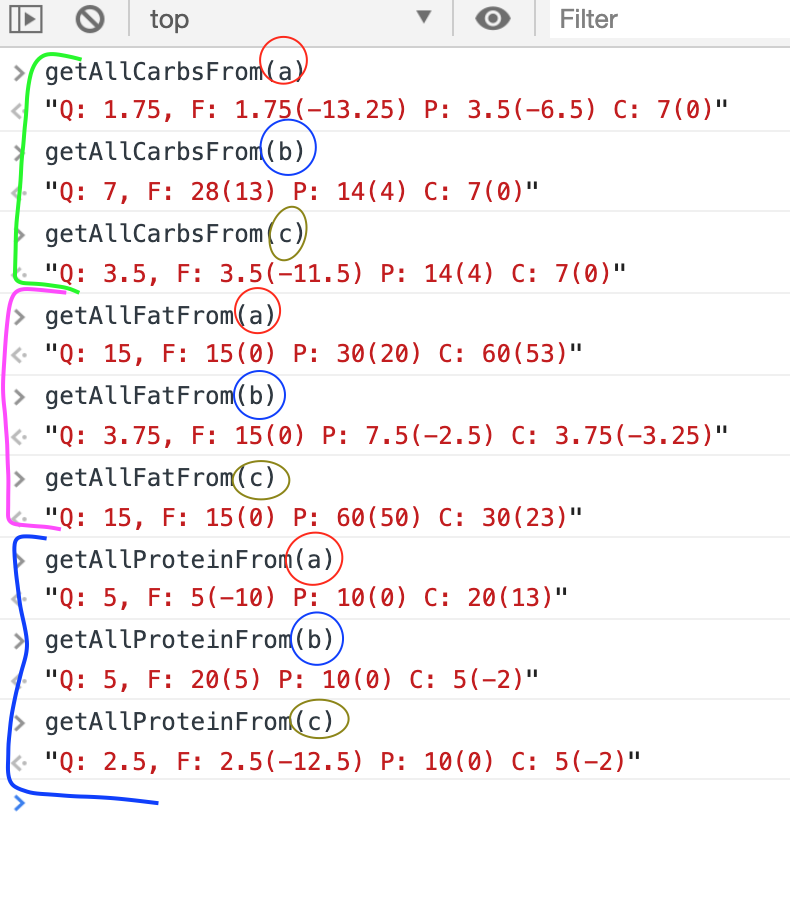
  
  Q is the [quotient](http://www.amathsdictionaryforkids.com/qr/d/division.html) (How much we need of the ingredient)
  
  F, P, C are fat protein and carbs.
  
  The parenthesis show how much under or over the macro totals would be from our desired totals.
  
  This helped me see how, if we were going to only use one ingredient (an over simplified answer to my problem), the best answer would probably be the one where the absolute values of the numbers in the parenthesis add up to the lowest amount.
  
  Still a lot to do.
  
  ## CSS In Console
  
  I used this article to try to get [CSS in my logs](https://hackernoon.com/styling-logs-in-browser-console-2ec0807dc91a). I didn't finish.

  ## Can you Spot the problem?
  
  I spent a while on this issue. Whenever I called `overOrUnder`, I got `undefined`. I spent way too long on this problem.

  Can you spot the issue?
  ```javascript
  const over = 'background-color: red';
  const under = 'background-color: yellow';
  const exact = 'background-color: green';
  
  const overOrUnder= (x)=>{
    if(x=0)return exact;
    if(x>0)return over;
    if(x<0)return under;
  }
  ```
  
  ## Answer
  
  I used the equals assignment operator `=` instead of the equals relational operator `==`.

## Day 1, R2
### 4/11/19

## Starting Round 2
Round 2 let's go!

- ## Recipe Calculator
  
  ## `.find()`
  
  I used `find()` to get the object in an array that matches a nutrient id. ex: 
  
  ```javascript
  nutrientRecipeArray[0].nutrients.find(x=>x.nutrient_id=="208")
  ```
  
  This is where I look for array methods and where I found `find()`: [JavaScript Array Reference](https://www.w3schools.com/jsref/jsref_obj_array.asp)

  ## Added A bunch of Functions
  
  I added a bunch of functions:
  - `nutrientValue(food, nutrient)`
    - returns a nutrient value for a specified food object. 
    - ex: `nutrientValue(nutrientRecipeArray[0], "fiber")`
  - `calories(food)`
    - short cut for `nutrientValue(food, "calories")`
  - `netCarbs(food)`
    - finds the net carbs from `nutrientValue(food, "carbs")` & `nutrientValue(food, "fiber")`
  - `fat(food)`
    - short cut for `nutrientValue(food, "fat")`
  - `protein(food)`
    - short cut for `nutrientValue(food, "protein")`
  - `nutrientRatio(food, nutrient, perNutrient)`
    - gets the ratio of a two nutrients for a specified food object. 
    - ex: `nutrientRation(nutrientRecipeArray[0], "protein", "calories")`
  - `sortDescending(array, nutrient, perNutrient)`
    - Sorts the food objects of an array by nutrient ratio. 
    - ex: `sortDescending(nutrientRecipeArray, "netCarbs", "calories")`
    
 ## Thinking Through Functions
 
 I really thought through how to seperate the functions so that they could be reused by other function. I think I did a good job. A lot of my functions use other functions that I made. This makes it easier to change add other related functions later and cleaner to see.
 
 ## Do I need An Algorithm?
 
 I feel like this next part is complex. But I feel like there might be an algorithm to solve it. I haven't really learned about algorithms.
 
 I'm trying to get the amounts needed of a list of ingredients that would total to specified nutrients or close to specified nutrients.
 
 I'm not sure what to search to even begin.
 
 ### Using another example: 
 If I have a collection of objects, each with different values of colors:
 
 ```javascript
 {
    object1: { blue: 3, red: 20, yellow: 0 }
    object2: { blue: 0, red: 2,  yellow: 12 }
    object3: { blue: 20 red: 4,  yellow: 6 }
    
 }
 
 // How much of each object to total as close as possible to: blue: 70 red: 40, yellow: 15?
 ```
 
 How much do we need of each object inorder to total as close as possible to specific amounts?  **ex totals: blue: 70 red: 40, yellow: 15**
 
- ## Thoughts and Feelings:
  Can't believe I'm on round two! I got a lot done because I saved most of my log until the end, instead of logging while coding.
 
 
 
    
 
