# #100DaysOfCode Log - Round 2 - Dashiell Bark-Huss


## Day 47, R2
### 5/27/19

- ## Node / Unix
  Today, I'm going to focus on Node and Unix again which I was last learning about on [May 23rd](https://github.com/DashBarkHuss/100-days-of-code/blob/master/r2-log.md#day-43-r2). 
  
  ## Windows Vs. Linux
  
  Last time I ran node from the terminal it worked without having to set up the  environment variables. I was surprised by this. But Greg Sidelnikov reached out to me and explained:
  
  >(Ps: windows global installation is unique to the OS, on Linux you can call mysql from anywhere by default)
  
  - Greg Sidelnikov aka [JavaScript Teacher @js_tut](https://twitter.com/js_tut)
  
  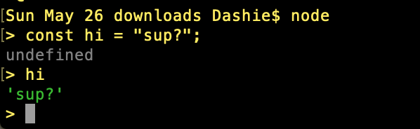
  
  ## C:
  I know C: has something to do ith paths and directories but what exactly does it mean?
  
  It's difficult to google questions that involve special symbols so I used [SymbolHound.com](http://symbolhound.com/) to search `C:`. Otherwise, google usually ignored punctuation and special symbols.
  
  "Windows displays partition labels as uppercase letters (C:)." 
  - [Stackoverflow](https://stackoverflow.com/questions/93228/is-a-hard-drive-partitions-label-upper-or-lowercase-c-or-c)
  
  It looks like `C:\` is a way that windows represents a harddrive partition. I think you can have other letters for other partictions. Then a path would look like this: `C:\somefolder/somefile`. Since I don't use windows this was new to me. Atleast, I think it's just a windows things.
  
  ## Where are Core Node Modules Stored?
  
  >Modules are stored in your node installation folder (C:\Program Files\nodejs
in our case) under node modules.
  >You might also find them in nodejs\npm folder:
C:\Program Files\nodejs\node modules\npm\node modules\
 
  -*Node.js – Server Setup, Greg Sidelnikov*

  ## `import`
  
  In the react tutorial from yesterday I saw the `import` keyword and was wondering what it was:
  
  > In browser-side JavaScript code, you can use import / export keywords. But in
addition to that, in node you can use require keyword to add useful modules to
your app from the main NPM repository.

  -*Node.js – Server Setup, Greg Sidelnikov*
  
  So it looks like it's basically the same as require but it's browser-side JavaScript code. So does that mean it's pat of javascript or part of the Web API?
  
  It's also nice to know that ***`require()` is just pulling from the NPM repository***. I think that means the folders where the core modules are stored. So, this clarifies how `require()` works an why you don't need to include the path for the core modules.
  
  ## Importance of a Node Server Continuously
  
  Here Greg is comparing the process of running `node index.js` in the command line with using a running a node server continuously:
  
  >After executing index.js the node process quits, and
control is given back to cmd. This won’t help us run our application server. We
need to build something that runs continuously so we can serve a file every time
someone will access our server from their browser.

  -*Node.js – Server Setup, Greg Sidelnikov*
  
  So, this makes me question what we are actually about to do?:
  
  ***Can we actually deploy a site to the web if we make our own server? Or do we still need heroku and netify etc to do that? What actually is the server?*** I thought when we make a server it still only runs on our own computer and other people cannot access it. That's what I thought I had done in the past when running live servers on my computer to test certain code that couldn't be tested without a server. 
  
  So there's definetly a lot I'm realizing I don't understand. Let's see if I can figure it out in the upcoming sections.
  
  ## Node Server!
  So cool I got a simple node server running!
  
  ```javascript
  let http = require('http');

  const ip = `127.0.0.1`;
  const port = 3000;

  http.createServer(function(request, response){
    console.log('request: ', request.url);
  }).listen(port, ip);

  console.log(`Running at http://` + ip + `:` + port + `/`);
  ```
  
  ## Serving Requested Files
  So far we only are able to send requests. You can see the requests coming in to the terminal 
  
  
  
  But the code doesn't serve up any files.
  
  I followed the code for serving up files which can be found on page 23 of the May 14th update to Greg Sildenikov's [Node.js – Server Setup](https://www.patreon.com/posts/node-js-book-26866624). It's not free but it's only a dollar a month to support his patreon and you get all his books. If you don't have an extra dollar, you probably should read a book on getting your finances in order (I'm currently reading I Will Teach You To Be Rich). But besides that if you ask 5 strangers for 25 cents they will probably oblidge and you can then support the patreon and buy yourself a candy.
  
  ## MIME?
  What is MIME? In our code we set up a mime variable:
  
  ```javascript
  // Define acceptable file extensions
  let mime = {".html":"text/html"};
  ````
  
  >A multipurpose internet mail extension, or MIME type, is an internet standard that describes the contents of internet files based on their natures and formats.
  
  -*[What Is a File Extension and MIME Type?](https://www.lifewire.com/file-extensions-and-mime-types-3469109)*
  
  

## Day 46, R2
### 5/26/19

- ## React
  Continuing [React tutorial on lynda.com](https://www.lynda.com/React-js-tutorials/Learning-React-js/800214-2.html) with Eve Porcello [@eveporcello](https://twitter.com/eveporcello).
  
  ### Question:
  Where does `props` go when we make a class? I'm guessing in the argument to `render()`?

  ## Conditionally Render Components     
  
  ```jsx
  const Dashboard = ({name})=>(<h1>Welcome {name}!</h1>);

  const App = ({loggedIn}) => (
    loggedIn 
    ? <Dashboard name = "Dash" /> 
    : <h1>You are not logged in</h1>
  );

  ReactDOM.render(
    <App  loggedIn = {false}/>, 
    document.getElementById("root")
  );
  ```
  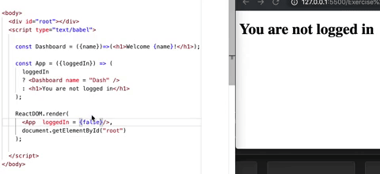
  
  ## Render Components From A List
  
    > ...each child in an array or iterator should have a unique key property. So whenever we're rendering some sort of a list, with dynamic values,  we're going to need to give each a key, so that React can re-render things appropriately according to the rendering rules.  
    
  -[Eve Porcello](https://www.lynda.com/React-js-tutorials/Render-components-from-list/800214/2202388-4.html?autoplay=true)

  
  ```jsx
  const shoppingList = [
    "Avocado", "Tahini", "Organic Grass Fed Beef", "Spinach"
  ];

  const App = ({list}) => {
    return (
    <ul>
      {list.map((item, i)=><li key={i}>{item}</li>)}
    </ul>
    )
  };

  ReactDOM.render(
    <App  list = {shoppingList}/>, 
    document.getElementById("root")
  );
  ```
  
  
  
  ## Render Object List
  
  ```jsx
  const ingredients = [
    {id: 1, name: "Avocado", grams: 60},
    {id: 2, name: "Tahini", grams: 20},
    {id: 3, name: "Certified USDA Organic Grass Fed Beef", grams: 130},
    {id: 4, name: "Spinach", grams: 120},      
  ];

  const App = ({list}) => {
    return (<ul>
      {list.map((item)=><li key={item.id}>{item.grams}g {item.name}</li>)}
    </ul>
    )
  };

  ReactDOM.render(
    <App  list = {ingredients}/>, 
    document.getElementById("root")
  );
  ```
  
  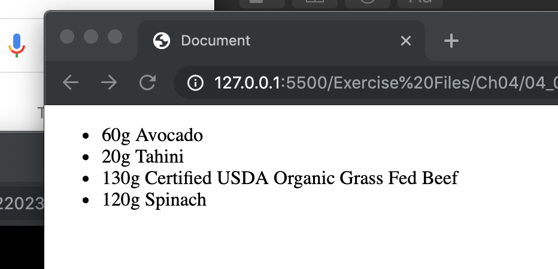
  
  ## Create React App
  I already had create-react-app installed. I used it to make a new project.
  
  In the directory that you want to make your project in, run the command:
  
  `create reacte app <projectname>`
  
  ## Run A create-react-app Project In The Browser
  
  First make sure you are in your new project directory. Then run `npm i` to install dependencies. 
  
  Then run `npm start` to start up the project in the browser. This will run your project on local host 3000.
  
  ### Question:
  I see all these import statements at the top again. I'm not sure what they are and the instructor didn't talk about them.
  
  ```javascript
  import React from 'react';
  import ReactDOM from 'react-dom';
  import './index.css';
  import App from './App';
  import * as serviceWorker from './serviceWorker';
  ```
  
  It looks like `require()`.
  
  ## Build For Production
  
  To put your create-react-app project on the web, you'll want to optimize it for production. You can do that really simply by running:
  
  `npm run <nameforbuild>`
  
  To run the build in the browser:
  
  `serve -s <nameforbuild>` 
  
  But this actually didn't work for me, it ran a different folder with the same name. So I have to include the entire path not just the name for build. Then I also ran `sudo npm install serve` (by accident) and `sudo npm install serve -g` and now I can just put the probect name without the path but I'm not sure why. I'm not sure where I have serve installed before. But now I have it installed in too many places.
  
  
  
## Day 45, R2
### 5/25/19

- ## React
  Continuing [React tutorial on lynda.com](https://www.lynda.com/React-js-tutorials/Learning-React-js/800214-2.html) with Eve Porcello [@eveporcello](https://twitter.com/eveporcello).
  
  ## Composing Components
  
  Composing components means putting components together to make a larger interface.
  
  ```javascript
  const Person = ({name, age})=>{
    return (
      <h1> {name}, you are {age}</h1>
    );
  };

  const Friends = () => {
    return (
      <div>
      <Person name = "Shlomo" age = "33"/>
      <Person name = "Mom" age = "old"/>
      </div>
    );
  };

  ReactDOM.render(
    <Friends />, 
    document.getElementById("root")
  );
  ```
  
  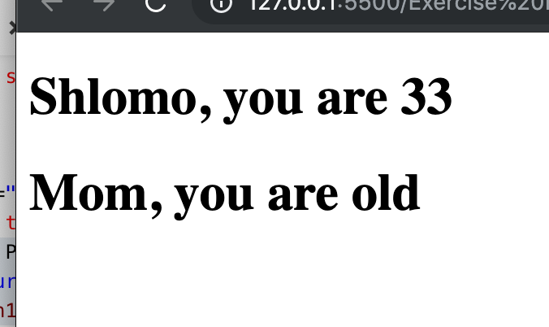
  
  ## Class Components
  
  You can also create a component using a class. Here's the Friends component from above as a class.
  
  ```javascript
  class Friends extends React.Component  {
    render () {
      return (
        <div>
        <Person name = "Shlomo" age = "33"/>
        <Person name = "Mom" age = "old"/>
        </div>
      );
    }
  };
  ```
  
  You always need the `render()` method inside the component class.
  
  ## State
  When a component's state changes the render function will be called again to rerender the state change.
  
  ```javascript
  class App extends React.Component  {
    state = {loggedIn: true}
    render () {
      return (
        <div>
        <div>The User Is {
        this.state.loggedIn 
        ? "logged in"
        : "not logged in"}.
        </div>
        </div>
      );
    }
  };

  ReactDOM.render(
    <App />, 
    document.getElementById("root")
  );
  ```
  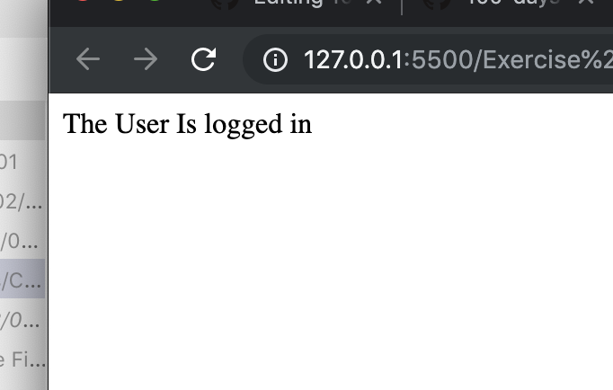
  
  There is more to this that we will find out later.
  
  > So this is a simple reflection of the state value as UI but we're going to use the state with events in order to change the state of our entire application.
  
  -[Eve Porcello](https://www.lynda.com/React-js-tutorials/Understanding-React-state/800214/2201438-4.html)
  
  ## Binding Event Functions to UI Elements
  Here we have our class from above with the state value defined, but we also add functions, `logIn` and `logOut`. Theses functions change the state. We attach them to "Log in" and "Log Out" UI buttons.
  
  ```javascript
  class App extends React.Component  {
    state = {
      loggedIn: false
    };
    logIn = () => this.setState({loggedIn: true});
    logOut = () => this.setState({loggedIn: false});
    render () {
      return (
        <div>
          <button onClick = {this.logIn}>Log In</button>
          <button onClick = {this.logOut}>Log Out</button>
          <div>The User Is {
            this.state.loggedIn 
            ? "logged in"
            : "not logged in"}.
          </div>
        </div>
      );
    }
  };
  ```
  This is called binding an event function to a UI element.
  
  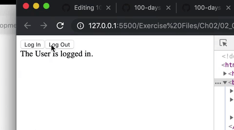
  
## Day 44, R2
### 5/24/19

- ## React
  I didn't have interenet on this day so I watched a tutorial that I previously downlo.aded on React. You can find it [here on lynda.com](https://www.lynda.com/React-js-tutorials/Learning-React-js/800214-2.html)
  
  A lot of the text here in this log is straight from the tutorial so, I credit a lot of the difinitions here to Eve Porcello [@eveporcello](https://twitter.com/eveporcello)
  
  ## What is react?
  React is a javascript library that’s used for building user interfaces. React aims to make developing large scale single page applications easier.

  ## Functional Javascript:
  A paradigm that emphasizes function, composition, over object orientation.

  ## Install React Developer Tools
  I  already have these installed but this will help you.

  ## Using React Offline
  Since I don’t have internet right now, I can’t link to the react library like the instructor does. How can I use react without the internet: is it a js library file: react.js? is it a node module: require(react)? I skipped to the last project file to see if the instructor uses react without the internet. There I found this: 

  ```javasript
  import React from 'react'
  import ReactDOM from 'react-dom'
  ```

  What is `import`? Is it like `require`? Is it part of javascript or node? Or maybe it’s part of the Web Api?
  
  ## Using A Relative Path Offline
  I found a `react.development.js` file on my computer that was downloaded with the exercise files for this tutorial. Great! 
  
  ## Node Module?
  This file is in a node_modules folder so I’m inferring that react is a module you can require. However, I tried requiring ’react’ and ‘reactjs’ and neither worked: `The module could not be found.`

  Maybe react is not a core module, and I was requiring it without a path which you can only do with core modules.
  
  ## Using the Files
 
  I found the two files that correspond to the links the teacher used, added them to my directory, and added links for them:
  
  ```html
  <script src="react.development.js"></script>
  <script src="react-dom.development.js"></script>
  ```

  I don’t know the difference between the two files.

  I got an error in the `react.development.js` and `react-do.development.js` files:
  `process is not defined`

  I got internet for a bit and got ***more recently versions of the react files. It works now!***

  ## JSX
  JSX, Javascript as XML, is a language extension that allows you to write tags directly in the javascript. For JSX to work you need to link to the babel library in the head and change the script `type` attribute value:

  ```javascript
  <script type="text/babel">
    ReactDOM.render(
      React.createElement("div", {
        "style": {
          "color": "hotpink"
        }
      }, <h1>hoo</h1>), //jsx
      document.getElementById("root")

    );
  </script>
  ```
  
  

  
  ## You can use variables in JSX:
  ```javascript
  const name = "Dash";

  ReactDOM.render(
    <h1 className="greet"> Hi {name} </h1>, //class is a reserved word, use className
    document.getElementById("root")
  );
  ```
  


  ## Components
  The way that a react application represents a UI element is with a component. A component let’s you put together a user interface with independent reusable pieces. 

  Here we create and add a `Dash` component:
  ```javascript
  const Dash = () => { // create a function component
    return(
    <div>
    <h2>Dash</h2>
    <ul>
      <li>28</li>
      <li>Smart</li>
      <li>Pretty</li>
    </ul>
    </div>
  )
  };

  ReactDOM.render(
    <Dash />, // use the component
    document.getElementById("root")
  );
  ```
  


  ## Props
  Props is an object in react that contains properties about the component. With props we can display dynamic data within a component.

  ```javascript
  const Dash = (props) => {
    console.log(props)
    return(
    <div>
    <h2>Dash</h2>
    <ul>
      <li>28</li>
      <li>Cute</li>
      <li>My {props.relation}</li>
    </ul>
    </div>
  )
  };

  ReactDOM.render(
    <Dash relation = "favorite newbie developer"/>,
    document.getElementById("root")
  );
  ```
  
  


## Day 43, R2
### 5/23/19

- ## Node
  I finished the tutorial I was learning on node. Today, I'd like to set up a server on node. I was following ***Node.js Server Set Up*** by Greg Sidelnikov aka [JavaScript Teacher @js_tut](https://twitter.com/js_tut) but the latest update doesn't have all the mac instructions. So I'm going to look at other resources too.
  
  ## Unix
  There's a lot of unix commands involved in node. It's been a while since I looked at unix in depth so I may have to refresh my memory.
  
  ## `chown` 
  In [this tutorial on setting up a node server for mac](https://rickchristianson.wordpress.com/2013/11/15/how-to-setup-a-node-js-server-on-mac-os-x-in-less-than-10-minutes/) it uses the `chown` command:
  
  >The chown command is most commonly used by Unix/Linux system administrators who need to fix a permissions problem with a file or directory, or many files and many directories.
  
  *-from [The Linux `chown` command](https://alvinalexander.com/linux-unix/linux-chown-command-chgrp-files-directories)*
  
  ### Stupid Questions:
  Why would I need to change permissions on my computer for any file? Why don't I just have permission to do everything? Why would I disallow myself to ever have permission? What is my username and how do I see who owns what? Is it possible for a file to not be owned by any username?
  
  ## Environment Variables
  
  Skimmed this: [An Introduction to Environment Variables and How to Use Them](https://medium.com/chingu/an-introduction-to-environment-variables-and-how-to-use-them-f602f66d15fa)
  
  In Greg's tutorial for setting up a node server, it says that after we install node, we won't be able to run node from anywhere because we still need to add the path to our environment variables. However, mine is working from anywhere and I don't see the environment variables for the node path when I run `env` in the command line. What's happening?
  
  ## Path Variable
  In [this tutorial on setting up a node server for mac](https://rickchristianson.wordpress.com/2013/11/15/how-to-setup-a-node-js-server-on-mac-os-x-in-less-than-10-minutes/) it says to add these two variables through the command line:
  
  ```bash
  $ export NODE_PATH="/usr/local/lib/node"
  $ export PATH="/usr/local/share/npm/bin:$PATH"
  ```
  
  However, I already have a `PATH` variable that's different: 
  ```bash
  PATH=/Users/dashiellbark-huss/.rbenv/shims:/usr/local/bin:/usr/local/sbin/:/usr/local/mysql/bin:/usr/local/bin:/usr/bin:/bin:/usr/sbin:/sbin
  ```
  
  `PATH` seems like such a broad variable name. Why would we use it for something specific like just for npm? Why not name it `NPM_PATH`? 
  
  Am I supposed to write over my last `PATH` variable? What will that affect? The next time I follow a tutorial, will they tell me to write over `PATH` again for some other `PATH`? Won't that screw things up?
  
  ## PATH Is A List Of Paths
  
  >The $PATH variable is specified as a list of directory names separated by colon (:) characters. 
  
  *-from [Mac OS X: Set / Change $PATH Variable](https://www.cyberciti.biz/faq/appleosx-bash-unix-change-set-path-environment-variable/)*
  
  ## Current Session?
  
  I this stackoverflow thread, it mentions adding `PATH` to the *current session* vs *permanently*:
  
  >"...that would be for the current session, if you want to change permanently add it to any .bashrc, bash.bashrc, /etc/profile - whatever fits your system and user needs." 
  *-from [Removing a directory from PATH](https://unix.stackexchange.com/questions/108873/removing-a-directory-from-path)*
  
  I found out this means the current shell session. That clarfies things.
  
  ## Understanding PATH
  This article, [How to add directory to system path in Linux](https://www.computerhope.com/issues/ch001647.htm), answered a lot of my questions:
  
  ### Appending to PATH
  In the tutorial where it said to set the `PATH`, we're not overwriting `PATH`
  
   ```bash
  $ export PATH="/usr/local/share/npm/bin:$PATH"
  ```
  
  At the end of the variable value, we add the `$PATH` variable itself. So we're **appending** the npm path ***to our $PATH***.
  
  ### Current Session
  
  >The methods we've used so far only sets the environment variable for your current shell session; when you logout or close the terminal window, your changes will be forgotten.
  
  *-from [How to add directory to system path in Linux](https://www.computerhope.com/issues/ch001647.htm)*
  
  ## Unix: A Multiuser Environment
  
  Earlier I wondered why I would need to give permissions for files on my own computer:
  
  > Unix is fundamentally a multi-user environment.
  
  -[Kevin Skogland](https://www.lynda.com/Mac-OS-tutorials/Logging-using-command-prompt/78546/83613-4.html?srchtrk=index%3a1%0alinktypeid%3a2%0aq%3abash+profile+unix%0apage%3a1%0as%3arelevance%0asa%3atrue%0aproducttypeid%3a2)
  
  >Other Unix systems don't automatically log you in. You'd put in your username and your password for it to know who you are. But your Mac already knows who you are. Now if you are using your Mac as a single-user environment, that may come as a bit of surprise to you because you may not even think about the fact that you are logged in as you. But if you go to Apple menu and down to System Preferences and into Accounts, you can see that we can manage different user accounts...OS 9 which was a single-user system. But once we moved OS X with this Unix underneath, Unix is fundamentally a multi-user environment.
  
  -[Kevin Skogland](https://www.lynda.com/Mac-OS-tutorials/Logging-using-command-prompt/78546/83613-4.html?srchtrk=index%3a1%0alinktypeid%3a2%0aq%3abash+profile+unix%0apage%3a1%0as%3arelevance%0asa%3atrue%0aproducttypeid%3a2)
  
  ## Summary
  Today I had a lot of questions about Unix. Some I found answers to, but some I still need to understand:
  
  - What is the bash profile, the place where variables are stored for all sessions? What else is it used for? How can I see it?
  - Why didn't I have to add the path environment variables for my node to work?
  
  I think I'll focus on unix tomorrow too. Since this is a core part of using node, I think it will really help me. It's been a while since I've really looked into Unix. 
  
  I'm familiar with a lot of the commands but not so familiar with the structure: Like what does unix do with `$PATH`, the bash profile, and where are usernames and passowrds stored?
  
- ## Thoughts and Feelings:
  I'm going to embrace my **"stupid questions"**. Some questions feel stupid because they can clue others to the fact that you really don't understand a subject. That's good. 
  
  Most times people don't know what **you** don't understand. Asking stupid questions helps them understand what information you're missing and explain it to you better. 
  
  ### *Be **specific** and **abundant** in your stupid questions.* Really get down to what is confusing you.
  
  Ask others, ask yourself, and ask the internet/google.
  
  It's good to ask questions when you think you might even know the answer are unsure. ***With your questions, always act stupider than you are.**
  
  Another benefit to **writing out and defining your confusion** is that once you understand something, when you go back and read what you were confused by, you feel like you learned a lot. You feel like, *"Who is this confused dumbo from the past?"* Not me! Not anymore!

## Day 42, R2
### 5/22/19

- ## Node
  Continuing my practice and notes for [Node.js Essential Training 2019 Lynda Tutorial](https://www.lynda.com/Node-js-tutorials/Node-js-Essential-Training-Part-I-2019-REVISION/5016729-2.html). I finished this tutorial yesterday but I still have to practice some of the concepts.
  
  ## Child Processes
  >Node.js comes with a child process module, which allows you to execute external processes in your environment. In other words, your Node.js app can run and communicate with other applications in your environment.
  [Child processes Node.js Documentation](https://nodejs.org/api/child_process.html)
  
  *-[Alex Banks](https://www.lynda.com/Node-js-tutorials/Readable-file-streams/5016729/2811746-4.html?autoplay=true)*

  
  ## `child_process.exec()`
  
  With the `exec()` function you can run terminal commands in node.js. `exec.()` handles ***synchronous*** processes.
  
  Here, we open Facebook:
  
  ```javascript
  const cp = require("child_process");

  cp.exec("open http://facebook.com");
  ```
  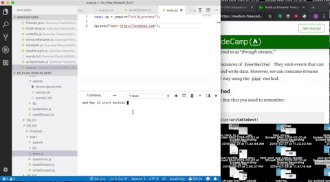
  
  ## Handle Data
  You can handle the data that a terminal command returns:
  
  ```javascript
  const cp = require("child_process");

  cp.exec("ls", (err, data, stderr) => {
    if(err){ 
      console.log(stderr);
      throw err;
    }
    console.log(data);
  });
  ```
  
  
  Here we console log the list command's results to the console. The third argument `stderr` is the error that the child process gives, aka the terminal in this program\*, while `err` is the error that Node.js gives.
  
  \*I'm not sure if it can be other processes or just the terminal.
  
  ## `child_process.spawn()`
  You can also run commands in the terminal using spawn. `.spawn()` handles ***asyncronous*** processes.
  
  `.spawn()` returns a ChildProcess Object, as does `.exec()`.
  
  ```javascript
  const cp = require('child_process');

  const questionApp = cp.spawn('node', ['questions.js']);

  questionApp.stdin.write("dash \n");
  questionApp.stdin.write("a van \n");
  questionApp.stdin.write("eating \n");

  questionApp.stdout.on('data', data => {
    console.log(`from the question app: ${data}`);
  });

  questionApp.on('close', () => {
    console.log('questionApp process exited');
  });


  ```
  
  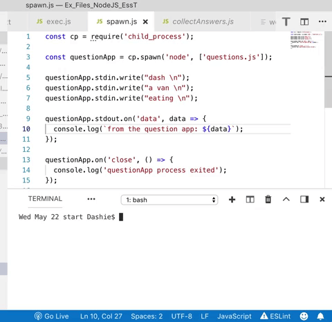
  
  ## Answers In The Terminal?
  
  With the last program, if I take out:
  
  ```javascript
  questionApp.stdin.write("dash \n");
  questionApp.stdin.write("a van \n");
  questionApp.stdin.write("eating \n");
  ```
  It doesn't let me input answers through the terminal. I'm not sure why. I guess it's only putting output from the questions app to the terminal and not listening for input.
  
- ## Node.js Server Set Up
  
  I started reading ***Node.js Server Set Up*** by Greg Sidelnikov aka [JavaScript Teacher @js_tut](https://twitter.com/js_tut).
  
  ## Notes:
  ## 3 Thinks to Understand About Node Server:
  - The difference between Global and Local installations
  - Configuring `package.json`manifest file
  - Understanding the `node_modules` directory
  
  ## Mac?
  It was interesting to read through so far but, it looks like a lot of the instructions are only for Windows. So I'm not sure if this will be helpful to me. Maybe in the next update the Mac instructions will be added.

## Day 41, R2
### 5/21/19

- ## Github
  I forgot to `git add .` which is why I was having trouble yesterday. I havn't used git in a while so I guess I was a bit rusty. I also needed to enter my username and password which I dudn't used to have to do. Maybe it's because I'm using a different terminal application or because I changed my username.

- ## Node
  Continuing my practice and notes for [Node.js Essential Training 2019 Lynda Tutorial](https://www.lynda.com/Node-js-tutorials/Node-js-Essential-Training-Part-I-2019-REVISION/5016729-2.html)
  
  I finished practicing the functions I learned in the last chapter concerning file system functions.
  
  You can see those practoce files here: [File system Node.js Practice](https://github.com/DashBarkHuss/node_fs_practice/commit/63f16ad919bfe81e09291c5dfb02af8c57cbd477)
  
  ## Stream Interface
  >The stream interface provides us with the technique to read and write data. We can use it to read and write to data files, to communicate with the internet, to communicate with other processed.
  
  -[Alex Banks](https://www.lynda.com/Node-js-tutorials/Readable-file-streams/5016729/2811746-4.html?autoplay=true)
  
  >A stream is an abstract interface for working with streaming data in Node.js. The stream module provides a base API that makes it easy to build objects that implement the stream interface.
  >
  >There are many stream objects provided by Node.js. For instance, a request to an HTTP server and process.stdout are both stream instances.
  >
  >Streams can be readable, writable, or both. All streams are instances of EventEmitter.
  >
  >The stream module can be accessed using:
  >
  >`const stream = require('stream');`
  >
  >While it is important to understand how streams work, the stream module itself is most useful for developers that are creating new types of stream instances. Developers who are primarily consuming stream objects will rarely need to use the stream module directly.
  
  -from [Stream Node.js Documentation](https://nodejs.org/api/stream.html#stream_types_of_streams)
  
  This idea is new to me. I think I'll understand it more when I play with it
  
  Here's some stream functions from the tutorial:
  - `fs.createReadStream()`
  - `fs.createWriteStream()`
  - `fs.createWriteStream().write()`
  - `fs.createReadStream().pipe()`
  - `fs.createReadStream().on()`
  - `fs.createReadStream().once()`
  
  
  
  ## Appending To a File With fs.createWriteStream()
  
  If you use `fs.createWriteStream()` it writes over the file you write to everytime you run it. I wanted to append to the file. On this stackoverflow page it showed how to append: [How to create appending writeStream in Node.js](https://stackoverflow.com/questions/3928926/how-to-create-appending-writestream-in-node-js)
  
  You just add the options parameter, which is the second parameter and is an object, and put in `'flags':'a'`.
  
  ```javascript
  const fs = require('fs');

  const writeStream = fs.createWriteStream(`./assets/words.txt`, {'flags':'a'} , `UTF-8`);
  const readStream = fs.createReadStream(`./assets/words.txt`, `UTF-8`);

  readStream.on("data", data => {
    writeStream.write(data);
  });
  ```

  This program reads whatever is in the file `words.text` and then write that text *back* into the file. 
  
  So if `"hi"` is in the file, after running this program, `"hihihihihi"` is the new text in the file. I'm not sure why it writes `"hi"` 4 more times instead of once.
  
- ## Thoughts & Feelings:
  I coded through driving into Utah. We saw some really red mountainss.
  
  They were ***more red*** in real life:
  
  
  
## Day 40, R2
### 5/20/19

- ## Node
  Continuing my practice and notes for [Node.js Essential Training 2019 Lynda Tutorial](https://www.lynda.com/Node-js-tutorials/Node-js-Essential-Training-Part-I-2019-REVISION/5016729-2.html)
  
  ## File System Functions We Learned:
  - fs.readdir
  - fs.readfile
  - fs.writefile
  - fs.mkdir
  - fs.appendfile
  - fs.rename
  - fs.unlink
  - fs.rmdir
  
  I want to make a small project using these functions.
  
  I used this page for help with Node.js fs(file system) functions:
  [Node.js Documentation fs](https://nodejs.org/api/fs.html)
  
  ## Project
  
  I made a file that creates letters to all my friends based on a `friends.json` file. Here's the function that creates the letter:
  
  ```javascript
  const makeNoteFile= (friend) => {
    const noteTo = (friend) => {
      return ( 
      `Dear ${friend.name},
        I hope this finds you well. I was thinking about how special you are. 
      You are my one and only true ${friend.relation}. A gem at a young ${friend.age}.

      I am thinking of you,
      Dashie`
      )
    }

    fs.writeFile(`${friend.name}.txt`, noteTo(friend),  err => {
      if (err) throw err;
      console.log('file created');
    });
  };
  ```
  
  I also made a bunch of little files that deal with the other functions. I'm having trouble pushing the project to github. My internet is slow today as I travel. So I'm going to leave this log short today.

## Day 39, R2
### 5/19/19

- ## Helping
  Last time I was helping someone on twitter with [this problem](https://github.com/DashBarkHuss/100-days-of-code/blob/master/r2-log.md#day-38-r2). We ended with this:
 
  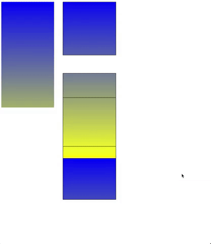
 
  The divs look like they have uniform gradient but if you scroll the gradient stays fixed to the viewport.
 
  [JavaScript Teacher @js_tut](https://twitter.com/js_tut) recommended this:
 
  >Make one parent. Create an SVG with a hole and just the white corners. Apply it to 3 gradientless children ;)
 
  This could work however it becomes more difficult when the page is responsive or if there are other elements on the page that might interfere. If the divs are changing perspectives, then we have to change the SVG too. I'm not sure how to do that without warping the perspective of the smooth corner radius of the SVG. You could probably do it with javascript. 
 
  I'm pretty sure there's other ways to do this in javascript too. Like maybe you can change where the background starts with a specific pixel measurement and use javascript to start all the backgrounds in the appropriate spot so that they all line up.
 
  Since I haven't heard back from the OP, I'm gonna leave this problem and go back to node.
 
- ## Node
  Continuing my practice and notes for [Node.js Essential Training 2019 Lynda Tutorial](https://www.lynda.com/Node-js-tutorials/Node-js-Essential-Training-Part-I-2019-REVISION/5016729-2.html)
  
  ## Debbuging Node in VSC
  Yesterday [Philippe Vaillancourt @snowfrogdev](https://twitter.com/snowfrogdev) told me that there's a way to debug built into VSC. Press `fn` + `F5`. Then just debug directly in VSC. 

  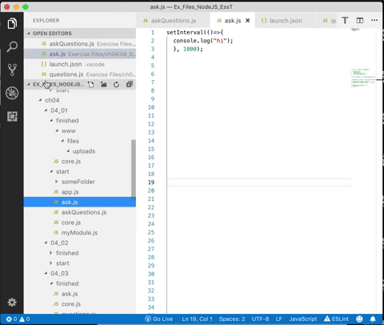
  
  You can do what I did in the video or:
  1. `fn` + `F5`
  2. Select Environment: **"Node.js"**
  3. Click the debugging view or `shift` + `cmd` + `D`
  4. Click the Debug Console Button
   - 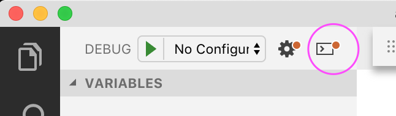
  
  [Here's a video](https://www.youtube.com/watch?v=2oFKNL7vYV8) tutorial of someone using the debugger.
  
  ## Ideas From Today's Lynda Videos
  
  This stuff is starting to feel very backendy to me which is fun and exciting!
  
  ### We learned about the Node module `fs` and these functions:
  - fs.readdir
  - fs.readfile
  - fs.writefile
  - fs.mkdir
  - fs.appendfile
  - fs.rename
  - fs.unlink
  - fs.rmdir
  
  These functions all deal with deleting, creating, or changing files and directories.
  
  I zoomed through this section of the tutorial, simply watching without coding along. Tomorrow, I'll take what I learned from these concepts and make a small project, reviewing any video I need to review. I think this might be a more effective way of learning for me.
  
- ## Thoughts and Feelings:
  I have been learning a lot about how I learn. That's a great side effect of 100DaysOfCode. I like to learn slowly. I feel if I learn a new concept slowly in the beginning, I'm able to learn faster later when I get to the more difficult parts of the subject. Actually, you could say I like to change up the pace depending on my goal.
  
  I'm learning Node.js pretty slowly and deliberately. It's more enjoyable this way and will stick better. I even went off my tutorial to learn how to set up debugging in node. I think debugging is so important. It makes understanding the code a billion times easier. So I took the time to learn how to set debugging up, which slows down my progress in my tutorial but speeds up my progress in the long run.

  I'm going to start posting my log on linked in. I want to start building up my linked in. I don't really know how to use linked in well. Maybe I can take a tutorial.

## Day 38, R2
### 5/18/19

- ## Helping
  Someone asked:
  >I have some children divs (`position: absolute`) nested inside a parent div. The parent div has a gradient background.
  >Question: is it possible to make the children divs inherit the same gradient background from the parent?
  
  I found that this worked:
  ```css
  #parent>* {
    background-image: inherit;
  }
  ```
  
  I thought maybe the OP left out some information because this was simple, and I was right. They also want the gradient to be uniform between the parent and the child.
  
  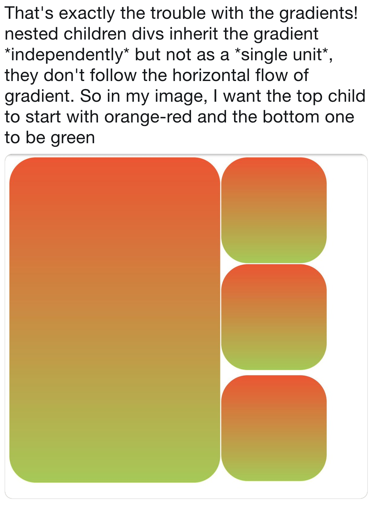
  
  I looked around for some ideas but nothing I came up with panned out so I posted it on twitter.
  
  ### But then I did figure it out! Sort Of
  
  If you add a `background-size` to the parent you can then have the children inherit that size along with `background-attachment: fixed;` which the OP showed me.
  
  ```css
  #parent {
    background-image: linear-gradient(blue, yellow);
    height: 400px;
    width: 200px;
    background-size: 600px 600px; //size
  }

  #parent>* {
    background-attachment: fixed;
    background-image: inherit;
    background-size: inherit;
  }
  ```
  
  
  
  But the OP got back to me and apparently this solution is limited:
  
  >Very clever! But because `background-attachment: fixed` is relative to the viewport and not to the parent, children will only align with the gradient at the top position. Scroll down and the colour starts changing.
But I think we're getting somewhere with your trick! Thank you!
  
- ## Node
  Continuing my practice and notes for [Node.js Essential Training 2019 Lynda Tutorial](https://www.lynda.com/Node-js-tutorials/Node-js-Essential-Training-Part-I-2019-REVISION/5016729-2.html)
  
  ## Debugging Node
  I love using DevTools for debugging. But since node runs on the server and not on the browser, what do people do to debug it? How to I get that same functionality I get from DevTools for node?
  
  I found this article: [Debug Node.js in browser with real Chrome Developer Tools](https://hackernoon.com/debug-node-js-with-chrome-devtools-aca7cf83af6b). But it didn't work. I ran the command:
  
  >Sat May 18 start Dashie$ node --inspect --debug-brk ask.js
  
  The terminal responded:
  >Debugger listening on ws://127.0.0.1:9229/4046c63c-1c1c-4580-9e23-1506a47c8feb
  >For help, see: https://nodejs.org/en/docs/inspector
  
  But when I put the link in the browser, it didn't work: 
  >The webpage at ws://127.0.0.1:9229/4046c63c-1c1c-4580-9e23-1506a47c8feb might be temporarily down or it may have moved permanently to a new web address
  
  I went to the link that the terminal provided https://nodejs.org/en/docs/inspector. It said to go here chrome://inspect. When I went there, I saw my `ask.js` app. So it worked! 
  
  I got a warning:
  
  > DeprecationWarning: `node --inspect --debug-brk` is deprecated. Please use `node --inspect-brk` instead.
  
  ## How to Debug Node, Sort Of
  ### Steps:
  1. run `node --inspect-brk <yourfile>.js`
  2. Go to chrome://inspect
  3. Click 'inspect' by your app
  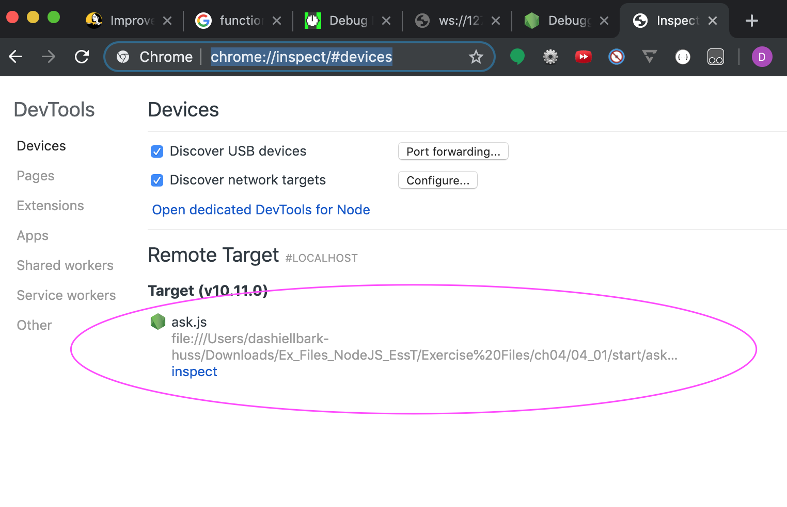
  
  ## Using DevTools on Node
  
  When it came to actualy using the DevTools it was really confusing. As soon as I got a bug my sources disappeared. So this is still confusing me.
  
  ## Practicing EventEmitter
  
  I used EventEmitter successfully on my node module after a while of running into an error. The reason? I forgot to return the emitter instance in my function! 
  
  Using the EventEmmiter helped me understand what might be going on in the background when you use regular events.

## Day 37, R2
### 5/17/19

- ## Node JS Notes / Practice
  I'm reviewing what I learned so far in the lynda.com tutorial:
  [Node.js Essential Training 2019 Lynda Tutorial](https://www.lynda.com/Node-js-tutorials/Node-js-Essential-Training-Part-I-2019-REVISION/5016729-2.html)
  
  I'm going to redo some of the projects he does in the tutorial.
  
  ## Alex Bank's Process Tips
  
  I liked how Alex walked through his process:
  
  >...we want to have a variable that can hold our questions:
  
  ```javascript
  const questions = [
  
  ] 
  ```
  >..within this array we want to beable to add any number of questions, and have those questions asked to the user through the terminal.
  
  ### Example questions:
   ```javascript
  const questions = [
    "What is your name?",
    "What is your favorite snack?",
    "Do you like cilantro?"
  ] 
  ```
  
  >**So sometimes when I have a coding challenge, I try to think about what I do and represent it as a function call.** So, for instance I know that we need to collect the answers from the user in the terminal. I'm not necessarily sure how to do that, but I can imagine that there would be a function called `collectAnswers`. 
  
  ```javascript
  collectAnswers()
  ```
  >And, without knowing how the `collectAnswers` function will work, what I do know is I want to send it an array of questions,
  
  ```javascript
  collectAnswers(questions)
  ```
  
  >...and I want the `collectAnswers` function to ask every question in the array, in the order that they're presented, of the user. And, when I get a list of answers back, I can handle that with a callback function. So I know that the second argument of my collectAnswers function should probably be a callback function,
  
    ```javascript
  collectAnswers(questions, callback)
  ```
  
  >...and that callback function should pass a list of answers back. So, I send a list of questions in as an array, and I expect a list of answers back. 
  
  ```javascript
  collectAnswers(questions, answers => {
  
    //do something with the answers, exit the process
  
  })
  ```
  
  >**So this is what I want to do, and at this point I might not necessarily be sure how to do it, but I know that I need a function called `collectAnswers`, so I'm going ot go ahead and create that function.** And the first argument that the `collectAnswers` function is going to take, is an array of questions, so I'll go ahead and call them questions. And, the second argument is a callback function, to be invoked when we're finished, so I'm going to call this done, meaning I want to invoke this function, once the user has answered all of the questions.
  
    ```javascript
  const collectAnswers = (questions, done) = {
  
  }
  ```
  
  ## Making An Ask Questions Module
  
  ### Module:
  
  ```javascript
  const readline= require("readline");

  const rl = readline.createInterface({
    input: process.stdin,
    output: process.stdout
  });

  const collectAnswers = (questions, done = f=>f) => {
    let answers=[];

    const questionAnswered = (answer)=>{
      answers.push(answer);
      if (answers.length == questions.length){
        done(answers);
      } else if (answers.length < questions.length){
        rl.question(questions[answers.length], questionAnswered);
      }

    }

    rl.question(questions[0], questionAnswered);

  };

  module.exports = {
    collectAnswers
  }
  ```
  
  ## Requiring The Module
  
  ```javascript
  const ask = require("./askQuestions");

  const questions = [
    "How are you?",
    "Do you like mac or pc?",
    "Do you like organic bacon?"
  ]

  ask.collectAnswers(questions, answers=>{
    console.log("thank you! Answers:", ...answers);
    process.exit()
  });

  ```
  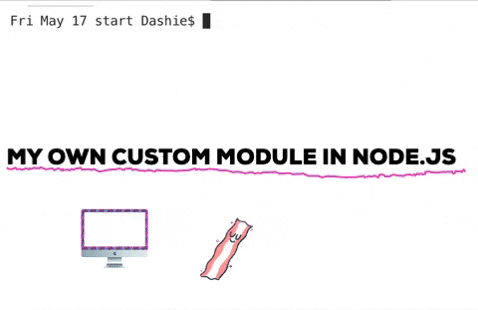


## Day 36, R2
### 5/16/19

- ## Node JS Notes
  Continued notes on node.js lynda.com tutorial:
  [Node.js Essential Training 2019 Lynda Tutorial](https://www.lynda.com/Node-js-tutorials/Node-js-Essential-Training-Part-I-2019-REVISION/5016729-2.html)
  
  ## Core Modules
  
  Core modules are modules that come with node.js so you don't need to install them. But you do need to import them to use them. To do this you use `require()`
  
  ## Destructure Module Functions
  If you only want one function from a module you can use destructuring:
  
  ### Regular:
  ```javascript
  const path = require("path");
  const util = require("util");

  util.log(path.basename(__filename));
  ```
  
  ### Destructured:
  ```javascript
  const path = require("path");
  const { log } = require("util"); //destructured

  log(path.basename(__filename));
  ```
  
  ## Dot Slash Folder (./folder)
  `./` means:
  > ./ is the the folder that the working file is in
  
  -*from [What does “./” (dot slash) refer to in terms of an HTML file path location?](https://stackoverflow.com/questions/7591240/what-does-dot-slash-refer-to-in-terms-of-an-html-file-path-location)*
  
  So it's no different from `../`
  
  ## Custom Modules
  
  When you make your own module, you must include the path in order to require it:
  ```javascript
  const name = require("./myModule");
  ```
  You don't need the path if the module ships with node or is installed via npm.
  
  In the module file, you need to `export` a value:
  ```javascript
  module.exports = "alex";
  ```
  
  ## More Complex Custom Module Example:
  
  ### Count Module
  ```javascript
  let count = 0;
  const inc = () => ++count;
  const dec = () => --count;

  const getCount = () => count;

  module.exports = {
    inc,
    dec, 
    getCount
  }
  ```
  
  ## Importing the Count Module
  
  ```javascript
  const { inc, dec, getCount } = require("./myModule");
  inc();
  inc();
  inc();
  dec()

  console.log(getCount()); //2
  ```
  
  
  ## Property Value Shorthand
  
  I've seen this before but it confused me today:
  
  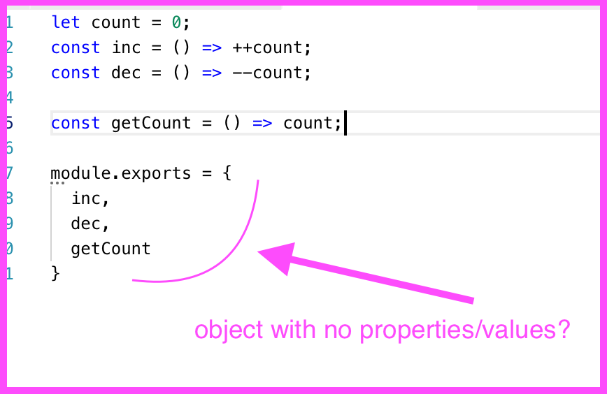
  
  An object with properties that aren't in the `key: value` format. This is called the [property value shorthand]( https://javascript.info/object#property-value-shorthand).
  
  ## Method Shorthand
  There's also a [method shorthand](https://developer.mozilla.org/en-US/docs/Web/JavaScript/Reference/Operators/Object_initializer#Method_definitions):
  
  >In ECMAScript 2015, a shorthand notation is available, so that the keyword "function" is no longer necessary.
  >
  >```javascript
  >// Shorthand method names (ES2015)
  >var o = {
  >  property(parameters) {},
  >  *generator() {}
  >};
  >```
  
  ## Event Emitter
  A node.js module that gives us a mechanism for emitting custom events and wiring up listeners and handlers for those events:
  
  ### Construct a new instance of the event emitter that that we can use to raise custom events:
  ```javascript
  const events = require("events");

  const emitter = new events.EventEmitter();
  ```
  
  Use the `emit()` function to raise custom events:
  ```javascript
  process.stdin.on("data", data => {
    const input = data.toString().trim();
    if (input === "exit") {
      emitter.emit("customEvent", "Goodbye!", "process"); //customEvent raised when we hit this point
      process.exit();
    }
    emitter.emit("customEvent", input, "terminal"); //customEvent raised when we hit this point
  });
  ```
  Wiring up listeners and handlers with the Events Emitter's `.on()` function:
  ```javascript
  emitter.on("customEvent", (message, user) => { //handle custom event
    console.log(`${user}: ${message}`);
  });
  ```
  This says, when a custom event occurs handle it with this callback function.
  
  Event Emitter is asyncronous. The events are raised when they happen.
  
- ## Thoughts and Feelings:
  Learning these new concepts is more draining than building something. I needed to take more breaks. Tomorrow, I'm going to do some more hands on coding with what I learned from today.
  

## Day 35, R2
### 5/15/19

- ## Node JS Notes
  Continued notes on node.js lynda.com tutorial:
  [Node.js Essential Training 2019 Lynda Tutorial](https://www.lynda.com/Node-js-tutorials/Node-js-Essential-Training-Part-I-2019-REVISION/5016729-2.html)
  
  ## Debugging?
  So far we have only run these node files in the terminal. But how do I debug them?
  
  I guess I don't know yet because I don't know how to put our files into the browser. I think you have to set up a node server or something so node an compile the code.
  
  ## `setTimeout` and `setInterval`
  
  I started to recreate the instructer's project but I wanted to make it more interesting. This led to my playing with `setTimeout` and `setInterval`. 
  
  I'm having trouble getting a loop to delay using `setTimeout` or `setInterval`.
  
  I redid my code so I can do it in the browser and use the debugger.
  
  The answer on the thread [How do I add a delay in a JavaScript loop?](https://stackoverflow.com/questions/3583724/how-do-i-add-a-delay-in-a-javascript-loop) looks like it uses recursion:
  
  ```javascript
  
  var i = 1;                     //  set your counter to 1

  function myLoop () {           //  create a loop function
     setTimeout(function () {    //  call a 3s setTimeout when the loop is called
        alert('hello');          //  your code here
        i++;                     //  increment the counter
        if (i < 10) {            //  if the counter < 10, call the loop function
           myLoop();             //  ..  again which will trigger another 
        }                        //  ..  setTimeout()
     }, 3000)
  }

  myLoop();                      //  start the loop
  
  ```
  
  There was debate about whether the recursion was a problem in the comments.
  
  ## Practice: Node.js New Years
  
  I remade what the the time that the teacher made, with my own pizazz: I made a NYE countdown timer.
  
  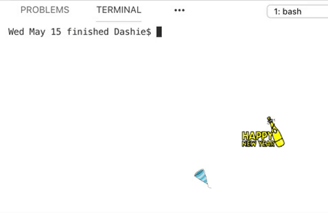
  
  ### Code:
  
  ```javascript
  const waitTime = 6000;
  const intervalTime = 1000;
  let seconds = waitTime /1000;

  function countDown(){
    process.stdout.clearLine();
    process.stdout.cursorTo(0);
    process.stdout.write(`${seconds -1}!!!!`);
    seconds -= 1;

  }

  function sing() {
    clearInterval(interval);
    process.stdout.clearLine();

    var i = 0;                     
    let numOfWords;
    const song = 
    `Happy New Year!!!!!!
    Should old acquaintance be forgot, 
    and never brought to mind?
    Should old acquaintance be forgot,
    and old lang syne?`;

    const lines = song.split("\n");

    function myLoop () {  

      const callback = function () {    
        console.log(`${lines[i]}
      `);          
        i++;                     
        if (i < lines.length) {            
           myLoop();             
        }                        
     };
        const numOfWords = (lines[i].match(/ /g) || []).length + 1;
        setTimeout(callback, 170 * numOfWords) 
     }

    myLoop(); 
  }

  const interval = setInterval(countDown, intervalTime);

  setTimeout(sing, waitTime)

  ```


## Day 34, R2
### 5/14/19


- ## Helping
  I looked at [Swishyfishie's @Swishyfishie2](https://twitter.com/Swishyfishie2) code. He has a counter here. You can add 1 or 2 and then submit to save to `sessionStorage`. 
  
  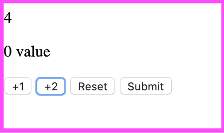
  
  It was adding more numbers than expected after you press submit. 
  
  I made a `log(func)` function to call from each function that Swishy made to see where the problem was. The `log(func)` function console logs the function name and the `count` variable's value:

  ```javascript
  function log(func) {
    console.log(`func:${func}, count:${count}`);
  };
  ```
  You call `log(func)` from each function, passing in a name for your function such as "+1" or "save".

  What I saw was that when the submit button was pressed, `count` increased by one. Sure enough Swishy was adding 1 to `count`, probably left over from copy and pasting from his first function.
 
  ```javascript
  btnSave.onclick = function () {
      saved.innerHTML = localStorage.getItem('county', count += 1); //oops adding 1 here
      log("save");
  }
  ```
  
  Seems to work after deleting `count += 1` from that line. 
 
- ## Node JS Notes
  Continued notes on node.js lynda.com tutorial:
  [Node.js Essential Training 2019 Lynda Tutorial](https://www.lynda.com/Node-js-tutorials/Node-js-Essential-Training-Part-I-2019-REVISION/5016729-2.html)
  
  [How, in general, does Node.js handle 10,000 concurrent requests?](https://stackoverflow.com/questions/34855352/how-in-general-does-node-js-handle-10-000-concurrent-requests)
  
  ## Global Object
  
  [Mozilla Docs: Global Object](https://developer.mozilla.org/en-US/docs/Glossary/Global_object)
  
  >The global object's interface depends on the execution context in which the script is running. For example:
  >
  >- In a web browser, any code which the script doesn't specifically start up as a background task has a Window as its global object. This is the vast majority of JavaScript code on the Web.
  >
  >- Code running in a Worker has a WorkerGlobalScope object as its global object.
  >
  >- Scripts running under Node.js have an object called global as their global object.

  [Node.js v12.2.0 Documentation: Global Objects](https://nodejs.org/api/globals.html)
  
  ## Modules
  
  Every node.js file we create is refered to as a module.
  
  ## `require()`
  
  `require()` is used to load external modules. Modules are other javascript files containing code. We can either load modules that have shipped with our installation of Node.js, modules we install with npm, or other modules that we create. `require()` is available to us on the global object.
  
  # `process` object
  The `process` object contains information about the current process as well as tools to allow us to interact with the process.
  
  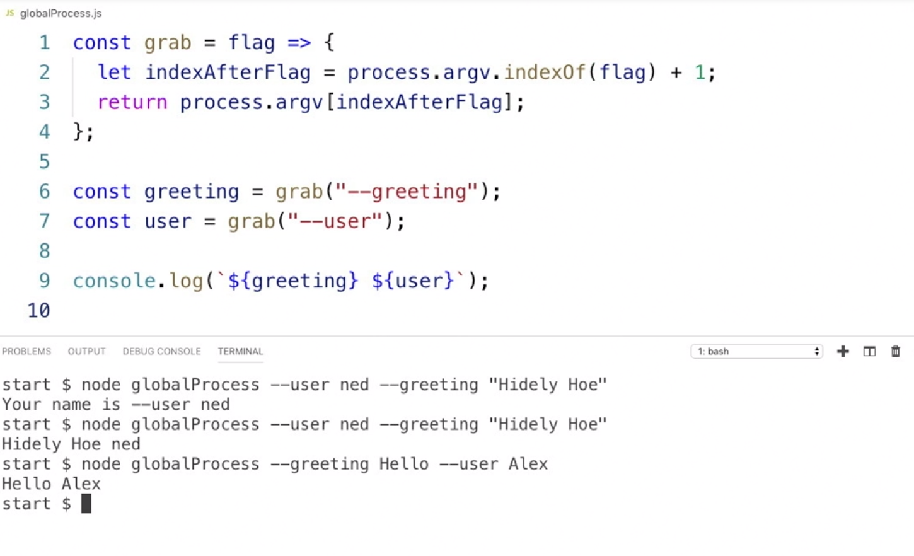
  
  ## Practice What I Learned
  
  I made my own version of a little questions program that the instructor made. I did different questions.
  
  ```javascript
  const questions = [
    "Who do you love?",
    "Who are you?",
    "Are you horny? Answer y or n"
  ];

  const ask = (i = 0 ) => {
    process.stdout.write(`\n${questions[i]} \n\n`);
  }

  ask()

  const answers = [];

  process.stdin.on("data", (data)=>{
    answers.push(data.toString().trim());

    if (answers.length < questions.length) {
      ask(answers.length);
    } else {
      process.exit();
    }
  });

  process.on("exit", ()=>{
    const [lover, name, horny] = answers;

    const doThisTo = horny === "y" ? "make love to": "kiss";
    console.log(`
    ${name.charAt(0).toUpperCase() + name.slice(1)}, you should ${doThisTo} ${lover.charAt(0).toUpperCase() + lover.slice(1)}!
    `);
  });
  ```
  
  
  
- ## Thoughts and Feelings:
  If I don't do some sort of hands on coding (not just coding along with the tutorial), I get super bored by tutorials. So I need to always try to do something at least slightly creative along with the tutorial. Today, that meant recreating the questions program with my own questions.

 
## Day 33, R2
### 5/13/19

- ## NPM Notes
  I continued this npm tutorial:
  [Learning npm the Node Package Manager Tutorial](https://www.lynda.com/Node-js-tutorials/Learning-npm-Node-Package-Manager-2018/761956-2.html)
  
  ## Notes:
  
  `npm outdated`: To see if any packages are outdated locally, `-g` to get global
  
  `npm update <package>` or `npm install <package>` to update package.
  
  `npm uninstall <package>`: uninstall a dependency
  
  ## "devDependencies" vs "dependencies"
  >The difference between these two, is that devDependencies are modules which are only required during development, while dependencies are modules which are also required at runtime.
  
  -*from [NPMmmm #1: Dev Dependencies, Dependencies](https://medium.com/@dylanavery720/npmmmm-1-dev-dependencies-dependencies-8931c2583b0c)*

  
  ## Semantic Versioning
  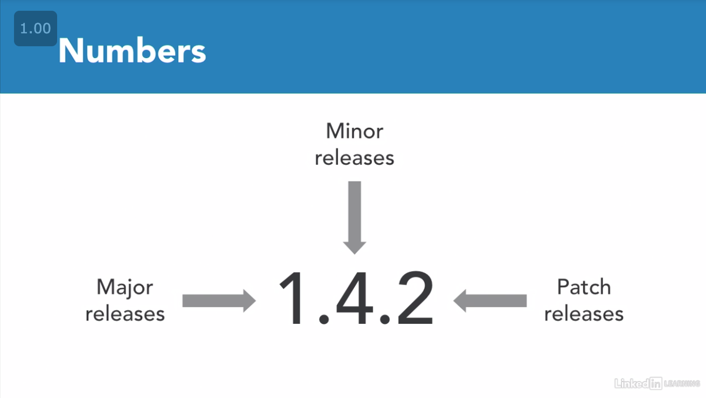
  
  ### Controlling Version:
  
  ### ^1.x.x
  
  The ^ caret symbol means:
  
  Update all releases that have a major release of 1.
  
  ```javascript
   "devDependencies": {
    "babel-preset-env": "^1.7.0",
  }
  ````
  
  ### ~1.7.x
  
  The ~ tilde symbol means:
  
  Update all releases that have a major release of 1 and a minor release of 7.
  
  ```javascript
   "devDependencies": {
    "babel-preset-env": "~1.7.0",
  }
  ````
  
  ## `package-lock.json` vs `package.json`
  Confused about the difference between these two.
  
  It seems like `package-lock.json` controls things more, specifies things more. But then what's the point of having both?
  
  [Everything You Wanted To Know About package-lock.json But Were Too Afraid To Ask](https://medium.com/coinmonks/everything-you-wanted-to-know-about-package-lock-json-b81911aa8ab8)
  
  >package-lock.json: records the exact version of each installed package which allows you to re-install them. Future installs will be able to build an identical dependency tree.
  >
  >package.json: records the minimum version you app needs. If you update the versions of a particular package, the change is not going to be reflected here.
  
  -*from [What is the difference between package.json and package-lock.json](https://delegatecall.com/questions/what-is-the-difference-between-packagejson-and-packagelockjson-2bd0e4e1-a65f-4d78-b8d8-b51905a37adb)*
  
  ## npm Cache
  
  npm keeps a cache of your install modules so that it doesn't have to get them everytime. Clearing your cache should always be a step in your troubleshooting when working with modules and not understanding what's happening.
  
  `npm-cache-verify`: Verifies you cache. (What does that mean?)
  `npm-cache-clean --force`: clean the cache
  
  ## npm audit
  
  Hard to understand this video without having context for it.
  
  `npm audit` is a command that will check the dependencies of your project and make sure they are safe to use.
  
  [Run an npm audit Lynda Video](https://www.lynda.com/Node-js-tutorials/Run-npm-audit/761956/800277-4.html?autoplay=true)
  
  ## Scripting in package.json
  Scripting in a package.json file gives us a way to do a simple command, to repeat, or execute complex commands.
  
  [npm-scripts docs](https://docs.npmjs.com/misc/scripts)
  
  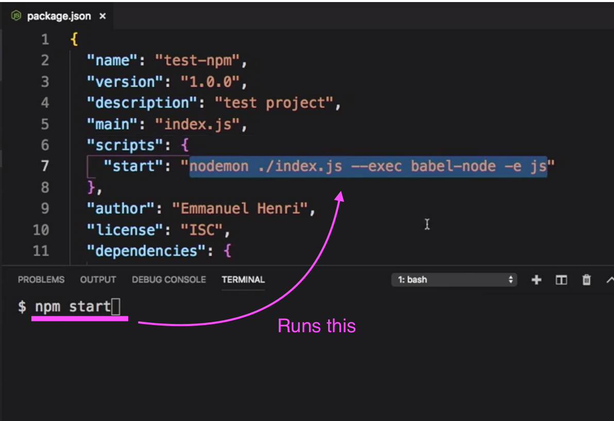
  
  **Run:**`npm <preset script name>` or `npm run <your own script name>`
  
  ## npm npx
  
  npx lets you temporarily install a package just to run one of the commands from that package. This way you avoid package pulution.
  
  [npm npx docs](https://www.npmjs.com/package/npx)
  
- ## Node JS Notes
  Notes on node.js lynda.com tutorial:
  [Node.js Essential Training 2019 Lynda Tutorial](https://www.lynda.com/Node-js-tutorials/Node-js-Essential-Training-Part-I-2019-REVISION/5016729-2.html)
  
  ## Single Threaded non-blocking event driven IO
  ### Single threaded
  Node is single threaded. This confuses me because what if an application has millions of users? How can they all be on the same thread without slowing things down?
  
  ### I/O
  I don't know what I/O means for and I had trouble finding out. 
  
  >Node.js is an open source project designed to let you write JavaScript programs that talk to networks, file systems or other I/O (Input/Output) sources
  >...
  >What is an "I/O based program"? Here are some common I/O sources:
  >
  >Databases (e.g. MySQL, PostgreSQL, MongoDB, Redis, CouchDB)
  >APIs (e.g. Twitter, Facebook, Apple Push Notifications)
  >HTTP/WebSocket connections (from users of a web app)
  >Files (image resizer, video editor, internet radio)
  
  -*from [introduction to node: Understanding node](https://gist.github.com/maxogden/4011336#understanding-node)*
  
- ## Helping
  
  I started to look at some code that [Swishyfishie @Swishyfishie2](https://twitter.com/Swishyfishie2) was stuck on but I didn't get enough time to really check it out. Will look at it tomorrow!
  
## Day 32, R2
### 5/12/19

- ## Testing eslint-plugin-html
  I got the plugin to work again a different way. I just copied and pasted the `node_modules` folder from the other projects into a new project and copied the `.eslintrc.json` file.
  
  ## User Settings vs `.eslintr.json`
  But if I remove this from the user settings:
  
  ```javascript
    "eslint.options": {
    "plugins": [
      "html"
    ]
  },
  ```
  
  Eslint stops linting HTML on the last two project folders: `testing_eslint_project` and `playing with javascript`. But it still works on `perfect_fit_meal`.
  
  Now I see why. The `.eslintrc.json` in `perfect_fit_meal` had: 
  
  ```javascript
  "plugins": [
    "html"
  ]
  ```
  
  But the other two didn't have those settings in their `.eslintrc.json` file.
  
  ## Global Vs Local `eslint_plugin_html`
  
  I can also see that `perfect_fit_meal` has `eslint-plugin-html` in the `node_modules` folder. The other two projects don't. They must be getting the plugin globally. 
  
  The other two also don't have `eslint-plugin-html` listed in the `"dependenies"` property in the `package.json` file like `perfect_fit_meal` does. I think I got it there when I ran `npm install --save-dev eslint-plugin-html`.
  
- ## Prettier
  
  I think I understand a bit more about these plugins now. I'm going to try to install prettier again.
  
  ## Wes Bos Prettier + ESLint Video
  
  I followed this Wes Bos [How to Setup VS Code + Prettier + ESLint](https://www.youtube.com/watch?v=YIvjKId9m2c) video again. I still get ***"Failed to load plugin prettier: Cannot find module 'eslint-plugin-prettier'"***
  
  ## No Dependency
  Now that I understand a little more I can see that I do not have that module in my `node_modules` folder; globally or locally. It's also not in the `package.json` file's `"dependencies"`. 
  
  But why doesn't Wes Bos tell you how to get the dependency?
  
  ## Adding The Dependency Through the Terminal
  
  I'm guessing I need to add it like how I got the eslint dependency, `npm install --save-dev eslint-plugin-html`
  
  So I ran:
  
  `npm install --save-dev eslint-plugin-prettier`
  
  Now I see `"eslint-plugin-prettier": "^3.1.0"` in my `"dependencies"` in my `"package.json"` file.
  
  ## No Dependency In node_modules
  
  Even though I see `"eslint-plugin-prettier": "^3.1.0"` in `"package.json"`, I don't see it in my `node_modules` folder. Even though it says it added the plugin:
  
  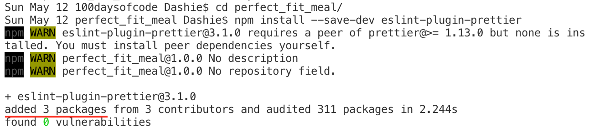
  
  ## Another Missing Dependency
  I restarted VSC and got this error: 
  
  ***[Error - 13:55:17] Cannot find module 'eslint-config-prettier' Referenced from: /Users/dashiellbark-huss/Documents/100daysofcode/perfect_fit_meal/.eslintrc.json***
  
  So I also ran:
  
  `npm install --save-dev eslint-config-prettier`
  
  Now I see `eslint-plugin-prettier` but no `eslint-config-prettier` in the node_modules. But I do see both in the `"dependencies"` in the `package.json`.
  
  ## Restart VSC to See the Dependencies
  
  I restarted VSC and now I see the `eslint-config-prettier`! ***So maybe after you add a dependency through the terminal you have to refresh VSC.***
  
  ## Prettier Configs
  
  I added this back to the `.eslintrc.json` file which Wes Bos said to add:
  
  ```javascript
    "prettier/prettier": [
    "error",
    {
      "singleQuote": true
    }
  ]
  ```
  
  But I got this error:
  
  ***Error: ESLint configuration in /Users/dashiellbark-huss/Documents/100daysofcode/perfect_fit_meal/.eslintrc.json is invalid:***
  ***Unexpected top-level property "prettier/prettier".***
  
  In these [docs for eslint-config-prettier](https://github.com/prettier/eslint-config-prettier) they have ***the `"prettier/prettier"` property inside the `"rules"` property. I moved it there and that error went away.***
  
  ```javascript
  "rules": {
    "no-console": "off",
    "prettier/prettier": [
      "error",
      {
        "singleQuote": true
      }
    ]
  }
  ```
  
  ## Still Missing Dependencies
  
  But I have new errors:
  
  ***[Error - 14:13:42] ESLint stack trace:***
  ***[Error - 14:13:42] Error: Cannot find module 'prettier'***
  
  So I ran:
  
  `npm install --save-dev prettier`
  
  and restarted VSC.
  
  No errors!
  
  Now let's see if it worked.
  
  ## Working (sort of)!
  
  It fixing on save on .js files on. But not .html. It is registering prettier on those files:
  
  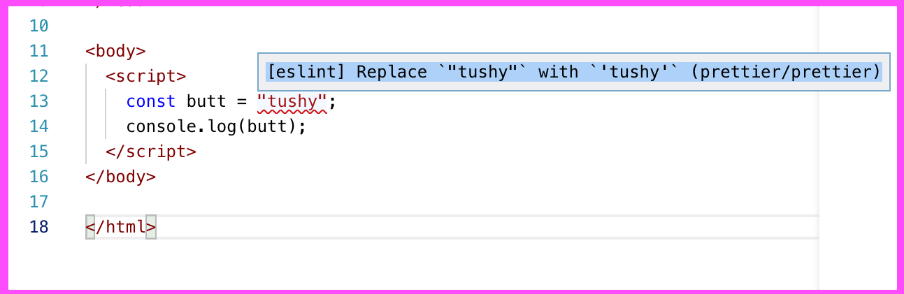
  
  But when I save it doesn't change the quotes.
  
  ## Prettier Doesn't Work on Script Tags
  
  Looks like it's not possible to fix on auto save in the HTML files:
  
  >It's a planned feature but not supported just yet.
  
  ***-from [How to format code in script tags?](https://github.com/prettier/prettier/issues/2648)***
  
  ## Summary
  
  Looks like I got it working. My problem was that I never actually installed the dependancies. I don't know why that wasn't part of the Wes Bos tutorial. Now I understance a little more about how the dependancies work, where they are, and how to add them. I'm glad I took the time to figure this out because I understand these packages better. That will come in handy when I learn node which I'm going to do soon!

## Day 31, R2
### 5/11/19

- ## Getting ESLint to Work on HTML AGAIN

  I'm trying to figure out these npm packages. I can't get ESLint to lint the HTML in my `playing_with_javascript` directory.
  
  I tried adding configurations to the user settings instead of the `.eslintrc.json` file according to this tutorial: [Eslint setup in Visual Studio Code](https://youtu.be/o2H8kvuwMKE?t=344)
  
  I deleted all my files in `playing_with_javascript` related to node or eslint. I followed this video to install eslint: [Eslint setup in Visual Studio Code](https://youtu.be/o2H8kvuwMKE?t=344). I made sure my terminal was in my project directory.
  
  I got this notification in my terminal: ***"We recommend using this local copy instead of your globally-installed copy."*** How do I control which one my project uses? Not sure, but I can see that it's loading locally in the ESLint tab.
  
  ## ESLint HTML Plugin
  
  In my project directory I ran `npm install --save-dev eslint-plugin-html`, following: [How can I get ESLint to lint HTML files in VSCode?](https://stackoverflow.com/questions/54138689/how-can-i-get-eslint-to-lint-html-files-in-vscode/54138880#54138880)
  
  I added this to the `.eslintrc.json` file:
  ```javascript
  "plugins": [
    "html"
  ]
  ```
  
  I also ran `eslint --ext .html,.js playing_with_javascript` while in the `100daysofcode` directory:
  
  > Note: by default, when executing the eslint command on a directory, only .js files will be linted. You will have to specify extra extensions with the --ext option. Example: eslint --ext .html,.js src will lint both .html and .js files in the src directory. See ESLint documentation.
  
  -*from [BenoitZugmeyer/eslint-plugin-html](https://github.com/BenoitZugmeyer/eslint-plugin-html#usage)*
  
  ## It Works Now But...
  
  Ok I just realized it actually works. ESlint is linting HTMl files in `playing_with_javascript`. But I hadn't realized it was working for a while. I'm not sure for how long. So I'm not sure what I did that was necessary and what was unneccessary.
  
  ## Undoing Adding ESLint
  
  I'm going try to undo everything I did when trying to add ESLint and the html plugin. Then do it again so I can see when it actually starts linting the HTML.
  
  ## Uninstalling ESLint
  Following this: [Uninstalling packages and dependencies](https://docs.npmjs.com/uninstalling-packages-and-dependencies). 
  
  In my project directory, I ran `npm uninstall eslint` and it didn't look like it did anything. 
  
  So I also ran `npm uninstall --save eslint`. That didn't look like it did anything either because my `node_modules` folder, `.eslintrc.json` file, and package.json file were all still there. 
  
  But when I restarted VSC it wasn't loading ESlint anymore. I looked it my `package.json` file and I could see eslint wasn't there, just some of the plugins that go with eslint were there:
  
  ```javascript
  "devDependencies": {
    "eslint-config-airbnb-base": "^13.1.0",
    "eslint-plugin-html": "^5.0.3",
    "eslint-plugin-import": "^2.17.2"
  }
  ```
  
  And I no longer saw the `eslint` folder in `node_modules`. So I guess the command **did** remove ESLint, it just didn't get rid of npm. Maybe that seems like obvious behavior to most people, but I'm still trying to understand this all.
  
  ## Uninstalling NPM
  
  I couldm't find any information about removing npm locally through the terminal, except for this:
  
  > Local installs are completely contained within a project’s node_modules folder. Delete that folder, and everything is gone (unless a package’s install script is particularly ill-behaved).
  
  -*from [npm-removal Cleaning the Slate](https://docs.npmjs.com/misc/removing-npm.html)*
  
  It doesn't mention the `package.json` file or other files that were installed with npm. I'm just going to delete them.
  
  ## `--ext`
  
  The only thing I still have to undo is this command: `eslint --ext .html,.js playing_with_javascript`. But I'm not sure what it did? How to undo it? I could maybe set it back to just `.js`, like this: `eslint --ext .js playing_with_javascript` But I'm not sure if that would undo the command to lint html extensions. I really don't know what this command is changing? Is there a configuration somewhere?
  
  >My questions are:

  >I couldn't find the configuration option for doing this from .eslintrc.
  >
  >...
  >
  
  One of the answers:
  >You can’t define this in .eslintrc files because file traversal happens before the configuration is read
  [Configuration option for '--ext' switch #3469](https://github.com/eslint/eslint/issues/3469)
  
  So it's not in the  `.eslintrc.json` file. 
  
  I think if I just pass in .js, it will set it to only use .js extensions again because I found this:
  
  >Use only .js2 extension
  >eslint . --ext .js2
  
  -*from [Command Line Interface](https://eslint.org/docs/user-guide/command-line-interface#--ext)*
  
  I ran `eslint --ext .js playing_with_javascript`. I got an error:
  
  
  
  This is confusing. If you can't define the extensions in the `.eslintrc` files, then why would it matter that there is no `.eslintrc` file? But maybe, even though the extenson configurations aren't stored there, you for some reason still need that file.
  
  ## Starting over
  
  I think everything is reset to how it was to begin with in my `playing_with_javascript` directory. So I started again.
  
  ## It worked!
  
  This is what I did:
  
  I ran these commands on the project directory and followed the prompts for each:
    
  `npm init`
  `eslint --init`
  
  I restarted VSC and ESLint now ***lints the HTML*** on the `playing_with_javascript` directory even though I did nothing else. Probably because I put this in the user settings for my workspace earlier:
 
  ```javascript
  "eslint.validate": [
    "javascript",
    "javascriptreact",
    "html"
  ],
  "eslint.options": {
    "plugins": [
      "html"
    ]
  },
  ```
  
  Normally the plugins can be put in the `.eslintrc.json` file. But when it's in the user settings in `"eslint.options"` it applies to the workspace.
  
  I'm not sure if `eslint --ext .html,.js playing_with_javascript` did anything earlier. 
  
  ## Summary
  
  So I did a lot of stuff I didn't need to do but I learned a lot in the process.
  
## Day 30, R2
### 5/10/19

- ## Helping
  Today I got to help someone who posted about a css issue on Twitter. I have yet to hear back if it was helpful. Hopefully it was.
  
  They were having trouble getting these inputs to vertically align:
  
  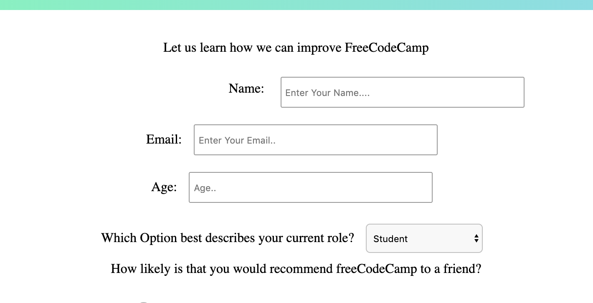
  
  ### 1. To start, I added a border to all the divs to see better what was going on:
  
  ```css
  * {
  border: 1px solid red;
  }
  ```
  
  ### 3. I got rid of these extra divs:
  
  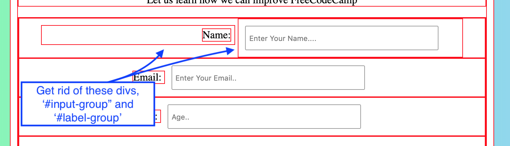
  
  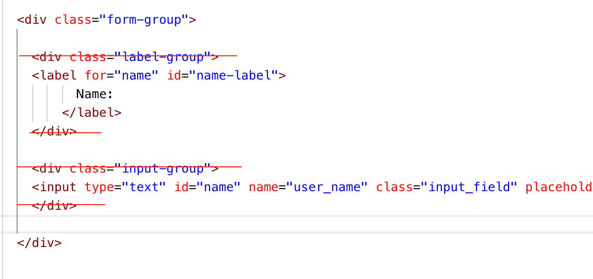
  
  ### That gave me these centered but misaligned inputs:
  
  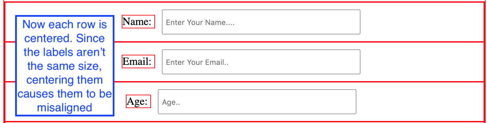
  
  ### 4. I added a class to the labels so I could make their widths uniform to align everything:
  
  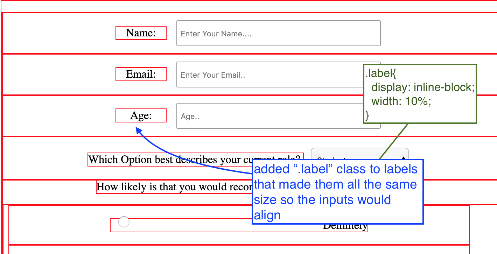
  
  ### 5. Added `text-align: right` to line up the colons.
  
  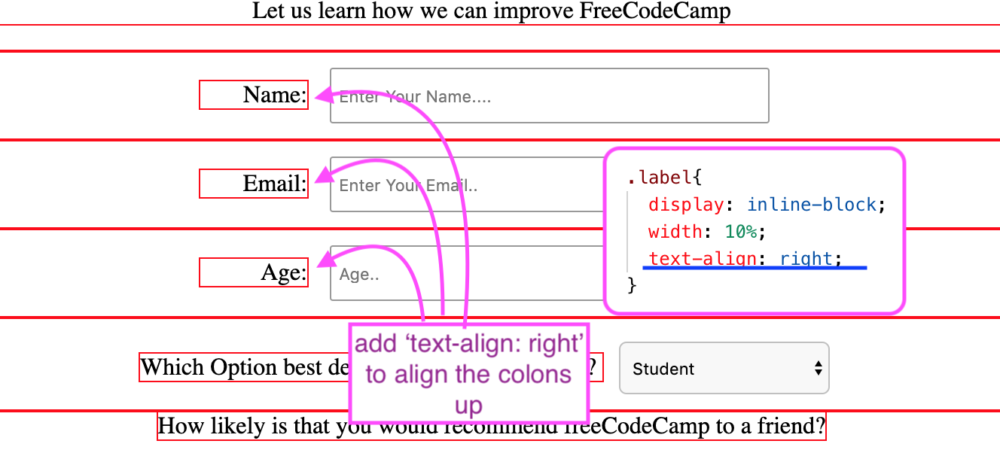
  
- ## Prettier
  Now I need to figure out how to get prettier to work. I'm going to do some investigating to see how these extensions work.
  
  ## ESLint-plugin-html
  
  I have the plugin `eslint-plugin-html` locally and globally. I wasn't sure which I was using with my `perfect_fit_meal` project. To find out, I messed with the file name of my local plugin.
  
  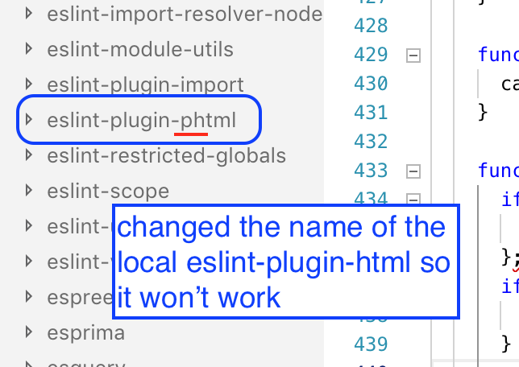
  
  When I restarted VSC it gave me this error:
  
  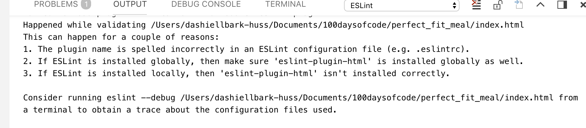
  
  So now I know that my `esLint-plugin-html` is coming from the local directory.
  
  ## What about other project directories?
  
  I wonder how ESLint will work in other project directories? Where will it load from?
  
  I opened the directory for a project called `playing_with_javascript`, a project that didn't have ESLint installed locally to see what would happen. One thing to note is both these directories, `playing_with_javascript` and `perfect_fit_meal`, are in the same workspace. So I believe they share the same user settings.
  
  ## No Local ESLint? Load Globally
  
  This directory, `playing_with_javascript`, loaded ESLint from my global modules.
  
  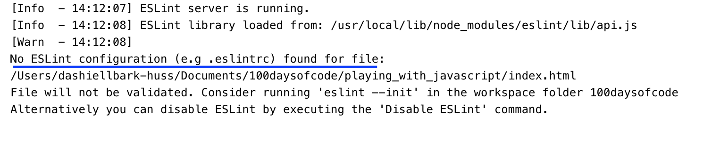
  
  As you can see from the underlined error, it looks like your `.eslintrc.json` should in to your project directory even if there's no local ESLint.
  
  ## Adding Configs
  
  I copied the `.eslintrc.json` file from my `perfect_fit_meal` directory and pasted it in to `playing_with_javascript`. Now we can see it's using the config file to get the airbnb style guide, but it can't find the airbnb module.
  
  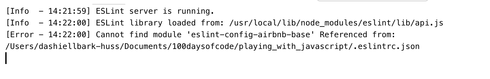
  
  ## Adding `node_modules`
  
  To get the air bnb module into the project, I copied the `node_modules` directory from the `perfect_fit_meal` directory. I pasted it into the `playing_with_javascript` folder.
  
  Now `playing_with_javascript` loads the ESLint locally from the local `node_modules` folder instead of the global one. And it's gettting the airbnb module from there. We can tell that it's getting the airbnb module from there because that error went away after adding `node-modules`.
  
  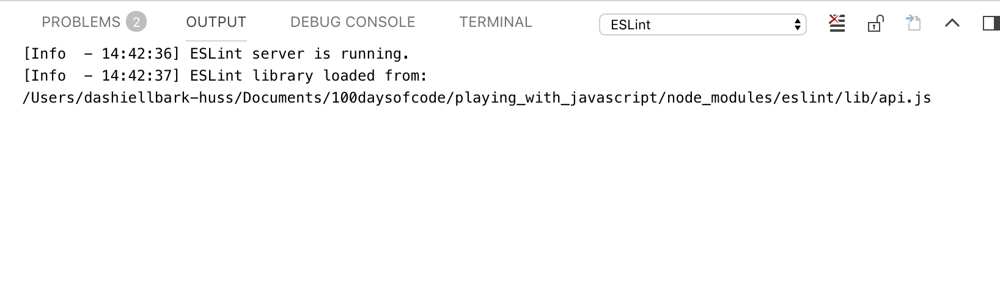
  
  But our html files aren't getting linted.
  
  ## Why Aren't HTML Files Getting Linted?
  
  I messed with the `eslint-plugin-html` directory name again to see if that would cause issues. It did. So I know the html plugin is being accessed. 
  
  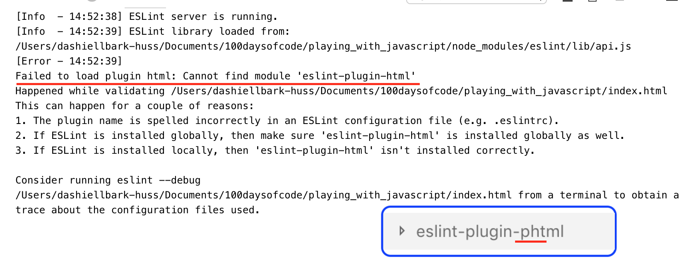
  
  I changed the folder name back. The error went away. 
  
  But why isn't ESLint linting the html files in `playing_with_javascript`?
  
  This is where I left off. Confused still, but a little less so. So I'm stoked!
  
  
## Day 29, R2
### 5/9/19

- ## Recipe Calculator
  ## To Do
  - Set Up dotenv
  - lint my code
  - Look into Prettier vsc extension because [Jacob M-G Evans  ⚛ @JacobMGEvans](https://twitter.com/JacobMGEvans) said it goes well with ESLint (but what about Beautify?)
  
  ## Prettier
  I started to set up Prettier as a ESLint plugin following Wes Bos's tutorial.
  
  [How to Setup VS Code + Prettier + ESLint](https://www.youtube.com/watch?v=YIvjKId9m2c)
  
  ## Errors!
  Now my ESlint is underlining the wrong things. For example, it underlines `this.readyState` but when I hover over `this.readyState`, ESLint tells me what's wrong with a *different* part of my code.  I deleted everything I added to my settings and configurations and it works again. 
  
  It's probably not working because *Prettier* failed to load:
  
  Terminal:
  
  ```
  Failed to load plugin prettier: Cannot find module 'eslint-plugin-prettier'
  Happened while validating /Users/dashiellbark-huss/Documents/100daysofcode/perfect_fit_meal/index.html
  This can happen for a couple of reasons:
  1. The plugin name is spelled incorrectly in an ESLint configuration file (e.g. .eslintrc).
  2. If ESLint is installed globally, then make sure 'eslint-plugin-prettier' is installed globally as well.
  3. If ESLint is installed locally, then 'eslint-plugin-prettier' isn't installed correctly
  ```
  
  So these extra *Prettier* configurations are maybe throwing off my ESlint configs since Prettier isn't actually installing. I don't know but I want to get *Prettier* to work.
  
  ## Is My ESLint Installed Globally?
  
  Since these errors had to do with whether ESLint was installed locally or global, I had to figure that out.
  
  [How to tell if npm package was installed globally or locally](https://stackoverflow.com/questions/26104276/how-to-tell-if-npm-package-was-installed-globally-or-locally):  
  - `npm list -g`
  - `npm list -g --depth=0`
  
  ### My Global Packages:
  
  
  
  Looks like **it's installed globally.** 
  
  But, it's **also installed locally** since I can see the *ESlint* files in my project directory. That's probably causing issues.
  
  ## ESLint Button
  
  I figured out how to get that little "ESLint" button to show up in the corner:
  
  Put `"eslint.alwaysShowStatus": true` in your user settings in vsc.
  
  
  
  When I click on the ESLint status button button, a tab pops up that shows where my project is getting *ESLint* from:
  
  >[Info  - 14:55:45] ESLint server is running.
  >
  >[Info  - 14:55:45] ESLint library loaded from:
  >
  >/Users/dashiellbark-huss/Documents/100daysofcode/perfect_fit_meal/node_modules/eslint/lib/api.js
  
  So it looks like it's getting it locally. But I'm not sure. Maybe the global installation is interfering?
  
  Also I'm curious where it's getting the ESLint html plugin from, because I saw it both locally and globally. 
  
  I think there's problems with ESLint being local and global. 
  
  ## What To Do?
  
  ### Do I need to install the ESLint prettier plugin both locally *and* globally?
  
  or
  
  ### Do I need to uninstall either my global or local ESLint package so that I only have one package? And then get prettier to work for that?
  
  I'm nervous that if I delete either package, I'll break my `eslint_html_plugin` which took me a while to get to work.

  ## `.eslintrc.json`
  
  I wanted to see if I could find a `.eslintrc.json` file in the global installation of EsLint. To find the global directory:
  
  [Where does npm install packages](https://stackoverflow.com/questions/5926672/where-does-npm-install-packages):
  
  - `npm list -g`
  
  
  
  To see this file from the GUI (Finder) I followed this: [how to browse /usr/local directory in finder?](https://discussions.apple.com/thread/5418731)
  
  I didn't see `.eslintrc.json` file in the global eslint directory. So I'm not sure how to add Prettier globally and then how do you configure it? Or do you install it through the command line globally and then configure it locally? Do you just manually add the `.eslintrc.json` file to the global package? So confused.
  
  ## Should ESLint be Global or Local?
  
  > We generally recommend installing ESLint and dependencies locally. It makes for a more reliable experience and it's better for collaboration as well.

  *[Kevin Partington platinumazure](https://github.com/eslint/eslint/issues/10533)*

  >If you want to include ESLint as part of your project’s build system, we recommend installing it locally. 
  >...
  >
  >If you want to make ESLint available to tools that run across all of your projects, we recommend installing ESLint globally.
  
  [Getting Started with ESLint](https://eslint.org/docs/user-guide/getting-started)
  
  ## Uninstalling NPM Packages:
  
  I wanted to see how to uninstall ESlint. I found this:
  
  [Uninstalling packages and dependencies](https://docs.npmjs.com/uninstalling-packages-and-dependencies):
  
  - Unscoped packages: `npm uninstall <package_name>`
  - Scoped packages: `npm uninstall <@scope/package_name>`
  
  What does "scoped" mean? Here's the documentation for [npm-scope Scoped packages](https://docs.npmjs.com/misc/scope), but this is over my head. Is my ESLint scoped? I think not:
  
  > The scope folder (@myorg) is simply the name of the scope preceded by an @ symbol, and can contain any number of scoped packages.
  *[npm-scope Scoped packages](https://docs.npmjs.com/misc/scope)*
  
  ESlint isn't preceded by an **@** symbol *so I think it's **not** a scoped package.*
  
- ## Thoughts & Feelings:
  These packages keep running me into trouble. I don't really understand how they work. I'm not sure how to get more practice with them or what resources to use to understand them. I was watching an npm tutorial but I feel like it skipped a lot of information. Maybe I need to finish that tutorial. But then how to I get hands on practice/experience with these packages?

## Day 28, R2
### 5/8/19

- ## Recipe Calculator
  ## Custom Type Ahead
  
  I got the custom type-ahead to select the suggestion when it is either clicked or `enter` is pressed. 
  
  I changed around the event listeners:
  
  ```javascript
  foodInput.addEventListener('keyup', displaySavedFoods);
  form.addEventListener('keydown', formHandler);
  suggestions.addEventListener('mouseover', changeFocus);
  suggestions.addEventListener('click', searchSuggestedFood);
  ```
  Now, `changeFocus` is called on the `suggestions` list element, before it was called on `form`, which `suggestions` is a child of. I think it reads better.

  I also had to change the callback for `form.addEventListener('keydown',...` from `traverseFocus` to `formHandler`. This is because `form.addEventListener('keydown',...` now has two possible callbacks: `traverseFocus` or `searchSuggestedFood` depending on what key the user pressed.
  
  I also cleaned up irrelevent css and but my css in a separate file. 
  
  Thanks to [Philippe Vaillancourt
@snowfrogdev](https://twitter.com/snowfrogdev) and [Giuseppe 🇮🇹
@montyDev_](https://twitter.com/montyDev_) for the ideas to clean up the CSS and move the event listener to a different element.
  
  ## Added Documentation for Type-ahead Search
 
  I'm calling this a finished project! 
  
  It's just one part of my larger project, but I the search feature it might help others with their projects so I put it out with documentation.
  
  You can go to [Type-ahead Search](https://github.com/DashBarkHuss/type_ahead_search) to see the complete project, along with the documentation.
  
  

**Link To Work:** [Type-ahead Search](https://github.com/DashBarkHuss/type_ahead_search)

- ## Thoughts & Feelings:
  Lately I haven't had to take much breaks. For the most part, I've sped through my two hours of coding with no breaks. Maybe coding is getting more habitual, and my brain needs less breaks because coding is less effortful for me now. Maybe it's because I raised my calories and my brain has excess fuel? I hope it's not that, because that means when I do a cut, my brain will need more breaks.

## Day 27, R2
### 5/7/19

- ## Recipe Calculator
  ## Custom Type Ahead
  
  Today I created two event listeners that change the focus to different suggestions in the type-ahead feature.
  
  ```javascript
  form.addEventListener('keydown', traverseFocus);
  ```
  `traverseFocus()` traverses through the suggestions when you press the up or down arrow.
  
  ```javascript
  form.addEventListener('mouseover', changeFocus);
  ```
  
  `changeFocus()` changes the focus to whatever suggestion you mouseover.
  
  
  
  ## Focus
  
  I used the [`focus()` method](https://developer.mozilla.org/en-US/docs/Web/API/HTMLElement/focus) to set the focus.
  
  I used the [.activeElement property](https://developer.mozilla.org/en-US/docs/Web/API/DocumentOrShadowRoot/activeElement) to find the last element that had focus in order to traverse the suggestions.
  
  ## To Do
  
  I still have to add functionality for when you select a suggestion.
  

**Link To Work:** [Type Ahead Search, not finished](https://github.com/DashBarkHuss/type_ahead_search/tree/5699e5a8a6580426cea92c5d07808d8bdd87a5b5)
  

## Day 26, R2
### 5/6/19

  
- ## Recipe Calculator
  ## Custom Type Ahead Conditionals
  I got my conditionals working. In "link to work."
  
  ## Functionality
  I started working on the functionality of the 'type ahead' feature. The up and down arrows should traverse the options and enter should select it. Mouse should work too. I'm not posting it cause it's a mess still. 
  
  This is going to be a short post today because I'm in a hurry to get to my host's house.
  
**Link To Work:** [Type Ahead Search, not finished](https://github.com/DashBarkHuss/type_ahead_search/tree/a74f0cfdf79e954a85ba00ee050fe57f4606ffd4)


## Day 25, R2
### 5/5/19

- ## Recipe Calculator
  Today we're moving the type ahead output from the console to the UI. This type ahead feature suggests foods to search form a list of saved foods in a json file.
  
  ## Custom Type Ahead UX
  
  I wasn't sure about the UX for the type ahead feature. Should choosing a suggested entry *search* that entry? Or should it *select* that entry and add it to the recipe? I decided to copy what the [USDA database](https://ndb.nal.usda.gov/ndb/search/list) does.
  
  
  
  If you select the suggestion it searches the suggestion. It doesn't choose that entry, which on the USDA database would mean taking you directly to that entries nutrient page.
  
  
  ## Conditionals Not Right
  
  I need to redo my conditional statements so that the `#suggestions` div doesn't display anything when there's no input in the search field. This doesn't work quite right:
  
  ```javascript
  async function displaySavedFoods(){
  const foods = await fetch("saved_food_data.json").then(x=>x.json()).then(x=>x.foods);
  const searchTerm = foodInput.value;

  const filtered = filter(foods, searchTerm);
  const filteredChanged = filtered.length != lastFiltered.length;
  if (filteredChanged){
       const div = document.querySelector("#suggestions");
       div.innerHTML="";
       div.style.width = `${foodInput.offsetWidth}px`;
       if(searchTerm==""){
         lastFiltered="";
         return;
       } else {
         filtered.forEach(x=>div.innerHTML+=`<li>${x.name}</li>`);
         lastFiltered = filtered;
       }
     }
  }
  ```
  
  
  As you can see, even though I have no input in the text field at the end of this gif, the `#suggestions` div still displays.

**Link To Work:** [Type Ahead Search, not finished](https://github.com/DashBarkHuss/type_ahead_search/tree/644753d33806dd4994883e68d4177c2182a9be67)


## Day 24, R2
### 5/4/19

- ## Recipe Calculator
   May the 4th and day 24th be with you!
   
  ## Devtools Console + Sources
  
  To open the **console** and **sources** at the same time:
  
  Press `esc` while on the **Sources Panel**
  
  
  
  ## Custom Type Ahead
  
  I got my custom type-ahead to pick the correct saved foods. But right now it just logs the results to the console. 
 
  ```javascript
  const form = document.querySelector("form[name=food_search]");
  foodInput = form.querySelector("#food_to_search"); //food search input
  let lastFiltered=[];
  
  async function displaySavedFoods(){
  const foods = await fetch("saved_food_data.json").then(x=>x.json()).then(x=>x.foods);
  const searchTerm = foodInput.value;
  const filtered = filter(foods, searchTerm);
  const filteredChanged = filtered.length != lastFiltered.length;
  if (filteredChanged){
    console.log("%cFiltered:", "color:red;font-size:20px;");
    filtered.forEach(x=>console.log(x.name));
    lastFiltered = filtered;
  }
  }

  function filter(foods, searchTerm){
    let filtered = foods;
    const terms = searchTerm.split(" ").map(x=>x.toLowerCase());
    for(i=0; i<terms.length; i++){
      filtered = filtered.filter(food=>food.name.toLowerCase().includes(terms[i]));
    }
    return filtered;
  }
  
  foodInput.addEventListener('keyup', displaySavedFoods);
  ```
  
  
  
  I tried to use regex for this but had trouble. I think regex would improve the performance of the algorithm.

## Day 23, R2
### 5/3/19

- ## Async, Ajax, Promises
   Was confused why `getData()` was returning a promise when 'name' is not a promise. I did the same lines of code that are in my `getData()` function, in the console to compare what `name` returns in the console with what `getData()` returns.

  
  
  Oddly, you can only use `await` inside a function with the `async` keyword. So, I'm not sure how it's working in my console, but it is.
  
  ## Async Always Returns a Promise
  
  This is why `getData()` returns a promise:

  >The word “async” before a function means one simple thing: a function always returns a promise. Even If a function actually returns a non-promise value, prepending the function definition with the “async” keyword directs JavaScript to automatically wrap that value in a resolved promise.
  
  *[Async/await](https://javascript.info/async-await)*
  
  ## Loading in Parallel vs in Sequence
  
  In the [Fun Fun Function Async/Await video](https://youtu.be/568g8hxJJp4?t=991) the instructor says that in his async/await example the images are being loaded in *sequence* and in the promise example they are being loaded in *parallel*.
  
  I read a little more about that here: [JavaScript Async/Await: Serial, Parallel and Complex Flow](https://techbrij.com/javascript-async-await-parallel-sequence)
  
  Still not quite sure what that means, but I have more of a broad idea now.
  
- ## Recipe Calculator
  ## Custom Type Ahead
  
  I went back to my type-ahead problem for my recipe calculator. This is the one chrome does automatically. But I want my custom type-ahead to pull from a list of saved ingredients.
  
  ### Chrome's Type-Ahead
  
  
  I ended up using async/await for this. 
  
  I also realized that async/await can help with debugging because it's easier to debug with sequencial code. But I'm not sure if that really makes sense. 
  
  I didn't finish. I should start commiting my work again, but not today.  

## Day 22, R2
### 5/2/19

- ## Async, Ajax, Promises
  I read this article that I started yesterday:
  
  [Async, Callback & Promise](https://medium.com/front-end-weekly/ajax-async-callback-promise-e98f8074ebd7)
  
  It also talked about CORS and JSONP which I'm still new to.
  
  ## Async Call Values
  
  Yesterday I learned:
  
  > you cannot return from an asynchronous call inside a synchronous method.
  
  *[How To Return Value from an Asyncronous Callback Function](https://stackoverflow.com/questions/6847697/how-to-return-value-from-an-asynchronous-callback-function)*
  
  So today I redid my AJAX call. It pushes the data to an array instead of tryin to return the data.
  
  
  
  ## Redo Above With Promise:
  
  I redid the above with a promise.
  
  
  
  ## Async Await
  I went back to [this video by Fun Fun Function about async/await](https://www.youtube.com/watch?v=568g8hxJJp4) to learn about async/await now that I've played with promises more.
  
  I like this definition the instructor gives about async/await:
  
  
  
  I played with async/await a bit.

## Day 21, R2
### 5/1/19

- ## Promises
  
  I played with this function that returns a promise of an XMLHttpRequest.
  
  ```javasript
  const makeRequestPromise = (url) => {
    const request = new XMLHttpRequest();

    return new Promise((resolve, reject) => {
      request.onreadystatechange = () => {
        if (request.readyState !== 4) return;
        if (request.status >= 200 && request.status < 300) {
          resolve(request);
        } else {
          reject(new Error({
            status: request.status,
            statusText: request.statusText,
          }));
        }
      };
      request.open('GET', url, true);

      request.send();
    });
  };
  ```
  
  It helped me see how promises work and `.then()`
  
  
  
  ## Return Value Asyncronous Callback
  
  
  
  > you cannot return from an asynchronous call inside a synchronous method.
  
  *[How To Return Value from an Asyncronous Callback Function](https://stackoverflow.com/questions/6847697/how-to-return-value-from-an-asynchronous-callback-function)*
  
  ## Promises vs AJAX & Callbacks
  
  Still trying to sort these out. Here's some resources I'm looking at.
  
  >You are confused about promises and Ajax calls. They are kind of like apples and knives. You can cut an apple with knife and the knife is a tool that can be applied to an apple, but the two are very different things.
  >
  >Promises are a tool for managing asynchronous operations. They keep track of when asynchronous operations complete and what their results are and let you coordinate that completion and those results (including error conditions) with other code or other asynchronous operations. They aren't actually asynchronous operations in themselves. An Ajax call is a specific asynchronous operation that can be used with with a traditional callback interface or wrapped in a promise interface.

  *[What's the Difference Between Promise and Ajax](https://stackoverflow.com/questions/39751395/whats-the-difference-between-promise-and-ajax)*
  
  [Async, Callback & Promise](https://medium.com/front-end-weekly/ajax-async-callback-promise-e98f8074ebd7)
  
  

## Day 20, R2
### 4/30/19

- ## Fetch API

  ### Warning, I was confused during this word vomit:

  I was examing the the Fetch API and I wanted to know what `.json()` does. I couldn't find it in the Promise directory (`console.dir(Promise)`). I found out [.json()](https://developer.mozilla.org/en-US/docs/Web/API/Body/json) is a [method on the Body mixin](https://developer.mozilla.org/en-US/docs/Web/API/Body) of the Fetch API.

  ## Mixins
  >As defined in Wikipedia, a mixin is a class that contains methods for use by other classes without having to be the parent class of those other classes.
  
  *[Mixins](https://javascript.info/mixins)*
    
  ```javascript
  // mixin
  let sayHiMixin = {
    sayHi() {
      alert(`Hello ${this.name}`);
    },
    sayBye() {
      alert(`Bye ${this.name}`);
    }
  };

  // usage:
  class User {
    constructor(name) {
      this.name = name;
    }
  }

  // copy the methods
  Object.assign(User.prototype, sayHiMixin);

  // now User can say hi
  new User("Dude").sayHi(); // Hello Dude!
  ```
  
  In the example above, we see the mixin methods in the `Users` prototype.
  
  
  
  But I don't see that in the Promise directory.
  
  >The Body mixin of the Fetch API represents the body of the response/request...
  >
  >Body is implemented by both Request and Response
  
  *[Body, Mozilla Docs](https://developer.mozilla.org/en-US/docs/Web/API/Body)*
  
  ### Unconfused:
  
  **Oh duh**, it's on the ***Fetch API**, not a method on **Promise!*** I was confusing Promise with the Fetch API.
  
  [Fetch API](https://developer.mozilla.org/en-US/docs/Web/API/Fetch_API):
  
  > Fetch provides a generic definition of Request and Response objects (and other things involved with network requests).
  
  [Request](https://developer.mozilla.org/en-US/docs/Web/API/Request)
  
  [Response](https://developer.mozilla.org/en-US/docs/Web/API/Response)
  
  The [Body methods](https://developer.mozilla.org/en-US/docs/Web/API/Body#Methods) **are** in the Response directory for example. Same with Request.
  
  
  
  
  I'm less confused but still kind of confused with how all of these relate.
  
  >The fetch() method takes one mandatory argument, the path to the resource you want to fetch. It returns a Promise that resolves to the Response to that request, whether it is successful or not...
  > 
  >Once a Response is retrieved, there are a number of methods available to define what the body content is and how it should be handled (see Body).
  
  A little more clear.
  
  ## Promises
  
  >Essentially, a promise is a returned object to which you attach callbacks, instead of passing callbacks into a function.
  
  *[Using Promises](https://developer.mozilla.org/en-US/docs/Web/JavaScript/Guide/Using_promises)*
  
  Theres an example on that page of a Promise with attached callbacks vs passing callbacks into a function.
  
  To understand the difference between Promises and regular XHR I looked at this [page on how to combine XHR and promises](https://gomakethings.com/promise-based-xhr/). I followed along and made this Promise based XHR. Then I made a regular XHR. Tomorrow, I'll play around with them.
  
- ## Thoughts and Feelings:
  Sometimes writing my thoughts out in my log can help me understand what I'm thinking and why I'm confused. 
  
  I need to remember that when I feel like I don't want to code because something is hard, that feeling will soon pass. And come again. And pass again.
  
## Day 19, R2
### 4/29/19

- ## Helping
  I helped someone today on twitter. They sent their code and I showed them what each line was doing and where they had a typo:
  
  **Typo:**
  <hr>
  
  
  **Step Through:**
  <hr>
  
  

- ## Toggle Eslint
  I couldn't find a built-in way to do this but I found this [Setting Toggle extension by Ho-Wan](https://marketplace.visualstudio.com/items?itemName=Ho-Wan.setting-toggle).
  
  I set my user settings to toggle the `eslint.enable` setting.
  
  
  
  Then I can press this button to turn Eslint on and off.
  
  
  
- ## What Happen To My Log
  
  I looked at my old log and the markdown is not rendering:
  
  https://github.com/DashBarkHuss/100-days-of-code/blob/master/r1-log.md
  
  
  
  It looks like I'm in edit mode but I'm not. What's up?
  
  Ok I don't know what happened, it's working again.
  
- ## Async/Await & Promises

  I ran into this [exact problem on stackoverflow](https://stackoverflow.com/questions/54082327/why-does-logging-the-result-of-fetch-break-it-body-stream-is-locked) with `fetch()`. I get this error when I try to `console.log` the promise: `Uncaught (in promise) TypeError: Failed to execute 'json' on 'Response': body stream is locked`
  
  The reason is because:
  
  >.json() (and .body(), .text()) may only be called once.
  >
  >The HTTP request is modeled as a stream, and you can't really read from a stream twice.

- ## Thoughts and Feelings:
  Coding was hard today because I was hungry and freezing in the super cold cafe.

## Day 18, R2
### 4/28/19

- ## NPM
  ## Lynda: Learning npm the Node Package Manager
  ### Notes:
  **--save-dev** is used to save the package for development purpose. 
  
  **Where global packages are stored on Mac** /user/local/lin/node_modules or /user/local/lin/node
  
  **-g or -glabal**: add to `npm install` command to install globally
  
  **How to resolve permissions errors**: [Resolving EACCES permissions errors when installing packages globally](https://docs.npmjs.com/resolving-eacces-permissions-errors-when-installing-packages-globally)

- ## ESLint
  ## ESLint on HTML!
  I decided to go back and try to get ESLint to work on HTML files. 
  
  I found this [stackoverflow thread](https://stackoverflow.com/questions/54138689/how-can-i-get-eslint-to-lint-html-files-in-vscode) on ESlint and HTML files.
  
  One of the answers says:
  >I have this in <projectfolder>/.vscode/settings.json
  >
  >{
  >  "eslint.validate": [ "javascript", "html" ]
  >}
  
  `.vscode` is in the directory for the workspace folder, *not* the project folder. That confused me! I found these settings in that file:
  
  ```javascript
  "eslint.validate": [
    "javascript",
    "javascriptreact"
  ]
  ```
  That file is **read-only** so I added this to the **user settings** panel.
  ```javascript
   "eslint.validate": [
        "javascript",
        "javascriptreact",
        "html"
      ]
  ```
  
  
  ### Success! 
  
  
  
  Glorious red lines!
  
  ## Format in VSC
  
  
  
  ## AirBnb Style Guide
  
  I setup my EsLint to use the [AirBnb style guide](https://github.com/airbnb/javascript).
  
  ### Format Tabs
  AirBnb format uses 2 spaces for tabs so I changed my user settings so that tab is 2 spaces not 4. 
  
  [How to customize the tab-to-space conversion factor when using Visual Studio Code?](https://stackoverflow.com/questions/29972396/how-to-customize-the-tab-to-space-conversion-factor-when-using-visual-studio-cod)
  
  ### Functions
  
  I'm noticing that the airbnb style guide has some rules about naming functions. The style guide explains why [here](https://github.com/airbnb/javascript#functions) and [here it talks about arrow functions](https://github.com/airbnb/javascript#arrow-functions).
  
  ## Linting Is FUN!
  Maybe not fun, but this is really helpful! I'm always wondering "How should I best organize my code?" and "How can I make my code more readable?" Linting is like having a teacher over your shoulder telling you what to do and not to do. And then I can look up why in the [AirBnb style guide](https://github.com/airbnb/javascript). This is great! I need to thank that guy from the meetup in Austin!

  ## ESLint Toggle?
  If I want to temporarily toggle off the markings from ESlint; is there a way to do this **quickly**?
  
  I've seen a little ESLint button on the status bar of VSC in other people's setups. But it's not showing up on mine. I wonder if you can toggle ESLint on and off with this.
  
  ### My Status Bar
  <hr>
  
  
  ### Others' Status Bars
  <hr>
  
  
  Couldn't find anything about this in all my searches.
  
## Day 17, R2
### 4/27/19

I decided to look into npm today because I didn't know what I was doing yesterday trying to get ESLint to work. I'll probably be using npm a lot more. Getting more comfortable with npm will help prepare me for learning node.

- ## NPM
  Looked through some of this: [A Beginner’s Guide to npm — the Node Package Manager](https://www.sitepoint.com/beginners-guide-node-package-manager/)

  Watched some of this short a lynda video on package management: [Package Management Basics](https://www.lynda.com/Linux-tutorials/Package-management-Basics/618702/772939-4.html)
  
  Started watching the [Learning npm the Node Package Manager](https://www.lynda.com/Node-js-tutorials/Learning-npm-Node-Package-Manager-2018/761956-2.html) course on lynda.
   
  ## Lynda: Learning npm the Node Package Manager
  ### Notes:

  **package.json:** map for building your project and setting your dependencies.

  **npm init:** base command to initialize a new package.json file.

  **`Cmd` + `Shift` + `.` (dot):** toggle hide/show hidden files

  **locally installed:** When a package is installed locally it's installed on your projects directory.
  
  **globally installed:** When a package is installed globally it will be installed in your system available to all projects.
  
  ## Command Prompt Undo?
  
  I came accross this dilemma and posted it on [stackoverflow](https://stackoverflow.com/questions/55883264/is-it-possible-to-go-back-and-change-the-last-input-you-entered-into-a-command-p)
  
  

  ## JavaScript Modules: ES6 Import and Export
  The instructor in the lynda tutorial used `import`. I've seen this before but I've never used it.
  
  Here's the [`import` docs page](https://developer.mozilla.org/en-US/docs/Web/JavaScript/Reference/Statements/import).
  
  Here's a video on `import` and `export` that I didn't yet finish: [JavaScript Modules: ES6 Import and Export](https://www.youtube.com/watch?v=_3oSWwapPKQ).


## Day 16, R2
### 4/26/19
- ## Recipe Calculator
  ## Async/Await & Promises
  
  I played around with fetch and promises.
  
  I reviewed this video on promises: [Promises - Part 8 of Functional Programming in JavaScript](https://www.youtube.com/watch?v=2d7s3spWAzo)
  
  Then I started to watch this video on async/await: [async / await in JavaScript - What, Why and How - Fun Fun Function](https://www.youtube.com/watch?v=568g8hxJJp4)
  
  ## VSC Extensions
  In the async await video the instructor uses a cool inline evaluation tool called [Quokka](https://quokkajs.com/). I wanted to use it too but after downloading it following the [Quokka documentation](https://quokkajs.com/docs/) and the [Manage Extensions in Visual Studio Code](https://code.visualstudio.com/docs/editor/extension-gallery) page, I realized that to do what the teacher is doing I need the pro version. So forget quokka.
  
  ## ESLint
  
  I also added the ESLint extension and the Beautify extension.
  
  To set up ESLint I followed this: [Eslint setup in Visual Studio Code](https://www.youtube.com/watch?v=o2H8kvuwMKE). The process was a little different for me, so the video might be a little out of date. 
  
  ## ESLint on HTML Files
  I realized ESLint doesn't work on javascript sections on HTML files. It only works on .js files. However, you can add the [eslint-plugin-html](https://github.com/BenoitZugmeyer/eslint-plugin-html) to get ESLint to work on html files.
  
  ## Not Working on HTML Files
  I'm having trouble getting this to work. I'm not sure what this means, in the [docs](https://github.com/BenoitZugmeyer/eslint-plugin-html)
  
  > Note: by default, when executing the eslint command on a directory, only .js files will be linted. You will have to specify extra extensions with the --ext option. Example: eslint --ext .html,.js src will lint both .html and .js files in the src directory.
  
  I'm not sure what the `src` file should be in `eslint --ext .html,.js src`. I tried a path that goes out of my currect directory and back in like this:
  
  `perfect_fit_meal Dashie$ eslint --ext .html,.js ../perfect_fit_meal`
  
  But that didn't work. Now sure what to put there.
  
  I tried going out of the directory and then using the full path:
  
  `Fri Apr 26 ~ Dashie$ eslint --ext .html,.js /Users/dashiellbark-huss/Documents/100daysofcode/perfect_fit_meal`
  
  That didn't work. I tried it again after installing the extension glolablly and that still didn't work.
  
## Cows Showed Up While I Was Coding
  


## Day 15, R2
### 4/25/19
- ## Recipe Calculator
  
  ## #100DaysOfMath
  In addition to the coding, I added 30 minutes of math study to complement #100daysofcode. I need some math skills for this app. I need to understand a math subject called *optimization*. 
  
  I talked to a twitter peer, Ross Mason, who said he under estimated the amount of math he needs for AI. Since I want to learn AI, I figured I'd start now brushing up on my math.
  
  So I'm doing a mini, not-so-serious, #100DaysOfMath. By not-so-serious I mean I probably won't post about it and I might skip days. It depends on what seems to be a priority on that day. I don't want to take on too much extra study, and then fall behind on what's really important.
  
  ## Scrollbar Size
  
  I figured out how to change the scroll bar size, add bottom `margin` to the `-webkit-scrollbar-track`. I added a top margin too because I thought it looked better. 
  
  ```css
  #search_results_wrapper::-webkit-scrollbar-track {
      margin: 4% 0 var(--add-button-height);
  }
  ```
  
  
  
  ## Promises & Fetch
  
  I worked on changing my `XMLHttpRequest`s to `fetch()` calls so I can work with promises. I also want to have a pedictive type ahead feature in my search bar like Wes Bos does in [Javascript30](https://courses.wesbos.com/account/access/5c51dab432bb6d664e015352/view/194130156). The problem is I don't think I can do one request for all food names and then just filter throught them, like Wes does. The NDB limits the number of items in a single request. Maybe there is a work around.

## Day 14, R2
### 4/24/19

- ## Recipe Calculator
  ## Overriding User Agent Stylesheet Issue

  
  
  Both of these pages show a workaround, but I didn't find an explanation for why this happens:
  - https://css-tricks.com/snippets/css/change-autocomplete-styles-webkit-browsers/
  - https://mariusschulz.com/blog/how-to-remove-webkits-banana-yellow-autofill-background
  
  ### Workaround:
  
  
  
  Now it's working in my app!
  
  
  
  ## Scroll Bar
  
  I ended trying to add a scrollbar to the box that contains food search results. This way the user knows they can scroll.
  
  Depending on the browser window size, the user may not realize they can scroll:
  - Obvious Scroll:
     - 
  
  - Unclear Scroll:
    - 
  
  I found [this tutorial](https://scotch.io/tutorials/customize-the-browsers-scrollbar-with-css) which helped me add a scroll bar. 
  
  ### Scrollbar Size
  Now I want to change the size of the scrollbar and scrollbar thumb. I think it might have something to do with `webkit-scrollbar-thumb`.
  
  This might help: https://stackoverflow.com/questions/26493446/change-size-of-scrollbar-thumb-with-css.
  
## Day 13, R2
### 4/23/19

- ## Recipe Calculator
  ## Wrapper Vs Container:
  
  
  >In programming languages the word container is generally used for structures that can contain more than one element.
  >
  >A wrapper instead is something that wraps around a single object to provide more functionalities and interfaces to it.
  
  *[CSS Language Speak: Container vs Wrapper?](https://stackoverflow.com/questions/4059163/css-language-speak-container-vs-wrapper)*
  
  ## Overriding User Agent Stylesheet Issue
  
  I ended with this issue. I'm having trouble over riding the `user agent stylesheet`.
  
  
  
  ## Today's End Result
  
  

## Day 12, R2
### 4/22/19

- ## Recipe Calculator
  ## Relative Position & Border Radius
  
  If you have a relative div inside an unpositioned div with rounded corners, you have to add positioning to the container div and z-index.
  
  ### Bad
  
  
  ```css
  #container{
      border: 5px solid green;
      border-radius: 20px;
      height: 200px;
      overflow: scroll;
  }

  .rectangle{
      height: 60px;;
      background: rgb(31, 255, 31);
      border: 3px solid rgb(255, 255, 255);
      position: relative;
  }
  ```
  
  ### Good
  
  
  ```css
  #container{
      border: 5px solid green;
      border-radius: 20px;
      height: 200px;
      overflow: scroll;
      position: relative; //________________added
      z-index: 0; //________________________added
  }

  .rectangle{
      height: 60px;;
      background: rgb(31, 255, 31);
      border: 3px solid rgb(255, 255, 255);
      position: relative;
  }
  ```
  ## Absolute Positioned Element in Front of Scroll
  
  This was hard to figure out. Finally got it.
  
  
  
  ```css
    #big_container{
      border: 5px solid green;
      border-radius: 20px;
      height: 200px;
      overflow: hidden;
      position: relative;
      z-index: 0;

  }
  #container{
      overflow: scroll;
      position: relative;
      height: 100%;
  }

  .rectangle{
      height: 60px;;
      background: rgb(31, 255, 31);
      border: 3px solid rgb(255, 255, 255);
      position: relative;
  }
  .red{
      background: rgb(255, 31, 199);
      border: none;
      height: 40px;
      position: absolute;
      width: 100%;
      bottom: 0;
  }
  ```
  
  ```html
  <div id="big_container">
      <div id="container">
          <div class="rectangle"></div>
          <div class="rectangle"></div>
          <div class="rectangle"></div>
          <div class="rectangle"></div>
          <div class="rectangle"></div>
      </div>
      <div class="rectangle red"></div>
  </div>
  ```
  ### Push The Last Item Up
  I realized that when you scroll to the bottom the pink element is still covering part of the last item, so I added this css to push the last item up:
  
  ```css
  #container>.rectangle:last-child{
      margin-bottom: 40px;
  }
  ```
  
  ## Form Attribute
  In HTML5, you can use the form attribute to have a form submit button element outside of the respective form element:
  https://stackoverflow.com/questions/6644128/html-input-field-outside-of-form
  
  ## Coded While Driving Through a Dust Storm! 
  

## Day 11, R2
### 4/21/19

- ## Recipe Calculator
  ## Shadow Color
  
  Originally I had a dark green color that matched the hue of the main background color but was a darker green.
  
  ```css
  --shadow: 0px 010px 8px rgb(7, 161, 136);
  --main-hue: rgb(5, 219, 184);
  ```
  
  This colored shadow caused issues. I couldn't use this shadow on other background colors. You don't naturally see dark green shadows on a white background, for example. Thar color of a shadow should change if the background is a gradient of two different colors.
  
  Colored shadows are limited. This green shadow works well on the green side of the gradient, but not the blue.
  
  
  
  Black shadows with low opacity work on all colors.
  
    
  
  So I changed the shadow to black with a very low opacity.
  
  ```css
  --shadow: 0px 010px 8px rgba(0, 0, 0, 0.26);
  ```
  
  Now this shadow will work on any color.
  
  ## White Gap
  
  If you zoom in very close, you can see a white gap between a container that has a border, and the content inside that has a background color.
  
  ```html
  <style>
      #container{
          border: 5px solid green;
          border-radius: 
      }
      #content{
          background: green;
      }
  </style>
  <div id="container">
    <div id="content">
        some content
    </div>
  </div>
  ```
  
  
  You can't see it when zoomed out.
  
  
  
  However you can see it in the corners when the corners of the divs are rounded.
  
  
  
  ```html
  <style>
        #container{
            border: 5px solid green;
            border-radius: 20px;
        }
        #content{
            background: green;
            border-radius: 15px; //takes into account 5px border
        }
  </style>
  </head>
  <body>
  <div id="container">
    <div id="content">
        some content
    </div>
  </div>
  ```
  
  ### My solution: 
  Instead of giving the content div a border radius, give the container div an `overflow` of `hidden` or `scroll`. 
  
  ## To Do
  I left off with an issue where the content div is not contained in the container div even with the container is set to `overflow: scroll`. This only happens when the user hovers over the content div which changes the background color.
  
- ## Thoughts and Feelings:
  My log is taking up a lot of my time. I'm not sure if anyone reads it, and I'm not sure how much of it is for me. I think I will cut down on logging. I need to only post the things that will help me, like links that will be helpful later or explanations of concepts I have trouble with and need to remember. 
  
  It might be hard to see when a concept should be logged or not. I probably need a lot less words and explanation than I post now, if I'm going to just log to help myself.
  
  I think it's especially important that I cut down on logging while traveling. My internet & power is limited. I want to learn as much as I can without worrying as much about my log. My log should be a tool to help me, not something that holds me back and takes up my time. Right now it can take longer than an hour just for my log.
  
  I took a break from logging while at Big Bend because there wasn't enough reception out there. I found I got a lot done.


## Day 10, R2
### 4/20/19

  I didn't have internet on this day until the end of the day so my log is sparse.
  
- ## Recipe Calculator
  I worked on css. 
  
  Weird space only appears at difference levels of zoomed in.
  
  
  
  Video of my custom radio inputs:
  
  


## Day 9, R2
### 4/19/19

  I didn't have internet on this day. I'm writing this on 4/20/19.
  
- ## Recipe Calculator
  I worked on css. 
  
  I learned that the `body` in HTML doesn't start until the first element starts. So if the first element is pushed down it will push the body down from the top of the window too. 
  
  Used `::before` and `:last-of-type`.
  
  

## Day 8, R2
### 4/18/19

  I didn't have internet on this day. I'm writing this on 4/20/19.
  
- ## Recipe Calculator
  I worked on css. 
  

## Day 7, R2
### 4/17/19
  
  I didn't have internet on this day. I'm writing this on 4/20/19.
  
 - ## Recipe Calculator
   I worked on css. 
   
   I worked with css variables.
   
  ```javascript
  :root { //declare variables
    --accent-color: rgb(0, 196, 163);
    --text-color:rgb(2, 90, 75);
    --text-highlight: rgb(227, 255, 247);
    --border-radius: 20px;
    --shadow: 0px 010px 8px rgb(7, 161, 136);
    --white-shadow: 0px 010px 8px rgba(115, 177, 161, 0.473);
    --main-hue: rgb(5, 219, 184);
    --second-hue: rgb(5, 219, 155);
    --button-font-size: 1.1rem;
  }
  
  form[name=search_results] input:hover{  //use variables
      background: var(--text-highlight);
  }

  ```
  

## Day 6, R2
### 4/16/19

  ## Coding With No Internet
  I'm going to Big Bend National Park for a few days. There's a big chance we won't get service out there. So I won't be logging or posting starting in two days or tomorrow. Not sure when our service will cut out. 
  
  To prepare for offline coding I'm downloading the documentation I normally use and w3schools.
  
  ## Offline Documentation
  
  ### JS, CSS, HTML, SVG
  I'm downloading documentation for Javascript, HTML, CSS, and SVG through [Dash](https://kapeli.com/dash). You can download the documentation directly [here](https://kapeli.com/mdn_offline]) but Dash helps with searching through the documentation.
  
  ### W3Schools
  I'm also [downloading W3Schools](http://www.mediafire.com/file/wyhv2wik6ttwfz8/www.w3schools.com.rar). This w3schools is from 2016, so there's a probably a good amount out of date. This one [on micrsoft](https://www.microsoft.com/en-us/p/w3schools-offline-version/9nblggh5792k?activetab=pivot%3Aoverviewtab) might be more recent, but I can't access it because of a login issue but you might be able to. I tried a bunch of other links and they were all a bust.
  
  If you need to search W3schools while offline, search while in the *www.w3schools.com* folder on your computer while "search www.w3schools.com" is selected and only search for html documents.
  
  
  
  
- ## Recipe Calculator
 
  Our internet is already going in and out as we're drving through Texas. I've already used my offline resources successfully. 
   
  I'm working on the design for the recipe calculator.
  
  I ended with this design in the browser using DevTools. I wonder if there's a way to easily see all the changes I made to the css in DevTools that I added to "element.style" for a bunch of different elemets. I wasn't able to find them and save these changes. But it will be easy to recreate.
   
  
  
  ## Saving CSS From DevTools
  
  I didn't yet try this but this looks helpful:
  
  - [Save your CSS changes right in the Google Chrome inspector](https://rafaltomal.com/tips/save-css-chrome-inspector/)

## Day 5, R2
### 4/15/19

- ## Recipe Calculator
  
  ## EMathHelp Might Not Help
  
  I thought [eMathHelp](eMathHelp](https://www.emathhelp.net/calculators/algebra-2/system-of-linear-equations-calculator/)) was gonna help me figure this out, but it only works when the number of variables is the same as the number of equations. 
  
  The number of equations corresponds to the number of nutrients I'm tracking(fat, carbs, protein, etc) and the number of variables corresponds to the number of ingredients(brocolli, beef, whatever you like). Obviously, we're not going to limit the number of ingredients just because we only want to track 3 nutrients.
  
  The fact that the site can't calculate this makes me wonder if it's really complicated to solve what I'm trying to solve. Otherwise, they'd probably program it to work. I'm guessing we can't follow the steps thay take.
  
  ## Back To Asking For Help
  
  Well, I hit a wall but I've learned a bit more. Time to update my posts and get some help.
  
  ### Updated Simbi & Quora Post
  
  I rewrote my question on [simbi](https://simbi.com/dashiell-bark-huss/math-help).
   
  I also posted it on [quora](https://www.quora.com/unanswered/How-can-I-find-the-closest-possible-positive-values-to-solve-a-system-of-equations-for-many-variables-and-equations). Details in comments.
  
 
  ### Email
  I also emailed my mother in law's friend who is a math professor who I already was in contact with:
  
  >Hey Joanne,
  >
  >Here's my updated question on Simbi with the new knowledge I've acquired: https://simbi.com/dashiell-bark-huss/math-help.
  >
  >To summarize: How can I find the closest possible positive values to solve a system of equations for many variables and equations?
  >
  >Context, I've had very little math experience in the last 10 years. I'm trying to write a program that uses this math. 
  >
  >Any thoughts are appreciated.
  >
  >-Dash 
  
  I was trying to be succinct but polite. Hopefully these emails and questions will help you by giving you an example of how you might ask a question which is why I'm including them in my coding blog.
  
  ## Where Now?
  
  I'm already getting some answers back and this looks majorly complicated. Maybe I should have clarified that I haven't done any math in ten years. I'm considering partnering with a math person for this project. What do you do when you need help? 
  
  - When should you outsource?
    - pay someone? 
    - get free help?
    - partner with someone?
    
  - When should you learn the subject? 
  
  If it's hard, it's worth doing, right? Whatever means it takes.
  
  I'm gonna take a break and work on css or something fun and cute. 
  
  ## CSS
  I played around with css for the last half hour of my two hour session. I looked at code pen for ideas.
  
  ## Search Bar
  I changed my search and input so it's cuter.
  
  ### Before:
  
  
  ### After:
  
  
  ## Get Rid Of The Space Between Text Input and Submit
  
  Here's some [tricks for getting rid of the space](https://css-tricks.com/fighting-the-space-between-inline-block-elements/) between inline block elements. I guess inputs have an inline-block display by default, but I'm not sure how to check what they default to. For mine, I just got rid of the space in my html even though I don't like the look in the html.
  
  ## Dev Tools CSS Tricks
  
  Sometimes I forget how to write css selectors. If you inspect an element you can see that selector here:
  
  
  
  And you can add css in the browser on that selector if you add the selector on devtools here on the styles panel:
  
  
  
  You can also add a class if you click the .cls button.
 
  

## Day 4, R2
### 4/14/19

- ## Recipe Calculator

  I have been thinking about this math problem nonstop. I seriously dreamt about it all night!
  
  ### Here's the progress I made yesterday:
  
  Yesterday I called my friend [Shaily Hakimian](https://twitter.com/hakimian45) who is a math tutor. Shaily said we should brainstorm on bitpaper.io a whiteboard site. [Jerami](https://twitter.com/CodeAndLonely) has been helping too and joined the whiteboard.
  
  
  
  Talking it out and trying to explain the problem to Shaily and Jerami helped me ***abstract my problem into an equation.***

  I then posted the problem on [Simbi](https://simbi.com/dashiell-bark-huss/math-help)
  
  > Hey I’m looking for help with a math problem. I have no clue what kind of math this problem uses. I don’t want the answer alone, I want to know how it’s solved or any information on how it might be solved. Ultimately I’m trying to figure out the general algorithm to solve issues like these.
  >
  >Problem:
  >
  >10≈1x+7y 
  >
  >6 ≈ 2x+1y 
  >
  >15≈5x+2y
  >
  >How can we solve for x and y so that the values on the right equal as close as possible to the values on the left. These equations all live in the same world, x is the same in all of them and so is y.
  >
  >Ex: 
  >If X=3 and y =1 the difference between our left side and and right side is an absolute value of 3.
  >
  >10≈10_________+0 
  >
  >6 ≈ 7 __________+1 
  >
  >15≈17 _________+2 
  >
  >—————————— 
  >
  >Total difference: 3
  >
  >But are there values for x and y that would give a smaller total difference? How can we solve this algorithmically?
  >
  >I’d also like to be able to extend this problem to more variables. ex:
  >
  >10≈1x+7y +6z 
  >
  >6 ≈ 2x+1y +12z 
  >
  >15≈5x+2y +3z
  >
  >A concrete example:
  >
  >If I have apples, chicken, and butter and I want to eat 20g of fat, 22g of protein, and 10g of carbs, how much of each food should I eat to get as close as possible to my desired macronutrients?
  >
  >Per 100g 
  >
  >Apple: fat: 0g protein: 1g carbs: 16g 
  >
  >Chicken: fat: 4g protein: 20g carbs: 0g 
  >
  >Butter: fat: 100g protein: 0 carbs: 0g
  >
  >Fat 20 ≈ 0a + 4c + 100b 
  >
  >Protein 22 ≈ 1a + 20c + 0b 
  >
  >Carbs 10 ≈ 16a + 0c + 0b
  >
  >a= Amount of apple (1=100grams of apple) 
  >
  >c= Amount of chicken 
  >
  >b= Amount of butter
    
  ## System of Equations
  
  I sent my simbi post to my friend Sean. **That's when I got a break through!**

  Sean said he knew what this problem was: *a system of equations*.
  
  I finally had *something* to google. This helped me tremendously. 
  
  ## Solving System of Equations With Matrices
  
  Sean said watch this video to learn how to solve the problem: [Matrices to solve a system of equations](https://www.youtube.com/watch?v=AUqeb9Z3y3k&fbclid=IwAR2SaAZPtdZZmbSFi8QWkIne989Z_-kPWa8H4tG0un9tDDkoG9Z18Wdb5NI)
  
  So I solved it on paper and it worked. 
  
  

  Getting closer!
  
  ## What About For More Variables(Ingredients) and More Equations(Nutrients)?
  
  It took me a while, but I finally found a calculator that can solve systems of equations with more than 2 variables and 2 equations. [eMathHelp](https://www.emathhelp.net/calculators/algebra-2/system-of-linear-equations-calculator/)! 
  
  EMathHelp also shows the ***steps you need to take.*** Knowing the steps will be important because we'll need to **translate those steps to code.**
  
  I tested a bunch of sites with these 3 equations since I know the answer here should be **1** for every variable. **b=1, a=1, g=1**
 
  - 25b+3a+0g=28 
  - 0b+10a+0g=10 
  - 15b+1a+100g=116 
  
  All amounts should equal 1. A lot of sites couldn't figure it out. I don't know why. But [eMathHelp](https://www.emathhelp.net/calculators/algebra-2/system-of-linear-equations-calculator/) worked.

  ## Testing With EMathHelp
  
  Let's say we want these foods:
  
  *Grams per 100 gram measurements:*
  - Apple : { protein: 3, carbs: 10, fat: 1 }
  - Beef: { protein: 25, carbs: 0, fat: 15 } 
  - Ghee: { protein: 1, carbs: 2g, fat: 100 }
  
  *(nutrient measurements fudged)*
  
  And we want these total nutrients:
  
  Protein: 20, Carbs: 7, Fat: 20
  
  ### That gives us these eqautions:
  
  - 3a+25b+1g=20 *(total protein)*

  - 10a+b+2g=7 *(total carbs)*

  - 1a+15b+100g=20 *(total Fat)

  We need to solve for ***a, b, g***

  [Here's the solution using emathhelp with steps](https://www.emathhelp.net/calculators/algebra-2/system-of-linear-equations-calculator/?s=3a%2B25b%2B1g%3D20%2C++10a%2Bb%2B2g%3D7%2C++1a%2B15b%2B100g%3D20&v=&method=j&steps=on)
  
  Answer: a=7151171≈**0.610589239965841**, b=8471171≈**0.72331340734415**,  g=1001171≈**0.085397096498719**
  - 61g of apple
  - 72g of beef 
  - 8.5 grams of ghee
  

  ## What Could Go Wrong?
  
  Next I need to do this all in code. But I wonder:
  
  - What if there are no exact answers? 
    - How can we find the closest answer?
  - What if the answers are negative? 
    - How can we find the POSITIVE closest answer? You can't have a negative food, unless maybe you vomit it up, but that's a different app.
  - What if the answer is too small? Probably round??
  
- ## Thoughts and Feelings:

  I spent so much time on the math of this problem and hardly any coding. I guess that's part of coding when you get into making useful stuff, you'll need to learn other things. This would be a good time to have a math consultant. Is that a thing? I must be because what else do math people do?
 
  I went to a crowded coffee shop today. It forced me to sit with strangers. The strangers happened to be developers! What a cool coincidence! They were fun to talk to. Their names are Michael and Dan. 
 
  Here's a cool [project Dan made](https://helveticascenario.dev/mandlebrot). Click-drag to zoom in, right click to zoom out.
 
  They're working on a productivity app together. They talked to me about the pros and con of living in Austin vs. the bay area. Basically, you can get ahead in the bay area, but it's a bit a soul sucking and people are unaware of how the world works because they're stuck in tech world where smart-toilets are a good idea. Like L.A. but for tech.


## Day 3, R2
### 4/13/19

I went to a meetup today that had a lot of coders. This guy Joe was talking me up the wazoo so I didn't get a lot done. His favorite saying was "Too make a short story long". But he was cool and gave me some good advice. 
  
Joe told me to reexamine how deeply I want to go into a subject as opposed to using a framework. I have been doing a lot of vanilla JavaScript. Maybe it's time to try react soon?
  
For more on this conundrum Joe recommended listening to this podcast:
 - [Episode #205: Beginners and Experts Panel](https://talkpython.fm/episodes/show/205/beginners-and-experts-panel)
 
His general advice for picking a tech podcast to listen too was to find some old dude who's been around the block but isn't yet bitter. I think that's good advice.

He also said to start working with a linter because it makes it easy for others to read your code. Uniformity.
  
  
- ## Recipe Calculator

  I basically am thinking through the problem from yesterday both on code and on paper. I think I'm closer. But I am so far from an answer. I'm gonna leave my log short today because I've just done a ton of brain storming and working through this problem. So not much concrete to post about. And because I was delayed from all the meetup shmoozing. See you tomorrow.
  

## Day 2, R2
### 4/12/19

- ## Recipe Calculator

  ## How To Find The Right Combination of Ingredients?
  
  I'm trying to figure out how to find how much of each ingredient I need given a certain amount of nutrient-totals the user wants to reach. 
  
  I thought the answer would be complicated and I would need to find some complex algorithm. But my very helpful twitter peer [Khawar Jatoi](https://twitter.com/khawar_jatoi) said that an algorithm isn't necesary. He said, think about iterations and things you already know. I decided to give it a shot. Heads up, I didn't get the answer yet and I'm probably doing a bunch of things worng but this is my exploration into the problem. 
  
  ## Experimenting On Paper
  I started by trying to figure out the answer on paper using my brain. This way I would get an idea of what the code needs to do.
  
  Using my example from yesterday: 
  
  ```javascript
   {
      object1: { blue: 3, red: 20, yellow: 0 }
      object2: { blue: 0, red: 2,  yellow: 12 }
      object3: { blue: 20 red: 4,  yellow: 6 }

   }

   // How much of each object to total as close as possible to: blue: 70 red: 40, yellow: 15?
   ```
 
  I went through each object: How much of object1 would I need to total to blue:70? Blue for object 1 is 3 so 70/3 is 23.33. What would that do to the rest of our numbers: Multiply them by 23.33. Well, red would be too high, yellow would sill be zero.
 
  I thought through this for a while. It started to clarify some things to me. I decided to make a program to help me play around with this idea. 
 
    
  ## Experiementing In Code
 
  I took this problem to code, inorder to play around with it faster.
 
  ```javascript
   var array=[

      {fat:1, protein:2, carbs:4},
      {fat:4, protein:2, carbs:1},
      {fat:1, protein:4, carbs:2}

    ]
    
    const a = array[0];
    const b = array[1];
    const c = array[2];
    
    //__________________some made up desied totals the user might want
    var tFat = 15;
    var tProtein = 10;
    var tCarbs = 7;

  ```
  I made this array with objects representing foods with different amounts of nutrients. Then I made functions to help figure out what I was doing on paper, but faster in code. I'm not going to post the entire code because I left off with a bug and and some messiness. I will post it tomorrow. 
  
  You can see here how I could use my functions to tell me what all of our total nutrients would be if we used only one ingredient to reach an exact amount of our desired fat, or carbs, or protein:
  
   
  
  Q is the [quotient](http://www.amathsdictionaryforkids.com/qr/d/division.html) (How much we need of the ingredient)
  
  F, P, C are fat protein and carbs.
  
  The parenthesis show how much under or over the macro totals would be from our desired totals.
  
  This helped me see how, if we were going to only use one ingredient (an over simplified answer to my problem), the best answer would probably be the one where the absolute values of the numbers in the parenthesis add up to the lowest amount.
  
  Still a lot to do.
  
  ## CSS In Console
  
  I used this article to try to get [CSS in my logs](https://hackernoon.com/styling-logs-in-browser-console-2ec0807dc91a). I didn't finish.

  ## Can you Spot the problem?
  
  I spent a while on this issue. Whenever I called `overOrUnder`, I got `undefined`. I spent way too long on this problem.

  Can you spot the issue?
  ```javascript
  const over = 'background-color: red';
  const under = 'background-color: yellow';
  const exact = 'background-color: green';
  
  const overOrUnder= (x)=>{
    if(x=0)return exact;
    if(x>0)return over;
    if(x<0)return under;
  }
  ```
  
  ## Answer
  
  I used the equals assignment operator `=` instead of the equals relational operator `==`.

## Day 1, R2
### 4/11/19

## Starting Round 2
Round 2 let's go!

- ## Recipe Calculator
  
  ## `.find()`
  
  I used `find()` to get the object in an array that matches a nutrient id. ex: 
  
  ```javascript
  nutrientRecipeArray[0].nutrients.find(x=>x.nutrient_id=="208")
  ```
  
  This is where I look for array methods and where I found `find()`: [JavaScript Array Reference](https://www.w3schools.com/jsref/jsref_obj_array.asp)

  ## Added A bunch of Functions
  
  I added a bunch of functions:
  - `nutrientValue(food, nutrient)`
    - returns a nutrient value for a specified food object. 
    - ex: `nutrientValue(nutrientRecipeArray[0], "fiber")`
  - `calories(food)`
    - short cut for `nutrientValue(food, "calories")`
  - `netCarbs(food)`
    - finds the net carbs from `nutrientValue(food, "carbs")` & `nutrientValue(food, "fiber")`
  - `fat(food)`
    - short cut for `nutrientValue(food, "fat")`
  - `protein(food)`
    - short cut for `nutrientValue(food, "protein")`
  - `nutrientRatio(food, nutrient, perNutrient)`
    - gets the ratio of a two nutrients for a specified food object. 
    - ex: `nutrientRation(nutrientRecipeArray[0], "protein", "calories")`
  - `sortDescending(array, nutrient, perNutrient)`
    - Sorts the food objects of an array by nutrient ratio. 
    - ex: `sortDescending(nutrientRecipeArray, "netCarbs", "calories")`
    
 ## Thinking Through Functions
 
 I really thought through how to seperate the functions so that they could be reused by other function. I think I did a good job. A lot of my functions use other functions that I made. This makes it easier to change add other related functions later and cleaner to see.
 
 ## Do I need An Algorithm?
 
 I feel like this next part is complex. But I feel like there might be an algorithm to solve it. I haven't really learned about algorithms.
 
 I'm trying to get the amounts needed of a list of ingredients that would total to specified nutrients or close to specified nutrients.
 
 I'm not sure what to search to even begin.
 
 ### Using another example: 
 If I have a collection of objects, each with different values of colors:
 
 ```javascript
 {
    object1: { blue: 3, red: 20, yellow: 0 }
    object2: { blue: 0, red: 2,  yellow: 12 }
    object3: { blue: 20 red: 4,  yellow: 6 }
    
 }
 
 // How much of each object to total as close as possible to: blue: 70 red: 40, yellow: 15?
 ```
 
 How much do we need of each object inorder to total as close as possible to specific amounts?  **ex totals: blue: 70 red: 40, yellow: 15**
 
- ## Thoughts and Feelings:
  Can't believe I'm on round two! I got a lot done because I saved most of my log until the end, instead of logging while coding.
 
 
 
    
 
