# #100DaysOfCode Log - Round 3 - Dashiell Bark-Huss


## Day 108, R3
### 11/4/19
- ### Where I Left Off
  I left off taking the chapter quiz: [Chapter Quiz](https://www.linkedin.com/learning/node-js-testing-and-code-quality/quiz/59bac6973dd5594664ed3035)

  ## Where I Left Off
  I left off on the tutorial playing with Mocha, a testing framework.

  It was a busy day so I'm keeping today's post short.


## Day 107, R3
### 11/3/19
- ### Where I Left Off
  I left off on this video: [What is code quality?](https://www.linkedin.com/learning/node-js-testing-and-code-quality/what-is-code-quality)

  ## VSC Tooltips
  I posted this question:
  [Where does VSC get its information that's displayed in the tooltips?](https://stackoverflow.com/questions/58682763/where-does-vsc-get-its-information-thats-displayed-in-the-tooltips)

  When I hover over a method, VSC displays information on that method in a tooltip.

  **Example**: Here, I hover over `.on`, a method I'm using from the Socket IO library. Then I can see documentation on `.on`:


  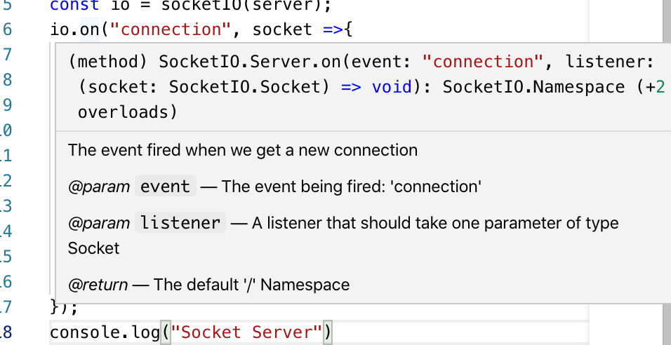

  **Question**: Where does VSC grab documentation from to display in the tooltips?

  I couldn't find any of this info in the socket.io package, or any other respective package for different libraries.

  ## [Node.js: Testing and Code Quality](https://www.linkedin.com/learning/node-js-testing-and-code-quality/welcome):

  - Coding Conventions and Standards
  - Linting

  ## Unit Testing
  - **Unit**: Smallest testable part of an application. 
    - can be as big as an interface, or as small as an individual method.
  - **Unit Tests**: Tests an isolated unit via API.
    - Performed in memory: No permanent changes take place.
  - **Unit Test Assertions**: Validates correctness of a unit.

  ```javascript
  // Test setup using Node.js Assert module
  const assert = require(`assert`);
  // Tested Method:
  function cat(){ return 'woof'; }
  // Assertion - actual and expected
  assert.equal(cat(), 'meow')
  ```
  ## Integration Testing
  - Builds on unit tests
  - Combines units and test resulting combinations

  ## Functional Testing
  -  Focus on result, not code
  -  Tests features, not code

  ## System Testing
  - Test application and hosting environment

  ## Where I Left Off
  I left off taking the chapter quiz: [Chapter Quiz](https://www.linkedin.com/learning/node-js-testing-and-code-quality/quiz/59bac6973dd5594664ed3035)


## Day 106, R3
### 11/2/19
- ### Where I Left Off
  Today I'm looking into [Flic](https://flic.io/flic2). Does Flic have to be native? Can I do this in a PWA? I know I can use Flic if I'm connected to the internet, but can I directly affect the PWA offline?

  ## Flic
  I think I need native mobile code if I want to use flic offline.

  Here's some resources I looked at:
  - [Flic for iOS: Part 1](https://partners.flic.io/partners/developers/ios-tutorial)
  - [fliclib Reference](https://partners.flic.io/partners/developers/documentation/ios/index.html)
  - [The Beginner’s Guide to Objective-C: Methods](https://blog.teamtreehouse.com/the-beginners-guide-to-objective-c-methods)

  ## Objective C

  In the fliclib documentation I saw some words I didn't understand:

  >The **delegate** of a SCLFlicButton object must adopt the SCLFlicButtonDelegate protocol. There are not any required delegate methods, but all are recommended for proper use of the Flic.

  -*from [SCLFlicButtonDelegate Protocol Reference](https://partners.flic.io/partners/developers/documentation/ios/Protocols/SCLFlicButtonDelegate.html)*

  What's a **delegate**? Apparently it's something specific to objective c:

  >What is an Objective-C Delegate? Well.. An Objective-C delegate is just an object that has been assigned as a delegate of another. 

  -*from [How to create an Objective-C Delegate](https://www.ios-blog.com/tutorials/objective-c/how-to-create-an-objective-c-delegate/)*

  That sounds like a namespace to me. 
  
  I figured I might have to get familiar with objective c to use flic. Here's an Objective C tutorial I can look at:

  [Objective-C Essential Training](https://www.linkedin.com/learning/objective-c-essential-training/)

  ## At An Impasse
  Do I want to start learning objective C to continue with my app? Or do I want to keep learning Javascript related skills? 
  
  ## Javascript Concepts
  I decided to look more into javascript concepts or language agnostic concepts. I think having a better base in javascript will help me pick up objective C in the future. And getting more specific with javascript might make me more employable. 

  ## Courses
  I'm looking to get more organized in my code. So these were three courses I was interested in:

  - [Programming Foundations: Test-Driven Development](https://www.linkedin.com/learning/programming-foundations-test-driven-development-2/small-steps-to-great-things): I want to learn test driven development. However, this course is in Java. So I think it would be a bit confusing for me.

  - [Node.js: Testing and Code Quality](https://www.linkedin.com/learning/node-js-testing-and-code-quality/welcome): I want to learn about unit testing, but I want to learn about *fullstack* testing, not just node. Still, this might be useful.

  - [Learning Functional Programming with JavaScript ES6+](https://www.linkedin.com/learning/learning-functional-programming-with-javascript-es6-plus/a-functional-approach-to-transform-code): I thought this might help me better structure my code, but I'm not really sure functional programming is preferable to object oriented programming. Maybe I'll look into it later.

  I'm going to go with [Node.js: Testing and Code Quality](https://www.linkedin.com/learning/node-js-testing-and-code-quality/welcome).

  ## [Node.js: Testing and Code Quality](https://www.linkedin.com/learning/node-js-testing-and-code-quality/welcome):

  ## Example Application Setup
  In the video [Demo application setup and tour](https://www.linkedin.com/learning/node-js-testing-and-code-quality/demo-application-setup-and-tour), the instructor goes over the setup of the application. I found this helpful to see how code can be organized into different directories; directories like `public` for frontend code, `routes`, `migrations`, and more. 

  ## What Is Code Quality?
  - Functional: Does what it's supposed to do
  - Deficiency Free
    - Usefulness
      - flexible and reusable
    - Maintainability
      - Can you maintain the code?
      - Can someone else maintain it without help?
      - Can someone else read and understand design and intent?

  -*from [What is code quality?](https://www.linkedin.com/learning/node-js-testing-and-code-quality/what-is-code-quality)*

  ## Where I Left Off
  I left off on this video: [What is code quality?](https://www.linkedin.com/learning/node-js-testing-and-code-quality/what-is-code-quality)


  

## Day 105, R3
### 11/1/19
- ### Where I Left Off
  `addRc()` doesn't add an RC when the local storage is cleared. I have to fix this. Was this online or offline?

  ## Pending Local Host
  Something causes retrieving localhost to pend for a very long time.

  I thought the cause was *pausing the debugger on sync event*. But I tried that a few times. Sometimes it caused localhost to pend on reload, sometimes not.

  **I figured it out.** The service workers context can be pause in the debugger. But then when you switch to the '**top**' context it might not be paused. 
  
  Then when you try to refresh, the service worker is still paused even though it doesn't look like it. So the document can't retrieve localhost.

  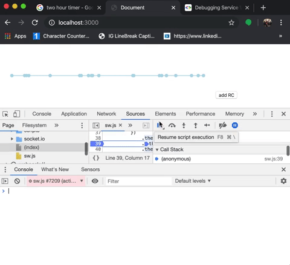
  
  ## Force Reload
  If you `shift` + reload, refresh will work even if the service worker is paused. This is called force reloading an it bypasses the service worker.

  ## Express Project
  Now the express project does add an RC when the local storage is cleared. 

  ## Where I Left Off
  It seems like everything is syncing nicely. I did some refactoring and debugging. Next could I test it on mobile and implement (Flic)[https://flic.io/flic2]? Does Flic have to be native? Can do this in a PWA? I know I can do it if I'm connected to the internet, but can I directly affect the PWA offline?

  [Link To Work](https://github.com/DashBarkHuss/express_proj/commit/70999fbccea5e70270d0c1dcea293b4ce314a92b)


## Day 104, R3
### 10/31/19
- ## Where I left off
  I did some refactoring on my project. I need to work on why the timeline doesn't populate when wifi is off.

  ## Background Sync Working Again
  I got background sync working but I'm not actually sure what I changed. That's why I should commit before I change something. I'll commit now! Oh wait I have a problem still so I'm trying to fix that first.

  ## Fixed Timeline Bug

  I was trying to get the first and last reality check of the day. I had this code:


  ```Javascript
  const firstRC = (()=>{
    return times.reduce((minimum, time) => time < minimum ? time : minimum, times[0]);
  })();

  const timespan = times[times.length-1]-firstRC;
  ```
  This code assumes the last reality check in the database chronologically last order. But that's not always true. I can have a reality check from 5pm first in the database and then one from 4:59pm after it. So I changed the code:

  ```Javascript
  const firstRC = (()=>{
    return times.reduce((minimum, time) => time < minimum ? time : minimum, times[0]);
  })();
  const lastRC = (()=>{
      return times.reduce((maximum, time) => time > maximum ? time : maximum, times[0])
  })();
  const timespan = lastRC-firstRC;
  ```
  This is easier to read too.

  [Link To Work](https://github.com/DashBarkHuss/express_proj/commit/d67a3b8f227ae569638c9e27e0d498de25616b52)

  ## Where I Left Off
  `addRc()` doesn't add an RC when the local storage is cleared. I have to fix this. Was this online of offline?


## Day 103, R3
### 10/30/19

## A Note On Insomnia
I always forget the extent that lack of sleep affects my coding. 

Last week, a bout of insomnia made me so incompetent, I questioned whether coding was for me. 

Luckily, I got my insomnia under control by:
- Temporarily sleeping alone
- Drinking warm magnesium tea before bed
- Talking with my spouse and then Googling before bed
- When in bed, I listed items. 
  - **Example**: Pick a category *(Halloween Candy*) and list items *(mary janes, bit o' honey, mounds, candy corn...)*

After I regained my sleep, I could code again! 

While most people would tell you not to google before bed, I wonder if this helped me sleep. I have an extremely active brain at night. Maybe, googling gave me an opportunity to answer some of the racing questions in my brian. But maybe it was just a coincidence.

People also recommend journaling before bed to reduce thoughts. However, sometimes I find this revs up my brain.

- ## Where I left off
  I went back to working on my express project. I need to plan what to do next.

  ## Express Project: what needs to be done?
  - Front End: UI that shows frequency of Reality Checking
  - Refactor
  - User login
  - IndexDB
  - Look into Flic PWA integration

  ## Issue
  Rc not adding to database.
  Steps:
  - Turn my wifi off 
  - click addRC() on user 1's timeline
  - Turn my wifi back on.
  
  The rc's don't sync. I expected them to sync when wifi is back on because of the service worker sync event:

  ```javascript
   self.addEventListener("sync", event => {
     if (event.tag.substring(0, 2)=="rc") {
         const info = event.tag.substring(3);
         event.waitUntil(
             fetch(`/rc`, {
               method: 'POST', 
               headers: {
                   'Content-Type': 'application/json',
               },
               body: info, 
             })
                 .then(r => r.text())
                 .then(x=>JSON.parse(x))
                 .then(x=>console.log("Added to database: ", x.time.substring(16, 24), x.coords))
             )
     }
   })

  ```

  ## Refactoring
  I think I need to refactor some functions that do too much. Some of my functions do two things like creating an object and then storing that object. This makes debugging hard.

  Here `synLocalStorage` fetched data and stores it. I think it either needs to be renamed to `syncPromiseDataOfRCsToLocalStorage` or rewritten.
  ```javascript
    function syncLocalRcs(promise){ //promise is a fetch to get rc's for a user
      return promise
      .then(x=>
          x.text()
          )
      .then(x=> 
          JSON.parse(x))
      .then(x=>{
          localStorage['rc'+x.userId] = JSON.stringify(x.results);
          return x.results;
          }
      )
      .catch(err=>console.log(err))

  }
  ```
  ### Updated Function
  I changed the name. I think this is more clear.
  ```javascript
  function saveToLocalRcs(responseJson){ //promise
    return responseJson
    .then(x=>
        x.text()
        )
    .then(x=> 
        JSON.parse(x))
    .then(x=>{
        localStorage['rc'+x.userId] = JSON.stringify(x.results);
        return x.results;
        }
    )
    .catch(err=>{
        console.log(err);
        return [];
    }
  )}
  ```
  ## Updated Function
  I realized this function should really only be saving the rc's to local storage but this was also returning them so then I could do something with them later, but that's unnecessary nd confusing. I simplified the function:
  ```javascript
  function saveToLocalRcs(responseJson){ //promise
    if(!responseJson) return[];
    localStorage['rc'+responseJson.userId] = JSON.stringify(responseJson.results);
  }
  ```

  ## Where I Left Off
  I did some refactoring on my project. I need to work on why the timeline doesn't populate when wifi is off.
 
## Day 102, R3
### 10/29/19
- ## Where I left off
  I left off trying to figure out why when offline and I call `fetch("info.json")` I get:
  > The FetchEvent for "http://127.0.0.1:5500/info.json" resulted in a network error response: the promise was rejected. 

  ## What The Hell
  Now it's working. What's going on??

  ## DevTools Offline 
  I'm trying to test what the project would be like offline. So I set the devtools to `offline`.
  
  However `navigator.onLine` still gave me `true`.

  So I followed this:

  From [when throttling chrome to offline the navigator.onLine is still true](https://stackoverflow.com/questions/39828173/when-throttling-chrome-to-offline-the-navigator-online-is-still-true):

  >```javascript
  >Object.defineProperty(navigator, "onLine", {value: false})
  >```
  >If you want to restore it later, keep a reference to the old property descriptor:
  >
  >```javascript
  >var oldOnLineDescriptor = Object.getOwnPropertyDescriptor(navigator.constructor.prototype, "onLine") 
  >//...
  >Object.defineProperty(navigator, "onLine", oldOnLineDescriptor)
  >```

  This only changed the online status where I put it. So I needed it in the service worker, not the index.html. Then I was able to see how my service worker would work offline. 
  
  I think this is because there's a different navigator for the worker. When I look at the `navigator` in the console for the service worker, it's called a `WorkerNavigator`:

  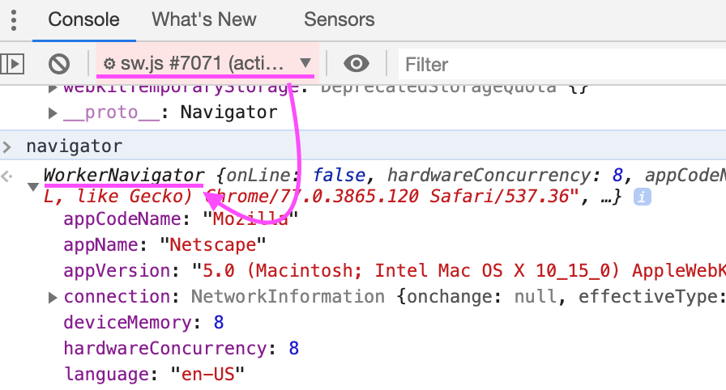

  Where as, in the regular console scope it's just a `Navigator`:

  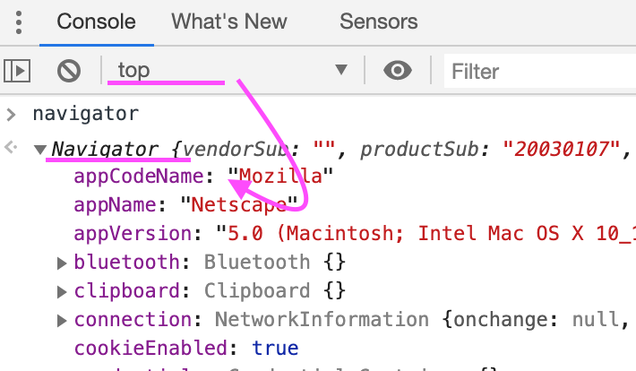

  I don't know why the offline button in devtools doesn't set `navigator.onLine` to false.

  ## Service Worker Offline
  Now my practice project gives different data when we're offline:

  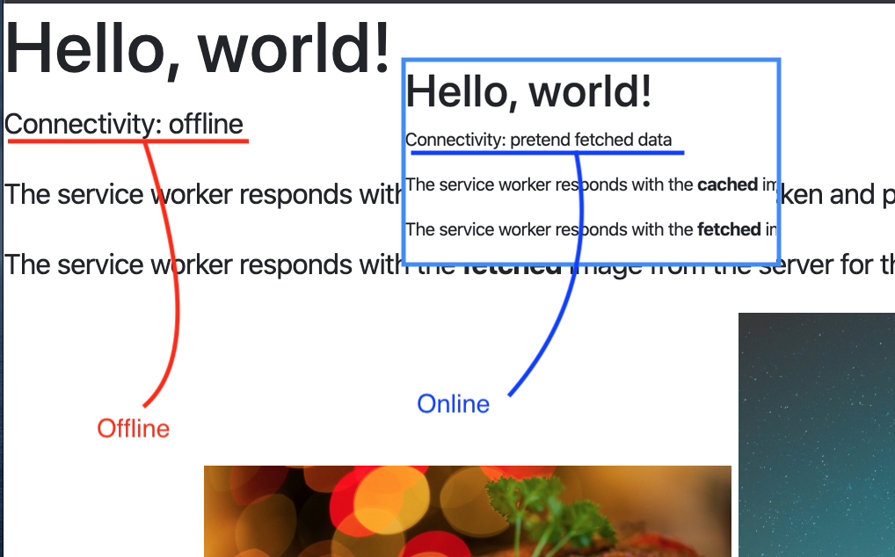

  [Link To Work](https://github.com/DashBarkHuss/service_worker_practice/commit/718e66eee27ce18c3607737c19cb6d33a60ad345)

  ## Express Proj
  I went back to my [Express project](https://github.com/DashBarkHuss/express_proj).
  
   When I last left off, I wrote this:
  >I ran into an issue where add Rc isn't posting to the database. The service worker is handling the post using sync manager. I'm really new to service workers. People on twitch gave me some ideas.

  But today I'm not able to recreate that issue.

  ## Better Documentation Of Issues
  I need to keep better documentation of issues. I find problems and then I can't recreate them. I need to know the steps to recreate the issues.

  ## Where I Left Off
  I went back to working on my express project. I need to plan what to do next.


## Day 101, R3
### 10/28/19

Even though I finished round 3, I'm going to continue to post on here. I'm not committing to an entire 4th round of #100DaysOfCode, but I am committed to finishing the year. 

- ### Where I Left Off:
  I left off trying to figure out what "eval and friends" means. I feel that I got side tracked yesterday, so while I brought up questions that I should look into later, I'm going to continue practicing delivering alternative content when offline with service workers

  ## new Response 
  How to use the Response constructor:
  ```javascript
  new Response(JSON.stringify({"property":"value"})).json() // returns a promise with the object as the promise value
  ```

  ## Only One `Event.respondWith`
  I was getting a lot of unexpected behavior in the service worker that was confusing me.

  I realized it was because `event.respondWith` was being called twice. I need to `return` in my conditional so the later conditional with `event.respondWith()` isn't called.

  ## Unexpected Behavior
  In my fetch handler I have this:

  ```javascript
  self.addEventListener("fetch", event => {
    const parsedURL = new URL(event.request.url);

    if (parsedURL.pathname == "/info.json" && !navigator.onLine){

        event.respondWith(fetch("/offline.json")); //if we're offline, respond with this cached file
        return;
    }
      event.respondWith(caches.match(parsedURL.pathname).then(response=>{
          if (response){
              console.log(response);
              return response;
          } else {
              return fetch(parsedURL);
          }
      }))
  })
  ```

  When I call `fetch("info.json")` I get:
  > The FetchEvent for "http://127.0.0.1:5500/info.json" resulted in a network error response: the promise was rejected.

  Even though the code is getting to conditional 
  ```javascript
  if (parsedURL.pathname == "/info.json" && !navigator.onLine)
  ```
  . Which means it should be getting to this line:
  ```javascript 
  event.respondWith(fetch("/offline.json"));
  ```
  And `offline.json` is in the cache. So why isn't it fetching?

  ## Where I Left Off
  The above is what I left off trying to figure out.

## Day 100, R3
### 10/27/19

  ### Where I Left Off
  I started practicing delivering alternative content when offline with service workers.

  ## Stack: "anonymous"
  I was trying to understand the code from the [Vanilla Javascript: Service Workers](https://www.linkedin.com/learning/vanilla-javascript-service-workers/) tutorial. So I paused the code at `serviceworkers.js:88`. 
  
  ```javascript
  self.addEventListener("fetch", event => {
    console.trace();
    const parsedUrl = new URL(event.request.url);
    if (parsedUrl.host=="explorecalifornia.org" && !navigator.onLine) {
        event.respondWith(fetch("offline.json")); //line 88
    }
  ```

  I looked at the call stack to see how the code got there and I saw this:

  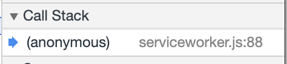

  I've seen this before, but I never really looked up what it meant. 
  
  ### Anonymous Functions
  According to [this article](https://www.linkedin.com/pulse/javascript-named-vs-anonymous-functions-chris-ng/), it looks like this means an **anonymous function** called our current function.

  **Anonymous functions** are functions without a name.

  I would think we'd get a line number or something in the stack trace, but no.

  But then, when looking into my code I ended up finding the function that called the current function (or did it?). It was named.

  So we got to the fetch listener by 
  - `fetchWeather("san diego")` 
  - and `fetchWeather` calls fetch 
  - which then triggers a fetch event

  So why does `console.trace()` show anonymous in the fetch event?

  Maybe because we're getting here by triggering an event, the function is anonymous? 

  ## Event Handler
  I  put a `console.trace()` in every event listener. They all showed "anonymous".

  If I moved the listener out into a named function, it then showed the name of the listener in the trace.

  ```javascript
  // callback in event handler

  self.addEventListener("someevent", event=>{
    console.trace() //returns anonymous
    //some code
  })

  //callback outside of handler

  function callbackName(event){
    console.trace() //returnns callbackName
    //some code
  }
  self.addEventListener("someevent", callback)

  ```

  But `console.trace()` didn't show what called the named callback.

  I couldn't find any info on this but I guess it makes sense. 

  When an event listener is triggered, it's not directly triggered by a function. It's triggered by an event. A function may have triggered the event, but the event looks like it starts a new stack.

  ## Javascript Event Loop
  I'm reading about the [Javascript Event Loop](https://flaviocopes.com/javascript-event-loop/) to try get more clarity.

  ## VM
  I added a mouseover event listener to see what the stack would be.

  ```javascript
  elem.addEventListener('mouseover', e=>console.trace(e))
  ```
  This time we have anonymous but with a weird code.
  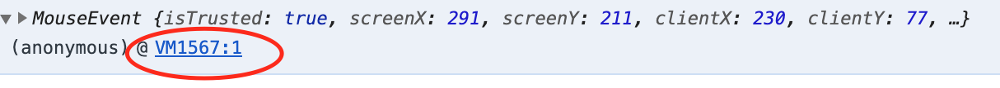

  I've seen this before and I vaguely understand what they are.

  I think it's like a virtually generated code or something or possibly something that just dev tools does. I'm not sure.

  ### What is the vm file?
  I looked it up:
  >[VM] (scriptId) has no special meaning. It's a dummy name to help us to distinguish code which are not directly tied to a file name, such as code created using eval and friends.

  -from [Chrome Development Tool: [VM] file from javascript](https://stackoverflow.com/questions/17367560/chrome-development-tool-vm-file-from-javascript)

  ## Where I Left Off:
  I left off trying to figure out what eval and friends means.


## Day 99, R3
### 10/26/19
  ### Where I Left Off
  I left off on this video in the Linked In Service Workers tutorial: [Readable streams](https://www.linkedin.com/learning/vanilla-javascript-service-workers/readable-streams)

  ## LinkedIn Tutorial
  I finished the linked in tutorial on service workers.

  [Vanilla Javascript: Service Workers](https://www.linkedin.com/learning/vanilla-javascript-service-workers/)

  I'm going to play around with service workers to practice what I learned.

  ## Basic Cache Service Worker
  I practiced doing some caching with the service workers and intercepting the fetch request to respond with the cached images.

  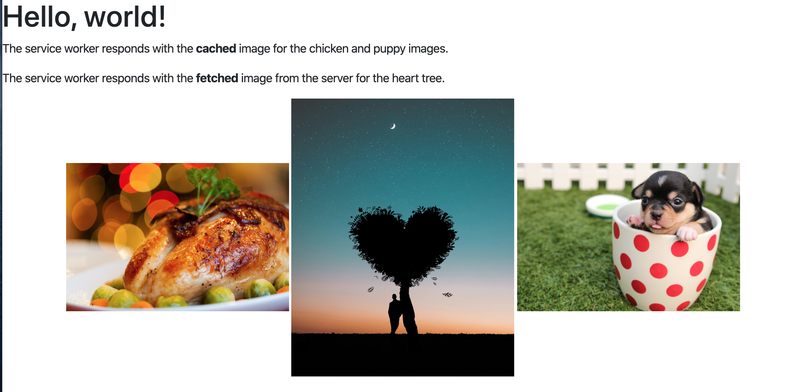
  [Link To Work](https://github.com/DashBarkHuss/service_worker_practice/commit/8015b2ea8429b5e25ccada8746d2e61259614669)

  ## Where I Left Off:
  I started practicing delivering alternative content when offline with service workers.

## Day 98, R3
### 10/25/19
- ## Node
  ### Where I Left Off
  I left off on the video [Keep your storage clean](https://www.linkedin.com/learning/vanilla-javascript-service-workers/keep-your-storage-clean).

  ## Where I left Off:
  I left off on this video in the Linked In Service Workers tutorial: [Readable streams](https://www.linkedin.com/learning/vanilla-javascript-service-workers/readable-streams)

## Day 97, R3
### 10/24/19
- ## Node
  ### Where I Left Off
  I'm following along with the LinkedIn Service Workers Tutorial. I'm on this video: [Use stale-while-revalidate](https://www.linkedin.com/learning/vanilla-javascript-service-workers/use-stale-while-revalidate?autoplay=true)

  ## `Promise.all`
  >The Promise.all() method returns a single Promise that resolves when all of the promises passed as an iterable have resolved or when the iterable contains no promises. It rejects with the reason of the first promise that rejects. 

  -from [Promise.all()](https://developer.mozilla.org/en-US/docs/Web/JavaScript/Reference/Global_Objects/Promise/all)

  ## `.waitUntil`
  >In service workers, waitUntil() tells the browser that work is ongoing until the promise settles, and it shouldn't terminate the service worker if it wants that work to complete.
  >
  >The install events in service workers use waitUntil() to hold the service worker in the installing phase until tasks complete. If the promise passed to waitUntil() rejects, the install is considered a failure, and the installing service worker is discarded. This is primarily used to ensure that a service worker is not considered installed until all of the core caches it depends on are successfully populated.
  >
  >The activate events in service workers use waitUntil() to buffer functional events such as fetch and push until the promise passed to waitUntil() settles. This gives the service worker time to update database schemas and delete outdated caches, so other events can rely on a completely upgraded state.

  -from [ExtendableEvent.waitUntil()](https://developer.mozilla.org/en-US/docs/Web/API/ExtendableEvent/waitUntil)

  ## Where I Left Off
  I left off on the video [Keep your storage clean](https://www.linkedin.com/learning/vanilla-javascript-service-workers/keep-your-storage-clean).

## Day 96, R3
### 10/23/19
- ## Node
  ### Where I Left Off
  Today, I'll see if I change the request in caches.put, if I get different keys. I'm trying to see exactly what the request in a cache does. I tried changing the request to a different URL, "http://localhost:5000/dash". But then when I went to that url I expected it to give the response that I cached with it, but it didn't.
  
  ## New Line In The Console
  How do you make a line in the console so your code is not on one line? If you press return, your code gets run. So what are you supposed to do?

  **Answer:** `shift` +`enter`

  ## Understanding `Cache.put`

  ```javascript
  caches.open('california-fonts')
  .then(cache => {
      var buttReq = new Request('/butt');
      cache.put(buttReq, someNetWorkResponse);
  ```
  Now if we go to `localhost:5000//butt`, we'll get the cached file that was `someNetworkResponse`.

  I thought this didn't work for a while because I trying to make the request like this:
  ```javascript
  var buttReq = new Request(event.request);
  butReq.url = "http://localhost:5000/butt"
  ```

  But that didn't actually change the url of the request. I'm not sure why.

  ## How To See Values Of the Cache?
  If I can see the keys of the cache with `.keys()`, how can I see the values?

  I tried to get the value using bracket notation, but this didn't work. The value (response) was undefined.

  ```javascript
  var request;
  caches.open("california-fonts")
  .then(cache=>cache.keys())
  .then(keys=>{
      request=keys[0];
  })
  request // Request {method: "GET", url: "http://localhost:5000/butt", headers: Headers, destination: "", referrer: "", …}
 
  var response;
  caches.open("california-fonts")
  .then(cache=>{
      response=cache[request];
  })
  response //undefined
  ```

  ## DevTools: View Cache Values
  Here's how you can see the cache values in DevTools. 
  
  Click on the green circled buttons:

  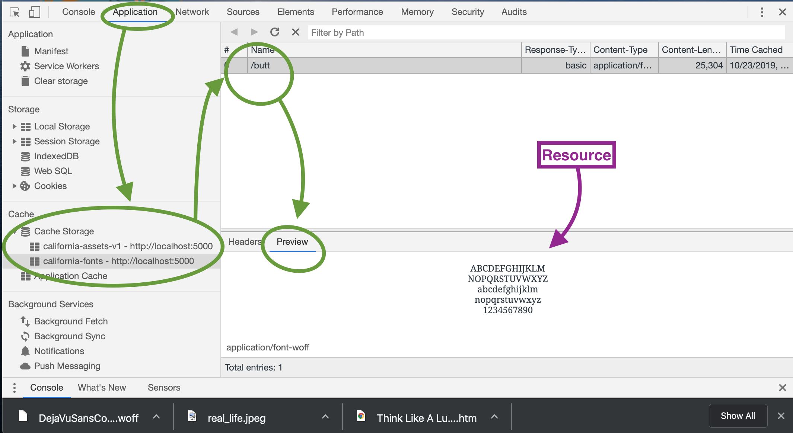

  More info: [View Cache Data With Chrome DevTools](https://developers.google.com/web/tools/chrome-devtools/storage/cache)

  Not sure how to find them programmatically.

  ## Where I Left Off:
  I'm following along with the LinkedIn Service Workers Tutorial. I'm on this video: [Use stale-while-revalidate](https://www.linkedin.com/learning/vanilla-javascript-service-workers/use-stale-while-revalidate?autoplay=true)

## Day 95, R3
### 10/22/19

- ## Node
  ### Where I Left Off
  ## Where I Left Off
  I ended trying to get the service worker to retrieve the cached css when offline. Somehow, while I have `offline` checked in devtools it's still fetching and updating the css. I started to isolate the issue here to see the problem better.

  ## Problem Disappeared
  So I have no clue what happened. I went back to work on the issue and now the issue is gone.

  ## `Cache.put`

  >The put() method of the Cache interface allows key/value pairs to be added to the current Cache object.
  >...
  >Syntax
  >```javascript
  >cache.put(request, response).then(function() {
  >// request/response pair has been added to the cache
  >});
  >```
  >**Parameters**
  >
  >**request**
  >
  >The Request object or URL that you want to add to the cache.
  >
  >**response**
  >
  >The Response you want to match up to the request.
  
  -from [Cache.put() - Web APIs | MDN](https://developer.mozilla.org/en-US/docs/Web/API/Cache/put)

  I'm confused, what's the difference between the *"The Request object or URL that you want to add to the cache."* and the *"The Response you want to match up to the request."*
  
  >**The difference between add and put**
  >
  >It’s a trick question! As it turns out, add and addAll use put under the hood.
  >
  >It works like this:
  >1. For each request in the array (or a single request in the case of `add`), do a fetch
  >2. Add the response to a key-value pair list, with the request as the identifying key
  >3. Cache the request _and_ response together (by using put)

  -from [Cache Storage: What's the difference between cache.add and cache.put?](https://carmalou.com/lets-take-this-offline/2019/04/23/whats-the-difference-between-add-and-put.html)

  This helps clarify. But when I look at my cache storage I don't see anything about a key value pair?

  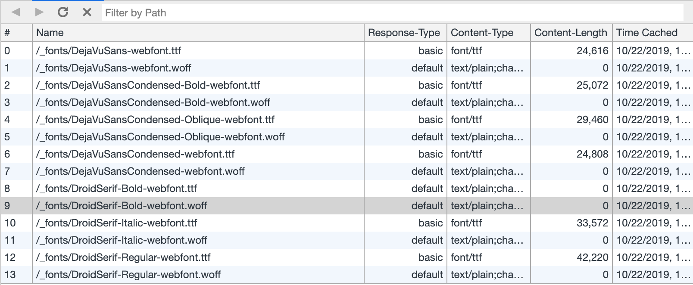

  I wonder how you can see the key-value pair list?

  ## Cache Keys

  I was able to find the keys with the code
  ```javascript
  caches.open(cacheName).then(cache=>cache.keys())
  ```
  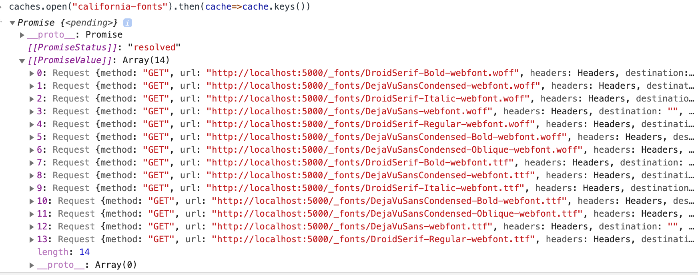

  ## Where I Left Off
  Tomorrow, I'll see if I change the request in caches.put, if I get different keys. I'm trying to see exactly what the request in a cache does. I tried changing the request to a different URL, "http://localhost:5000/dash". But then when I went to that url I expected it to give the response that I cached with it, but it didn't.

## Day 94, R3
### 10/21/19

- ## Node
  ### Where I Left Off
  I went back to the Service Workers Tutorial on LinkedIn starting on this video [Implement a network-first policy](https://www.linkedin.com/learning/vanilla-javascript-service-workers/implement-a-network-first-policy)

  ## Not Retrieving Cache Files While Offline
  I was trying to retrieve cached filed while offline. But it wasn't working. I thought it was because I didn't understand how caching worked. But it was much simpler. 

  Can you spot the problem?

  ```javascript
  self.addEventListener("fetch", event => {
    const parsedUrl = new URL(event.request.url);
    if (parsedUrl.pathname.match(/^\/_css*/)){
        event.respondWith(
            fetch(event.request)
                .catch(err=>{
                  return caches.match(event.request)
                })
            )
    } else {
        caches.match(event.request)
        .then( response => {
            if (response) {
                return response; // The URL is cached
            } else {
              return fetch(event.request); // Go to the network
            }
        })
      }
  });
  ```

  **The Problem:** I left out `event.respondWith`. The response was there but the service worker wasn't sending it back.

  I was able to see this better when I ***isolated the issue***. 
  
  What's isolating the issue?- When dealing with a  big project, it's hard to pin point the problem. So I often recreate the issue in a new project with as little code as possible.

  Working code:
  ```javascript
  self.addEventListener("fetch", event => {
      const parsedUrl = new URL(event.request.url);
      if (parsedUrl.pathname.match(/^\/_css*/)){
          event.respondWith(
              fetch(event.request)
                  .catch(err=>{
                      return caches.match(event.request)
                  })
              )
      } else {
          event.respondWith(
              caches.match(event.request)
          .then( response => {
              if (response) {
                  return response; // The URL is cached
              } else {
                  return fetch(event.request); // Go to the network
              }
          })
      )
      }
  });
  ```

  Sometimes the problem is more simple than you think!

  ## Where I Left Off
  I ended trying to get the service worker to retrieve the cached css when offline. Somehow, while I have `offline` checked in devtools it's still fetching and updating the css. I started to isolate the issue here to see the problem better.


## Day 93, R3
### 10/20/19

- ## Node
  ### Where I Left Off
  I'm on the second to last chapter of the game and I can't get through it. I can't get this last code right. But I can't see what I'm doing wrong.
  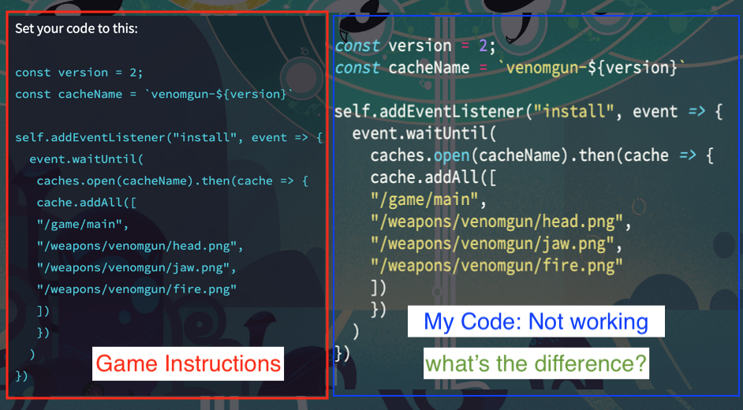

  ## I Quit Service Workies
  Nobody online could find a difference between the two codes. So I quit! I'm thinking this might be a bug in the game. I Tweeted at the creator, maybe others have had this problem?

  ## File Extensions On Caches
  When I cache files and try to retrieve them, if I cache with the `html` file extension I get this error when navigating to the file with the extension.

  Service Worker Code: 
  ```javascript
  self.addEventListener('install', function(event) {
    event.waitUntil(
      caches.open("cacheName").then(function(cache) {
        return cache.addAll(
          [
            '/offline.html',
            '/'
          ]
        );
      })
    );
  });

  self.addEventListener('fetch', function(event) {
    event.respondWith(
      caches.match(event.request).then(function(response) {
        return response || fetch(event.request);
      })
    );
  });
  
  ```

  Navigate to: `http://localhost:5000/offline.html`

  **Error**: `The FetchEvent for "http://localhost:5000/offline.html" resulted in a network error response: a redirected response was used for a request whose redirect mode is not "follow".`

  Change `/offline.html`, to `offline` to make this work:
  ```javascript
  self.addEventListener('install', function(event) {
    event.waitUntil(
      caches.open("cacheName").then(function(cache) {
        return cache.addAll(
          [
            '/offline.html',
            '/'
          ]
        );
      })
    );
  });

  self.addEventListener('fetch', function(event) {
      event.respondWith(
        caches.match(event.request).then(function(response) {
          return response || fetch(event.request);
        })
      );
    });
    ```
    I'm not sure why though.


  ## Where I Left Off

  I went back to the Service Workers Tutorial on LinkedIn starting on this video [Implement a network-first policy](https://www.linkedin.com/learning/vanilla-javascript-service-workers/implement-a-network-first-policy)

## Day 92, R3
### 10/19/19

- ## Node
  ### Where I Left Off
  Yesterday, I was trying to understand why I'm getting unexpected behavior when fetching from the cache. Today I'm going to try to finish Service Workies befoe I get to that.


  ## Where I Left Off

  I'm on the second to last chapter of the game and I can't get through it. I can't get this last code right. But I can't see what I'm doing wrong.
  

## Day 91, R3
### 10/18/19

- ## Node
  ### Where I Left Off
  Yesterday, I played with service workers in the browser and played the Service Workies Game. I'm on level 4 chapter 3.


  ## `caches.addAll`

  If one resources fails when using caches.addAll, they all fail().

  ## .html


  ## Solving An Issue
  *I want to walk through an issue I solved to try to better clarify how problems are fixed.*

  One of the hardest parts of solving a problem is that you often don't know the actual problem.

  All you know is: *Something isn't acting as expected.* You have ***unexpected behavior***, but you don't know the problem.

  Then you must clarify the issue.

  If you ask yourself, google, or a friend about the unexpected behavior, you will get a different answer than if you find the problem and then ask the question about the problem.

  So it's important to recognize if you can vocalize the problem, or if you can only vocalize the unexpected behavior.

  ### Example 
  **Unexpected Behavior:** I was trying to cache a file called `offline.html.` 

  ```javascript
  self.addEventListener('install', function(event) {
    event.waitUntil(
      caches.open("cacheName").then(function(cache) {
        return cache.addAll(
          [
            '/offline.html'
          ]
        );
      })
    );
  });
  ```
  When I went offline and tried to retrieve it, the cache disappeared. I got this error on the page:

  >The webpage at http://localhost:5000/offline.html might be temporarily down or it may have moved permanently to a new web address.
  >
  >ERR_FAILED

  **Finding the Problem:** The above is the unexpected behavior, it's not the problem. I thought the problem was that I couldn't cache that page. The problem had nothing to do with caching. 
  
  After experimenting, I was able to recreate this error without caching. Whenever I went to offline.html while online, I'd get the same error. 

  But, when I deleted the service worker, then /offline.html redirected to /offline. The page was served.

  So I tried it again with service workers. But I deleted different parts of the code in the service worker.

  I pin pointed the problem. The problem only occured when I had my fetch code in the service worker:

  ```javascript
  self.addEventListener('fetch', function(event) {
    console.log('fetch: ', event.request.url);
    event.respondWith(
      caches.match(event.request).then(function(response) {
        return response || fetch(event.request);
      })
    );
  });
  ```

  **Further Pin Pointing The Problem:**
  I haven't actually solved my problem. So maybe we can only be sure we found the problem once we solved it. So I've simple come across a more specific unexpected behavior. I've clarified a more specific unexpected behavior.

  To find the real problem, we'll need to get more specific. We'll need t find more specific instances where we see the unexpected behavior, within the fetch event block perhaps.

  But because we've gotten more specific we can form a question:

  - Our fetch event tries to serve offline.html which doesn't work. But when we simply go to offline.html without fetch, it redirects to offline.html. Why? Why doesn't fetch behave the same as if we put .html in the url?

  **Clearer Problem:** I've yet again found more information, a more specifically defined problem.

  It seems fetch isn't the problem because I'm able to retrieve `offline.html` with this code:

  ```javascript
  self.addEventListener('fetch', function(event){ event.respondWith(fetch(event.request));
  });
  ```

  but not this:

  ```javascript
  self.addEventListener('fetch', function(event) {
    event.respondWith(
      caches.match(event.request).then(function(response) {
        return response || fetch(event.request);
      })
    );
  });
  ```

  So I've further pin pointed the problem to the caches.match code.

  **I Forgot, I did solve the problem:** Earlier I said maybe we can't know the problem until we solved the problem. But actually I forgot I had found a solution to the problem. Instead of caching `offline.html` cache `offline`. 
  
  That being said, I still don't know why that is. I don't know why you can't cache `offline.html`. I want to know why.

  **Deeper Exploration:**

  caches.match(event.request) returns different responses for `offline.html` and `offline`

  ### `offline.html`:
  ```json
  body: (...)
  bodyUsed: false
  headers: Headers {}
  ok: true
  redirected: true
  status: 200
  statusText: "OK"
  type: "basic"
  url: "http://localhost:5000/offline"
  __proto__: Response
  ```
  I get this in the terminal:
  >`The FetchEvent for "http://localhost:5000/offline.html" resulted in a network error response: a redirected response was used for a request whose redirect mode is not "follow".`

  ### `offline`
  ```json
  body: (...)
  bodyUsed: true
  headers: Headers {}
  ok: true
  redirected: false
  status: 200
  statusText: "OK"
  type: "basic"
  url: "http://localhost:5000/offline"
  __proto__: Response
  ```

  I looks like the issue is that offline.html redirects. And for some reason we can't do that.

  **More info:** The above happened when both `offline.html` and `offline` were cached.

  If I only have `offline` cached I get this:

  Navigating to `offline`:
  ```
  serviceworker.js:14 fetch:  http://localhost:5000/offline
  serviceworker.js:17 response
  Navigated to http://localhost:5000/offline
  ```
  Navigating to `offline.html`:
  ```
  serviceworker.js:14 fetch:  http://localhost:5000/offline.html

  serviceworker.js:17 fetch

  serviceworker.js:14 fetch:  http://localhost:5000/offline

  serviceworker.js:17 response
  Navigated to http://localhost:5000/offline
  ```

  ## Where I Left Off
  In service workies I left of at level 4 chapter 6.
  I'm trying to understand why I'm getting unexpected behavior when fetching from the cache.


## Day 90, R3
### 10/17/19

- ## Node
  ### Where I Left Off
  I played with service workers in the browser. Tomorrow, I'll play some more then I'll a continue with service workies.

  ## Where I Left Off
  Not much to report on today. I played with service workers in the browser and played the Service Workies Game. I'm on level 4 chapter 3.


## Day 89, R3
### 10/16/19

- ## Node
  ### Where I Left Off
  I ended on Chapter 2 Level 7 of Service Workies.

  ## Service Workies Progress
  I finished chapter 2.

  ## Playing in the browser
  I played with what I learned in service workies but I was getting funny behavior. I finally realized why:

  ## Scope
  Scope is important for service workers. Your service worker can't be in a sub folder of the page you're trying to control. There's a work around for this if you must.

  ## Where I Left Off
  I played with service workers in the browser. Tomorrow, I'll play some more then I'll a continue with service workies.

## Day 88, R3
### 10/15/19

- ## Node
  ### Where I Left Off
  I'm trying to figure out why I'm getting this error when I go to e go to the url index.html.

  >`The FetchEvent for "http://localhost:5000/index.html" resulted in a network error response: a redirected response was used for a request whose redirect mode is not "follow".`


  ## Service Worker Game

  I played this [Service Workies Game](https://serviceworkies.com/) recommended to me by [@RichDonnellan](https://twitter.com/RichDonnellan).

  ## Game Notes

  - The game made me wonder what is the difference between a web worker and a service worker, so I looked it up.
  
    [What can service workers do that web workers cannot?](https://stackoverflow.com/questions/38632723/what-can-service-workers-do-that-web-workers-cannot)

  - The game also made me realize that when you refresh a page that registers a service worker, if the code has changed, the new code replaces the waiting service worker now the active service worker.

  - If you refresh a page that registers a service worker, the install event only gets called once. A service worker will only enter each stage of it's life cycle once.

  - In the game, Kolohe, the young service worker warrior, terminates whenthe "Portal" is closed. I think thats a symbol for closing a tab. So I suppose a service worker terminates when a tab is closed?

  - Unlike the install event, the registration success Promise resolves every time the page loads and register is called for a valid Service Worker.

  - The `.ready` promise will resolve every time the page is refreshed so long as there is an active Service Worker.
    ```javascript
    navigator.serviceWorker.ready.then(registration => {
      console.log("SW activated: ",
      registration.active)
    })
    ```

  - The `updatefound` event fires when theres an updated service worker.

  - The `statechange` event fires when theres a state change.
    ```javascript
      navigator.serviceWorker.register("/game/kolohe.js").then((registration) => 
    {
      const kolohe = registration.installing;
      kolohe.addEventListener("statechange", (event) => {
        console.log("state changed to:", event.target.state)
      })
    })
    ```

  ## Where I left Off
  I ended on Chapter 2 Level 7 of Service Workies.

- ## Thoughts and Feelings
  Playing Service Workies helped me slow down. It takes longer to go through a "voyage" and learn about service workers than to read a doc. But slowing down help me soak in what the service worker is truly doing. This is a lesson in learning. I don't need to rely on games to teach me, but I need to be ok with slowing down when learning a new concept. Take in each small part slowly, iterating the new micro concepts until you understand them.

## Day 87, R3
### 10/14/19

- ## Node
  ### Where I Left Off
  I'm exploring service workers in depth in the browser but the behavior is so funny to me.

  ## Service Workers Funny Behavior
  I'm finding so much strange behavior when working with service workers.

  ### skip waiting
  Sometimes skip waiting doesn't work. Why woud this be?

  

  It seems to be doing this when local host is pending but I don't know why localhost is pending for so long.

  It happened another time when local host wasn't pending.

  It seems to happen whenever there is a grey highlight behind "skipWaiting". No it also happened when it wasn't grey but local host was pending.

  ### fetch handler not called
  The fetch handle wasn't getting called even though I had this in the service worker:
  
  ```javascript
  self.addEventListener('fetch', (e)=>{
    console.log("fetch event: ", e.request.url);
  })
  ```
  I figure this problem out. This happened when the service worker was installed by not the controller for the page. I have to refresh the page for it to be the controller.

  Check if the service worker is controlling the page:
  ```javascript
  navigator.serviceWorker.controller
  ```

  ### Not caching index.html
  When you save your precache list it has to be the url, not the file name. For example, if you navigate to "http://localhost:5000/" but you cached index.html, that wont work. You have to cache "/". But then what happens when we go to the url index.html?

  hmmm I get an error:

  >`The FetchEvent for "http://localhost:5000/index.html" resulted in a network error response: a redirected response was used for a request whose redirect mode is not "follow".`

  Info on this error: [Only in Chrome (Service Worker): '… a redirected response was used for a request whose redirect mode is not “follow” '](https://stackoverflow.com/questions/45434470/only-in-chrome-service-worker-a-redirected-response-was-used-for-a-reque)

  I don't understand the answer. And I'm confused because this is my code is straight off the docs: [Caching Files with Service Worker](https://developers.google.com/web/ilt/pwa/caching-files-with-service-worker)

  ```javascript
  const precacheList = ["styles.css",'/index.html', '/', "/dashie.html"]

  self.addEventListener('install', function(event) {
    event.waitUntil(
      caches.open("cach1").then(function(cache) {
        return cache.addAll(
          [
            '/',
            '/styles.css',
            '/index.html',
            "/dashie.html"
          ]
        );
      })
    );
  });
  self.addEventListener('fetch', function(event) {
    console.log('fetch: ', event.request.url);
    event.respondWith(
      caches.match(event.request).then(function(response) {
        return response || fetch(event.request);
      })
    );
  });
  ```

  ## Where I Left Off
  I'm trying to figure out why I'm getting this error.

## Day 86, R3
### 10/13/19

- ## Node
  ### Where I Left Off
  I watched more of the tutorial until [Implement a network-first policy](https://www.linkedin.com/learning/vanilla-javascript-service-workers/implement-a-network-first-policy). Then I played around with service workers a little on my own. 

  ## Cache Disappearing
  I'm playing around with service workers. For some reason when I go offline, the cache dissapears on reload. I'm not sure why.

  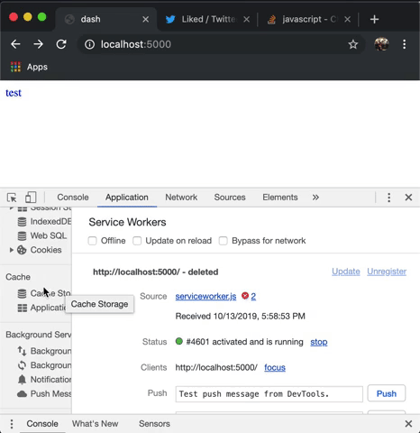

  ## Where I left off
  I'm exploring service workers in depth in the browser but the behavior is so funny to me.

## Day 85, R3
### 10/12/19

- ## Node
  ### Where I Left Off
  Going through [Vanilla JavaScript: Service Workers](https://www.linkedin.com/learning/vanilla-javascript-service-workers) and following along. 

  I left off on this video: [Visualize Your Cache](https://www.linkedin.com/learning/vanilla-javascript-service-workers/visualize-your-cache)

  ## Where I left off:
  I watched more of the tutorial until [Implement a network-first policy](https://www.linkedin.com/learning/vanilla-javascript-service-workers/implement-a-network-first-policy). Then I played around with service workers a little on my own. 

## Day 84, R3
### 10/11/19
- ## Node
  ### Where I Left Off
  Going through [Vanilla JavaScript: Service Workers](https://www.linkedin.com/learning/vanilla-javascript-service-workers) and following along. 

  I left off on this video: [Work with exact routes](https://www.linkedin.com/learning/vanilla-javascript-service-workers/work-with-exact-routes). For my own reference, I'm working in my this folder: `Exercise Files/03_04/End`.

  ## Some VSC Short Cuts
  **Add a line below:**
  `Ctrl`+`Enter` 
 
   **Add a line above:** `Ctrl`+`Shift`+`Enter`

   **Copy line (empty selection):** `Ctrl`+`C`

   **Go to beginning/end of line:** `fn` + `left arrow` /
   `fn` + `right arrow`
   
   **Scroll line up/down:** `Ctrl``fn` + `up arrow` /
   `fn` + `down arrow`

   I got these from [here](https://code.visualstudio.com/shortcuts/keyboard-shortcuts-macos.pdf) but I didn't understand the symbols. 
   
   I got a list of the symbols here:[Can't find ⌃ symbol in keyboard](https://apple.stackexchange.com/questions/123568/cant-find-symbol-in-keyboard):

   >⎋ Escape
   >
   >⇥ Tab forward
   >
   >⇤ Tab back
   >
   >⇪ Capslock
   >
   >⇧ Shift
   >
   >⌃ Control
   >
   >⌥ Option (Alt, Alternative)
   >
   >⌘ Command
   >
   >␣ Space
   >
   >⏎ Return
   >
   >↩ Return
   >
   >⌫ Delete back
   >
   >⌦ Delete forward
   >
   >⇱ Home
   >
   >↖ Home
   >
   >↸ Home
   >
   >⇲ End
   >
   >↘ End
   >
   >⇞ Pageup
   >
   >⇟ Pagedown
   >
   >↑ Up arrow
   >
   >⇡ Up arrow
   >
   >↓ Down arrow
   >
   >⇣ Down arrow
   >
   >← Left arrow
   >
   >⇠ Left arrow
   >
   >→ Right arrow
   >
   >⇢ Right arrow
   >
   >⌧ Clear
   >
   >⇭ Numberlock
   >
   >⌤ Enter
   >
   >⏏ Eject
   >
   >⌽ Power

  ### Mac Book missing keys:
  - **PgDn**: `fn` + `down arrow`
  - **PgUp**: `fn` + `up arrow`
  - **Home**: `fn` + `up left`
  - **End**: `fn` + `up right`

  ## Where I left off:
   Going through [Vanilla JavaScript: Service Workers](https://www.linkedin.com/learning/vanilla-javascript-service-workers) and following along. 

  I left off on this video: [Visualize You Cache](https://www.linkedin.com/learning/vanilla-javascript-service-workers/visualize-your-cache)

## Day 83, R3
### 10/10/19
- ## Node
  ### Where I Left Off
  I finished with this video, [Work with the registration](https://www.linkedin.com/learning/vanilla-javascript-service-workers/work-with-the-registration), from [Vanilla JavaScript: Service Workers](https://www.linkedin.com/learning/vanilla-javascript-service-workers).

  I'll continue here: [Update the service worker](https://www.linkedin.com/learning/vanilla-javascript-service-workers/update-the-service-worker)

  ## Where I Left Off
  Not much to report today, just going through [Vanilla JavaScript: Service Workers](https://www.linkedin.com/learning/vanilla-javascript-service-workers) and following along. 

  I left off on this video: [Work with exact routes](https://www.linkedin.com/learning/vanilla-javascript-service-workers/work-with-exact-routes). For my own reference, I'm working in my this folder: `Exercise Files/03_04/End`.


## Day 82, R3
### 10/9/19
- ## Node
  ### Where I Left Off
  I realize that service workers are complex, so I I'm going to watch this tutorial today: [Vanilla JavaScript: Service Workers](https://www.linkedin.com/learning/vanilla-javascript-service-workers)

  ## See All Service Workers
  **Chrome**: chrome://serviceworker-internals
  
  **FireFox**: about:debugging#workers

  ## Where I Left Off:
  I finished with this video, [Work with the registration](https://www.linkedin.com/learning/vanilla-javascript-service-workers/work-with-the-registration), from [Vanilla JavaScript: Service Workers](https://www.linkedin.com/learning/vanilla-javascript-service-workers).

  Tomorrow, I'll continue here: [Update the service worker](https://www.linkedin.com/learning/vanilla-javascript-service-workers/update-the-service-worker)

## Day 81, R3
### 10/8/19
- ## Node
  ### Where I Left Off
  I left off still not knowing why the post isn't going through. I'm going to look at [wridgeu](https://twitter.com/Wridgeu) and [nd9600](https://twitter.com/CaYD4D)'s suggested reading today.

  ## Debugging Service Workers Trick:
  >You can detect if a client is controlled via `navigator.serviceWorker.controller` which will be null or a service worker instance.

  -*from [The Service Worker Lifecycle](https://developers.google.com/web/fundamentals/primers/service-workers/lifecycle)*

  ## Caching Headers

  >**What is the Cache-Control Header**
  >
  >Cache-control is an H‘TTP header used to specify browser caching policies in both client requests and server responses. Policies include how a resource is cached, where it’s cached and its maximum age before expiring (i.e., time to live).

  -*from [Cache Control](https://www.imperva.com/learn/performance/cache-control/)*

  >
  ## Cache Names
  In the tutorial [The Service Worker Lifecycle](https://developers.google.com/web/fundamentals/primers/service-workers/lifecycle) I saw this:

  ```javascript
  caches.open('static-v1')
  ```
  But I didn't know where they're getting `'static-v1'`. I read about [CacheStorage.open()](https://developer.mozilla.org/en-US/docs/Web/API/CacheStorage/open) and found out that's the cache name, but how are they getting that cache name? No where was a cache name set, so is `'static-v1'` a default cache name created by the browser?

  After playing around, I think you can just make up any cache name, because I think .open is basically setting the name, not retrieving some cache that already exists.

  I found out that this is true!
  >If the named cache does not exist it is created
  
  -*from [Using the Cache API
](https://developers.google.com/web/fundamentals/instant-and-offline/web-storage/cache-api)*

  ## Notes On [The Service Worker Lifecycle](https://developers.google.com/web/fundamentals/primers/service-workers/lifecycle)

  - ### `install`
    - The install event is the first event a service worker gets. It's triggered as soon as the worker executes, and it's only called once per service worker. 
    - The install event is your chance to cache everything you need before being able to control clients.
    - The promise you pass to event.waitUntil() lets the browser know when your install completes, and if it was successful.

  - ### By default, a page's fetches won't go through a service worker unless the page request itself went through a service worker. So you'll need to refresh the page to see the effects of the service worker.
  
  - ### Updating the service worker
    - waiting
      - After it's successfully installed, the updated service worker delays activating until the existing service worker is no longer controlling clients. This state is called "waiting", and it's how the browser ensures that only one version of your service worker is running at a time.
    - Skip the waiting phase
      - The waiting phase means you're only running one version of your site at once, but if you don't need that feature, you can make your new service worker activate sooner by calling self.skipWaiting().


## Day 80, R3
### 10/7/19
- ## Node
  ### Where I Left Off
  I have two users on index now. I think I need to do some refactoring. I want to get the two separate user times to have different socket namespaces.

  ## Twitch
  Today, I'm trying to set up twitch and live stream. 
  
  [Twitch streaming from your PC guide: Recording your stream](https://www.cnet.com/how-to/twitch-streaming-from-your-pc-guide-recording-your-stream/)
  
  ## addRC Not Posting
  I ran into an issue where add Rc isn't posting to the database. The service worker is handling the post using sync manager. I'm really new to service workers. People on twitch gave me some ideas.

  ## Help From People On Twitch 
  >**wridgeu:** waituntil literally waits until a promise is finished and might want to get used to full reload with rmb on the refresh button while dev tools are open
  >**nd9600:** hot reloading might be good

  [nd9600](https://twitter.com/CaYD4D) suggested reading: [What is hot-reloading exactly, is it just another fancy term for live-reloading?](https://hashnode.com/post/what-is-hot-reloading-exactly-is-it-just-another-fancy-term-for-live-reloading-cirvu9avg0c8mmk53b5zxr3ga)

  [wridgeu](https://twitter.com/Wridgeu) suggested reading[The Service Worker Lifecycle](https://developers.google.com/web/fundamentals/primers/service-workers/lifecycle)

  ## Twitch Video
  Watch my twitch stream [here](https://www.twitch.tv/videos/491471403).

  ## Where I Left Off
  I left off still not knowing why the post isn't going through. I'm going to look at [wridgeu](https://twitter.com/Wridgeu) and [nd9600](https://twitter.com/CaYD4D)'s suggested reading tommorrow.


## Day 79, R3
### 10/6/19
- ## Node
  ### Where I Left Off
  I started testing out the express app for two different users.

  [Link To Work](https://github.com/DashBarkHuss/express_proj/commit/3a6dda91d277c1a5324daa3c594548f2b7ca691c)

  ## Line Selection Not Working

  I'm trying to use the expandLineSelection shortcut in VSC to select an entire line. 

  In my Keyboard shortcut settings (Menu Bar -> Code-> Preferences -> Keyboard Shortcuts) I can see that the short cut is set:
  
  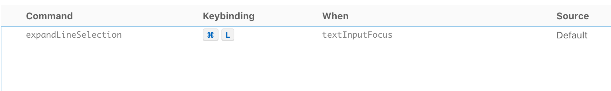

  However, nothing happens when I press `cmd`+`L`.

  VCS Version: 1.38.1

  ### Fix: I changed the key binding to `cmd`+`;` and it worked. Then I changed it back to `cmd`+`L` and that worked.

  ## Where I Left Off
  I have two users on index now. I think I need to do some refactoring. I want to get the two separate user times to have different socket namespaces.

  [Link To Work](https://github.com/DashBarkHuss/express_proj/commit/e368eab4dbae61522a6fa8a1b48376fec1405d04)


## Day 78, R3
### 10/5/19
- ## Node
  ### Where I Left Off
  I'm having an issue where my server isn't emitting the socket event. It only emits it after I refresh the client. I need to investigate more.

  ## Socket IO
  I was trying to figure out why the server couldn't emit an event to the sockets.

  ```javascript
  app.post('/messages', (req, res) =>{
      messages.push(req.body)
      const chatRoom = io.of(`/${req.body.chat}ChatRoom`);
      chatRoom.emit(`message`, req.body);
      res.sendStatus(200)
  })
  ```

  I got the above code to work when I made the connection to the sockets outside of the scope of app.post().

  ```javascript
  var io = require('socket.io')(http)

  io.of(`/garyChatRoom`);
  io.of(`/workChatRoom`);
  ```
  `.of` initializes and retrieves a namespace.
  >server.of(nsp)
  >- nsp (String|RegExp|Function)
  >- Returns Namespace
  >
  >Initializes and retrieves the given Namespace by its pathname identifier nsp. If the namespace was already initialized it returns it immediately.

  -*from [server.of(nsp)](https://socket.io/docs/server-api/#server-of-nsp)*

  ## Socket IO Sample Namespaces
  I finished my sample Socket Io app with multiple namespaces.

  [Socket Sample Multiple Namespaces](https://github.com/DashBarkHuss/multiple_namespaces_socket_IO/commits/master)

  ## Where I Left Off
  I started testing out the express app for two different users.

  [Link To Work](https://github.com/DashBarkHuss/express_proj/commit/3a6dda91d277c1a5324daa3c594548f2b7ca691c)


## Day 77, R3
### 10/4/19
- ## Node
  ### Where I Left Off
  I made a sample socket IO app that sends messages to different chat rooms conditionally. But I didn't yet use multiple name spaces.

  ## Submit Default Event

  I was wondering why the radio buttons were appearing as query parameters after I sent the messages: 
  
  `http://localhost:3000/?chat=work` <--query parameter

  `e.preventDefault()` stopped this from happening so I read about the submit event:
[HTMLFormElement: submit event](https://developer.mozilla.org/en-US/docs/Web/API/HTMLFormElement/submit_event)

  >When you click the Send button, the form is submitted, meaning that the content of its field is packed into an HTTP request and the browser navigates to the result of that request.
  >
  >When the \<form> element’s method attribute is GET (or is omitted), the information in the form is added to the end of the action URL as a query string. The browser might make a request to this URL:
  >
  >`GET /example/message.html?name=Jean&message=Yes%3F HTTP/1.1`

  -*from [HTTP and Forms](https://eloquentjavascript.net/18_http.html)*

  ## Debugging Socket IO
  Info on debugging: [Available debugging scopes](https://socket.io/docs/logging-and-debugging/)

  ## Issue With Socket IO
  I'm having an issue where my server isn't emitting the socket event. It only emits it after I refresh the client. I need to investigate more.


## Day 76, R3
### 10/3/19
- ## Node
  ### Where I Left Off
  I'm testing to see what happens if I clear the local storage and reload the page while offline. It seems like it's connecting to the server somehow when it's offline.

  ## Multiple Web Sockets
  How do you make multiple web sockets on the same app. For example, on facebook websockets update the news feed. But my news feed is different from Joe Shmoe's news feed. How do they do that?

  ## Custom Name Spaces

  >To set up a custom namespace, you can call the of function on the server-side:
  >```javascript
  >const nsp = io.of('/my-namespace');
  >nsp.on('connection', function(socket){
  >console.log('someone connected');
  >});
  >nsp.emit('hi', 'everyone!');
  > ```
  >On the client side, you tell Socket.IO client to connect to that namespace:
  >```javascript
  >const socket = io('/my-namespace');
  >```


  -*from [Custom Namespace Socket IO Docs](https://socket.io/docs/rooms-and-namespaces/#Custom-namespaces)*

  ## Front End

  I reviewed some bootstrap docs:
  - [Boot Strap Grid](https://getbootstrap.com/docs/4.3/layout/grid/)
  - [Forms](https://getbootstrap.com/docs/4.3/components/forms/)
  
  And JQuery:
  - [Attribute Equals Selector [name=”value”]](https://api.jquery.com/attribute-equals-selector/)


  ## Where I left off
  ### Socket IO Sample
  I made a sample socket IO app that sends messages to different chat rooms conditionally. But I didn't yet use multiple name spaces.

  [Socket IO Conditional Multiple Chat Rooms](https://github.com/DashBarkHuss/socket_iO_conditional_chat/commit/75a772be7a6f506c36e56ebbf88b3540946cac5f)


## Day 75, R3
### 10/2/19
- ## Node
  ### Where I Left Off
  I ended trying to get the rc's to store to local storage before the database updates, so that if we're offline we still get an updated timeline. I thought I did this already but I guess I didn't.

  ## Mysterious Port 3306
  Mysteriously, local host on port 3306 was serving files even though I didn't have node or nodemon running. I finally realized it's because the service workers cached the files.

  ## Timeline Updates Offline
  Now the timeline updates when we're offline and we add an RC.

  [Link To Work](https://github.com/DashBarkHuss/express_proj/commit/10ca8396e19e6891cf1b31fb4901a99fb664f442)

  ## Where I Left Off:
  I'm testing to see what happens if I clear the local storage and reload the page while offline. It seems like it's connecting to the server somehow when it's offline.

  [Here's my last commit](https://github.com/DashBarkHuss/express_proj/commit/e3ec838daa2545c1a64e88d38e24241523398f78)

## Day 74, R3
### 10/1/19
- ## Node
  ### Where I Left Off
  I got the timeline to update after a socket event updates the local storage. I also made tooltips on my timeline that show the times of each reality check. It seems a little slow so I have to reexamine what I'm doing. I think I have some extra requests that I could get away with not using.

  ## Slow
  I'm not sure why the fetches are so slow sometimes.

  ## Timeline
  I worked more on my timeline.

  [Link To Work](https://github.com/DashBarkHuss/express_proj/commit/456a073672824beb2e9acd1574eaaed19b05f3bb)

  ## Where I Left Off
  I ended trying to get the rc's to store to local storage before the database updates, so that if we're offline we still get an updated timeline. I thought I did this already but I guess I didn't.

## Day 73, R3
### 9/30/19
- ## Node
  ### Where I Left Off
  I left off working on getting an SVG timeline to render based on the times of the RC's.

  ## Storage Event
  I was trying to use the storage event to update the timeline. So when local storage updates, the timeline does too. 
  
  I tried using the storage event 
  - [Using The Web Storage API](https://developer.mozilla.org/en-US/docs/Web/API/Web_Storage_API/Using_the_Web_Storage_API)
  - [storage.onChanged](https://developer.mozilla.org/en-US/docs/Mozilla/Add-ons/WebExtensions/API/storage/onChanged)
  
  However:
  >The storage event is only triggered when a window other than itself makes the changes.
  
  -[storage Event](https://www.w3schools.com/jsref/event_storage_url.asp)
  
  So unless I fire the event on another page it won't work.

  ## Where I Left Off
  I got the timeline to update after a socket event updates the local storage. I also made tooltips on my timeline that show the times of each reality check. It seems a little slow so I have to reexamine what I'm doing. I think I have some extra requests that I could get away with not using.

  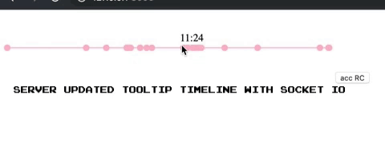
  
  [Link To Work](https://github.com/DashBarkHuss/express_proj/commit/8799e64527ca6f5da6be87a73781fff58d2cf982)

## Day 72, R3
### 9/29/19
- ## Node
  ### Where I Left Off
  I got socket IO to tell the browser when a reality check has been added to the database. Now I'm trying to get the frontend to properly add the new data.

  ## Socket IO on App
  I got socket IO working on my app.

  [Link To Work](https://github.com/DashBarkHuss/express_proj/commit/f2927503f31f202e9cd79895fb35ccee38727b3d)

  ## Where I Left Off
  I left off working on getting an SVG timeline to render based on the times of the RC's.


## Day 71, R3
### 9/28/19
- ## Node
  ### Where I Left Off
  I started experimenting with bootstrap in my socket IO sample browser chat.

  ## Getting Stuck In Git Terminal
  Sometimes I get stuck in the terminal when using a git command. This is how to get out.

  >You won't lose commits by closing the terminal.
  >
  >`ctrl+c` will exit the prompt `>`
  >
  >
  >What happened was you opened up a string with the odd number of ' characters.
  >Bash expects more input for your string, and allows you to enter it after the > prompt.
  >
  >Try typing `'` and hit `return`, you will get the same thing. If you close the string by typing `'` again, you will be back to your normal bash prompt.

  -*from [How do I exit my git commit message? I'm NOT in the VIM, I used the “ commit -m ” command](https://stackoverflow.com/questions/26228848/how-do-i-exit-my-git-commit-message-im-not-in-the-vim-i-used-the-commit-m)*

  ## .gitignore Not Working
  I added something to .gitignore and github didn't ignore it. This fixed the issue.

  >NOTE: First commit your current changes, or you will lose them.
  >
  >Then run the following commands from the top folder of your Git repository:
  >
  >```javascript
  >git rm -r --cached .
  >git add .
  >git commit -m "fixed untracked files"
  >```
  -from *[.gitignore is ignored by Git](https://stackoverflow.com/questions/11451535/gitignore-is-ignored-by-git)*

  ## Socket IO Sample Browser App
  I made a sample browser chat app using socket IO inspired by [Create your Socket.io event](https://www.linkedin.com/learning/learning-node-js-2/create-your-socket-io-event) and [Connect to Socket.io from the browser app](https://www.linkedin.com/learning/learning-node-js-2/connect-to-socket-io-from-the-browser-app).

  Project: [sample_socket_IO_browser](https://github.com/DashBarkHuss/sample_socket_IO_browser)

  ## Where I Left Off
  I got socket IO to tell the browser when a reality check has been added to the database. Now I'm trying to get the frontend to properly add the new data.


## Day 70, R3
### 9/27/19
- ## Node
  ## Where I Left Off
    I'm trying to understand the bodyparse module and why I didn't need it before. I'm working on making a sample app that uses socket IO in the browser.

  ## Why
  In the video [Create a post message service](https://www.linkedin.com/learning/learning-node-js-2/create-a-post-messages-service), the instructor says that express has no built in support to parse a body. He says you need to use the bodyparser module. But I was able to use express without bodyparser before.

  I realized what I did different. I was using the fetch API to post. The instructor is using jquery.post(). But why does one work without the body parser and one doesn't?

  ### Content-Type
  When you make a jquesry.post() request the content type defaults to  `'content-type': 'application/x-www-form-urlencoded; charset=UTF-8'`. In a fetch call you can specify the type. 

  ```javascript
  fetch('http://localhost:3000/messages',{
        method: 'POST', 
        body: JSON.stringify(message),
        headers: {
            "Content-Type": "application/json"
        }
  })
  ```

  So I wonder why the instructor said it has no build in support to parse the body. I guess he meant to parse the body when it's not set to `"Content-Type": "application/json"`. Maybe if it's already set to json, it's not considered parsing. Either way, that info is out of date. Express now includes body parser:

  ```javascript
  // Latest(4.16.0), Built in way:
  const express = require('express');
  const app = express();
  app.use(express.urlencoded({extended: true}));

  //Older, Seperate module way:
  const express = require('express');
  const bodyParser = require('body-parser'); 
  const app = express();
  app.use(bodyParser.urlencoded({extended: true}));
  ```
  -*from [Express now includes body-parser middleware by default](https://www.reddit.com/r/javascript/comments/78jjna/express_now_includes_bodyparser_middleware_by/)*

  ## Bootstrap
  I read a little bit about [bootstrap](https://getbootstrap.com/docs/4.3/getting-started/introduction/), a framework for building responsive, mobile-first sites.

  ## Where I Left Off
  I started experimenting with bootstrap in my socket IO sample browser chat.

## Day 69, R3
### 9/26/19
- ## Node
  ## Where I Left Off
   I was  watching the LI Learning video [Connect to Socket.io from the browser app](https://www.linkedin.com/learning/learning-node-js-2/connect-to-socket-io-from-the-browser-app). I ran into a weird error when following along:

  `Access to XMLHttpRequest at 'http://localhost:3000/messages' from origin 'http://127.0.0.1:3000' has been blocked by CORS policy: No 'Access-Control-Allow-Origin' header is present on the requested resource.`

  Aren't these the same origin?:
    - 'http://localhost:3000/messages
    - 'http://127.0.0.1:3000'
  
  Localhost is the same as 127.0.0.1 and /messages isn't part of the origin, is it? So how are they not the same? What's going on?

  ## Localhost vs 127.0.0.1
  My browser is at the address: `http://127.0.0.1:3000/`

  When I fetch `127.0.0.1:3000/messages` I get the data I want. But when I fetch  `localhost:3000/messages` I'm blocked by CORS.

  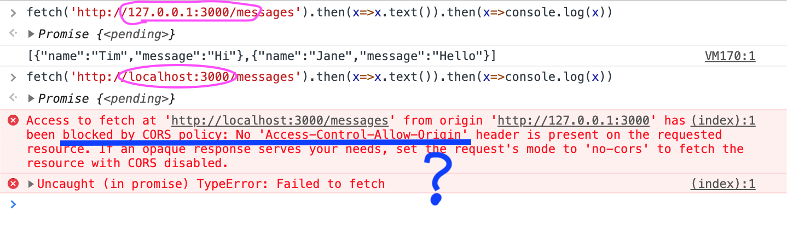

  >Origin is defined as a scheme/host/port (port is the default value for a scheme if it doesn't exist, e.g. port 80 for http, 443 for https). Same-origin is defined as a matching scheme/host/port. "localhost" and "127.0.0.1" are different hosts in this case.
  
  -*from [Are 127.0.0.1 and localhost considered as two different domains by browsers?](https://stackoverflow.com/questions/5256251/are-127-0-0-1-and-localhost-considered-as-two-different-domains-by-browsers)*

  More here: [Origin determination rules](https://en.wikipedia.org/wiki/Same-origin_policy#Origin_determination_rules)

  ## Socket IO Tutorial
  I watched to video from the course Learning Node.js:

  - [Create your Socket.io event](https://www.linkedin.com/learning/learning-node-js-2/create-your-socket-io-event)
  - [Connect to Socket.io from the browser app](https://www.linkedin.com/learning/learning-node-js-2/connect-to-socket-io-from-the-browser-app)

  Now I can see how to use socket IO in the browser.

  I also watched this video: [Express](https://www.linkedin.com/learning/learning-node-js-2/express-2)

  In the video [Create a post message service](https://www.linkedin.com/learning/learning-node-js-2/create-a-post-messages-service), the instructor says that express has no built in support to parse a body. He says you need to use body parser. Why was I able to use express without body parser before?

  ## Where I Left Off
  I'm trying to understand body parse and why i dodn't need it before. I'm working on making a sample app that uses socket IO in the browser.

## Day 68, R3
### 9/25/19
- ## Node
  ## Where I Left Off
  I started working on getting Socket IO to send data to localStorage when the database is updated.

  ## Socket IO And Database Changes
  I'm wondering, if the database updates, is there a way to trigger some action so socket io can update the client?
  The obvious way would be to emit an event when the code inserts successfully in the database. This seems like it would work mostly, but it would not work if I manually added data to the database.

  I looked into datbase triggers, but I'm not sure what they are, it just sounded right:

  - [What is a Database Trigger?](https://www.essentialsql.com/what-is-a-database-trigger/)
  - [Introduction on Triggers](https://www.w3resource.com/mysql/mysql-triggers.php)

  I think these only trigger SQL actions.

  ## To Fix
  In my app, the client fetches all the Rc's since the last rc. But it should only do that if the last Rc is from today. Otherwise it should clear all the RC's. So I need to fix that.

  ## Nodemon In Two Terminals?
  Can I run two different script in two different terminals using nodemon? I want to run my regular server and my socket server with Nodemon. Right now, I can't because they're on the same port. But can I have them on two different ports?

  Looking at this `package.json`:

  ```javascript
  {
    "name": "my-node-api",
    "version": "0.5.0",
    "description": "API for serving cannabis data",
    "main": "index.js",
    "scripts": {
      "test": "echo \"Error: no test specified\" && exit 1",
      "start": "PORT=4200 node server.js",
      "dev": "NODE_ENV=test PORT=4205 nodemon server.js"
    },
  }
  ```
  -from *[Make a NodeJS API with mySQL](http://stayregular.net/blog/make-a-nodejs-api-with-mysql)*

  Made me think I could control the port by running: `PORT=4205 nodemon somefile.js`. But the port didn't change.

  Now I see the port it's referring to is set in my app:
  ```javascript
  //index.js
  app.listen(3306, ()=>{console.log("listening")})
  ```
  I tested my other project- the Socket IO sample project: I was able to run two files using nodemon, so nodemon isn't the problem. It must be my express project.

  ## My App Can't Run Two Files on Nodemon
  My app can't run some two files at once on nodemon but for other given two files it works.

  - can: socket-server and timeHelper
  - can't: socket-server and index.js
  - can't: index.js and timeHelper

  When I can't run them at the same time, it's because I get this error: 
  ```bash
  Error: listen EADDRINUSE: address already in use :::3306
  ```
  That port is the port from:
   ```javascript
  //index.js
  app.listen(3306, ()=>{console.log("listening")})
  ```

  So I see now that when I run `nodemon timehelper`, index.js also runs. That calls `app.listen(3306...`. So if I also run `nodemon index.js`, they both run. Then `app.listen(3306...` runs twice.

  Ok so I found a weird solution. I changed the name of index.js to `indexo.js`. Now running timeHelper and socket-server doesn't also run `indexo.js`. So for some reason nodemon is always running whatever file is named index in the directory.

  
  After looking at this- [Nodemon index.js](https://stackoverflow.com/questions/42190362/nodemon-index-js), I think it's because nodemon runs whatever is in the `main` property in your package.json. In my case, `index.js` is in main.

  ## Socket IO update
  Now I got the socket to trigger an event on indexo.js when an RC is added to the database.

  But we want the event to be triggered on the client. So that's next.

  [Link To Work](https://github.com/DashBarkHuss/express_proj/commit/ef9f02e409a2c890633790d1dda518e6ef186916)

  ##  `http.Server(app)`
  I saw this weird line in the files for the video [Connect to Socket.io from the browser app](https://www.linkedin.com/learning/learning-node-js-2/connect-to-socket-io-from-the-browser-app):
  ```javascript
  const http = require('http').Server(app);
  ```
  I read about it a bit here: [http.createServer(app) v. http.Server(app)](https://stackoverflow.com/questions/26921117/http-createserverapp-v-http-serverapp)

  ## Where I Left Off
  I'm watching the LI Learning video [Connect to Socket.io from the browser app](https://www.linkedin.com/learning/learning-node-js-2/connect-to-socket-io-from-the-browser-app). I'm running into a weird error when I follow along:

  `Access to XMLHttpRequest at 'http://localhost:3000/messages' from origin 'http://127.0.0.1:3000' has been blocked by CORS policy: No 'Access-Control-Allow-Origin' header is present on the requested resource.`

  Aren't these the same origin?:
    - 'http://localhost:3000/messages
    - 'http://127.0.0.1:3000'
  
  Localhost is the same as 127.0.0.1 and /messages isn't part of the origin, is it? So how are they not the same? What's going on?

## Day 67, R3
### 9/24/19
- ## Node
  ## Where I Left Off
  I still didn't get to play with Socket IO. 

  All the data is stored locally. Next I can either work on the UI of displaying the RC times, or I can work on the websockets side.

  ## git commit --dry-run
  Examples: 
  - `git fetch --dry-run`
  - `git commit --dry-run`
  - `git push --dry-run`

  `--dry-run`:
  Show what would be done, without making any changes.

  [Git: How to check if a local repo is up to date?](https://stackoverflow.com/questions/7938723/git-how-to-check-if-a-local-repo-is-up-to-date/7939193)

  ## Sample Socket IO CLI Chat
  I made an app that is a CLI chat using Socket IO. I used these two LI Learning videos:
  - [Create A WebSocket With Socket IO](https://www.linkedin.com/learning/node-js-essential-training-web-servers-tests-and-deployment/create-a-websocket-with-socket-io?autoplay=true)
  - [Emit Socket.IO events](https://www.linkedin.com/learning/node-js-essential-training-web-servers-tests-and-deployment/emit-socket-io-events?autoplay=true)
  
  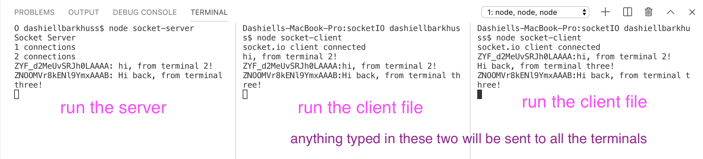

  See the project here: [sample_socket_io](https://github.com/DashBarkHuss/sample_socket_io)

  ## Where I Left Off
  I started working on getting Socket IO to send data to localStorage when the database is updated.

  [Link To Work](https://github.com/DashBarkHuss/express_proj/commit/ebda2d4660c88afff2f1463c2cbe7cc54699f10d)
## Day 66, R3
### 9/23/19

- ## Node
  ### Where I left off
  I want to try to build a socket.io sample app.
  
  I started creating a GET request for my express app that sends the locally stored rc information so only the new info is sent back.

  ## Local Storage Updating
  Now local storage updates on refresh. It would be cool to use webSockets to update in real time.

  [Link To Work](https://github.com/DashBarkHuss/express_proj/commit/19663cfe23272d00d5d35e5ed170091eef6d9665)

  ## Fetch Not Always Working
  Something is going on with fetch, it's not always working. I think I might understand this more if I learn how to debug using the network panel better.

  ## Added Time Helper
  I didn't want to add a heavy time library like moment.js so I just made a small time helper.

  ```javascript
  const epochToTime = epoch=>{
    const date = new Date(epoch); 
    const h = date.getHours(); 
    const m = date.getMinutes().toString().length == 2? date.getMinutes(): '0' + date.getMinutes();
    return h+':'+ m
  }
  ```

  [Link To Work](https://github.com/DashBarkHuss/express_proj/commit/533296ff000306da0289111dc81e8067d71b9a84)

  ## Where I Left Off
  I still didn't get to play with Socket IO. 

  All the data is stored locally. Next I can either work on the UI of displaying the RC times, or I can work on the websockets side.


## Day 65, R3
### 9/22/19

- ## Node
  ### Where I left off
  I started working on getting reality check info for the user from the database to the UI.

  ## RC's In Local Storage
  Here I grabbed all the rc's from the database and saved them to localStorage. 

  [Link To Work](https://github.com/DashBarkHuss/express_proj/commits/master)

  ## Can The Server Talk To The Client?
  I was wondering this exact question:

  >What I'd like to know is if there's a way to have the server broadcast a message to clients. An example of this would be a client page that has a newsfeed, and every time a new story comes in to the server, the server sends that information out to the client and the client updates its page's newsfeed. I don't want the client to constantly be polling the server every few seconds, asking "hey, is there a new story now? what about now? what about now???" I want the client to be doing its own thing, and then be interrupted by a message from the server.

  The answers said to look into [Web Sockets](https://developer.mozilla.org/en-US/docs/Web/API/WebSockets_API)
  >For newer browsers, you can use web sockets to open a continuous connection to a server and then client/server can send each other messages whenever they want.

  This answer is from 2011, so I'm guessing most browsers work with web sockets now.

  Question and answer from: [how to get the server to talk to the client](https://stackoverflow.com/questions/8626249/how-to-get-the-server-to-talk-to-the-client)

  ## Web Sockets
  I watched these two videos:

  - [Create A WebSocket](https://www.linkedin.com/learning/node-js-essential-training-web-servers-tests-and-deployment/create-a-websocket)
  - [Broadcast messages with WebSocket](https://www.linkedin.com/learning/node-js-essential-training-web-servers-tests-and-deployment/broadcast-messages-with-websocket)

  Now I'm going to try to do what the instructor did.

  [WebSocket Docs](https://developer.mozilla.org/en-US/docs/Web/API/WebSocket)

  ## Sample App: WebSocket Using `ws`
  I made a sample app that has a websocket connection and uses the `ws` module:

  [Sample WebSocket using ws](https://github.com/DashBarkHuss/sample_websocket)

  ## Sockets.io
  Sockets.io is a websocket framework that fails back to a different data polling technique in environments that do not support webSocket. It also comes with tools to help build large scale applications with ease.
  
  I watched these two videos about Socket.io:

  - [Create a WebSocket with Socket.IO](https://www.linkedin.com/learning/node-js-essential-training-web-servers-tests-and-deployment/create-a-websocket-with-socket-io)
  - [Emit Socket.IO events](https://www.linkedin.com/learning/node-js-essential-training-web-servers-tests-and-deployment/emit-socket-io-events)

  ## Where I Left Off:
  I want to try to build a socket.io sample app tomorrow.
  
  I started creating a GET request for my express app that sends the locally stored rc information so only the new info is sent back.


## Day 64, R3
### 9/21/19

- ## Node
  ### Where I left off
  I'm trying to get the right timestamps to post but something looks off.

  ## Reality Checks & Background Sync Working
  I got background sync to log the timestamp and geolocation of each reality check, even if offline.

  [Link To Work](https://github.com/DashBarkHuss/express_proj/commit/956551fd36229378ea9e8977f8f38cb69dfb612c)

  ## Store More Accurate Coordinates
  Right now the coordinates are storing to the 6ths decimal place. I need to edit the datatype so they store a more precise number since the actual geolocation is more precise.

  ## Where I Left Off
  I started working on getting reality check info for the user from the database to the UI.

  [Link To Work](https://github.com/DashBarkHuss/express_proj/commit/3f1ff4f11305a3fb75d1bdf18ec15a750ef8a194)


## Day 63, R3
### 9/20/19

- ## Node
  ### Where I left off
  I got the service worker to post but then it seemed like it wasn't posting. 

  ## Background Sync Post
  I got background sync to post and insert into the database.

  [Link To Work](https://github.com/DashBarkHuss/service_worker_background_sync/commit/62aebdd16328de00cfd21be40f669d463345ce9d)

  ## Background Sync Issue
  Background sync is skipping fetch calls when the request bodies are exactly the same. This isn't an issue for my application, but I wonder why it works like this.

  Maybe it's because if the request bodies of two different requests are the same, in my app they also both register with the same name. 
  ```javascript
  registration.sync.register(`post-${value}`);
  ```
  ## Where I Left Off
  I'm trying to get the right timestamps to post but something looks off.

  [Link To Work](https://github.com/DashBarkHuss/express_proj/commit/b7de365777a661c299a3896a1c7c65541403c63f)


## Day 62, R3
### 9/19/19

- ## Node
  ## Where I Left Off
  I played with background sync and I got it to work with a param and get request. I made a sample project. Tomorrow I'll try to get it to work with POST.

  ## localStorage Service Workers
  >You cannot access localStorage (and also sessionStorage) from a webworker process, they result will be undefined, this is for security reasons.
  >
  >You need to use postMessage() back to the Worker's originating code, and have that code store the data in localStorage.
  >
  >You should use localStorage.setItem() and localStorage.getItem() to save and get data from local storage.

  -*from [Access localStorage from service worker](https://stackoverflow.com/questions/40887635/access-localstorage-from-service-worker)*

  >You can't cache POST requests using the Cache API. See https://w3c.github.io/ServiceWorker/#cache-put (point 4).
  >
  >There's a related discussion in the spec repository: https://github.com/slightlyoff/ServiceWorker/issues/693
  >
  >An interesting solution is the one presented in the ServiceWorker Cookbook: https://serviceworke.rs/request-deferrer.html Basically, the solution serializes requests to IndexedDB.

  -*from [Can service workers cache POST requests?](https://stackoverflow.com/questions/35270702/can-service-workers-cache-post-requests/35272243#35272243)*

  ## Where I left off
  I got the service worker to post but then it seemed like it wasn't posting. 

- ## Thoughts And Feelings
  I'm feeling really fatigued. I think it's from my wisdom tooth.

## Day 61, R3
### 9/18/19

- ## Node
  ### Where I Left Off
  I'm playing around trying to get background sync to work.

  ## Background Sync Video
  I finally got LinkedIn Learning (formerly Lynda) to work. I like some of the new features, like Q&A. I think that's awesome! They took the search bar away that used to search the transcript of the videos, so I'm hoping they bring that back. I watched this video from LI Learning:

  [Sync data in the background](https://www.linkedin.com/learning/vanilla-javascript-service-workers/sync-data-in-the-background)

  ## Params in Express
  >**req.query**: directly access the parsed query string parameters
  >
  >**req.params**: directly access the parsed route parameters from the path

  -*from [Get Query Strings and Parameters in Express.js](https://stackabuse.com/get-query-strings-and-parameters-in-express-js/)*

  ## Where I Left Off
  I played with background sync and I got it to work with a param and get request. I made a sample project. Tomorrow I'll try to get it to work with POST.

  [Link To Work](https://github.com/DashBarkHuss/service_worker_background_sync/commits/master)

## Day 60, R3
### 9/17/19

- ## Node
  ### Where I Left Off
   I'm trying to figure out the best way to deal with intercepting a post request to store the geolocation and timestamp. What if GPS isn't working but the user is online? What if the user if offline but GPS works? What if they're both not working? I will probably have to look into indexedDB tomorrow.

   ## Need To Start Node Server
   I was confused for why I couldn't connect to the data base through my UI. I finally realized I was just pressing the "Go Live" button in VSC. I need to run the node server!

   ## IndexedDB
   Read a little about indexedDB.

   [Getting Started with Persistent Offline Storage with IndexedDB](https://itnext.io/getting-started-with-persistent-offline-storage-with-indexeddb-1af66727246c)

  ## Background Sync
  > a low-level feature for running code inside registered events in the background when the user is connected to the Internet, even when the page itself is closed. In the context of offline support, you can use it to hold request until the user has their Internet connection back, to make sure that they are going to be sent. This way, you will make sure that your app is synced with a remote database and all changes a user made are there or will be sent there. 
  
  -*from [Make Your PWA Work Offline Part 2 - Dynamic Data](https://www.monterail.com/blog/pwa-offline-dynamic-data)*

  [Introducing Background Sync](https://developers.google.com/web/updates/2015/12/background-sync)

  ## 400 (Bad Request) and Fetch
  I kept getting a 400 error when trying to fetch using the POST method. It was hard to debug, I wasn't getting much info. I finally saw the problem was in the syntax of the request body. I had an extra quote symbol.

  ## Where I Left Off
  I'm playing around trying to get background sync to work.

## Day 59, R3
### 9/16/19

- ## Node
  ### Where I Left Off
  I started making a new branch on my express app to test adding a service worker in so that I can save data while offline.

  ## Service Workers Video
  [Introduction to Service Workers](https://pusher.com/sessions/meetup/js-monthly-london/introduction-to-service-workers)

  ## LinkedIn Learning
  I found out my school finally canceled my Lynda account (now LinkedIn Learning). I got a free 6 month LinkedIn Pro membership from Ray Villalobos for completing 100 days of code. But now I'm still having trouble logging in to that. I'm realizing now how much I miss this resource! I need it back.

  ## Questions
  Is there a way to intercept `navigator.geolocation.getCurrentPosition(success, error)` with service workers? I see you can intercept `fetch` requests but what about getting a geolocation?

  If there is an `addListenerEvent` event for `fetch`, in there one for  `navigator.geolocation.getCurrentPosition()`?

  ## Override Geolocation DevTools
  This was helpful for testing: [Override Geolocation With Chrome DevTools](https://developers.google.com/web/tools/chrome-devtools/device-mode/geolocation)

  ## Rethinking My Code
  I realized that you could be offline but have access to GPS. In that case you still want to store location. So I need to add that to my code.

  ## Where I Left Off
  I'm trying to figure out the best way to deal with intercepting a post request to store the geolocation and timestamp. What if GPS isn't working but the user is online? What if the user if offline but GPS works? What if they're both not working? I will probably have to look into indexedDB tomorrow.

  [Link To Work](https://github.com/DashBarkHuss/express_proj/commit/249ce1faa112586e3a1c6ede9415d73074ccb589)


## Day 58, R3
### 9/15/19

- ## Node
  ## Where I Left Off
  I learned about service workers so I could use them in my app. I still have to handle sending the local storage to my database.

  ## IndexedDB vs localStorage
  I'm not sure what this is talking about, because I got localStorage to work. But maybe that's because it's in a file that the service worker stored and not in the service worker file:
  >We’re using IndexedDB to do this because the localStorage API, while simpler, doesn’t work in a Service Worker.

  [Send messages when you’re back online with Service Workers and Background Sync](twilio.com/blog/2017/02/send-messages-when-youre-back-online-with-service-workers-and-background-sync.html)

  ## Issues Updating Service Workers 
  If you update your service worker it's hard to delete it from registration. I finally got it to delete. It required an extra refresh.

  [How to Uninstall, Unregister or Remove a Service Worker [With Example Code]](https://love2dev.com/blog/how-to-uninstall-a-service-worker/)

  ## Service Worker Send Local Storage
  I added more to my service worker app. It now saves to local storage and then has placeholder code for when the app is back online so the app can send the local storage to the database.

  [Link To Work](https://github.com/DashBarkHuss/service_worker)

  ## More Resources
  [Offline POSTs with Progressive Web Apps](https://medium.com/web-on-the-edge/offline-posts-with-progressive-web-apps-fc2dc4ad895)

  ## Where I Left Off
  I started making a new branch on my express app to test adding a service worker in so that I can save data while offline.

 - ## Thoughts and Feelings
    I'm so tired. My tooth ache has been keeping me up at night. Well, last night it was a combination of my tooth ache and my racing thoughts. It was difficult to work today and so excuse my log.

## Day 57, R3
### 9/14/19

- ## Node
  ## Where I Left Off
  Now if the user is not connected to the internet the app collects a timestamp and saves it to local storage. Next I'll handle how it will send the timestamp from local storage to the backend.

  ## Service Workers
  Services workers make your app work offline.

  >A service worker’s primary function is to intercept http calls made by pages and returning cached files.

  -*from [Offline Web Apps: Using Local Storage and Service Workers.](https://medium.com/@onejohi/offline-web-apps-using-local-storage-and-service-workers-5d40467117b9)*

  More resources:

  [Making a Simple Site Work Offline with ServiceWorker](https://css-tricks.com/serviceworker-for-offline/)

  [Offline Quickstart](https://www.youtube.com/watch?v=zw35jKRSIlo)

  [View Cache Data With Chrome DevTools](https://developers.google.com/web/tools/chrome-devtools/storage/cache)

  ## Sample Service Worker App

  I made a sampler service workers app [here](https://github.com/DashBarkHuss/service_worker).

  **Without** the service workers file, `sw.js`, the app can't load pages while offline:

  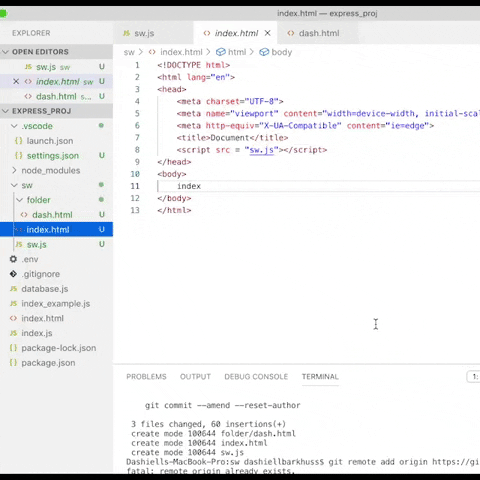
  

  **With** the service workers file, `sw.js`,  the app loads specified pages while offline:

  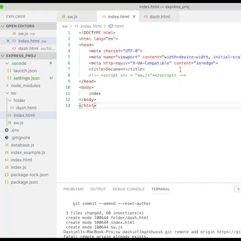

  ## Where I Left Off
  I learned about service workers so I could use them in my app. I still have to handle sending the local storage to my database.

## Day 56, R3
### 9/13/19

- ## Node
  ### Where I Left Off:
  I want to change the datatype for longitude and latitude to include more decimals. I need to see what happens when the user doesn't send a position.

  ## Null Location
  Now the code can handle if the location is null.

  [Link To Work](https://github.com/DashBarkHuss/express_proj/commit/a5e01fd4fde17884c8fb5e3dc4c397d3b5e514cc)

  ## Store RC Locally
  If not connected to the internet store the RC(reality check, contains timestamp) to local storage.

  [Link To Work](https://github.com/DashBarkHuss/express_proj/commit/2dd1c237cab3bc27532c73f3f515fd663ba9c31b)

  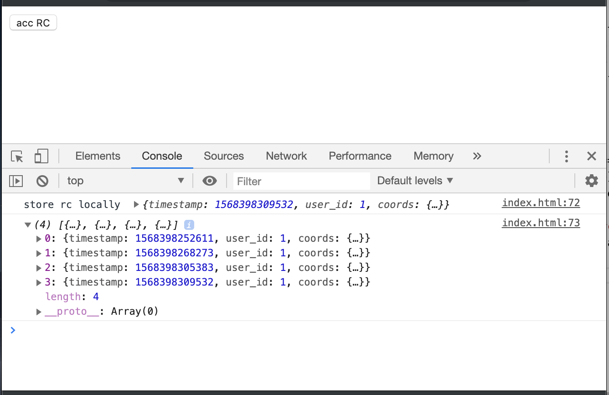

  ## Where I Left Off
  Now if the user is not connected to the internet the app collects a timestamp and saves it to local storage. Next I'll handle how it will send the timestamp from local storage to the backend.


## Day 55, R3
### 9/12/19

- ## Node
  ### Where I left Off
  I'm trying to figure out how the timestamp should be saved to the database, what datatype it should be.

  ## MySQL Integer Range

  I kept getting this error when trying to add a unix timestamp in milliseconds to my database.
  ```bash
  ER_WARN_DATA_OUT_OF_RANGE: Out of range value for column 'time' at row 1
  ```
  I thought it was because I had my length of the datatype set wrong, but no matter how I set it, MySQL gave me an error. 

  I found out MySQL has a range limit on integers.

  >The value 3172978990 is greater than 2147483647 – the maximum value for INT – hence the error. MySQL integer types and their ranges are [listed here.](https://dev.mysql.com/doc/refman/8.0/en/integer-types.html)

  -*from [MySQL Error 1264: out of range value for column](https://stackoverflow.com/questions/14284494/mysql-error-1264-out-of-range-value-for-column)*

  [MySQl Docs Integer Types](https://dev.mysql.com/doc/refman/8.0/en/integer-types.html)

  So I could divide the milliseconds by 1000 to get seconds and round it and use that with INT(11). Or I could use BIGINT(13) which is what I did and set it to unsigned which makes the positive range higher.

  ## Storing Location
  I have the app storing a location, time, and user_id for each reality check. However the longitude and latitude are not saving the numbers after the decimals. I just realized why! Because ints don't have decimals.

  [Link To Work](https://github.com/DashBarkHuss/express_proj/commit/2ac67e2af5cdc82f4658ee20f97d8d2a57dad061)

  ## Storing Decimals
  >Use DECIMAL(8,6) for latitude (90 to -90 degrees) and DECIMAL(9,6) for longitude (180 to -180 degrees). 6 decimal places is fine for most applications. Both should be "signed" to allow for negative values.

  -*from [What is the ideal data type to use when storing latitude / longitude in a MySQL database?](https://stackoverflow.com/questions/159255/what-is-the-ideal-data-type-to-use-when-storing-latitude-longitude-in-a-mysql/27926894)*

  I changed the type and it saves correctly now, but it isn't getting all the decimals, so I might want to add more.

  ## Where I Left Off:
  I want to change the datatype for longitude and latitude to include more decimals. I need to see what happens when the user doesn't send a position.

## Day 54, R3
### 9/11/19

- ## Node
  ## Where I Left Off
  I left off playing with [geolocation](https://www.w3schools.com/html/html5_geolocation.asp) in the console because I want to use it in my app. I started working on the post method.

  ## Serve Static Files in Express
  To serve up static files from the same directory I added:
  ```javascript
  app.use(express.static("./"))
  ```
  [Serving static files in Express](https://expressjs.com/en/starter/static-files.html)

  ## Fetch With Express
  I spent a while trying to figure out how to send a fetch request with express. My mistake was I didn't add JSON.stringify() to the body. Here is how it should be:
  ```javascript
  app.use(express.json());

  fetch('http://127.0.0.1:3306/test',         
  {
    method: "POST",
    body: JSON.stringify({user_id: 1}),
    headers: {
      "Content-Type": "application/json"
    }
  }).then(x=>{console.log('done')})
  ```
  ## Where I left Off
  I'm trying to figure out how the timestamp should be saved to the database, what datatype it should be.
  [Link To Work](https://github.com/DashBarkHuss/express_proj/commit/b96219fa2b2783aa6961310f5e9fd9715aa7d557)
  
## Day 53, R3
### 9/10/19

- ## Node
  ### Where I Left Off
  I'm starting an app, I left off trying to start the app with express.

  ## express()
  > Creates an Express application. The express() function is a top-level function exported by the express module.
  >
  >var express = require('express')
  >
  >var app = express()

  -*from [Express API Doc](https://expressjs.com/en/4x/api.html)*

  ## Git Repo For Express Project
  [First Commit](https://github.com/DashBarkHuss/express_proj/commit/d7eab60ed7a5c1d9925768c0b1b7facb9f04eca9)

  ## Require Dotenv
  I just spent a ton of time trying to debug my app. The problem was I didn't require `dotenv` so my variables were undefined.

  ## Where I Left Off

  I left off playing with [geolocation](https://www.w3schools.com/html/html5_geolocation.asp) in the console because I want to use it in my app. I started working on the post method.

## Day 52, R3
### 9/9/19

- ## Node
  ### Where I Left Off
  I finished the Express.js video and followed along. I started to look into relationships in MySQL. I'm trying to figure out how to set up a relationship.

  ## Add Relationship in Sequel Pro

  Check that your primary key and foreign key have the same type:

  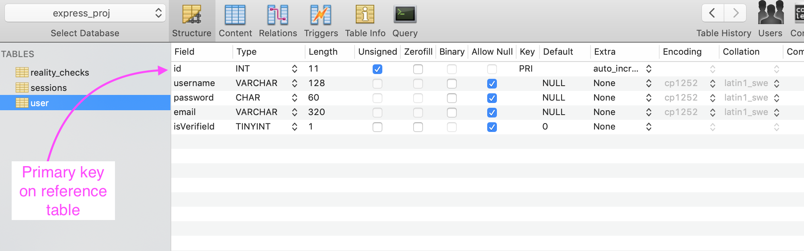

  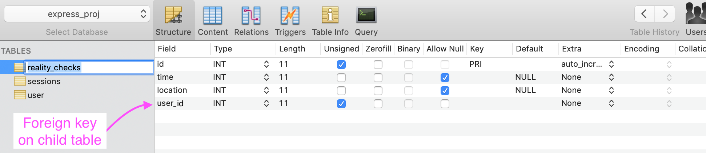

  The types have to match. The primary key, `id` is set to `INT`, `11`, `unsigned`, and `Allow Null` isn't checked. So `user_id`, the foreign key, must be set the same way.

  Set up the foreign key in the relations tab.
  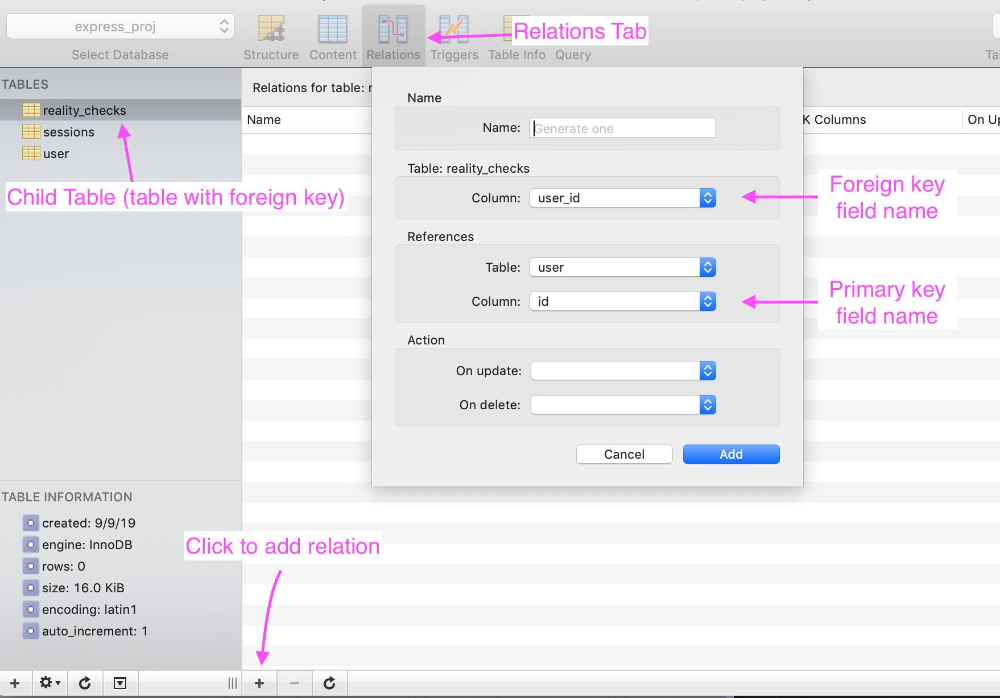

  I'm not sure if I got the terminology right. Is the parent table the primary key table? Now I think the parent key is called the foreign key table. I'm not sure.

  ## Cascade Delete
  >A foreign key with cascade delete means that if a record in the parent table is deleted, then the corresponding records in the child table will automatically be deleted.

  -from *[SQL Server](https://www.techonthenet.com/sql_server/foreign_keys/foreign_delete.php)*

  More: [Difference between On Delete Cascade & On Update Cascade in mysql](https://dba.stackexchange.com/questions/74627/difference-between-on-delete-cascade-on-update-cascade-in-mysql)

  ## Reactive Native
  [The Difference Between React.js and React Native + React Native Q&A || Crema](https://www.youtube.com/watch?v=7IWvCG2CBZA)
  
  ### Expo
  > With Expo tools, services, and React Native, you can build, deploy, and quickly iterate on native iOS and Android apps from the same JavaScript codebase.
  >- Access to device capabilities like camera, location, notifications, sensors, haptics, and much more, all with cross-platform APIs.
  >- Build service gives you app-store ready binaries and handles certificates, no need for you to touch Xcode or Android Studio.
  >- Over-the-air updates let you update your app at any time without the hassle and delays of submitting to the store.
  
  -from *[Expo](https://expo.io/)*

  ## Toolchain
  > In software, a toolchain is a set of programming tools that is used to perform a complex software development task or to create a software product, which is typically another computer program or a set of related programs. In general, the tools forming a toolchain are executed consecutively so the output or resulting environment state of each tool becomes the input or starting environment for the next one, but the term is also used when referring to a set of related tools that are not necessarily executed consecutively.
  >
  >A simple software development toolchain may consist of a compiler and linker (which transform the source code into an executable program), libraries (which provide interfaces to the operating system), and a debugger (which is used to test and debug created programs). A complex software product such as a video game needs tools for preparing sound effects, music, textures, 3-dimensional models and animations, together with additional tools for combining these resources into the finished product.[1][2]
  
  -from *[Wikipedia](https://en.wikipedia.org/wiki/Toolchain)*

  ## Flutter VS React Native
  [Flutter VS React Native -- Will Flutter Kill React Native? || Crema](https://www.youtube.com/watch?v=gWs3UQzrhtE)

  ## HTML5 GeoLocation
  [HTML5 Geolocation](https://www.w3schools.com/html/html5_geolocation.asp)

  ## HTML5 Server-Sent Events
  > A server-sent event is when a web page automatically gets updates from a server.
  >
  >This was also possible before, but the web page would have to ask if any updates were available. With server-sent events, the updates come automatically.
  >
  >Examples: Facebook/Twitter updates, stock price updates, news feeds, sport results, etc.

  [HTML5 Server-Sent Events](https://www.w3schools.com/html/html5_serversentevents.asp)

  ## HTML5 
  >When executing scripts in an HTML page, the page becomes unresponsive until the script is finished.
  >
  >A web worker is a JavaScript that runs in the background, independently of other scripts, without affecting the performance of the page. You can continue to do whatever you want: clicking, selecting things, etc., while the web worker runs in the background.

  [HTML5 Web Workers](https://www.w3schools.com/html/html5_webworkers.asp)

  ## Where I Left Off
  I'm starting an app, I left off trying to start the app with express.

## Day 51, R3
### 9/8/19

- ## Node
  I'm looking into express

  ### Where I Left Off
  I watched more of the tutorial [Express.js Tutorial: Build RESTful APIs with Node and Express | Mosh](https://www.youtube.com/watch?v=pKd0Rpw7O48) and followed along. I left off at [41:22](https://youtu.be/pKd0Rpw7O48?t=2482)

  ## What is Middleware
  >Express is a routing and middleware web framework that has minimal functionality of its own: An Express application is essentially a series of middleware function calls.
  >
  >Middleware functions are functions that have access to the request object (req), the response object (res), and the next middleware function in the application’s request-response cycle. The next middleware function is commonly denoted by a variable named next.
  >
  >Middleware functions can perform the following tasks:
  >
  >- Execute any code.
  >- Make changes to the request and the response objects.
  >- End the request-response cycle.
  >- Call the next middleware function in the stack.

  -*[Using middleware](https://expressjs.com/en/guide/using-middleware.html)*

  ## Relationships in MySQL
  I watched these two videos:

  [Controlling your Databases with Sequel Pro, Part 4: Exploring Table Relationships and SQL Queries](https://www.youtube.com/watch?v=Is_DuOGcSxk)
  
  [MySQL tutorial 18 - Foreign Keys](https://www.youtube.com/watch?v=Dov-_hgJGLM)

  ## Where I Left Off
  I finished the Express.js video and followed along. I started to look into relationships in MySQL. I'm trying to figure out how to set up a relationship.

## Day 50, R3
### 9/7/19

- ## Node
  I'm looking into express.

  ### Where I Left Off
  I'm watching this express tutorial: [Express.js Tutorial: Build RESTful APIs with Node and Express | Mosh](https://www.youtube.com/watch?v=pKd0Rpw7O48). I'll continue watching, today.

  ## Setting An Environment Variable in the Command Line

  Mac:
  ```bash
  $export SOMEVAR = 'somevalue'
  ```
  Use `set` instead of `export` for windows

  ## Proper Way To Set Port
  ```javascript
  const port = process.env.PORT || 3306;
  ```
  In production, your port will be in the environment variable `process.env.PORT`. 3306 is an arbitrary number to be used in development.

  ## Parameters
  ### **Route Parameters:** 
  Essential or required values.

  Here `api` and `courses` are route parameters.
  ```
  http://127.0.0.1:3306/api/courses/
  ```
  ### **Query String Parameters:**
  Optional values.
  
  Here the query string parameter is `sortBy=name`
  ```
  http://127.0.0.1:3306/api/courses/?sortBy=name
  ```
  ## Postman
  You can use [Postman](https://chrome.google.com/webstore/detail/postman/fhbjgbiflinjbdggehcddcbncdddomop//%40) to test http services.

  [How to use Postman, video segment](https://youtu.be/pKd0Rpw7O48?t=2034)

  ## Schemas
  A schema defines the shape of our objects. What properties do we have in an object? What is the type of each property?

  Input validation with Joi creating a schema:
  ```javascript
  const schema = {
      name: Joi.string().min(3).required()
  }
  const result = Joi.validate(req.body, schema);
  ```
   ## Where I Left Off
  I'm watched more of the tutorial [Express.js Tutorial: Build RESTful APIs with Node and Express | Mosh](https://www.youtube.com/watch?v=pKd0Rpw7O48) and followed along. I left off at [41:22](https://youtu.be/pKd0Rpw7O48?t=2482)

## Day 49, R3
### 9/6/19

- ## Node
  I'm making a vanilla Node.js app with CRUD and sessions.

  ### Where I Left Off
  I only have Delete of CRUD left to do. I haven't been setting any relationships between the tables in my database. I might want to look into that.

  ## My Process
  I thought I would share some of my process. I generally don't do much Googling for answers when I code. I mostly experiment in the browser console when I have a question about Javascript.

  For example, I wanted to know if in an `async function` can I return the last `.then()` value of a promise in a return statement. Or will the first promise value be returned. 

  So I took it to the console to find out. Here's some of what I did:

  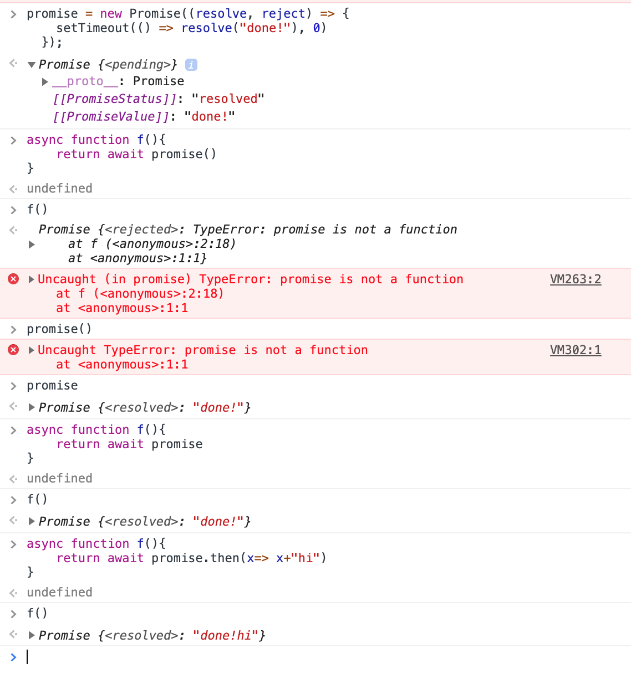

  ## Some Resources I Used Today

  [Async/await](https://javascript.info/async-await)

  [Basic MySQL Tutorial](http://www.mysqltutorial.org/basic-mysql-tutorial.aspx)

  ## Finished CRUD
  I finished my app.

  [Link To Work](https://github.com/DashBarkHuss/crud_login_node_app/commit/fb92d32cf67c044cd548b9b380b1ed49057a0ce4)

  It works but here are somethings I could still change:
    
  - My database helpers should be more uniform. They should probably all return the results of the query and I should handle the results from the function call. Instead, the results are handled in some of the helpers, which makes it hard to remember what the helper is going to return.
  - Some catch statements are missing.
  - I used some `async function`s for my API endpoints and some functions that `return` a `new Promise`. In production, I'd stick to one or the other to make the code more uniform and easier to read. But in this project I played with both for practice.

  ## Readme
  I added a readme file.

  [Link To Work](https://github.com/DashBarkHuss/crud_login_node_app/commit/a329b16e1a0f33615c157159e7593ce3ce945153)

  ## Lynda Account Not Working
  I use Lynda.com to learn lots of new subjects. Today, I couldn't log in. I wonder if my school finally closed my account? I emailed Lynda to see what's going on. 
  
  When I signed in with Safari, I got a different message. It said my account had been moved to LinkedIn Learning but I couldn't figure out how to log in.
  
  I guess I'll use Youtube for now. 

  ## Express ReST API Tutorial
  I started watching this tutorial:
  [Express.js Tutorial: Build RESTful APIs with Node and Express | Mosh](https://www.youtube.com/watch?v=pKd0Rpw7O48)

  ## Where I Left Off
  I'm watching this express tutorial: [Express.js Tutorial: Build RESTful APIs with Node and Express | Mosh](https://www.youtube.com/watch?v=pKd0Rpw7O48). I'll continue watching, tomorrow.

## Day 48, R3
### 9/5/19

- ## Node
  I'm making a vanilla Node.js app with CRUD and sessions.

  ### Where I Left Off
  I finished the Create part of CRUD. Next, Read?

  ## `ELIFECYCLE` Error
  When I'm testing my app in the browser, if I run into an `ELIFECYCLE` error the whole program will shut down.

  In this example there's a problem with my code.

  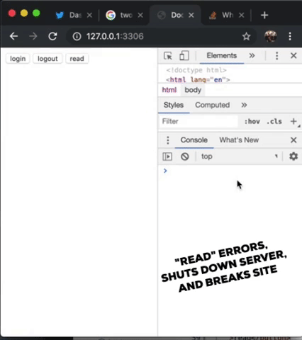

  I'm not wondering what caused this error. I'm wondering, since the error shut the whole program down, if this was in production, would my whole website go down just because one person interacted with a broken endpoint?

  ## Read
  I finished the read part of CRUD but I didn't handle the content for the front end. It just gets logged in the console for now.

  [Link To Work](https://github.com/DashBarkHuss/crud_login_node_app/commit/2eb0fa03721ed71ee659aed1bda0fd15dd5776bc)

  ## Sequel Pro Query
  You can you Sequel Pro to practice queries

  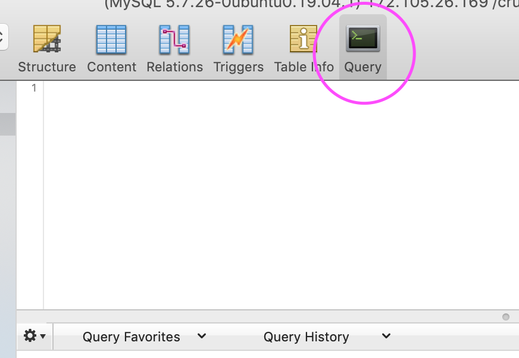

  ## Update
  I finished update of crud.

  [Link To Work](https://github.com/DashBarkHuss/crud_login_node_app/commit/8fcb170375144acd43d2e99b54379ae8afb6fbca)

  ## Refactored
  I refactored a bit because I'm going to reuse code that was in the update function for the delete function. So I took that code out of `action_posts_update` and moved in into it's own function `isAuthorizedToEditPost`.

  [Link To Work](https://github.com/DashBarkHuss/crud_login_node_app/commit/7040860e0db2c70a6b9077d67a5d3cc44cfd0689)

  ## Where I Left Off
  I only have Delete of CRUD left to do. I haven't been setting any relationships between the tables in my database. I might want to look into that.

## Day 47, R3
### 9/4/19

- ## Node
  I'm making a vanilla Node.js app with CRUD and sessions.

  ### Where I Left Off
  I started working on crud.

  ## Varying Number of Passed Arguments
  I think this code is reassigning `callback` incase the function call didn't pass in an `options` argument. Which is a cool way to handle varying accepted amounts of arguments. But I'm not totally sure if that's what it's trying to do.
  ```javascript
  function readFile(path, options, callback) {
  callback = maybeCallback(callback || options); 
  // more code bla bla bla
  }

  function maybeCallback(cb) {
  if (typeof cb === 'function')
    return cb;

  throw new ERR_INVALID_CALLBACK(cb);
  }
  ```
  ## Type Hinting with VS Code Tooltip
  When I hover over the `fs` method `readFile`, the VSC tooltip shows all sorts of info. Like that path is either a string or a number or a buffer. How does it get that info?

  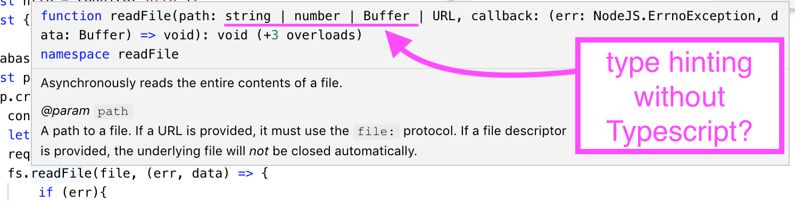

  Nothing in the function specifies the datatype of the path or the other information for the callback.

  ```javascript
  function readFile(path, options, callback) {
    callback = maybeCallback(callback || options);
    options = getOptions(options, { flag: 'r' });
    if (!ReadFileContext)
      ReadFileContext = require('internal/fs/read_file_context');
    const context = new ReadFileContext(callback, options.encoding);
    context.isUserFd = isFd(path); // File descriptor ownership

    const req = new FSReqCallback();
    req.context = context;
    req.oncomplete = readFileAfterOpen;

    if (context.isUserFd) {
      process.nextTick(function tick() {
        req.oncomplete(null, path);
      });
      return;
    }

    path = getValidatedPath(path);
    binding.open(pathModule.toNamespacedPath(path),
                 stringToFlags(options.flag || 'r'),
                 0o666,
                 req);
  }
  ```

  When I hover over my functions I don't get all that information.

  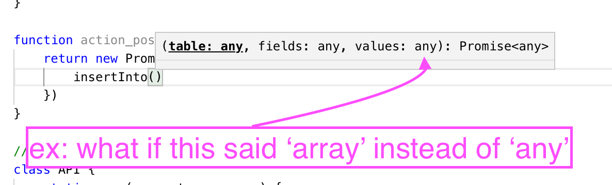

  I thought you could only do type hinting with typescript, but I don't see anything to indicate this is typescript. So where is this hinting coming from? How did the authors of the `fs` module do this?

  ## Create Posts
  `action_posts_create` is done.
  
  [Link To Work](https://github.com/DashBarkHuss/crud_login_node_app/commit/8536d39c1f2e527328e774410fa5a48adcc93b3f)

  ## Where I Left Off
  I finished the Create part of CRUD. Next, Read?


## Day 46, R3
### 9/3/19

- ## Node
  I'm making a vanilla Node.js app with CRUD and sessions.

  ### Where I left off
  I refactored and worked on `action_sessions_get`.

  ## Passing Environment Variables Command Line

  ```bash
  commandline$ USER_ID=239482 USER_KEY=foobar node app.js
  ```

  ```javascript
  // app.js
  console.log(process.env.USER_ID) //239482
  ````

  [Setting Environment Variables for Node to retrieve Ask Question](https://stackoverflow.com/questions/22312671/setting-environment-variables-for-node-to-retrieve)

  ## Log Out
  I finished all the code dealing with logging in and out.

  [Link To Work](https://github.com/DashBarkHuss/crud_login_node_app/commit/8d5ac1738ad6085f1b63f68e33df491a5629b914)

  ## Statically Typed Languages
  While working with my own helper functions I thought, *"Wouldn't it be nice if I could tell Javascript what data types a function expects for its parameters?"*

  

  This way, I wouldn't have to go back to the function to check the parameter data types. I'd see them in the info popup pictured above. 

  But you can't do this in Javascript. [Javascript is not statically typed.](https://stackoverflow.com/questions/8407622/set-type-for-function-parameters) But **Typescript** is ES6 plus type hinting.

  ## Where I Left Off
  I started working on crud.

- ## Thoughts and Feelings:
  Some of my functions are counterintuitive. It's hard to remember what they take and what they return.  Good naming and design can help me remember what the function takes and returns. Good function design will speed up the coding process.


## Day 45, R3
### 9/2/19

- ## Node
  I'm making a vanilla Node.js app with CRUD and sessions.

  ## Where I left off
  I need to test to make sure nodemon is working properly. I need to finish the logout endpoint.

  ## Where I left off
  I refactored and worked on action_sessions_get.

  [Link To Work](https://github.com/DashBarkHuss/crud_login_node_app/commit/c1e0aa54364affef74126a806adba77b969b1b58)

- ## Thoughts & Feelings
  Short post today because I'm coding later in the day than usual and I still have a lot of stuff to do!


## Day 44, R3
### 9/1/19

- ## Node
  I'm making a vanilla Node.js app with CRUD and sessions.

  ### Where I Left Off
  I finished `userloggedIn`. I need to test  to make sure `action_user_login` works in instances where the user isn't logged in.

  ## What Happens In Production When Node Errors?
  Sometimes node stops running when I'm playing with it in the terminal because it runs into an error. What happens in production? Does the whole site go down? Maybe whatever happens when you play with it in the browser and it errors happens.

  I played with it in the browser but I'm realizing now that I can't find a situation where node would error and shut down outside of it not being able to compile, which would make it so I can't play with it in the browser anyways. If I find an instance where it shuts down after already compiling, I'll try that in the browser.

  ## Login Finished
  [Link To Work](https://github.com/DashBarkHuss/crud_login_node_app/commit/e8c60f8dbafd7b2b9b6e7327a5b1e531d86821e0)

  ## Drying My Code

  Look at this gorgeous transformation:

  ```javascript
  //Before:
  if(identify('user', 'verify', API.parts)){
      handleContent(action_user_verify);
  }

  if(identify('user', 'register', API.parts)){
      handleContent(action_user_register, [payload]);
  }

  if(identify('user', 'verify', API.parts)){
      handleContent(action_user_verify)
  }

  if(identify('user', 'login', API.parts)){
      handleContent(action_user_login, [request, payload])
  }

  if(identify('user', 'logout', API.parts)){
      handleContent(action_user_logout, [request, payload])
  }
  ```
  ```javascript
  // After:
  actionFor('user', 'verify', action_user_verify);

  actionFor('user', 'register', action_user_register, [payload])

  actionFor('user', 'verify', action_user_verify)

  actionFor('user', 'login', action_user_login, [request, payload])
  
  actionFor('user', 'logout', action_user_logout, [request, payload])
  

  function actionFor(api1, api2, action, paramArray=[]){
      if(identify(api1, api2, API.parts)){
          handleContent(action, paramArray);
      }
  }
  ```
  [Link To Work](https://github.com/DashBarkHuss/crud_login_node_app/commit/67855119e8441bdc496c344e83fc7eacaef9c364)

  ## Nodemon
  I set up nodemon. Nodemon makes it so you don't have to keep restarting the server when you make changes.
  ```bash
  npm install --save-dev nodemon
  ```
  Info on [nodemon](https://www.npmjs.com/package/nodemon)

  To run nodemon use `nodemon` as you would `node`. Example: `nodemon index`

  ## Scripts
  I set up some scripts in my `package.json` file.
  ```javascript
  //package.json
  "scripts": {
    "test": "echo \"Error: no test specified\" && exit 1",
    "start": "node bin/test",
    "dev": "nodemon bin/test"
  }
  ```
  To run you'd enter `npm run nameofscript`.

  ## Where I left off
  I need to test to make sure nodemon is working properly. I need to finish the logout endpoint.

## Day 43, R3
### 8/31/19

- ## Node
  I'm making a vanilla Node.js app with CRUD and sessions.

  ### Where I Left Off:
  I'm working on looping with promises in `userLoggedIn`.

  ## Approved For Twitter's API
  Twitter rejected my first API application. The process took several months of back and forth emails. I reapplied and got approved two days later! Seems like they improved the speed of the process.

  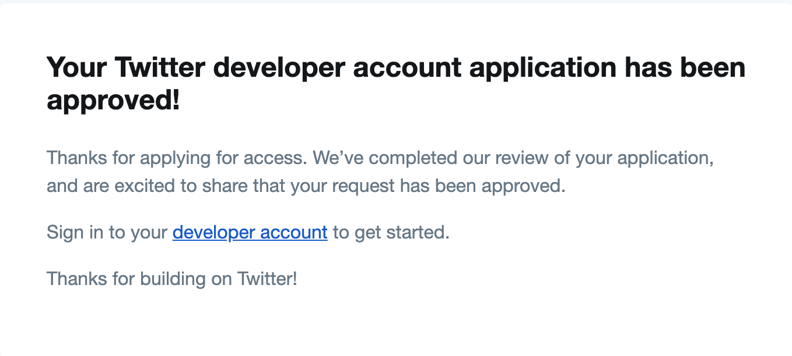

  Maybe I will do a write up on what I did differently.

  Now that a have a developer account, I looked around on the Twitter Dev website.

  ## Looping With A Promise Value
  When you have a loop and that you want to stop running when a certain condition is met but that condition is based on a promise return value you can use async await.

  [Async/await](https://javascript.info/async-await)

  ```javascript
  function userLoggedIn(request, payload){
      async function compareHashes(hashes){
          for (i=0; i<hashes.length; i++){
              const matchFound = await compareHash(payload.token, hashes[i].token)
              if (matchFound){
                  i = hashes.length;
                  return true;
              } else if (i==hashes.length-1){
                  return false;
              }
          }
      }
      return new Promise((resolve, reject)=>{
          database.findValues('sessions', 'token', `username='${payload.username}' AND useragent = '${request.headers['user-agent']}'`)
          .then(results=>{
              if(results.success){
              return compareHashes(results.results)
              }
          })
          .then(matchFound=>resolve(matchFound))
      })
  }
  ```
  I didn't use a while loop. I used a for loop. I need my loop to stop when the iterations reach a certain number or when a token match is found, whichever comes first. So my needs are in between a while and a for loop. You could probably use either.

  ## Changing A Commit Message in Git
  I accidentally committed and then pushed the wrong git commit message. I used the amend flag to change the commit:
  ```bash
  git commit --amend -m "new commit message"
  ```
  Then I pushed to Github with the `--force` flag.
  ```bash
  git push origin master --force
  ```

  More on amend: [Git Basics: Adding more changes to your last commit](https://medium.com/@igor_marques/git-basics-adding-more-changes-to-your-last-commit-1629344cb9a8)

  ## `userLoggedIn`
  I finished user logged in:

  [Link To Work](https://github.com/DashBarkHuss/crud_login_node_app/commit/7b0a0fcac1aa822750bd69f19746238ab31ac127)

  ## Where I Left Off
  I finished `userloggedIn`. I need to test  make sure `action_user_login` works in instances where the user isn't logged in.


## Day 42, R3
### 8/30/19

- ## Node
  I'm making a vanilla Node.js app with CRUD and sessions.

  ### Where I Left Off:
  Yesterday I had a stomach ache and fever so I had a hard time concentrating. I didn't get a lot done on the app, but I started watching some videos on React and Express. Today, I'll continue working on the login endpoint.

  ## `userLoggedIn`
  I created a function that checks if the user is logged in. It's not totally finished. I think it only works if the user is logged in right now. I committed it because I wanted to explore how to make the code more efficient.

  [Link To Work](https://github.com/DashBarkHuss/crud_login_node_app/commit/7f721328c304862b81ec20a3a55687b1f04fae61)

  ## Loops and Promises
  In `userLoggedIn`, I use a for loop to see if any of the session tokens in the database for the user in match the payload token. This seems inefficient. If any of the tokens match, the for loop still continues. Even if I used do while, I don't think it would work because the function in the for loop that checks if the tokens match is asynchronously itself. I skimmed [JavaScript async and await in loops](https://zellwk.com/blog/async-await-in-loops/), I'm not sure if this has the answer.

  I'm noticing there's a lot wrong with this function but I'm paisting it just to show where the for loop is.
  ```javascript
  function userLoggedIn(request, payload){
    //promise that returns boolean
    return new Promise((resolve, reject)=>{
        if (!payload.token) throw false;
        database.findValues('sessions', 'token', `username='${payload.username}' AND useragent = '${request.headers['user-agent']}'`)
        .then(results=>{
            if (!results.success) throw false;
            return new Promise((res,rej)=>{
                for(i=0; i<results.results.length; i++){
                    compareHash(payload.token, results.results[i].token)
                    .then(isMatch=>{
                        console.log(isMatch, 129);
                        if (isMatch) res(true); //or resolve
                    })
                }
            })
        })	        
    })
    .then(loggedIn=>console.log({loggedIn, line: ".then 135"}))
    .catch(loggedIn => {console.log({loggedIn, line: "catch"})})
  }
  ```

  ## Twitter API
  Yesterday, I reapplied to the Twitter API key. Last time I was rejected. I'm applying again on a different account, because you can't reapply on an account that was once rejected. So I created a new account. I'm also applying with a different project. Today, I got an email, asking for more information. So I spent sometime replying to that email.

  ## Where I Left Off:
  I'm working on looping with promises in `userLoggedIn`.


## Day 41, R3
### 8/29/19

- ## Node
  I'm making a vanilla Node.js app with CRUD and sessions.
  
  ### Where I Left Off:
  Yesterday, I added a function that creates a session, one that gets a session, and I started to create a login endpoint. I did some refactoring too. I'll continue working on the login endpoint.

  ## Login
  I started to work more on logging in. I decided to take a break and explore express and react. My stomach hurts and I have a slight fever which is making it hard to concentrate.

  ## Express
  I watched [Node.js + Express - Tutorial - What is Express? And why should we use it?](https://www.youtube.com/watch?v=45dAt9Gz8rE).

  I watched some of [Express JS Crash Course](https://www.youtube.com/watch?v=L72fhGm1tfE)

  The teacher said, "It's a dev dependency because it's only for development", which made me realize I haven't been saving dev dependencies the right way.

  The teacher recommended **nodemon** which allows you to not have to reset the server every time you make a change.

  He showed how to save commands in the scripts section of `package.json`:


  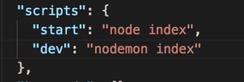

  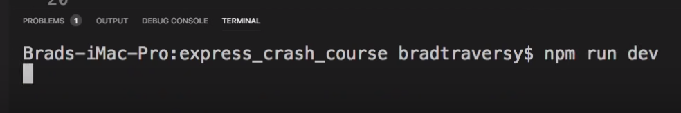

  He also recommended Postman. You can use Postman to test different request instead of using `node_fetch`

  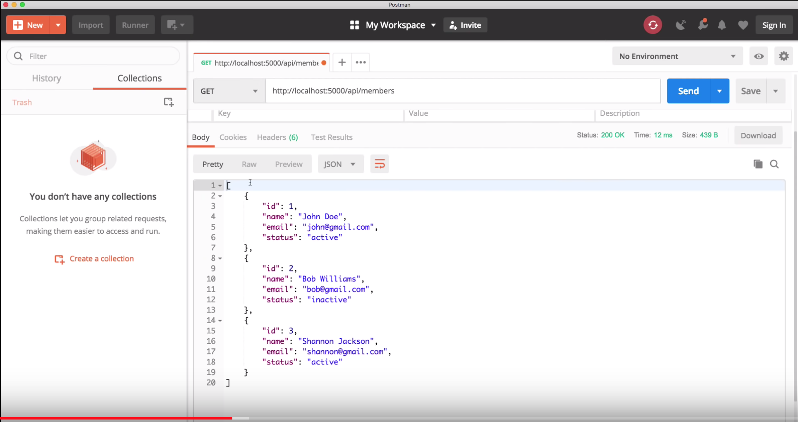

  I watched a little bit of [React JS Crash Course - 2019](https://www.youtube.com/watch?v=sBws8MSXN7A)

## Day 40, R3
### 8/28/19

- ## Node
  I'm making a vanilla Node.js app with CRUD and sessions.

  ### Where I Left Off
  I'm rewriting my helper functions for the database so they can be used more generally. 

  ## Inconsistent Database Methods
  I made a bunch of database methods but they're confusing to use. They're not consistent. Some return the actual results from the database. Some resolve or reject with a message that the code passed to the method. Some return an object generated by the method. 

  This makes using the methods confusing.

  Someone told me if you don't use a framework you end up making one. That's what's happening, and I'm making a bad one.

  But this is helping me think about how to better unify methods. If they're more similar, I don't have to go back and try to remember how to implement each one.

  Naming these functions also makes a difference, too.
  
  `database.existsIn(table, condition, resolveContent, content)` checks if a record that matches `condition` exists. But instead of returning true or false as the name implies, the method resolves or rejects the `content` argument depending on whether `resolveContent` was set to true or false. 
  
  That's pretty confusing. A better name would be `resolveOrRejectContentIfValueExistsInFieldOfTable`. Which is really long. But we probably just need to change `existsIn` to return true or false.

  ## Where I Left Off:
  I added a function that creates a session, one that gets a session, and I started to create a login endpoint. I did some refactoring too. I'll continue working on the login end point.

  [Link To Work](https://github.com/DashBarkHuss/crud_login_node_app/commit/3dadfd3a3aa5d17c2f677d64e2196a6004e5e298)


## Day 39, R3
### 8/27/19

- ## Node
  I'm making a vanilla Node.js app with CRUD and sessions.


  ### Where I Left Off
  I found a few ways to get a child module to access a variable from the main module. I didn't do much with my app but I did a lot of sandbox learning by playing with node in the debugger. Today, I'll try to get back to the app.

  ## Changing identify()
  api.js `require`s helpers.js. But I also need helpers.js to `require` api.js so it has access to `API.parts` which `helpers.identify` uses. 

  This circular requiring is causing issues. I haven't figured out when exactly to export the api module so that it doesn't export an empty object.
  
  I could just rewrite `identify` so that you pass `API.parts` as an argument. I didn't think this was as clean, but now I'm thinking it will be cleaner code than what I'm doing now.

  I decided  to go with changing `identify` so that the last argument is `Api.parts`.

  ```javascript
  // line 40, helpers.js
  helpers.identify= function(){ 
          const arr = [];
          for (i = 0; i<arguments.length-1; i++){arr.push(arguments[i])};
          const parts = arguments[arguments.length-1];
          return JSON.stringify(arr) == JSON.stringify(parts.slice(1, 3));
  }

  // line 103, api.js
  if(identify('user', 'register', API.parts)){
      ...
  ```

  [Link To Work](https://github.com/DashBarkHuss/crud_login_node_app/commit/a64ce9128162d23ad0554a4123ac62e742bd6bb6)

  ## database.js Mess
  I had made all these database helper functions but I need to rewrite them so they can be used more generally. That's causing issues. This is where I left off.

## Day 38, R3
### 8/26/19

- ## Node
  I'm making a vanilla Node.js app with CRUD and sessions.

  ### Where I Left Off
  I left off working on a helper function. It's being `require`d by `api.js`. But it cannot access a global variable of `api.js` anymore since it's in another file. I'm trying to figure out a way to access global variables of the main javascript file from required functions. I thought I could use a closure but that didn't work or I didn't do it the right way. I'm going to try to get it to work.

  ## Defining Terms
  I want to form the right question to the above problem. But I don't know the terms I need to form the question. Here are my meta-questions:
  1. What do you call the main script that gets executed by node? Executed module?
     - After some research I found that it's the **main module**, **current module**, or **module**. You can find the module like so:
          ```bash
          process.mainModule.filename
          "/some/path/to/a/file.js"

          module.filename
          "/some/path/to/a/file.js"
          ```
  2. What do you call the required scripts of that executed script? I supposed it could be modules? Required modules? 
     - After some research I found that these are called **dependencies**, **modules**, or **children**. You can find the first child like so:
        ```bash
        process.mainModule.children[0].filename
        "/some/path/to/a/file.js"

        module.children[0]
        "/some/path/to/a/file.js"
        ```

  ## Somethings I Read/Skimmed:

  [Cycles](https://nodejs.org/api/modules.html#modules_cycles)

  [Circular dependencies in node.js](https://coderwall.com/p/myzvmg/circular-dependencies-in-node-js)

  [In what scope are module variables stored in node.js?](https://stackoverflow.com/questions/15406062/in-what-scope-are-module-variables-stored-in-node-js)

  [What is the 'global' object in NodeJS](https://stackoverflow.com/questions/43627622/what-is-the-global-object-in-nodejs)

  ## See If A Variable Is In Scope

  You can check to see if a variable has been declared by:
  ```javascript
  typeof someVariable
  // returns "undefined" if not in scope 
  ```
  [JavaScript: Null vs Undefined vs Undeclared](https://techbrij.com/javascript-null-undefined-undeclared)

  ## Giving Variable Access To a Dependency

  Dependencies can access global variables, which in node are variables declared without `var`, `let`, or `const` or declared on the global object (*ex: `global.newVar = "value";`*). But child modules can't access variables of the main modules scope declared with `var`, `let`, or `const`.

  ```javascript
  //main.js
  const moduleFunction = require('./childModule');

  globalVar = "global variable";
  var varVar = "var variable";

  console.log(moduleFunction("some argument"))
  // returns Array(3) ["some argument", "globalVar is string", "varVar is undefined"]
  ```
  ```javascript
  //childModule.js
  const moduleFunction = function(){

    return [...arguments, `globalVar is ${typeof globalVar}`, `varVar is ${typeof varVar}`]

  };

  module.exports = moduleFunction;
  ```

  ## But Actually Don't Use Global Variables
  I'm not sure why.
  >Most people advise against using global variables. If you want the same logger class in different modules you can do this
  >```javascript
  >//logger.js:
  >
  >module.exports = new logger(customConfig); 
  >
  >//foobar.js:
  >
  >var logger = require('./logger');
  >logger('barfoo');
  >```

  -*[How to use global variable in node.js?](https://stackoverflow.com/questions/10987444/how-to-use-global-variable-in-node-js)*

  ## Exporting Variables From Main Module to Child Module
  If you have a child module like this that requires the main module:
  ```javascript
  //childModule.js
  const globalVar = require('./main')

  const moduleFunction = function(){
      return `globalVar: ${globalVar}`
  };

  module.exports = moduleFunction;
  ```

  You can export a variable from the main module to the child. But it can't be exported after the child is `require`d. This imports an empty object:
  ```javascript
  //main.js
  var globalVar = "global variable";
  const moduleFunction = require('./childModule');
  module.exports = globalVar; //export AFTER requiring childModule

  console.log(moduleFunction()) //globalVar: [object Object]
  ```
  It must be exported before:
  ```javascript
  //main.js
  var globalVar = "global variable";
  module.exports = globalVar; //export BEFORE requiring childModule
  const moduleFunction = require('./childModule');

  console.log(moduleFunction()) //globalVar: "global variable"
  ```

  ## Where I Left Off
  I found a few ways to get a child module to access a variable from the main module. I didn't do much with my app but I did a lot of sandbox learning by playing with node in the debugger. Tomorrow, I'll try to get back to the app.


## Day 37, R3
### 8/25/19

- ## Node
  I'm making a vanilla Node.js app with CRUD and sessions.

  ## Where I Left Off
  I spent the day yesterday trying to understand promises instead of working on my app. Today, I'll really finish that verify endpoint!

  ## module.exports All The Things!
  I'm refactoring my code and put my helpers into one file. I wanted to module.export all the functions so I followed this tutorial: [module.exports All The Things!](https://vancelucas.com/blog/module-exports-all-the-things/).

  >The way I have come up with to solve this in my own code is to create a single empty object literal at the top of the file named ns (for namespace). I then create functions on the ns object as I go, and export all the properties on the ns object at the end of the file.

  ```javascript
  var ns = {};
  // ...
  // Platform detection helpers
  var osname = Ti.Platform.osname;
  ns.isiPhone = function() {   return ('iphone' == osname); };
  ns.isiPad = function() {   return ('ipad' == osname); };
  ns.isiOS = function() {   return (ns.isiPhone() || ns.isiPad() || 'ios' == osname); };
  ns.isAndroid = function() {   return ('android' == osname); };
  // ...

  // Export all the things! *\('o')|
  for(prop in ns) {
     if(ns.hasOwnProperty(prop)) {
       module.exports[prop] = ns[prop];
     }
  }
  ```

  ## Arrow Functions: No Arguments Object
  >**Arguments object**
  >
  >Arrow functions don’t have the local variable arguments as do other functions. The arguments object is an array-like object that allows developers to dynamically discover and access a function’s arguments. This is helpful because JavaScript functions can take an unlimited number of arguments. Arrow functions do not have this object.
  
  *-[sitepoint.com](https://www.sitepoint.com/es6-arrow-functions-new-fat-concise-syntax-javascript/)*

  ## Where I Left Off
  I left off working on a helper function. It's being `require`d by `api.js`. But it cannot access a global variable of `api.js` anymore since it's in another file. I'm trying to figure out a way to access global variables of the main javascript file from required functions. I thought I could use a closure but that didn't work or I didn't do it the right way. I did finish the verify endpoint though!

  [Link To Work](https://github.com/DashBarkHuss/crud_login_node_app/commit/506758e036bd7122c122462a500364cb66325a51)


## Day 36, R3
### 8/24/19

- ## Node
  I'm making a vanilla Node.js app with CRUD and sessions.

  ## Where I Left Off

  I need to get my verify endpoint working but the promises are all messed up. That's where I left off. I'll continue here.

  ## Undefined Variable in Promise
  I was having a bunch of issues with a new Promise statement. It turns out there was an undefined variable in the promise. Normally, node would give me a reference error if I had an undefined variable. But because the variable was in a promise, it didn't behave the same. It was evading my capture! The code in the promise would stop with no error, but the rest of the code would go on. 

  So, after all that there may have been nothing else wrong with my promise chain. 

  ## Resolve and Reject Switched
  I ended up having another issue: resolve and reject were switched in the parameters:
  ```javascript
  //wrong way:
  return new Promise((reject, resolve)=>{
      
  //right way:    
  return new Promise((resolve, reject)=>{
  ```

  ## Throw, Reject, Resolve

  I made this script to see the difference between throw, reject, and resolve.

  ```javascript
  const timeOut = (x)=>{
      return new Promise((res, rej)=>{
          setTimeout(function(){ 
              res(x); 
          }, 0);
      })
  }

  function prom(x){
      return new Promise((resolve, reject)=>{        
          timeOut(x)
          .then(x =>{
              console.log(".then #1 arg:", x);
              if(x=="throw") throw(x)
              if(x=="reject") reject(x)
              if(x=="resolve") resolve(x)
          })
          .then(x=>{
              console.log(".then #2 arg:", x);
              resolve("2nd resolve");
              reject("2nd reject");
              return x
          })
          .then(x => {
              console.log(".then #3 arg:", x);
          })
          .catch(error=>{
              console.log("catch");
              console.log(error);
              reject("catch error: " + error)
          });
      });
  }
  ```

  I called prom with `"throw"`, `"reject"`, and `"resolve"` like this:
  ```javascript
  prom("resolve").then(x=>console.log("final resolved:", x))
  .catch(rejected=>console.log("final rejected: ", rejected))
  ```

  ### **Console Logs:**
  In every situation, the second reject and resolve calls- `reject("2nd reject")` and `resolve("2nd resolve")`- were ignored.

  ### **Resolve** 
  **Resolve** executed the `.then()` chain inside `prom()` but didn't pass them any promise values. It sent the promise value back to the `prom("resolve")` call and executed it's `.then()`s:
  
  ```
  test.js:50 .then #1 arg: resolve
  test.js:71 final resolved: resolve
  test.js:56 .then #2 arg: undefined
  test.js:62 .then #3 arg: undefined
  ```
  ### **Reject** 
  **Reject** also executed the `.then()` chain inside `prom()` and didn't pass them any promise values. The final `.catch()`, on the promise chain of where we called `prom("resolve")`, was executed but the `.then()`s were skipped:

  ```
  test.js:50 .then #1 arg: reject
  test.js:56 .then #2 arg: undefined
  test.js:72 final rejected:  reject
  test.js:62 .then #3 arg: undefined
  ```
  ### **Throw** 
  **Throw** skipped all the `.then()` calls inside `prom()` and executed `.catch` inside `prom()`. Because we call `reject()` in that first `.catch()` body, the program also executes the final `.catch` at the end of the `prom("throw")` call:

  ```
  test.js:50 .then #1 arg: throw
  test.js:65 catch
  test.js:66 throw
  test.js:72 final rejected:  catch error: throw
  ```

  My conclusion: **Throw** means skip the rest of the `.then()` executions, execute `.catch()`. **Reject** means continue calling the next `.then()`s in the chain but without a promise value. Send this promise value back and skip the `.then()`s on that chain. Instead execute the final `.catch()`. **Resolve** means continue calling the next `.then()`s in the chain but without a promise value. Send back the value and execute the remaining `.then()`s on that promise chain.

  ## Where I Left Off
  I spent the day again trying to understand promises instead of working on my app. Tomorrow, I'll really finish that verify endpoint!

## Day 35, R3
### 8/23/19

- ## Node
  I'm making a vanilla Node.js app with CRUD and sessions.

  ## Where I Left Off
  I did a lot of debugging and testing yesterday. It took me a while to understand what value `bcrypt.compare()` was returning and how to use it in a promise. Tomorrow, I'll use it in the verify endpoint.

  ## Promises
  I was having trouble using promises when I needed to get values from two asynchronous functions. I took some time to play with promises in the browser using setTimeout() to practice. 


  ```javascript
  const timeOut = ()=>{
    return new Promise((resolve, reject)=>{
        setTimeout(function(){ 
            resolve("first"); }, 0);
    }) // promise with PromiseValue = "first"
    .then(x=>{
           return new Promise((res, rej)=>{
            setTimeout(function(){ 
                res(`second, ${x}`); }, 0);
            })
    })  // promise with PromiseValue = "second, first"
    .then(x=>{return(`third, ${x}`)}) //promise with PromiseValue = "third, second, first"
  }
    
  timeOut() //promise with PromiseValue: "third, second, first"
  .then(x=>console.log(x)) // logs "third, second, first"
  ```
  I haven't figured out exactly what I was doing wrong before. I need to get my verify endpoint working but the promises are all messed up. That's where I left off. I'll continue here tomorrow


## Day 34, R3
### 8/22/19

- ## Node
  I'm making a vanilla Node.js app with CRUD and sessions.

  ## Where I Left Off
  Yesterday, I continued action user verify. I added a database method that returns a value from the database. Today, I'll continue to work on the verify endpoint.

  ## Bcrypt Compare Return Promise?
  I was really confused about bcrypt.compare(). In the information when you hover over it, it says it returns a promise. At least that's what I thought it was saying:

  

  But when I called .then() on compare it didn't work:

  ```javascript
  bcrypt.compare(token, hashedToken, (err, isMatch)=>{
      if (err){
          return(cb(err));
      }
      return (isMatch);
  }).then(x=>console.log(x)); //TypeError: Cannot read property 'then' of undefined
  ```

  I think what compare is actually doing is returning a promise that, once resolved, gets passed in the callback as the second parameter, `isMatch`. So compare doesn't actually return a promise, it returns a resolved promise value to the callback.

  This threw me off for a while.

  If I want to use it as a promise I have to do it like this :
  ```javascript
  const someToken = process.env.TOKEN;
  const someHash = process.env.HASH;

  new Promise((resolve, reject)=>{
      bcrypt.compare(someToken, someHash, (err, isMatch)=>{
          if (err) reject(err);
          console.log(isMatch);
          if (isMatch) resolve({isMatch});
      })
  }).then(x=>console.log(x))
  ```

  ## Testing
  I created a `bin/test.js` file where I require different functions and test them.

  ## `.env` Bug
  I ended a line with a variable in `.env` with "`;`" and that's wrong. 

  `SOMEVAR = 'something';`
  
  You don't end lines with a semi colon in a `.env` file. It will make your variable include the semicolon.

  ## Where I Left Off
  I did a lot of debugging and testing today. It took me a while to understand what value `bcrypt.compare()` was returning and how to use it in a promise. Tomorrow, I'll use it in the verify endpoint.
  
  [Link To Work](https://github.com/DashBarkHuss/crud_login_node_app/commit/3cb8c5914f79831f26cb34d4295bc51d1b3446fd)

-  ## Thoughts And Feelings:
   Today I coded for a longer time. But I was also distracted for part of the time because I got some serious news and I'm shaken up. Hoping for the best and going to try to stay focused on coding and be there for my family.

## Day 33, R3
### 8/21/19

- ## Node
  I'm making a vanilla Node.js app with CRUD and sessions.

  ## Where I Left Off:
  I got bcrypt to recognize when a password matches a hashed password but I didn't put that function in the verify endpoint yet. That's what I'll do today.

  ## Debugging 
  Yesterday, I posted on twitter for help with debugging node. A lot of different tools were recommended: [Quokka](https://quokkajs.com/docs/index.html), [ndb](https://github.com/GoogleChromeLabs/ndb), and even the VSC debbuger. I tried them all. 
  
  It turns out VSC's debugger works for what I wanted, but I didn't know you had to pause the script to be able to call a function. In DevTools on the client side you don't have to pause a script unless the function is not in scope. I think scope works different in Node, so that's why I have to pause it.

  Quokka is interesting too. It works a bit differently. But the free version isn't helpful to me and I'm not sure if I want the paid version.

  ## Refactored handleContent

  [Link To Work](https://github.com/DashBarkHuss/crud_login_node_app/commit/d650708888f1c1ac7cc520f0ab8f2383e3686b0c)

  ## Debugger Error
  I was getting this error when I tried to use the debugger in VSC:

  ```bash
  Error: connect ECONNREFUSED 127.0.0.1:3306
  ```

  It went away when I changed http.createServer to listen to port to 3306. I tried to figure out how to control what port the debugger uses but I couldn't find how.

  ## Where I Left Off
  I continued action user verify. I added a database method that returns a value from the database. Tomorrow, I'll continue to work on the verify endpoint.

  [Link To Work](https://github.com/DashBarkHuss/crud_login_node_app/commit/e70218f7463b7f34b964dd3d1a10f12691df3ec0)


## Day 32, R3
### 8/20/19

- ## Node
  I'm making a vanilla Node.js app with CRUD and sessions.

  ## Where I Left Off:
  Bcrypt isn't working as expected. For some reason it hashes the same token differently each time. I wonder if this has to do with the 'salt' which I didn't look into so much. I'll look more into bcrypt.

  ## Bcrypt `compare()`
  I found out that bcrypt isn't like md5. In Md5 in order to compare a password with a hashed password you'd do something like `md5(password) == hashedPassword`. Hashing a given password with `md5()` will always give the same output. But this isn't true with bcrypt. 

  If I hash a password with bcrypt, and then hash the same password again, I will get two different hashes. So, in bcrypt we use a different function to hash a password than to compare the password to its hashed version.

  The video [Compare Hash Password W/ Node.js & BCrypt](https://www.youtube.com/watch?v=Yc2VKb4_jdY) shows how to do this using the compare method.

  ```javascript
   function compareHash(token, hashedToken, cb){
      return new Promise((reject, resolve)=>{
          bcrypt.compare(token, hashedToken, (err, isMatch)=>{
              if (err){
                  reject(cb(err));
              }
              resolve(cb(null, isMatch));
          });
      });
  };
  ```

  ## Throw vs Reject

  > Any time you are inside of a promise callback, you can use throw. However, if you're in any other asynchronous callback, you must use reject.

  -*[JavaScript Promises - reject vs. throw](https://stackoverflow.com/questions/33445415/javascript-promises-reject-vs-throw)*

  I want to play around in with throw and reject to see the difference.

  ## Return vs. Resolve

  >The rule is, if the function that is in the then handler returns a value, the promise resolves/rejects with that value, and if the function returns a promise, what happens is, the next then clause will be the then clause of the promise the function returned, 

  -*[What's the difference between returning value or Promise.resolve from then()](https://stackoverflow.com/questions/27715275/whats-the-difference-between-returning-value-or-promise-resolve-from-then)*

  ## Debugging
  I'm trying to figure out what type of object bcrypt.compare returns and if it's asynchronous.

  On the browser, I'd just use the console to look into this. But how do I do it with node.js? 

  Using just console.log statements and test functions is ok. But there must be a better way.

  If I have a function `hi()` that's in a javascript file available to the client, I can test that in DevTools right in the console:

  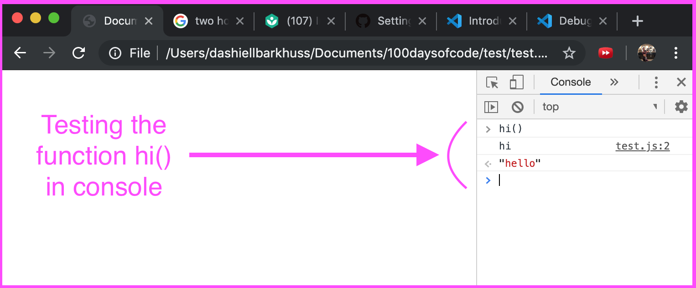

  Is there a way to do this with vsc and node.js? Can I run a function in a node.js project directly from some console?

  Someone recommended I try I [Quokka](https://quokkajs.com/docs/index.html).

  ## Where I Left Off:
  I got bcrypt to recognize when a password matches a hashed password but I didn't put that function in the verify endpoint yet. That's what I'll do tomorrow.

  [Link To Work](https://github.com/DashBarkHuss/crud_login_node_app/commit/bdd36e71fcab50af943405b0b6464af7be4f4307)

## Day 31, R3
### 8/19/19

- ## Node
  I'm making a vanilla Node.js app with CRUD and sessions.

  I left off working on the verification URL. That's where I'll continue. My code is getting cumbersome. I need to refactor it.

  ## Where I Left Off
  Not a lot of note taking today. 
  
  I did a lot of refactoring and drying my code today. 
  
  I got the verification URL working, sort of. The only thing is bcrypt isn't working as expected. For some reason it hashes the same token differently each time. I wonder if this has to do with the 'salt' which I didn't look into so much. I'll look more into bcrypt tomorrow.

  [Link To Work](https://github.com/DashBarkHuss/crud_login_node_app/commit/2a156a542d7f2a1587bf88272001f1a90b40d656)

- ## Thoughts and Feelings: 
  I took a longer break today. This helped me code longer in total. I normally code 2 hours. Today, I felt like I could keep going. So I did. It may have also helped that I took less log notes. Maybe notes are tiring.

## Day 30, R3
### 8/18/19

- ## Node
  I'm making a vanilla Node.js app with CRUD and sessions.

  Yesterday, I wanted to figure out how to handle the data from two separate promises and put them together. I thought I didn't figure it out. But it works now. So maybe I hadn't refreshed it.

  ## Returning Two Promises

  ```javascript
  function prom1(){
    return new Promise ((res, rej)=> {
      setTimeout(
        ()=>res("first value"), 1000
      )
    })
  }

  function prom2(){
    return new Promise ((res, rej)=> {
      setTimeout(
        ()=>res("second value"), 1000
      )
    })
  }

  prom1().then(content1=>{
    return prom2().then(content2=> { return {firstVal: content1, secondVal: content2}});
  })
  .then(c=>console.log("c:",c))
  //> c: {firstVal: "first value", secondVal: "second value"}
  ```

  ## Email Error
  I kept getting an error when trying to send an email using the `Nodemailer` module:

  ```bash
  Error: Missing credentials for "PLAIN"
  ```

  This was because in `createTransport` I had
  
   `password: process.env.GMAILPW` 
   
   instead of 
   
   `pass: process.env.GMAILPW`. 
   
   Here it's fixed:

  ```javascript
  const transporter = nodemailer.createTransport({
    service: 'gmail',
    auth: {
        user: process.env.GMAIL,
        pass: process.env.GMAILPW
    }
  })
  ```
## Git Issues
I'm wondering how people track issues that need to be addressed in their projects. I though you could track issues with git because I see issues posted on github repos.

I looks like [git isn't meant to track issues](https://stackoverflow.com/questions/7060973/keeping-track-of-to-do-and-issues-in-git) but you can use github to track issues: [About issues](https://help.github.com/en/articles/about-issues).

But maybe I just need to make a to do list.

## Where I Left Off
My register endpoint registers and sends a verification email. I left off working on the verification URL. That's where I'll continue tomorrow. My code is getting cumbersome. I need to refactor it.

[Link To Work](https://github.com/DashBarkHuss/crud_login_node_app/commit/581f4ee3c022ca354aa4f8e023f65310fb2050bb)


## Day 29, R3
### 8/17/19

- ## Node
  I'm making a vanilla Node.js app with CRUD and sessions.

  Yesterday, I added bcrypt to my project. Today, I'll test it some more and push my progress. Then I'll continue with the next api endpoint.

  ## Bcrypt
  I got `bcrypt` working. It's more complicated to use than `md5` but more secure and slower. Maybe I'll use `bcrypt` for passwords and for session tokens I can use a faster hashing algorithm like `sha`. I wonder if it's ok to use `md5` for sessions?

  [Link To Work](https://github.com/DashBarkHuss/crud_login_node_app/commit/cdff6894b7640781177c38b14d5c5b6076a384ab)

  I tried to use `sha512` but I didn't find a lot of info on it. For now I'll use bcrypt for sessions too.

  ## Playing With Promises
  I played around with promises in the browser using `setTimeout()` to get a better feel for how they work. 
  
  I want to figure out how to handle the data from two separate promises and put them together. I didn't quite figure it out yet. I think it involves some nesting. I'll continue here tomorrow.

  ```javascript
  // how do we get two values from asynchronous functions and put them into one object?
  // {firstval: "first value", secondval: "second value"}

  function prom1(){
    return new Promise ((res, rej)=> {
      setTimeout(
        ()=>res("first value"), 1000
      )
    })
  }

  function prom2(){
    return new Promise ((res, rej)=> {
      setTimeout(
        ()=>res("second value"), 1000
      )
    })
  }

  // Not working yet
  prom1().then(content1=>{
    return prom2().then(content2=> { return {firstVal: content1, secondVal: content2}});
  })
  .then(c=>console.log("c:",c))
  ```

## Day 28, R3
### 8/16/19

- ## Node
  I'm making a vanilla Node.js app with CRUD and sessions.
  
  Today, I'll continue working on my new branch that handles the returned promise from `database.existsIn`.

  ## `database.existsIn` Return Promise
  Now `database.existsIn` returns a promise. 

  [Link To Work]([`database.existsIn`](https://github.com/DashBarkHuss/crud_login_node_app/commit/3fa9b4f307af3b3b404eaf738fc1f042d034eff5))

  I still feel it could be more DRY.

  ## Branch and Merge
  I reviewed merging and merged my branch.

  [3.2 Git Branching - Basic Branching and Merging](https://git-scm.com/book/en/v2/Git-Branching-Basic-Branching-and-Merging)

  ## `database.insertIn`
  I added a method for database that inserts records called `database.insertIn()`:

  [Link To Work](https://github.com/DashBarkHuss/crud_login_node_app/commit/867e76f9bcfa7aa4860a74cd32173b325cf6fee6)

  ## Bcrypt
  I watched [How To Hash A Password W/ BCrypt](https://www.youtube.com/watch?v=lWDws1j8fo4).

  I didn't know what a salt was so I looked it up: [Salt (cryptography)](https://en.wikipedia.org/wiki/Salt_(cryptography)). I don't fully understand it, but it seems salts provide an extra layer of protection.

  ## Where I left off
  I added bcrypt to my project. Tomorrow, I'll test it some more and push my progress. Then I'll continue with the next api end point.

## Day 27, R3
### 8/15/19

- ## Node
  I'm making a vanilla Node.js app with CRUD and sessions.

  Yesterday, I started to create a database method that searches the database and returns `true` or `false` if the record exists. It's not working. I'll continue here

  ## Database Method Working
  My database method wasn't working because I didn't understand that .query() in MySQL is asynchronous. I thought I could just return a value from it

  ```javascript
  static existsIn(table, clause){
    const q = `select * from ${table} where ${clause};`
    this.connection.query(q, (err, results)=>{
        if (err) console.log(err);
        return results.length !== 0;
    });
  };
  ```

  This doesn't work. But I can resolve the promise from here:

  ```javascript
  static existsIn(table, clause, resolve, content){
      const q = `select * from ${table} where ${clause};`
      this.connection.query(q, (err, results)=>{
          if (err) console.log(err);
          if (results.length !== 0) resolve(content);
      })
  };
  ```
  This function made my code so much cleaner:

  [Link To Work](https://github.com/DashBarkHuss/crud_login_node_app/commit/3fa9b4f307af3b3b404eaf738fc1f042d034eff5)

  ## Resolve Overwriting
  I'm noticing that if I have multiple places where my promise can resolve it will resolve wherever it reaches the resolution first, it seems. But since I have places where the resolution is in an asynchronous function this confuses me. How do I make sure it reaches the right resolution first?

  ## Where I Left Off
  I worked  a lot on making the register API function DRY and readable. 
  
  I played around with promises. 
  
  I created a new branch to try out a different way of dealing with `database.existsIn()`. This other way returns a promise so you can handle the content within the api function. 
  
  I played with seeing where the code flows if you resolve it at different points. It seems so keep going on to the next `.then()` even if you resolve it. But it won't resolve again. I think if you throw an error it won't go on to the next `.then()`. That made me wonder if I should be throwing an error instead of resolving.
  
   Tomorrow, I'll continue working on my new branch that handles the returned promise from `database.existsIn`.


## Day 26, R3
### 8/14/19

- ## Node
  I'm making a vanilla Node.js app with CRUD and sessions.

  Last time I started making the API endpoint for registering a user. I'll continue here.

  ## Storing Session Key Incorrectly?

  I'm reading ['Re-Hashed: The Difference Between SHA-1, SHA-2 and SHA-256 Hash Algorithms'](https://www.thesslstore.com/blog/difference-sha-1-sha-2-sha-256-hash-algorithms/) and this made me think I'm storing session keys incorrectly:

  > the client generates a session key, then encrypts a copy of it and sends it to the server where it can be decrypted and used for communicating throughout the duration of the connection 

  I created the session key on the backend and just sent back the session key. Oh wait I know what I did. I created the session key by hashing a time stamp in the backend. So maybe I should have sent back the time stamp instead of the session key.

  I watched videos 3.1-3.6 of [Advanced Express](https://www.lynda.com/Node-js-tutorials/Advanced-Express/798496-2.html) to try to see if the token stored on the client side is different from what's stored on the database but I couldn't find anything.

  I read '[Should I also hash my session id before storing it in the database? [duplicate]](https://security.stackexchange.com/questions/138389/should-i-also-hash-my-session-id-before-storing-it-in-the-database)'. It brought up an unrelated point, that matching sessions to an ip might cause issues if the user is mobile. That can change the IP address, for example switching to a different wifi (I think). 
  
  I read [How to secure store sessions values in webapps?](https://security.stackexchange.com/questions/136122/how-to-secure-store-sessions-values-in-webapps) and this said you ***do*** want to hash the token and send the un-hashed token back to the browser. 
  
  This makes sense because if the database were accessed by a hacker and the tokens weren't hashed they could just use the tokens in the database to authenticate actions. Well, but why would that matter since if they have access to the database they can just change the database directly? Maybe there's some instances where a hacker can get the database info but can't change it.

  I found this [Session Management Cheat Sheet](https://github.com/OWASP/CheatSheetSeries/blob/master/cheatsheets/Session_Management_Cheat_Sheet.md) for best practices.

  ## Hashing Algorithm
  I couldn't find a straight answer on which hashing algorithm to use. So I posted to twitter. So we'll see what they say. I'll keep using md5 until I find something better. I know it's not supposed to be good but I'm not making anything real right now so it's ok.

  ## Where I left off
  I worked more on the api register endpoint. 
  
  I started to create a database method that searches the database and returns `true` or `false` if the record exists. It's not working. 

## Day 25, R3
### 8/13/19
- ## Arduino
  Today, I took a break from Node to work on a top secret arduino project that's 7 years in the making!

  Since it's top secret I don't have much to post. I'm taking notes else where. To the curious cats out there, don't worry: I will make my project public soon.

  A requirement of this project is a Twitter API key. It's been months and Twitter hasn't gotten back to me on the status of my API key application. Maybe I should contact twitter in some other ways?

  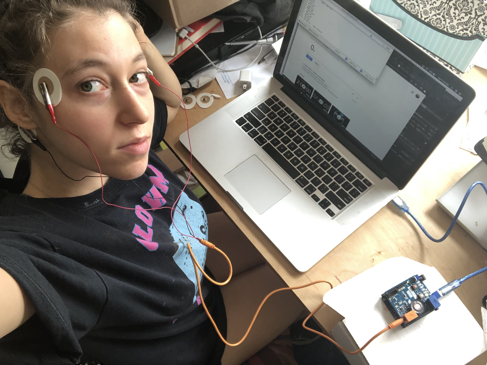

## Day 24, R3
### 8/12/19
- ## Node
  I'm making a vanilla Node.js app with CRUD and sessions.

  Today, I'll work on connecting the database and handling API requests.
  
  ## Database
  I linked the app to the database:

  [Link To Work](https://github.com/DashBarkHuss/crud_login_node_app/commit/28a3df025ff366d3b5d3604c84b3a287bcd364c3)

  ## `catchAPIrequest`
  I  made the `catchAPIrequest` function that determines if the request url is an API request.

  [Link To Work](https://github.com/DashBarkHuss/crud_login_node_app/commit/781aca305804f7cccdbae3f73765207cb1dfe48d)

  ## Identify
  I made an identify function that identifies any amount of api parts using the arguments object:

  ```javascript
  //api.js line 16
  function identify(){
      const arr = [];
      for (i = 0; i<arguments.length; i++){arr.push(arguments[i])};
      return JSON.stringify(arr) == JSON.stringify(API.parts.slice(1, API.parts.length));
  }
  ```
  [Link To Work](https://github.com/DashBarkHuss/crud_login_node_app/commit/8580bcfab56b6fbca9570a7548aa6b73a69b7c8c)

  ## Register
  I started the register user api:

  [Link To Work](https://github.com/DashBarkHuss/crud_login_node_app/commits/master)

- ## Thoughts and Feelings
  Two flies were distracting me. When I killed them I finally could concentrate. Lesson: Kill flies.


## Day 23, R3
### 8/11/19

- ## Node 
  Two days ago I finished the Node login app. Now I'm going to try to make an app that has login and crud with authentication.

  ## MySQL Commands
  I wanted to practice making a database in the command line instead of in the GUI.
  ```sql
  mysql> create database crud_login_app;

  mysql> use crud_login_app;

  mysql> create table user (username VARCHAR(128), email VARCHAR(320), verificationToken CHAR(32), password CHAR(32), isVerified TINYINT(1));

  mysql> alter table user add id INT NOT NULL AUTO_increment Primary key;

  mysql> alter table user modify column id int first;

  mysql> alter table user alter isVerified set default 0;
  ```
  These commands created the `crud_login_app` database and the `user` table.

  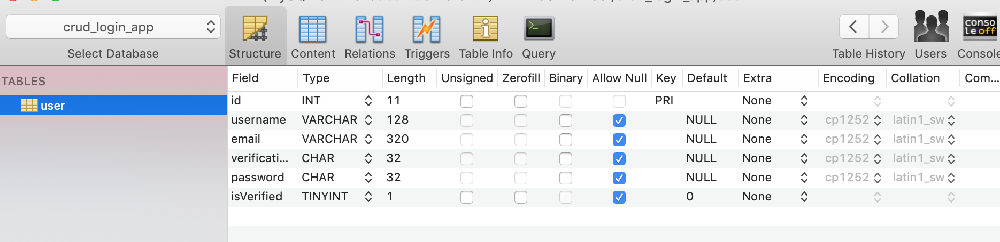

  For the `sessions` table I only had to do one command because I got everything right in the first command:
  ```sql
  mysql> create table sessions ( id INT not null auto_increment primary key, token CHAR(32), username CHAR(128), ip CHAR(15), useragent VARCHAR(255));
  ```
  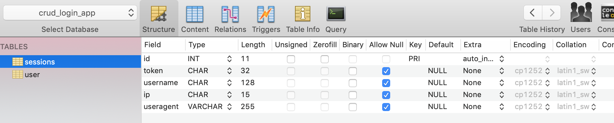

  ## What I Did Today
  I started the app. I completed most of `index.js` adding mime types this time.

  For more mime types: [Incomplete list of MIME types](https://developer.mozilla.org/en-US/docs/Web/HTTP/Basics_of_HTTP/MIME_types/Complete_list_of_MIME_types)

  Here are all my commits for today:
  [Link To Work](https://github.com/DashBarkHuss/crud_login_node_app/commits/3ee477fbc8b49dd5d59bbe47f60e7ac23df6f37b)

  Tomorrow, I'll work on connecting the database and handling API requests.

## Day 22, R3
### 8/10/19

- ## Reviewing Front End  
  Today I took a break from node to review frontend and make a project. I started a new streak tracker.

  ## Classes
  I read about classes:
  [Javascript Classes — Under The Hood](https://medium.com/tech-tajawal/javascript-classes-under-the-hood-6b26d2667677)

  ## Tracker
  I ended with this for today. 
  
  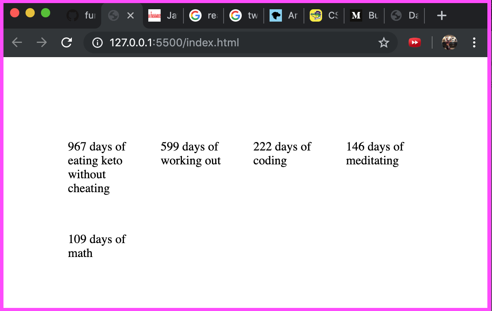
  [Link To Work](https://github.com/DashBarkHuss/streak-tracker/commit/38d9b33c83d909558ddd8022f2a34a694f5bebc5)

  I'll find some time to make it pretty.
  
  I also reviewed grid, and javascript dates.

- ## Thoughts and Feelings:
  Time went by really fast today. Probably because I was building something and reviewing old concepts instead of learning something new.

## Day 21, R3
### 8/9/19

- ## Node

  ### Where I left off
  I started to add the verification token to `action_user_register`. I'll continue here.

  ## Verification Token
  Now the `action_user_register` creates a verification token. Next we need to email the user the token url.

  [Link To Work](https://github.com/DashBarkHuss/node_server_sessions/commit/100437c63cd464c5d02828c2d431096df982ed1f)

  ## How Is MD5 Secure?
  If all you have to do to translate md5 tokens is run md5(token), how is that secure? Couldn't anyone take that token and get md5 and run md5(token)? I'm thinking that maybe there's another step here.

  I read [WHAT IS THE DIFFERENCE BETWEEN HASHING AND ENCRYPTING](https://www.securityinnovationeurope.com/blog/page/whats-the-difference-between-hashing-and-encrypting). 

  I don't really understand how it works still.

  I read that [md5 isn't secure](https://searchsecurity.techtarget.com/definition/MD5). But I think the reason it's insecure is unrelated to what I don't understand about it. I think other hashing methods like SHA work the same way and they are secure but I still don't understand why.

  I watched this video [How hash function work?](https://www.youtube.com/watch?v=xsp--srKWKw) which helped me understand better. Also the teacher was funny.

  ## Email Verification
  The email verification is complete.

  [Link To Work](https://github.com/DashBarkHuss/node_server_sessions/commit/e7a1b0c9825b31cf430783b3aba4fe53be40c7de)

  ## What's left?
  For learning purposes this app is complete. It demonstrates how to login/logout and register. 

  ### What is the app missing?
  - There's nothing stopping you from registering different usernames under the same email. 
  - A UI for resending the verification code
  - An endpoint that deletes or updates accounts
  - Some errors don't catch properly
  - Some promises should throw an error but they don't

  These would be the only things related to accounts that's missing. All of them are easy fixes. Obviously this isn't a very useful app because it does nothing but create users. But this is for demonstration purposes for myself and anyone else who wants to see how you can make an app with logins.

  ## Completed Project
  I added a readme.md. Here's the complete project:

  [Node Server Session](https://github.com/DashBarkHuss/node_server_sessions)

  ## Next
  I've put together a [CRUD app](https://github.com/DashBarkHuss/node_server_multiple_endpoints) and a [Sessions app](https://github.com/DashBarkHuss/node_server_sessions). Next I could put together an app that has both. I also wonder if I should learn express and when I should go back to learning react.

  I started this login app on 7/28, day 209. So this project took me 13 days. I wonder if I can do a combined crud and sessions app in a shorter amount of time. 

## Day 20, R3
### 8/8/19

- ## Node

  ### Where I left off
  I left off having created an email module. Today, I'm going to use that email module to make a verification email.

  ## Rejecting A Promise
  When do you reject a promise? It seems like anytime you could reject a promise you could also just resolve it with a message that says 'something went wrong'. Maybe it's when you don't want the rest of the `then()` functions to get called?

  ## Payload
  When you're not using fetch and you're just using a URL, where is the payload? Is it in the URL?

  I think maybe a payload is different than the parameters you send in a URL. It looks like you only send [a payload for a POST request and parameters for a GET request](https://stackoverflow.com/questions/14551194/how-are-parameters-sent-in-an-http-post-request). But what's really the difference? They seem the same? It seems like you could use POST or GET for the same thing. Is POST more secure?

  Here's some differences: [GET vs. POST](https://www.diffen.com/difference/GET-vs-POST-HTTP-Requests)

  ## MySQL
  I reviewed some command line mysql commands to do somethings to the database.

  [Create MySQL Database, Table & User From Command Line Guide](https://www.a2hosting.com/kb/developer-corner/mysql/managing-mysql-databases-and-users-from-the-command-line)

  [Create boolean column in MySQL with false as default value?](https://stackoverflow.com/questions/2221069/create-boolean-column-in-mysql-with-false-as-default-value)
  
  [SQL ALTER TABLE Statement](https://www.w3schools.com/sql/sql_alter.asp)

  ## Register
  I thought I made my register endpoint log the user in. But that's not happening.

  I changed the frontend code so now it logs the user in. It wasn't storing the token.

  ## `action_user_verify()`
  I made an `action_user_verify()` function that uses parameters sent in a url to verify the user. I added two columns to the database: `isVerified` which is a boolean and `verificationToken`:

  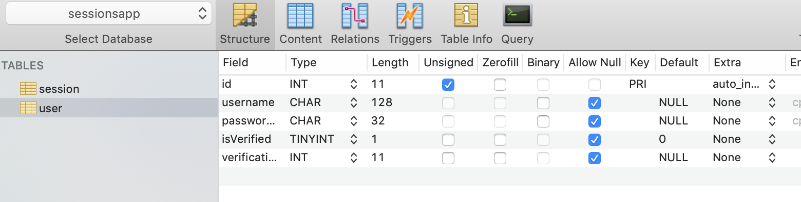

  [Link To Work](https://github.com/DashBarkHuss/node_server_sessions/commit/702d68a22dad09abdb999165c032cc0b4e3abf2e)

  Next I need to create the function(s) that create the verification token and send an email with the verification URL. I started to add the verification token to `action_user_register`. I'll continue here tomorrow.


## Day 19, R3
### 8/7/19

- ## Node

  ### Where I left off
  I left off trying to make an email verification api to register a new user.

  ## Authentication
  I read a little bit about authentication:

  [SECURING WEB APIS - PART 1
The Basics with Node.js Examples](https://resources.infosecinstitute.com/securing-web-apis-the-basics-with-node-js-examples/)

  ##  Email Verification
  Steps:
  >- User signs up into application.
  >- A user cannot sign in yet into application until their email is verified.
  >- A user receives an email with a verification link that contains a token.
  >- User clicks on verification link to get redirected to the application where the token is used to verify them.

  -*from [How to implement Email Verification feature in your NodeJS app using Express, SendGrid, Sequelize ORM(MySQL).](https://medium.com/the-andela-way/how-to-implement-email-verification-feature-in-your-nodejs-app-using-express-sendgrid-sequelize-e5b255bf92a2)*

  ## Send An Email In Node.js
  I read this tutorial on sending an email using Node.js:

  [Node.js Send an Email](https://www.w3schools.com/nodejs/nodejs_email.asp)

  I added Nodemailer.
  ```bash
  npm install nodemailer --save-dev
  ```

  ## Set Up Gmail App Password
  I ran into an error:
  ```bash
  Error: Invalid login: 535-5.7.8 Username and Password not accepted. Learn more at
  535 5.7.8  https://support.google.com/mail/?p=BadCredentials t133sm129744943iof.21 - gsmtp
  ```
  I followed the link above, [I can't sign in to my email client](https://support.google.com/mail/?p=BadCredentials).

  I created an app password:
  [Sign in using App Passwords](https://support.google.com/accounts/answer/185833)

  ## Delete Last Commit
  I accidentally pushed sensitive information to github so I deleted the last commit locally (this wasn't the right way):
  ```bash
  git reset --hard HEAD~1
  ```
  Then I force pushed to github:
  ```bash
  git push origin +master --force
  ```
  This didn't actually work. It deleted my last updated files locally too which I didn't want to do. Luckily, I was able to get what I need and put it back together.
  
  ## App Sends Email
  Now my app sends a simple email.

  [Link To Work](https://github.com/DashBarkHuss/node_server_sessions/commit/b3d099c96dbce58978c0582e8963be5b6ad693a5)

  ## Email Module
  I turned my sendEmail.js script into a function that can be imported. I read about exporting modules:
  [Export Module in Node.js](https://www.tutorialsteacher.com/nodejs/nodejs-module-exports)

  [Link To Work](https://github.com/DashBarkHuss/node_server_sessions/commit/842584d0c8fb3d1065f3845a4ceedd6f38a439b0)

## Day 18, R3
### 8/6/19

- ## Node
 
  ### Where I left off:
  Yesterday, I was trying to make it so if the client tries to login but they're already logged in it won't let them. That's where I left off.

  ## Login
  Now you can't log in if someone is already logged in:

  [Link To Work](https://github.com/DashBarkHuss/node_server_sessions/commit/76e489712b01c3b639ecd7c683b849c9a6428eea)

  I don't know if this is necessary. We could just log out anyone who is logged in.

  ## Local Storage
  I was having trouble with my local storage returning undefined. I wanted to see where it was stored in Chrome:

  >It's simple. Just go to the developer tools by pressing F12, then go to the Application tab. In the Storage section expand Local Storage. After that, you'll see all your browser's local storage there.

  -*from [How to view or edit localStorage](https://stackoverflow.com/questions/9404813/how-to-view-or-edit-localstorage)*
  
  ## CSS Selectors
  I used this reference:
  [CSS Selector Reference](https://www.w3schools.com/cssref/css_selectors.asp)

  ## Logged In VS Logged Out Views
  I made it so the view is different depending on whether the client is logged in or logged out.

  

  The code is on the frontend. I think I should eventually move some of this to the backend or organize the views into different files on the frontend to be cleaner. Maybe the code should route to different pages if the user is logged in/logged out.

  [Link To Work](https://github.com/DashBarkHuss/node_server_sessions/commit/d3652ac8e7fc5d630ba645890c7c5c6706d7ab98)

  ## Email Verification
  I'd like to implement an email verification for when a user registers. I looked up how email verification works:

  >- User signs up into application.
  >- A user cannot sign in yet into application until their email is verified.
  >- A user receives an email with a verification link that contains a token.
  >- User clicks on verification link to get redirected to the application where the token is used to verify them.

  -*from [How to implement Email Verification feature in your NodeJS app using Express, SendGrid, Sequelize ORM(MySQL).](https://medium.com/the-andela-way/how-to-implement-email-verification-feature-in-your-nodejs-app-using-express-sendgrid-sequelize-e5b255bf92a2)*

  That's where I'll leave off for today. I'll work on the email verification tomorrow.


## Day 17, R3
### 8/5/19

- ## Node
 
  ### Where I left off:
  I started to make the logout endpoint. It's not working. The session is still in the table. 

  ## Logout Deleting Session
  I got the logout to delete the session. I had the syntax wrong for the ip and the user-agent. Here's how it should be:

  ```javascript
  // api.js
  const q = `Delete from session where ip = '${request.connection.remoteAddress}' AND useragent='${request.headers['user-agent']}'`;
  ```
  ## Logout UI Working
  The logout is working on the UI.

  [Link To Work](https://github.com/DashBarkHuss/node_server_sessions/commit/7a349c37fec8a014063470d919e8354585c8e434)

  ## Register UI
  I added a UI for register. But register doesn't log you in on the new account yet.

  [Link To Work](https://github.com/DashBarkHuss/node_server_sessions/commit/f6e343c75db923d2493e7d2c00f59bb2b9c17988)

  ## Create Session On Frontend?
  Right now I have `action_create_session` being called from the frontend if the password and username match and the success property returns true.

  ```javascript
  // index.html
  const login = (payload) => {
      payload = makePayload(payload);
      fetch('api/user/login', payload
          ).then(promise=>promise.json()
          ).then(content=> {
              console.log("content:",content)
              if(content.success==true){
                  return fetch("api/session/create", payload)
              }
              throw content.message;
          }).then(promise=>promise.json()
          ).then(json=> {
              console.log(json)
              localStorage.setItem('token', json.token);

          }).catch((error) => { console.log("err:", error) });
  }
  ```
  I'm not sure if this is secure enough. I think I should add that the passwords need to match in the `action_create_session` function on the backend. Or I need to call `action_create_session` from the `action_user_login` function instead of from the frontend.

  ## Create Session On Backend
  I moved `fetch("api/session/create", payload)` out of the frontend:
  ```javascript
  // index.html
  const login = (payload) => {
    payload = makePayload(payload);
    fetch('api/user/login', payload
        ).then(promise=>promise.json()
        ).then(json=> {
            localStorage.setItem('token', json.token);
        }).catch((error) => { console.log("err29:", error) });
  }
  ```
  And into the backend:
  ```javascript
  if (identify('user', 'login')){
      action_user_login(request, payload )
      .then(content => {
          if(content.success == true){
              return action_session_create(request, payload); //create session
          }
          return content
      })
      .then(content=>{
          respond(response, content)});
  }
  ```

  And I removed the api url for `action_create_session`.

  This seems way more secure.

  [Link To Work](https://github.com/DashBarkHuss/node_server_sessions/commit/51df969e52adda3e8362391ad4de4bb1f382da14)

  ## Register Creates Session
  Now register also creates a session, loggin the new user in.

  [Link To Work](https://github.com/DashBarkHuss/node_server_sessions/commit/1c7d21af647c7df011879c4b2b0a20396181e215)

  ## Managing Sessions
  If I log in while someone is already logged in on that browser, the app writes over the last token without alerting them. I should probably make it so you cannot register or login while someone is already logged in.
  
  ## `action_session_get`
  This returns an object that tells us if anyone is currently logged in and who:

  [Link To Work](https://github.com/DashBarkHuss/node_server_sessions/commit/d975e04ec90c1945419f7fd7bba0fcd17b68c2de)

  Right now it won't work correctly if a token is sent in and that token isn't connected with any session. 
  
  Now it's fixed:

  [Link To Work](https://github.com/DashBarkHuss/node_server_sessions/commit/1b235f172b00f81f19379bdbdfade7e0876474ed)

  ## No Logging In If User Logged In
  I'm trying to make it so if the client tries to login but they're already logged in it won't let them. That's where I left off.


## Day 16, R3
### 8/4/19

- ## Node
 
  ### Where I left off:

  Yesterday, I started changing `action_session_create`. Before, the query looked only for existing sessions associated with the `user_id`. Now I'm also searching for `user-agent` and `ip`. I'll continue working on `action_session_create`.

  ## Logout
  I got more answers for my [log out question](https://twitter.com/DashBarkHuss/status/1157687032279379970) that were all pretty different.

  So I guess there isn't one agreed upon way to manage a logout endpoint.

  ## User Agent
  I got a weird result console logging `user-agent`. I was on Chrome but the log showed that the browser was Firefox(Mozilla), Chrome, and Safari:
  ```bash
  Mozilla/5.0 (Macintosh; Intel Mac OS X 10_14_6) AppleWebKit/537.36 (KHTML, like Gecko) Chrome/75.0.3770.142 Safari/537.36
  ```

  I found this explanation:
  > most Web browsers use a User-Agent string value as follows:
  >
  >`Mozilla/[version] ([system and browser information]) [platform] ([platform details]) [extensions].`
  >
  >- Mozilla is a byproduct of browser wars.
  >
  >- AppleWebKit/537.36 is the platform used by your browser.
  >
  >- Chrome/51.0.2704.63 is your browser
  >
  >- Safari/537.36 was added for historic reasons, where Safari was treated differently.
  
  -*[Why does Chrome send four browsers in the user-agent header?](https://security.stackexchange.com/questions/126407/why-does-chrome-send-four-browsers-in-the-user-agent-header)*

  ## Data Types For IP and User Agent
  I found this answer for what data types you should use for IP and User Agent in my session table: [What types should I use for these data in MySQL?](https://stackoverflow.com/questions/8263806/what-types-should-i-use-for-these-data-in-mysql)

  - **IP:** CHAR(15)
  - **user-agent:** VARCHAR(255)

  There are probably other ways to go about it too, as the answer says, "*This **depends a bit on your personal taste**/your company's conventions, but I'd use:..."*.

  More on [SQL Data Types here.](https://www.journaldev.com/16774/sql-data-types)


  ## Session Table
  If there's more than one session per username you can't have username be the primary key. You'll get an error:
  ```bash
  Error: ER_DUP_ENTRY: Duplicate entry 'someusername' for key 'PRIMARY'
  ```
  So I made an id a primary key
  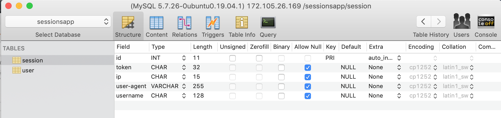

  ## Updated `action_session_create` and `action_user_login`
  `action_user_login` now queries for the session by username, ip, and, user agent. `action_session_create` now adds the user agent and the ip address to the session.

  [Link To Work](https://github.com/DashBarkHuss/node_server_sessions/commit/d504488faf38bfd6172b5c405f5134beb744520b)

  ## Logout
  I started to make the logout endpoint. It's not working. The session is still in the table.
  - 


## Day 15, R3
### 8/3/19

- ## Node
 
  ### Where I left off:
  I'm making a Node app that has a login.

  I started to add the login UI but it's not working yet.

  ## Login UI
  I got the login UI working.

  [Link To Work](https://github.com/DashBarkHuss/node_server_sessions/commit/057aeb7e17f681c72e409413258bf9460083bc5a)

  ## Storing Client Login Info
  I thought it might be good for security reasons to keep track of which devices each auth token is being stored on. So I wanted to know how to access information about the client.

  [How to determine a user's IP address in node](https://stackoverflow.com/questions/8107856/how-to-determine-a-users-ip-address-in-node)

  [How to get information about the client in node.js](https://stackoverflow.com/questions/3895434/how-to-get-information-about-the-client-in-node-js)

  ```javascript
  console.log(request.connection.remoteAddress); //127.0.0.1
  console.log(request.headers['user-agent']); //Mozilla/5.0 (Macintosh; Intel Mac OS X 10_14_6) AppleWebKit/537.36 (KHTML, like Gecko) Chrome/75.0.3770.142 Safari/537.36
  ```
  I could save this information in the sessions table. But what if the user deletes the local storage on their own without pressing the logout button? Then I'd have devices in the sessions table that say they are logged in but aren't. So maybe it's not a good idea. 

  I also need to think about how I need to change my code to prevent multiple logins of different users on the same client.

  ## `localStorage` Syntax
  [Window.localStorage](https://developer.mozilla.org/en-US/docs/Web/API/Window/localStorage)
  ```javascript
  localStorage.setItem('myCat', 'Tom');
  var cat = localStorage.getItem('myCat');
  localStorage.removeItem('myCat');
  localStorage.clear();
  ```

  ## Secure Logout
  Right now I have the logout function on the frontend.

  ```javascript
  const logout = (payload) => {
    localStorage.removeItem('token');
  }
  ```

  This doesn't seem secure. What if someone changes the javascript so that it just looks like it logs out but the token doesn't delete? I'm not sure if that's possible but It seems like it is.

  I did some research but was having trouble finding an answer so I posted on twitter:

  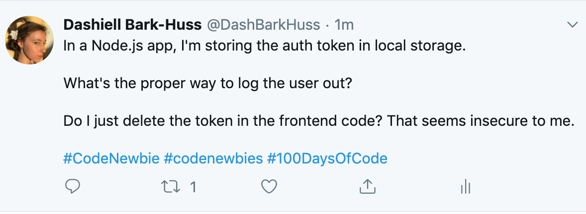

  I got an [answer](https://twitter.com/the_moisrex/status/1157687913448165376) from [@moisrex](https://twitter.com/the_moisrex). Basically, what I had a few days ago was correct. You ***do*** delete the session from the database when the user logs out. So you *can* have ***multiple*** sessions for each user. Different devices will have different sessions for the same user in order to log out separately. Otherwise, logging out on your phone would also log you out of your computer.

  I thought this was wrong  because in [Node.js – Server Setup](https://www.patreon.com/posts/node-api-source-27588087), **Greg only has *one* session per user:**
 
  In `action_create_session` of the github file, the session is found by the `user_id`.
  
  [Node.js – Server Setup Github](https://github.com/javascriptteacher/node/blob/master/module/api/api.js) Code:
  ```javascript
  database.connection.query("SELECT * FROM session WHERE user_id = '" + payload.id + "' LIMIT 1",
        (error, results) => { // Check if session already exists
  ```

  If we're just searching by `user_id`, that would mean there's only ***one*** auth token per each user. But we will actually need to look up the token by `username` and `user.agent` and `IP`, because there may actually be multiple sessions per user.

  I think [@moisrex](https://twitter.com/the_moisrex)'s way is correct. It makes more sense to me. Also Greg told me the Node book is still a work-in-progress so it's possible his query is just a mistake. Or maybe it's just a simplified way to create a session for learning purposes.

  ## Changing Session
  Now I have to go back and change how the app creates the session.

  I changed the query. Before, I was just searching for `username`. Now it also looks for `user-agent` and `ip`:

  ```javascript
  // line 74, api.js `action_session_create`
  let q = `select * from session where username = '${payload.username}' AND ip = ${request.connection.remoteAddress} AND user-agent = ${request.headers['user-agent']}` ;
  ```

  This is where I left off. I'll continue working on `action_session_create` tomorrow.

## Day 14, R3
### 8/2/19

- ## Chrome Extensions
  Yesterday, in my spare time, I started working on making chrome extensions.

  I found this repo of a bunch of chrome extension examples: [All Chrome Extension examples collected into one repository](https://github.com/orbitbot/chrome-extensions-examples)

  I played with this example: [A browser action with a popup that changes the page color](https://github.com/orbitbot/chrome-extensions-examples/tree/master/set_page_color)

- ## Node
 
  ### Where I left off:
  I added the session table and started adding the code for `action_session_create`. I'll continue that today.

  ## Sessions Question
  ***Do you create a new session for each device?*** If I log in a on a phone and then want to log in on a computer, should my app create two sessions?

  I think not, because here it says that you check if the session exists and then get it:

  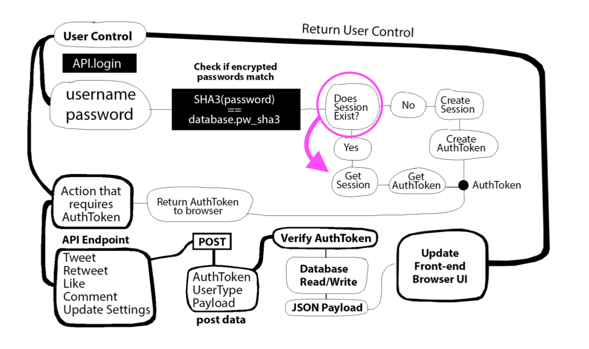

  -*from [Node.js – Server Setup](https://www.patreon.com/posts/node-api-source-27588087)*

  So then the way I logged out last time in [this project](https://github.com/DashBarkHuss/node_book/tree/5e8a6f8a9c93dab3264bab80b176986cdbaddba0) I think I did it wrong. I just deleted the session. But that would log every device out that's using that token.

  ## Promise Error
  I wondered how do I exit a long promise chain?

  I found this answer in [Early Returns out of a long promise chain](https://github.com/petkaantonov/bluebird/issues/581):

  > An answer on stackoverflow suggests throwing and error and then catching it.

  Info on errors: [JavaScript Errors - Throw and Try to Catch](https://www.w3schools.com/js/js_errors.asp)

  I added a throw statement and a catch statement:
  ```javascript
  fetch('http://127.0.0.1:3000/api/user/login', 
  payload)
  .then(promise=>promise.json()
  ).then(content=> {
      console.log("content:",content)
      if(content.success==true){
          return fetch("http://127.0.0.1:3000/api/session/create", payload)
      }
      throw content.message; //throw error
  }).then(promise=>promise.json()
  ).then(json=> console.log(json)
  ).catch((error) => { console.log("err:", error) }); //catch error
  ```
  ## Sessions & Login
  Now the sessions are managed and the login works. But I still need to move the login code to the UI and then save the token to local storage.

  [Link To Work](https://github.com/DashBarkHuss/node_server_sessions/commit/f15b0b658ddad027ee37915bf392963e27cca682)

  ## Login UI
  I started to add the login UI but it's not working yet. I'll continue tomorrow.


## Day 13, R3
### 8/1/19

- ## Node
  New month! I looked back at my  posts from a month ago. It feels like progress is so slow, but looking back, I can see I accomplished a lot. I hadn't even connected my database to any Node app yet. Since then, I've connected databases to apps multiple times. I've also figured out so much about creating a node app on my own, soldiering through many issues that the book tutorial hadn't addressed.
  
  ### Where I left off:
  Yesterday, I continued my Node app that will have CRUD *and* sessions/logins so I can get more practice with sessions.

  I started to add the database query. I'll continue that today.

  ## Database Query
  I got `action_user_login` to query the database to see if the username passed into the payload exists.

  [Link To Work](https://github.com/DashBarkHuss/node_server_sessions/commit/92889e68b0ba588a44ffe299227199bd6ac8d12c)

  ## MD5
  I added the md5 package with --save-dev:
  ```bash
  npm install md5 --save-dev
  ```
  And required it in api.js:
  ```javascript
  const md5 = require('md5');
  ```

  ## `action_user_register`
  I added action_user_register. Now users can register with just a username and password. MD5 encrypts the password.

  [Link To Work](https://github.com/DashBarkHuss/node_server_sessions/commit/212e3f9fd91cc07ae36ce2f72c4e0e93fb762869)

  ## Login Checks Password
  `action_user_login` only outputs a message that the user logged in if the passwords match. No session is created yet.

  [Link To Work](https://github.com/DashBarkHuss/node_server_sessions/commit/801b6518d5dc246780beb1c8f9336ac516bf805d)

  ## `action_session_create`
  I added the session table and started adding the code for `action_session_create`. I'll continue that tomorrow.


## Day 12, R3
### 7/31/19

- ## Node
  
  ### Where I left off:
  Yesterday, I continued my Node app that will have CRUD *and* sessions/logins so I can get more practice with sessions.

  I started the login API endpoint and I'm continuing that.

  ## Promise Syntax
  I had a really weird error where my a promise constructor executor was catching an error but the error was the resolve value. It was because I had switched the order of the parameters for the executor. I did `(reject, resolve)` but it should be `(resolve, reject)`.

  [Promise Docs](https://developer.mozilla.org/en-US/docs/Web/JavaScript/Reference/Global_Objects/Promise)
  ### No:
  ```javascript
  return new Promise((reject, resolve)=>{ //wrong order
      if (!payload){
          reject("Oops no payload")
      };
      resolve(`{"success": true}`); 
  }).catch((error) => { console.log("err:", error) });
  ```
  ### Yes: 
  ```javascript
  return new Promise((resolve, reject)=>{
      if (!payload){
          reject("Oops no payload")
      };
      resolve(`{"success": true}`); 
  }).catch((error) => { console.log("err:", error) });
  ```

  ## `action_user_login` Returns Promise
  Now `action_user_login` returns a promise.

  [Link To Work](https://github.com/DashBarkHuss/node_server_sessions/commit/10414a907e0f55ee02e5c9c6a3198a222455e180)

  ## `request.on('data')`
  I added the callback function for `request.on('data')` and added a payload to my test fetch call.

  [Link To Work](https://github.com/DashBarkHuss/node_server_sessions/commit/0cb8e2aa5b26a5327f26f227f0ab5c711f7f34b6)

  ## Database Class
  I added the database class and created a connection to the database.

  [Link To Work](https://github.com/DashBarkHuss/node_server_sessions/commit/a79461e580773cffec62d1d13a8ddc9efc309dd9)

  ## Database Connection Query
  I started to add the database query. I'll continue that tomorrow.

## Day 11, R3
### 7/30/19

- ## Node
  
  ### Where I left off:
  Yesterday, I continued my Node app that will have CRUD *and* sessions/logins so I can get more practice with sessions.

  I changed the status code for serving the 404.html file back to 200 and didn't test it with 404. I'll do that today.

  I need to better understand how fetch is working.

  ## Can Only Call `.json` Once
  You can only call `.json()` once on the response object for `fetch` otherwise you get this error:

  ``` bash
  Uncaught (in promise) TypeError: Failed to execute 'json' on 'Response': body stream is locked
  ```

  ### NO:
  ```javascript
  fetch('http://127.0.0.1:3000/api/lol')
  .then(promise=>{
    console.log("response: ", promise);
    console.log(".json(): ", promise.json()); // 1st time
    return promise.json(); // 2nd time
  });
  ```
  ### YES:
  ```javascript
  fetch('http://127.0.0.1:3000/api/lol').then(promise=>{
    console.log("response: ", promise);
    const json = promise.json(); // set promise.json() to variable
    console.log(".json(): ", json)
    return json;
  });
  ```

  ## Reviewing Fetch
  I reviewed the docs for using the fetch API: [Using Fetch
](https://developer.mozilla.org/en-US/docs/Web/API/Fetch_API/Using_Fetch) and [Fetch API](https://developer.mozilla.org/en-US/docs/Web/API/Fetch_API)

  ## Fetch UI
  I have a working fetch call on the UI that is simplified, so it demonstrates better what's going on with fetch:
  
  [Link To Work](https://github.com/DashBarkHuss/node_server_sessions/tree/c8ec88b8bc7ca0dee96c9f3dffd33f001784f033)

  ## 404 Status Code
  I changed the status code back to 404 and it still serves the 404.html file.

  ## `catchAPIrequest` and `respond` helper
  I added the static API method `catchAPIrequest()` to see if the request is an API request. I moved the body of `respond.on('end')` to a `respond` helper function.  

  [Link To Work](https://github.com/DashBarkHuss/node_server_sessions/commit/95d4a9b5293cc3d0c8d44fdc316b341e0b54005d)

  ## Removed Body Of `request.on('data')`

  I realized since we have no payload yet, the body of `request.on('data')` didn't do anything. So I removed the body for now. I still needed `request.on('data', ()=>{})  ` or `request.on('end')` wouldn't get called. 
  
  I also added an `identify()` helper and `action_user_login` with no body.

  [Link To Work](https://github.com/DashBarkHuss/node_server_sessions/commit/e32b27f1c5d9c572819ce952484cb0c8c978c3e1)

  ## Tomorrow
  Tomorrow, I'll continue adding to the login API endpoint.

## Day 10, R3
### 7/29/19

- ## Node
  
  ### Where I left off:
  Yesterday, I started a new app that will have CRUD *and* sessions/logins. The 404.html file isn't serving.

  ## No Slash in Path Parameter
  The 404.html file wasn't serving because of the syntax. There shouldn't be a leading forward slash in the path parameter for `fs.readFile`.

  ### No:
  ```javascript
  fs.readFile('/404.html', function(error,content){
      ...
  ```

  ### Yes:
  ```javascript
  fs.readFile('404.html', function(error,content){
  ```
  
  [Link To Work](https://github.com/DashBarkHuss/node_server_sessions/tree/f957b813a456371f869ebf677fc20b9fae2b72a6)

  ## `response` Parameter In `requestListener()`
  I was confused about the response parameter in the request listener in `http.createServer(). We don't yet know the response when we pass the parameter in. So what is it?

  >The second parameter represents a ServerResponse object, which has methods for handling the response stream back to the user parameter 

  -*[Node.js requestListener() Function](https://www.w3schools.com/nodejs/func_http_requestlistener.asp)*

  ## Markdown Spellcheck
  I added back the spellcheck extension I had called [Code Spell Checker](https://marketplace.visualstudio.com/items?itemName=streetsidesoftware.code-spell-checker). I thought it didn't have suggested spellings but I looked again in the docs and it does.

  ## `promise.text()`
  You can use `.text()` on a promise to see what the response is. This helped me debug an issue when `.json()` gave me an error for an unexpected token and the response couldn't be parsed.

  [Unexpected token < in JSON at position 0](https://daveceddia.com/unexpected-token-in-json-at-position-0/)

  ## API.exec Sends Response To Fetch
  I got API.exec to send a response to fetch.

  [Link To Work](https://github.com/DashBarkHuss/node_server_sessions/tree/08f8703f26d4c2882a313632f5f5c94bdee18444)

  ## Tomorrow
  I changed the status code for serving the 404.html file back to 200 and didn't test it with 404. I'll do that tomorrow.

  I need to better understand how fetch is working.

- ## Thoughts And Feelings:
  Doing multiple passes of this project has me looking at details and trying to understand more each time through. 

  For example, today I really looked closely at how the fetch promise gets resolved.

  Going through the tutorial multiple times has me understanding the big picture so I can ask the right questions about the details.


## Day 9, R3
### 7/28/19

- ## Node
  
  ### Where I left off:
  Yesterday, I finished implementing CRUD for my 'butts' api.

  Today, I'll start a new app that has CRUD *and* sessions/logins.

  ## Live Server VSC Extension
  I mentioned yesterday that all my computer apps,settings , and extensions had to be deleted. So today I'm adding back this [Live Server extension](https://marketplace.visualstudio.com/items?itemName=ritwickdey.LiveServer) for VSC.

  ## Password Input
  Here's how you can get that hidden password input:

  ```html
  <input type="password"></input>
  ```

  

  More info: [MDN, \<input type="password">](https://developer.mozilla.org/en-US/docs/Web/HTML/Element/input/password)

  ## `response.writeHead` And `response.end`
  Info on `response.writeHead` and `response.end`:

  >writeHead writes the HTTP header (status code 200), end writes the body and closes the response. 

  -*[response.writeHead and response.end in NodeJs](https://stackoverflow.com/questions/14243100/response-writehead-and-response-end-in-nodejs)*

  More info here: [HTTP, Node Docs](https://nodejs.org/api/http.html)

  ## `fs.readFile`
  >Asynchronously reads the entire contents of a file.

  More here: *[Node Docs: fs.readFile(path[, options], callback)](https://nodejs.org/api/fs.html#fs_fs_readfile_path_options_callback)*

  ## Status Code 404
  In the Node server tutorial I followed, when you request a page that doesn't exist you get redirected to 404.html page. And you write back a 200 status code:
  ```javascript
  fs.readFile('/404.html', function(error,content){
      response.writeHead('200', {'Content-Type':'text/html'});
      response.end(content, 'utf-8')
  }
  ```

  But I think you need to send a 404 code.

  >When a user requests a nonexistent URL on your website, you should return an individual error page that lets them know that the requested URL does not exist. You should also make sure that the server returns the correct HTTP status code “404“.

  -*[Why should a 404-error page return the correct HTTP status code and not be redirected, for example?](https://www.sistrix.com/ask-sistrix/onpage-optimisation/http-status-code/4xx-client-error-404-error-page/why-should-a-404-error-page-return-the-correct-http-status-code-and-not-be-redirected-for-example/)*

  I'm changing the code to 404.

  ## Not Serving 404.html
  I added more conditionals `fs.readFile`. Now the 404.html file isn't serving. I wonder if it's because it won't serve unless you pass 200 into `response.writeHead`. I'll need to work on this tomorrow. 


## Day 8, R3
### 7/27/19

- ## Node
  Continuing with Greg's book, [Node.js – Server Setup](https://www.patreon.com/posts/node-api-source-27588087).

  ### Where I left off:
  Yesterday, I added an endpoint that updates the *butts* but I'm getting an error related to the MySQL query.

  I also had a lot of problems with my mac so I had to wipe it clean and move the files over from my last back up. All of my applications are gone along with their settings and extensions. So I'll need to deal with that.

  ## Installing Homebrew And Node

  I have to install Homebrew and Node:

  [How to install NodeJS and NPM on Mac using Homebrew](https://www.dyclassroom.com/howto-mac/how-to-install-nodejs-and-npm-on-mac-using-homebrew):

  Install brew:
  ```bash
  /usr/bin/ruby -e "$(curl -fsSL https://raw.githubusercontent.com/Homebrew/install/master/install)"
  ```

  Install Node:
  ```bash
  $ brew install node
  ```
  
  ## Markdown Extension
  I had this extension before:
  [Markdown All in One.](https://marketplace.visualstudio.com/items?itemName=yzhang.markdown-all-in-one)

  I added it back.

  It gives you some short cuts for working with markdown. For example, `cmd` + `b` makes text bold.

  ## MySQL Query Error

  I solved my query error. I was missing quotes.
  ### Wrong:
  ```sql
  update butts set shape = big where owner = dash
  ```
  ### Correct:
  ```sql
  update butts set shape = 'big' where owner = 'dash'
  ```
  
  ```javascript
  // line 51,api.js
  let q = `update butts set shape = '${payload.shape}' where owner = '${payload.owner}'`;
  ```

  ## CRUD
  Now I've fully implemented CRUD:
  - **Create**: `action_butt_add`

  - **Read**: `action_butt_find`

  - **Update**: `action_butt_update`

  - **Delete**: `action_butt_delete`


   ### [Link To Work](https://github.com/DashBarkHuss/node_server_multiple_endpoints/tree/ca3bcd1c8c5a3039e0c6a33deb8552669eafb2f0)

   ## Next
   Next, lets add more UI. Right now I can only **add** and **find** in the UI.

   ## UI Added
   I added a simple and not so pretty UI.

   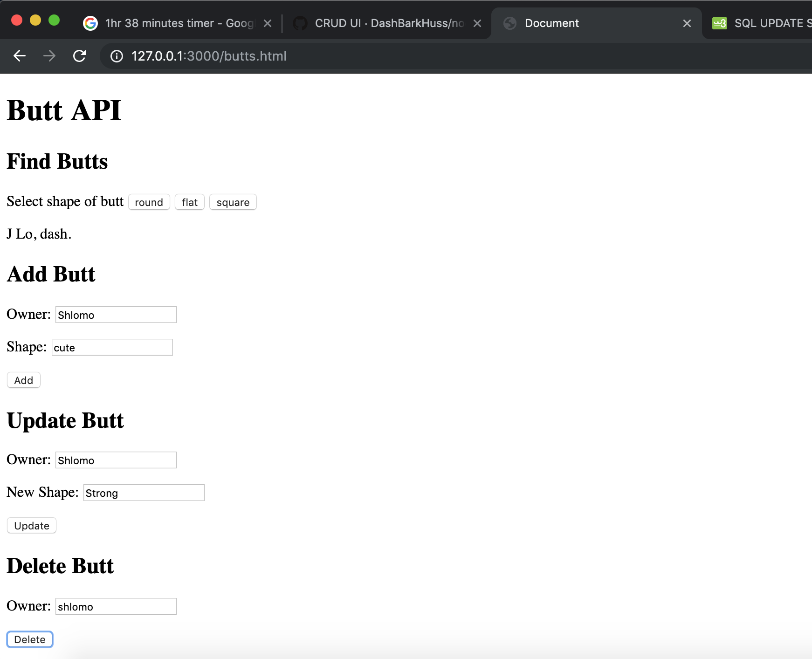

   [Link To Work](https://github.com/DashBarkHuss/node_server_multiple_endpoints/commit/3d908f93106ad43777e5be15d4e889bb01d24321)

   ## Readme
   I added to the readme.

   [Link To Work](https://github.com/DashBarkHuss/node_server_multiple_endpoints/tree/15c3761058dfcf2547efbedcaa471826ed0e8823)

   ## What Do I Still Need To Know?
   I still probably need more experience with making bigger databases with lots of tables. How do they need to relate to each other? I know there are best practices.

   I also should get more practice with authentication and sessions.

   I'm going to start another project again from scratch. This one will have authentication/logins. Maybe I'll even make something useful, instead of a butt api.

- ## Thoughts And Feelings:
  I know so much more about creating a backend now. It's fun. I feel like I am getting closer to being able to pop out apps. I wonder what else there is to learn regarding backend? It seems like this is all it is? Maybe AI and data science is considered backend.

  I wonder if I should next learn express? Is it necessary?
  


## Day 7, R3
### 7/26/19

- ## Node
  Continuing with Greg's book, [Node.js – Server Setup](https://www.patreon.com/posts/node-api-source-27588087).

  ### Where I left off:
  I made a dynamic query and returned the data to the UI. I refactored the code into helper functions so it's DRY. I added a new endpoint but I need to add the body to the endpoint

  ## Adding Butts
  I created the body for `action_butt_add`.
  

  ### [Link To Work](https://github.com/DashBarkHuss/node_server_multiple_endpoints/tree/e7d994e80d3fd927415eed8ae0869aad2b3eba8e0)

  ## Added Alert
  I added an alert for when the butt is added to the database.

  ### [Link To Work](https://github.com/DashBarkHuss/node_server_multiple_endpoints/tree/a19b9ce23adcabd996577f8d30760989cf0f2672)

  ## CRUD
  Now we have the create and read parts of CRUD implemented. I want to implement the rest of crud: update and delete.

  ## Deleting Butts
  Now my app deletes butts. There's no UI for delete yet, so you have to run `Butt.delete('somebuttowner')` in the console.

  ### [Link To Work](https://github.com/DashBarkHuss/node_server_multiple_endpoints/tree/61d9298d701fb27ec7818414b0a554b181d3d5a8)

  ## Tomorrow
  I added an endpoint that updates the butts but I'm getting an error related to the MySQL query so that's what I'll work on tomorrow.

  ### [Link To Work](https://github.com/DashBarkHuss/node_server_multiple_endpoints/tree/ba72f6b3d475960e75c5120b3a4845a616bcff4c)
## Day 6, R3
### 7/25/19

- ## Node
  Continuing with Greg's book, [Node.js – Server Setup](https://www.patreon.com/posts/node-api-source-27588087).


  ### Where I left off:
  Yesterday, I got the API to connect to the database and grab information statically: the API always queried the same query.

  Today, I'm going to try to make the call dynamic, using the payload. I'm also going to try to send the info back to the frontend through the promise returned in the fetch call.

  ## Dynamic Query and Return Query Info
  I got the api to query the database dynamically, based on the payload. 

  The query sends the data back to the front end console. 

  ### Link To Work: [node_server_multiple_endpoints](https://github.com/DashBarkHuss/node_server_multiple_endpoints/tree/6a62d127a1f76cbd9eb47abe129cdf30ea0b7753)

  ## Next:
  Let's put the data in the UI.

  ## Query Info Returned To UI
  Now the query info goes to the UI.
  ### Link To Work: [node_server_multiple_endpoints](https://github.com/DashBarkHuss/node_server_multiple_endpoints/tree/77ac5effd8e80a183efe2aa2a23432d10e804541)

  ## Next
  Let's add another API Query and move some of our code into helper functions so it's DRY. 

  ## Added Helper Functions, New Endpoint
  I refactored the code into helper functions so it's DRY. I added a new endpoint but I need to add the body to the endpoint tomorrow.
  ### Link To Work: [node_server_multiple_endpoints](https://github.com/DashBarkHuss/node_server_multiple_endpoints/tree/8e106e3b073e276320ca5de5d090e7db6e0d784a)
  

## Day 5, R3
### 7/24/19

- ## Node
  Continuing with Greg's book, [Node.js – Server Setup](https://www.patreon.com/posts/node-api-source-27588087).


  ### Where I left off:
  I'm on my 3rd round of doing the tutorial. I'm not using the book, except as a reference when needed. I'm using my finished files as references.

  Yesterday, I made an API class. I left off with a bug when I call fetch from the UI:

  ```bash
  SyntaxError: Unexpected token b in JSON at position 1
  ```

  But I'm not getting that error when I call the same code from the backend.

  ## Refreshing
  I'm not getting that error now, so I think it was just a refreshing problem.

  ## Returning Promise To UI
  I got my UI to request an endpoint. The end point returns data to the UI. I'm not really sure where in the code the data is getting returned to the UI. Maybe it's when I call `response.end(content, 'utf-8')`?Maybe that sends the content to the fetch call??

  ### Link To Work: [promise returned to UI no helper functions](https://github.com/DashBarkHuss/node_server_multiple_endpoints/tree/589d27985e62690916835a02eb13da7537cb6984)

  ## What Next
  I think I should try to get the api to change the database now.

  ## MySQL
  I added a query to the database. Our endpoint grabs all the butt's of the owners who have flat butts.

  Well really it grabs all the *owners*, but I wanted to say it *grabs all the butts* for the pun.
  
  ```javascript
  // line 24, api.js
  let q = "select owner from butts where shape = 'flat'"
  database.connection.query(q, (error, results)=>{
    if (error)
      throw error;
    console.log(results);
  })
  ```


  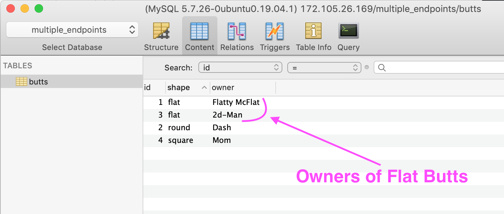

  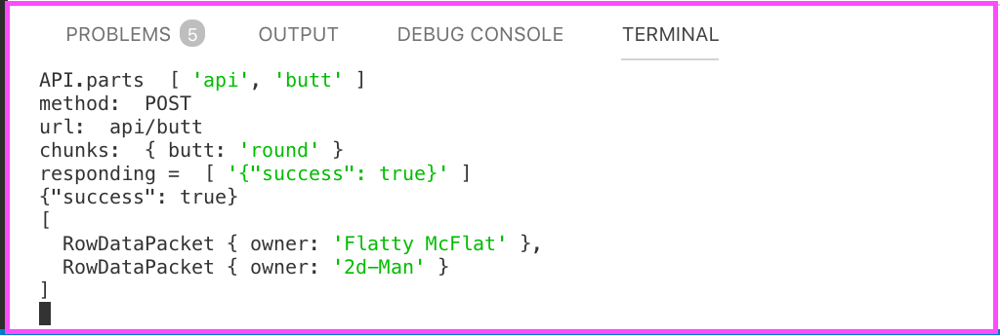

  We've successfully grabbed 2d-Man's and Flatty Mcflat's *flat* butts. We didn't grab my *round* butt or my moms *square* butt. Those aren't *flat*.

  ### Link To Work: [flat butt query](https://github.com/DashBarkHuss/node_server_multiple_endpoints/tree/f2bb95b67b86713d7c05c17c990b5f3d37d21dd8)

  ## Tomorrow
  Tomorrow, I'll work on using the payload to change the query and returning information from the query back to the UI.

## Day 4, R3
### 7/23/19

- ## Node
  Continuing with Greg's book, [Node.js – Server Setup](https://www.patreon.com/posts/node-api-source-27588087).


  ### Where I left off:
  I'm on my 3rd round of doing the tutorial. I'm not using the book, except as a reference when needed. I'm using my finished files as references.

  I need to make an API class and tell the `requestListener` in `httpCreateServer` what to do when it gets an API url.

  ## `.constructor`
  I thought this was an interesting conditional:
  ```javascript
  if (request.constructor === String)
  ```
  
  ## Testing API Calls With `node-fetch`
  `fetch` doesn't work in node because it's a WEB API. Node is on the backend so it doesn't have access to the Web API's. 

  I wanted to automatically fetch an API endpoint while testing it every time I restart the server. So I figured I needed to fetch the api from the node file on the backend, index.js. 

  To do this I installed `node-fetch`:
  ```bash
  npm install node-fetch --save
  ```

  I required `node-fetch` in index.js:
  ```javascript
  const fetch = require('node-fetch');
  ```

  I called `fetch()`. You much use an absolute URL for `node-fetch`:
  ```javascript
  fetch('http://127.0.0.1:3000/api/butt', {
    method: 'post',
    headers: {
      'Accept': 'application/json'
    },
    body: JSON.stringify({butt: 'round'})
  })
  ``` 

  ## What Next
  I made an API class. I'm working on getting it to one endpoint. I left off with a bug when I call fetch from the UI:

  ```bash
  SyntaxError: Unexpected token b in JSON at position 1
  ```

  But I'm not getting that error when I call the same code from the backend.


## Day 3, R3
### 7/22/19

- ## Node
  Continuing with Greg's book, [Node.js – Server Setup](https://www.patreon.com/posts/node-api-source-27588087).


  ### Where I left off:
  Yesterday I started to redo the tutorial again. This time, without reading the book. I'm only using the book as a reference when needed. I'm using my finished files as references. This time I want to make multiple endpoints.

  I made a new database and created a server. I started to get the server to redirect `/` requests to `index.html`.

  ## Serves Html Files

  I made a server that serves html files. I used dotenv again to upload the directory without publishing my database server info. I'll use the database server info later to connect to the database.
  

  Link to work: **[node_server_multiple_endpoints, commit: serves html files](https://github.com/DashBarkHuss/node_server_multiple_endpoints/tree/ce8b0cdda6994d70852d053148c7f22a9e02be08)**
  ```javascript
  // index.js
  let http = require('http');
  let fs = require('fs');

  const ip = '127.0.0.1';
  const port = 3000;

  http.createServer(function(request,response){
    console.log(request.url);
    let file;
    if (request.url === '/') file = 'index.html'
    else file = request.url.slice(1, request.url.length);
    fs.readFile(file, function(error, content){
      if(error){
        if (error.code='ENOENT'){
          fs.readFile('/404.html', function(error, content){
            response.writeHead(200, {'Content-Type': 'text/html'});
            response.end(content, 'utf-8')
          });
        } else {
          response.writeHead(500);
          response.end('Error: ' + error.code + '\n');
        }
      } else {
        response.writeHead(200, {'Content-Type': 'text/html'})
        response.end(content, 'utf-8');
      };
    });

  }).listen(port, ip);
  ```
  I didn't yet add the mime type code. So if you put a png image in the directory and try requesting that image file, the server will interpret the image as html. You'll see a bunch of weird text. Changing this is not complicated but I'm going to skip it for now because I'm less interested in that.

  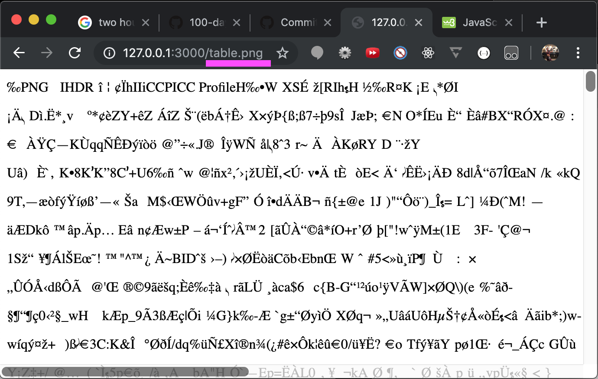

  Next, should I try to connect to the database or make the API class? 
  
  I'm going to connect to the database.

  ## `--save-dev`
  >--save-dev: Package will appear in your devDependencies.

  -*[Difference between — save-dev and — save while running npm](https://medium.com/@arnab.k/difference-between-save-dev-and-save-while-running-npm-50e3c0784153)*
  
  I added the mysql npm package and the md5 package so I could require them. I used `--save-dev` so that they'll be included when others download my repo.

  ## No Semicolon In `.env` File

  I had semicolons in my `.env` file. That made the semicolons part of the variables:

  ```
  SOMEVAR = 'somevalue'; // the value will be "'somevalue';" with the semicolon included.
  ```

  It should be *without* semicolons, but it seems that you can *include **or** leave out* the quotes.

  ## Database Connects
  I added an `api.js` file and made the `database.create()` function in there. I required `api.js` in `index.js` and called the `database.create()`  function. 
  
  Since I'm using dotenv, when I run the module I use `node bin/dev`. `bin/dev` requires `dotenv/config` and `index.js` modules. Running `node index.js` won't work because `index.js` doesn't require the `dotenv/config` module, so `index.js` can't access the environment variables on its own. 

  Link to work: **[node_server_multiple_endpoints, commit: database connects](https://github.com/DashBarkHuss/node_server_multiple_endpoints/tree/06c8700932099e1c334c298654c89c1b12b7f476)**

  ```javascript
  // api.js
  const mysql = require('mysql');
  const md5 = require('md5');

  class database {
    constructor() {}
    static create(){
      let message = "Creating mysql connection...";
      this.connection = mysql.createConnection({
        host: process.env.HOST,
        user: process.env.DBUSER,
        password: process.env.PASSWORD,
        database: process.env.DATABASE
      })
      this.connection.connect();
      console.log(message + 'ok');
    }
  }

  module.exports = {database};
  ```

  ## What Next?

  Next, I need to start adding the API code. I need to make an API class. I'll need to tell the `requestListener` in `httpCreateServer` what to do when it gets an API url. Normally it would follow the file path requested. The API url may look like a file path, but it's not.

  Example:
  ```
  /api/user/create
  ```

  There is no api folder, user folder, or create file. Instead, we'll use conditionals to let the server know how to handle a request that starts with '/api'.

  I'm not sure if **'API URL'**, is the correct term. It may just be called an **'API endpoint'**.

## Day 2, R3
### 7/21/19

- ## Node
  Continuing with Greg's book, [Node.js – Server Setup](https://www.patreon.com/posts/node-api-source-27588087).


  ### Where I left off:
  Continuing to redo the [Node.js – Server Setup](https://www.patreon.com/posts/node-api-source-27588087) tutorial.

  ## Super User Tips

  [Hotkey for switching between tabs / window panes on a Mac](https://superuser.com/questions/609821/hotkey-for-switching-between-tabs-window-panes-on-a-mac):
  - **Command + Tab** = switch between applications
  - **Command + ~** = switch between windows of an application
  - **CTRL + Tab** = move forward through tabs (in same window)
  - **CTRL + Shift + Tab** = move backward through tabs (in same window)

  ### Mission Control

  Go here for [Chrome keyboard shortcuts](https://support.google.com/chrome/answer/157179?hl=en)

    [How to Switch Between Open Apps in macOS](https://www.laptopmag.com/articles/switch-between-open-apps-macos):
  - **Swipe up on the touchpad with three fingers** = mission control


  [Use Mission Control on your Mac](https://support.apple.com/en-us/HT204100):

  - **Swipe left or right with three or four fingers on your Multi-Touch trackpad** = switch to another desktop space

  ## Dotenv
  I set up dotenv following this tutorial: [Setup environment variables with Node.js + Dotenv Tutorial](https://www.youtube.com/watch?v=zDup0I2VGmk_)

  Now I can push to github and not worry about my sensitive info.
  ```javascript
  // line 9, api.js
  this.connection = mysql.createConnection({
    host: process.env.HOST,
    user: process.env.DBUSER, //Don't use `USER` because it's already an environment variable
    password: process.env.PASSWORD,
    database: process.env.DATABASE
  })
  ```

  ## Posted To Git Hub
  I added dotenv to my project and posted what I did with the tutorial this second time to github. It's just like the finished files except I only have one api endpoint, `action_register_user`.

  ### Link to work: [Sample Node Server API](https://github.com/DashBarkHuss/sample-node-server-api)

  ## Redo Tutorial Take 3
  I'm going to try to redo the tutorial again. This time, without reading the book. I'm only going to use the book as a reference when needed. I'm also going to use my other finished files as reference. This time I want to make multiple endpoints.

  I made a new database and created a server. I started to get the server to redirect `/` requests to `index.html`.


## Day 1, R3
### 7/20/19

## Day 14, R3
### 8/2/19

- ## Chrome Extensions
  Yesterday, in my spare time, I started working on making chrome extensions.

  I found this repo of a bunch of chrome extension examples: [All Chrome Extension examples collected into one repository](https://github.com/orbitbot/chrome-extensions-examples)

  I played with this example: [A browser action with a popup that changes the page color](https://github.com/orbitbot/chrome-extensions-examples/tree/master/set_page_color)

- ## Node
 
  ### Where I left off:
  I added the session table and started adding the code for `action_session_create`. I'll continue that today.

  ## Sessions Question
  ***Do you create a new session for each device?*** If I log in a on a phone and then want to log in on a computer, should my app create two sessions?

  I think not, because here it says that you check if the session exists and then get it:

  

  -*from [Node.js – Server Setup](https://www.patreon.com/posts/node-api-source-27588087)*

  So then the way I logged out last time in [this project](https://github.com/DashBarkHuss/node_book/tree/5e8a6f8a9c93dab3264bab80b176986cdbaddba0) I think I did it wrong. I just deleted the session. But that would log every device out that's using that token.

  ## Promise Error
  I wondered how do I exit a long promise chain?

  I found this answer in [Early Returns out of a long promise chain](https://github.com/petkaantonov/bluebird/issues/581):

  > An answer on stackoverflow suggests throwing and error and then catching it.

  Info on errors: [JavaScript Errors - Throw and Try to Catch](https://www.w3schools.com/js/js_errors.asp)

  I added a throw statement and a catch statement:
  ```javascript
  fetch('http://127.0.0.1:3000/api/user/login', 
  payload)
  .then(promise=>promise.json()
  ).then(content=> {
      console.log("content:",content)
      if(content.success==true){
          return fetch("http://127.0.0.1:3000/api/session/create", payload)
      }
      throw content.message; //throw error
  }).then(promise=>promise.json()
  ).then(json=> console.log(json)
  ).catch((error) => { console.log("err:", error) }); //catch error
  ```
  ## Sessions & Login
  Now the sessions are managed and the login works. But I still need to move the login code to the UI and then save the token to local storage.

  [Link To Work](https://github.com/DashBarkHuss/node_server_sessions/commit/f15b0b658ddad027ee37915bf392963e27cca682)

  ## Login UI
  I started to add the login UI but it's not working yet. I'll continue tomorrow.


## Round 3
Today is the start of round 3. This round I want to make some full stack apps, learn React, and play with unit testing. I want to get into AI and React Native if I have time.

The last two rounds I studied for 2 hours a day. I will continue that for now. 

So far, I've dedicated at least 400 hours this year to coding.

- ## Node
  Continuing with Greg's book, [Node.js – Server Setup](https://www.patreon.com/posts/node-api-source-27588087).


  ### Where I left off:
  Continuing to redo the [Node.js – Server Setup](https://www.patreon.com/posts/node-api-source-27588087) tutorial.

  ## Currying
  I saw this weird "chained function":

  ```javascript
  // line 355, api.js
  const resp = response => content => respond(response, content);
  ```
  I found out it's called ***currying***:
  >Named after Haskell Brooks Curry, currying is breaking down a function into a series of functions that each a single argument.
  
  -*[Currying in JS](https://hackernoon.com/currying-in-js-d9ddc64f162e)*

  ## Redid Tutorial Through Chapter 6
  I redid the tutorial through chapter 6. I'm trying to run `node index.js` but I ended with:
  ```bash
  Error: Cannot find module 'mysql'
  ```
  I need to add the mysql module.

- ## Thoughts and Feelings:
  To do:
  - Set up a second monitor.
  - Take my mac in to be checked out.
    - Why is the fan always on
    - What is making my storage go down so quickly
  - Get note cards from van.

